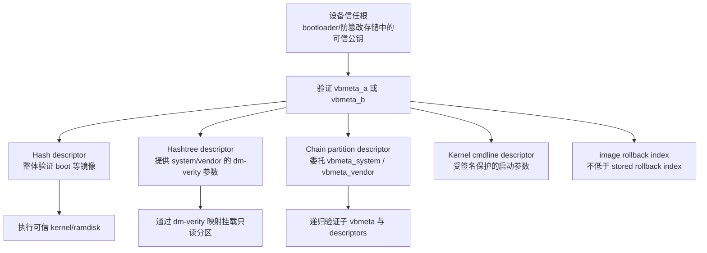
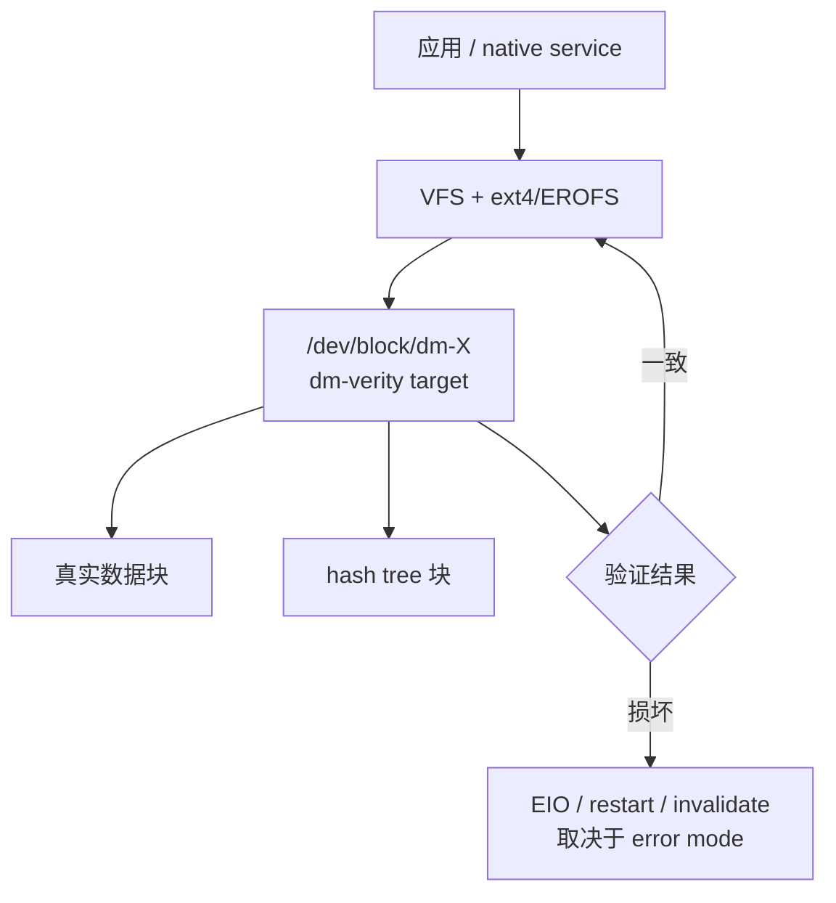
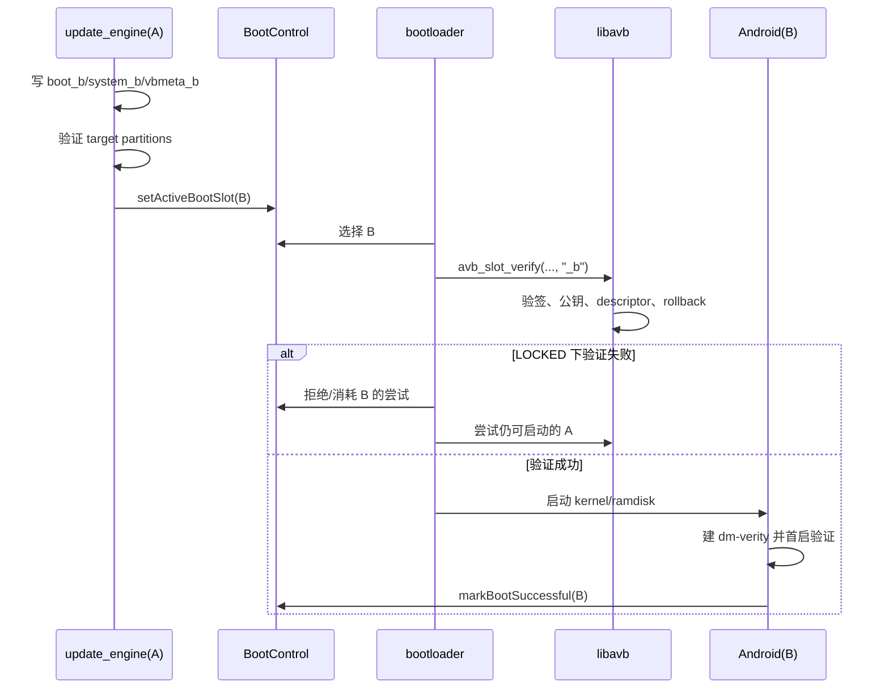

# 83 AVB 2.0、vbmeta、dm-verity 与 rollback index 启动验证链路

> 源码版本：Android 11 / API 30 / `android-11.0.0_r48`  
> 学习方式：macOS 只读源码，不解锁、不刷写、不修改 rollback index  
> 前置章节：80 APEX、81 checkpoint、82 A/B OTA

---

## 1. 本章解决什么问题

第 82 章结束在：

```text
update_engine 把新系统写入 slot B
  → 校验目标镜像
  → setActiveBootSlot(B)
  → 重启
```

但“B 被设为 active”只代表 bootloader 应优先尝试它，不代表 B 天然可信。启动前仍需回答：

1. `boot_b` 是否来自设备信任的发布者？
2. `system_b`、`vendor_b` 是否被篡改？
3. 大型分区怎样避免每次开机完整读取一遍？
4. 启动后发生位翻转，怎样在真正读取时发现？
5. 攻击者能否刷回一个签名合法但有已知漏洞的旧版本？

AVB 2.0（Android Verified Boot 2.0）建立的信任链是：

```text
设备信任根
  → 验证 vbmeta 签名和签名公钥
  → 信任 vbmeta 中的 descriptors
  → 整体验证 boot 等镜像
  → 为 system/vendor 建立 dm-verity
  → 检查 rollback index，拒绝安全版本倒退
```

---

## 2. 完整信任链总图



最重要的因果关系：

```text
先验证 vbmeta 的签名以及签名公钥是否可信
  → 才能相信 descriptors 中的 digest、root digest、分区名和参数
```

若直接相信未验证 vbmeta 里的 digest，攻击者可以同时替换分区和 digest，验证毫无意义。

---

## 3. 本章源码地图

| 路径 | 作用 |
|---|---|
| `external/avb/README.md` | AVB 设计、构建、boot flow、rollback 和错误处理 |
| `external/avb/avbtool.py` | 生成/检查 vbmeta、hash footer、hashtree footer |
| `external/avb/libavb/avb_vbmeta_image.h` | VBMeta header 二进制格式 |
| `external/avb/libavb/avb_descriptor.h` | descriptor 公共头 |
| `avb_hash_descriptor.h` | 整体镜像 hash 描述 |
| `avb_hashtree_descriptor.h` | dm-verity hashtree 描述 |
| `avb_chain_partition_descriptor.h` | 子 vbmeta 授权委托 |
| `avb_slot_verify.c/.h` | 验证一个 slot 的核心算法与输出 |
| `avb_ops.h` | libavb 所需的设备 I/O、锁状态与安全存储能力 |
| `system/core/fs_mgr/libfs_avb` | Android userspace 读取 vbmeta、查 descriptor、建 AVB 映射 |
| `system/core/init/first_stage_mount.cpp` | first-stage init 的早期分区挂载 |
| `bootable/recovery/update_verifier` | 新槽首启后用 care map 主动读取关键块 |

`system/core/fs_mgr/fs_mgr_verity.cpp` 还包含 legacy verity 路径。本章重点是 AVB 2.0 的 `libfs_avb`，不要混用两套 metadata 格式。

---

## 4. Verified Boot 不等于加密

AVB 主要保证 authenticity（来源可信）和 integrity（内容完整），不隐藏 system 内容。

| 机制 | 解决的问题 |
|---|---|
| 数字签名 | metadata 是否由受信任私钥签发 |
| cryptographic hash | 内容是否和签名描述一致 |
| dm-verity | 运行时读取的数据块是否仍一致 |
| rollback protection | 是否退回低于安全下限的旧版本 |
| FBE | 无用户密钥时能否读取用户数据 |

所以 dm-verity 不是磁盘加密，AVB 也不能替代 FBE。

---

## 5. 信任根究竟在哪里

`vbmeta.img` 自己带有公钥、hash、signature 和 descriptors。但“自带公钥”并不能自动证明可信：攻击者也能生成新密钥并重签恶意镜像。

`AvbOps` 要求平台实现：

```c
AvbIOResult (*validate_vbmeta_public_key)(
    AvbOps* ops,
    const uint8_t* public_key_data,
    size_t public_key_length,
    const uint8_t* public_key_metadata,
    size_t public_key_metadata_length,
    bool* out_is_trusted);
```

典型 bootloader 将 vbmeta 带来的公钥与设备内置、熔丝绑定或防篡改存储中的 key material 比较。因此必须区分：

```text
签名数学正确：signature 可由 vbmeta 携带的公钥验证
签名公钥可信：设备独立信任根认可这把公钥
```

LOCKED 设备必须同时满足两者。私钥属于构建/签名系统，不应放在终端设备里。

---

## 6. vbmeta.img 的三段结构

`AvbVBMetaImageHeader` 注释描述了：

```text
+----------------------------------+
| Header data，固定 256 bytes      |
+----------------------------------+
| Authentication data             |
|   hash + signature               |
+----------------------------------+
| Auxiliary data                  |
|   public key + key metadata      |
|   descriptors                    |
+----------------------------------+
```

Header 中的重要字段：

| 字段 | 含义 |
|---|---|
| `magic` | 四字节 `AVB0` |
| `required_libavb_version_*` | 验证所需最低 libavb 版本 |
| `algorithm_type` | hash/签名算法组合 |
| `hash_offset/hash_size` | authentication block 中的 hash |
| `signature_offset/signature_size` | signature 位置与长度 |
| `public_key_offset/public_key_size` | auxiliary block 中的公钥 |
| `descriptors_offset/descriptors_size` | descriptors 区域 |
| `rollback_index` | 这份 VBMeta 的防降级值 |
| `flags` | 顶层 vbmeta 的 hashtree/verification disabled 标志 |

源码明确警告：`avb_vbmeta_image_verify()` 成功前，不得信任或使用 header 内容。

---

## 7. 签名覆盖了什么

简化模型：

```text
digest = HASH(Header + Auxiliary data)
signature = Sign(private_key, digest)
```

验证大致执行：

1. 检查 magic、版本、算法、offset 和 size；
2. 重算 header + auxiliary data 的 hash；
3. 比较 authentication block 中的 hash；
4. 用携带的公钥验证 signature；
5. 再让设备判断公钥是否可信。

descriptors 位于 auxiliary data，所以改动 root digest、分区名或 chain 授权都会使签名验证失败。

---

## 8. descriptor 是被签名保护的“验证说明”

每个 descriptor 先有公共头：

```text
tag
num_bytes_following
```

常见类型：

| 类型 | 描述内容 |
|---|---|
| Hash | 某个镜像的整体 hash |
| Hashtree | 大分区的 Merkle tree、root digest、dm-verity 参数 |
| Chain Partition | 子 vbmeta 分区、授权公钥、rollback location |
| Kernel Cmdline | 应加入启动命令行的受保护参数 |
| Property | 受签名保护的 key/value metadata |

descriptor 不是分区内容，而是“去哪里、按什么参数、期待什么结果”的可信描述。

---

## 9. Hash descriptor：适合 boot 等小镜像

`AvbHashDescriptor` 的主要字段：

```c
uint64_t image_size;
uint8_t  hash_algorithm[32];
uint32_t partition_name_len;
uint32_t salt_len;
uint32_t digest_len;
uint32_t flags;
```

结构后紧跟 partition name、salt、digest。验证可简化为：

```text
读取 image_size 字节
  → HASH(salt + image bytes)
  → 与 descriptor.digest 比较
```

它典型用于 boot image：bootloader 本来就需要把 kernel/ramdisk 读入内存，顺便整体 hash。任意一字节变化都会导致 digest 不匹配。

---

## 10. 为什么 system 使用 hashtree

若 system 有数 GiB，每次启动前完整读取会拖慢启动；启动后才发生的位翻转也无法被那次 hash 发现。

Hashtree 的思路：

```text
不在挂载前读完整个分区
  → 真正读取某个块时，验证它到可信 root digest 的路径
```

这既避免启动时全盘扫描，也提供持续的运行时完整性检查。

---

## 11. Merkle tree 直觉图

```text
D0  D1  D2  D3
│   │   │   │
h0  h1  h2  h3      hN = HASH(data block N)
 \ /     \ /
 H01     H23
    \   /
      R             root digest
```

读取 D2 时只需验证 D2、h2、H23 到 R 的路径，不必重新读取全部数据块。攻击者不能修改 D2 后只改 h2，因为继续向上修改最终会撞上被可信 vbmeta 保护的 root digest。

---

## 12. Hashtree descriptor 有哪些信息

`AvbHashtreeDescriptor` 记录：

- `dm_verity_version`；
- `image_size`；
- `tree_offset/tree_size`；
- `data_block_size/hash_block_size`；
- FEC 的 roots、offset、size；
- hash algorithm；
- partition name、salt、root digest；
- A/B flags。

简化布局：

```text
+----------------------+ image_size
| filesystem data      |
+----------------------+ tree_offset
| Merkle hash tree     |
+----------------------+ fec_offset（若启用）
| FEC parity data      |
+----------------------+
| AVB footer（某些布局）|
+----------------------+
```

`tree_offset` 是位置参数，不是信任根；真正锚定整棵树的是签名保护的 root digest。

---

## 13. dm-verity 在哪里执行



文件系统挂载 dm-verity 映射，而非绕过验证直接挂原始分区。libavb 提供可信参数，fs_mgr 建立 mapping，内核 dm-verity 在实际读块时执行验证。

---

## 14. bootloader 与 first-stage init 的分工

常见 Android 11 主线：

```text
bootloader
  → 选择 slot
  → avb_slot_verify(..., suffix="_b")
  → 验证顶层/链式 vbmeta、boot 等启动必需内容
  → 传递已验证的启动信息
  → 执行 kernel + ramdisk

first-stage init / fs_mgr
  → 解析 fstab 的 logical、first_stage_mount、avb
  → 建 logical partition 映射
  → 查找可信 hashtree descriptor
  → 创建 dm-verity device
  → 挂载 system/vendor/product
```

设备布局会不同。核心要求不是“所有 descriptor 必须由同一组件解析”，而是传给 fs_mgr/内核的 root digest 必须来自已验证信任链。

---

## 15. fstab 的三个关键标志

概念示例：

```text
system /system ext4 ro wait,logical,first_stage_mount,avb
```

- `logical`：先用 super metadata 建 dm-linear/snapshot 等逻辑映射；
- `first_stage_mount`：完整 Android userspace 启动前处理；
- `avb`：按 AVB hashtree descriptor 建验证映射。

可能形成叠层：

```text
filesystem
  → dm-verity（完整性）
  → dm-linear / dm-snapshot（逻辑或 Virtual A/B 视图）
  → physical blocks
```

它们都可能叫 `/dev/block/dm-*`，但 Device Mapper target 完全不同。

---

## 16. avb_slot_verify() 主流程

```text
加载顶层 vbmeta + A/B suffix
  → 检查格式、hash、signature
  → validate_vbmeta_public_key
  → read_rollback_index(location)
  → 比较 image/stored rollback index
  → 遍历 descriptors
      ├─ Hash：加载并校验 requested partition
      ├─ Hashtree：收集 dm-verity 参数
      ├─ Chain：递归加载子 vbmeta
      └─ Cmdline：构造受保护参数
  → 返回 AvbSlotVerifyData
```

结果会区分 I/O error、verification error、rollback error、public key rejected、invalid metadata、unsupported version 等。它们不是同义词，排障时不能都写成“AVB 挂了”。

---

## 17. AvbOps：算法与硬件实现的边界

libavb 不知道怎样读 UFS，也不知道安全计数器位于哪里。平台实现的 `AvbOps` 包括：

```text
read_from_partition / get_preloaded_partition
validate_vbmeta_public_key
read_rollback_index / write_rollback_index
read_is_device_unlocked
get_unique_guid_for_partition
read/write_persistent_value
```

所以：

```text
libavb：格式、密码学、descriptor 和通用验证算法
AvbOps：真实 I/O、信任根、锁状态、安全存储
```

只看 AOSP 通用 libavb，无法确认某厂商的 key 和 rollback index 是否真的存得安全。

---

## 18. Chain descriptor：信任委托

```text
vbmeta
  ├─ chain → vbmeta_system（system/system_ext/product）
  └─ chain → vbmeta_vendor（vendor/odm）
```

`AvbChainPartitionDescriptor` 保存 partition name、public key 和 rollback index location。递归过程：

```text
验证顶层 vbmeta
  → 信任 chain descriptor
  → 读取 vbmeta_system_b
  → 用 descriptor 授权的 key 验证
  → 按指定 location 检查 rollback
  → 信任其中的 system descriptors
```

这让不同组织可以独立签发 system/vendor 子树，同时顶层仍掌握委托边界。

---

## 19. rollback index 防什么

签名只能证明“曾由可信发布者签过”，不能证明“足够新”。版本 10 和 12 都可能签名合法，但 10 已有公开漏洞。

```text
image rollback_index[n] >= stored_rollback_index[n]  → 可接受
image rollback_index[n] <  stored_rollback_index[n]  → 拒绝
```

它是发布流程定义的安全版本下限，不一定等于 Android 版本号、build number 或日期。

---

## 20. 为什么有多个 rollback location

顶层、system 和 vendor 更新节奏不同，共用一个数字会互相阻塞。源码允许多个 location：

```text
location 0 → top-level vbmeta
location 1 → vbmeta_system
location 2 → vbmeta_vendor
```

这是示意，真实映射由产品配置决定。location 是安全计数器槽位，绝不是 A/B slot number；location 1 不等于 slot B。

---

## 21. 为何不能验证新槽后立刻提高 stored index

假设：

```text
A rollback=10，稳定可启动
B rollback=12，刚写完未首启
stored 立刻写为 12
  → B 首启失败
  → 想回 A
  → A 的 10 < stored 12
  → A 也被防降级拒绝
```

`AvbSlotVerifyData` 的注释明确说：`avb_slot_verify()` 只返回本槽观察到的 `rollback_indexes[]`，绝不会调用 `write_rollback_index()`。提交时机由调用者结合 A/B policy 决定。

`external/avb/README.md` 对 Android 这类 A/B HLOS 给出的推荐规则更具体：只从
A/B metadata 中已经标为 `SUCCESSFUL` 的槽更新 stored rollback indexes。这样表达比
笼统的“AVB 验证通过后更新”多了一道关键的启动成功门槛。最终写入动作仍由
bootloader/设备策略实现，AOSP 通用 `avb_slot_verify()` 不替厂商提交。

---

## 22. stored index 必须防篡改

如果攻击者能把 stored value 从 12 改回 1，防降级就失效。因此 README 要求 rollback indexes、可信 key、LOCKED/UNLOCKED 状态和 named persistent values 使用 tamper-evident storage。

实现可用 RPMB、TEE、安全元件或受 bootloader 保护的存储；AOSP 只定义 `AvbOps` 能力，不强制同一种介质。还必须考虑掉电一致性与单调性。

---

## 23. LOCKED 与 UNLOCKED

```text
LOCKED：verification error 是致命错误
UNLOCKED：可设置 ALLOW_VERIFICATION_ERROR，允许启动未验证内容
```

UNLOCKED 不等于 AVB 代码完全不运行；验证仍可执行并报告失败，只是 boot policy 允许继续。

锁状态转换通常要求物理确认，并清除 userdata 和相关状态，避免不可信系统继承用户秘密。bootloader LOCKED 与屏幕锁密码毫无同义关系：前者控制刷写和启动信任，后者保护用户认证/FBE。

---

## 24. Green、Yellow、Orange

| 状态 | 含义 |
|---|---|
| green | LOCKED，且 key 不是用户设置的 custom key |
| yellow | LOCKED，但使用用户设置的 custom root of trust |
| orange | UNLOCKED |

常见属性：

```text
ro.boot.verifiedbootstate
ro.boot.vbmeta.device_state
ro.boot.veritymode
ro.boot.vbmeta.digest
ro.boot.vbmeta.hash_alg
ro.boot.vbmeta.size
```

它们是 bootloader 验证结论的传递结果，不是信任根本身。green 也不表示所有 system 块已在开机前读完。

---

## 25. vbmeta digest 的意义

AVB 可对顶层及所有 chained VBMeta structs 计算总体 digest，并通过 `androidboot.vbmeta.digest` 传入 Android。userspace 可借此核对自己看到的 vbmeta 集合是否与 bootloader 验证的一致。

它不等于 system 全分区的直接 hash；它覆盖 VBMeta structs，而其中的 descriptors 再锚定 boot digest 和 system root digest。

---

## 26. dm-verity 发现坏块后

`AvbHashtreeErrorMode` 包括：

- `RESTART_AND_INVALIDATE`；
- `RESTART`；
- `EIO`；
- `LOGGING`（仅诊断/允许错误）；
- `MANAGED_RESTART_AND_EIO`。

Managed mode 的意义：先用重启应对瞬态问题；如果确认重启由 verity corruption 导致，再转 EIO，避免永久坏块造成无限 boot loop。最终是否退槽还要结合 bootloader、BootControl 和产品策略。

---

## 27. FEC 的边界

Hashtree descriptor 可带 Forward Error Correction 参数：

```text
读块 hash 不匹配
  → 尝试用冗余 FEC 重建
  → 重建结果仍必须通过 Merkle tree
```

FEC 提升可靠性，不是信任根，也不能让恶意修改合法化。损坏超过纠错能力仍进入 verity error policy。

---

## 28. update_engine、AVB 与 dm-verity为何不重复

| 阶段 | 机制 | 目标 |
|---|---|---|
| OTA 应用中 | payload signature、operation hash | 更新输入与每步操作正确 |
| OTA 写完 | FilesystemVerifier target hash | 目标镜像写成预期结果 |
| 下一次启动 | bootloader + libavb | 从硬件信任根认证即将执行的槽 |
| 运行时 | dm-verity | 按实际读取持续发现分区损坏 |
| 新槽首启 | update_verifier care map | 尽早读取关键范围，暴露潜在坏块 |

每一层运行时机、信任边界和故障模型不同，是纵深防御。

---

## 29. update_verifier 如何补充 dm-verity

dm-verity 通常在读到块时才验证。一个长期未访问的坏块可能在槽被标 successful 后才暴露。

```text
新槽首启
  → update_verifier 解析 care_map.pb
  → 主动读取关键分区范围
  → 读取穿过 dm-verity
  → 尽早触发 hash 检查
  → 根据 checkpoint 支持情况配合 markBootSuccessful
```

它没有重写 Merkle 算法，而是用真实 verified device 读取促使内核执行检查。

---

## 30. AVB 与 A/B 拼接图



BootControl 回答“选哪个槽、试几次”，AVB 回答“该槽内容是否可信且不低于安全下限”。

---

## 31. AVB 与 Virtual A/B

Virtual A/B 的 target 逻辑内容可能来自旧 base 与 COW：

```text
filesystem
  → dm-verity：按新版本 root digest 验证
  → dm-snapshot：从 base/COW 拼出新版本逻辑视图
  → physical storage
```

merge 改变物理来源，但上层逻辑内容和 root digest 不应变化。dm-snapshot 解决视图/回滚，dm-verity 解决内容完整性。

---

## 32. AVB 与 APK/APEX 签名边界

| 层级 | 验证对象 |
|---|---|
| AVB | 分区镜像与启动 metadata |
| APEX payload key | APEX 内部文件系统 |
| APEX 外层签名 | APEX container |
| APK signature | 单个应用与升级连续性 |

AVB 证明 system 分区整体可信，但 `/data/app` 中的应用更新不在 system hashtree 内，仍需 APK 签名。APEX 也需要模块级独立签名和激活策略。

---

## 33. 两个 disabled flag 不一样

```c
AVB_VBMETA_IMAGE_FLAGS_HASHTREE_DISABLED
AVB_VBMETA_IMAGE_FLAGS_VERIFICATION_DISABLED
```

- hashtree disabled：顶层 `vbmeta` 仍会验签、descriptors 仍会处理，但生成的启动参数会把
  hashtree 校验模式置为 disabled，系统不再建立正常的 dm-verity 校验路径；
- verification disabled：并不是“连顶层 `vbmeta` 都不读”。`avb_slot_verify()` 仍验证顶层
  `vbmeta` 结构并识别这个 flag，随后不再处理 descriptors，而是直接装载调用者请求的分区。
  若该位由 `avbctl disable-verification` 设置，libavb 文档还明确说明返回值会是
  `AVB_SLOT_VERIFY_RESULT_ERROR_VERIFICATION`，是否继续启动取决于调用方/设备解锁策略。

这些顶层标志会影响启动参数与 fs_mgr。正常 LOCKED 生产设备不应随意接受关闭验证的镜像。本计划只读源码，不在真实设备尝试 `disable-verity`、写 vbmeta 或重锁 bootloader。

---

## 34. 十个常见误解

1. **vbmeta 保存整个 system**：错，它保存签名 metadata/descriptors。
2. **vbmeta 自带公钥所以可信**：错，设备须独立认可该 key。
3. **hash 与 hashtree 只差性能**：不完整，hashtree 还提供运行时按块验证。
4. **dm-verity 加密 system**：错，它保证完整性，不保证保密。
5. **rollback index 就是 Android 版本号**：错，它是发布方定义的单调安全值。
6. **location 1 就是 slot B**：错，location 与 A/B 是两套维度。
7. **新槽验过就立即提交 stored index**：危险，会封死旧槽回退。
8. **UNLOCKED 完全不跑 AVB**：错，通常只是允许错误非致命。
9. **update_engine 验过就可跳过 bootloader AVB**：错，重启需重建信任根。
10. **dm-linear、dm-snapshot、dm-verity 是一回事**：错，它们是可叠加的不同 target。

---

## 35. Mac 上七轮只读练习

### 第一轮：VBMeta 格式

```bash
sed -n '55,205p' external/avb/libavb/avb_vbmeta_image.h
```

回答三段分别装什么，descriptor 为什么受到签名保护。

### 第二轮：hash 对比 hashtree

```bash
sed -n '35,170p' external/avb/libavb/avb_hash_descriptor.h
sed -n '35,190p' external/avb/libavb/avb_hashtree_descriptor.h
```

找出 hashtree 多出的 tree/block/FEC 参数。

### 第三轮：顶层验签与 key 信任

```bash
rg -n "load_and_verify_vbmeta|avb_vbmeta_image_verify|validate_vbmeta_public_key" \
  external/avb/libavb/avb_slot_verify.c
```

分别标注密码学验证和设备信任判断。

### 第四轮：rollback

```bash
sed -n '850,895p' external/avb/libavb/avb_slot_verify.c
rg -n "rollback_indexes|NEVER|write_rollback_index" \
  external/avb/libavb/avb_slot_verify.h external/avb/README.md
```

确认比较方向及 verifier 不直接提交的原因。

### 第五轮：chain

```bash
sed -n '35,150p' external/avb/libavb/avb_chain_partition_descriptor.h
sed -n '980,1050p' external/avb/libavb/avb_slot_verify.c
```

追 partition、public key、rollback location。

### 第六轮：fs_mgr 映射

```bash
rg -n "LoadAndVerifyVbmeta|SetUpAvbHashtree|AvbHandle|first_stage_mount" \
  system/core/init/first_stage_mount.cpp system/core/fs_mgr
rg -n 'CheckFlag\("avb"|CheckFlag\("logical"|CheckFlag\("first_stage_mount"' \
  system/core/fs_mgr/fs_mgr_fstab.cpp
```

串起 fstab、logical device、descriptor、dm-verity。

### 第七轮：新槽首启

```bash
rg -n "ParseCareMap|VerifyPartitions|markBootSuccessful|supportsCheckpoint" \
  bootable/recovery/update_verifier/update_verifier.cpp
```

解释支持 checkpoint 时为何延迟成功标记。

---

## 36. 只读排障证据

```bash
adb shell getprop ro.boot.verifiedbootstate
adb shell getprop ro.boot.vbmeta.device_state
adb shell getprop ro.boot.veritymode
adb shell getprop ro.boot.vbmeta.digest
adb shell getprop ro.boot.slot_suffix
adb shell cat /proc/cmdline
adb shell dmctl list devices
```

不同 build/权限可能不可用。分层判断：

| 现象 | 优先检查 |
|---|---|
| bootloader 立即拒绝槽 | signature、trusted key、rollback、suffix |
| kernel 启动但 system 挂载失败 | fstab、descriptor、logical mapping、verity table |
| 运行一段时间 EIO/重启 | verity corruption、error mode、底层介质 |
| OTA 新槽反复退回 | BootControl tries、AVB、update_verifier、checkpoint |
| 状态 orange | bootloader unlocked，不先误判为单文件损坏 |

不要为验证猜想写 vbmeta、清 rollback index 或重锁设备；不兼容镜像下重锁可能无法启动并清除数据。

---

## 37. 自测题

1. 验签正确后为什么还要验证 public key？
2. VBMeta 三段分别包含什么？
3. descriptor 为什么必须等 vbmeta 验证后使用？
4. Hash descriptor 为什么常用于 boot？
5. root digest 如何保护整棵 Merkle tree？
6. dm-verity 位于文件系统和什么之间？
7. `avb_slot_verify()` 为什么要传 A/B suffix？
8. Chain descriptor 委托了哪三类信息？
9. rollback 比较方向是什么？
10. 为什么 rollback location 不等于 slot number？
11. 为什么不能在新槽首启前鲁莽推进 stored index？
12. bootloader LOCKED 与屏幕锁有何不同？
13. green/yellow/orange 各强调什么？
14. FEC 重建结果为什么还必须过 hashtree？
15. update_engine、AVB、dm-verity 各在哪个阶段工作？
16. Virtual A/B 中 snapshot 与 verity 如何叠加？
17. update_verifier 为什么主动读 care map？
18. verification disabled 与 hashtree disabled 有何区别？

---

## 38. 最终记忆图

```text
【构建】
partition images
  → avbtool 生成 hash/hashtree descriptors
  → descriptors 放入 vbmeta/chained vbmeta
  → 私钥签名 VBMeta struct

【启动】
BootControl 选 B
  → bootloader 读 vbmeta_b
  → 验格式、hash、signature
  → 设备信任根认可 public key
  → image rollback >= stored rollback
  → Hash descriptor 验 boot_b
  → Chain descriptor 递归验子 vbmeta
  → 启动 kernel/ramdisk

【挂载和运行】
first-stage init
  → logical/snapshot mapping
  → fs_mgr 按 Hashtree descriptor 建 dm-verity
  → 挂 system/vendor/product
  → 实际读块沿 Merkle path 验到可信 root digest
  → update_verifier 主动读取 care map
  → 稳定后 markBootSuccessful
  → A/B policy 在安全时机推进 stored rollback index
```

---

## 39. 本章总结

1. 信任从 bootloader/设备持有的 root of trust 开始，而不是从 vbmeta 自带公钥凭空开始；
2. vbmeta 签名保护 descriptors，descriptor 再把信任延伸到分区；
3. Hash descriptor 适合整体加载的小镜像，Hashtree descriptor 适合大型只读分区；
4. dm-verity 按需验证数据块，并最终锚定签名保护的 root digest；
5. bootloader/libavb、first-stage init/fs_mgr、内核 dm-verity 分别负责信任建立、映射配置和运行时执行；
6. Chain descriptor 可把 system/vendor 权限委托给子 key，并隔离 rollback location；
7. rollback 防止合法签名的旧漏洞版本回归，但提交 stored value 必须保留 A/B 回退窗口；
8. LOCKED/UNLOCKED 决定验证错误是否致命，启动颜色描述信任状态；
9. update_engine、AVB、dm-verity、update_verifier 是跨阶段纵深防御。

下一章：**第 84 章——init first-stage mount、fstab、Dynamic Partitions 与 Device Mapper 启动挂载链路**。
