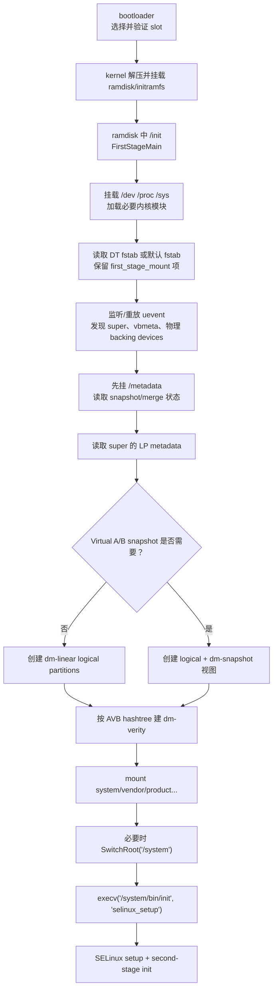
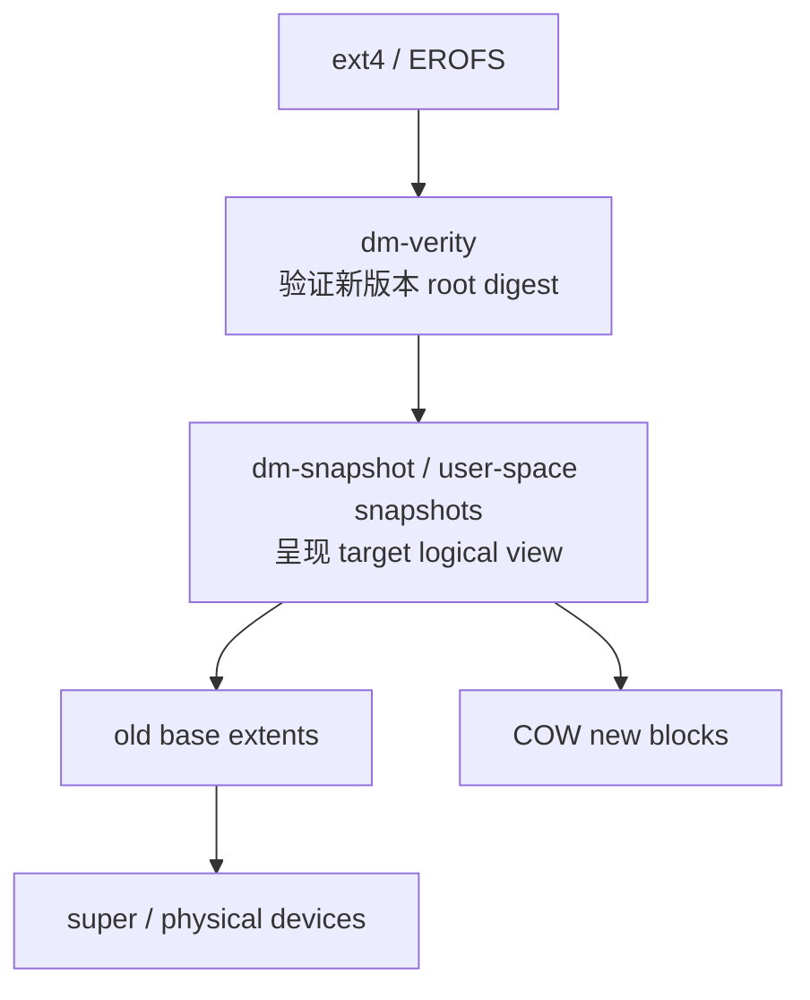

# 84 init first-stage mount、fstab、Dynamic Partitions 与 Device Mapper 启动挂载链路

> 源码版本：Android 11 / API 30 / `android-11.0.0_r48`  
> 学习方式：macOS 只读源码，不修改 fstab、不制作 super、不挂载真实设备镜像  
> 前置章节：81 checkpoint、82 A/B/Virtual A/B、83 AVB/dm-verity

---

## 1. 本章要填上的最后一段空白

第 83 章说明了 bootloader 如何验证新槽，以及 dm-verity 如何保证运行时块完整性。但还有一个关键问题：

```text
super 是一大块物理空间
vbmeta 里只有可信验证说明
fstab 里只有挂载配置

它们怎样变成：
/system
/vendor
/product
/system_ext
？
```

答案位于 init 的 first stage：它在完整 Android userspace 尚未存在时，发现块设备、解析 first-stage fstab、读取 logical partition metadata、创建 Device Mapper 设备、叠加 snapshot 与 verity，最后挂载系统分区并执行 `/system/bin/init`。

---

## 2. 一张完整启动挂载图



顺序不能随意交换。例如 snapshot 状态在 `/metadata`，所以源码明确先挂 `/metadata`，再决定怎样创建 logical partitions。

---

## 3. 本章源码地图

| 路径 | 作用 |
|---|---|
| `system/core/init/main.cpp` | 区分 first stage、SELinux setup、second stage |
| `system/core/init/first_stage_init.cpp` | ramdisk 中 first-stage init 主流程 |
| `system/core/init/first_stage_mount.cpp` | 设备发现、逻辑分区、verity、挂载与切根 |
| `system/core/init/block_dev_initializer.cpp` | uevent 驱动的块设备初始化 |
| `system/core/init/uevent_listener.cpp` | netlink uevent 监听与 `/sys` 冷启动重放 |
| `system/core/init/devices.cpp` | 处理 device event、创建 `/dev` 节点/链接 |
| `system/core/init/switch_root.cpp` | 移动已有 mount、切换根目录 |
| `system/core/fs_mgr/fs_mgr_fstab.cpp` | fstab 读取、flag 解析、slotselect 处理 |
| `system/core/fs_mgr/fs_mgr_dm_linear.cpp` | 从 LP metadata 建 dm-linear table/device |
| `system/core/fs_mgr/liblp` | Dynamic Partition metadata 格式与读写 |
| `system/core/fs_mgr/libfs_avb` | vbmeta/hashtree 查找与 dm-verity 设置 |
| `system/core/fs_mgr/libsnapshot` | Virtual A/B logical + snapshot 映射 |
| `system/core/fs_mgr/libdm` | Device Mapper table 和 ioctl 封装 |

---

## 4. 为什么 init 要分 first stage 和 second stage

开机最早期存在循环依赖：

```text
要启动完整 init，需要 /system/bin/init 和系统库
要访问 /system，需要先发现设备、建立 dm mapping、验证并挂载
执行这些动作的代码又必须先能运行
```

解决方式是在 boot ramdisk/initramfs 放一个足够自包含的 `/init` 与所需库/配置：

```text
first stage：最小环境，负责让系统分区可用
selinux_setup：装载/编译策略并切换执行阶段
second stage：解析 rc、启动属性服务、ueventd 和各种 daemon
```

这里不是创建了三个 PID 1。源码最后使用 `execv()` 替换当前进程映像，正常路径仍是同一个 PID 1 跨阶段执行。

---

## 5. main.cpp 怎样选择阶段

概念逻辑：

```text
argv[1] == "selinux_setup"
  → SetupSelinux

argv[1] == "second_stage"
  → SecondStageMain

否则
  → FirstStageMain
```

first stage 最后执行：

```cpp
const char* path = "/system/bin/init";
const char* args[] = {path, "selinux_setup", nullptr};
execv(path, const_cast<char**>(args));
```

这行也是第一阶段完成标准：系统根已经可访问，`/system/bin/init` 能被内核加载执行。

---

## 6. FirstStageMain 先搭什么最小环境

完整服务尚未启动，它直接用系统调用建立：

- `/dev` tmpfs、`/dev/pts`；
- `/proc`；
- `/sys` 与 `selinuxfs`；
- `/dev/kmsg`、random、null 等基础节点；
- `/mnt` tmpfs 以及 `/mnt/vendor`、`/mnt/product`；
- `/debug_ramdisk`；
- kernel logging。

然后加载 ramdisk 中列出的必要 kernel modules。原因是 UFS、device-mapper、文件系统等驱动若为模块，设备节点和挂载都依赖它们。

这时常规 `ueventd` 服务还没启动，所以 first stage 自己承担早期设备发现和 dm 节点初始化。

---

## 7. fstab 到底是什么

fstab 的每一项把五类信息连起来：

```text
块设备来源
挂载点
文件系统类型
mount flags/options
fs_mgr flags
```

概念示例：

```text
system /system ext4 ro,barrier=1 wait,slotselect,logical,first_stage_mount,avb
```

不要把最后两列混淆：

- `ro`、`nosuid` 等是内核 mount flags/options；
- `wait`、`logical`、`avb` 等由 fs_mgr 解释，决定 mount 前还要做哪些准备。

---

## 8. first-stage fstab 从哪里来

`ReadFirstStageFstab()` 的策略：

```text
优先 ReadFstabFromDt()
  → 成功：使用 device tree fstab

否则 ReadDefaultFstab()
  → 从默认 fstab 读取
  → 只保留 first_stage_mount 标记项
```

因此不能假定所有设备都从同一个 `/vendor/etc/fstab.*` 路径开始。第一阶段还没挂 vendor，启动必要信息必须能从当时可访问的 DT/ramdisk 配置获得。

Android 版本和设备 launch 配置会改变推荐位置，读本工程必须以 `ReadFirstStageFstab()` 分支为准。

---

## 9. 常见 fs_mgr flags

| flag | 第一阶段含义 |
|---|---|
| `first_stage_mount` | 由 early init 挂载 |
| `wait` | 等待块设备出现 |
| `slotselect` | 给块设备名应用当前 slot suffix |
| `slotselect_other` | 使用另一槽 suffix |
| `logical` | 名称指向 super metadata 中的 logical partition |
| `avb` | 建立 AVB hashtree/dm-verity |
| `avb_keys=` | 使用 standalone image 的额外 AVB key |
| `nofail` | 挂载失败可继续 |
| `formattable` | 某些失败可作为可格式化分区处理，而非立刻致命 |
| `checkpoint=` | 第 81 章的文件系统/块级 checkpoint |

`nofail` 不该随意加到系统关键分区，否则可能把明确启动错误变成稍后更难理解的缺文件故障。

---

## 10. slotselect 发生在什么层

fstab 可能写不带后缀的逻辑名，fs_mgr 根据当前槽改成目标：

```text
system + current suffix _b → system_b
vendor + current suffix _b → vendor_b
```

这必须和 bootloader 实际启动槽一致，否则可能出现：

```text
kernel/boot 来自 B
system 却错误挂 A
```

AVB descriptor、LP metadata slot 和 fstab suffix 必须共同指向一致的启动集合。

`slotselect_other` 常用于明确需要操作另一槽的场景，不等价于“自动回退”。

---

## 11. 为什么 first stage 自己处理 uevent

内核发现 UFS/eMMC 分区时通过 netlink 发送 uevent。正常系统由 ueventd 创建 `/dev/block/...`，但 first stage 早于 ueventd。

`BlockDevInitializer` + `UeventListener` 会：

1. 初始化 Device Mapper control device；
2. 监听新的 uevent；
3. 扫描 `/sys` 触发 coldboot/regenerate；
4. 匹配所需 partition name；
5. 创建节点或 by-name symlink；
6. 直到 super、vbmeta、metadata 等必需设备齐全或超时。

它不是扫描整个 `/dev` 猜测哪个能挂，而是先由 fstab/AVB 计算需求集合，再等待对应设备。

---

## 12. InitDevices 的需求集合

`FirstStageMount::InitDevices()` 大意：

```text
若存在 logical entry
  → 加入 super partition name

若需要 AVB
  → 加入 vbmeta/chained vbmeta 的物理设备

加入其他非 logical fstab block devices
  → InitRequiredDevices(set)
```

logical partition 尚不存在，不能期待 coldboot 找到 `system_b` 这种 dm device；此时只找它的物理 backing device（如 super）。logical device 要在读取 metadata 后主动创建。

---

## 13. Dynamic Partitions 解决什么

传统 GPT 为 system、vendor、product 分别划定固定大小：system 缺空间而 vendor 有空闲时也不能直接借用。

Dynamic Partitions 引入物理容器 `super`：

```text
super physical space
  ├─ system_a extents
  ├─ vendor_a extents
  ├─ product_a extents
  ├─ system_b extents
  └─ free/可重新分配空间
```

逻辑分区不是普通目录，也不是在 super 内再建 GPT。它们由 LP metadata 描述多个 extent，开机时映射成独立块设备。

---

## 14. super 的 metadata 布局

源码注释给出：

```text
+--------------------+
| Reserved / Geometry|
+--------------------+
| Geometry Backup    |
+--------------------+
| Metadata slots     |
+--------------------+
| Backup metadata    |
+--------------------+
| Logical data area  |
+--------------------+
```

`LpMetadataGeometry` 结构本身包含 metadata 最大大小、metadata slot count、logical
block size 和自身 checksum；源码布局还把 geometry **整体再保存一份 backup copy**。
也就是说，“backup”是磁盘布局中的冗余副本，不是 geometry 结构里的一个布尔字段。

Metadata header 指向多张表：

- partitions；
- extents；
- groups；
- block devices。

每个 logical partition 通过 `first_extent_index + num_extents` 引用 extents；extent 再指出目标物理设备、起始 sector、长度和 target type。

---

## 15. metadata slot 与 A/B slot 的关系

A/B 动态分区需要为不同槽保存对应 metadata 视图。`ReadCurrentMetadata()`：

```cpp
uint32_t slot = SlotNumberForSlotSuffix(fs_mgr_get_slot_suffix());
return ReadMetadata(block_device.c_str(), slot);
```

这里 metadata slot 由当前 A/B suffix 选择。但要避免过度简化：

- metadata 有主副本，防止单副本损坏；
- metadata slot count 与备份副本数不是一回事；
- retrofit dynamic partitions 可能使用多个 physical super 设备和特殊 suffix 规则；
- Virtual A/B 还可能让 snapshot metadata 覆盖普通 current metadata 视图。

---

## 16. extent 是什么

一个 `system_b` 不必物理连续：

```text
logical system_b sector 0..999
  → super physical sector 20000..20999

logical system_b sector 1000..1499
  → super physical sector 50000..50499
```

每段映射就是 extent。逻辑空间必须连续，物理位置可以分散。

Linear extent 常映射到 backing block device 某段；zero extent 可提供读零区域等特殊语义。映射的最小单位是 sector，LP metadata 中 sector 固定为 512 bytes，而设备 alignment/logical block size 还会限制合法边界。

---

## 17. dm-linear 怎样把 extents 变成块设备

`CreateLogicalPartitions()` 遍历 metadata partitions，跳过零长度/disabled 项，为每个 partition 构造 `DmTable`：

```text
logical start  length  target=linear  backing_device  physical_start
logical start  length  target=linear  backing_device  physical_start
...
```

然后：

```cpp
DeviceMapper::Instance().CreateDevice(device_name, table, path, timeout);
```

最终出现类似：

```text
/dev/block/mapper/system_b
/dev/block/dm-0
```

两者通常是友好名称与内核 dm 设备的不同访问路径，不是两份数据。

---

## 18. Device Mapper 是框架，不是一种功能

Device Mapper 接收 table，把一个虚拟块地址区间交给 target 处理：

| target | 作用 |
|---|---|
| linear | 把逻辑区间映射到物理区间 |
| verity | 读块时用 hash tree 验证 |
| snapshot / snapshot-origin | 组合 base 与 COW 视图 |
| bow | backup-on-write，用于第 81 章 checkpoint |
| crypt/default-key | 加密映射 |

所以“创建了 dm 设备”信息不足。排障必须知道设备名、table target、上下层依赖和读写属性。

---

## 19. 为什么先挂 /metadata

`MountPartitions()` 的源码注释很直接：

```text
Mount /metadata before creating logical partitions,
since we need to know whether a snapshot merge is in progress.
```

Virtual A/B 状态、snapshot metadata 和 merge 进度需要从 `/metadata` 获得。因此顺序为：

```text
挂 /metadata
  → 判断是否存在 pending snapshot / merge
  → 决定创建普通 dm-linear 还是 logical + snapshot device
```

如果先按普通 LP metadata 暴露 system，再发现其实应从 COW 读取新块，已经选择了错误视图。

---

## 20. 普通 Dynamic Partition 创建路径

无 first-stage snapshot 时：

```text
ReadCurrentMetadata(super_path)
  → InitDmLinearBackingDevices(metadata)
  → CreateLogicalPartitions(metadata, super_path)
  → 每个 logical partition 建 dm-linear
```

`InitDmLinearBackingDevices` 还处理 metadata 指向 super 之外其他 physical block device 的情况，不能假定所有 extent 永远只在一个 `/dev/block/by-name/super` 上。

---

## 21. Virtual A/B 创建路径

`CreateLogicalPartitions()` 先判断：

```cpp
if (SnapshotManager::IsSnapshotManagerNeeded()) {
    auto sm = SnapshotManager::NewForFirstStageMount();
    if (sm->NeedSnapshotsInFirstStageMount()) {
        InitRequiredDevices({"userdata"});
        return sm->CreateLogicalAndSnapshotPartitions(super_path_);
    }
}
```

需要 snapshot 时，COW image 可能位于 userdata，因此要先让 userdata 块设备可用。此处是“块设备可访问”，不等于用户 CE 数据已解锁并正常挂载。

SnapshotManager 会为未 snapshot 的分区建普通 logical mapping，为被更新的分区创建能组合 base 与 COW 的目标视图。

---

## 22. snapshot、verity 的正确叠层方向

对新 system 视图，概念上：



verity 必须验证“文件系统实际看到的新版本逻辑内容”。若把 verity 放在 snapshot 下方，它只能分别看到旧 base 或 COW 的物理碎片，无法用新 system 的 root digest 验证完整 target view。

这个上下层关系也能从调用顺序直接证明：`MountPartitions()` 先调用
`CreateLogicalPartitions()`，Virtual A/B 分支在其中执行
`CreateLogicalAndSnapshotPartitions()`；随后每个 entry 进入 `MountPartition()`，先由
`fs_mgr_update_logical_partition()` 取得已经建立的 target-view dm 路径，再把这个路径
交给 `SetUpDmVerity()`。因此 verity table 的 data device 是 snapshot/linear 所呈现的
完整逻辑视图，而不是某一块裸 COW 数据。

具体 Android 版本可能使用 kernel snapshot 或 userspace snapshot target，原则仍是上层 verified view 对应目标版本。

---

## 23. MountPartition 的精确顺序

源码非常适合背成四步：

```text
1. logical?
   → fs_mgr_update_logical_partition
   → 初始化生成的 dm device node

2. avb/verify?
   → SetUpDmVerity
   → fstab_entry.blk_device 被改为 verity dm path

3. mount
   → fs_mgr_do_mount_one

4. 同一 mount point 有多个候选 fs_type/options?
   → 依次尝试后续 entry
```

因此 fstab entry 不是只读字符串。运行过程中 `blk_device` 会从逻辑名更新为真正 dm 路径，再可能被 verity 替换为更上层 dm 路径。

---

## 24. AVB V2 怎样建立 verity

`FirstStageMountVBootV2::SetUpDmVerity()`：

```text
fstab 有 avb_keys
  → 尝试 standalone vbmeta/key
  → 检查 security patch rollback
  → 失败且同时有 avb flag 时可回退 built-in hashtree

否则有 avb
  → InitAvbHandle()
  → AvbHandle::SetUpAvbHashtree()

成功
  → fstab_entry.blk_device 改成 dm-verity path
  → InitDmDevice 创建 first-stage 可见节点
```

`AvbHandle` 会缓存顶层/chained vbmeta 解析结果，避免每个分区完全重新装载一遍信任链。

---

## 25. 为什么 first stage 要手动 InitDmDevice

Device Mapper ioctl 创建了内核设备，并不保证用户空间对应 `/dev/block/dm-N` 节点和 symlink 已出现。正常由 ueventd 响应 add uevent 创建，但第一阶段 ueventd 还未启动。

因此源码在 dm-linear 或 dm-verity 成功后调用 `block_dev_init_.InitDmDevice(...)`，消费/重放该 dm uevent，让接下来的 `mount(2)` 能打开路径。

“内核 dm table 已创建”和“用户空间设备节点已就绪”是两个完成点。

---

## 26. system-as-root 与传统 /system 切根

源码兼容两种布局：

### system 已经是根

boot ramdisk/系统布局让 `/` 最终直接对应 system root，fstab 不一定单列 `/system`，无需额外切根。

### fstab 明确有 `/system`

`TrySwitchSystemAsRoot()`：

```text
预加载 ramdisk 中 AVB keys
  → MountPartition(/system)
  → SwitchRoot("/system")
```

注释说明：切换后两类设备的后续行为基本统一。

Android 10+ 设备常见 system-as-root，但阅读 Android 11 通用源码仍会看到兼容分支，不能据自己的某台设备断言另一分支是死代码。

---

## 27. SwitchRoot 实际做什么

`SwitchRoot(new_root)` 不是只调用 `chroot()`：

1. 从 `/proc/mounts` 收集已有子挂载；
2. 用 `MS_MOVE` 把 `/dev`、`/proc`、`/sys` 等移到新根对应位置；
3. `chdir(new_root)`；
4. `mount(new_root, "/", MS_MOVE)`；
5. `chroot(".")`。

只 chroot 会改变路径解析根，却不会把新文件系统真正移动为 mount namespace 的 `/`，也可能丢失早先搭好的 `/dev`、`/proc`、`/sys` 视图。

---

## 28. first stage 如何释放旧 ramdisk

`FirstStageMain` 在挂载前保存旧 `/` 的 fd 和 device id，完成 `DoFirstStageMount()` 后比较新旧 root 的 `st_dev`。若发生切根，它递归清理旧 ramdisk 中仍属于旧设备的文件，但不会误删已经 mount 在其下的其他文件系统。

目的：释放 ramdisk 占用内存，同时保留明确搬迁或挂载的内容。debug ramdisk 等需要保存的文件会先复制/移动到专用位置。

---

## 29. 为什么挂载顺序还涉及 /vendor 和 /product

第一阶段不仅要让 `/system/bin/init` 可执行，还要满足 SELinux setup、动态链接和早期策略需要。vendor/product/system_ext 可能提供：

- 分离的 SELinux policy fragments；
- VINTF manifest/matrix；
- early-init 所需配置和库；
- system/vendor 接口对应内容。

fstab 顺序、mount point 与依赖必须正确。`MountPartitions()` 遍历 first-stage entries，对关键项失败通常返回 false，最终触发 fatal，而不是带着半套系统继续。

---

## 30. nofail 与 formattable 的错误边界

源码处理：

```text
MountPartition 失败
  ├─ no_fail → 记录并忽略
  ├─ formattable → 记录并允许后续处理
  └─ 其他关键分区 → return false → first stage fatal
```

这不表示 first stage 会随意格式化 system。`formattable` 表示调用链允许把失败交给可格式化分区的后续策略；真实格式化动作和数据风险仍受其他逻辑控制。

---

## 31. DSU 为什么也进入 first stage

Dynamic System Updates 允许从 image files 启动临时 GSI。`UseDsuIfPresent()`：

```text
检查 active DSU
  → ImageManager map backing images
  → 发布 logical partition names
  → TransformFstabForDsu
  → 用 DSU system/vendor 等替换正常来源
```

它还要处理 AVB public keys 与 rollback 检查。DSU 改的是本次启动分区来源，不等于 OTA 写入另一个物理 A/B 槽。

---

## 32. overlayfs 为什么出现在 first-stage mount

userdebug/eng 开发环境可能使用 overlayfs 给只读 verified 分区提供可写上层。源码会在主体挂载后识别 root entry、准备 scratch partition 并调用 overlayfs mount。

它属于调试能力，不改变生产 LOCKED 设备应保持 AVB/只读语义的原则。看到 `/system` 表面可写时要先检查：

- build type；
- bootloader lock state；
- verity 是否 disabled；
- overlayfs upper/scratch 是否启用。

不要据此推断 system 原始 logical partition 已被直接改写。

---

## 33. “块设备路径”为什么不断变化

同一个 system 数据在不同阶段可能被称为：

```text
fstab logical name: system
LP partition name:  system_b
mapper friendly:    /dev/block/mapper/system_b
kernel dm device:   /dev/block/dm-2
verity upper device:/dev/block/dm-5
mount point:         /system 或 /
```

这些不是五份 system。它们分别是配置名、metadata 名、设备别名、内核节点、上层验证映射和文件系统入口。

排障必须记录“此刻 fstab_entry.blk_device 指向哪一层”，否则很容易对着底层 snapshot device 做文件系统检查，或对着 verity device 误判物理布局。

---

## 34. 挂载不是“文件出现了”这么简单

成功挂载至少经历：

```text
驱动可用
  → 物理设备节点可用
  → metadata 可读且 checksum/版本合法
  → logical/snapshot dm table 创建
  → AVB descriptor 和 verity table 成功
  → 上层 dm node 可用
  → 文件系统 superblock 可读
  → mount flags/options 被内核接受
  → mount namespace 中挂载点建立
```

任一层失败都可能最终表现为“Failed to mount /system”，但根因完全不同。

---

## 35. 与前面三章拼成一条链


记住三种 metadata：

| metadata | 描述什么 | 典型位置 |
|---|---|---|
| BootControl | 选槽 priority/tries/successful | misc/bootloader 专用存储 |
| VBMeta | 签名、digest、hashtree、rollback | vbmeta 分区或镜像附加区 |
| LP metadata | logical partition 到物理 extent 映射 | super metadata 区 |

它们互相配合，但格式和职责完全不同。

---

## 36. 常见误解复读

### 误解一：first-stage init 是 ueventd 启动后的普通 init service

错误。它就是最早期 PID 1 路径，ueventd 尚未作为常规服务运行。

### 误解二：first stage 和 second stage 是两个 init 进程

错误。正常路径通过 exec 替换进程映像，PID 1 延续。

### 误解三：fstab 的 source 一定是现成 `/dev/block` 节点

错误。logical 项只是名字，必须从 super metadata 创建 dm device。

### 误解四：super 是一种大文件系统

错误。它是承载 LP metadata 和多个 logical partition extents 的物理容器，system/vendor 自己才有 ext4/EROFS 等文件系统。

### 误解五：logical partition 必须物理连续

错误。逻辑 sector 连续，底层可由多个 extents 拼接。

### 误解六：metadata slot、A/B slot、metadata backup 是同一概念

错误。A/B 选择 metadata view，backup 提供同一 view 的冗余副本。

### 误解七：dm-X 都是 dm-verity

错误。必须检查 target，可能是 linear、snapshot、bow、crypt 等。

### 误解八：先建普通 dm-linear，再随时补 snapshot 没关系

错误。Virtual A/B 必须从一开始呈现正确 target view，所以要先读 `/metadata` 状态。

### 误解九：verity 应在 snapshot 下方验证旧 base

错误。它要验证文件系统看到的完整新版本逻辑视图。

### 误解十：SwitchRoot 就是 chroot

错误。源码先移动 mount，再移动根 mount，最后才 chroot。

### 误解十一：AVB 成功就表示 mount 一定成功

错误。文件系统类型、superblock、驱动、dm node、mount options 仍可能失败。

### 误解十二：`nofail` 可修复挂载问题

错误。它只改变失败策略，不能修复设备、metadata 或文件系统。

---

## 37. Mac 上八轮只读练习

### 第一轮：看 PID 1 三阶段入口

```bash
sed -n '55,90p' system/core/init/main.cpp
sed -n '250,360p' system/core/init/first_stage_init.cpp
```

找到 `FirstStageMain`、`selinux_setup` 和 `execv`。

### 第二轮：看最小环境

```bash
sed -n '170,285p' system/core/init/first_stage_init.cpp
```

列出 first stage 直接 mount/mknod 的对象，并解释为何不能等 rc service。

### 第三轮：看 fstab 来源和筛选

```bash
sed -n '145,185p' system/core/init/first_stage_mount.cpp
rg -n 'first_stage_mount|slotselect|logical|avb' system/core/fs_mgr/fs_mgr_fstab.cpp
```

画出 DT 与 default fstab 两个分支。

### 第四轮：追 device discovery

```bash
rg -n 'InitDevices|InitRequiredDevices|InitDeviceMapper|InitDmDevice' \
  system/core/init/first_stage_mount.cpp system/core/init/block_dev_initializer.cpp
```

区分 physical device、logical dm device 与用户空间 node。

### 第五轮：读 LP metadata

```bash
sed -n '90,380p' system/core/fs_mgr/liblp/include/liblp/metadata_format.h
```

把 geometry、header、partition、extent、group、block device 六类结构画成引用图。

### 第六轮：追 dm-linear

```bash
sed -n '100,290p' system/core/fs_mgr/fs_mgr_dm_linear.cpp
```

找到 `CreateDmTable`、`CreateLogicalPartition`、`CreateDevice`。

### 第七轮：追 snapshot 分支

```bash
sed -n '290,345p' system/core/init/first_stage_mount.cpp
rg -n 'NeedSnapshotsInFirstStageMount|CreateLogicalAndSnapshotPartitions' \
  system/core/fs_mgr/libsnapshot
```

解释为何需要先挂 metadata，又为何可能先初始化 userdata block device。

### 第八轮：追 verity、mount、switch root

```bash
rg -n 'SetUpDmVerity|SetUpAvbHashtree|MountPartition|TrySwitchSystemAsRoot' \
  system/core/init/first_stage_mount.cpp
sed -n '45,120p' system/core/init/switch_root.cpp
```

画出 logical → snapshot → verity → filesystem → root 的最终层次。

---

## 38. 只读排障方法

设备允许时可观察：

```bash
adb shell cat /proc/mounts
adb shell cat /proc/cmdline
adb shell getprop ro.boot.slot_suffix
adb shell getprop ro.boot.dynamic_partitions
adb shell getprop ro.virtual_ab.enabled
adb shell ls -l /dev/block/mapper
adb shell dmctl list devices
adb shell dmesg | grep -E 'first stage|device-mapper|dm-|verity|snapshot|super'
```

`lpdump` 可解释 LP metadata，但可用性取决于 build/权限。本章不要求从 Mac 真正映射或修改 super image。

诊断顺序：

```text
1. 当前 slot/suffix 对吗？
2. fstab entry 来自哪里、flags 对吗？
3. physical super/vbmeta/metadata node 出现了吗？
4. LP metadata 能读且选择了正确 slot 吗？
5. logical/snapshot dm table 创建了吗？
6. AVB hashtree descriptor 找到了吗？
7. verity dm device/node 出现了吗？
8. filesystem mount 为什么被内核拒绝？
9. 是否成功 SwitchRoot 并 exec system init？
```

---

## 39. 失败阶段速查表

| 日志/现象 | 可能层级 |
|---|---|
| 找不到 super by-name | driver/uevent/GPT/by-name |
| `Could not read logical partition metadata` | super path、metadata slot、checksum/version |
| `Could not create logical partition` | extent/backing device、dm table/ioctl |
| snapshot mapping 失败 | `/metadata` 状态、COW/userdata backing、merge 状态 |
| `Failed to setup verity` | vbmeta/key/descriptor、dm-verity table |
| dm device 创建但路径打不开 | first-stage dm uevent/node 初始化 |
| `Failed to mount /system` | 上层 dm path、fs driver、superblock、mount options |
| `execv /system/bin/init failed` | root/layout、文件缺失、权限、动态加载环境 |

同一句 mount failure 可能是上游八层之一，必须沿依赖反查。

---

## 40. 自测题

1. 为什么完整 init 不能直接等 system 挂载后再启动？
2. first、SELinux setup、second stage 是否是三个 PID？
3. first stage 为什么自己挂 `/dev`、`/proc`、`/sys`？
4. DT fstab 失败后 default fstab 如何筛选？
5. mount flags 与 fs_mgr flags 有何区别？
6. logical entry 为什么不能靠 coldboot 直接找到？
7. super 是文件系统还是物理容器？
8. partition table 与 extent table 怎样关联？
9. metadata slot 与 backup copy 有何不同？
10. dm-linear 如何把分散 extents 呈现为连续设备？
11. 为什么 first stage 必须先挂 `/metadata`？
12. Virtual A/B 为什么可能需要 userdata 块设备但不需要先解锁 CE？
13. snapshot 和 verity 谁应在上层，为什么？
14. `MountPartition()` 在真正 mount 前做哪两类 mapping？
15. Device Mapper ioctl 成功后为什么还要 `InitDmDevice()`？
16. SwitchRoot 为什么要移动 `/dev`、`/proc`、`/sys`？
17. `/dev/block/mapper/system_b` 与 `/dev/block/dm-N` 是两份数据吗？
18. AVB 验证成功后 mount 还可能为何失败？
19. DSU 与 OTA A/B 的分区来源有何区别？
20. BootControl、VBMeta、LP metadata 分别描述什么？

---

## 41. 最终记忆图

```text
bootloader 验证并执行 boot image
  → kernel 挂 ramdisk，执行 /init（PID 1）
  → FirstStageMain 搭 /dev /proc /sys，加载驱动
  → ReadFirstStageFstab
  → 根据 fstab 计算必须出现的 physical devices
  → coldboot/uevent 找 super、vbmeta、metadata
  → 先 mount /metadata
  → 查看 Virtual A/B snapshot/merge 状态
  → ReadCurrentMetadata(super, current slot)
  → 创建 dm-linear 或 logical + snapshot target view
  → fs_mgr_update_logical_partition 更新 blk_device
  → AvbHandle::SetUpAvbHashtree 创建 dm-verity
  → fs_mgr_do_mount_one 挂 system/vendor/product
  → 必要时 SwitchRoot('/system')
  → 清理旧 ramdisk
  → execv('/system/bin/init', 'selinux_setup')
  → second-stage init 才开始完整 rc/service 世界
```

---

## 42. 本章总结

必须掌握：

1. first-stage init 是为打破“init 依赖 system、system 又依赖 init 挂载”的循环；
2. fstab 不只是 mount 参数，还指挥 slot、logical、AVB、checkpoint 等前置工作；
3. first stage 在 ueventd 之前自行发现物理设备并初始化 dm 节点；
4. super 由 LP metadata 把 logical partitions 映射到一个或多个物理 extents；
5. dm-linear 提供连续逻辑块视图，Device Mapper 本身是多 target 框架；
6. `/metadata` 必须先挂，因为 Virtual A/B snapshot/merge 决定本次应暴露的 logical view；
7. 正确层次通常是 filesystem → verity → snapshot/linear → physical blocks；
8. `MountPartition()` 依次完成 logical path、verity path 和真正文件系统 mount；
9. SwitchRoot 会移动已有 mounts 和根 mount，不只是 chroot；
10. first stage 最终 exec `/system/bin/init`，PID 1 才进入 SELinux setup 与 second stage。

下一章：**第 85 章——SELinux 初始化、sepolicy 编译/加载、domain transition 与 Android 启动安全边界**。
