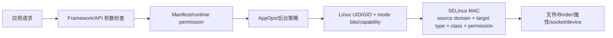
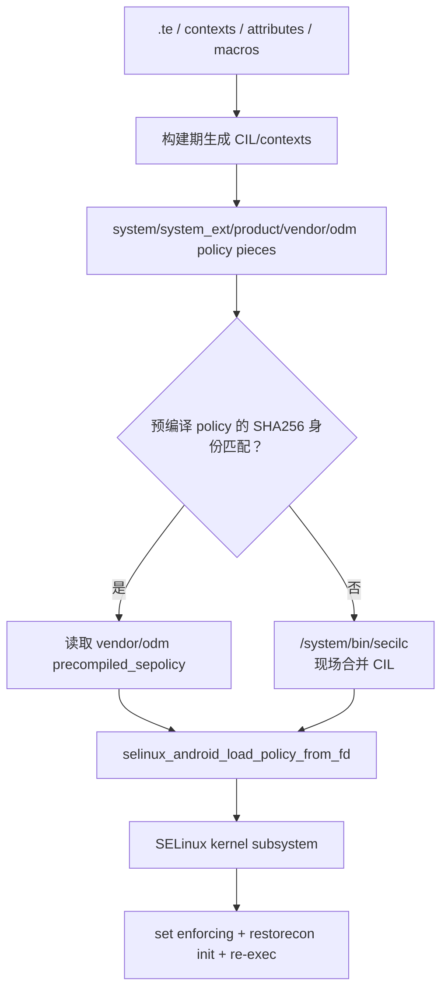
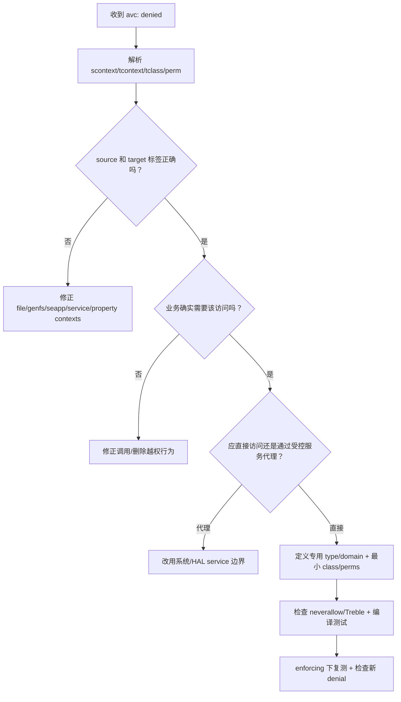

# 85 SELinux 初始化、sepolicy 加载、domain transition 与 Android 启动安全边界

> 源码版本：Android 11 / API 30 / `android-11.0.0_r48`  
> 学习方式：macOS 只读源码，不关闭 enforcing、不批量套用 audit2allow  
> 前置章节：23 Android 权限/AppOps/SELinux 总览、77 property SELinux、84 first-stage mount

---

## 1. 本章从哪一行继续

第 84 章结束于 first-stage init：

```cpp
execv("/system/bin/init", {"/system/bin/init", "selinux_setup", nullptr});
```

此时 system/vendor/product 已经挂载，但 SELinux policy 尚未正式装入内核，init 仍处于 kernel initial domain。接下来要完成：

```text
找出本机应使用的 platform + vendor policy
  → 使用匹配的预编译 policy，或现场调用 secilc 合并
  → 把 binary policy 装入 kernel
  → 切换 enforcing 状态
  → 给 /system/bin/init 恢复正确文件标签
  → 再次 exec，触发 kernel → init domain transition
  → second-stage init 在受策略约束的 init domain 中运行
```

本章还要回答：文件为什么叫 `system_file`，进程为什么叫 `system_server`，Binder service 名字怎样拥有 SELinux type，以及一条 AVC denial 应怎样拆读。

---

## 2. SELinux 在 Android 安全栈中的位置

一次资源访问可能同时经过：



SELinux 是 Mandatory Access Control。即使 UID 是 root、DAC mode 允许，SELinux 仍可拒绝；反过来，SELinux allow 也不会自动绕过 Java 权限、AppOps 或普通 Unix 权限。

所以排障不能看到 `Permission denied` 就只改 SELinux，也不能看到 SELinux allow 就断言业务访问一定成功。

---

## 3. 本章源码地图

| 路径 | 作用 |
|---|---|
| `system/core/init/main.cpp` | `selinux_setup` 与 `second_stage` 入口选择 |
| `system/core/init/selinux.cpp` | policy 选择、编译、加载、enforcing、restorecon、重新 exec |
| `external/selinux/libselinux/src/android` | Android contexts 解析、restorecon、app setcontext |
| `external/selinux/libselinux/src` | setcon、getcon、AVC 等通用 libselinux |
| `system/sepolicy/public` | platform 导出给 vendor 使用的稳定 policy API |
| `system/sepolicy/private` | platform 私有类型、规则和 contexts |
| `system/sepolicy/vendor` | AOSP 示例/默认 vendor policy |
| `system/sepolicy/prebuilts/api/30.0` | 冻结的 platform public policy API 快照 |
| `system/sepolicy/public/te_macros` | `domain_auto_trans`、`init_daemon_domain` 等宏 |
| `frameworks/base/core/jni/com_android_internal_os_Zygote.cpp` | system_server/app 子进程设置 SELinux context |

---

## 4. security context 的四段

常见：

```text
u:r:system_server:s0
u:object_r:system_file:s0
```

格式：

```text
user : role : type/domain : MLS/MCS level/categories
```

Android 日常分析最重要的是第三段：

- 进程的 type 常称 **domain**；
- 文件、设备、服务、属性等对象的 type 称 **type**；
- `u` 与 `r/object_r` 在 Android 中较固定；
- `s0`、`c123,c456` 等用于 MLS/MCS 隔离，尤其 app 数据隔离。

“domain”和“type”不是二套底层机制：domain 本质也是 SELinux type，只是拥有 `domain` attribute 并用作进程安全域。

---

## 5. SELinux 判定的四元组

一次检查至少关心：

```text
source context/domain
target context/type
object class
requested permission
```

例如：

```text
source = u:r:mydaemon:s0
target = u:object_r:sysfs_foo:s0
class  = file
perm   = write
```

策略要存在匹配 allow，且不能违反 neverallow。只说“让 mydaemon 访问 sysfs”信息不够：访问目录需要 `search`，打开文件需要 `open`，写数据需要 `write`，ioctl 还可能需要 `ioctl`/xperm。

---

## 6. TE 规则怎样读

```te
allow mydaemon sysfs_foo:file { open read getattr };
```

按顺序读：

```text
允许 source domain mydaemon
访问 target type sysfs_foo
对象类别 file
执行 open/read/getattr
```

这不是路径规则。路径只在 labeling 阶段帮助对象获得 `sysfs_foo` type；运行时内核主要比较 SID/context，而不是再次拿 pathname 匹配 `.te`。

---

## 7. type、attribute、macro 的关系

定义：

```te
type zygote, domain;
type zygote_exec, exec_type, file_type, system_file_type;
```

attribute 像类型集合：对 `domain` 的规则会影响所有拥有该 attribute 的进程 type。宏只是构建期文本/规则生成工具：

```te
init_daemon_domain(zygote)
```

在 `te_macros` 中展开到以 `domain_auto_trans(init, zygote_exec, zygote)` 为核心的一组规则。最终内核加载的是展开、编译后的 policy，不认识 m4 宏名字。

---

## 8. SELinux policy 如何进入内核



注意两个“编译”时刻：Android 构建系统会预处理 `.te` 等源码；设备启动时只有在 split policy 预编译产物不匹配时，才现场调用 `secilc` 把已经生成的 CIL pieces 合为 binary policy。

---

## 9. monolithic 与 split policy

`selinux.cpp` 注释区分：

### Monolithic

旧 non-Treble 设备使用单一 `/sepolicy`，直接加载。

### Split

Treble 设备把贡献拆到：

```text
/system/etc/selinux
/system_ext/etc/selinux
/product/etc/selinux
/vendor/etc/selinux
/odm/etc/selinux
```

目的不是把内核变成同时运行五份策略。最终仍要形成一份统一 binary policy 装入内核；拆分解决 system 与 vendor 可独立更新以及接口兼容。

`IsSplitPolicyDevice()` 在本版本通过能否读取 `/system/etc/selinux/plat_sepolicy.cil` 判断。

---

## 10. public、private、vendor policy 边界

| 区域 | 含义 |
|---|---|
| platform public | system 向 vendor 暴露的稳定类型/attribute API |
| platform private | system 内部实现，vendor 不应依赖 |
| vendor | 厂商 daemon、HAL、设备节点和规则 |
| mapping CIL | 把旧 public versioned types 映射到新 platform 表达 |
| prebuilts/api/N | 已冻结 public API 快照，用于兼容/测试 |

Treble policy API 的重点是：vendor image 可能比新 system 更旧，新 platform 仍需理解 vendor 当年依赖的 public type 语义。

vendor policy 直接引用 platform private type 会破坏 system-only OTA 兼容性，并被构建/VTS 规则限制。

---

## 11. 为什么有 mapping CIL

假设 Android 10 vendor 编译时使用 public type `foo_29_0`，Android 11 platform 内部对 `foo` 做了拆分。mapping file 可表达：

```text
旧 vendor 所理解的 foo_29_0
  → 映射到新 policy 中一个或多个兼容 type/attribute
```

启动时从 `/vendor/etc/selinux/plat_sepolicy_vers.txt` 读取 vendor 所针对的平台 policy 版本，再选：

```text
/system/etc/selinux/mapping/<vendor-version>.cil
```

这不是把 Android 系统版本伪装成旧版，而是给旧 vendor policy 提供稳定 ABI 适配层。

---

## 12. 何时直接加载 precompiled_sepolicy

优先查找：

```text
/odm/etc/selinux/precompiled_sepolicy
否则 /vendor/etc/selinux/precompiled_sepolicy
```

但存在文件不代表可用。`FindPrecompiledSplitPolicy()` 比较预编译时使用的：

- platform policy/mapping SHA256 identity；
- system_ext policy/mapping identity；
- product policy/mapping identity。

与当前 system/system_ext/product 提供的身份文件全部一致才加载。

这些 SHA256 用于判断“预编译输入集合是否相同”，不是替代第 83 章 AVB 的启动信任。文件来源可信仍依赖 verified partitions。

---

## 13. 不匹配时怎样现场编译

`LoadSplitPolicy()`：

1. 在 `/dev` tmpfs 创建 `/dev/sepolicy.XXXXXX`；
2. 读取 vendor policy version；
3. 选择 platform mapping/compat；
4. 加入 system_ext/product policy 与 mapping（存在时）；
5. 加入 `plat_pub_versioned.cil`、`vendor_sepolicy.cil`；
6. 加入可选 `odm_sepolicy.cil`；
7. fork child 执行 `/system/bin/secilc`；
8. parent 捕获 stderr、waitpid；
9. 用仍打开的 fd 把结果装入内核。

临时 pathname 在编译完成后可 unlink，但 open fd 仍引用 inode，所以随后仍能加载。这是 Unix “删除目录项不立即销毁已打开文件”的具体应用。

---

## 14. 为什么编译发生在 /dev

此时 `/data` 未必已挂载或解密；`/system`、`/vendor` 是只读 verified partitions。first stage 已把 `/dev` 挂为 tmpfs，因此它是最方便的早期可写临时存储。

输出只是本次启动的中间 binary policy，不应持久化为下一次无条件复用，否则输入 policy 更新后可能错误加载旧结果。

---

## 15. 加载 policy 后设置 enforcing

`SelinuxInitialize()`：

```text
LoadPolicy()
  → security_getenforce()
  → 与 IsEnforcing() 期望比较
  → 必要时 security_setenforce()
  → /sys/fs/selinux/checkreqprot 写 0
```

生产 build 通常强制 enforcing。源码虽然有 `androidboot.selinux=permissive` 分支，但只有构建允许 permissive 时才生效，不能把任意 kernel cmdline 当作 user build 的关闭开关。

### Enforcing

不允许的操作记录 denial 并真正拒绝。

### Permissive

通常记录 would-be denial，但操作继续。它适合策略开发取证，不是生产修复方案；per-domain permissive 也受构建测试约束。

---

## 16. 初始 kernel domain 如何变成 init domain

源码文件顶部写得很清楚：开机无 policy 时 init 在 kernel domain。加载策略后：

```text
restorecon /system/bin/init
  → executable 获得 u:object_r:init_exec:s0

exec /system/bin/init second_stage
  → policy 中 kernel + init_exec 的 transition
  → 新进程 context 为 u:r:init:s0
```

这里发生的是 exec-based automatic domain transition，不是 init 对自己随意 `setcon(init)`。

`system/sepolicy/public/init.te` 的 neverallow 还强调只有 kernel 可 transition 到 init，init 不能通过 dyntransition 随意进入。

---

## 17. 为什么必须 restorecon init executable

domain transition 的三要素：

```text
old/source domain
executable file type
new domain
```

若 `/system/bin/init` 仍是错误标签，kernel 找不到 `kernel + init_exec → init` 的 transition，可能继续错误域或直接拒绝 entrypoint/execute，导致启动失败。

ext4 等可把 label 存入 `security.selinux` xattr，但 ramdisk/特殊布局未必已有正确 xattr，所以源码显式执行 restorecon。

---

## 18. restorecon 到底做什么

`file_contexts` 是 pathname pattern 到预期 context 的映射：

```text
/system/bin/init  u:object_r:init_exec:s0
/system/bin/.*    u:object_r:system_file:s0
```

`selinux_android_restorecon(path, flags)`：

1. 查合并后的 file contexts；
2. 获取当前实际 label；
3. 计算该路径应有 label；
4. 有差异时执行 relabel；
5. recursive flag 可递归目录。

restorecon 不是 `chmod/chown`，也不是给当前调用进程授权。它改变对象 label，后续访问仍由 policy 决定。

---

## 19. file_contexts 与 xattr 谁是事实

可这样理解：

```text
file_contexts：某路径应当是什么 label 的规则库
security.selinux xattr：这个 inode 当前持有的实际 label
restorecon：用规则纠正实际 label
```

只改 file_contexts 不会神奇地让所有现存 `/data` inode 立刻改标签；需要安装/创建时正确 labeling，或执行合适范围的 restorecon/迁移。

只手改 xattr 也不稳定：下一次 restorecon 可能按 policy contexts 把它改回去。

---

## 20. init 启动 daemon 时怎样 transition

以 zygote 为例：

```te
type zygote, domain;
type zygote_exec, exec_type, file_type, system_file_type;
init_daemon_domain(zygote)
```

核心展开：

```te
domain_auto_trans(init, zygote_exec, zygote)
```

它生成执行权限、entrypoint 权限和：

```te
type_transition init zygote_exec:process zygote;
```

因此 init exec 标为 `zygote_exec` 的 app_process 时，kernel 把新进程放入 zygote domain。

---

## 21. executable label 与 domain 不是同一个 label

```text
/system/bin/foo 文件：u:object_r:foo_exec:s0
运行后的 foo 进程：u:r:foo:s0
```

把 binary 标成 `foo` 而不是 `foo_exec` 通常是错误建模。文件 type 负责成为 entrypoint，进程 domain 负责承载运行权限。

同一个可执行文件若没有 transition，可能继承父 domain；有 transition 时才进入专属 domain。独立 daemon 缺少专域会扩大父进程权限或被 neverallow 阻止。

---

## 22. init rc 中 seclabel 的边界

init service 支持 `seclabel`，但常规 filesystem service 推荐依赖 executable file label + policy transition。显式 seclabel 主要用于 rootfs 等无法按正常 file context transition 的特殊场景。

若滥用 seclabel 掩盖 binary 标签错误，会让构建规则、文件来源与运行域关系难以审计。排障时先问：

```text
binary 实际 label 是什么？
是否有 type_transition？
为什么需要显式 seclabel？
```

---

## 23. Zygote fork App 为什么不是 exec transition

普通 App 由 Zygote fork，随后在子进程中专门调用：

```cpp
selinux_android_setcontext(uid, is_system_server, seinfo, nice_name)
```

libselinux 根据 `seapp_contexts`、UID、seinfo、package name、privileged/ephemeral 等条件选 app domain 和 data type，再设置 context。

system_server 路径则调用 `selinux_android_setcon(kSystemServerLabel)` 进入 `u:r:system_server:s0`。这是受严格 policy 允许的动态 transition，不是任意 App 都能 setcon。

---

## 24. seinfo 从哪里来

大致链路：

```text
APK signing certificate + package attributes
  → mac_permissions.xml 选择 seinfo
  → PackageManager 保存/传递 seinfo
  → Zygote specialization 收到 seinfo
  → seapp_contexts 匹配 user/seinfo/name/privApp 等
  → 选择 app domain 与 app data file type
```

所以 App domain 不是简单由 package name 决定，也不是 manifest 能任意自报。签名、UID 类别、特权属性和 neverallow 共同约束。

---

## 25. MCS categories 如何隔离 App 数据

多个普通应用可能都处于 `untrusted_app_*` domain，为什么仍不能互读私有数据？除了 Linux UID，App data label 还包含由 UID/user 派生的 categories：

```text
process: u:r:untrusted_app_29:s0:c123,c456
data:    u:object_r:app_data_file:s0:c123,c456
```

只有 categories 匹配并满足 TE/MLS 规则才可访问。它与每 App Linux UID 构成纵深隔离。

categories 是安全标签的一部分，不等同 Android multi-user userId，也不应手工复制某应用的 categories 给另一应用数据。

---

## 26. 不只是文件有 SELinux type

Android 将许多名字空间也标签化：

| contexts 文件 | 名字 → type | 执行检查者 |
|---|---|---|
| `service_contexts` | Binder service name → service type | servicemanager |
| `hwservice_contexts` | HIDL service → hwservice type | hwservicemanager |
| `vndservice_contexts` | vendor Binder service → type | vndservicemanager |
| `property_contexts` | property name/prefix → property type | property service/libc property |
| `file_contexts` | path regex → file type | restorecon/label lookup |
| `seapp_contexts` | app attributes → process/data type | libselinux/Zygote/installd |

因此 SELinux 不只是“文件权限系统”。Binder add/find、property set、socket、device、process signal 都能按对象 class/type 控制。

---

## 27. Binder service 的 add/find

假设 `service_contexts`：

```text
my.demo  u:object_r:my_demo_service:s0
```

策略可分别控制：

```te
allow my_server my_demo_service:service_manager add;
allow my_client my_demo_service:service_manager find;
```

这与 Binder transaction 权限不同：

- `add`：谁能注册该名字；
- `find`：谁能通过 servicemanager 获得 handle；
- `binder call`：拿到 handle 后谁能向目标 domain 发 transaction；
- Framework permission：服务方法内部还可继续检查 caller UID/permission。

---

## 28. property_contexts 回顾

第 77 章中：

```text
persist.demo.foo → demo_prop
```

策略可能要求：

```te
set_prop(mydaemon, demo_prop)
get_prop(client, demo_prop)
```

property type 不是保存属性值的文件 type 的简单别名；property service `set` 与共享属性区文件 `read/map` 使用不同 object class/permissions，由宏一起生成所需规则。

---

## 29. neverallow 是安全架构护栏

```te
neverallow untrusted_app sysfs:file write;
```

它**不是**内核运行时用来“压过 allow”的高优先级 deny。`neverallow` 在 policy
构建/编译时断言：最终 allow 集合绝不能授予该能力；违反通常直接导致编译失败。
通过构建后，内核运行的是已经满足这些断言的 binary policy，因此运行时不会再在
“allow 与 neverallow 谁优先”之间二选一。

用途：

- 防止普通 App 访问高风险设备；
- 限定谁能注册核心 Binder service；
- 隔离 platform/vendor policy 边界；
- 防止域任意 transition/ptrace；
- 保证只有指定 owner 设置敏感 property。

遇到 neverallow 不能“再加一条更强 allow”。应重新设计 domain/type/组件边界，或证明现有归类错误。

---

## 30. permissive 为什么不是修复

把全局改 permissive 会让本应拒绝的访问继续，并产生大量噪声。它最多回答“SELinux 是否参与失败”，不能回答正确最小权限是什么。

正确流程：

```text
确认真实业务需求
  → 定位 source/target label 是否正确
  → 检查是否先被 DAC/Framework 拒绝
  → 检查组件是否放错 domain
  → 给专用 target type
  → 加最小 class/permission allow
  → 重新验证并跑 neverallow/CTS/VTS
```

---

## 31. AVC denial 怎么逐字段读

示例：

```text
avc: denied { write } for pid=123 comm="foo"
path="/sys/devices/.../mode"
scontext=u:r:foo:s0
tcontext=u:object_r:sysfs:s0
tclass=file permissive=0
```

拆解：

| 字段 | 意义 |
|---|---|
| `{ write }` | 被拒绝 permission |
| `pid/comm` | 触发进程线索，不一定等于根因 owner |
| `path/name` | 目标线索，可能缺失或只是某次 pathname |
| `scontext` | source domain，最关键 |
| `tcontext` | target type，先判断是否过于通用/错标 |
| `tclass` | file/dir/socket/binder/service_manager 等 |
| `permissive=0` | 此 denial 是否实际执行 |

先把它翻译成一句中文：“foo domain 想 write 一个被标成 sysfs 的 file，策略拒绝。”

`path` 只是帮助人定位对象的审计线索，真正参与这条 TE 检查的是 `tcontext` 和
`tclass`。同一个 inode 还可能通过硬链接、bind mount 等出现不同路径；某些 Binder、
socket 或匿名对象的 denial 根本没有 pathname。因此不能把 AVC 当作“路径 ACL 日志”。

---

## 32. 一条 AVC 不一定包含完整修复

添加 `write` 后，下次可能继续报：

```text
dir search
file open
file getattr
file write
```

这不是 SELinux 故意一次报一个，而是程序执行到第一个失败检查就停止。也不要因此把常见宏中的所有权限一股脑授予。

先确认目标应该使用专用 type。例如设备节点错标 `device`、sysfs 错标 `sysfs` 时，给通用 type 加 allow 会扩大到大量无关对象。

---

## 33. audit2allow 的正确定位

`audit2allow` 可以把 denial 机械转换为候选 allow，是语法提示器，不是安全设计器。它不知道：

- 目标是否错标；
- 调用方是否应该走系统服务代理；
- domain 是否过宽；
- denial 是否攻击/探测行为；
- 规则是否违反 Treble/neverallow；
- 是否还有 DAC/Android permission 问题。

生成结果必须人工审查，绝不应把整段 boot log 全量转规则提交。

---

## 34. 常见标签错误的修复方向

### 新 daemon

通常需要：

```text
foo domain
foo_exec file type
file_contexts 给 binary 标 foo_exec
init_daemon_domain(foo)
最小资源 allow
init rc service
```

### 新设备节点

给具体设备定义 `foo_device`，在 `file_contexts`/ueventd labeling 规则中匹配，再只授权需要的 domain；不要直接放宽通用 `device`。

### 新 sysfs 节点

通常通过 `genfs_contexts` 按 sysfs 内核路径赋专用 type，而不是仅用普通 file_contexts 匹配 `/sys` pathname。

### 新 Binder service

定义 service type、加入 service_contexts，分别配置 server add、client find 与 binder call。

---

## 35. file_contexts、genfs_contexts、fs_use 的差异

- `file_contexts`：通常用于有 xattr/可 restorecon 的 pathname；
- `genfs_contexts`：对 proc/sysfs 等伪文件系统按 fs type + 内核路径赋 context；
- `fs_use_*`：指定某类文件系统如何获得标签；
- `context=` mount option：某些场景让整个 mount 使用指定 context。

看到 `/sys/devices/...` 不要自动往 file_contexts 加规则；sysfs label 通常应追 `genfs_contexts`。

---

## 36. SELinux 与 Linux capability

进程拥有 `CAP_NET_ADMIN` 不表示 SELinux 一定允许对应 netlink/ioctl；SELinux allow 也不赋予 capability。某些动作需同时满足：

```text
进程 capability 集合允许
SELinux capability class 允许
目标 socket/device class 权限允许
内核子系统自身参数合法
```

“它是 root”只说明 UID 0，不能替代上述检查。

---

## 37. SELinux 与 Android runtime permission

以相机为例：

```text
App manifest/runtime CAMERA permission
  → AppOps 使用状态
  → CameraService 对 caller 的检查
  → Binder service find/call SELinux
  → cameraserver 与 camera HAL 的 domain/channel 规则
  → HAL 对设备节点的 SELinux + DAC 访问
```

SELinux 通常限制进程间结构和资源面，Framework permission 面向用户授权和 API 调用者身份。两者共同实现纵深防御。

---

## 38. SELinux policy reload 的边界

Android 正常启动中由 init 装载 policy。生产系统不会把随意运行时 reload 当成普通配置热更新：policy 直接定义整个系统安全边界，错误加载可能使关键服务失效或放宽攻击面。

DeviceConfig/property 适合业务策略，不适合替代 SELinux binary policy。OTA 更新 policy 后通常通过重启进入完整 AVB + early boot 加载链。

---

## 39. 为什么 policy 加载失败是 fatal

`SelinuxInitialize()` 中 `LoadPolicy()` 失败直接 `LOG(FATAL)`。原因：此时系统还在 initial kernel domain，若“加载失败就继续”将绕过预期 domain 隔离；即使继续，后续 executable/context 也缺少合法解释。

同样，restorecon init 或第二次 exec 失败也 fatal。它们不是可选优化，而是从最小启动环境进入受控 Android userspace 的安全门。

---

## 40. 常见误解复读

1. **SELinux 取代 chmod/chown**：错，MAC 与 DAC 同时工作。
2. **root 不受 SELinux 限制**：错，UID 0 仍有 domain。
3. **domain 和 type 是完全不同机制**：错，domain 是进程使用的 type。
4. **`.te` 规则直接按路径匹配**：错，运行时主要按 label/type。
5. **file_contexts 改完现有 inode 自动全变**：错，需要创建时 labeling 或 restorecon。
6. **restorecon 给进程加权限**：错，它纠正对象 label。
7. **split policy 是内核运行多份 policy**：错，最后合为一份 binary policy。
8. **precompiled 文件存在就必定加载**：错，输入身份 hash 必须匹配。
9. **现场 secilc 直接编译所有原始 `.te`**：错，它合并构建产出的 CIL pieces。
10. **init 用 setcon 随意进入 init domain**：错，恢复 init_exec 后 re-exec 触发 transition。
11. **所有 daemon 都靠 rc seclabel**：错，常规路径应靠 executable label + transition。
12. **App domain 只看 package name**：错，还看 UID、seinfo、签名/特权属性等。
13. **neverallow 可用另一条 allow 覆盖**：错，它是构建期架构断言。
14. **permissive/audit2allow 就是修复**：错，它们只提供诊断和候选语法。
15. **一条 AVC 就能推出完整权限集合**：错，先检查 label、架构和下一层检查。

---

## 41. Mac 上八轮只读练习

### 第一轮：三阶段 exec

```bash
sed -n '55,85p' system/core/init/main.cpp
sed -n '670,710p' system/core/init/selinux.cpp
```

回答为何 restorecon 后必须再次 exec。

### 第二轮：预编译匹配

```bash
sed -n '165,285p' system/core/init/selinux.cpp
```

列出 plat/system_ext/product 三组 identity 的 actual 与 precompiled 文件。

### 第三轮：现场 CIL 编译

```bash
sed -n '300,470p' system/core/init/selinux.cpp
```

画出 vendor version → mapping → system/vendor/odm CIL → secilc → binary policy。

### 第四轮：init domain transition

```bash
sed -n '1,45p' system/sepolicy/public/init.te
sed -n '1,45p' system/sepolicy/public/te_macros
sed -n '590,610p' system/sepolicy/public/init.te
```

找到 init_exec、transition 与限制 init 入口的 neverallow。

### 第五轮：daemon transition

```bash
sed -n '155,170p' system/sepolicy/public/te_macros
sed -n '1,20p' system/sepolicy/private/zygote.te
```

手动展开 `init_daemon_domain(zygote)`。

### 第六轮：contexts 名字空间

```bash
rg -n 'camera|activity|wifi' \
  system/sepolicy/private/file_contexts \
  system/sepolicy/private/service_contexts \
  system/sepolicy/private/property_contexts | head -n 80
```

区分路径、Binder 名和 property 名。

### 第七轮：App setcontext

```bash
sed -n '1750,1810p' frameworks/base/core/jni/com_android_internal_os_Zygote.cpp
sed -n '780,1030p' external/selinux/libselinux/src/android/android_platform.c
```

找 UID、system_server、seinfo、name 如何进入匹配。

### 第八轮：手工解一条 denial

找一条真实或测试 AVC，逐项写：

```text
source domain:
target type:
class:
permission:
actual target label 是否正确:
业务为何需要:
是否存在更窄 type/domain:
是否还有 DAC/Framework 检查:
最小候选修复:
```

---

## 42. 只读观察命令

设备允许时：

```bash
adb shell getenforce
adb shell id
adb shell ps -AZ
adb shell ls -lZ /system/bin/init
adb shell ls -lZ /system/bin/app_process64
adb shell ls -Zd /data/data/<package>
adb shell dmesg | grep 'avc: denied'
adb logcat -b all | grep 'avc: denied'
```

权限与 user build 限制可能让部分信息不可见。不要为了读取日志关闭 enforcing。

源码侧常用：

```bash
rg -n 'type_name|domain_name|target_type' system/sepolicy
rg -n 'path_pattern|service.name|property.prefix' \
  system/sepolicy/*/*_contexts
```

---

## 43. AVC 排障决策树



---

## 44. 自测题

1. SELinux allow 为什么不能替代 Linux mode bits？
2. context 四段中 Android 分析最常关注哪一段？
3. `allow A B:file write` 四个位置分别是什么？
4. domain 与 type 的底层关系是什么？
5. split policy 为什么最终仍是一份内核 policy？
6. platform public/private 的边界为何关系 system-only OTA？
7. mapping CIL 解决什么兼容问题？
8. precompiled policy 为什么要比较 SHA256 identity？
9. mismatch 时 `secilc` 输入的是原始 `.te` 吗？
10. 临时 policy pathname unlink 后为何还能从 fd 加载？
11. user build 为何不能简单靠 cmdline 进 permissive？
12. kernel domain 怎样变成 init domain？
13. restorecon 与 chmod 有何区别？
14. file_contexts 与 inode xattr 各是什么角色？
15. `foo_exec` 与 `foo` domain 有何区别？
16. 普通 App 为什么走 Zygote setcontext 而非 exec transition？
17. seinfo 与签名/package 属性怎样关联？
18. Binder service add/find/call 为什么是三个检查面？
19. neverallow 为什么不能被 allow 覆盖？
20. audit2allow 输出为什么只能当候选？
21. sysfs 节点为什么常应查 genfs_contexts？
22. 一条 denial 应先检查 target label 还是直接加 allow？

---

## 45. 最终记忆图

```text
first-stage init 已挂 system/vendor/product
  → exec /system/bin/init selinux_setup（仍是 PID 1）
  → 判断 split / monolithic
  → split:
       匹配 precompiled input identities
       ├─ 匹配：直接 load vendor/odm precompiled_sepolicy
       └─ 不匹配：secilc 合并 plat + mapping + system_ext + product + vendor + odm CIL
  → binary policy load into kernel
  → 设置 enforcing
  → restorecon /system/bin/init → init_exec
  → exec /system/bin/init second_stage
  → kernel + init_exec → init domain

second-stage init exec daemon:
  init + foo_exec + type_transition → foo domain

Zygote fork App:
  UID + seinfo + package attributes + seapp_contexts
    → app process domain + app data type + MCS categories

访问检查：
  source domain × target type × object class × permission
  并且仍要同时通过 Android permission/AppOps 与 Linux DAC/capability
```

---

## 46. 本章总结

必须掌握：

1. Android SELinux policy 在 system/vendor 等挂载后、second-stage init 前装入内核；
2. split policy 支持 Treble 独立更新，但最终合成单一 binary policy；
3. precompiled policy 只有输入 identity 全匹配才复用，否则 early boot 调用 secilc 合并 CIL；
4. platform public policy 是 vendor 可依赖的稳定 API，mapping CIL 兼容旧 vendor；
5. init 从 kernel domain 通过 `init_exec + re-exec` 自动 transition 到 init domain；
6. file_contexts 描述期望标签，inode xattr 保存实际标签，restorecon 负责校正；
7. daemon 常靠 executable type + `type_transition` 进入专属 domain，App 则由 Zygote/seapp_contexts 动态选域；
8. 文件、Binder service、property、HIDL service、App data 都有各自 contexts 名字空间；
9. SELinux 判定必须看 source、target、class、permission，且和 DAC、capability、Framework 权限并行；
10. AVC 修复首先验证标签和架构，再授予专用 type 上的最小权限；neverallow、permissive 和 audit2allow 都不能被误用。

下一章：**第 86 章——Android SELinux 实战：从新增 native daemon、设备节点到 Binder/HAL 权限的完整策略设计**。
