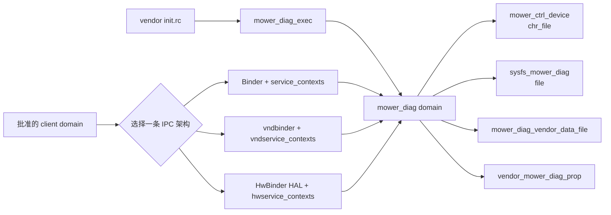
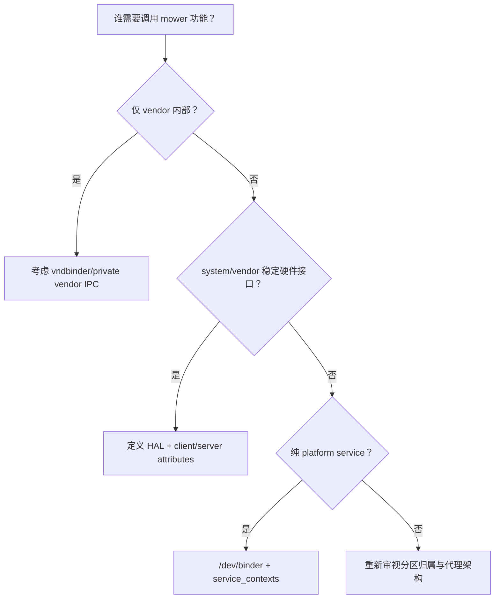

# 86 Android SELinux 实战：新增 native daemon、设备节点与 Binder/HAL 权限设计

> 源码版本：Android 11 / API 30 / `android-11.0.0_r48`  
> 学习方式：macOS 只读设计练习，不编译、不关闭 enforcing、不批量套用 audit2allow  
> 本章示例：vendor 侧 `mower_diag` 诊断 daemon（虚构名称，规则依据本工程真实宏与目录结构）

---

## 1. 为什么还需要一章实战

第 85 章建立了概念：

```text
source domain × target type × class × permission
```

真正新增服务时，困难不在写一行 allow，而在完整设计：

```text
binary 放哪一侧？
谁启动？
进入哪个 domain？
设备节点怎样获得专用 label？
sysfs 应用 file_contexts 还是 genfs_contexts？
数据存 DE 还是 CE？
property 谁写谁读？
应该用 Binder、vndbinder 还是 HwBinder？
客户端集合怎样收窄？
AVC 是缺权限还是错标签？
```

本章用同一个 `mower_diag` 示例走完从零设计、AVC 迭代到安全复查。

---

## 2. 先写需求，不先写 allow

假设产品需求：

```text
/vendor/bin/mower_diag 启动一个 vendor daemon
  → 读取 /dev/mower_ctrl
  → 读写少量 mower sysfs 控制节点
  → 写 /data/vendor/mower_diag 状态
  → 读取 vendor.mower.diag.enabled
  → 向获准客户端提供诊断接口
```

明确不需要：

- 任意 `/dev`；
- 整棵 `/sys`；
- 任意 `/data/vendor`；
- raw block device；
- 任意网络；
- 任意 Binder service；
- root shell 执行；
- ptrace 其他进程。

负面需求决定最小权限边界。

---

## 3. 完整设计总图



图中的三条 IPC 是互斥设计选择，不是建议全部开放。

---

## 4. 第一步：确认组件归属

binary 在 `/vendor/bin`，访问 vendor driver，并可能服务 vendor 客户端，因此优先按 vendor component 设计：

- policy 放设备/vendor sepolicy 目录；
- executable type 具有 `vendor_file_type`；
- property 使用 `vendor.*` namespace；
- writable data 放 `/data/vendor/...`；
- 不引用 platform private type；
- IPC 遵守 Treble system/vendor 边界。

如果真实业务由 system_server 面向 App 提供稳定 Framework API，更合理的架构通常是：

```text
App → system_server/platform service → vendor HAL → driver
```

而不是允许普通 App 直接打开 vendor device。

---

## 5. 构建与安装只是前置条件

概念 `Android.bp`：

```bp
cc_binary {
    name: "mower_diag",
    vendor: true,
    srcs: ["mower_diag.cpp"],
    init_rc: ["mower_diag.rc"],
    shared_libs: [/* 实际需要的库 */],
}
```

`vendor: true` 决定构建/安装/VNDK 边界，但不会自动创建 SELinux domain。SELinux 还需 type、file label 和 transition。

不要为了通过链接把 platform private library 暴露给 vendor；那是 ABI 架构问题，不是 sepolicy 能修复的问题。

---

## 6. init service 定义

```rc
service mower_diag /vendor/bin/mower_diag
    class hal
    user system
    group system
    disabled
    oneshot

on property:vendor.mower.diag.enabled=1
    start mower_diag
```

这只是示例，真实 daemon 若长期服务就不应 `oneshot`，触发条件、UID/GID、critical/disabled 必须按生命周期设计。

SELinux 不替代 `user/group`。能用非 root UID 时应先降 UID/GID，再由 SELinux 继续限制。

---

## 7. 定义 daemon 与 executable type

vendor policy 的 `mower_diag.te` 基础：

```te
type mower_diag, domain;
type mower_diag_exec, exec_type, vendor_file_type, file_type;

init_daemon_domain(mower_diag)
```

`init_daemon_domain` 展开核心为：

```te
domain_auto_trans(init, mower_diag_exec, mower_diag)
```

它补齐 init 执行 binary、binary 作为 entrypoint 及自动 process transition 所需规则。

---

## 8. 给 binary 正确标记

vendor `file_contexts`：

```text
/(vendor|system/vendor)/bin/mower_diag  u:object_r:mower_diag_exec:s0
```

Android 11 AOSP vendor HAL 示例大量使用同时兼容 `/vendor` 与 `/system/vendor` 的正则。

验证思路：

```bash
adb shell ls -lZ /vendor/bin/mower_diag
adb shell ps -AZ | grep mower_diag
```

期望：

```text
file    u:object_r:mower_diag_exec:s0
process u:r:mower_diag:s0
```

如果进程仍是 `u:r:init:s0`，先查 file label/transition，不要给 init 添加 daemon 业务资源权限。

---

## 9. 为什么不优先写 seclabel

常规 `/vendor` executable 支持稳定 file labeling，应使用：

```text
file_contexts → mower_diag_exec
type_transition → mower_diag
```

在 rc 中硬写 `seclabel u:r:mower_diag:s0` 会掩盖 executable 标签缺失，也弱化“谁能作为该 domain entrypoint”的审计关系。`seclabel` 主要留给 rootfs 等特殊对象。

---

## 10. 设备节点要用专用 type

定义：

```te
type mower_ctrl_device, dev_type;
```

设备 `file_contexts`：

```text
/dev/mower_ctrl  u:object_r:mower_ctrl_device:s0
```

访问：

```te
allow mower_diag mower_ctrl_device:chr_file { open read write getattr ioctl };
```

不要直接：

```te
allow mower_diag device:chr_file rw_file_perms;
```

后者会把默认标为 `device` 的大量杂项节点纳入攻击面，并很可能撞 neverallow。

---

## 11. ueventd 与 SELinux label 的分工

`ueventd.rc` 可设置设备节点 mode、uid、gid：

```text
/dev/mower_ctrl  0660  system  system
```

`file_contexts` 决定 SELinux type：

```text
/dev/mower_ctrl  u:object_r:mower_ctrl_device:s0
```

访问必须同时满足：

```text
DAC: daemon UID/GID 与 0660 允许
MAC: mower_diag → mower_ctrl_device:chr_file 权限允许
```

只改 ueventd mode 为 0666 既不能正确修复 SELinux，也扩大 DAC 攻击面。

---

## 12. ioctl 不能想当然

简单 `ioctl` allow 可能允许该 target class 上的所有 ioctl command。Android 支持 `allowxperm`/`neverallowxperm` 精细控制特定 ioctl number。

设计步骤：

1. 列出 driver UAPI ioctl commands；
2. 判断 daemon 实际调用集合；
3. 普通 class `ioctl` 权限与 xperm 约束配合；
4. 不复制其他设备的 ioctl 范围；
5. 检查 command 是否能写任意内存、DMA 或提权。

设备节点权限不仅是“能不能 open”，ioctl 往往才是主要攻击面。

---

## 13. sysfs 使用 genfs_contexts

假设内核节点：

```text
/sys/devices/platform/mower/mode
/sys/devices/platform/mower/fault
```

sysfs 是内核生成的伪文件系统，通常使用：

```te
type sysfs_mower_diag, fs_type, sysfs_type;
```

设备 `genfs_contexts`：

```text
genfscon sysfs /devices/platform/mower u:object_r:sysfs_mower_diag:s0
```

然后收窄访问：

```te
allow mower_diag sysfs_mower_diag:dir r_dir_perms;
allow mower_diag sysfs_mower_diag:file { open read getattr };
```

若只有 `mode` 可写，最好进一步把可写节点和只读 fault 节点分 type，避免一条 write 覆盖整棵目录。

---

## 14. sysfs 路径为什么容易写错

`genfscon sysfs` 后面的路径是该 filesystem 内部路径，通常不是带 `/sys` 前缀的用户空间完整路径：

```text
用户看到：/sys/devices/platform/mower/mode
genfscon： /devices/platform/mower/mode
```

还要区分真实设备路径与 `/sys/class/...` symlink。内核 label 关联真实对象；对 symlink 表面路径写规则可能匹配不到目标 inode。

应先用 `readlink -f`、`ls -Z` 和源码/设备树确认真实路径。

---

## 15. 给数据目录专用 type

定义：

```te
type mower_diag_vendor_data_file, file_type, data_file_type;
```

在本章对应的 Android 11 policy 中，AOSP vendor 侧的 `hostapd_data_file`、
`wpa_data_file` 等也是 `file_type, data_file_type`，并不存在一个应当机械添加到所有
vendor 数据 type 的统一 `vendor_data_file_type` attribute。是否还需其他 attribute，
必须由真实用途和本产品 neverallow 决定；尤其不要添加代表 platform core data 的
`core_data_file_type` 来规避边界。

`file_contexts`：

```text
/data/vendor/mower_diag(/.*)?  u:object_r:mower_diag_vendor_data_file:s0
```

权限：

```te
allow mower_diag mower_diag_vendor_data_file:dir create_dir_perms;
allow mower_diag mower_diag_vendor_data_file:file create_file_perms;
```

宏 `create_*_perms` 较宽，最终仍要按是否需要 rename/unlink/append/setattr 审查；只读配置不要给 create/write。

---

## 16. 谁创建 /data/vendor/mower_diag

选择一：init rc 创建：

```rc
mkdir /data/vendor/mower_diag 0770 system system
restorecon_recursive /data/vendor/mower_diag
```

选择二：daemon 在已有父目录下创建，需要父目录 `search/write/add_name` 和 type transition/restorecon 设计。

更易审计的方式通常是 init 提前创建固定顶层目录，file_contexts 确保专用 label，daemon 只管理自己的子树。

不要授予整个 `vendor_data_file:dir create_dir_perms` 来换取创建一个子目录。

---

## 17. DE、CE 与启动时机

若 daemon 在用户解锁前启动，不得依赖 user credential-encrypted 路径。设备级 vendor 状态通常放 `/data/vendor` 或明确的 DE 位置。

若数据包含用户身份/隐私，则必须按 user 分区、CE/DE 生命周期和多用户隔离重新设计，不能把所有用户数据放进一个全局 vendor 目录。

SELinux type 解决访问主体，FBE key 生命周期解决何时可解密，两者不能互相替代。

---

## 18. 定义专用 vendor property

在合适 property policy 中：

```te
vendor_internal_prop(vendor_mower_diag_prop)
```

`property_contexts`：

```text
vendor.mower.diag.  u:object_r:vendor_mower_diag_prop:s0 prefix string
```

daemon 只读：

```te
get_prop(mower_diag, vendor_mower_diag_prop)
```

若 daemon 必须写：

```te
set_prop(mower_diag, vendor_mower_diag_prop)
```

`set_prop` 已包含连接 property socket、`property_service set` 与读取映射所需规则，不必再手写一组重复 allow。

---

## 19. property 所有权先设计

先回答：

```text
谁是唯一 writer？
哪些 client 需要 read？
是 boot-only、persist 还是 runtime state？
system 侧是否必须消费？
是否泄露硬件/用户敏感状态？
```

`vendor_internal_prop` 意味着主要供 vendor 内部使用。如果 system/vendor 都需稳定共享，要选择适当 public/restricted property API 和命名，不能给 system_server 随意读取 vendor internal type 来破坏 Treble ownership。

---

## 20. IPC 设计前先选边界

Android 11 vendor daemon 常见三种选择：

| 场景 | 机制 | manager/driver | contexts |
|---|---|---|---|
| platform native service | Binder | servicemanager `/dev/binder` | `service_contexts` |
| vendor 内部 Binder | vndbinder | vndservicemanager `/dev/vndbinder` | `vndservice_contexts` |
| 标准/稳定 HAL | HwBinder | hwservicemanager `/dev/hwbinder` | `hwservice_contexts` |

Treble 设备不要让 vendor 进程为了方便同时接入所有 Binder domain。若需 system client 调 vendor 功能，优先判断是否应该定义 HAL（Android 11 主要是 HIDL；新版本还可能用 stable AIDL）。

---

## 21. 方案 A：platform Binder service

仅当组件实际属于 platform 域并使用 `/dev/binder` 时，概念规则：

```te
type mower_diag_service, service_manager_type;

binder_use(mower_diag)
binder_service(mower_diag)
add_service(mower_diag, mower_diag_service)

binder_call(approved_client, mower_diag)
allow approved_client mower_diag_service:service_manager find;
```

`service_contexts`：

```text
mower.diag  u:object_r:mower_diag_service:s0
```

但本章示例是 vendor binary，因此这通常不是首选；本节用于解释普通 Binder 规则的四层：use、register、find、call。

---

## 22. add/find/call/transfer/fd use 分开理解

`add_service(server, service_type)`：

- server 可 add/find；
- 生成 neverallow，其他 domain 不可注册该 service type。

client 还需：

```text
service_manager find
binder call/transfer
若服务返回 fd：client 对 server:fd use
```

`binder_call(client, server)` 宏包含 call、双向 transfer 和 fd use，但不自动赋予任意 service name 的 find。

Binder service 内部仍应验证 calling UID/permission；SELinux client domain allow 是粗粒度进程边界，不替代方法级授权。

---

## 23. 方案 B：vendor vndbinder service

vendor 内部私有 IPC 可用：

```te
type mower_diag_vndservice, vndservice_manager_type;

vndbinder_use(mower_diag)
allow mower_diag mower_diag_vndservice:service_manager { add find };
```

并在 `vndservice_contexts` 将名字映射为 type，客户端获得对应 find 与 binder call。

精确宏和 attributes 要以设备 vendor policy 为准。关键是它属于 vendor Binder 世界，platform App 不应直接依赖私有 vndbinder API。

---

## 24. 方案 C：HwBinder HAL

若功能是 system/vendor 稳定硬件接口，设计 HAL attributes：

```te
hal_attribute(mower_diag)
type hal_mower_diag_default, domain;
type hal_mower_diag_default_exec, exec_type, vendor_file_type, file_type;

hal_server_domain(hal_mower_diag_default, hal_mower_diag)
init_daemon_domain(hal_mower_diag_default)
```

定义 hwservice type 并关联：

```te
type hal_mower_diag_hwservice, hwservice_manager_type;
hal_attribute_hwservice(hal_mower_diag, hal_mower_diag_hwservice)
```

客户端：

```te
hal_client_domain(system_server, hal_mower_diag)
```

`hwservice_contexts` 再把完整 HIDL instance 名映射到 `hal_mower_diag_hwservice`。

这里有一个重要的 policy API 边界：如果 `system_server` 等 platform domain 要使用
这个 HAL，`hal_mower_diag` attribute、相关 hwservice type 以及 client 可见规则必须
进入合适的 platform public policy/API 与兼容体系；vendor policy 负责具体
implementation domain、binary、driver 和 vendor data 权限。只在某个设备的 vendor
目录私自声明同名 attribute，不能自动建立可供独立 system image 使用的 Treble 接口。
同时还要有真实 HIDL 接口、manifest/matrix 和服务注册实现，SELinux 宏本身不会生成 HAL。

---

## 25. HAL 宏分别做什么

```text
hal_attribute(name)
  → 定义 hal_name / _client / _server attributes 与 neverallow

hal_server_domain(impl, hal_name)
  → impl 加入 halserverdomain、hal_name_server、hal_name

hal_client_domain(client, hal_name)
  → client 加入 halclientdomain、hal_name_client

hal_attribute_hwservice(hal_name, hwservice_type)
  → client find；server add；限制其他 domain add/find
```

只写 `hwbinder_use()` 并不等于某个 domain 有权注册/查找任意 HAL instance；manager namespace type 仍受控制。

---

## 26. HAL server 的 driver 权限应该给谁

设备节点权限应给具体 implementation domain：

```te
allow hal_mower_diag_default mower_ctrl_device:chr_file { open read write ioctl getattr };
```

不要直接给整个 `hal_mower_diag` attribute，除非所有可能 implementation 都确实需要同样设备能力。attribute rule 会影响集合，未来新增另一个 server/client type 时可能意外继承。

接口身份与硬件资源身份是两层：HAL attribute 管 IPC 角色，implementation domain 管本机 driver/data 权限。

---

## 27. 回调意味着反向 Binder call

如果 client 注册 callback：

```text
client → server：注册 callback object
server → client：异步调用 callback
```

需要检查宏是否已覆盖 transfer 和反向 call。普通 `binder_call(client, server)` 只明确允许 client call server，回复 transfer 不等于 server 可主动 call client。

回调还需处理 client death、引用转移、线程池和敏感数据授权，不能看到注册成功就认为全部 SELinux 路径完整。

---

## 28. 不要用 appdomain 作为方便客户端集合

危险规则：

```te
allow appdomain mower_diag_service:service_manager find;
binder_call(appdomain, mower_diag)
```

这可能允许所有普通/特权 App 发现并调用服务。应优先：

- system_server 作为唯一 platform client/代理；
- 专属 signed app domain；
- 明确 HAL client attribute；
- 服务方法内再做 UID/permission 校验。

“客户端现在只有一个”应落实为 policy type，而不是依赖没人知道 service name。

---

## 29. 网络权限不要顺手加

只有真正需要 AF_INET/AF_NETLINK 等时才使用 `net_domain` 或具体 socket 规则。`net_domain(mower_diag)` 是 attribute 归类，可能继承更广泛网络基础规则。

如果 daemon 只需要本地 Binder + device，完全不应为了日志上传的未来猜想提前开放网络。未来需求应单独做数据流、目的地址、DNS、cleartext、SELinux socket class 和 Android 网络策略评审。

---

## 30. capability 不按 root 身份赠送

如果业务确需 capability：

```te
allow mower_diag self:capability { /* 最小集合 */ };
```

同时 init service 的 UID、ambient/inheritable capability 配置与 executable 行为也要正确。

不要使用宽泛 capability 集合；`sys_admin` 尤其接近“杂项超级能力”，通常说明架构或接口设计需要重审。

---

## 31. 完整最小策略草图

```te
type mower_diag, domain;
type mower_diag_exec, exec_type, vendor_file_type, file_type;
init_daemon_domain(mower_diag)

type mower_ctrl_device, dev_type;
allow mower_diag mower_ctrl_device:chr_file { open read write getattr ioctl };

type sysfs_mower_diag, fs_type, sysfs_type;
allow mower_diag sysfs_mower_diag:dir { search open read getattr };
allow mower_diag sysfs_mower_diag:file { open read getattr };

type mower_diag_vendor_data_file, file_type, data_file_type;
allow mower_diag mower_diag_vendor_data_file:dir create_dir_perms;
allow mower_diag mower_diag_vendor_data_file:file create_file_perms;

vendor_internal_prop(vendor_mower_diag_prop)
get_prop(mower_diag, vendor_mower_diag_prop)

# IPC 三选一；这里暂不添加，待架构决定。
```

这是教学草图，不保证可直接放入任意设备编译。产品 policy 目录的 attributes、neverallow、Treble 配置和已有 HAL 定义必须现场核对。

---

## 32. 对应 contexts 草图

`file_contexts`：

```text
/(vendor|system/vendor)/bin/mower_diag  u:object_r:mower_diag_exec:s0
/dev/mower_ctrl                        u:object_r:mower_ctrl_device:s0
/data/vendor/mower_diag(/.*)?          u:object_r:mower_diag_vendor_data_file:s0
```

`genfs_contexts`：

```text
genfscon sysfs /devices/platform/mower u:object_r:sysfs_mower_diag:s0
```

`property_contexts`：

```text
vendor.mower.diag. u:object_r:vendor_mower_diag_prop:s0 prefix string
```

选 HAL 时还要 `hwservice_contexts`；选 Binder/vndbinder 时对应 service contexts。

---

## 33. 启动后的标签验收清单

```bash
adb shell ps -AZ | grep mower_diag
adb shell ls -lZ /vendor/bin/mower_diag
adb shell ls -lZ /dev/mower_ctrl
adb shell ls -Zd /data/vendor/mower_diag
adb shell ls -lZ /sys/devices/platform/mower
adb shell getprop vendor.mower.diag.enabled
```

预期：

```text
process → mower_diag（或 hal_mower_diag_default）
binary  → mower_diag_exec
device  → mower_ctrl_device
sysfs   → sysfs_mower_diag
data    → mower_diag_vendor_data_file
property→ vendor_mower_diag_prop（通过 contexts 工具/日志确认）
```

任何一个落到 default/general type，都先修标签。

---

## 34. AVC 驱动迭代示例一：进程未 transition

现象：

```text
avc: denied { open } scontext=u:r:init:s0
tcontext=u:object_r:mower_ctrl_device:s0 tclass=chr_file
```

错误修复：给 init 设备权限。

正确调查：

```text
为什么业务代码在 init domain？
  → binary 是否 mower_diag_exec？
  → file_contexts regex 是否匹配真实安装路径？
  → init_daemon_domain 是否编入正确 vendor policy？
  → rc 是否执行了另一个 symlink/path？
```

修好 transition 后 denial source 应变成 mower_diag。

---

## 35. AVC 示例二：设备仍是通用 type

```text
scontext=u:r:mower_diag:s0
tcontext=u:object_r:device:s0
tclass=chr_file { read write }
```

不要允许 `device:chr_file`。检查：

- file_contexts 放在哪个 partition policy；
- regex 是否被更早/更具体规则覆盖；
- ueventd 创建设备后是否正确 restorecon；
- 实际访问的是 symlink 还是另一节点；
- `ls -lZ` 的真实 target。

目标应先变成 `mower_ctrl_device`。

---

## 36. AVC 示例三：sysfs 通用标签

```text
tcontext=u:object_r:sysfs:s0 tclass=file { write }
```

这常说明缺专用 `genfscon`，不应给整个 sysfs 写权限。先确认内核真实 path；必要时把 read-only 与 writable 节点拆 type，然后仅对特定 type 给 write。

若 driver 把大量危险控制挤在同一个 sysfs 文件，SELinux 无法按 ioctl command 那样细分内容；可能需要先重构内核 ABI。

---

## 37. AVC 示例四：目录权限链

写文件可能依次出现：

```text
parent dir search
parent dir write/add_name
file create
file open/write
```

若 `/data/vendor/mower_diag` 已由 init 创建，daemon 通常不需要对 `/data/vendor` 父目录 `add_name`，只需 search 到达自己的目录，再在专用目录内创建。

不要因为一次 `search` denial 就套 `create_dir_perms` 到所有 ancestor。

---

## 38. AVC 示例五：service find 与 Binder call

客户端常先报：

```text
tclass=service_manager { find }
```

加 find 后才可能报：

```text
tclass=binder { call }
```

这是两个检查点，不是重复。必须同时确认：

- service name 映射到哪个 service type；
- client 是否应发现；
- source/target 是否在同一 Binder world；
- server 内部是否还做 UID/permission 检查。

---

## 39. 编译错误比 AVC 更早暴露的问题

常见：

```text
unknown type
duplicate declaration
neverallow violation
public/private API violation
property ownership violation
file_contexts overlap/invalid regex
seapp_contexts neverallow
```

它们说明最终 policy 不允许被构造出来，不是运行时缺一条权限。不能通过关闭 enforcing 解决编译失败。

在本 Mac 学习环境无需真实编译，但文档练习应学会从错误所属阶段判断问题。

---

## 40. userdebug 能跑不等于 user 能跑

差异来源可能包括：

- `userdebug_or_eng()` 条件规则；
- permissive domain；
- adb root/shell 代理操作；
- overlayfs/verity disabled；
- debug property；
- `su`/debug tooling domain；
- audit suppression 差异。

最终验收必须在目标 build policy、enforcing 和真实启动路径下进行。开发机手工 `setenforce 0` 的成功没有生产安全意义。

---

## 41. neverallow 冲突怎样处理

决策顺序：

1. 读完整 neverallow 的 source/target attribute 集合；
2. 展开宏，确认你的 domain 为什么属于被禁止集合；
3. 判断 target 是否错标为通用/核心 type；
4. 判断组件是否放错 system/vendor 分区；
5. 判断访问是否应经已有系统/HAL 服务代理；
6. 为资源定义更准确专用 type；
7. 只有安全架构真的变化时才讨论护栏本身。

通常修复不是给 neverallow 加例外，而是纠正 domain/type/调用边界。

---

## 42. 从攻击面反向复查 allow

每条规则问：

```text
如果 mower_diag 被攻陷，攻击者能用这条权限做什么？
```

例如：

- device ioctl 能 DMA/刷固件吗？
- sysfs write 能关安全传感器吗？
- property set 能触发 init action 吗？
- data file 是否含密钥/跨用户数据？
- Binder find/call 能拿到高权服务吗？
- fd use 能接收什么特权 fd？
- network 能向外泄露什么？
- capability 能否影响所有进程？

最小权限不是让日志暂时消失，而是控制进程失陷后的最大损害。

---

## 43. 不该添加的危险规则清单

```te
allow mower_diag device:chr_file *;
allow mower_diag sysfs:file rw_file_perms;
allow mower_diag vendor_data_file:dir create_dir_perms;
allow mower_diag self:capability *;
binder_call(mower_diag, domain)
allow appdomain mower_diag_service:service_manager find;
permissive mower_diag;
```

有些还会直接违反 neverallow；即使能编译，也代表边界过宽。

不要用 `dontaudit` 隐藏尚未理解的 denial。`dontaudit` 仅用于已确认不需要、拒绝符合预期且日志噪声确有成本的路径。

---

## 44. 普通 Binder 与 HAL 的架构选择题



SELinux policy 应表达架构决策，不能靠规则把错误分层强行连通。

---

## 45. Mac 上九轮只读练习

### 第一轮：展开 daemon transition

```bash
sed -n '1,45p' system/sepolicy/public/te_macros
sed -n '155,168p' system/sepolicy/public/te_macros
```

手写 `init_daemon_domain(mower_diag)` 展开的关键规则。

### 第二轮：观察真实 vendor HAL

```bash
sed -n '1,30p' system/sepolicy/vendor/hal_sensors_default.te
sed -n '1,25p' system/sepolicy/vendor/hal_bootctl_default.te
```

区分 implementation domain、HAL attribute 和 executable label。

### 第三轮：设备节点 labeling

```bash
sed -n '75,180p' system/sepolicy/private/file_contexts
rg -n 'device:chr_file' system/sepolicy/vendor -g '*.te' | head -n 60
```

任选三个节点，画出 path → type → authorized domain。

### 第四轮：sysfs labeling

```bash
sed -n '105,170p' system/sepolicy/private/genfs_contexts
```

解释为什么规则不写 `/sys` 前缀。

### 第五轮：property 宏

```bash
sed -n '300,330p' system/sepolicy/public/te_macros
sed -n '890,930p' system/sepolicy/public/te_macros
```

比较 get/set 与 vendor internal/restricted/public。

### 第六轮：Binder 宏

```bash
sed -n '335,405p' system/sepolicy/public/te_macros
sed -n '625,650p' system/sepolicy/public/te_macros
```

列出 binder_use、binder_call、add_service 各自不负责什么。

### 第七轮：HAL 宏

```bash
sed -n '195,272p' system/sepolicy/public/te_macros
sed -n '640,675p' system/sepolicy/public/te_macros
```

画 client/server/hwservice type 的 attribute 关系。

### 第八轮：审查 system_server

```bash
sed -n '195,265p' system/sepolicy/private/system_server.te
rg -n 'add_service\(system_server' system/sepolicy/private/system_server.te
```

观察 find/call/HAL client 与发布 service 并非一条万能宏。

### 第九轮：纸面 threat review

对本章每个 allow 填表：

```text
业务动作 | source | target | class/perms | 不给会怎样 | 被攻陷后风险 | 能否再收窄
```

---

## 46. 自测题

1. 为什么新增 daemon 要先决定 system/vendor 归属？
2. `vendor: true` 会自动创建 SELinux domain 吗？
3. `mower_diag_exec` 和 `mower_diag` 分别标谁？
4. 为什么不应让 init 继承 daemon 的设备权限？
5. ueventd mode 与 file_contexts 各负责什么？
6. 为什么设备 ioctl 需要单独威胁分析？
7. sysfs 为什么通常用 genfs_contexts？
8. `/sys/class` symlink 为什么可能误导 labeling？
9. 为什么不授予整个 vendor_data_file？
10. DE/CE 与 SELinux type 各解决什么？
11. `set_prop` 宏比单条 property_service allow 多做什么？
12. vendor internal property 为什么不应随意给 system 读取？
13. Binder、vndbinder、HwBinder 如何选择？
14. service find 与 binder call 有何区别？
15. `add_service` 为什么还生成 neverallow？
16. HAL client/server attribute 与 implementation domain 有何区别？
17. callback 为什么可能需要反向 call？
18. AVC source 是 init 时为何不能直接给 init allow？
19. target 是 `device`/`sysfs` 时应先怀疑什么？
20. userdebug 成功为何不能代表 user build 成功？
21. neverallow 冲突通常应从哪个建模错误查起？
22. 最小权限为什么要按“daemon 被攻陷”反向复查？

---

## 47. 最终交付检查表

```text
[ ] binary 分区归属和 ABI 边界正确
[ ] init rc 使用最小 UID/GID/capability
[ ] binary 命中专用 *_exec label
[ ] init exec 后进入专属 domain
[ ] /dev 节点拥有专用 dev_type，DAC mode 同时合理
[ ] ioctl command 集合已审计
[ ] sysfs 使用真实内核路径和专用 genfs type
[ ] 可写 sysfs 与只读节点尽量拆 type
[ ] /data 只访问专属子树，DE/CE/多用户设计正确
[ ] property namespace、owner、reader、writer 正确
[ ] Binder/vndbinder/HwBinder 只选择实际需要的世界
[ ] service add/find、binder call、callback 分别授权
[ ] server 方法仍检查 UID/permission
[ ] 无通用 device/sysfs/data/domain 大范围 allow
[ ] 无 permissive 和未解释 dontaudit
[ ] 所有 AVC 已验证 label、需求和最小权限
[ ] 通过 neverallow/Treble/CTS/VTS 思维审查
[ ] 在 enforcing 的目标 build 上复验
```

---

## 48. 本章总结

1. SELinux 策略设计从组件归属、数据流和威胁模型开始，不从 AVC 复制开始；
2. native daemon 至少需要专属 domain、`*_exec` type、file_contexts 与 init transition；
3. `/dev` 节点要同时正确配置 ueventd DAC 和专用 SELinux dev_type；
4. sysfs 通常用 genfs_contexts，并应把可写节点收窄到专用 type；
5. `/data/vendor` 应为 daemon 建专属数据 type，不能放宽整个 vendor data；
6. property 要明确 namespace、owner、reader/writer，并使用 get_prop/set_prop 宏；
7. Binder、vndbinder、HwBinder 是架构选择，不能为省事全部开放；
8. service add/find、Binder call、fd、callback 和方法级权限是不同检查面；
9. AVC 中通用 target type 往往意味着 labeling 错误，source 是 init 往往意味着 transition 错误；
10. 最小权限的最终标准是 daemon 被攻陷时仍把损害限制在已声明资源内。

下一章：**第 87 章——Android 内核驱动到 Framework：字符设备、sysfs、uevent、JNI 与系统服务的完整接入链路**。
