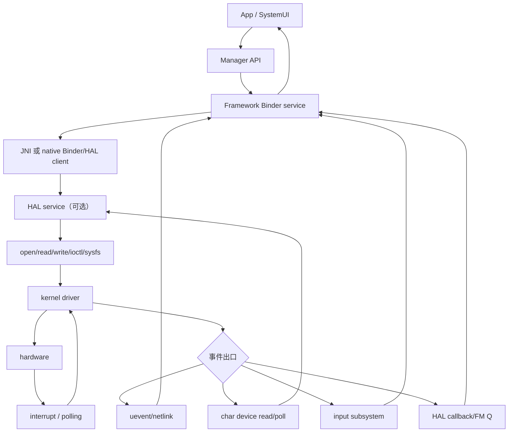
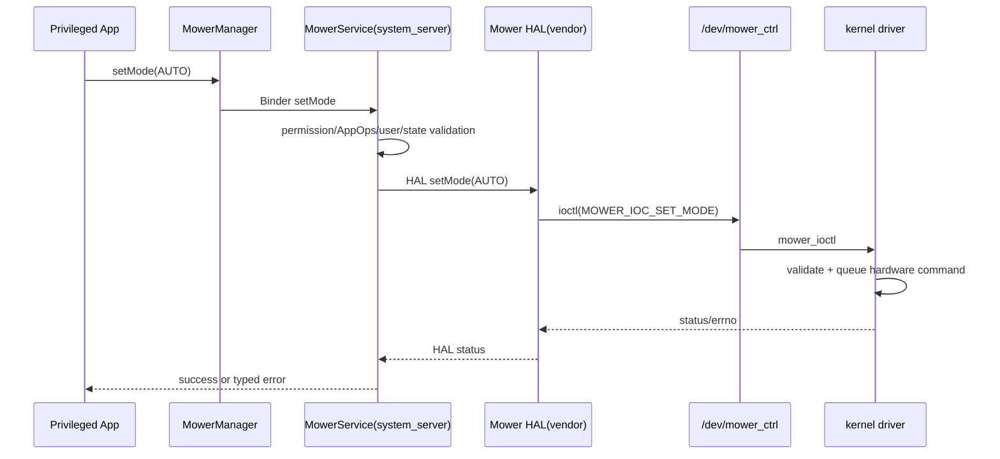

# 87 Android 内核驱动到 Framework：字符设备、sysfs、uevent、JNI 与系统服务接入链路

> 源码版本：Android 11 / API 30 / `android-11.0.0_r48`  
> 学习方式：macOS 只读源码，不编译内核、不加载驱动、不创建设备节点  
> 教学设备：`mower_ctrl`；真实源码对照：UEventObserver、VibratorService、Vibrator HAL

---

## 1. 本章先纠正一个常见总图

很多入门图会画：

```text
App → Framework → JNI → HAL → Driver → Hardware
```

它能表达分层，却容易造成误解：每种硬件都必须经过每一层。真实 Android 有多种接入方式：

```text
Framework Java → JNI → 设备文件/sysfs
Framework Java → JNI → Binder/HwBinder HAL → driver
Framework Java → native Binder service → HAL/driver
native daemon → socket/Binder → Framework service
kernel uevent → netlink → JNI → UEventObserver
kernel input event → EventHub → InputReader
```

本章重点不是背唯一链路，而是学会根据控制频率、事件模型、ABI 稳定性、安全边界和数据量选择路径。

---

## 2. 控制向下与事件向上



控制链与事件链可能不对称。例如写 sysfs 控制电机，但故障通过 uevent 上报；也可能同一字符设备用 ioctl 控制、poll/read 接收事件。

---

## 3. 本章源码地图

| 路径 | 作用 |
|---|---|
| `frameworks/base/core/java/android/os/UEventObserver.java` | Java uevent observer、匹配与分发线程 |
| `frameworks/base/core/jni/android_os_UEventObserver.cpp` | JNI 连接 Java 与 native uevent socket |
| `hardware/libhardware_legacy/uevent.c` | uevent netlink socket 封装 |
| `system/core/libcutils/uevent.cpp` | libcutils uevent 收发封装 |
| `system/core/init/ueventd.cpp` | ueventd 设备节点创建/权限配置路径 |
| `frameworks/base/services/java/.../SystemServer.java` | 启动 Framework system services |
| `frameworks/base/services/core/jni/onload.cpp` | services JNI 方法统一注册入口 |
| `frameworks/base/services/core/java/com/android/server/VibratorService.java` | Java 系统服务、权限/策略/状态 |
| `frameworks/base/services/core/jni/com_android_server_VibratorService.cpp` | Java 到 vibrator HAL 的 JNI 桥 |
| `hardware/interfaces/vibrator/1.x` | Android 11 HIDL Vibrator HAL contract |
| `hardware/interfaces/vibrator/1.0/default` | HIDL 包装 legacy vibrator HAL 的示例 |
| `hardware/libhardware/modules/vibrator/vibrator.c` | 直接写 vibrator sysfs 的 legacy 示例 |

本工程不包含所有产品 kernel driver；驱动端用 Linux 通用接口模型讲解，具体厂商实现需到对应 kernel tree 查。

---

## 4. 先决定向 userspace 暴露什么 ABI

驱动可提供：

| 接口 | 适合 | 不适合 |
|---|---|---|
| sysfs | 简单属性、低频文本读写、状态开关 | 高频数据流、复杂事务、批量二进制 |
| char device read/write | 字节流、消息、阻塞读取 | 自描述配置较弱，需自定义 ABI |
| ioctl | 结构化命令、模式切换、查询能力 | 版本/32-64 位兼容、攻击面需严审 |
| poll/epoll | 等待字符设备事件 | 需设计队列、丢失/背压语义 |
| uevent | 稀疏状态变化、设备 add/remove/change | 高频流、可靠命令通道、敏感大数据 |
| input subsystem | 按键、触摸、轴等标准输入事件 | 任意设备控制协议 |
| netlink/genl | 复杂内核—用户消息族 | 简单属性会过重，权限与协议更复杂 |

选错接口会把复杂度推到 Framework，SELinux 只能约束访问，不能修复糟糕 ABI。

---

## 5. 字符设备的内核对象关系

概念驱动：

```c
alloc_chrdev_region(&devt, 0, 1, "mower_ctrl");
cdev_init(&cdev, &mower_fops);
cdev_add(&cdev, devt, 1);
class = class_create(..., "mower");
device_create(class, ..., devt, ..., "mower_ctrl");
```

最终关系：

```text
major/minor dev_t
  ↔ cdev
  ↔ file_operations
  ↔ device model object/kobject
  → uevent ADD
  → ueventd 创建 /dev/mower_ctrl
```

`/dev/mower_ctrl` 只是 major/minor 的 userspace 入口，不包含驱动代码。`open()` 后 VFS 根据 inode 的设备号找到 `file_operations`。

---

## 6. file_operations 的生命周期

概念：

```c
static const struct file_operations mower_fops = {
    .owner          = THIS_MODULE,
    .open           = mower_open,
    .release        = mower_release,
    .read           = mower_read,
    .write          = mower_write,
    .unlocked_ioctl = mower_ioctl,
    .poll           = mower_poll,
};
```

userspace 对应：

```text
open  → open callback，建立 per-file state
read  → 取状态/事件
write → 简单命令或数据
ioctl → 带 command number 的结构化控制
poll  → 查询等待队列是否可读/可写/异常
close → release，清理订阅/引用
```

系统调用成功只表示驱动接受，不一定表示硬件动作已经物理完成；同步完成、排队完成和异步完成必须在 ABI 中定义。

---

## 7. copy_to_user/copy_from_user 边界

内核不能直接信任 userspace pointer：

```c
if (copy_from_user(&req, argp, sizeof(req)))
    return -EFAULT;
```

还必须校验：

- struct version/size；
- enum/range；
- length 溢出；
- reserved 字段；
- pointer 嵌套；
- 兼容 32-bit ioctl；
- 调用并发和设备状态；
- 超时与取消。

SELinux 已允许 ioctl 不代表参数可信。driver UAPI 是高权限攻击面，所有数据仍视为不可信输入。

---

## 8. ioctl ABI 怎样保持兼容

示意：

```c
#define MOWER_IOC_MAGIC 'M'
#define MOWER_IOC_GET_CAPS _IOR(MOWER_IOC_MAGIC, 0x01, struct mower_caps)
#define MOWER_IOC_START    _IOW(MOWER_IOC_MAGIC, 0x02, struct mower_start)
```

建议：

- 使用固定宽度 `__u32/__u64`；
- struct 带 `size/version`；
- reserved 清零；
- 不暴露 native pointer/`long` 布局；
- 新能力先查询 caps；
- 未知 flag 拒绝或明确定义忽略；
- 返回稳定 errno；
- 明确幂等性。

Android OTA 可更新 userspace 而 vendor/kernel 版本不同步，ABI 兼容尤其重要。

---

## 9. poll/read 事件通道

驱动维护事件队列：

```text
IRQ/workqueue 产生 event
  → 加入 ring/FIFO
  → wake_up_interruptible(wait_queue)

userspace poll(fd)
  → 无事件则睡眠
  → 被唤醒返回 POLLIN
  → read(fd) 取一个或多个 event
```

必须定义：

- 队列容量；
- 满时覆盖/丢新/阻塞；
- sequence number；
- timestamp 时钟；
- 一次 read 的消息边界；
- 多 reader 是广播还是竞争消费；
- suspend/resume 后状态同步。

高频、可靠事件通常比 uevent 更适合这种通道。

---

## 10. sysfs 的正确模型

sysfs attribute 常由：

```text
show()  → read 文本值
store() → parse 文本并更新状态
```

示例 userspace：

```text
echo auto > /sys/devices/platform/mower/mode
cat /sys/devices/platform/mower/fault
```

良好 sysfs ABI 应“一文件一属性”、短文本、稳定单位和明确范围。不要塞 JSON、长日志、连续采样或多步事务。

`store()` 必须严格解析和返回 errno；写入字节数成功不等于机械动作已经完成，除非 ABI 明确同步。

---

## 11. sysfs 路径与 symlink

用户可能访问：

```text
/sys/class/mower/mower0/mode
```

它通常 symlink 到：

```text
/sys/devices/platform/.../mower0/mode
```

SELinux `genfs_contexts` 通常按真实 sysfs 内部路径标记 inode。调试要 `readlink -f`，不能只按 class symlink 表面路径判断规则。

驱动重构 device hierarchy 也可能改变真实路径，稳定 ABI 和 policy path 都需同步考虑。

---

## 12. uevent 是什么

uevent 是 kernel device model 向 userspace 广播的 netlink 消息。常见 NUL 分隔字段：

```text
ACTION=change\0
DEVPATH=/devices/platform/mower\0
SUBSYSTEM=mower\0
FAULT=3\0
SEQNUM=1234\0
```

设备 add/remove/change 常由 kobject/device core 发出；driver 也可通过 `kobject_uevent_env()` 添加环境字段。

它是通知，不是可靠 RPC：无每个 consumer 的确认、重传和持久队列语义。

---

## 13. ueventd 和 UEventObserver 不是同一个东西

| 组件 | 进程 | 主要职责 |
|---|---|---|
| ueventd | 独立 early userspace daemon | 根据 kernel add/remove 创建 `/dev` 节点和 symlink，并应用配置的 mode/owner；创建节点时依据 SELinux label 查询结果设置安全上下文 |
| UEventObserver | 使用它的 Java 进程，常为 system_server | 订阅匹配消息，把设备状态变化交给 Framework service |

同一 kernel uevent 可被多个 netlink listener 接收。ueventd 创建节点和 Framework 处理业务事件互不替代。

---

## 14. UEventObserver Java 主线

```java
observer.startObserving("DEVPATH=/devices/platform/mower");

public void onUEvent(UEvent event) {
    String fault = event.get("FAULT");
}
```

源码特征：

- 每个进程只有一个静态 `UEventThread`；
- 第一次 startObserving 时启动；
- 一个 observer 可注册多个 match；
- message 包含 match substring 就分发；
- NUL 分隔的 `KEY=VALUE` 解析为 map；
- stopObserving 后移除匹配，但线程一旦启动不会停止。

因此 `onUEvent()` 运行在共享 UEventObserver 线程，不是 system service 主 Handler 线程。

---

## 15. JNI 如何收到 uevent

`android_os_UEventObserver.cpp`：

```text
nativeSetup()
  → uevent_init() 打开 netlink socket

nativeWaitForNextEvent()
  → uevent_next_event(buffer)
  → native matches 先过滤
  → NewString 返回含 NUL 字段的 Java String

Java UEventThread
  → sendEvent()
  → 再按 observer 列表匹配
  → onUEvent()
```

native 和 Java 都有匹配逻辑：native 避免把无关消息搬进 Java；Java 决定具体 observer 集合。

这里还有一个容易串线的注册细节：`UEventObserver` 是 framework core JNI，
`register_android_os_UEventObserver()` 被列在
`frameworks/base/core/jni/AndroidRuntime.cpp` 的 core JNI 注册表中；它**不经过**
`frameworks/base/services/core/jni/onload.cpp`。后者服务于 system_server 的
services JNI，例如下面教学示例中的 `MowerService` 以及真实的
`VibratorService` native 方法。

---

## 16. 为什么 match 必须具体

错误：

```java
startObserving("mower");
```

字符串可能在任意字段命中，还可能处理大量无关消息。更好：

```java
startObserving("DEVPATH=/devices/platform/mower");
```

并在 callback 再校验：

- `ACTION`；
- 完整 `DEVPATH`；
- `SUBSYSTEM`；
- 字段是否存在；
- 数字范围；
- sequence/state 是否过期。

uevent 数据来自 kernel，但仍不能因来源而跳过格式校验和状态机检查。
`SEQNUM` 可以辅助观察消息先后或发现可疑间隙，却不能把 netlink 广播变成
“每个观察者均可靠收到”的协议：进程尚未监听、socket 缓冲溢出、进程重启等场景
仍要靠重新查询权威状态恢复。

---

## 17. onUEvent 不能做重活

所有 observer 共用单线程。若 callback 做同步 Binder、慢 I/O 或等待锁：

```text
一个 observer 卡住
  → 其他硬件 uevent 全部延迟
  → netlink buffer 可能积压/丢消息
```

正确方式：快速解析最小字段，投递到服务自己的 Handler/Executor，再返回。

还要避免持有 service lock 时调用外部 Binder，防止锁反转和 system_server 卡死。

---

## 18. uevent 不适合高频遥测

注释提醒某些设备甚至可能每个 VSync 发 netlink message。若 mower 每 10 ms 上报速度：

- 广播开销大；
- 字符串解析重；
- 没有背压；
- 丢失难恢复；
- system_server shared thread 易被拖慢。

应使用 char device poll/read、FMQ、共享内存或专门 HAL callback，并提供 snapshot/query API 做丢事件恢复。

---

## 19. JNI 不是 HAL

JNI 解决 Java ↔ native function boundary；HAL 解决 Framework/system ↔ vendor hardware implementation 的稳定接口/进程边界。

```text
JNI 可在 system_server 进程内直接 open sysfs
HAL 可在独立 vendor process 中访问 driver
JNI 也可只是 HAL client wrapper
```

Android 11 `VibratorService` 就是第三种：Java native methods 进入 services JNI，JNI 再连接 AIDL/HIDL vibrator service（并兼容版本）。

---

## 20. JNI 方法如何注册

Java：

```java
private static native int nativeGetState();
```

C++：

```cpp
static const JNINativeMethod gMethods[] = {
    {"nativeGetState", "()I", (void*)nativeGetState},
};

int register_com_android_server_MowerService(JNIEnv* env) {
    return RegisterMethodsOrDie(env,
        "com/android/server/MowerService", gMethods, NELEM(gMethods));
}
```

若这是 system_server 的 services JNI 方法，再由
`frameworks/base/services/core/jni/onload.cpp` 的 `JNI_OnLoad` 调注册函数。
如果类属于 framework core，则通常是在
`frameworks/base/core/jni/AndroidRuntime.cpp` 的注册表中注册；应先确认 native
library 和类所在层级，不能看到 `native` 就一律去 services `onload.cpp` 查找。

名字、descriptor、static/instance receiver、class loader 任一不匹配都会在加载/调用时报错。

---

## 21. JNI signature 怎样读

```text
V → void
Z → boolean
I → int
J → long
Ljava/lang/String; → String
[I → int[]
(JI)Z → 参数 long,int；返回 boolean
```

JNI C++ 参数：

```text
static Java method   → JNIEnv*, jclass, ...
instance Java method → JNIEnv*, jobject, ...
```

手写 signature 很容易错，应对照 Java 声明确认。

---

## 22. JNI 资源与异常边界

必须处理：

- local/global reference 生命周期；
- `GetStringUTFChars`/array pin 的释放；
- native errno 到 Java exception/status 的映射；
- pending Java exception；
- native callback thread attach 到 JVM；
- shutdown 时 callback 不再触碰已销毁对象；
- 32/64 位数值转换；
- JNI 调用期间不要长时间阻塞 critical array/GC。

JNI 是进程内边界，native crash 会杀死 system_server；将复杂 vendor parser/driver interaction 放 system_server JNI 内会扩大系统稳定性风险。

---

## 23. 为什么优先考虑独立 HAL/daemon

独立进程带来：

- crash 隔离；
- vendor/system ABI 分离；
- 独立 SELinux domain；
- 服务死亡/重连语义；
- VINTF version/capability 协商；
- 可单独限权与 dump。

代价：

- Binder/HwBinder 开销；
- 生命周期和重连复杂；
- callback/线程池；
- 接口版本治理；
- 更多 build/manifest/policy 配置。

低风险、平台内部且极简单的 native 能力可能适合 JNI；真实硬件 vendor 接口通常更适合 HAL。

---

## 24. SystemServer 中启动服务

典型 `SystemService`：

```java
public final class MowerService extends SystemService {
    public MowerService(Context context) { super(context); }

    @Override public void onStart() {
        publishBinderService("mower", mBinderService);
        publishLocalService(MowerManagerInternal.class, mLocalService);
    }

    @Override public void onBootPhase(int phase) { ... }
}
```

`SystemServer.start*Services()` 调：

```java
mSystemServiceManager.startService(MowerService.class);
```

放在哪一组和何时连接 HAL，取决于它依赖 PMS、AMS、用户解锁、display 或 boot completed 哪个阶段。

---

## 25. Binder API 与 LocalServices

```text
Binder service：跨进程 App/系统组件访问
LocalServices：system_server 内部服务间直接 Java 调用
```

不要为了 system_server 内部消费者暴露新的公共 Binder API。对外 Binder 方法要做：

- manifest permission；
- AppOps（需要用户策略时）；
- calling UID/package 校验；
- user/profile/foreground 状态；
- 参数范围和速率限制；
- `clearCallingIdentity()` 的正确边界；
- dump permission；
- Binder death。

---

## 26. 控制链教学示例



每层只确认自己的完成点。若 driver 只“成功排队”，Framework 不应把返回解释为刀盘已经达到目标速度。

---

## 27. 异步完成怎样设计

方案：

```text
setMode(requestId, AUTO) → ACCEPTED
hardware reaches state
  → driver event(sequence/requestId, MODE_APPLIED)
  → HAL callback
  → Framework 更新权威状态并通知 listener
```

必须处理：

- requestId/sequence；
- superseded request；
- timeout；
- HAL/driver restart；
- callback 丢失后的 queryState；
- App client death；
- late callback；
- duplicate completion。

不能用固定 `sleep()` 猜硬件完成。

---

## 28. 事件链教学示例

低频 fault 可走：

```text
hardware interrupt
  → driver workqueue 更新状态
  → kobject_uevent_env(ACTION=change, FAULT=3)
  → netlink
  → system_server UEventObserver thread
  → MowerService Handler
  → query HAL/driver 获取完整权威状态
  → 更新缓存/StatsLog/通知 listener
```

uevent 可只承担“有变化”提示，完整状态通过 query 获取。这样字段丢失或多次变化合并时仍可恢复最终状态。

---

## 29. 为什么事件后还要 query

uevent 是瞬时 edge；Framework 维护的是 state。若进程启动晚、socket buffer 溢出或收到事件后排队延迟，仅相信每条 edge 会产生错误状态。

稳健模式：

```text
event = invalidation signal
query = authoritative snapshot
sequence = detect stale/reordered result
```

类似数据库 cache invalidation：通知“缓存失效”，消费者重新读权威源。

---

## 30. HAL callback 与 uevent 如何选择

| 条件 | 更适合 HAL callback | 更适合 UEventObserver |
|---|---|---|
| 数据结构复杂 | 是 | 否 |
| 高频/批量 | FMQ/callback（需背压） | 否 |
| 需要请求关联 | 是 | 弱 |
| device add/remove | 可选 | 是 |
| 多 userspace consumer | HAL 可集中仲裁 | uevent 广播但无强保证 |
| vendor/system 稳定 ABI | HAL interface | 自定义 env 字段较脆弱 |
| 极简单低频状态提示 | 可用 | 可用 |

HAL implementation 自己也可监听 char device/uevent，然后通过 typed callback 上报 Framework。

---

## 31. AOSP Vibrator 真实链路

Android 11 代码展示：

```text
App/SystemVibrator
  → IVibratorService Binder
  → VibratorService Java：permission/AppOps/低电/强度/队列
  → native vibratorOn/Off/Perform...
  → com_android_server_VibratorService.cpp
  → 连接 AIDL/HIDL IVibrator service（兼容多个版本）
  → vendor vibrator HAL
  → driver ABI
```

legacy 示例 `hardware/libhardware/modules/vibrator/vibrator.c` 最终写：

```text
/sys/class/timed_output/vibrator/enable
```

它证明“Framework 使用 HAL”和“HAL 最终写 sysfs”可以同时成立；sysfs 没有因为存在 HAL 而消失。

---

## 32. VibratorService 为什么不能只是一行 write

Java service 还负责：

- VIBRATE permission；
- AppOps；
- caller UID/package；
- vibration effect validation；
- intensity scaling；
- low power policy；
- current/queued vibration；
- token death；
- WakeLock；
- BatteryStats；
- input device vibrators；
- completion callback。

Framework service 是策略与仲裁层，HAL 是硬件能力层，driver 是内核执行层。

---

## 33. HAL 版本与 capability

JNI wrapper 会尝试不同 vibrator interface version，并查询：

```text
supportsAmplitudeControl
supported effects
external control
capabilities
```

正确设计不是根据设备型号硬编码功能，而是：

```text
发现服务/版本
  → query capability
  → Framework 只暴露或降级到可支持语义
```

新 driver 功能要从 kernel UAPI、HAL version/capability、Framework API 全链路协商，不能只改最底层。

---

## 34. HAL death 与重连

独立 HAL 可能 crash/restart。Framework/native wrapper 应：

- linkToDeath；
- 清空 stale proxy；
- 标记 hardware unavailable；
- 有界重试/重新 getService；
- 重建 callback registration；
- 必要时重新同步 state；
- 不在 system_server 关键锁下等待无限服务。

“Binder 调用返回 dead object”是进程边界故障，不应转换成假成功。

---

## 35. 线程模型总览

```text
App caller thread
  → Binder driver
  → system_server Binder thread
  → permission/state lock
  → Handler/native/HAL call

HAL server binder/hwbinder thread pool
  → ioctl/write

driver IRQ context
  → threaded IRQ/workqueue
  → wake waitqueue / uevent

system_server UEventObserver thread or HAL callback Binder thread
  → service Handler
  → listener callbacks
```

任何跨层卡顿都要先问“此代码在哪个线程，是否持锁，能否阻塞”。

---

## 36. 不要在 Binder thread 无限等待硬件

风险：

```text
Binder setMode
  → 持 mLock
  → blocking ioctl 等硬件 30 秒
  → Binder pool 被占
  → 其他 API 堵塞
  → system_server Watchdog/ANR 链
```

可改为：

- 快速校验后投递专用 Handler；
- 返回 request token；
- driver/HAL 有界 timeout；
- completion callback；
- 不持全局锁做外部调用；
- slow path 与状态查询分离。

---

## 37. 锁顺序与 callback 重入

Framework 调 HAL 时，HAL 可能同步/异步回调；Binder 还可能在同一进程优化为本地调用。若持锁调用外部组件：

```text
Service lock → HAL call → callback → 再取 Service lock
```

会死锁或破坏状态机。常用模式：锁内计算命令/更新 pending，释放锁，调用 HAL，再锁内提交结果并检查 generation。

回调必须验证 generation/requestId，防旧请求覆盖新状态。

---

## 38. 权限链路必须贯穿

```text
App API：Manifest permission + AppOps + user/profile
Binder service：calling UID/package、速率、参数
SELinux：client find/call，service/HAL domain，device/sysfs type
Linux DAC：HAL UID/GID 与 device mode
driver：ioctl command/argument/capability/状态校验
hardware：安全 interlock
```

任何单层都不应被视为唯一防线。特别是高风险 mower actuator，硬件/driver safety interlock 不能只依赖可更新的 App/Framework 判断。

---

## 39. 数据与隐私边界

事件可能包含位置、传感器、故障、设备序列号。不要把敏感 payload 塞入全局广播 uevent 或 logcat。

原则：

- uevent 只带最小非敏感状态/标识；
- 详细数据由授权 HAL query；
- Binder listener 按权限/用户过滤；
- dumpsys 脱敏并要求 DUMP；
- statsd 只记录定义好的 atom；
- 不记录 raw ioctl buffer；
- 多用户缓存按 user 生命周期清理。

---

## 40. 状态机比 callback 列表更重要

Framework 可定义：

```text
UNAVAILABLE
  → CONNECTING
  → IDLE
  → STARTING(requestId)
  → ACTIVE
  → STOPPING(requestId)
  → FAULT(code)
```

每个事件都要声明：

- 哪些 state 合法；
- 重复是否幂等；
- stale sequence 是否丢弃；
- HAL death 去哪里；
- boot/resume 如何重建；
- user switch 是否影响；
- fault 是否要求硬件确认清除。

没有状态机的跨层 callback 很快演变成竞态。

---

## 41. 错误码怎样跨层

```text
kernel errno
  → HAL typed status/service-specific error
  → Framework exception/result
  → App 可理解的错误
```

不要把所有 `-EIO/-EINVAL/-EBUSY/-ETIMEDOUT` 都变成 boolean false：

- EINVAL：调用参数或版本不支持；
- EBUSY：当前状态冲突，可稍后重试；
- ETIMEDOUT：硬件未在期限完成，状态可能未知；
- ENODEV：设备离线；
- EIO：通信/硬件失败。

同时不要把底层 errno 直接暴露为不稳定公共 SDK ABI，应映射到文档化的 Framework 语义。

---

## 42. 启动顺序与依赖

问题：SystemService 启动时 HAL/设备可能还没 ready。

策略：

```text
onStart 发布 Binder API，但状态 UNAVAILABLE
  → 异步连接 HAL
  → 注册 death/callback
  → query initial state
  → READY 后通知内部消费者
```

不要让 SystemServer 启动主线程无限 `waitForService`。若服务是启动硬依赖，应明确定义 init class、VINTF、lazy/eager 和 boot phase，而非用 sleep 重试。

---

## 43. uevent 与 cold-start 初始状态

Observer 注册前发生的 uevent 不会自动重放给 Framework。因此初始化必须：

```text
先 query 当前状态
注册 observer/callback
再 query 一次或用 sequence 防窗口竞态
```

简单“先 query 再 register”存在两者之间的变化窗口；“先 register 再 query”要处理 query 前到达的事件。可用 generation/serialization 将它们统一。

---

## 44. suspend/resume

硬件在 suspend 中可能掉电、积累事件或重置寄存器。链路应明确：

- driver suspend/resume callback；
- wakeup source；
- 哪些事件可唤醒；
- resume 后 HAL 是否重配；
- Framework 是否重新 query；
- boottime/monotonic timestamp；
- pending request 是继续、失败还是取消。

Framework WakeLock 不能替代 driver 电源管理；driver wakeup_source 也不替代上层工作完成期间的 WakeLock。

---

## 45. 常见误解复读

1. **所有硬件链都必须 JNI + HAL**：错，层级按架构选择。
2. **有 HAL 就不再使用 sysfs/char device**：错，HAL 最终仍需 kernel ABI。
3. **ueventd 会把业务事件回调给 Framework**：错，它主要管理设备节点；UEventObserver 是另一消费者。
4. **uevent 是可靠消息队列**：错，适合低频通知，不保证每 consumer 确认/重放。
5. **UEventObserver 每个对象一个线程**：错，每进程共享一个静态线程。
6. **onUEvent 可直接做慢 Binder/I/O**：错，会阻塞其他 observer。
7. **JNI 是进程隔离边界**：错，它在同一进程，native crash 可杀 system_server。
8. **ioctl success 就是硬件完成**：不一定，ABI 可能只完成排队。
9. **sysfs write 返回长度就代表执行完成**：同样取决于 ABI。
10. **Binder 方法里同步等硬件最简单可靠**：可能耗尽线程池/引发 Watchdog。
11. **收到事件就不必 query**：错，edge 可能丢，state 要可恢复。
12. **SELinux allow 之后 driver 参数就可信**：错，driver 仍须严格校验。
13. **HAL callback 一定在 Service Handler**：错，通常先在 Binder/HwBinder thread。
14. **系统启动时 HAL 必定已经 ready**：错，需要明确依赖/异步连接。
15. **Framework permission 足以保证执行器安全**：错，driver/hardware interlock 仍不可缺。

---

## 46. Mac 上九轮只读练习

### 第一轮：UEventObserver Java

```bash
sed -n '1,235p' frameworks/base/core/java/android/os/UEventObserver.java
```

找到共享线程、两级 match、callback thread 和 stop 语义。

### 第二轮：uevent JNI

```bash
sed -n '1,145p' frameworks/base/core/jni/android_os_UEventObserver.cpp
```

画出 netlink buffer → NUL fields → Java String → UEvent map。

### 第三轮：ueventd

```bash
sed -n '1,220p' system/core/init/README.ueventd.md
rg -n 'UeventListener|HandleUevent|DeviceHandler' system/core/init/ueventd.cpp system/core/init
```

比较它和 Framework observer 的职责。

### 第四轮：services JNI 注册

```bash
sed -n '1,140p' frameworks/base/services/core/jni/onload.cpp
rg -n 'register_android_server_VibratorService|JNINativeMethod' \
  frameworks/base/services/core/jni/com_android_server_VibratorService.cpp
```

追 Java native 声明如何绑定 C++ function。

### 第五轮：Vibrator Java policy

```bash
rg -n 'vibrate\(|check|Permission|AppOps|vibratorOn|vibratorOff|WakeLock' \
  frameworks/base/services/core/java/com/android/server/VibratorService.java
```

列出它在 HAL 之上负责的策略。

### 第六轮：JNI 到 HAL

```bash
sed -n '1,260p' frameworks/base/services/core/jni/com_android_server_VibratorService.cpp
```

找 HIDL/AIDL version fallback、capability 和 callback。

### 第七轮：HAL 到 legacy module

```bash
sed -n '1,125p' hardware/interfaces/vibrator/1.0/default/Vibrator.cpp
sed -n '1,150p' hardware/libhardware/modules/vibrator/vibrator.c
```

追 `on(timeout)` 最终写哪个 sysfs 文件。

### 第八轮：SystemServer 启动点

```bash
rg -n 'StartLightsService|VibratorService|startOtherServices' \
  frameworks/base/services/java/com/android/server/SystemServer.java
```

判断 service 构造、发布 Binder 和硬件初始化是否同一时刻。

### 第九轮：画 mower 双向链

分别画：

```text
setMode 控制链：thread/process/IPC/ABI/error/completion
fault 事件链：IRQ/workqueue/event/observer/Handler/state/listener
```

每个箭头标同步或异步。

---

## 47. 只读观察与诊断

设备允许时：

```bash
adb shell ls -lZ /dev
adb shell find /sys -name uevent 2>/dev/null | head
adb shell cat /sys/class/timed_output/vibrator/enable
adb shell service list
adb shell lshal
adb shell dumpsys vibrator
adb shell ps -AT -o PID,TID,NAME,LABEL
adb shell logcat -b all | grep -E 'Vibrator|UEvent|mower'
adb shell dmesg | grep -E 'uevent|mower|avc:'
```

不要向未知 sysfs/device 节点写值。只读也要注意某些设备属性 read 可能有副作用，应以 ABI 文档为准。

---

## 48. 分层故障速查表

| 现象 | 优先层级 |
|---|---|
| `/dev/mower_ctrl` 不存在 | probe/device_create、ueventd、major/minor、SELinux labeling |
| open EACCES | DAC UID/GID/mode、SELinux domain/type |
| ioctl EINVAL | command/struct version/size/range/compat |
| ioctl ETIMEDOUT | driver/hardware completion、interrupt、电源 |
| HAL service 找不到 | init rc、manifest、hwservicemanager、SELinux add/find |
| Java native method not found | JNI registration/class/signature/library load |
| system_server crash | JNI native crash/ref/thread/exception |
| 收不到 uevent | driver emit、netlink权限、match过宽/过窄、注册时机 |
| 偶尔状态不一致 | 丢 edge、缺 query、sequence、竞态/锁 |
| Binder API 卡住 | Binder pool、持锁外调、HAL/driver 无限等待 |
| App 被拒绝 | permission/AppOps/user/SELinux/Binder method validation |

---

## 49. 接口设计检查表

```text
[ ] 控制、状态查询、事件三类语义已分开
[ ] sysfs 仅用于简单低频属性
[ ] char event 有队列/溢出/sequence/timestamp 定义
[ ] ioctl 使用固定宽度、version/size/reserved 和稳定 errno
[ ] 驱动校验所有 userspace 参数
[ ] HAL contract 有 capability/version/fallback
[ ] Framework service 做 permission/AppOps/user/速率/状态仲裁
[ ] Binder/HAL death 有重连和 state resync
[ ] callback 不在关键锁内外调
[ ] Binder/UEvent/shared thread 不做无限阻塞
[ ] uevent 只作低频提示，详细状态可 query
[ ] cold start、丢事件、重复、乱序、late callback 可恢复
[ ] suspend/resume 与 WakeLock/wakeup source 边界明确
[ ] JNI reference/exception/thread attach 正确
[ ] errno 映射到稳定上层语义
[ ] SELinux/DAC/driver/hardware safety 纵深防御
[ ] dumpsys/log/metrics 可诊断且不泄露敏感数据
```

---

## 50. 自测题

1. 为什么 App→Framework→JNI→HAL→Driver 不是唯一链？
2. 控制链和事件链为何可能不对称？
3. sysfs、char device、ioctl、uevent 分别适合什么？
4. `/dev` 节点怎样关联到 file_operations？
5. ioctl 为什么必须考虑 32/64 位和 struct version？
6. poll/read 队列需要定义哪些丢失语义？
7. ueventd 与 UEventObserver 有何区别？
8. uevent 为什么不适合高频可靠遥测？
9. UEventObserver callback 运行在哪个线程？
10. native 与 Java 两级 match 各有什么作用？
11. JNI 为什么不是进程隔离？
12. JNI method signature `([IJ)Z` 怎么读？
13. 何时应把 native hardware 逻辑移到独立 HAL？
14. Binder service 与 LocalServices 面向谁？
15. driver 返回成功为何不一定表示硬件完成？
16. 异步 request 为什么需要 requestId/generation？
17. uevent 后为什么通常还要 query state？
18. HAL callback 与 uevent 如何选择？
19. VibratorService 在 HAL 之上做了哪些策略？
20. HAL death 后为什么要重新注册 callback/query？
21. 为什么不能持 Framework lock 做 HAL 调用？
22. cold-start query/register 有什么竞态？
23. Framework WakeLock 与 driver wakeup source 有何不同？
24. 安全执行器为什么必须保留 driver/hardware interlock？

---

## 51. 最终记忆图

```text
【控制向下】
App Manager
  → Framework Binder service
  → permission/AppOps/user/state/rate limit
  → JNI native wrapper 或 native/HAL Binder client
  → vendor HAL domain
  → open/write/ioctl/sysfs
  → driver validate + queue/execute
  → hardware

【事件向上】
hardware IRQ/poll
  → driver state/workqueue
  ├─ low-frequency notification → uevent → JNI UEventObserver
  ├─ reliable stream → char device poll/read → HAL
  ├─ standardized input → input subsystem → EventHub
  └─ vendor typed event → HAL callback/FMQ
  → Framework Handler/state machine
  → query authoritative state
  → listener/Broadcast/StatsLog（按权限与隐私）

【跨层共同问题】
ABI version + capability
thread + lock + timeout
requestId + sequence + idempotence
death + reconnect + state resync
permission + SELinux + DAC + driver validation + hardware interlock
```

---

## 52. 本章总结

1. Android 没有所有硬件都必须经过的唯一层级模板；JNI、HAL、daemon、uevent 按架构选择；
2. sysfs 适合简单属性，char/ioctl 适合结构化控制，poll/read 适合可靠事件，uevent 适合低频变化通知；
3. ueventd 负责设备节点，UEventObserver 负责 Java 业务观察，两者是不同消费者；
4. UEventObserver 每进程共享线程，callback 必须快速投递，且事件后应查询权威状态；
5. JNI 是同进程语言边界，注册、signature、引用、异常和 callback 线程错误可直接杀 system_server；
6. 独立 HAL 提供进程隔离、vendor/system ABI、能力协商和死亡恢复，但增加 IPC/生命周期复杂度；
7. Framework SystemService 负责权限、AppOps、用户、策略、仲裁和状态机，不应沦为设备写入转发器；
8. 驱动/HAL 返回值要区分接受、排队和物理完成，异步链需要 requestId、timeout、callback 和 query；
9. 跨层线程、锁、Binder pool、IRQ/workqueue 与 suspend/resume 必须一起分析；
10. 高风险硬件需 Framework、SELinux、DAC、driver 参数校验与硬件 interlock 的纵深防御。

下一章：**第 88 章——Android UEvent、ueventd、设备节点与热插拔：从 kobject 到 Framework 状态机的深入源码分析**。
