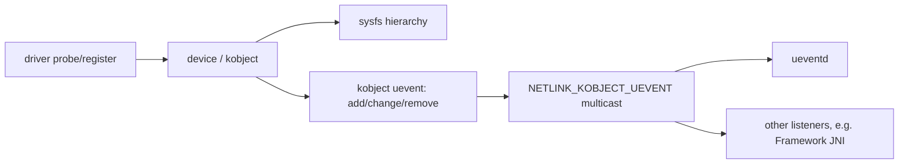
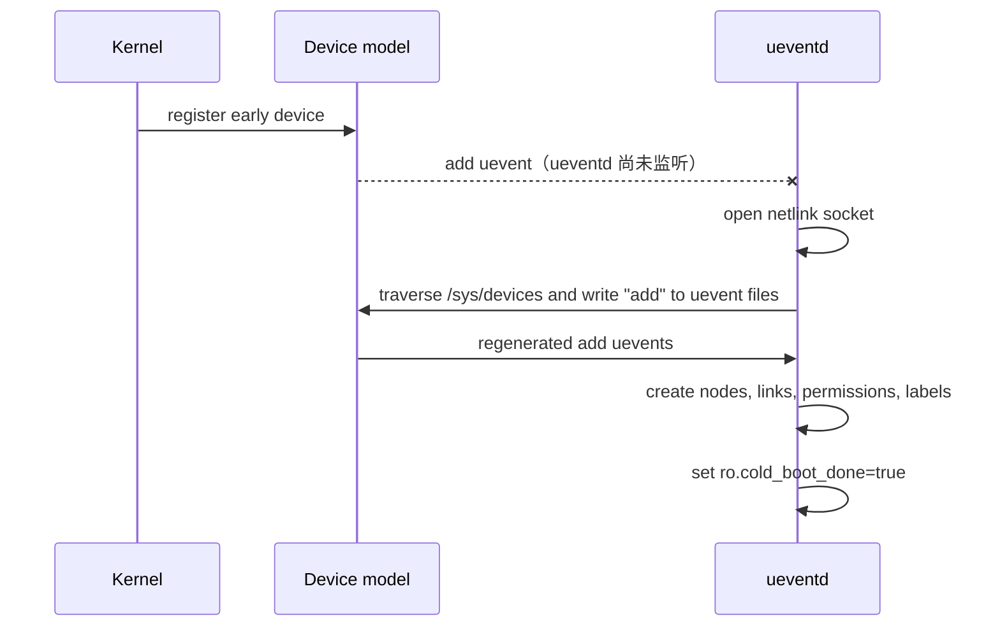
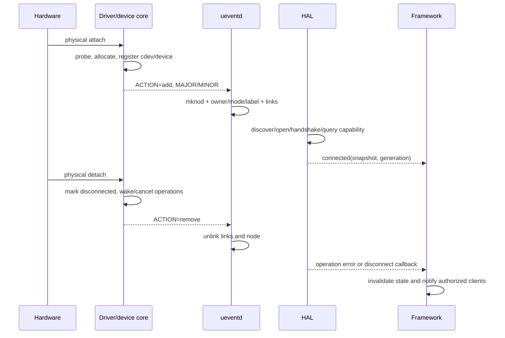

# 88 Android UEvent、ueventd、设备节点与热插拔深入源码

> 源码版本：Android 11 / API 30 / `android-11.0.0_r48`
>
> 学习方式：macOS 只读源码，不要求编译；可选命令只用于源码检索或连接真实设备观察。

---

## 1. 本章解决什么问题

上一章已经知道：kernel 可以通过 uevent 通知 userspace，`ueventd` 和
Framework `UEventObserver` 都能成为消费者。本章继续回答更具体的问题：

1. 设备已经在 kernel 中注册，为什么 `/dev` 下还不一定有节点？
2. uevent 消息从哪里产生，里面的 `ACTION/DEVPATH/MAJOR/MINOR` 有什么作用？
3. `ueventd` 启动前错过的设备 add 事件怎样补回来？
4. coldboot 为什么要遍历 `/sys/devices`，又为什么需要并行？
5. `/dev/foo` 的名字、类型、major/minor、mode、owner 和 SELinux label 分别由谁决定？
6. add/change/remove 到达时，设备节点和 symlink 怎样变化？
7. 热插拔为什么不能只相信一条 edge event？
8. Framework 如何处理“先查状态还是先注册监听”的竞态？

先记住本章总句：

> kernel uevent 描述“设备模型发生了什么”；ueventd 把其中一部分变化投影成
> userspace 可访问的节点、链接、权限和固件加载动作；上层服务仍需维护自己的
> 权威状态、生命周期和恢复协议。

---

## 2. 源码地图

| 源码 | 本章关注点 |
|---|---|
| `system/core/init/ueventd.cpp` | ueventd 主入口、配置、coldboot、handler、常驻 poll |
| `system/core/init/uevent_listener.cpp` | netlink 接收、字段解析、遍历 sysfs 重放 uevent |
| `system/core/init/uevent.h` | Android init 内部的 `Uevent` 数据结构 |
| `system/core/init/devices.cpp` | 路径选择、mknod、权限、SELinux label、symlink、remove |
| `system/core/init/devices.h` | `DeviceHandler`、`Permissions`、`Subsystem` 模型 |
| `system/core/init/ueventd_parser.cpp` | ueventd.rc 语法解析 |
| `system/core/init/README.ueventd.md` | Android 11 配置格式说明 |
| `system/core/rootdir/ueventd.rc` | platform 默认配置样例 |
| `system/core/init/firmware_handler.cpp` | kernel firmware request 的 userspace 响应 |
| `system/core/init/modalias_handler.cpp` | 可选 modalias 模块加载处理 |
| `system/core/libcutils/uevent.cpp` | netlink socket 和消息接收公共封装 |
| `frameworks/base/core/java/android/os/UEventObserver.java` | Framework 观察者、共享线程、匹配分发 |
| `frameworks/base/core/jni/android_os_UEventObserver.cpp` | Java observer 到 native uevent socket |

注意：这章主要研究 Android userspace。kernel 的 kobject/device model 代码可能不在
当前 AOSP checkout 的完整范围内，因此 kernel 侧用稳定概念和调用关系说明，Android
侧则直接对照本工程源码。

---

## 3. 先把五种对象分开

初学时最容易把下面五个东西混成“设备”：

```text
kernel device/kobject
    内核设备模型对象，存在于内核内存

/sys/devices/... directory
    sysfs 对 kernel object hierarchy 的可见投影

uevent message
    某次 add/remove/change 等变化的通知

/dev/... device node
    含 major/minor 的特殊 inode，是 open() 进入驱动的入口

Framework/HAL device state
    userspace 根据查询和事件维护的业务状态
```

它们有关联但不等价：

- `/sys` 目录存在，不代表 `/dev` 节点已经创建；
- 收到 `add`，不代表 HAL 已完成初始化；
- `/dev` 节点存在，不代表物理设备仍可用；
- remove 事件到达，不代表所有已打开 fd 会立刻变成普通错误；具体取决于驱动实现；
- Framework 的“已连接”可能还需要权限、协议握手、能力查询和策略确认。

---

## 4. kernel 侧 uevent 的概念链

典型概念链如下：



常见 action：

| ACTION | 通常含义 | 上层不能想当然的地方 |
|---|---|---|
| `add` | 设备对象加入设备模型 | 不等于硬件完全 ready |
| `remove` | 设备对象被移除 | 已有请求、fd、callback 如何结束由协议定义 |
| `change` | 属性或状态变化 | 不说明具体业务字段，需看 subsystem contract |
| `online` / `offline` | 设备上线/下线状态 | 并非所有 subsystem 都使用 |
| `bind` / `unbind` | driver 绑定状态变化 | Android 11 消费者是否处理要看具体代码 |

driver 也可调用类似 `kobject_uevent_env()` 的接口追加环境字段，但自定义字段不是
自动稳定的 Android API。字段变更会影响 HAL/Framework parser，必须版本化和兼容。

---

## 5. uevent 在线路上长什么样

uevent payload 是连续的 NUL 分隔字符串，不是换行文本，也不是 JSON：

```text
add@/devices/platform/mower_ctrl\0
ACTION=add\0
DEVPATH=/devices/platform/mower_ctrl\0
SUBSYSTEM=mower\0
MAJOR=240\0
MINOR=0\0
DEVNAME=mower_ctrl\0
SEQNUM=1057\0
\0
```

从 shell 日志里看到的换行通常是工具重新格式化后的显示。

关键字段：

| 字段 | 意义 | ueventd 用法 |
|---|---|---|
| `ACTION` | 本次变化类型 | 决定 add/change/remove 等处理 |
| `DEVPATH` | 相对 `/sys` 的设备路径 | sysfs 修权、节点命名、拓扑和 symlink |
| `SUBSYSTEM` | block、usb、input 等类别 | 选择设备路径规则 |
| `MAJOR/MINOR` | dev_t 编号 | 两者有效时才可能创建 `/dev` node |
| `DEVNAME` | kernel 建议的设备名 | 某些 subsystem/USB 路径使用 |
| `PARTN/PARTNAME` | block partition 信息 | 生成稳定的 by-name 等链接 |
| `FIRMWARE` | kernel 请求的固件文件 | 交给 FirmwareHandler |
| `MODALIAS` | 模块匹配 alias | 可交给 ModaliasHandler |
| `SEQNUM` | kernel uevent 序号 | Android 11 init parser 明确忽略它 |

最后一行很重要：`system/core/init/uevent_listener.cpp` 的 `ParseEvent()` 有
“currently ignoring SEQNUM”注释。因此不能声称 Android 11 ueventd 依靠 SEQNUM
做可靠去重、补发或顺序恢复。

---

## 6. netlink 是广播，不是可靠业务队列

多个 listener 可以各自打开 netlink socket，分别收到 multicast：

```text
kernel
  ├─ socket A → ueventd
  ├─ socket B → system_server UEventObserver JNI
  └─ socket C → vendor daemon/HAL
```

但广播不等于可靠消息系统：

- listener 启动前的事件不会为它永久保存；
- socket receive buffer 可能溢出；
- 进程 crash/restart 期间会有观察空窗；
- 没有面向每个 listener 的 ack/retry；
- 一条大于固定接收 buffer 的消息可能被丢弃；
- 即使看到连续 SEQNUM，也不能证明业务状态未经其他路径改变。

所以正确模型是：

```text
uevent = “请重新关注这个对象”的提示
query  = 获取当前权威状态
```

对于 `/dev` 节点创建，ueventd 用 coldboot 重放补启动前事件；对于 Framework 业务
状态，则通常要 register listener 与 query snapshot 组合。

---

## 7. ueventd 是谁启动的

Android init 可根据自身可执行文件名进入不同 main。`ueventd` 是 early userspace 的
关键 daemon，不是 Java SystemService，也不是普通 APK。

高层启动关系：

```text
kernel starts init
  → first-stage/second-stage init setup
  → fork/exec ueventd
  → ueventd opens netlink before coldboot regeneration
  → init waits for ro.cold_boot_done=true
  → boot continues with required device nodes available
```

`ueventd.cpp` 完成 coldboot 后设置：

```cpp
android::base::SetProperty(kColdBootDoneProp, "true");
```

`init.cpp` 会等待该属性。它不是给 App 使用的公共“硬件全部 ready”信号，而是启动
内部协调点：必要的早期设备事件已由 ueventd coldboot 处理完成。

---

## 8. ueventd_main 主线

把 `ueventd_main()` 压缩成伪代码：

```cpp
umask(000);
InitLogging(...);
SelabelInitialize();

config = ParseConfig(system, vendor, odm, hardware-specific);

handlers += DeviceHandler(config permissions/subsystems/...);
handlers += FirmwareHandler(config firmware directories/...);
if (modalias enabled) handlers += ModaliasHandler(...);

UeventListener listener(config receive_buffer_size);

if (!ro.cold_boot_done) {
    ColdBoot(listener, handlers, parallel_restorecon).Run();
}

for (handler : handlers) handler->ColdbootDone();

listener.Poll(event -> {
    for (handler : handlers) handler->HandleUevent(event);
});
```

三类 handler 都能看到事件，但职责不同：

| Handler | 关注事件 | 主要动作 |
|---|---|---|
| `DeviceHandler` | 含设备与 sysfs 信息的事件 | 修 sysfs 权限、创建/移除 node 和 symlink |
| `FirmwareHandler` | `SUBSYSTEM=firmware`, `ACTION=add` | 找固件并写入 kernel firmware loading interface |
| `ModaliasHandler` | 含 `MODALIAS` | 可选地查找并加载匹配模块 |

这是一种事件扇出，不是三段串行处理链。

---

## 9. 配置文件加载顺序

Android 11 源码传给 `ParseConfig()` 的文件包括：

```text
/system/etc/ueventd.rc
/vendor/ueventd.rc
/odm/ueventd.rc
/ueventd.${ro.hardware}.rc
```

源码注释说明最后保留 product-name based 配置以兼容旧设备并允许覆盖。学习时不要
只搜 `/ueventd.<hardware>.rc`，也不要把新版本 Android 的配置路径机械套到 Android 11。

当前源码树中的 platform 模板在：

```text
system/core/rootdir/ueventd.rc
```

构建产物位置与源码位置不同，这是读 AOSP 时常见现象。

---

## 10. ueventd.rc 的设备权限规则

设备节点规则格式：

```text
/dev/path_or_pattern  mode  user  group
```

教学示例：

```text
/dev/mower_ctrl  0660  system  mower
```

含义是：当 ueventd 为匹配路径创建节点时，应用 `0660`、owner `system`、group
`mower`。这里的 `mower` 只是概念名称；真实配置中 user/group 必须已存在，否则
`getpwnam()`/`getgrnam()` 解析失败，不能靠写一行 ueventd.rc 顺便创建新 Android ID。
ueventd 也不负责创建 Android manifest permission，更不会自动允许 SELinux 访问。

默认找不到规则时，`DeviceHandler::GetDevicePermissions()` 返回：

```text
mode 0600, uid 0, gid 0
```

因此“节点存在但 system_server 打不开”可能是 ueventd DAC rule、SELinux rule、进程
身份或驱动 open 拒绝中的任意一层。

---

## 11. sysfs 权限规则与设备节点规则不同

sysfs 规则包含 attribute：

```text
/sys/devices/...  attribute  mode  user  group
```

概念示例：

```text
/sys/devices/platform/mower  enable  0660  system  mower
```

`DeviceHandler::HandleUevent()` 对 `add/change/online` 调
`FixupSysPermissions(uevent.path, uevent.subsystem)`。这改变的是既有 sysfs attribute
的 DAC mode/uid/gid，不是用 mknod 创建 sysfs 文件；sysfs 文件来自 kernel attribute。

两个常见误区：

1. ueventd.rc 配了 sysfs mode，不等于 SELinux 已允许；
2. `/sys/class/foo/bar` 可能是 symlink，规则匹配与 SELinux label 调试要核对真实路径。

---

## 12. subsystem section 怎样改变节点路径

配置可以为 subsystem 指定名字来源和目录：

```text
subsystem mower
devname uevent_devname
dirname /dev/mower
```

源码解析允许：

```text
devname uevent_devname
devname uevent_devpath
dirname /absolute/path
```

若匹配自定义 subsystem，`DeviceHandler` 调 `Subsystem::ParseDevPath()`；否则一般字符
设备使用：

```text
/dev/ + Basename(DEVPATH)
```

block、usb 和配置过的 subsystem 有专门分支，所以不能只看 `DEVNAME` 猜最终节点。

---

## 13. UeventListener 如何打开与读取 socket

构造函数：

```cpp
device_fd_.reset(uevent_open_socket(rcvbuf_size, true));
fcntl(device_fd_, F_SETFL, O_NONBLOCK);
```

随后 `ReadUevent()`：

```text
uevent_kernel_multicast_recv()
  → 检查长度
  → 尾部补两个 NUL
  → ParseEvent()
  → 得到 android::init::Uevent struct
```

若消息长度达到 `UEVENT_MSG_LEN`，Android 11 代码会记录 overflow 并丢弃，避免解析
截断消息。这再次说明自定义 uevent 不应塞大量数据。

`uevent_socket_rcvbuf_size` 可在配置中调整 socket buffer，但扩大 buffer 只是提高突发
承受能力，不会提供 ack、持久化和无限背压。

---

## 14. ParseEvent 的边界

Android 11 parser 识别固定字段并写入 `Uevent`：

```text
ACTION, DEVPATH, SUBSYSTEM, FIRMWARE,
MAJOR, MINOR, PARTN, PARTNAME, DEVNAME, MODALIAS
```

未知字段会被跳过。这意味着：

- ueventd 不会因为 driver 增加 `MOWER_FAULT=3` 就自动执行 Framework 业务；
- `UEventObserver` 可以从原始消息 map 读取自定义字段，两者的 parser 能力不同；
- `atoi()` 解析 major/minor 是当前实现细节，不能据此放松 kernel ABI 输入约束；
- NUL 终止和消息完整性是 parser 安全的基本前提。

---

## 15. 为什么需要 coldboot

时间线：



coldboot 不是“重新探测全部硬件”，而是对已经存在的 sysfs device objects 请求重新
发送 add uevent，让迟到的 userspace consumer 补做节点和权限处理。

---

## 16. coldboot 怎样遍历 sysfs

`UeventListener::RegenerateUevents()` 从：

```text
/sys/devices
```

开始递归。每进入一个目录：

```cpp
openat(dirfd, "uevent", O_WRONLY | O_CLOEXEC);
write(fd, "add\n", 4);
```

随后立刻从 netlink socket drain 当前可读消息，再继续递归子目录。

为什么不是遍历完才统一读取？因为 `/sys/devices` 可能对应大量对象，短时间生成大量
uevent 会撑爆 socket receive buffer。边触发、边 drain 能降低溢出风险。

它遍历的是 `/sys/devices` 真实层级，而不是 `/sys/class` 的便捷 symlink 视图，避免
重复和拓扑歧义。

这里有一个非常适合练习“代码与文档交叉验证”的细节：同一源码树中的
`README.ueventd.md` 仍描述 `/sys/class`、`/sys/block`、`/sys/devices` 三处；但本 tag
的 `uevent_listener.cpp` 实际定义为：

```cpp
static const char* kRegenerationPaths[] = {"/sys/devices"};
```

因此分析 `android-11.0.0_r48` 的真实执行行为时，应以该 tag 的可执行代码为准，同时
记录说明文档可能滞后。不要把这个结论无条件外推到其他 Android 版本。

---

## 17. Android 11 coldboot 的四阶段

`ueventd.cpp` 顶部注释已经给出设计，本章重新翻译：

```text
阶段 1：遍历 /sys/devices，重放 add，并把收到的 Uevent 放入 vector queue
阶段 2：fork N 个子进程，以 index + stride 分摊 queue 中的事件
阶段 3：主路径或并行子进程对 /sys 做 SELinux restorecon
阶段 4：waitpid 等所有子进程完成，设置 ro.cold_boot_done=true
```

之后 ueventd 回到单线程常驻 `poll()`，处理真正的运行时热插拔事件。

这里的 queue 是 coldboot 期间进程内 vector，不是持久可靠队列；重启 ueventd 会重新
执行 coldboot（若完成属性尚未设置）。

---

## 18. 为什么用 fork 而不是线程

源码注释给出两个关键原因：

- 单个 uevent 的处理相对独立；
- 创建设备时会使用 `setegid()` 和 `setfscreatecon()`，它们会影响进程状态。

若多线程并行，其中一个线程临时改变 filesystem create context 时，另一个线程恰好
创建文件，就可能产生竞态。独立子进程隔离这些临时状态，避免复杂全局锁。

`num_handler_subprocesses_` 取 hardware concurrency，取不到时回退 4。每个子进程按：

```text
i = process_number; i < queue.size(); i += total_processes
```

处理，因此没有把每条事件通过 IPC 再发一次；fork 后子进程读取自身地址空间中的
queue 副本。

---

## 19. 并行处理不等于任意顺序都安全

coldboot handler 只能依赖适合隔离执行的逻辑。源码特别提醒从子进程上下文调用的
`DeviceHandler` 方法需要保持 const/独立。

需要理解的边界：

- 子进程对 filesystem 的 mknod/chown/symlink 结果对全局可见；
- 子进程对普通内存成员的修改不会回到父进程；
- 相关设备事件可能被不同子进程处理；
- 实现必须容忍节点已存在、链接已存在等情况；
- 业务代码不能照抄此模式后假设事件严格串行。

运行时 coldboot 完成后则使用单线程 poll 和 handler loop，模型不同。

---

## 20. coldboot 中 SELinux restorecon 为什么特殊

设备有父子层级。若每处理一个设备都递归 restorecon 它的 sysfs subtree，同一路径会
被重复扫描多次。Android 11 coldboot 选择批量处理 `/sys`，并可把大目录拆分并行。

完成 coldboot 后，新设备数量较少，才对单个设备变化进行相应处理。

不要混淆两类 label：

```text
sysfs inode label
  → 对 /sys 执行 restorecon，规则通常来自 genfs/file contexts

/dev node label
  → MakeDevice 在 mknod 前查询最佳 file context，设置 fscreatecon
```

二者路径、文件系统和策略规则都可能不同。

---

## 21. coldboot 期间新到的事件会不会丢

`ueventd.cpp` 注释说明：处理 coldboot queue 和 restorecon 时 listener 暂停消费；此时
新事件留在 socket buffer，coldboot 完成后恢复 poll 再处理。

这不是绝对不丢的数学保证：如果事件突发超过 socket buffer，仍可能丢失。所以：

- coldboot 遍历时边触发边 drain；
- 可配置 receive buffer size；
- handler 要尽快处理；
- 上层状态协议仍应允许重新查询；
- 高频遥测不应建立在 uevent 上。

---

## 22. DeviceHandler 的入口判断

`HandleUevent()` 先对：

```text
add / change / online
```

执行 sysfs permissions fixup。然后检查：

```cpp
if (uevent.major < 0 || uevent.minor < 0) return;
```

这句话只表示“没有 major/minor 就不创建 `/dev` node”，不是“该 uevent 无效”。例如
某些纯状态 change 事件没有 device number，其他 listener 仍可能关心它。

---

## 23. 最终 `/dev` 路径如何选择

Android 11 主要分支：

```text
SUBSYSTEM=block
  → /dev/block/<DEVPATH basename>
  → 并计算 platform/pci/vbd/dm symlink

匹配 `subsystem ...` 配置段
  → Subsystem::ParseDevPath()

SUBSYSTEM=usb
  → 有 DEVNAME：/dev/<DEVNAME>
  → 否则：/dev/bus/usb/BBB/DDD

其他以 usb 开头的 subsystem
  → 忽略

普通字符设备
  → /dev/<DEVPATH basename>
```

因此调试命名问题时至少同时记录 `SUBSYSTEM/DEVPATH/DEVNAME/MAJOR/MINOR` 和加载的
ueventd 配置。

---

## 24. mknod 真正写入了什么

`MakeDevice()` 的核心：

```text
GetDevicePermissions(path, links)
mode |= S_IFBLK or S_IFCHR
lookup SELinux context using path + links + mode
setfscreatecon(context)
dev = makedev(major, minor)
setegid(configured gid)
mknod(path, mode, dev)
chown(path, uid, ...)
restore egid and fscreatecon
```

device node 本身不包含驱动函数指针，只存 device type 和 `dev_t`。进程 open 节点时，
VFS 根据 major/minor 找到 kernel 注册的设备，再进入对应 `file_operations`。

```text
/dev/mower_ctrl inode (char, 240:0)
  → VFS chrdev lookup
  → registered cdev
  → mower_fops.open/read/write/ioctl/poll
```

---

## 25. mode、uid、gid 与 SELinux label 是四件事

示例节点：

```text
crw-rw---- system mower u:object_r:mower_device:s0 /dev/mower_ctrl
```

分别表示：

- `c`：字符设备；
- `rw-rw----`：DAC mode；
- `system`：owner uid；
- `mower`：owner group；
- `u:object_r:mower_device:s0`：SELinux context；
- `240:0`（若由 ls 展示）：major/minor。

访问成功通常要求：

```text
进程身份满足 DAC
AND SELinux allow 满足 MAC
AND driver open/operation 自身允许
AND 设备处于可用状态
```

只执行 `chmod 666` 既不能解决 SELinux 拒绝，也可能扩大攻击面。

---

## 26. 为什么 label 查询失败会拒绝创建节点

Android 11 `MakeDevice()` 调：

```cpp
SelabelLookupFileContextBestMatch(path, links, mode, &secontext)
```

找不到 label 时记录错误并返回，不创建节点。这是 fail closed：设备节点没有正确安全
类型时，宁可不可用，也不以不确定 label 暴露高权限硬件入口。

若节点已存在但 context 错误，代码会查询并尝试 `lsetfilecon()` 修正。这解释了为何
“mknod 返回 EEXIST”不代表 ueventd 什么都不做。

---

## 27. 为什么创建设备时临时 setegid

源码注释指出：临时改变 egid 是为避免“创建节点后再设置 gid”之间的竞态。节点一旦
可见，其他进程可能在 chown 前抢先访问。让 mknod 一开始就带目标 group 能缩小窗口。

uid 仍通过 chown 设置，因为改变 euid 可能阻碍部分节点创建；源码承认这部分仍有
竞态。这是阅读系统代码的重要方法：不要把实现描述成完美原子操作，要保留源码注明
的限制。

---

## 28. symlink 为什么重要

底层节点名可能不稳定或不表达业务含义：

```text
/dev/block/sda17
/dev/block/mmcblk0p42
/dev/block/dm-3
```

ueventd 根据 platform topology、boot device、partition name、device-mapper name/UUID
生成更稳定链接：

```text
/dev/block/by-name/system
/dev/block/platform/.../by-name/vendor
/dev/block/mapper/<name>
/dev/block/mapper/by-uuid/<uuid>
```

调用者通常应使用契约规定的稳定链接，不应硬编码枚举序号。但 symlink 本身仍可能在
remove/change 时变化，打开前后都存在 TOCTOU，需要依赖 fd 和上层生命周期处理。

---

## 29. PARTNAME 为什么必须清洗

`SanitizePartitionName()` 只接受：

```text
a-z A-Z 0-9 _ - .
```

其他字符替换为 `_`。因为 kernel/存储元数据提供的 partition name 会进入 filesystem
path，不清洗可能引入斜杠、路径穿越或不可预期名字。

但清洗可能产生碰撞：两个不同原名可能变成同一个链接名。产品分区命名规范仍必须
保证唯一性，不能只依赖 sanitizer。

---

## 30. add、change、remove 的节点动作

`HandleDevice()` 可概括为：

```text
add
  → MakeDevice
  → 创建 links

change
  → 通常不重新 mknod
  → dm device 的完整信息可能此时才具备，因此更新 links

remove
  → 只删除仍指向该 devpath 的 links
  → unlink device node
```

删除 link 前先 `readlink()` 检查目标，避免旧 remove 事件误删已被新设备复用的链接。
这是一种基本的 generation/identity 防护思想。

---

## 31. remove 之后已打开 fd 会怎样

`unlink(/dev/foo)` 只移除 pathname。已经 open 的 fd 引用 kernel file object，不会因为
路径消失自动关闭。

后续行为取决于 driver：

- read/write/ioctl 返回 `-ENODEV`；
- poll 返回 HUP/ERR；
- 正在等待的请求被唤醒并失败；
- 错误实现可能 use-after-free 或永久阻塞。

所以 hot-unplug-safe driver 必须：

```text
标记 disconnected
阻止新 operation
取消/完成 pending requests
唤醒 wait queue
等待引用释放后再释放对象
使 late completion 不访问已释放内存
```

userspace 也不能用“节点还存在/刚消失”替代一次真实 operation 的结果。

---

## 32. 字符设备热插拔完整时序



注意：真实时序可能交错。HAL 可能在 ueventd 建完节点后才监听；remove callback 可能先于
Framework 某个旧请求 completion；重新插入可能复用同名节点。因此需要 generation。

---

## 33. 为什么路径不能代表设备身份

拔出 `/dev/mower_ctrl` 后立即插入新设备，路径可能相同：

```text
generation 41: /dev/mower_ctrl → old hardware
generation 42: /dev/mower_ctrl → new hardware
```

旧异步结果若只携带 path，会错误更新新设备状态。更稳的身份可组合：

- Framework/HAL 自增 generation；
- kernel 提供稳定 serial/UUID（注意权限与隐私）；
- requestId 绑定 generation；
- fd 生命周期与设备对象引用；
- capability/descriptor handshake。

处理 callback 时检查：

```text
callback.generation == current.generation
AND callback.requestId is still pending
```

否则作为 stale callback 丢弃并记录诊断。

---

## 34. Framework 的 query/register 竞态

错误方案 A：

```text
query state → connected=false
[设备插入]
register listener
```

若事件发生在两步之间且 listener 尚未注册，Framework 永远停留在 false。

错误方案 B：

```text
register listener
[设备插入，callback 更新 true]
query old snapshot → false 覆盖 true
```

常见安全方案：

```text
register listener
query current snapshot with generation/sequence
serialize both onto one Handler/state machine
discard older generation
```

或由 HAL 提供原子 `registerCallbackAndGetSnapshot()`。如果底层无法提供 sequence，收到
任何 edge 后再次 query，状态更新必须幂等。

---

## 35. 事件去抖与状态稳定

物理连接可能抖动，USB 或机械触点可能短时间 add/remove/add。Framework 不应简单把每条
事件直接广播给所有 App。

可选策略：

```text
raw edge
  → per-device serialized queue
  → query/handshake
  → debounce window（若产品语义允许）
  → stable state transition
  → notify clients
```

但“去抖”不能无条件延迟安全故障：例如急停/刀盘失联应立即进入安全状态。不同事件要
按安全等级设计，而不是共用一个延迟器。

---

## 36. 节点出现不等于服务应该立刻宣布 connected

节点创建只证明：

```text
kernel 给出了有效 major/minor
ueventd 成功创建了 pathname 和访问属性
```

HAL 还可能遇到：

- open `EACCES` 或 `ENODEV`；
- firmware 尚未加载完成；
- ioctl protocol version 不兼容；
- capability query 失败；
- 设备正在 boot/calibration；
- 安全互锁未满足；
- 同一硬件被另一个 owner 独占。

建议显式状态：

```text
ABSENT → NODE_PRESENT → OPENING → HANDSHAKING → READY
                         └────────→ ERROR/UNSUPPORTED
READY → DISCONNECTING → ABSENT
```

---

## 37. firmware uevent 是另一条协议

kernel driver 请求 firmware 时会产生带 `FIRMWARE` 的 add event。
`FirmwareHandler` 只处理：

```text
SUBSYSTEM=firmware
ACTION=add
```

它在配置目录中寻找文件，并通过该 sysfs firmware request 的 `loading`、`data` 等接口
把内容交给 kernel。Android 11 为并行处理会 fork child。

这不是把任意业务文件从 App 推给 driver 的通道。固件来源、verified partition、文件
权限、版本匹配和失败回退都有安全含义。

---

## 38. modalias 与自动加载模块

若配置启用 `modalias_handling`，`ModaliasHandler` 可依据事件的 `MODALIAS` 在指定 module
目录查找加载匹配模块。

要区分：

```text
uevent 通知设备/alias
≠ uevent 消息携带 kernel module
≠ userspace 可任意指定并加载代码
```

模块必须来自受信任位置并满足系统加载、安全策略和签名要求。很多 Android 产品把所需
driver built-in 或在受控启动阶段加载，不一定启用这一能力。

---

## 39. ueventd 与 UEventObserver 再次对照

| 维度 | ueventd | Framework UEventObserver |
|---|---|---|
| 启动 | early native userspace | 使用它的 Java 进程启动后 |
| socket | 自己的 netlink listener | JNI 内另一个 listener |
| coldboot | 遍历 sysfs 主动重放 | 没有通用自动历史重放 |
| parser | 固定 `android::init::Uevent` 字段 | 原始 NUL fields 转 key/value map |
| 主要职责 | node/link/DAC/label/firmware | 把低频 kernel 状态提示交给业务 service |
| 线程 | coldboot 子进程并行，之后单线程 poll | 每进程共享一个 UEventThread |
| 可靠状态 | 为节点补做 coldboot | 业务 service 必须 query/resync |

同一条 add 事件到达二者的先后不能作为跨 socket 的严格同步保证。Framework 若必须等
节点，最好让 HAL 以有界 retry/open、明确 service lifecycle 或专门握手协调，而不是
假设“我的 observer callback 到达时 ueventd 一定已完成 mknod”。

---

## 40. 跨 listener 时序竞态

kernel multicast 给两个 socket：

```text
kernel → ueventd socket
kernel → system_server socket
```

即使发的是同一消息，不同进程的调度顺序也可能是：

```text
system_server callback
  → 尝试 open /dev/mower_ctrl
  → ENOENT
ueventd
  → mknod /dev/mower_ctrl
```

正确处理：

- observer callback 只触发 reconcile；
- open 使用短暂、有界、可取消的 retry；
- 或让负责设备访问的 HAL/daemon 自己维护发现与状态；
- retry 期间若收到 remove/generation 变化立即终止；
- 超时后暴露明确 not-ready/error，而不是无限等待。

---

## 41. 安全边界：谁可以发 uevent

kernel kobject uevent channel 有来源校验与 socket 权限约束，但安全设计仍不能只靠“消息
来自 kernel”。原因包括：

- driver 自定义字段可能错误或越界；
- 外接设备提供的 descriptor/partition name 可能间接进入字段；
- compromised kernel/driver 已是更高威胁级别；
- parser、路径构造和状态机仍需防御异常输入；
- 消息真实不代表调用 App 有权获知全部硬件信息。

ueventd 对 partition name 做 sanitizer、对 label 查找失败 fail closed，正是纵深防御。

---

## 42. Framework 对外暴露时的权限与隐私

原始事件可能包含：

- serial/identifier；
- storage topology；
- fault reason；
- 设备存在性和使用状态；
- 可推断用户行为的时间信息。

SystemService 不应把原始 `UEvent` map 原封不动广播给所有 App。应：

```text
raw event
  → validate + normalize
  → state machine
  → permission/user/profile policy
  → 最小化的稳定 public/internal API
```

日志也要避免记录稳定硬件 ID、完整外部介质名称或敏感故障数据。

---

## 43. 典型 mower 设备接入设计

假设 mower controller 是字符设备，低频插拔、可靠 fault stream：

```text
【发现】
driver device_create
  → add uevent
  → ueventd creates /dev/mower_ctrl
  → HAL reconcile/open/query version+capability

【控制】
Framework Binder API
  → permission/AppOps/safety policy
  → HAL ioctl(requestId, generation, command)
  → driver validates and queues

【事件】
driver poll/read event queue
  → HAL typed callback
  → Framework Handler state machine

【恢复提示】
low-frequency uevent change/remove
  → trigger reconnect/query, not carry all telemetry
```

这样 uevent 负责设备模型变化，char device event queue 负责不能随便丢的业务事件。

---

## 44. 错误处理矩阵

| 位置 | 现象 | 可能原因 | 恢复方向 |
|---|---|---|---|
| kernel | 没有 `/sys/.../uevent` | 对象未进入相应 device model/driver probe 失败 | 查 probe、dmesg、sysfs |
| netlink | ueventd 无事件 | socket/权限、driver 未 emit、buffer overflow | 查日志、字段、消息大小 |
| parser | major/minor 为 -1 | 字段缺失/非设备事件 | 不应强行 mknod |
| ueventd | node 未创建 | label lookup、mknod、目录或配置问题 | 查 kernel log/ueventd log |
| DAC | open EACCES | mode/uid/gid 不匹配 | 查 ueventd rule 与进程身份 |
| SELinux | AVC denial | node type/domain allow 缺失 | 查 `ls -Z`、AVC、最小规则 |
| HAL | ENOENT 短暂出现 | 与 ueventd 跨 socket 调度竞态 | 有界 retry/reconcile |
| HAL | ENODEV | 已拔出/driver not ready | invalidate generation |
| Framework | 重复 connected | 重复 add/query callback | 幂等状态机 |
| Framework | 永久 disconnected | query/register 窗口、进程重启丢 edge | snapshot + register + resync |

---

## 45. 启动性能与故障后果

init 同步等待 coldboot，因此慢 coldboot 直接拖慢开机。常见原因：

- `/sys` 对象数量大；
- restorecon 重复或未并行；
- handler 文件操作慢；
- 固件请求等待文件系统；
- 子进程卡住；
- 大量重复 uevent；
- 存储或内核异常。

Android 11 源码把 handler child crash 视为 fatal；子进程卡住时父进程持续 wait，init
另有 coldboot timeout，严重时会进入 bootloader/recovery 路径。说明 coldboot 不是可随意
添加耗时业务的后台阶段。

---

## 46. 不要在 ueventd 中塞产品业务

ueventd 处于早期启动与高权限边界，适合通用机制：

- node/link 创建和删除；
- DAC/SELinux context；
- sysfs permissions；
- kernel firmware request；
- 受控 modalias handling。

不适合：

- 联网；
- 复杂业务数据库；
- Binder 调用 Framework；
- 长时间等待云端或外设；
- 产品 UI 策略；
- 高频遥测解析。

产品逻辑应进入权限更小、生命周期明确的 HAL/daemon/SystemService。

---

## 47. 常见误解复盘

1. **有 `/sys` 就一定有 `/dev`**：错，只有带有效 major/minor 且 ueventd 成功处理时才建 node。
2. **ueventd 创建 kernel device**：错，kernel device 已存在；ueventd 创建 userspace node。
3. **coldboot 会重新 probe 全部硬件**：错，它主要通过 sysfs `uevent` 重放 add。
4. **coldboot 遍历 `/sys/class`**：Android 11 主线从 `/sys/devices` 递归。
5. **coldboot 完成表示所有硬件业务 ready**：错，只是 early device event 处理协调点。
6. **ueventd.rc mode 已解决全部权限**：错，还要 SELinux 和 driver validation。
7. **SELinux label 由 chmod/chown 设置**：错，label 是独立 MAC metadata。
8. **`DEVNAME` 永远是最终 `/dev` 路径**：错，block/usb/subsystem 配置有各自规则。
9. **remove 后 fd 自动关闭**：错，driver/userspace 必须处理断连语义。
10. **同一路径就是同一物理设备**：错，热插拔可复用路径，需要 generation/identity。
11. **两个 listener 收到同一广播就按同一顺序完成**：错，跨进程调度无此保证。
12. **SEQNUM 让 uevent 可靠**：错，Android 11 ueventd parser 甚至忽略 SEQNUM。
13. **增大 socket buffer 就不会丢**：错，只改善有限突发承受能力。
14. **UEventObserver 自动 coldboot**：错，Framework service 要自行 snapshot/resync。
15. **节点出现就是 connected**：错，还需 open、握手、能力和策略确认。
16. **uevent 适合所有设备数据**：错，高频或可靠数据应用 poll/read/FMQ/callback。

---

## 48. Mac 上十轮只读源码练习

### 第一轮：读 ueventd 总设计注释

```bash
sed -n '45,275p' system/core/init/ueventd.cpp
```

用自己的话写出 coldboot 四阶段，并解释为何使用 fork。

### 第二轮：追 main 初始化顺序

```bash
sed -n '275,345p' system/core/init/ueventd.cpp
```

标出 config、handlers、listener、coldboot、poll 的先后。

### 第三轮：读消息 parser

```bash
sed -n '25,120p' system/core/init/uevent_listener.cpp
sed -n '1,90p' system/core/init/uevent.h
```

列出识别字段，并找到忽略 SEQNUM、overflow discard 的证据。

### 第四轮：追 coldboot 递归

```bash
sed -n '115,205p' system/core/init/uevent_listener.cpp
```

解释为何每写一次 `add` 后就 drain socket。

### 第五轮：读配置 parser

```bash
sed -n '1,280p' system/core/init/ueventd_parser.cpp
sed -n '1,240p' system/core/init/README.ueventd.md
```

分别整理 `/dev`、`/sys`、`subsystem`、firmware、buffer、restorecon 配置。

### 第六轮：追 node path

```bash
sed -n '445,500p' system/core/init/devices.cpp
rg -n 'ParseDevPath|GetBlockDeviceSymlinks|HandleUevent' \
  system/core/init/devices.cpp system/core/init/devices.h
```

给 block、usb、普通 char device 各画一条路径选择链。

### 第七轮：追 MakeDevice

```bash
sed -n '225,315p' system/core/init/devices.cpp
```

按顺序写出 mode/type、label、dev_t、egid、mknod、chown 和恢复上下文。

### 第八轮：追 link 与 remove

```bash
sed -n '315,445p' system/core/init/devices.cpp
```

解释为什么删除 symlink 前要比较 `readlink()` 结果。

### 第九轮：比较 Framework listener

```bash
sed -n '1,235p' frameworks/base/core/java/android/os/UEventObserver.java
sed -n '1,145p' frameworks/base/core/jni/android_os_UEventObserver.cpp
```

写出它和 ueventd 在 coldboot、parser、线程、职责上的四个差异。

### 第十轮：画热插拔状态机

为 mower 写出：

```text
ABSENT/NODE_PRESENT/OPENING/HANDSHAKING/READY/ERROR/DISCONNECTING
```

再为 query、add、remove、open error、HAL death、late callback 分别画转移。

---

## 49. 可选设备只读观察

连接调试设备且权限允许时：

```bash
adb shell getprop ro.cold_boot_done
adb shell ls -lZ /dev | head -n 80
adb shell ls -l /dev/block/by-name 2>/dev/null
adb shell readlink -f /dev/block/by-name/system 2>/dev/null
adb shell find /sys/devices -name uevent 2>/dev/null | head
adb shell dmesg | grep -E 'ueventd|uevent|firmware|avc:'
adb shell logcat -b all | grep -E 'ueventd|UEventObserver'
```

不要向 `/sys/.../uevent` 手动写 `add`，它会制造新的系统事件；不要向未知设备节点或
sysfs attribute 写值。本课程在 Mac 上无需真实执行。

---

## 50. 一套系统化排查顺序

当“设备插入但 Framework 看不到”时：

```text
1. kernel 是否 probe 成功？
   → dmesg、/sys/devices object

2. kernel 是否发出正确 uevent？
   → ACTION/DEVPATH/SUBSYSTEM/MAJOR/MINOR/DEVNAME

3. ueventd 是否解析并选择正确 path？
   → loaded config、subsystem branch

4. mknod/link 是否成功？
   → /dev path、major/minor、ueventd error

5. DAC/SELinux 是否允许 HAL 打开？
   → ls -lZ、process context、AVC

6. HAL 是否完成 open/handshake/capability？
   → errno、timeout、driver logs

7. callback/query 是否正确串行化？
   → generation、requestId、state dump

8. Framework 是否经过 permission/user/policy 后通知正确 client？
   → dumpsys、Binder identity、listener lifecycle
```

不要从第 8 层开始盲目加日志、改权限；先确认最早断裂的箭头。

---

## 51. 设计检查表

```text
[ ] kernel device lifecycle 和 /dev node lifecycle 已区分
[ ] uevent 字段短小、稳定、版本兼容
[ ] 没有用 uevent 承载高频或必须可靠的数据流
[ ] coldboot/daemon restart 后能恢复节点和状态
[ ] ueventd 配置路径与当前 Android 版本相符
[ ] node path、major/minor、char/block type 可验证
[ ] DAC mode/uid/gid 与 SELinux type/domain 分别设计
[ ] label lookup 失败不会退化为不安全开放
[ ] symlink 名经过清洗且考虑碰撞/复用
[ ] remove 能取消请求、唤醒 waiters、保护对象引用
[ ] path 复用时用 generation/identity 拒绝旧 callback
[ ] register/query 竞态有 sequence 或原子 snapshot 方案
[ ] 跨 ueventd/Framework listener 不假设完成顺序
[ ] open/retry 有界、可取消，remove 后立即停止
[ ] 节点出现与业务 READY 是不同状态
[ ] HAL death/restart 会重新发现、注册 callback、查询状态
[ ] Framework 对外数据经过权限、用户和隐私裁剪
[ ] dumpsys/log 包含 generation、last event、last errno、state
[ ] coldboot handler 不加入慢业务和外部依赖
```

---

## 52. 自测题

1. kernel device、sysfs object、uevent、device node、Framework state 有什么区别？
2. uevent payload 为什么不能按普通换行文本解析？
3. 哪些字段决定 ueventd 是否以及如何创建 node？
4. netlink multicast 为什么不是可靠业务消息队列？
5. ueventd 为什么在 coldboot 前先打开 socket？
6. coldboot 是重新 probe 硬件还是重放事件？
7. Android 11 从哪个 sysfs 路径开始 regenerate？
8. 为什么每写一次 `add` 后要 drain socket？
9. coldboot 四个阶段是什么？
10. 为什么 handler 并行使用 fork 而不是 thread？
11. coldboot queue 为什么不能视为持久队列？
12. sysfs restorecon 与 `/dev` node fscreatecon 有何区别？
13. 没有 major/minor 的 uevent 是否一定无意义？
14. block、usb、普通 char device 的路径选择有何不同？
15. `mknod` 如何把 pathname 关联到 driver？
16. mode、uid、gid、SELinux label 分别控制什么？
17. label 查询失败为什么拒绝创建节点？
18. partition name 为什么要 sanitizer？
19. remove node 后已打开 fd 为什么仍存在？
20. hot-unplug-safe driver 要做哪些清理？
21. 为什么同一路径不能作为稳定设备身份？
22. query-then-register 有什么竞态？
23. register-then-query 又可能出现什么覆盖？
24. 为什么 UEventObserver callback 不能假设 node 已建好？
25. 节点存在与设备 READY 为什么要分成两个状态？
26. firmware handler 与普通业务文件传输有何区别？
27. Android 11 ueventd 如何处理 SEQNUM？
28. receive buffer 调大能解决哪些问题，不能解决哪些问题？
29. 为什么不应把产品业务放进 ueventd？
30. 设备发现失败应按什么层级顺序定位？

---

## 53. 最终记忆图

```text
【kernel 已有设备】
driver probe/register
  → kobject/device
  → /sys/devices/.../uevent
  → netlink multicast add/change/remove

【ueventd coldboot】
open socket
  → traverse /sys/devices
  → write "add" and drain events
  → queue
  → fork handlers + restorecon /sys
  → mknod/link/mode/owner/label/firmware
  → ro.cold_boot_done=true
  → single-thread poll runtime hotplug

【设备 node】
/dev path + char/block + major:minor
  + DAC uid/gid/mode
  + SELinux context
  → open → VFS → cdev/block device → driver operations

【Framework/HAL】
uevent = reconcile hint
  → bounded open/retry
  → handshake + capability + snapshot
  → generation-based state machine
  → authorized API/callback

【可靠性原则】
edge may duplicate/drop/reorder across processes
path may be reused
remove does not close existing fd
node present does not mean READY
query/resync is the source of truth
```

---

## 54. 本章总结

1. uevent 是 kernel device model 的 NUL 分隔 netlink 通知，不是可靠 RPC 或遥测队列；
2. ueventd 是 early native daemon，负责把设备事件转换成 `/dev` node、symlink、DAC、SELinux context、sysfs 修权及固件动作；
3. Android 11 coldboot 遍历 `/sys/devices` 的 `uevent` 文件写 `add`，补回 ueventd 启动前错过的设备；
4. coldboot 先收集事件，再用 fork 子进程并行处理，同时 restorecon `/sys`，完成后设置 `ro.cold_boot_done=true`；
5. node path 由 subsystem、DEVPATH、DEVNAME 和专门分支共同决定，major/minor 把特殊 inode 连接到 kernel driver；
6. mode/uid/gid 是 DAC，SELinux label 是 MAC，两类权限必须分别正确；
7. add/change/remove 会创建、更新或删除 node/link，但 remove 不会自动关闭已有 fd，driver 必须安全处理拔出；
8. 多个 netlink listener 的处理完成顺序没有保证，Framework callback 到达时 node 可能尚未创建；
9. 热插拔必须使用 generation、幂等状态机、有界 retry、register+snapshot 和权威 query 处理丢失、重复、乱序与路径复用；
10. `/dev` 节点出现只是可尝试访问，只有 open、握手、能力查询和策略完成后才能宣布设备 READY。

下一章：**第 89 章——Android HAL 深入：HIDL、AIDL HAL、hwservicemanager、VINTF 与服务生命周期源码链路**。
