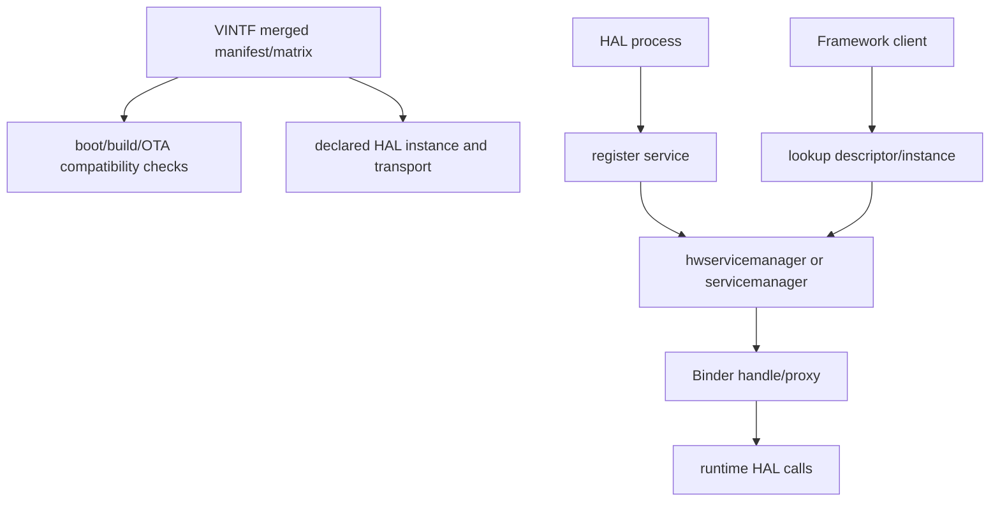

# 89 Android HAL：HIDL、AIDL HAL、hwservicemanager、VINTF 与服务生命周期

> 源码版本：Android 11 / API 30 / `android-11.0.0_r48`
>
> 学习方式：macOS 只读源码，不要求编译。本章同时讲 HIDL 和稳定 AIDL，因为该源码
> tag 已包含两类 vibrator HAL 示例，但具体产品启用哪一种仍由构建、manifest 和 rc 决定。

---

## 1. 先回答：HAL 到底是什么

HAL（Hardware Abstraction Layer）不是一个固定类，也不等于 JNI，更不等于 driver。
它是 Framework 与设备实现之间的一份稳定能力契约及其运行边界。

```text
Framework policy/client
  → generated HAL proxy
  → Binder/HwBinder IPC
  → vendor HAL service
  → kernel ABI: ioctl/read/write/poll/sysfs
  → driver/hardware
```

HAL 主要解决：

- system 与 vendor 可分别构建和升级；
- 把不稳定的硬件细节隐藏在稳定接口后；
- 用 typed method/parcelable/callback 表达能力；
- 通过独立进程和 SELinux domain 隔离故障与权限；
- 用版本、capability、VINTF 描述兼容性；
- 让测试可以针对接口而不是具体驱动。

HAL 不自动解决：权限策略、线程安全、超时、硬件安全、死亡恢复和正确 ABI；这些仍需
逐层设计。

---

## 2. 本章源码地图

| 路径 | 关注点 |
|---|---|
| `hardware/interfaces/vibrator/1.0/IVibrator.hal` | HIDL 1.0 接口语法 |
| `hardware/interfaces/vibrator/1.1`～`1.3` | HIDL minor version 演进 |
| `hardware/interfaces/vibrator/1.3/example/service.cpp` | HIDL 服务注册和线程池 |
| `hardware/interfaces/vibrator/1.3/example/*.xml` | HIDL device manifest fragment |
| `system/libhidl/transport/ServiceManagement.cpp` | `getService/registerAsService` 实现 |
| `system/hwservicemanager/service.cpp` | HwBinder context manager 主进程 |
| `system/hwservicemanager/ServiceManager.cpp` | HIDL add/get/notification/lazy start |
| `system/libhidl/transport/manager/1.0/IServiceManager.hal` | HIDL service manager contract |
| `hardware/interfaces/vibrator/aidl/android/hardware/vibrator/IVibrator.aidl` | VINTF-stable AIDL HAL |
| `hardware/interfaces/vibrator/aidl/Android.bp` | `aidl_interface`、stability、backend、version |
| `hardware/interfaces/vibrator/aidl/default/main.cpp` | NDK Binder AIDL 服务注册 |
| `hardware/interfaces/vibrator/aidl/default/*.xml` | AIDL HAL manifest fragment |
| `system/libvintf/VintfObject.cpp` | manifest/matrix 加载与组合 |
| `system/libvintf/HalManifest.cpp` | HAL instance 兼容检查 |
| `frameworks/base/services/core/jni/com_android_server_VibratorService.cpp` | Framework 同时寻找 AIDL/HIDL HAL 的真实 client |

---

## 3. HIDL 与 AIDL HAL 的时代关系

简化理解：

```text
早期 Treble HAL：HIDL + HwBinder + hwservicemanager
新方向：stable AIDL + Binder + servicemanager
```

但 Android 11 源码不是“一刀切”：同一 vibrator 目录中同时有 HIDL 1.0～1.3 和 AIDL
接口，Framework JNI 也包含兼容寻找逻辑。源码存在不等于该设备运行时一定启用。

| 维度 | HIDL HAL | 稳定 AIDL HAL |
|---|---|---|
| 接口文件 | `.hal` | `.aidl` + `@VintfStability` |
| 常见 native backend | HIDL C++ | NDK Binder（vendor 侧常用） |
| IPC domain | HwBinder | Binder |
| manager | hwservicemanager | servicemanager |
| 典型服务名 | `package@version::Interface/instance` | `descriptor/instance` |
| 版本模型 | package `@major.minor` + inheritance | frozen interface versions + compatible additions |
| VINTF | device manifest/matrix | 同样参与 VINTF（声明 VINTF stability） |

不要把“IDL 语法不同”理解为硬件实现必须重写；底层 driver adapter 可以复用，但进程、
生成代码、注册发现和兼容规则需要按所选接口体系实现。

---

## 4. 三种 Binder 世界不要混

```text
Java/framework Binder
  /dev/binder，servicemanager，AIDL framework services

vendor stable AIDL Binder
  通常仍是 Binder stable interface，由 servicemanager 管理

HIDL HwBinder
  /dev/hwbinder，hwservicemanager，HIDL generated proxy/stub
```

另有 `/dev/vndbinder` 供特定 vendor Binder 场景，但不能仅凭“vendor 进程”就断言所有
vendor IPC 都走 vndbinder。应查看服务注册 API、生成 backend 和进程初始化代码。

`hwservicemanager` 只管理 HIDL/HwBinder 服务；AIDL HAL 不注册到它。

---

## 5. HIDL 接口名称怎样读

完整名字示例：

```text
android.hardware.vibrator@1.3::IVibrator/default
```

拆开：

```text
android.hardware.vibrator  package
@1.3                       major.minor version
::IVibrator                interface
/default                   instance name
```

同一 interface 可以有多个实例，如 `default`、`left`、`right`，但是否允许、是否在
VINTF 中声明、Framework 是否枚举或硬编码 default，要逐项确认。

instance 不是 version；descriptor 也不是进程名。

---

## 6. HIDL `.hal` 生成了什么

概念上，hidl-gen/构建系统会根据接口生成：

```text
IInterface API
BpHw... client proxy
BnHw... server stub
Hw... parcel helpers
types and enum serialization
service helper methods
```

因此阅读“接口定义”时应打开仓库里的 `IVibrator.hal`、`IServiceManager.hal`；C++ 代码中
include 的 `IVibrator.h`、`IServiceManager.h`、`types.h` 通常位于构建输出目录，是由这些
`.hal` 文件生成的头文件。除非已经生成过对应输出，否则不要把生成头文件写成源码树练习路径。

调用者写：

```cpp
sp<IVibrator> service = IVibrator::getService("default");
service->on(timeoutMs);
```

看起来是普通 C++ method，远端场景实际是：

```text
generated proxy packs parcel
  → /dev/hwbinder
  → generated stub unpacks
  → implementation method
  → Return<T>/callback reply
```

是否远端不能单凭 C++ 调用语法判断。

---

## 7. HIDL inheritance 与 minor version

HIDL 常用继承演进：

```text
IVibrator@1.1 extends @1.0
IVibrator@1.2 extends @1.1
IVibrator@1.3 extends @1.2
```

新 minor version 保留旧接口并增加方法。服务注册时通过 `interfaceChain()` 暴露自己及
父接口链，因此一个 1.3 implementation 也能作为兼容父版本被发现/转换。

但“minor 高就必然语义兼容”仍依赖接口规范：不能修改旧方法含义、枚举值、错误语义或
时序保证。客户端还应基于实际 interface/capability 降级。

major version 改变通常代表不兼容契约，不能自动 cast。

---

## 8. HIDL 服务端最小主线

Android 11 vibrator 1.3 example：

```cpp
int main() {
    configureRpcThreadpool(1, true);
    sp<IVibrator> vibrator = new Vibrator();
    status_t status = vibrator->registerAsService();
    if (status != OK) return status;
    joinRpcThreadpool();
}
```

逐句解释：

1. 配置 HwBinder RPC threadpool；
2. 创建本地 implementation；
3. 以默认 instance 注册；
4. 检查注册失败，不能假装成功；
5. 当前线程加入 pool，持续处理 IPC。

`configureRpcThreadpool(1, true)` 不是说进程只有一个线程，而是设置 Binder RPC 并声明
caller 会 join。线程数不足会串行化慢操作，线程数过多又会增加并发与锁压力。

---

## 9. registerAsService 内部发生什么

`system/libhidl/transport/ServiceManagement.cpp` 的主线：

```text
registerAsServiceInternal(service, name)
  → defaultServiceManager1_2()
  → getDescriptor(service)
  → 若强制 VINTF：getTransport(descriptor, instance)
  → 必须声明为 HWBINDER
  → service->interfaceChain(...)
  → hwservicemanager.addWithChain(name, service, chain)
  → onRegistrationImpl(...)
```

所以“代码调用 registerAsService”不等于一定注册成功。失败可能来自：

- hwservicemanager 尚不可用；
- instance 未在 VINTF manifest 声明；
- transport 不匹配；
- SELinux 不允许 add；
- 重复/错误 interface chain；
- Binder transaction 失败。

服务 main 必须检查返回值。

---

## 10. hwservicemanager 是什么

`system/hwservicemanager/service.cpp`：

```text
create ServiceManager
register manager and token manager locally
convert manager to HwBinder object
becomeContextManager()
set hwservicemanager.ready=true
attach HwBinder fd to Looper
pollAll forever
```

它是 HwBinder context manager 和 HIDL 服务目录，类似普通 Binder 世界里的
servicemanager，但协议、driver domain 与数据结构不同。

它不代理每次 HAL 业务调用的数据：client 从 manager 拿到 service Binder handle 后，
业务 transaction 直接在 client 与 HAL service 间进行。manager 主要负责名字、注册、
发现、通知、权限和生命周期元数据。

---

## 11. hwservicemanager 的访问控制

`ServiceManager::get/add` 调用 `mAcl.canGet/canAdd`。调用上下文包括 Binder 提供的
pid/uid/SID，SELinux policy 决定哪些 domain 可以：

```text
add 某 HAL service
find/get 某 HAL service
call 某 HAL Binder object
```

这些是不同权限。典型故障：

```text
HAL 能启动，但 register 被拒
Framework 能 find，但业务 call 被拒
manifest 正确，但 client domain 无 find 权限
```

因此排错需同时看 VINTF、service manager 日志、进程 domain 与 AVC，不能只检查 XML。

---

## 12. HIDL getService 主线

客户端调用 `IVibrator::getService()` 最终进入 `getRawServiceInternal()`：

```text
问 hwservicemanager getTransport(descriptor, instance)
  ├─ HWBINDER → 通过 hwservicemanager get
  ├─ PASSTHROUGH → passthrough service manager/load impl
  └─ EMPTY → 取决于 legacy/testing/VINTF enforcement

若 retry=true 且是 hwbinder
  → 等待 registration notification
  → 再 get

拿到 IBase
  → canCastInterface
  → 包装成目标 typed proxy
```

`getService()` 可能等待服务出现；`tryGetService()` 倾向立即返回。精确行为要看生成 helper
传入的 retry 参数。不要在 system_server 关键锁、主线程或启动关键路径上无界等待。

---

## 13. lazy HAL 如何被尝试启动

hwservicemanager 查不到服务时会调用 `tryStartService()`，异步设置：

```text
ctl.interface_start=<fqName>/<instance>
```

init 根据 rc 中的 `interface` 声明尝试启动 HIDL lazy HAL。如果：

- rc 没有相应 interface；
- service 名字拼错；
- 服务已运行但死锁在注册前；
- binary/SELinux/依赖失败；

属性动作可能无效果，日志会反复出现“trying to start it as a lazy HAL”。这不是 manager
能凭空创建 implementation。

---

## 14. HIDL manifest fragment 怎样读

vibrator 1.3 example：

```xml
<manifest version="1.0" type="device">
  <hal format="hidl">
    <name>android.hardware.vibrator</name>
    <transport>hwbinder</transport>
    <version>1.3</version>
    <interface>
      <name>IVibrator</name>
      <instance>default</instance>
    </interface>
  </hal>
</manifest>
```

它声明“device 提供什么”，不是启动脚本，也不包含 executable path。服务能否启动还要
看 binary 是否装入镜像、init rc、SELinux 和依赖。

---

## 15. manifest 与 compatibility matrix

先用供需关系理解：

```text
manifest：这一侧实际提供/声明了什么
compatibility matrix：另一侧要求什么版本/实例/可选性
```

Treble 兼容检查主要比较：

```text
device manifest ↔ framework compatibility matrix
framework manifest ↔ device compatibility matrix
```

VINTF 还覆盖 kernel FCM、sepolicy/VNDK 等兼容信息，但本章聚焦 HAL。

manifest 不是运行时健康检查：XML 中有服务不代表进程活着；服务注册成功也不代表每个
method 正常。它描述兼容契约与实例清单。

---

## 16. VINTF 文件从哪里合并

`VintfObject.cpp` 会按 Android 11 规则读取并组合 system/vendor/odm/product/system_ext 的
manifest、SKU-specific 文件和 fragments。device 侧常见来源包括：

```text
/vendor/etc/vintf/manifest.xml
/vendor/etc/vintf/manifest/*.xml
/odm/etc/vintf/manifest*.xml
```

framework 侧常见：

```text
/system/etc/vintf/manifest.xml + fragments
/product/etc/vintf/manifest.xml + fragments
/system_ext/etc/vintf/manifest.xml + fragments
```

还有 legacy fallback。不要只看某一个源码 XML 就断言最终 merged manifest；构建变量、
SKU、fragment 和 override 都会改变结果。

---

## 17. FCM level 与 HAL version 不是同一个数字

```text
Framework Compatibility Matrix level
  → 某代 framework/vendor 兼容要求集合

HAL version
  → 单个接口自身版本

manifest meta-version
  → VINTF XML schema/version
```

三者可能都出现“1、2、3”，但含义完全不同。排错时写全名称，不要只说“版本 3”。

---

## 18. passthrough 与 binderized HIDL

HIDL 曾支持：

```text
hwbinder/binderized
  client IPC → 独立 HAL process

passthrough
  client dlopen implementation → 同进程调用
```

binderized 提供更清晰的进程隔离和 SELinux domain；passthrough native crash 会直接杀
client，且 system/vendor library 边界更复杂。Treble 化设备一般强调 binderized HAL。

看到 `getStub`、`getPassthroughServiceManager`、`wrapPassthrough` 是兼容路径，不代表当前
产品一定使用 passthrough。

---

## 19. HIDL Return<T> 不能不检查

HIDL method 的 `Return<T>` 同时承载：

```text
transport status：Binder transaction 是否成功
business result：HAL method 返回的 Result/值
```

常见错误：

```cpp
Result r = service->on(ms); // 忽略 transport failure
```

应该先确认 `ret.isOk()`，再解释业务结果。`hwservicemanager` main 设置
`ERROR_IF_UNCHECKED`，也体现未检查 HIDL Return 是严重错误。

transport dead object 不能映射成业务成功或 unsupported。

---

## 20. callback 的两种形态

HIDL 常见：

1. method 的 response callback，用于返回多个/out 参数；
2. client 注册的远程 callback interface，用于后续异步事件。

它们都可能运行在 Binder RPC thread，而不是调用者 Handler。HAL implementation 不能：

- 持锁调用外部 callback；
- 假设 callback 永不重入；
- 无限等待 callback；
- 保存裸指针而不处理 client death；
- 在旧 generation callback 中更新新设备状态。

Framework client 应快速投递到自己的序列化执行器。

---

## 21. linkToDeath 解决什么、不解决什么

client 对远端 service `linkToDeath()`：HAL 进程死亡时 Binder 驱动通知 death recipient。
它能帮助：

- 清空 stale proxy；
- 失败 pending requests；
- 标记 hardware unavailable；
- 启动有界重连；
- 重注册 callback 并重新 query state。

它不能保证：

- death 前最后一条业务 callback 一定送达；
- HAL 自动重启；
- 新进程状态与旧状态连续；
- client 自己不崩溃；
- 物理硬件恢复。

死亡通知是恢复触发器，不是恢复本身。

---

## 22. 服务重新注册与旧 proxy

HAL crash 后 init 可能重启相同 binary，新实例用相同 service name 注册。但旧 Binder
proxy 仍指向死亡对象，不会自动变成新对象。

正确恢复：

```text
death callback
  → generation++
  → atomically clear proxy
  → fail/cancel old requests
  → wait notification or bounded get
  → acquire new proxy
  → linkToDeath(new)
  → register callbacks(new)
  → query capabilities and state
  → publish READY(new generation)
```

所有异步结果携带或关联 generation，防止旧 HAL callback 污染新状态。

---

## 23. notification 与 getService 的区别

HIDL service manager 支持 `registerForNotifications(fqName, instance, callback)`。注册时可
收到已有实例（`preexisting=true`），以后收到新注册通知。

它适合：

- 不希望线程阻塞等待；
- lazy/可选 HAL；
- HAL death 后等待重注册；
- 动态实例发现。

但 registration notification 只说明服务对象注册，不代表硬件完成校准、callback 注册
成功或 capability 可用。收到通知后仍需 handshake/query。

---

## 24. stable AIDL HAL 的接口声明

vibrator AIDL 包含：

```aidl
@VintfStability
interface IVibrator {
    int getCapabilities();
    void off();
    void on(in int timeoutMs, in IVibratorCallback callback);
    ...
}
```

`Android.bp`：

```bp
aidl_interface {
    name: "android.hardware.vibrator",
    vendor_available: true,
    stability: "vintf",
    backend: {
        java: { platform_apis: true },
        ndk: { vndk: { enabled: true } },
    },
    versions: ["1"],
}
```

`stability: "vintf"` 和 `@VintfStability` 表示接口承诺跨 system/vendor 的稳定规则，不是
“此方法永不失败”。冻结版本和兼容演进由构建工具检查。

---

## 25. 为什么 vendor AIDL HAL 偏向 NDK backend

稳定 AIDL 可生成多种 backend，但 vendor native HAL 通常使用 NDK Binder backend，以
稳定的 NDK/VNDK 边界避免依赖不稳定 platform C++ ABI。

```text
AIDL source
  → NDK generated Bn/Bp/interface/parcelable
  → libbinder_ndk
  → Binder driver
```

Java backend 出现在配置中不代表 vendor service 必须用 Java；client 与 server 可以使用
不同生成语言，只要 wire contract 一致且该 backend/partition 组合受支持。

---

## 26. AIDL HAL 服务端主线

Android 11 vibrator AIDL example 的 `main.cpp`：

```cpp
ABinderProcess_setThreadPoolMaxThreadCount(0);
auto vib = ndk::SharedRefBase::make<Vibrator>();
std::string instance = Vibrator::descriptor + std::string("/default");
binder_status_t status =
    AServiceManager_addService(vib->asBinder().get(), instance.c_str());
CHECK(status == STATUS_OK);
ABinderProcess_joinThreadPool();
```

与 HIDL 对照：

```text
HIDL registerAsService → hwservicemanager → HwBinder pool
AIDL AServiceManager_addService → servicemanager → Binder NDK pool
```

这里 max thread count 为 0 是这个 example 的具体线程池配置，不能照搬后仅凭名字猜并发
语义；应结合 libbinder_ndk 实现和服务耗时设计。

---

## 27. AIDL 服务名怎样读

```text
android.hardware.vibrator.IVibrator/default
```

由：

```cpp
IVibrator::descriptor + "/default"
```

组成。VINTF fragment：

```xml
<hal format="aidl">
  <name>android.hardware.vibrator</name>
  <fqname>IVibrator/default</fqname>
</hal>
```

HIDL 的 `@1.3::IVibrator/default` 与 AIDL 的 `IVibrator/default` 不能混写。客户端请求名、
manifest fqname 和注册名必须一致；若 rc 声明了 lazy `interface`，它也必须对应。

---

## 28. AIDL interface version 与 capability

稳定 AIDL 的冻结 version 解决“wire/API 合同如何演进”，capability 解决“这个具体硬件
实现会什么”。两者不能互相替代：

```text
interface version 2
  不代表所有可选硬件 effect 都支持

CAP_COMPOSE_EFFECTS
  不代表 client 可以调用未来 version 才增加的方法
```

client 通常同时：

```text
确认服务/interface version
查询 capability/supported enum/list
按能力调用或 fallback
```

设备型号硬编码是最后手段，会让 GSI、升级和多供应商适配变脆。

---

## 29. AIDL 兼容演进原则

稳定 AIDL 的安全演进通常遵循：

- 不删除/重排既有方法和字段；
- 新字段有合理默认语义；
- 新 enum 值要求旧 client 能安全处理未知值；
- 不改变旧方法的权限、单位、范围和错误语义；
- 使用构建系统冻结/dump API；
- vendor/system 跨界 parcelable 必须稳定；
- 对可选硬件能力仍提供 capability。

“能通过编译”不等于升级兼容；旧 vendor service 与新 framework client 的组合必须按
VINTF 和 stable AIDL 规则验证。

---

## 30. HIDL 与 AIDL 的错误表达差异

HIDL 常见：

```text
Return<Result>
Return<void> + hidl callback(Result, values...)
transport status 与 Result 分开
```

AIDL NDK 常见：

```text
ndk::ScopedAStatus
out return value / parcelable
service-specific exception/code
Binder transaction status
```

无论哪种，都要区分：

```text
unsupported
invalid argument
temporarily unavailable/busy
permission denied
hardware disconnected
timeout
transport dead object
internal failure
```

不要把所有失败压成 boolean，否则 Framework 无法决定 fallback、retry、告警或安全停机。

---

## 31. VINTF 与运行时 service manager 的关系



VINTF 是声明/兼容约束，service manager 是运行时 registry。二者都正确才构成稳定启动，
但职责不相同。

---

## 32. init rc 与 VINTF 也不是一回事

```text
VINTF XML
  → 系统承诺提供哪一个 interface/instance/transport

init rc
  → 哪个 executable、何时启动、class/user/group/domain、是否 disabled/lazy、interface 名
```

常见组合错误：

- XML 声明 default，rc interface 写错 instance；
- rc 启动 binary，但 XML 未声明，HIDL VINTF enforcement 拒绝注册；
- XML 和 rc 正确，binary 链接库/设备节点失败；
- 服务注册成功，但 Framework 请求另一个 version/name。

排错必须把 XML、rc（若使用 lazy/interface 声明）、service main、client lookup 中的名字
并排比较。要特别注意：本 tag 的 AIDL vibrator example rc 只是 eager `class hal` 服务，
没有 `interface` 行；这不影响它在 `main.cpp` 主动向 servicemanager 注册。不能把 HIDL
lazy HAL 的 rc 模式机械套到每个 AIDL HAL。

---

## 33. binderized HAL 的线程模型

典型线程：

```text
Framework caller thread
  → proxy transaction

HAL Binder/HwBinder pool thread
  → stub validation
  → implementation method
  → driver ioctl/read/write

driver IRQ/workqueue or HAL worker
  → HAL callback transaction

Framework Binder callback thread
  → post to Handler/state machine
```

风险：

- HAL pool 被阻塞调用耗尽；
- Framework 持锁同步调用 HAL，HAL callback 又回调同一锁；
- HAL 在 Binder thread 等永不完成的硬件；
- one-way callback 无背压导致队列增长；
- callback thread 直接修改非线程安全 Framework 状态。

---

## 34. 同步、异步与 oneway

同步 Binder 调用只保证 transaction/reply 完成，不一定代表物理动作完成。接口必须明确：

```text
accepted
queued
started
physically completed
failed/canceled
```

异步设计建议：

```text
start(requestId, generation, params) → accepted/error
onComplete(requestId, generation, result)
cancel(requestId)
getState() → authoritative snapshot
```

`oneway` 只改变 IPC 调度/无同步 reply，不自动获得可靠、高吞吐或无限队列。错误反馈和
背压需要另行设计。

---

## 35. HAL 实现为什么不能只包一层 ioctl

合理 HAL 可能负责：

- kernel ABI/version adapter；
- capability discovery；
- 多设备实例与仲裁；
- request serialization；
- poll/read event thread；
- timeout/cancel/recovery；
- errno 到稳定 HAL status 的映射；
- firmware/protocol compatibility；
- hardware-specific fallback。

但不应把 App 用户策略、UI、跨用户授权全部塞进 HAL；这些属于 Framework SystemService。

---

## 36. Framework 与 HAL 的职责分界

| Framework service | HAL service |
|---|---|
| Android permission/AppOps | driver/node access |
| caller UID/package/user/profile | hardware protocol |
| 多 App 策略和优先级 | hardware queue/arbitration |
| public API 稳定语义 | kernel ABI 适配 |
| 系统模式/电源策略 | capability/low-level state |
| 对外隐私裁剪 | vendor-specific data parsing |
| dumpsys/系统统计 | device diagnostics |

两边都可能有状态机，但层级语义不同。Framework 不应信任 HAL 返回的长度、enum、索引
一定合法；HAL 也不能假设 Framework 参数永远正确。

---

## 37. VibratorService 的真实兼容链

Android 11 `com_android_server_VibratorService.cpp` 展示一个迁移期 client：

```text
VibratorService Java
  → JNI native methods
  → try AIDL IVibrator
  → AIDL 不可用时，按具体功能调用相应 HIDL vibrator version
  → query capability/effect support
  → invoke HAL and receive completion
```

这说明：

- Framework 可以同时支持新旧 HAL；
- fallback 顺序是具体源码策略，不是所有 HAL 的通用模板；
- 成功拿到 service 后仍需查询 capability；
- AIDL completion callback 与 transport failure/retry 仍要处理；
- 迁移窗口结束后，未来版本源码可能删除旧路径。

阅读时应以当前 tag 为准，不把 Android 11 代码当作 2026 最新平台行为。

---

## 38. 服务获取应缓存吗

每次操作都查 manager 增加开销和竞态；永久缓存又会保留 dead proxy。常见折中：

```text
lock-protected current proxy + generation
fast path copy strong ref under lock
unlock before remote call
on transport death atomically invalidate
single-flight reconnect
```

不要在持有全局锁时执行 `getService()` 或远端 method。多个线程同时发现死亡时应避免
同时无限重连，可用 reconnect state/backoff。

---

## 39. 服务启动顺序

典型依赖：

```text
servicemanager/hwservicemanager ready
  → init starts eager HAL，或 client lookup 触发 lazy HAL
  → HAL opens driver and registers service
  → Framework obtains proxy
  → register callback/query state
```

服务是先 open driver 再 register，还是先 register 并报告 NOT_READY，是架构选择：

- 先初始化后注册：client 看不到半初始化服务，但启动慢时 lookup 等待；
- 先注册后初始化：启动更快，但接口必须明确 NOT_READY 和状态通知。

无论哪种都要有界超时和可诊断状态。

---

## 40. lazy HAL 的生命周期陷阱

lazy HAL 可在没有 client 时退出、需要时由 interface lookup 拉起。实现需考虑：

- client strong reference 计数；
- callback registration 是否阻止退出；
- worker/driver fd 清理；
- 再启动后的状态恢复；
- pending hardware action 是否可中断；
- 多个 client 同时触发启动；
- init restart/backoff。

“lazy”不是把普通 service 加 `disabled` 就完成；必须使用匹配的 rc interface、lazy
registrar/manager 机制和可重建状态设计。

---

## 41. HAL death 与硬件断连是两类故障

```text
HAL death
  Binder object/process 消失
  → linkToDeath, dead object, reacquire service

hardware disconnect
  HAL process仍活着，但 device node/fd/protocol失效
  → typed status/callback, reconnect hardware
```

二者可能同时发生，但恢复路径不同。若 Framework 只监听 HAL death，HAL 活着但硬件拔出
时状态会错误；若只监听硬件 callback，HAL crash 时不会收到 callback。

---

## 42. SELinux 跨层权限图

```text
Framework domain
  → find HAL service
  → call HAL Binder/HwBinder

HAL domain
  → add/register HAL service
  → open/read/write/ioctl device type
  → use sysfs type/property/socket as needed

hwservicemanager/servicemanager
  → context manager and registry policy
```

独立 HAL 的一个价值是 system_server 不必直接拥有设备节点权限。把设备访问 allow 给
system_server 以绕过 HAL，通常会破坏隔离和 Treble 边界。

---

## 43. VINTF compatibility 并非接口测试替代品

VINTF 能发现：

- required instance/version 缺失；
- manifest/matrix 不兼容；
- transport/格式声明错误；
- deprecated/unused HAL 等结构问题。

它不能证明：

- method 语义正确；
- timeout 和并发安全；
- callback 次序正确；
- 参数边界安全；
- 硬件真实工作；
- 功耗/性能满足要求。

还需 VTS、unit/integration test、故障注入和真实硬件验证。本课程在 Mac 上只读源码，
但要理解测试层级。

---

## 44. HAL API 设计清单

```text
方法名是否表达动作还是状态
单位是否写清（ms/us/ns、Hz、摄氏度）
数值范围和 NaN/overflow 是否定义
enum 未知值如何处理
parcelable 新字段默认值是什么
同步返回表示 accepted 还是 completed
callback 是否 exactly-once、at-most-once 或 best-effort
cancel 与 completion 竞态如何裁决
timeout 在哪一层负责
是否需要 requestId/generation/timestamp
capability 如何发现
服务/硬件 death 后如何 resync
大数据是否应用共享内存/FMQ 而非 Binder parcel
敏感数据是否最小化
```

---

## 45. 高频数据为什么不走普通 HAL callback

每个采样一次 Binder callback 会带来 transaction、调度、copy/serialization 和线程切换。
高频传感/音视频/连续 telemetry 更适合：

- FMQ；
- shared memory/ring buffer；
- mmap；
- batch；
- 专用 data plane。

Binder/HIDL/AIDL 作为 control plane：配置、启动、停止、buffer descriptor 和低频状态。
data plane 和 control plane 分离是 HAL 性能设计的重要原则。

---

## 46. mower HAL 教学设计

假设使用稳定 AIDL：

```aidl
@VintfStability
interface IMower {
    MowerCapabilities getCapabilities();
    MowerSnapshot getSnapshot();
    long start(in StartRequest request);
    void cancel(long requestId);
    void registerCallback(IMowerCallback callback);
}
```

推荐运行链：

```text
MowerManager/App
  → Framework MowerService: permission/AppOps/user/safety policy
  → AIDL HAL proxy
  → vendor.mower-hal: generation, driver adapter, event thread
  → /dev/mower_ctrl ioctl + poll/read
```

callback：

```text
onStateChanged(generation, snapshotVersion)
onRequestComplete(generation, requestId, result)
onHardwareAvailabilityChanged(generation, available)
```

详细状态仍通过 snapshot 查询，callback 只传稳定、有限的数据。

---

## 47. HIDL 到 AIDL 迁移策略

常见迁移期：

```text
Framework adapter
  ├─ prefer AIDL instance
  └─ fallback HIDL newest → older
```

要明确：

- 两套服务不能同时控制同一硬件造成双 owner；
- fallback 只在 service unavailable/unsupported 时发生，不能吞掉真实硬件错误；
- capability 要映射成统一 Framework 语义；
- HIDL/AIDL error code 和 callback 次序需归一化；
- dumpsys 要显示实际选中的 backend/version/instance；
- 切换 backend 时 generation 增加、旧请求失效。

不要让 Framework 各处散落 `if (aidl) else if (hidl13)...`，应集中在 adapter。

---

## 48. 常见错误认识

1. **HAL 就是 JNI**：错，JNI 是同进程语言边界，HAL 通常是稳定接口/进程边界。
2. **所有 HAL 都由 hwservicemanager 管**：错，HIDL 是；AIDL HAL 用 servicemanager。
3. **vendor AIDL 一定走 vndbinder**：错，需看具体 stable AIDL 与注册实现。
4. **源码有 AIDL 示例，设备就运行 AIDL**：错，还需构建、rc、VINTF 和产品选择。
5. **manifest 会启动服务**：错，init rc/lazy interface 才负责进程启动。
6. **注册成功说明硬件 ready**：错，取决于服务初始化协议。
7. **VINTF 通过说明 HAL 功能正确**：错，它主要验证兼容声明。
8. **HAL version 等于 FCM level**：错，是不同版本轴。
9. **HIDL minor version 可随意改变旧语义**：错，继承要求兼容。
10. **capability 可由 interface version 替代**：错，硬件可选能力仍需查询。
11. **getService 总是立即返回**：错，可能等待；tryGetService 更适合非阻塞探测。
12. **proxy 在服务重启后自动复活**：错，需重新获取。
13. **linkToDeath 自动恢复服务**：错，它只通知死亡。
14. **callback 一定在主线程**：错，通常先到 Binder pool。
15. **oneway 就不会阻塞或堆积**：错，队列和下游处理仍有限。
16. **持锁调用 HAL 更安全**：错，可能死锁、阻塞全局状态。
17. **HAL death 就是硬件拔出**：错，必须分别建模。
18. **独立 HAL 后 driver 参数可以不校验**：错，所有跨边界输入仍不可信。

---

## 49. Mac 上十二轮只读练习

### 第一轮：HIDL 接口演进

```bash
sed -n '1,220p' hardware/interfaces/vibrator/1.0/IVibrator.hal
sed -n '1,180p' hardware/interfaces/vibrator/1.3/IVibrator.hal
```

列出 1.3 继承关系、新增方法和旧方法保留方式。

### 第二轮：HIDL 服务 main

```bash
sed -n '1,120p' hardware/interfaces/vibrator/1.3/example/service.cpp
cat hardware/interfaces/vibrator/1.3/example/*.xml
```

把 interface descriptor、instance、transport、threadpool 对齐。

### 第三轮：registerAsService

```bash
sed -n '810,875p' system/libhidl/transport/ServiceManagement.cpp
```

找到 VINTF transport 检查、interfaceChain 和 addWithChain。

### 第四轮：getService

```bash
sed -n '720,825p' system/libhidl/transport/ServiceManagement.cpp
```

画 HWBINDER、PASSTHROUGH、legacy 三条分支。

### 第五轮：hwservicemanager main

```bash
sed -n '1,220p' system/hwservicemanager/service.cpp
```

找到 context manager、ready property、HwBinder fd 和 Looper。

### 第六轮：manager add/get

```bash
rg -n 'ServiceManager::get\(|ServiceManager::add\(|addImpl|tryStartService' \
  system/hwservicemanager/ServiceManager.cpp
```

记录 ACL、lazy start、interface chain 和 client tracking。

### 第七轮：HIDL manager contract

```bash
sed -n '1,190p' system/libhidl/transport/manager/1.0/IServiceManager.hal
```

比较 get、add、list、registerForNotifications。

### 第八轮：stable AIDL contract

```bash
sed -n '1,240p' hardware/interfaces/vibrator/aidl/android/hardware/vibrator/IVibrator.aidl
sed -n '1,100p' hardware/interfaces/vibrator/aidl/Android.bp
```

找到 `@VintfStability`、capabilities、callback、versions 和 NDK backend。

### 第九轮：AIDL service main

```bash
sed -n '1,100p' hardware/interfaces/vibrator/aidl/default/main.cpp
cat hardware/interfaces/vibrator/aidl/default/vibrator-default.xml
cat hardware/interfaces/vibrator/aidl/default/vibrator-default.rc
```

核对 descriptor/default、servicemanager、eager rc 与 VINTF fragment；并确认这个 rc 没有
lazy `interface` 行，理解“进程启动声明”和“运行时服务注册”不是同一行配置。

### 第十轮：VINTF 合并

```bash
sed -n '210,430p' system/libvintf/VintfObject.cpp
rg -n 'isCompatible|matchInstance|minorAtLeast' system/libvintf/HalManifest.cpp
```

画 system/vendor/odm/product fragments 到 merged manifest 的关系。

### 第十一轮：Framework 兼容 client

```bash
sed -n '1,300p' frameworks/base/services/core/jni/com_android_server_VibratorService.cpp
```

标出 AIDL/HIDL service 获取、version fallback、capability、callback 和 transport error。

### 第十二轮：设计 mower 生命周期

分别画：

```text
process: STARTING → REGISTERED → READY → DEAD → RECONNECTING
hardware: ABSENT → OPENING → READY → ERROR/DISCONNECTED
request: NEW → ACCEPTED → RUNNING → COMPLETED/CANCELED/TIMED_OUT
```

为每条异步消息补 generation/requestId。

---

## 50. 可选设备观察

有调试设备且命令可用时：

```bash
adb shell lshal
adb shell service list
adb shell ps -A -Z | grep -E 'hwservicemanager|servicemanager|vibrator'
adb shell getprop hwservicemanager.ready
adb shell cat /vendor/etc/vintf/manifest.xml 2>/dev/null
adb shell find /vendor/etc/vintf /odm/etc/vintf -type f 2>/dev/null
adb shell dumpsys vibrator
adb shell logcat -b all | grep -E 'hwservicemanager|vibrator|VINTF|avc:'
```

不同版本工具和权限可能不同。只读即可，不需在 Mac 编译或替换 HAL。

---

## 51. 分层故障排查表

| 现象 | 首查 |
|---|---|
| binary 未启动 | init rc、class/trigger、binary/linker、SELinux transition |
| HIDL 不断尝试 lazy start | rc `interface` 与 descriptor/instance 是否一致 |
| registerAsService 失败 | VINTF transport/instance、add ACL、manager ready |
| AIDL addService 失败 | servicemanager 名称/SELinux、重复注册、Binder 初始化 |
| client 找不到服务 | manager domain、manifest、实例名、启动顺序 |
| 找到服务但 call denied | Binder/HwBinder call SELinux 权限 |
| method 返回 transport error | HAL death、Binder pool、transaction/parcel |
| method 业务 unsupported | capability/version/硬件实现，不应盲目重启 |
| 偶发卡死 | 持锁外调、pool exhaustion、driver 无限等待、callback 重入 |
| 重启后状态错 | 旧 proxy/callback、未重注册、未 query、generation 缺失 |
| VINTF incompatibility | merged manifest 与对应 matrix/FCM level |
| HAL 正常但 App 失败 | Framework permission/AppOps/user/policy |

---

## 52. 实现检查表

```text
[ ] 明确选择 HIDL 或 stable AIDL，不混用 manager/driver domain
[ ] descriptor、instance、VINTF、client lookup，以及适用时的 rc interface 完全一致
[ ] 服务 main 检查注册返回值
[ ] 线程池大小与同步操作耗时匹配
[ ] 不在 Binder thread 无限等硬件
[ ] 不持关键锁调用远端 HAL/callback
[ ] transport status 与业务 status 分开
[ ] interface version 与 hardware capability 分开
[ ] 未知 enum/字段有向前兼容行为
[ ] request 有 requestId、timeout、cancel 和 exactly-once terminal state
[ ] linkToDeath 后清 proxy、失败旧请求并有界重连
[ ] 新 proxy 重新 link death/register callback/query snapshot
[ ] generation 拒绝旧 HAL/旧硬件 callback
[ ] lazy restart 后所有内存态可重建
[ ] HAL death与hardware disconnect分别建模
[ ] 高频数据走 FMQ/shared memory/batch
[ ] HAL domain 只获得必要 device/sysfs 权限
[ ] Framework 保留 permission/AppOps/user/policy
[ ] dumpsys/log 显示 backend/version/instance/generation/last error
[ ] VINTF/VTS/集成/故障注入各自覆盖对应风险
```

---

## 53. 自测题

1. HAL、JNI 和 driver 的职责分别是什么？
2. HIDL 与稳定 AIDL HAL 分别使用哪个 service manager？
3. 为什么不能说 vendor AIDL 一定走 `/dev/vndbinder`？
4. 如何拆解 HIDL fqname？
5. HIDL generated proxy/stub 做什么？
6. minor version inheritance 有何兼容约束？
7. HIDL service main 的配置、注册、join 三步是什么？
8. registerAsService 为什么会被 VINTF 拒绝？
9. hwservicemanager 是不是每次业务调用的中转站？
10. add、find/get、call 为什么是不同权限？
11. getService 与 tryGetService 有何风险差异？
12. lazy HAL 是怎样由 `ctl.interface_start` 尝试拉起的？
13. manifest 与 init rc 各负责什么？
14. manifest 与 compatibility matrix 是怎样的供需关系？
15. HAL version、FCM level、manifest meta-version 有何不同？
16. passthrough 与 binderized HIDL 的故障边界有何不同？
17. HIDL `Return<T>` 为什么同时检查 transport 和业务结果？
18. callback 通常运行在哪个线程？
19. linkToDeath 能做什么、不能做什么？
20. HAL 重启后为何不能继续使用旧 proxy？
21. stable AIDL 的 `@VintfStability` 表示什么？
22. AIDL HAL 为什么常用 NDK backend？
23. AIDL 服务名如何由 descriptor 和 instance 组成？
24. interface version 为什么不能代替 capability？
25. VINTF 兼容通过为什么不能代替功能测试？
26. one-way 方法为什么仍可能堆积？
27. HAL death 与硬件断连为何需要两套状态？
28. HIDL→AIDL fallback 为什么不能吞掉真实硬件错误？
29. 高频数据为何应分离 control plane 与 data plane？
30. 一个 HAL 找不到时，应比较 VINTF、适用的 rc、server 注册名和 client lookup 哪些内容？

---

## 54. 最终记忆图

```text
【HIDL】
.hal → generated BpHw/BnHw
service configureRpcThreadpool
  → registerAsService
  → hwservicemanager + VINTF hwbinder declaration
client getService/notification
  → /dev/hwbinder → HAL process

【stable AIDL HAL】
@VintfStability .aidl + frozen versions
  → NDK generated Binder code
service AServiceManager_addService(descriptor/default)
  → servicemanager + AIDL VINTF declaration
client Binder proxy
  → HAL process

【声明与运行】
VINTF manifest = what is provided
compatibility matrix = what is required
init rc = how/when process starts
service manager = runtime name registry
Binder handle = direct client↔server transaction path

【生命周期】
STARTING → REGISTERED → HANDSHAKE → READY
  → death/disconnect
  → clear proxy + generation++ + reacquire
  → link death + callback + capability + snapshot

【共同原则】
transport status ≠ business status
interface version ≠ hardware capability
registration ≠ hardware ready
death notification ≠ automatic recovery
VINTF compatibility ≠ functional correctness
```

---

## 55. 本章总结

1. HAL 是 system/vendor 之间的稳定硬件能力契约，JNI 是语言边界，driver 是内核执行层；
2. HIDL 使用 `.hal`、HwBinder 和 hwservicemanager；稳定 AIDL HAL 使用 `.aidl`、Binder 和 servicemanager；
3. HIDL `registerAsService/getService` 会结合 VINTF transport、interface chain、ACL 和注册通知；
4. VINTF manifest 描述提供实例，compatibility matrix 描述兼容要求，init rc 才负责启动进程；
5. stable AIDL 通过 `@VintfStability`、冻结版本和 NDK backend 支撑 system/vendor 独立演进；
6. interface version 解决合同演进，capability 解决具体硬件能力，二者必须同时处理；
7. 服务注册不等于硬件 ready，Framework 应完成 handshake、能力查询和 snapshot 同步；
8. HAL death 后旧 proxy 不会复活，必须清理旧请求、重新获取、link death、注册 callback 并 query；
9. Binder/HwBinder callback、线程池、锁、超时、oneway 背压和 generation 是稳定性的核心；
10. HIDL→AIDL 迁移应集中适配、避免双 owner，并把 backend/version/capability/error 归一化。

下一章：**第 90 章——Android Binder 驱动深入：binder_proc、binder_thread、binder_node、transaction 与死亡通知内核链路**。
