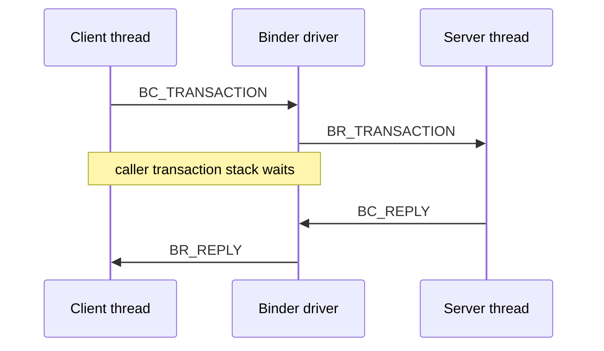

# 90 Android Binder 驱动：进程、线程、节点、事务与死亡通知内核链路

> 源码版本：Android 11 / API 30 / `android-11.0.0_r48`
>
> 本地源码边界：当前 AOSP checkout 包含 `frameworks/native/libs/binder` 和 Binder UAPI，
> 但不包含配套 Linux kernel 的 `drivers/android/binder.c`。因此用户态部分可直接逐行阅读；
> 内核部分以 Android Binder 驱动的稳定对象模型和与 UAPI 命令的对应关系讲解。若以后
> 补齐设备匹配的 kernel source，再按本章检索词定位具体版本实现。

---

## 1. 本章要打通的链路

```text
BpBinder::transact()
  → IPCThreadState::transact()
  → BC_TRANSACTION 写入 mOut
  → ioctl(BINDER_WRITE_READ)
  → binder driver 解析 transaction
  → 找到目标 proc/node/thread
  → 翻译 Binder object 和复制 transaction buffer
  → BR_TRANSACTION 唤醒服务端线程
  → BBinder::transact()/onTransact()
  → BC_REPLY
  → driver 沿 transaction stack 找回 caller
  → BR_REPLY
  → client Parcel reply
```

完成本章后应能回答：

- handle 为什么只在一个进程内有意义？
- server 的本地对象如何变成 client 的 `BpBinder`？
- Binder 为什么不是简单 socket send/recv？
- 同步调用在等待 reply 时能否处理嵌套事务？
- oneway 为什么不等于无限吞吐？
- 进程死亡怎样触发 `binderDied()`？
- Binder buffer 为什么可能耗尽？
- `BR_TRANSACTION_COMPLETE` 为什么不等于业务完成？

---

## 2. 源码地图

| 路径 | 作用 |
|---|---|
| `frameworks/native/libs/binder/ProcessState.cpp` | 每进程 driver fd、mmap、handle→proxy cache、线程池 |
| `frameworks/native/libs/binder/IPCThreadState.cpp` | 每线程命令缓冲、ioctl、transaction/reply、命令执行 |
| `frameworks/native/libs/binder/BpBinder.cpp` | 远端对象代理、handle、死亡监听 |
| `frameworks/native/libs/binder/Binder.cpp` | 本地 `BBinder` 与 `onTransact` |
| `frameworks/native/libs/binder/Parcel.cpp` | 数据与 Binder/FD 对象序列化 |
| `frameworks/native/libs/binder/include/binder/*.h` | 用户态类和 API |
| `frameworks/native/libs/binder/include/private/binder/binder_module.h` | Binder UAPI include/兼容入口 |
| `bionic/libc/kernel/uapi/linux/android/binder.h` | ioctl、BC/BR、transaction data 等 UAPI |
| `frameworks/native/cmds/servicemanager` | context manager/service registry 用户态实现 |
| `system/libhwbinder` | HwBinder 对照实现，不是本章普通 Binder主线 |

若有匹配 kernel tree，检索：

```text
drivers/android/binder.c
drivers/android/binder_internal.h
drivers/android/binder_alloc.c
drivers/android/binderfs.c
```

不同 kernel 版本结构和锁实现会变化，概念对象基本保持。

---

## 3. 六个核心对象先建立直觉

| 概念 | 所属 | 一句话 |
|---|---|---|
| `ProcessState` | userspace/process | 一个 Binder driver 连接和 proxy cache |
| `IPCThreadState` | userspace/thread | 当前线程的 BC 输出、BR 输入与 calling identity |
| `BpBinder` | userspace/client | 某个远端 Binder handle 的代理 |
| `BBinder` | userspace/server | 本进程真正接收 `onTransact` 的对象 |
| `binder_proc` | kernel/process | 打开 Binder driver 的进程状态 |
| `binder_thread` | kernel/thread | 进入 driver 的线程、等待队列和 transaction stack |
| `binder_node` | kernel/object owner | 某个进程拥有的本地 Binder object 的内核代表 |
| `binder_ref` | kernel/client reference | 某进程对远端 node 的引用，并给出本地 handle |
| `binder_transaction` | kernel/in-flight call | 一次同步/异步事务及回复关系 |
| `binder_buffer` | kernel/target allocation | 目标进程映射区中的 transaction 数据块 |

最重要的对应：

```text
server BBinder ↔ kernel binder_node
client BpBinder(handle) ↔ kernel binder_ref(handle) → binder_node
```

---

## 4. handle 不是全局服务 ID

假设 Service A 的本地对象在 kernel 中对应 node N：

```text
Client P1: handle 7  → ref → node N
Client P2: handle 19 → ref → node N
Server A: local ptr/cookie ↔ node N
```

handle 是 client `binder_proc` 命名空间里的小整数，只在该 Binder driver context 和进程
中有意义。把 handle 通过普通文件/socket 发给另一个进程没有意义。

Binder driver 在 Parcel 中发现 Binder object 时负责翻译：向接收进程创建或查找合适
`binder_ref`，把对象改写为接收方可用 handle。这是 Binder“传递对象能力”的核心。

---

## 5. 本地对象与远端代理

```text
同进程：sp<IBinder> 实际可能是 BBinder
跨进程：sp<IBinder> 通常是 BpBinder(handle)
```

generated AIDL Stub 继承/包装 `BBinder`，Proxy 持有 remote `IBinder`，通常最终是
`BpBinder`。调用代码看起来相同，是否 IPC 取决于对象是 local 还是 proxy。

因此“调用 AIDL method”并不总发生 Binder transaction；同进程优化可能直接调用。

---

## 6. ProcessState：每进程的大管家

Android 11 `ProcessState::self()` 用全局锁创建单例，并选择 driver：

```cpp
#ifdef __ANDROID_VNDK__
const char* kDefaultDriver = "/dev/vndbinder";
#else
const char* kDefaultDriver = "/dev/binder";
#endif
```

也可通过 `initWithDriver()` 明确指定，但一旦初始化就不能切换到另一个 driver。

`ProcessState` 持有：

- driver fd；
- Binder mmap 地址；
- handle 到 `BpBinder` 的缓存；
- thread pool 配置与计数；
- context object；
- call restriction 等进程级策略。

---

## 7. open_driver 做什么

主线：

```text
open(/dev/binder, O_RDWR | O_CLOEXEC)
  → ioctl(BINDER_VERSION)
  → 检查 protocol version
  → ioctl(BINDER_SET_MAX_THREADS)
```

打开 fd 时 kernel 为该打开实例/进程建立 Binder process state。协议版本不匹配会关闭
driver，避免用错误 struct layout 通信。

`DEFAULT_MAX_BINDER_THREADS` 在该源码为 15，但它不是“进程最多 15 个线程”，而是 driver
协助管理的 Binder pool 上限配置之一；调用线程也可参与 Binder transaction。

---

## 8. mmap 映射的真实意义

Android 11 `ProcessState`：

```cpp
#define BINDER_VM_SIZE ((1 * 1024 * 1024) - page_size * 2)
mmap(nullptr, BINDER_VM_SIZE, PROT_READ,
     MAP_PRIVATE | MAP_NORESERVE, driverFd, 0);
```

这里经常被误说成“client 和 server 共享同一块内存”，这是错的。

更准确：

- 每个 Binder 进程单独 mmap 自己的接收区；
- driver 为目标 transaction 从目标进程 Binder allocator 分配 buffer；
- driver 从发送方用户 Parcel 复制数据到目标 buffer；
- 接收进程通过自己的映射地址读取；
- sender 和 receiver 并不共同 mmap 同一任意用户页；
- object/FD 仍需 driver 校验和翻译。

“一次拷贝”是常见性能概括，不代表零拷贝、共享可写内存或无需校验。

---

## 9. 为什么用户映射是 PROT_READ

接收端不应随意写 driver 管理的 transaction buffer。用户态读取 Parcel，处理完通过
`BC_FREE_BUFFER` 告知 driver 释放。

若需要真正共享大数据，应传递 fd/ashmem/memfd/GraphicBuffer/FMQ 等描述符，让双方按
专门协议 mmap；不要把普通 Binder transaction buffer 当长期共享内存。

---

## 10. IPCThreadState：每线程状态机

`IPCThreadState::self()` 通过 TLS 为线程创建实例。主要字段：

```text
mOut：待写给 driver 的 BC_* commands
mIn：driver 返回的 BR_* commands
mCallingPid/mCallingUid/mCallingSid
mStrictModePolicy/mWorkSource
mLastError
mProcess：所属 ProcessState
```

同一进程多个 Binder thread 共享 `ProcessState` fd/mapping，却各有 `IPCThreadState`、命令
缓冲和 calling identity。这是理解嵌套调用与身份恢复的关键。

---

## 11. BC 与 BR 像双向指令集

userspace → driver：

```text
BC_TRANSACTION
BC_REPLY
BC_FREE_BUFFER
BC_ACQUIRE / BC_RELEASE
BC_INCREFS / BC_DECREFS
BC_REQUEST_DEATH_NOTIFICATION
BC_CLEAR_DEATH_NOTIFICATION
BC_ENTER_LOOPER / BC_REGISTER_LOOPER / BC_EXIT_LOOPER
```

driver → userspace：

```text
BR_TRANSACTION
BR_REPLY
BR_TRANSACTION_COMPLETE
BR_DEAD_REPLY / BR_FAILED_REPLY
BR_ACQUIRE / BR_RELEASE / BR_INCREFS / BR_DECREFS
BR_DEAD_BINDER
BR_SPAWN_LOOPER
BR_NOOP
```

它们不是 Binder service 的 method code。AIDL transaction code 位于
`binder_transaction_data.code`，BC/BR 则是 driver protocol command。

---

## 12. 一次 ioctl 同时写和读

`talkWithDriver()` 填充：

```cpp
binder_write_read bwr;
bwr.write_size = mOut.dataSize();
bwr.write_buffer = mOut.data();
bwr.read_size = mIn.dataCapacity();
bwr.read_buffer = mIn.data();
ioctl(driverFd, BINDER_WRITE_READ, &bwr);
```

同一 syscall 可先提交 BC commands，再等待/读取 BR commands，减少 syscall 次数。
`write_consumed/read_consumed` 表示实际消费字节数，不是业务 payload 长度。

被信号打断 `EINTR` 时用户态重试；driver fd 关闭则返回错误。

---

## 13. BpBinder::transact 的入口

```text
BpBinder::transact(code, data, reply, flags)
  → 检查 mAlive
  → 检查 Binder stability
  → IPCThreadState::transact(mHandle, code, ...)
  → DEAD_OBJECT 时 mAlive=0
```

`BpBinder` 的 `mAlive` 是本地已知状态缓存，不是远端健康探针。远端可能已死但通知/下次
transaction 尚未到达；也可能进程活着但业务线程死锁。

---

## 14. writeTransactionData 装了什么

核心 `binder_transaction_data`：

```text
target.handle：目标 remote handle（BC_TRANSACTION）
target.ptr：目标本地对象地址信息（BR_TRANSACTION 时由 driver 给 server）
cookie：本地 BBinder cookie
code：AIDL method transaction code
flags：TF_ONE_WAY、TF_ACCEPT_FDS 等
sender_pid/sender_euid：接收侧看到的 caller identity
data_size/offsets_size
data.ptr.buffer/offsets
```

普通 bytes 与 Binder/FD objects 分开：offset array 告诉 driver Parcel 哪些位置包含需要
检查和翻译的 `flat_binder_object` 等对象。

---

## 15. driver 收到 BC_TRANSACTION

内核概念链：

```text
binder_ioctl(BINDER_WRITE_READ)
  → binder_thread_write()
  → parse BC_TRANSACTION
  → binder_transaction(proc, thread, tr, reply=false)
```

driver 要做的工作远多于复制 bytes：

1. 通过 sender proc 的 handle 查 `binder_ref`；
2. 找到目标 `binder_node` 和 owner `binder_proc`；
3. 校验 transaction size、offset、flags 和对象边界；
4. 在 target proc allocator 分配 `binder_buffer`；
5. 复制普通数据；
6. 翻译 Binder object、handle、fd 等；
7. 建立同步 transaction stack 关系；
8. 选择目标 thread 或 proc todo；
9. 入队 work 并唤醒目标。

任何一步失败都要回滚已创建引用、fd、buffer 和 transaction，错误路径是 Binder 安全
审计的重要部分。

---

## 16. binder_proc 表示什么

概念字段包括：

```text
pid/task identity
opened binder context
threads tree/list
nodes owned by process
refs held by process
todo queue
waiting threads
allocator/mapped buffers
max/requested/started threads
locks and death state
```

它不是 Linux `task_struct` 的替代，而是 Binder driver 为一个 userspace Binder 进程维护
的 IPC 状态。一个进程退出时，driver 要清理 node/ref/transaction/death notification。

---

## 17. binder_thread 表示什么

概念字段：

```text
tid/task
thread todo queue
transaction_stack
looper state
waiting state
return_error/reply_error
process pointer
```

同一进程可有多个 `binder_thread`。它们不是在进程启动时全部预建，而是在对应线程进入
Binder driver/ioctl 时建立和维护。

`transaction_stack` 对同步调用、嵌套调用、回复路由和优先级继承非常关键。

---

## 18. binder_node：对象的内核身份

server 将本地 `BBinder` 写入 Parcel 时，userspace `flat_binder_object` 携带用于识别本地
对象的 pointer/cookie。driver 在 owner proc 中创建或复用 `binder_node`。

node 记录：

- owner proc；
- userspace ptr/cookie；
- strong/weak 引用状态；
- 接受 fd、安全上下文、调度相关 flags；
- 指向该 node 的 refs；
- async transaction queue；
- death/cleanup 状态。

ptr/cookie 只在 owner process address space 有意义，driver 不把它当可在 client 解引用的
地址。

在 Android 11 libbinder 的本地对象编码中，可以进一步把两者理解为：`ptr` 帮助找
`RefBase` weak-reference bookkeeping，`cookie` 指回真正的 `BBinder`。服务端处理
`BR_TRANSACTION` 时先通过 weak refs 安全提升强引用，再调用 cookie 对应
`BBinder::transact()`；不能只拿 cookie 裸指针直接调用而忽略对象生命周期。

---

## 19. binder_ref：每进程 handle 表

当 node 被传给另一个 proc：

```text
target proc
  → find existing ref for node
  → or allocate binder_ref
  → assign descriptor/handle
  → rewrite Parcel object as handle
```

client `ProcessState::getStrongProxyForHandle(handle)` 再创建或复用 `BpBinder`。

一个 node 可被许多 proc 引用；每个 proc handle 可能不同。一个 proc 内同一 handle 通常
复用 proxy，避免同一远端对象出现多个无关本地代理和死亡列表。

---

## 20. handle 0 为什么特殊

`ProcessState::getContextObject()` 调 `getStrongProxyForHandle(0)`。handle 0 代表当前 Binder
context 的 context manager：普通 Binder 是 servicemanager。

servicemanager 自己调用 `BINDER_SET_CONTEXT_MGR_EXT`（失败时回退旧 ioctl）成为 manager。

```text
handle 0
  → servicemanager
  → getService/checkService/addService
  → 返回其他 service Binder object
  → driver 为 client 创建对应普通 handle
```

handle 0 不是“所有服务共用的 handle”，而是进入名字注册中心的入口。

---

## 21. 目标线程怎样选择

同步 transaction 的常见选择逻辑：

- 若是嵌套调用并满足关系，可能定向回某个 transaction stack 上的线程；
- 否则选择目标 proc 中正在等待的 Binder thread；
- 没有可用线程时放入 proc todo；
- driver 可发 `BR_SPAWN_LOOPER` 请求 userspace 增加 pool thread（受上限约束）。

因此 Binder 不保证同一 service method 总在同一线程执行。服务对象必须线程安全，或者
显式投递到单线程 Handler。

---

## 22. 服务端怎样进入等待

线程池线程调用：

```text
IPCThreadState::joinThreadPool()
  → BC_ENTER_LOOPER / BC_REGISTER_LOOPER
  → getAndExecuteCommand()
  → talkWithDriver()
  → ioctl blocks until work
```

收到 `BR_SPAWN_LOOPER` 时，`IPCThreadState::executeCommand()` 调
`ProcessState::spawnPooledThread(false)`。

max threads 并不等于每次并发都有线程；所有 pool thread 被慢调用占满时，新事务只能
排队，最终造成级联等待或 ANR。

---

## 23. BR_TRANSACTION 到 BBinder

用户态 `executeCommand(BR_TRANSACTION)`：

```text
读取 binder_transaction_data
  → Parcel::ipcSetDataReference(driver buffer)
  → 保存原 calling identity/work source
  → 设置 mCallingPid/Uid/Sid
  → 根据 ptr/cookie 找本地 BBinder
  → BBinder::transact(code, data, reply, flags)
  → generated Stub::onTransact / service method
  → 同步则 sendReply()
  → 恢复原 calling identity
```

保存和恢复 identity 是为了嵌套调用：当前线程处理 A 的请求时又调用 B，B 的来电身份不能
覆盖 A 的身份；整次 A 的分发返回后还要回到分发前的线程身份。这里描述的是 transaction
栈的成对恢复，不是说任一内层调用都会永久污染线程。

---

## 24. generated Stub 在哪里工作

driver 只知道 transaction code 和 bytes，不理解 Java method、AIDL interface token 或
业务参数。generated Stub/user library 负责：

```text
校验 interface descriptor/token
按 code 选择 method
反序列化参数
执行权限/稳定性或 generated checks
调用 implementation
序列化 reply/exception
```

驱动提供身份、对象能力和 transport；业务协议由 AIDL/Parcel 层定义。

---

## 25. 同步 reply 如何找回原线程

发送同步 transaction 时，driver 创建 `binder_transaction` 并挂入 caller thread 的
transaction stack；目标处理完成提交 `BC_REPLY` 后，driver 沿 from/stack 关系把
`BR_REPLY` 投递给原等待线程。



reply 不是按 PID 广播，也不是任意 client pool thread领取。

---

## 26. 等 reply 时线程是不是完全睡死

`waitForResponse()` 循环读取 BR commands。除了 `BR_REPLY`，default 分支还会调用
`executeCommand(cmd)`，因此等待同步 reply 的 Binder 线程可能处理驱动交付的嵌套事务、
引用命令或死亡通知。

这使双向/嵌套 Binder 调用可前进，但带来 reentrancy：

```text
Client holds lock L → sync call Server
Server callback Client → callback needs L
```

即使 callback 被同一等待线程处理，也可能死锁或破坏“不重入”假设。原则仍是远端调用
前释放关键锁。

---

## 27. BR_TRANSACTION_COMPLETE 是什么

它表示 driver 已接收/处理发送命令到相应阶段，不等于：

- 服务端 method 执行完成；
- 硬件完成；
- oneway 业务成功；
- reply 已返回。

同步 transaction 最终要等 `BR_REPLY`；oneway 没有业务 reply，sender通常只得到
transaction transport 层确认，后续业务错误不能通过返回 Parcel 传回。

---

## 28. oneway 的内核队列

`TF_ONE_WAY` transaction 不建立同步 reply 等待。对同一 node，driver 维护 async
transaction serialization/queue，避免同一对象的异步调用任意并发破坏顺序。

但 oneway 不是“立即执行”：

```text
sender returns earlier
  → transaction may still wait in async queue
  → target pool/CPU/driver buffer 都有限
```

生产速度长期大于消费速度会积压、耗尽 Binder allocation，甚至触发 failed transaction。
高频数据应 batch/FMQ/shared memory。

---

## 29. Binder buffer 不是无限的

进程 mmap 区约 1 MiB 量级，但可用空间还受：

- 同时未释放的 incoming transactions；
- async transactions；
- buffer metadata/alignment；
- reply；
- Parcel object offsets；
- fragmentation。

一次大 Parcel 或大量并发中等 Parcel 都可能失败。Java 常见映射为
`TransactionTooLargeException`，但该异常有时无法准确判断是 request 还是 reply 过大。

不要把接近上限的 payload 当可靠设计。

---

## 30. BC_FREE_BUFFER 生命周期

接收 Parcel 的数据指向 driver 管理的目标 buffer。处理完成后 Parcel release callback
最终向 driver 发 `BC_FREE_BUFFER`。

若服务长期持有直接引用而不复制所需数据，可能延长 buffer 占用或访问失效数据。Parcel
和 native object 生命周期必须遵循 API；异步处理应提取/复制必要字段或持有受支持的
独立对象。

---

## 31. Binder object 翻译

Parcel offsets 指向对象，例如：

```text
BINDER_TYPE_BINDER：发送方本地 Binder object
BINDER_TYPE_HANDLE：发送方已有 remote handle
BINDER_TYPE_FD/FDA：file descriptor
BINDER_TYPE_PTR：buffer object（特定 scatter-gather 场景）
```

driver 根据发送/接收关系：

- local binder → target handle/ref；
- remote handle → 解析原 node，再给 target 创建自己的 ref；
- fd → 安装到 target fd table（需 flags/权限/资源）；
- buffer → 校验父子关系、范围和 fixup。

不能只 memcpy `flat_binder_object`，否则 handle 和 fd 在目标进程无意义且不安全。

---

## 32. 强弱引用的两层

userspace 有 `RefBase/sp/wp`；driver 有 node/ref 的 strong/weak 计数与通知。两层协作：

```text
BpBinder strong ref change
  → BC_ACQUIRE / BC_RELEASE

weak ref change
  → BC_INCREFS / BC_DECREFS

driver asks owner userspace
  → BR_ACQUIRE / BR_RELEASE / BR_INCREFS / BR_DECREFS
```

`IPCThreadState` 在命令写出被 driver 消费前会保留临时引用，避免 proxy 提前释放。这也是
为何引用命令被缓存在 `mOut` 后不能忽略 flush 时机。

---

## 33. 引用计数不等于服务业务生命周期

Binder strong ref 为零可以辅助 lazy service 判断没有 client，但：

- service 可能有内部 worker/硬件请求；
- callback object 可能形成引用环；
- servicemanager 持有注册引用；
- fd/driver state 不属于 Binder ref 自动管理；
-业务“session 已结束”需要显式协议。

不能只靠 C++ `sp<>` 数量决定安全关机。

---

## 34. linkToDeath 用户态主线

`BpBinder::linkToDeath()`：

```text
校验 recipient
  → 第一个 obituary 时
  → IPCThreadState::requestDeathNotification(handle, this)
  → BC_REQUEST_DEATH_NOTIFICATION + handle + proxy cookie
  → 保存 Obituary list
  → flushCommands（需要时）
```

cookie 是返回给本进程用户态以找到 `BpBinder` 的值，不是远端进程可解引用对象。

这里的 death cookie 与前面 `binder_node` 的 ptr/cookie 不是同一个角色：

```text
node cookie
  → 对象 owner 进程用于找本地 BBinder

death notification cookie
  → 订阅死亡的 client 进程用于找本地 BpBinder
```

共同点只是 driver 将用户态提供的不透明值在正确事件中送回原所属进程；driver 和另一端
业务进程都不应把它当通用跨进程地址。

多个 DeathRecipient 可挂在同一个 proxy，本地 `sendObituary()` 负责逐个通知。

---

## 35. 内核死亡通知对象

driver 为 client `binder_ref` 关联 death notification。当 owner proc/node 死亡：

```text
mark node/ref dead
  → queue death work to requesting proc/thread
  → BR_DEAD_BINDER(cookie)
```

用户态 `executeCommand()`：

```cpp
case BR_DEAD_BINDER:
    BpBinder* proxy = readPointer();
    proxy->sendObituary();
    write BC_DEAD_BINDER_DONE;
```

`binderDied()` 运行在接收该命令的 Binder thread 上，不能假设是注册线程或主线程。

---

## 36. clearDeathNotification 的竞态

client 取消死亡监听时发 `BC_CLEAR_DEATH_NOTIFICATION`，driver 最终返回
`BR_CLEAR_DEATH_NOTIFICATION_DONE`。但远端可能正好同时死亡。

实现需正确处理：

- death 已排队；
- clear 已请求但未完成；
- proxy 正在析构；
- obituary callback 与 unlink 并发；
- callback 内再次操作 proxy。

不要在 DeathRecipient 中持有会形成永久环的强引用，也不要认为 unlink 返回后历史回调
在所有竞态下都从未发生。

---

## 37. DEAD_OBJECT 与 BR_DEAD_BINDER

两条相关但不同路径：

```text
transaction 返回 DEAD_OBJECT
  → 当前调用直接发现目标死亡

BR_DEAD_BINDER
  → 先前 linkToDeath 的异步死亡通知
```

应用恢复逻辑应幂等：二者可能先后触发同一 proxy invalidation。用 generation/CAS/锁保证
只执行一次主清理，再允许一次 single-flight reconnect。

---

## 38. caller identity 从哪里来

driver 从实际 transaction sender 提供 pid/euid（及可选 security context），接收线程在
`BR_TRANSACTION` 中把它保存到 `IPCThreadState`：

```text
getCallingPid()
getCallingUid()
getCallingSid()
```

这比相信 Parcel 内由 client 自填的 uid 安全。Framework service 以此做 permission/
AppOps/user 检查。

但 native service 若把请求转发到另一个服务，后者看到的默认 caller 是转发进程。需要
明确 `clearCallingIdentity()/restoreCallingIdentity()` 的策略，不能混淆原始调用者与当前
Binder hop 身份。

---

## 39. clearCallingIdentity 的正确理解

它不是“临时获得 root”。它把当前线程从远端 caller identity 切回本进程 identity，并
返回 token 供恢复。

典型场景：system_server 接收 App 调用后，以系统自身身份访问内部资源。但必须：

```text
先按原 caller 做 permission/AppOps 检查
token = clearCallingIdentity()
try { internal operation }
finally { restoreCallingIdentity(token) }
```

忘记恢复首先会污染**当前 Binder 方法尚未结束的代码和它发起的嵌套调用**；过早 clear 会绕过应针对 App 的安全检查。Android 11 native `IPCThreadState::executeCommand()` 在入站 transaction 分发返回后会恢复分发前保存的 pid/uid，所以不应把它夸大成“必然永久污染该线程池线程以后所有独立请求”。但业务代码仍必须用 `finally` 恢复：底层退栈只能在整个 Binder 分发返回后兜底，不能保护方法内部尚未结束的敏感操作、回调和嵌套 Binder 调用。

---

## 40. 安全上下文与 SELinux Binder hooks

Binder driver 在 transaction、node/ref 和 context manager 操作中配合 LSM/SELinux hooks，
实现 domain 间 `call`、`transfer`、service add/find 等控制。

`FLAT_BINDER_FLAG_TXN_SECURITY_CTX` 可请求 transaction security context，普通
servicemanager context object 会设置相关 flag。用户态不能伪造一个 SID 字符串替代
driver/LSM 提供的 caller context。

Binder permission 与 service method 自身 permission 是纵深两层，不应互相替代。

---

## 41. 嵌套同步调用与事务栈

```text
A thread → B thread（同步）
B thread → A object（同步回调）
A thread → C（再嵌套）
```

driver transaction stack 用于：

- 找到 reply destination；
- 支持嵌套 call chain；
- 某些目标线程选择；
- 调度优先级/身份相关处理；
- 检测非法 reply 或断裂链。

深层跨服务同步链会放大延迟和死锁风险。架构上减少 A→B→C→A 环，异步化时又要增加
requestId、超时和取消。

---

## 42. Binder priority inheritance

Binder driver 可在 transaction 期间传播/调整调度优先级，避免高优先级 caller 永久被
低优先级 server 阻塞。但它不是实时性万能药：

- server 可能等待另一个锁/IO；
- nested calls 形成复杂链；
- policy/RT inheritance 受 node flags 和权限约束；
- CPU 饱和、内存回收仍会延迟；
- oneway 排队不等同同步 inheritance。

不要用 Binder priority inheritance 替代有界工作和正确线程设计。

---

## 43. FD 传递的语义

Binder 可以传 fd，但 driver 是在目标进程安装一个新 fd 引用，不保证数字相同：

```text
sender fd 12 → same file object → receiver fd 47
```

风险与规则：

- 接收者必须关闭自己的 fd；
- `TF_ACCEPT_FDS`/对象 flags 决定是否接受；
- 每次传递消耗目标 fd table 资源；
- fd 指向的资源仍受其自身 SELinux/operation checks；
- 不可信 client 可尝试 fd exhaustion；
- close-on-exec 与 ownership 必须明确。

fd number 不能作为跨进程稳定 ID。

---

## 44. 错误怎样跨层

| 层 | 例子 | 上层表现 |
|---|---|---|
| 参数/Parcel | offsets 越界、对象非法 | failed transaction/driver error |
| allocator | 无 buffer/过大 | `FAILED_TRANSACTION` 等 |
| target | node/proc 已死 | `DEAD_OBJECT`/`BR_DEAD_REPLY` |
| thread | 无可用线程 | 排队、延迟、最终上层超时 |
| Stub | unknown code/token 错 | `UNKNOWN_TRANSACTION`/exception |
| service | permission/argument/business | AIDL exception/status |
| hardware | timeout/disconnect | HAL/Framework 稳定错误语义 |

“Binder 调用失败”必须继续区分 transport 与业务错误，不能统一重试；非法参数重试只会
制造负载，dead object 才可能触发重新获取服务。

---

## 45. ServiceManager 不在业务数据路径上

```text
首次发现：client → handle 0/service manager → 获取 service object/handle
业务调用：client handle → driver → service node/进程
```

servicemanager 不转发每个业务 Parcel。它崩溃会严重影响服务注册/发现，但已持有 handle
的 client/server transaction 是另一条直接 driver 路径；实际系统恢复仍取决于 context、
引用和服务生命周期。

---

## 46. binder、hwbinder、vndbinder 的隔离

不同 Binder device/context 拥有独立 context manager、handle namespace 和对象图：

```text
/dev/binder    → servicemanager
/dev/hwbinder  → hwservicemanager
/dev/vndbinder → vendor Binder context（具体产品）
```

一个 context 的 handle 不能用于另一个 context。`ProcessState` 一旦选定 driver 后不能随意
切换，也正是为了避免混用对象命名空间。

现代 kernel 还可用 binderfs 动态提供 Binder devices，但 Android 11 产品实际挂载和命名
应以设备配置为准。

---

## 47. 常见性能瓶颈

```text
大 Parcel → copy/validation/allocator 压力
高频小 transaction → syscall/调度/序列化开销
同步长链 → tail latency 累加
pool exhaustion → 所有 client 排队
持锁远调 → lock inversion/deadlock
oneway flood → async queue/buffer 积压
proxy 泄漏 → binder_ref/BpBinder/死亡监听增长
fd 泄漏 → target fd table 耗尽
慢 onTransact → Binder thread 长时间占用
```

优化前先用 trace、binder stats、线程栈和调用计数找瓶颈，不要盲目增加 pool size。

---

## 48. Binder freeze 相关返回

Android 11 用户态 `waitForResponse()` 已处理 `BR_FROZEN_REPLY`，映射为失败。冻结 cached
进程时 Binder 对同步/异步事务有额外管理，避免无限向冻结进程堆积。

本章不展开 freezer 内核版本细节，但要知道：process alive 不等于它当前能及时处理
transaction。调用方仍需 API 级 timeout/生命周期策略。

---

## 49. mower Binder 调用示例

```text
App thread
  → IMowerManager Proxy/BpBinder(handle 23)
  → BC_TRANSACTION code=START
  → driver ref23 → system_server MowerService node
  → system_server Binder thread BR_TRANSACTION
  → Stub.onTransact → permission/AppOps/validate
  → post to MowerService Handler / call HAL outside lock
  → reply accepted(requestId)
  → driver BR_REPLY to original App thread
```

异步完成：

```text
HAL callback → service state machine
  → authorized listener BpBinder
  → oneway callback(requestId, generation, result)
```

若 App 死亡，service 对 listener token 的 DeathRecipient 清理订阅和该 uid 的资源。若
system_server 死亡，App proxy 收到 death，但通常整个 framework 正在重启，不能假设一次
重连即可无缝恢复。

---

## 50. 锁设计示例

错误：

```text
lock(serviceState)
  → remoteListener.onChanged()
      → client callback reenters service
          → waits serviceState lock
```

正确模式：

```text
lock
  → update state
  → snapshot listeners/data
unlock
for each listener
  → remote call with failure handling
```

但 unlock 后状态可能变化，所以 callback 数据带 version/generation；删除 listener 与回调
并发也要定义“可能有一条 in-flight callback”的语义。

---

## 51. 常见误解复盘

1. **Binder 是共享内存直接调用**：错，driver 分配目标 buffer、复制并翻译对象。
2. **sender 与 receiver mmap 同一块 transaction memory**：错，各进程有自己的映射。
3. **handle 是全系统唯一**：错，它属于进程和 Binder context。
4. **BpBinder 就是远端对象本体**：错，它是 handle proxy。
5. **binder_node 在 client 中**：错，node 属于对象 owner proc；client 持 ref。
6. **一个 service 固定一个 Binder thread**：错，pool 中多线程可处理。
7. **max threads 是进程总线程数**：错，仅涉及 Binder pool 管理。
8. **BR_TRANSACTION_COMPLETE 是 method 完成**：错，只是 transport command 阶段。
9. **oneway 立即执行且不会失败**：错，它会排队、占 buffer，且无业务 reply。
10. **同步等待时线程什么都不做**：错，可能执行嵌套 BR commands。
11. **reply 返回任意 client thread**：错，driver 按 transaction stack 路由。
12. **Parcel offsets 只是性能索引**：错，它标记需安全翻译的对象。
13. **传 fd 后数字相同**：错，目标获得新 fd number。
14. **linkToDeath 会重启远端**：错，只提供死亡通知。
15. **DEAD_OBJECT 和 binderDied 只能发生一个**：错，清理应幂等。
16. **死亡回调在注册线程**：错，通常在 Binder thread。
17. **clearCallingIdentity 获得 root**：错，恢复本进程身份。
18. **ServiceManager 转发所有业务调用**：错，发现后 client 直接调用 service handle。
19. **加大线程池能修复死锁**：错，只可能延后耗尽。
20. **Binder transport 安全后业务参数可不校验**：错，Stub/service/driver 仍须校验。

---

## 52. Mac 上十二轮只读练习

### 第一轮：ProcessState 初始化

```bash
sed -n '1,440p' frameworks/native/libs/binder/ProcessState.cpp
```

找到 driver 选择、BINDER_VERSION、SET_MAX_THREADS、mmap 和 context manager。

### 第二轮：handle→proxy cache

```bash
rg -n 'getStrongProxyForHandle|expungeHandle|handleToObject' \
  frameworks/native/libs/binder/ProcessState.cpp
```

解释同进程为什么复用 BpBinder。

### 第三轮：transact 入口

```bash
sed -n '620,735p' frameworks/native/libs/binder/IPCThreadState.cpp
```

区分同步和 TF_ONE_WAY 两条 wait 路径。

### 第四轮：BINDER_WRITE_READ

```bash
sed -n '920,1025p' frameworks/native/libs/binder/IPCThreadState.cpp
```

画 mOut→write_buffer 与 read_buffer→mIn。

### 第五轮：transaction data

```bash
sed -n '1025,1085p' frameworks/native/libs/binder/IPCThreadState.cpp
rg -n 'struct binder_transaction_data|enum binder_driver' \
  bionic/libc/kernel/uapi/linux/android/binder.h
```

列出 handle、code、flags、data 和 offsets。

### 第六轮：服务端执行

```bash
sed -n '1070,1275p' frameworks/native/libs/binder/IPCThreadState.cpp
```

追 `BR_TRANSACTION`、calling identity、BBinder 和 sendReply。

### 第七轮：同步 reply

```bash
sed -n '830,925p' frameworks/native/libs/binder/IPCThreadState.cpp
```

解释为何 wait loop 还会 executeCommand。

### 第八轮：线程池

```bash
rg -n 'startThreadPool|spawnPooledThread|joinThreadPool|BR_SPAWN_LOOPER' \
  frameworks/native/libs/binder/ProcessState.cpp \
  frameworks/native/libs/binder/IPCThreadState.cpp
```

画 main looper、registered looper 和 driver spawn request。

### 第九轮：BpBinder 死亡

```bash
sed -n '180,380p' frameworks/native/libs/binder/BpBinder.cpp
rg -n 'BR_DEAD_BINDER|BC_DEAD_BINDER_DONE|CLEAR_DEATH' \
  frameworks/native/libs/binder/IPCThreadState.cpp
```

追 obituary 注册、内核命令和回调线程。

### 第十轮：Parcel Binder object

```bash
rg -n 'writeStrongBinder|flattenBinder|unflattenBinder|flat_binder_object' \
  frameworks/native/libs/binder
```

解释 local binder 和 remote handle 的编码差异。

### 第十一轮：ServiceManager context

```bash
rg -n 'becomeContextManager|getContextObject|addService|checkService' \
  frameworks/native/libs/binder frameworks/native/cmds/servicemanager
```

画 handle 0 到普通 service handle 的获得过程。

### 第十二轮：补 kernel source 后继续

若以后取得与设备完全匹配的 kernel tree：

```bash
rg -n 'struct binder_(proc|thread|node|ref|transaction)' drivers/android
rg -n 'binder_transaction\(|binder_thread_(write|read)' drivers/android/binder.c
rg -n 'BINDER_WRITE_READ|BR_DEAD_BINDER|TF_ONE_WAY' drivers/android
```

逐项把本章对象图对应到该版本字段和锁；不要用不匹配的新 kernel 行号解释旧设备。

---

## 53. 可选设备只读观察

权限和版本允许时：

```bash
adb shell ls -lZ /dev/binder /dev/hwbinder /dev/vndbinder
adb shell service list
adb shell dumpsys -l
adb shell ps -AT -o PID,TID,NAME,LABEL | head -n 100
adb shell cat /sys/kernel/debug/binder/stats 2>/dev/null
adb shell cat /sys/kernel/debug/binder/state 2>/dev/null
adb shell find /dev/binderfs -maxdepth 2 -type f 2>/dev/null
adb shell logcat -b all | grep -E 'DeadObject|TransactionTooLarge|binder:'
```

debugfs/binderfs 节点因内核、构建和权限而异。不要为了观察在生产设备上放宽 SELinux。

---

## 54. 故障排查顺序

```text
1. service 是否注册/能发现？
   servicemanager、名称、SELinux add/find

2. proxy 是否 alive、handle 是否属于正确 driver context？
   binder/hwbinder/vndbinder 不混用

3. transaction 是 transport error 还是 business error？
   DEAD_OBJECT/FAILED_TRANSACTION vs AIDL exception

4. Parcel 是否过大或含错误 object/fd？
   size、offsets、并发未释放 buffer

5. target pool 是否耗尽？
   服务线程栈、等待锁/IO/下游 Binder

6. 是否存在同步调用环或持锁远调？
   A→B→C→A、callback reentrancy

7. oneway 是否洪泛？
   async queue、buffer、消费速率

8. death 恢复是否幂等？
   DEAD_OBJECT + binderDied、generation、single-flight reconnect
```

---

## 55. 设计检查表

```text
[ ] 不把 handle 当跨进程/跨 context 稳定 ID
[ ] local BBinder 与 remote BpBinder 已区分
[ ] transaction code 与 BC/BR command 已区分
[ ] Parcel 大小和对象数量有界
[ ] 高频数据使用 batch/shared memory/FMQ
[ ] oneway 有速率、队列和丢弃/合并策略
[ ] Binder pool thread 不做无限阻塞
[ ] 不持关键锁调用远端 Binder
[ ] callback 允许重入或先投递到序列化线程
[ ] calling UID/PID/SID 来自 Binder，不信任 Parcel 自报
[ ] clearCallingIdentity 前先检查原 caller，finally 恢复
[ ] transport error 与业务 error 分开
[ ] linkToDeath/unlink/death callback 竞态已考虑
[ ] DEAD_OBJECT 与 binderDied 清理幂等
[ ] proxy death 后重新 lookup，而非复用旧对象
[ ] fd ownership/close-on-exec/数量有定义
[ ] 异步请求有 requestId/generation/timeout/cancel
[ ] dumpsys/trace 能显示等待链、队列和最近错误
[ ] kernel source 分析使用与设备匹配的版本
```

---

## 56. 自测题

1. ProcessState 与 IPCThreadState 为什么分别是进程级和线程级？
2. BBinder、BpBinder、binder_node、binder_ref 如何对应？
3. handle 为什么不能发给另一个进程复用？
4. Binder mmap 为什么不是 sender/receiver 普通共享内存？
5. BINDER_WRITE_READ 如何一次完成写命令和读返回？
6. BC/BR command 与 AIDL transaction code 有何区别？
7. driver 收到 BC_TRANSACTION 后做哪八类工作？
8. binder_proc 维护哪些进程级对象？
9. binder_thread 的 transaction stack 有什么用？
10. binder_node 为什么必须记录 owner proc？
11. binder_ref 怎样产生本地 handle？
12. handle 0 表示什么？
13. driver 如何选择目标 Binder thread？
14. BR_TRANSACTION 怎样到达 BBinder::onTransact？
15. 同步 reply 为什么回到原调用线程？
16. 等待 reply 时为何可能处理嵌套 transaction？
17. BR_TRANSACTION_COMPLETE 为什么不是业务完成？
18. oneway 的 async queue 为什么会积压？
19. Binder buffer 耗尽有哪些来源？
20. BC_FREE_BUFFER 为什么重要？
21. Parcel object offsets 为什么需要 driver 校验？
22. local Binder object 传给远端时怎样被翻译？
23. userspace 与 kernel 引用计数如何协作？
24. linkToDeath 的 BC/BR 命令链是什么？
25. DEAD_OBJECT 与 BR_DEAD_BINDER 有何区别？
26. DeathRecipient 在什么线程执行？
27. clearCallingIdentity 为什么必须 finally restore？
28. fd 跨 Binder 后为什么数字可能变化？
29. servicemanager 是否转发业务 transaction？
30. 增加 Binder pool size 为什么不一定修复卡死？

---

## 57. 最终记忆图

```text
【对象】
Server BBinder
  ↕ owner proc ptr/cookie
kernel binder_node
  ← Client proc binder_ref(handle)
  ↕
Client BpBinder(handle)

【发送】
BpBinder.transact
  → IPCThreadState BC_TRANSACTION
  → BINDER_WRITE_READ ioctl
  → driver handle→ref→node→target proc
  → allocate target binder_buffer
  → copy bytes + translate binder/fd objects
  → target thread/proc todo

【执行与回复】
BR_TRANSACTION
  → Parcel reference
  → calling identity
  → BBinder.transact/onTransact
  → BC_REPLY
  → transaction stack
  → BR_REPLY original caller thread

【死亡】
BpBinder.linkToDeath
  → BC_REQUEST_DEATH_NOTIFICATION
  → kernel death work
  → BR_DEAD_BINDER(proxy cookie)
  → sendObituary/binderDied
  → BC_DEAD_BINDER_DONE

【边界】
handle is per proc/context
buffer is finite
oneway is queued, not free
sync wait may be reentrant
transport success is not business success
death notification triggers recovery, not recovery itself
```

---

## 58. 本章总结

1. `ProcessState` 管进程级 driver/mmap/proxy/threadpool，`IPCThreadState` 管线程级命令、身份和调用栈；
2. server 本地 `BBinder` 对应 kernel `binder_node`，client `BpBinder(handle)` 对应本进程 `binder_ref`；
3. handle 只在某进程和 Binder context 中有效，driver 在跨进程传对象时创建/翻译引用；
4. `BINDER_WRITE_READ` 用 BC/BR 指令在一次 ioctl 中提交命令并取得工作或回复；
5. driver 会定位目标、分配 buffer、复制数据、翻译 Binder/FD 对象、选择线程并建立同步 transaction stack；
6. `BR_TRANSACTION` 在用户态恢复 calling identity 后进入 `BBinder::onTransact`，同步 `BC_REPLY` 沿事务栈返回原线程；
7. 同步等待可处理嵌套事务，服务必须防重入、避免持锁远调和 Binder pool exhaustion；
8. oneway 没有业务 reply，但仍排队、占 buffer、受消费速率限制，不适合无界高频流；
9. `linkToDeath` 经 BC/BR death commands 通知 `BpBinder`，`DEAD_OBJECT` 与 death callback 清理必须幂等；
10. Binder transport、AIDL Stub、Framework 权限和业务/硬件错误是不同层，诊断与恢复必须逐层区分。

下一章：**第 91 章——Android Parcel 深入：数据布局、对象偏移、Binder/FD 序列化、异常与大事务源码链路**。
