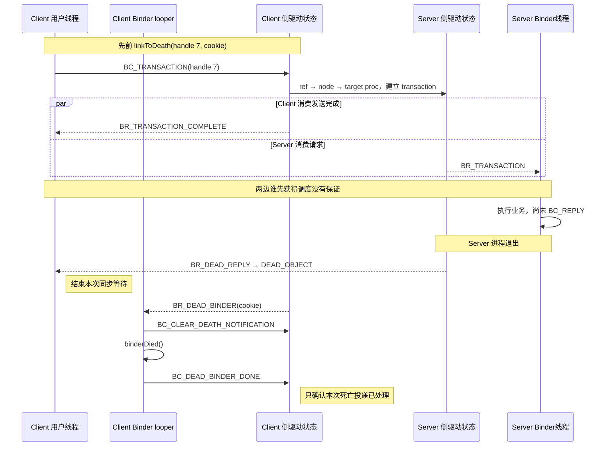

# 90 Android Binder 驱动：一次同步调用遇上服务进程死亡

> 平台源码基线：Android 11 / API 30 / `android-11.0.0_r48`
>
> 内核参考基线：Android common 5.4 / `android11-5.4.86_r00`

App 已经拿到远端服务的 Binder 代理，调用一个同步方法。请求刚发出去，服务进程却被杀了：调用方可能收到 `DEAD_OBJECT`；如果之前注册过死亡监听，还会执行 `binderDied()`。

**先给结论：这是同一次进程死亡的两种观察，不是重复通知。** `DEAD_OBJECT` 处理一次调用的失败，`binderDied()` 宣告这份远端能力已经死亡。

要解释两者为什么能并发出现，才需要认识驱动里的五个对象：它们分别记录谁在调用、哪个线程在等、目标对象属于谁、调用方用哪个 handle 引用它，以及当前事务该怎样结束。

读完本章，你应该能在 Binder 故障中分清：

- `handle`、远端对象和服务进程分别是什么；
- 请求已被驱动接收、远端方法执行完、同步调用返回、死亡通知处理完，各发生在什么时候；
- 为什么“持有强引用”仍挡不住服务进程死亡；
- 为什么遇到 `DEAD_OBJECT` 后不能无条件重试有副作用的操作。

本章只追驱动对象、同步等待和死亡通知。AIDL 生成代码、Parcel 完整布局、线程池启动等用户空间链路已在前文讲过，这里不再铺开。

## 1. 问题：`handle = 7` 为什么不能直接代表远端对象

先固定一个贯穿场景：

```text
Client App 进程 C
  └─ BpBinder(handle = 7)
       └─ 同步调用 saveSetting(requestId = 42)

Server 进程 S
  └─ BBinder/Stub 对象 O
```

`BpBinder` 并不装着服务端对象 O。它只装着一个整数 handle，例如 7。这个数字像“本公司的工牌号”：在进程 C 的 Binder 引用表里能找到人，拿到另一个进程里未必指向同一对象。

驱动中的真实关系是：

```text
C 的 binder_proc
  handle 7 → binder_ref R ─────────────┐
                                       ▼
S 的 binder_proc ──拥有── binder_node N ──对应── 服务端对象 O
```

因此要把三个概念拆开：

- `handle 7`：进程 C 的局部编号；
- `binder_ref R`：进程 C 对节点 N 的一份引用记录；
- `binder_node N`：服务端本地 Binder 对象 O 在驱动中的代表。

同一个 N 在另一个客户端进程里可以是 handle 19。把整数 7 用普通 socket 发给那个进程，并不会传递 Binder 能力；只有 Binder 驱动在事务中翻译 Binder 对象，才能为接收进程建立或找到它自己的 `binder_ref`。

Android 11 UAPI（用户空间和内核共同遵守的接口协议）里的事务结构也证明，普通调用把“本进程的 handle”交给驱动，而不是把服务端地址交给驱动：

```c
struct binder_transaction_data {
  union {
    __u32 handle;
    binder_uintptr_t ptr;
  } target;
  binder_uintptr_t cookie;
  __u32 code;
  __u32 flags;
  pid_t sender_pid;
  uid_t sender_euid;
  binder_size_t data_size;
  binder_size_t offsets_size;
```

源码位置：`bionic/libc/kernel/uapi/linux/android/binder.h`。这里只摘了目标和事务元数据；后面还有数据缓冲区地址等字段。

## 2. 机制：五个驱动对象各自回答一个问题

不要把这些结构背成名词表。把它们放回这次调用，职责就很直观：

| 驱动对象 | 属于谁 / 活多久 | 在场景中回答什么 |
|---|---|---|
| `binder_proc` | 与一次 Binder 设备打开建立的进程侧状态；正常 Android 进程通常共享这一连接 | C 和 S 各自有哪些线程、节点、引用和待办工作？ |
| `binder_thread` | 某个进入 Binder 驱动的线程在该 `binder_proc` 下的记录 | C 的哪个线程在等回复？S 的哪个线程领取请求？ |
| `binder_node` | 活着时归拥有本地 Binder 对象的 `binder_proc`；对象死亡后可暂留为 dead node | 服务端对象 O 的内核身份是什么、拥有者还活着吗？ |
| `binder_ref` | 归引用方 `binder_proc`，内部连向一个 `binder_node` | C 的 handle 7 到底指向哪个节点？引用计数和死亡订阅是什么？ |
| `binder_transaction` | 一次在途事务；完成或失败后清理 | 数据发往哪里、同步调用者是谁、回复该送回哪个线程？ |

这里有两条容易混淆的“所有权”：

1. **节点所有权**：N 归服务进程 S，因为本地对象 O 在 S 中；
2. **引用所有权**：R 归客户端进程 C，因为 handle 7 是 C 的局部名字。

`binder_transaction` 则不是远端对象的永久身份。它更像一张正在流转的快递单：记录这一次发送、接收和回复关系，事务结束后就不该继续拿它代表服务。

### 强引用能保什么，不能保什么

客户端的强 Binder 引用可以参与维持服务端 Binder 对象的引用状态，但它**不能把服务进程变成不可杀死**。进程仍可能崩溃、被 `kill`、被低内存回收机制（LMK）终止，或因系统策略退出。进程一死，原对象所在的用户地址空间已经消失；驱动只能把节点转为死亡状态并通知引用方，不能替服务端继续执行方法。

## 3. 方案：同步事务怎样从 ref 找到 node，再交给服务线程

客户端调用 `BpBinder::transact()` 后，Android 11 的 `IPCThreadState::writeTransactionData()` 把 `BC_TRANSACTION` 和 `binder_transaction_data` 写进线程的输出缓冲。进入 `BINDER_WRITE_READ` ioctl 后，驱动才开始处理 handle。

驱动主线可以压缩成六步：

1. 在 C 的 `binder_proc` 中按 handle 7 查 `binder_ref R`；
2. 从 R 得到 `binder_node N`，并在构造事务期间取得临时引用，避免并发释放；
3. 从 N 得到仍存活的目标 `binder_proc S`；若节点已无拥有者，走 `BR_DEAD_REPLY` 错误分支；
4. 在 S 的 Binder 接收区分配 buffer，复制普通数据，并翻译其中的 Binder/FD 对象；
5. 建立 `binder_transaction T`，为同步调用记录来源线程和目标；
6. 把 T 放进选定服务线程的待办队列，或放进 S 的进程待办队列并唤醒可用 Binder 线程。

这几步解释了为什么 Binder 不只是一次 `memcpy`：驱动还要做对象寻址、生命周期保护、对象翻译、排队和回复路由。

服务端领取到 `BR_TRANSACTION` 后，才会在**服务端 Binder 线程**进入 `BBinder::transact()` / Stub 的 `onTransact()`。驱动不会因为它是跨进程请求，就自动切到服务进程主线程；如果业务必须串行到某个 Handler 线程，那是服务实现的下一次主动投递。

> 完成点 A：事务进入目标待办队列，表示驱动已经建立了可投递工作；不表示服务端方法已经执行。

## 4. 同步为什么要“记住原线程”，又在什么地方真正返回

同步调用要求回复回到发起调用的那个线程。仅知道进程 C 不够：C 中可能有许多 Binder 线程同时调用同一服务。`binder_transaction` 和 `binder_thread::transaction_stack` 因而要保存调用关系，回复时沿关系找到原调用线程。

用户空间也明确区分“发送已处理”和“同步回复已到达”。Android 11 的 `waitForResponse()` 有如下分支：

```cpp
case BR_TRANSACTION_COMPLETE:
    if (!reply && !acquireResult) goto finish;
    break;

case BR_DEAD_REPLY:
    err = DEAD_OBJECT;
    goto finish;

case BR_FAILED_REPLY:
    err = FAILED_TRANSACTION;
    goto finish;
```

源码位置：`frameworks/native/libs/binder/IPCThreadState.cpp`。对于带 `reply` 的同步调用，收到 `BR_TRANSACTION_COMPLETE` 后并不退出等待；后续 `BR_REPLY` 分支才把回复 Parcel 接进来并结束等待。若目标死亡，则 `BR_DEAD_REPLY` 以 `DEAD_OBJECT` 结束等待。

所以几个词要严格区分：

| 观察 | 它能证明什么 | 它不能证明什么 |
|---|---|---|
| `BR_TRANSACTION_COMPLETE` | 本次发送命令已被驱动处理 | 服务方法已运行、业务成功、回复已回来 |
| 服务端 `onTransact()` 返回 | 服务端用户代码已给出一次处理结果 | 回复一定已送达客户端 |
| 客户端收到 `BR_REPLY` | 回复 Parcel 或远端状态已经到达，本次同步等待结束 | 业务一定成功、远端以后不会死亡 |
| 客户端收到 `BR_DEAD_REPLY` | 本次同步 IPC 因目标/回复链死亡而终止 | 服务端在死前绝对没有产生任何业务副作用 |

最后一行尤其重要。假设 `saveSetting(requestId = 42)` 已把设置写入持久层，服务却在发出 reply 前崩溃，客户端仍可能只看到 `DEAD_OBJECT`。Binder 的传输错误不能替业务回答“设置是否已经保存”。有副作用的请求若要安全重试，应带唯一请求 ID，并由服务端或持久层去重；不能把 `DEAD_OBJECT` 简单等同于“服务什么都没做”。

### 等待线程是不是只会睡眠

`IPCThreadState::waitForResponse()` 遇到非回复命令会转给 `executeCommand()`。因此同步等待期间可能处理 Binder 驱动返回的其他工作，嵌套调用也可能发生。这里只需记住诊断边界：

- 调用 API 的线程是同步等待主体；
- 服务端执行线程是另一个进程的 Binder 线程；
- “同步”描述调用方何时返回，不表示两个进程共用线程，也不保证等待期间毫无重入。

## 5. 驱动为什么分三把主锁，而不是一把“大锁”

handle 查找、节点死亡和线程排队会并发发生。如果所有状态都用一把全局锁，互不相关的进程也会争用；如果完全不加锁，客户端查 ref 时服务端可能正好释放 node，得到悬空指针。

Android common 5.4 驱动把核心保护范围拆成三层。源码开头的锁说明可归纳为：

```c
/* Locking order in the Binder driver: */
/* 1) proc->outer_lock : protects binder_ref */
/* 2) node->lock       : protects most binder_node fields */
/* 3) proc->inner_lock : protects thread/node lists, */
/*                       todo lists and transaction_stack */
```

这是对 `drivers/android/binder.c` 锁说明的精简摘录；原注释还规定，不能在进程 A 的某一层锁下再取得进程 B 的同层或更低层锁。

把锁与本场景对应起来：

- 查 C 的 handle 7、读取/修改 R：先受 C 的 `outer_lock` 保护；
- 检查 N 的拥有者、遍历 N 的引用方、处理 R 上的死亡订阅：受 `node->lock` 保护；
- 把事务放入 C/S 的 proc/thread todo、维护线程树和事务栈：受相应 `inner_lock` 保护。

目标 buffer 由 `binder_alloc` 管理，它还有自己的分配器锁与生命周期规则，不能笼统算进上述三把 spinlock。文章读到 `binder_alloc_new_buf()`、`binder_alloc_free_buf()` 时，应继续以对应内核版本的 `binder_alloc.c/.h` 为准。

### “状态提交”发生在哪里

驱动通常在持有相应锁时完成查找和队列状态修改。对应线程的选择与唤醒也可能属于 `inner_lock` 保护下的同一次状态转换；例如 `binder_wakeup_thread_ilocked()` 就要求调用者持有这把锁。部分数据复制、对象释放和后续清理才会在相应锁外继续。

不要把“解锁”解释成“业务完成”：它只说明某一段内核共享状态已经一致。真正的同步 API 完成点仍是 `BR_REPLY` 或终止该等待的错误返回。

## 6. 死亡监听为什么挂在 ref 上，而不是 transaction 上

`binder_transaction` 只代表一次调用；死亡监听关心的是“我持有的这个远端能力以后还可不可用”。所以驱动把 `binder_ref_death` 关联到客户端的 `binder_ref`，而不是关联到某次事务。Android common 5.4 中，关键关系直接写在结构里：

```c
struct binder_ref {
    struct binder_ref_data data;  /* data.desc 是 handle */
    struct rb_node rb_node_desc;
    struct rb_node rb_node_node;
    struct hlist_node node_entry;
    struct binder_proc *proc;     /* 引用方 */
    struct binder_node *node;     /* 被引用节点 */
    struct binder_ref_death *death;
};
```

源码位置：内核 `drivers/android/binder.c`。这是字段摘录，行尾中文注释是本文标注。结构前的原注释还明确写着：ref 从进程 A 指向进程 B 的目标 node，访问 ref 要持有 A 的 `outer_lock`，`death` 指针受 `node->lock` 保护。

Android 11 中，`BpBinder::linkToDeath()` 只在加入第一条 obituary（本地保存的死亡回调记录）时向驱动注册一次：

```cpp
if (!mObituaries) {
    mObituaries = new Vector<Obituary>;
    getWeakRefs()->incWeak(this);
    IPCThreadState* self = IPCThreadState::self();
    self->requestDeathNotification(mHandle, this);
    self->flushCommands();
}
ssize_t res = mObituaries->add(ob);
return res >= (ssize_t)NO_ERROR ? (status_t)NO_ERROR : res;
```

源码位置：`frameworks/native/libs/binder/BpBinder.cpp`。片段省略了外层锁、空指针和内存失败检查。多个 `DeathRecipient` 可以保存在同一个 `BpBinder` 中，但内核只需为这份 ref 保存一项死亡订阅。

发给驱动的内容很小：

```cpp
status_t IPCThreadState::requestDeathNotification(
        int32_t handle, BpBinder* proxy) {
    mOut.writeInt32(BC_REQUEST_DEATH_NOTIFICATION);
    mOut.writeInt32((int32_t)handle);
    mOut.writePointer((uintptr_t)proxy);
    return NO_ERROR;
}
```

源码位置：`IPCThreadState::requestDeathNotification()`。

这里的 proxy 地址是一个**不透明 cookie**：可以把它理解成驱动代存、随后原样退回的取件号。驱动不解引用这个用户空间地址；客户端拿回它后，才用它定位自己的 `BpBinder`。

为什么这个取件号回来时不容易变成悬空地址？`linkToDeath()` 配套增加了一份弱引用，使 proxy 在注册与清理握手期间保持可定位。

这个 cookie 也不是 `binder_node` 中服务端本地对象的 ptr/cookie。前者属于客户端的死亡通知登记，后者代表服务端对象，不能混为一谈。

`flushCommands()` 使注册命令尽快进入 ioctl，但 `linkToDeath()` 没有等待一个“服务仍存活”的正向确认。注册与死亡可以并发：若驱动处理注册时节点已经死亡，它会直接排入死亡工作。因此 `linkToDeath()` 返回 `NO_ERROR` 不等于“刚刚探活成功”。

## 7. 服务进程在同步调用中死亡，会产生两条独立结果

现在让服务进程 S 在处理 `saveSetting(requestId = 42)` 时退出。驱动清理该 `binder_proc` 时，会处理两类关系：

### 第一条：结束仍在等待的同步事务

T 记录着 C 的来源线程。S 或承接事务的线程消失后，事务不能再产生正常 reply，驱动向等待方返回 `BR_DEAD_REPLY`。Android 11 用户空间把它转成 `DEAD_OBJECT`，`BpBinder::transact()` 还会把代理的 `mAlive` 置为 0。

这条路径只在“确实有一次相关调用正在等待”时存在。若 C 此刻没有调用远端，就没有等待需要用 `BR_DEAD_REPLY` 结束。

还有另一种同名结果：一旦 `BpBinder::transact()` 因 `DEAD_OBJECT` 把 `mAlive` 置为 0，后续再调用这个旧代理时，`BpBinder` 会在用户空间直接返回 `DEAD_OBJECT`，这一次尝试根本没有进入驱动。于是只看最终错误码，通常无法判断它来自“在途事务收到 `BR_DEAD_REPLY`”，还是“对已知死亡代理的本地快速失败”；排障时还要结合 trace、服务日志或连接状态。

### 第二条：通知所有已订阅该节点死亡的引用方

驱动让 N 脱离原拥有者，并检查 N 上来自各客户端的 ref。某个 ref 若注册了 `binder_ref_death`，驱动就向该 ref 所属的客户端进程排入 `BINDER_WORK_DEAD_BINDER`。满足领取进程级工作的 Binder looper/线程池线程，随后会读到 `BR_DEAD_BINDER(cookie)`；普通线程不会仅因为正同步等待另一次 IPC，就自动取得这份进程 todo。

Android 11 用户空间的处理代码很直接：

```cpp
case BR_DEAD_BINDER: {
    BpBinder *proxy = (BpBinder*)mIn.readPointer();
    proxy->sendObituary();
    mOut.writeInt32(BC_DEAD_BINDER_DONE);
    mOut.writePointer((uintptr_t)proxy);
} break;
```

源码位置：`frameworks/native/libs/binder/IPCThreadState.cpp`。短短两次调用背后还有一段容易被省略的清理握手：

1. `sendObituary()` 先把代理标为死亡，并发送、flush `BC_CLEAR_DEATH_NOTIFICATION`；
2. 然后依次调用已保存的 `DeathRecipient::binderDied()`；
3. 回调返回后，外层代码才把 `BC_DEAD_BINDER_DONE` 放入输出缓冲；
4. 驱动消费 DONE 后，确认这次 `BR_DEAD_BINDER` 已被用户空间处理；若 clear 流程仍未收尾，后面还可能有 `BR_CLEAR_DEATH_NOTIFICATION_DONE`，libbinder 再据此释放配套弱引用。

因此 `BC_DEAD_BINDER_DONE` 不是“整个死亡订阅和资源清理全部结束”，只确认本次死亡投递已处理。

两条路径可以同时发生，也可以只发生一条：

- 正在同步调用，但没注册死亡监听：通常只从这次调用看到 `DEAD_OBJECT`；
- 注册了死亡监听，但当前没有调用：仍可收到 `binderDied()`；
- 两者都有：既要结束当前等待，又要宣告这份远端能力死亡。

协议没有给业务层提供一个值得依赖的“`DEAD_OBJECT` 必定先于 `binderDied()`”顺序：同步等待线程与领取死亡工作的 Binder looper 可以并发调度。恢复逻辑应允许两条路径以任意先后抵达，并做到幂等。

## 8. 一张时序图看清四个完成点



图中并行块强调：事务入队后，服务线程可能先开始执行，客户端也可能先读到 `BR_TRANSACTION_COMPLETE`；图不承诺实际观察顺序。`BR_DEAD_REPLY` 与 `BR_DEAD_BINDER` 同样是两条独立逻辑。把四个完成点写成一句话：

1. `BR_TRANSACTION_COMPLETE`：发送命令的驱动处理完成；
2. `BR_REPLY` / `BR_DEAD_REPLY`：回复或死亡状态到达，这次同步等待结束；业务是否成功还要继续检查 reply；
3. `binderDied()` 返回：应用的死亡回调这一次执行完；
4. 驱动消费 `BC_DEAD_BINDER_DONE`：本次 `BR_DEAD_BINDER` 得到确认，clear-death 清理仍可能继续。

第 4 点不代表重连成功，更不代表系统已经启动新服务。Binder 驱动只报告死亡，不负责替业务找新实例。

## 9. 翻车点：收到死亡后，怎样避免重复清理和错误重试

`binderDied()` 运行在领取该进程死亡工作的 Binder looper/线程池线程上。它不保证是注册监听的线程，更不保证是主线程。回调里直接更新 UI、长时间阻塞或拿着业务大锁重连，都可能制造新的线程问题。

更稳妥的恢复顺序是：

1. 用连接代际号（generation）、原子比较替换（CAS）或短临界区，把当前代理标记为失效；
2. 让 `DEAD_OBJECT` 分支与 `binderDied()` 共用同一个幂等失效入口；
3. 把耗时重连投递到明确的工作线程，并保证同一时刻最多只有一个重连任务（single-flight），避免十个调用同时重连；
4. 从 ServiceManager 或上层连接管理器重新获取 Binder，不能继续复用已经死亡的 `BpBinder`；
5. 对有副作用的业务请求，用 request ID、查询确认或服务端去重决定能否重试。

下面是应用层伪代码，表达的是状态机，不是 AOSP 源码：

```kotlin
fun onRemoteLost(observed: IBinder) {
    if (!remote.compareAndSet(observed, null)) return
    reconnectExecutor.execute {
        val fresh = lookupService() ?: return@execute
        fresh.linkToDeath(deathRecipient, 0)
        remote.compareAndSet(null, fresh)
    }
}
```

还要留意 `unlinkToDeath()` 与死亡投递的竞态：取消监听时，死亡工作可能已经在路上。不能把“unlink 已调用”当成历史回调绝不可能再出现的证明；具体返回值和回调是否已经发送，应以该版本 `BpBinder::unlinkToDeath()`、`mObitsSent` 和驱动 clear-death 分支共同判断。

## 10. 在 macOS 上怎样只读验证，并检查自己是否真的懂了

当前源码树不需要编译。先在 AOSP 根目录执行：

```bash
cd /Users/ninebot/androidSource
rg -n 'BC_REQUEST_DEATH_NOTIFICATION|BC_DEAD_BINDER_DONE|BR_DEAD' \
  bionic/libc/kernel/uapi/linux/android/binder.h
rg -n 'waitForResponse|BR_TRANSACTION_COMPLETE|BR_DEAD_REPLY|BR_REPLY' \
  frameworks/native/libs/binder/IPCThreadState.cpp
```

预期观察：UAPI 同时定义了“事务失败”和“对象死亡通知”两组命令；`waitForResponse(reply)` 不会把 `BR_TRANSACTION_COMPLETE` 当同步 reply。

再追死亡回调：

```bash
rg -n 'linkToDeath|unlinkToDeath|sendObituary|binderDied' \
  frameworks/native/libs/binder/BpBinder.cpp
sed -n '1248,1280p' frameworks/native/libs/binder/IPCThreadState.cpp
```

预期观察：第一个 obituary 触发内核注册；`BR_DEAD_BINDER` 调用 `sendObituary()` 后写入 `BC_DEAD_BINDER_DONE`，回调没有自动切到主线程。

### 为什么本地找不到 `drivers/android/binder.c`

`android-11.0.0_r48` 是 Android 平台源码标签，不唯一指定某台设备的 Linux kernel。这个 checkout 有 libbinder 和 Binder UAPI，但没有配套驱动目录。因此本文的用户空间结论按本地 r48 逐行核对；内核对象和锁按 2021 年 Android common 5.4 的固定标签核对：

- [`android11-5.4.86_r00` 的 Binder 驱动目录](https://android.googlesource.com/kernel/common/+/refs/tags/android11-5.4.86_r00/drivers/android/)
- [`android-11.0.0_r48` 的 IPCThreadState.cpp](https://android.googlesource.com/platform/frameworks/native/+/refs/tags/android-11.0.0_r48/libs/binder/IPCThreadState.cpp)
- [`android-11.0.0_r48` 的 BpBinder.cpp](https://android.googlesource.com/platform/frameworks/native/+/refs/tags/android-11.0.0_r48/libs/binder/BpBinder.cpp)

如果以后拿到目标设备匹配的 kernel tree，再执行：

```bash
cd /path/to/matching-kernel-tree
rg -n 'struct binder_(proc|thread|node|ref|transaction)' drivers/android
rg -n 'binder_transaction\(|binder_deferred_release' drivers/android/binder.c
rg -n 'REQUEST_DEATH|DEAD_BINDER|DEAD_REPLY' drivers/android/binder.c
```

应记录三件事：结构定义在哪个文件、字段由哪把锁保护、进程退出时 transaction error 与 death work 分别在哪个分支排队。厂商 backport 可能改变字段和辅助函数，不能拿另一个内核版本的行号硬套；本文能确定的是所列参考基线的实现，具体设备仍需匹配其 kernel commit。

### 检查题与答案

**1. Client C 的 handle 7 能否直接拿给 Client D 使用？**

不能。handle 属于 C 的 `binder_proc` 与 Binder context 的局部命名空间。Binder 对象必须通过 Binder 事务传递，由驱动在 D 中建立/查找对应 ref 和 handle。

**2. 收到 `BR_TRANSACTION_COMPLETE` 后，能否认为 `saveSetting()` 已执行成功？**

不能。同步调用仍要等 `BR_REPLY`；若等待链上的目标死亡，则可能以 `BR_DEAD_REPLY` / `DEAD_OBJECT` 结束。

**3. 客户端一直持有强 Binder 引用，服务进程是否不会死？**

不是。引用维护对象/节点的 Binder 生命周期关系，不是进程保活契约。服务进程仍可能崩溃或被系统终止。

**4. 为什么一次死亡既可能出现 `DEAD_OBJECT`，又可能调用 `binderDied()`？**

前者终止当前同步事务，后者来自此前挂在 `binder_ref` 上的能力生命周期订阅。它们服务不同目的，恢复入口要幂等。

**5. `DEAD_OBJECT` 能否证明服务端没有执行过有副作用的代码？**

不能只靠错误码判断。在途事务可能在服务完成副作用后、reply 送达前收到 `BR_DEAD_REPLY`；对 `mAlive == 0` 的旧代理，后续尝试则会在本地直接失败、根本不发送。是否重试要靠连接证据、业务幂等、request ID 或状态查询决定。

**6. `BC_DEAD_BINDER_DONE` 表示什么？**

它确认用户空间已处理这次 `BR_DEAD_BINDER`。clear-death 和弱引用清理仍可能继续；它更不表示新服务已启动或代理已重连。

### 可立即执行的 takeaway

回到源码，用一张纸只画这两条线：

```text
handle → binder_ref → binder_node → owner binder_proc
sync binder_transaction → BR_REPLY 或 BR_DEAD_REPLY
```

然后在 `binder_ref` 旁再加一条 `death → BR_DEAD_BINDER → binderDied → DONE`。只要能解释为什么后两条会同时发生、却没有固定业务顺序，这一章最重要的模型就建立起来了。
