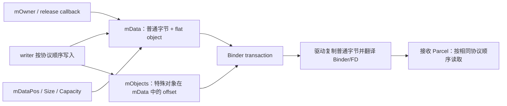

# 91 Android Parcel：数据布局、对象偏移、Binder/FD、异常与大事务

> 源码版本：Android 11 / API 30 / `android-11.0.0_r48`
>
> 学习方式：macOS 只读源码，不要求编译。本章以 native `Parcel.cpp` 为主，结合 Java
> `Parcel.java`、Binder UAPI 和上一章 transaction 链路。

---

## 1. Parcel 不是“一个 Map”

Parcel 是按协议顺序读写的二进制容器：

```text
writer: writeInt → writeString → writeStrongBinder → writeParcelable
reader: readInt  → readString  → readStrongBinder  → readParcelable
```

读取顺序、类型、nullable 约定和版本必须与写入端一致。它通常没有字段名，也不会根据
Java/C++ 变量名自动匹配。

本章核心图：



`mObjects` 不是另一份业务 payload，而是告诉驱动 `mData` 的哪些 offset 需要按 Binder object、FD 等特殊规则
校验和翻译。Binder driver 复制 `mData`，同时依据这张 offset 表翻译特殊对象。

---

## 2. 源码地图

| 路径 | 关注点 |
|---|---|
| `frameworks/native/libs/binder/Parcel.cpp` | native Parcel 全部核心实现 |
| `frameworks/native/libs/binder/include/binder/Parcel.h` | API、成员、模板 vector/Parcelable |
| `frameworks/native/libs/binder/Status.cpp` | native exception/status 编码 |
| `frameworks/native/libs/binder/include/binder/Status.h` | exception code |
| `frameworks/native/libs/binder/IPCThreadState.cpp` | Parcel 如何进入 transaction data |
| `frameworks/native/libs/binder/ProcessState.cpp` | handle→BpBinder |
| `bionic/libc/kernel/uapi/linux/android/binder.h` | flat object 与 transaction UAPI |
| `frameworks/base/core/java/android/os/Parcel.java` | Java read/write/exception API |
| `frameworks/base/core/java/android/os/Parcelable.java` | Parcelable contract |
| `frameworks/base/core/jni/android_os_Parcel.cpp` | Java Parcel 与 native Parcel 桥接 |
| `frameworks/base/core/jni/android_util_Binder.cpp` | native status 到 Java RemoteException/TLE |
| `frameworks/base/core/java/android/os/TransactionTooLargeException.java` | 大事务语义说明 |

---

## 3. 三块“内存”必须分开

```text
发送方 Parcel buffer
  → userspace malloc/realloc，构建 request

目标进程 Binder transaction buffer
  → driver 从目标 binder allocator 分配，通过目标 mmap 可读

显式 shared memory
  → ashmem/memfd/GraphicBuffer/FMQ，由 fd/handle 描述，独立生命周期
```

发送 Parcel 不是把发送方 `mData` 指针交给接收方。driver 会复制普通数据并翻译特殊
对象。接收 Parcel 可以引用 driver buffer，但这也不是长期共享数据通道。

---

## 4. Native Parcel 的关键成员

概念上：

```text
uint8_t* mData
size_t   mDataSize
size_t   mDataCapacity
mutable size_t mDataPos

binder_size_t* mObjects
size_t mObjectsSize
size_t mObjectsCapacity

release_func mOwner
void* mOwnerCookie
```

还包含：

- `mError`；
- 是否含 fd、是否允许 fd；
- object 排序/读取 hint；
- blob/ashmem 统计；
- sensitive data 等版本相关标记。

`mDataSize` 是有效内容长度，`mDataCapacity` 是已分配容量，`mDataPos` 是当前游标。三者
混淆会造成越界或把未初始化容量当有效数据。

---

## 5. dataPosition 是同一条读写游标

```text
setDataPosition(0)
readInt32()
readString16()
```

读写都会移动 `mDataPos`。native Parcel 的很多 read method 是 `const`，但 position 是
mutable；“const Parcel”不代表读取不改变游标。

常见错误：

- 写完后在同一 Parcel 直接读，却没重置 position；
- 一个 helper 多读一个字段，让后续全部错位；
- 失败后继续读，掩盖首个错误；
- 把 capacity 当 size 设置 position。

---

## 6. 对齐规则

`Parcel::write()` 对普通数据做 4-byte padding；`writeUnpadded()` 才是不补齐版本。概念：

```text
payload length 1 → occupy 4 bytes
payload length 4 → occupy 4 bytes
payload length 5 → occupy 8 bytes
```

padding 保证后续 32-bit 对齐并形成稳定 wire layout。读端必须使用相应 reader，不能把
`writeByteArray()` 的布局用任意 memcpy 规则解释。

对齐计算本身要防 size overflow；系统序列化代码大量检查 `SIZE_MAX`、剩余长度和元素数，
因为“不可信长度 × 元素大小”是典型整数溢出入口。

---

## 7. 基本类型并非都占直觉大小

native API 的具体布局应看当前实现。例如 Android Binder wire 中 Java boolean/byte/char
常通过 32-bit slot 编码，以保持 Java/native/AIDL 一致与对齐。

不要做这种假设：

```text
Java boolean 一定 1 byte
Java char 一定紧接着只占 2 bytes
C++ struct 可以原样 write(&struct, sizeof(struct))
```

C++ struct 有 padding、ABI、endianness、pointer size 和 compiler 差异，跨 system/vendor
稳定接口应逐字段或用稳定 Parcelable，而不是裸结构体 dump。

---

## 8. 字符串布局

`String16` 概念布局：

```text
int32 length in UTF-16 code units
char16_t[length]
terminating NUL
padding to 4 bytes
```

null string 与 empty string 必须区分：nullable 编码常用负长度表示 null，0 表示存在但
为空。不同 helper（String8、UTF-8 as UTF-16、nullable unique_ptr）有不同约定。

长度是 code unit 数，不是用户可见 Unicode 字符数，也不是 UTF-8 byte 数。

---

## 9. 为什么字符串读必须验证 NUL

接收数据可能损坏或恶意。reader 要检查：

- length 非法负值；
- `length * sizeof(char16_t)` 溢出；
- 是否超出剩余 data；
- terminating NUL 是否存在；
- padding 后 position 是否越界。

即使 Binder driver 保证 transaction buffer 内存安全，业务序列化内容仍可能由不可信
client 构造，Stub 不能跳过逻辑校验。

---

## 10. 数组和 vector 的长度前缀

典型：

```text
int32 count
element 0
element 1
...
```

nullable vector 也需表示 null 与 empty。读端不能看到 `count=1,000,000,000` 就直接
reserve/allocate；先验证：

```text
count 合法
count × minimum element size 不溢出
不超过剩余 Parcel
不超过 API/产品合理上限
```

仅检查 Parcel bytes 还不够：一个元素可能触发嵌套 allocation，需限制递归深度和总资源。

---

## 11. Parcelable 是协议，不是对象搬家

Java `Parcelable.writeToParcel()` 把对象状态逐字段编码；`CREATOR.createFromParcel()` 在
接收端新建对象。

```text
sender object identity ≠ receiver object identity
```

只有其中显式写入的 Binder token 才保持远程对象能力；普通字段只是值副本。

Parcelable 设计要记录：

- 字段顺序和单位；
- nullable；
- version/size；
- unknown/new field 跳过策略；
- enum 未知值；
- 最大数组/字符串长度；
- fd/Binder ownership；
- 敏感信息边界。

---

## 12. Java Serializable 为什么不适合作为系统 IPC 主协议

Serializable 依赖反射/class schema，体积和性能不稳定，版本与安全面更复杂。Parcelable/
AIDL 是 Android IPC 的显式协议，更容易控制布局、对象类型和兼容性。

但 Parcelable 快不代表自动安全：错误的 length、class loader、递归 object graph 或自定义
reader 一样可能造成资源耗尽和逻辑漏洞。

---

## 13. interface token 在哪里

Proxy 通常首先：

```text
data.writeInterfaceToken("com.example.IMower")
```

Stub：

```text
data.enforceInterface(descriptor)
```

Android 11 native `writeInterfaceToken()` 还写 StrictMode policy/work source 相关 header，
再写 descriptor。`enforceInterface()` 不只是比较一个字符串，也会处理这些调用元数据。

token 防止把一个 transaction code 误投给错误 interface，但不是 App permission。攻击者
知道 descriptor 仍可能写出 token，所以服务还必须检查 calling UID/permission/AppOps。

---

## 14. object offsets table 是本章关键

假设 data：

```text
offset 0   int32 command
offset 4   int32 flags
offset 8   flat_binder_object callback
offset 32  int64 timeout
offset 40  flat_binder_object fd
```

objects table：

```text
[8, 40]
```

`mObjects` 只列特殊对象在 `mData` 中的 byte offset。driver 据此定位 object，检查范围/
顺序/对齐并翻译。它不是所有字段的索引，也不含普通 int/string 的 offset。

---

## 15. writeObject 做什么

`Parcel::writeObject(flat_binder_object, ...)`：

1. 在 data 当前 position 写 object struct；
2. 确保 objects array 容量；
3. 记录该 object 的 data offset；
4. 更新 fd/object metadata；
5. 管理本地对象引用；
6. 在失败时保持 Parcel 状态可清理。

只把 `flat_binder_object` bytes 写进 data 而不加入 offsets table，driver 会把它当普通
bytes，不会建立 binder_ref 或复制 fd；反过来伪造 offset 指向普通 bytes 会被校验拒绝。

---

## 16. flat_binder_object

UAPI 概念字段：

```text
hdr.type
flags
union { binder pointer | handle }
cookie
```

主要类型：

| type | 发送侧意义 |
|---|---|
| `BINDER_TYPE_BINDER` | 本地 Binder object，需要变成目标进程 handle |
| `BINDER_TYPE_WEAK_BINDER` | 本地 weak Binder object |
| `BINDER_TYPE_HANDLE` | 已持有远端 handle，driver 解析原 node 后转给目标 |
| `BINDER_TYPE_WEAK_HANDLE` | weak handle |
| `BINDER_TYPE_FD` | file descriptor |
| `BINDER_TYPE_FDA` | fd array，关联 parent buffer |
| `BINDER_TYPE_PTR` | scatter-gather buffer object |

type 值不是任意 enum，而带 Binder UAPI type encoding。

---

## 17. flatten_binder：BBinder 和 BpBinder 分叉

`flatten_binder()` 概念：

```text
IBinder is local BBinder
  → type = BINDER_TYPE_BINDER
  → binder = local weakrefs pointer
  → cookie = BBinder pointer

IBinder is remote BpBinder
  → type = BINDER_TYPE_HANDLE
  → handle = BpBinder.handle()
  → cookie = 0

null binder
  → null object encoding
```

driver 看到 local binder 会建立/复用 owner node；看到 handle 会在 sender proc 查 ref，找到
原 node，再为 receiver 创建/复用自己的 ref。

---

## 18. unflatten_binder：接收端得到什么

driver 已把 object 改写成适合接收进程的形态：

```text
若对象由当前进程拥有
  → 可恢复本地 BBinder

若对象由其他进程拥有
  → ProcessState::getStrongProxyForHandle(handle)
  → BpBinder proxy
```

这使 Binder object 经 A→B→C 传递后仍指向原 node，而不是变成 B 的普通内存副本。

---

## 19. Binder callback 为什么能反向调用

client 把自己的 callback Stub 写入 request：

```text
Client local callback BBinder
  → BINDER_TYPE_BINDER
  → driver node owned by Client
  → Server receives BpBinder(handle)
  → Server later transact(handle)
  → callback reaches Client Binder thread
```

所以 Binder connection 本质上可双向。传 callback 同时形成远程引用和生命周期关系，
server 应 unlink/death cleanup，client callback 要防线程重入。

---

## 20. writeStrongBinder 与引用生命周期

`Parcel::writeStrongBinder()` 通过 flatten/writeObject 写入对象，并为 Parcel 持有期间维护
相应引用。发送命令被 driver 消费、Parcel free/release objects 时再调整引用。

这解释了为什么：

- 不能把 `flat_binder_object` 当普通 POD 随便复制；
- Parcel copy/append 要修正 object offsets 和引用；
- 数据 buffer 与 object lifecycle 必须一起管理；
- 发送异步命令前对象不能过早析构。

---

## 21. FD 不是把整数复制过去

```text
sender fd=12
  → flat object type FD
  → driver get underlying file reference
  → install into target fd table
  → receiver may see fd=47
```

双方 fd number 不同，但引用同一 kernel file description/resource。各自 close 自己的 fd。

风险：

- fd exhaustion；
- receiver 忘记 close；
- sender 错误转移 ownership 后 double-close；
- 泄漏敏感 file/socket/device；
- 接收方把 fd 类型/内容当可信；
- fd 指向资源的 operation 仍受安全检查。

---

## 22. takeOwnership 与 dup

native：

```text
writeFileDescriptor(fd, takeOwnership=false)
writeDupFileDescriptor(fd)
writeUniqueFileDescriptor(...)
```

`takeOwnership=true` 表示 Parcel 在自身清理时负责关闭原 fd；它不是说 receiver 获得唯一
所有权，也不影响 kernel 为 receiver 创建新 fd。

使用 RAII `unique_fd` 更清晰，但仍要知道 generated/helper 是 borrow、dup 还是 consume。

---

## 23. readFileDescriptor 返回值生命周期

某些 native read API 返回 Parcel 内 object 所持 fd，它的生命周期可能受 Parcel 约束；若
要在 Parcel 销毁后保存，应按 API 复制 fd（`F_DUPFD_CLOEXEC`/unique helper）。

Java `ParcelFileDescriptor` 封装 ownership/close，仍需 try-with-resources 或明确 close。

不要把 raw fd 存进长期对象后立即 recycle Parcel，却未 dup。

---

## 24. native_handle 如何传

`native_handle` 包含 fd 数量、int 数量和数组。写入时：

```text
version / numFds / numInts
each fd as binder FD object
each int as plain value
```

读端通常 dup fds 构造新的 native_handle。必须验证 counts、总大小和每次 dup 错误，失败
时关闭已复制的 fd，避免部分构造泄漏。

---

## 25. Blob 与大数据的分流

Android 11 native `writeBlob()` 对较小 blob 可内联；超过阈值时可创建 ashmem region，写入
数据，再把 fd 放入 Parcel。接收端 `readBlob()` 根据类型内联读取或 mmap fd。

这证明“API 看起来写 byte blob”不一定 wire 上全部内联。但它仍有：

- fd 与 mmap 开销；
- size/ownership/immutability；
- ashmem 资源限制；
- 数据一致性和安全检查。

应用 API 不应依赖 private threshold；大数据应显式设计 shared memory/stream/file。

---

## 26. appendFrom 为什么复杂

复制 Parcel 的一段不能只 memcpy：

```text
copy data range
find objects whose offsets lie in range
adjust offsets to destination position
acquire Binder references
dup/track fds as required
update hasFds/object metadata
handle partial object rejection
```

这里要区分“API 应该怎样安全使用”和 r48 native 实现实际做了什么：调用者必须保证
slice 落在已知协议字段边界；Android 11 的 `Parcel::appendFrom()` 只把**完整落在范围内**的
object 复制进目标 offset table，却没有逐一拒绝与 object 局部重叠的任意 byte range。
因此不能把它当成“自动验证任意 Parcel 切片完整性”的安全 API。若切片边界来自不可信
输入，外层必须先用 size-prefix/协议边界验证，否则普通 bytes 中可能留下残缺 object 数据。

---

## 27. ipcData 与 ipcObjects 怎样进入 Binder

上一章 `IPCThreadState::writeTransactionData()`：

```cpp
tr.data_size = data.ipcDataSize();
tr.data.ptr.buffer = data.ipcData();
tr.offsets_size = data.ipcObjectsCount() * sizeof(binder_size_t);
tr.data.ptr.offsets = data.ipcObjects();
```

所以一个 transaction 同时把：

```text
data bytes
object offsets
```

交给 driver。offsets count 为 0 时仍可发送纯数据 Parcel。

---

## 28. ipcSetDataReference：接收 Parcel 不一定拥有 malloc data

收到 `BR_TRANSACTION/BR_REPLY` 后：

```cpp
Parcel::ipcSetDataReference(driverMappedBuffer,
                            dataSize,
                            objectOffsets,
                            objectCount,
                            freeBuffer,
                            IPCThreadState);
```

Parcel 保存外部 data pointer 和 owner callback，而不是复制一份。销毁/替换数据时 callback
发 `BC_FREE_BUFFER`。

因此 `readInplace()` 返回的 pointer 只能在 Parcel/buffer 生命周期内使用；异步保存必须
复制。

---

## 29. mOwner 区分两种所有权

```text
mOwner == nullptr
  → Parcel 自己 malloc/realloc/free data

mOwner != nullptr
  → data 由外部/driver buffer 提供
  → 释放时调用 owner(data, size, objects, ...)
```

对外部 reference Parcel 进行写入/扩容时，可能需要切换为自己拥有的 buffer 并正确接管
objects。阅读 `continueWrite()`、`freeDataNoInit()` 时要沿 ownership 看，而不是只看指针。

---

## 30. releaseObjects 做什么

Parcel 销毁前遍历 object offsets：

- local Binder object 调整 strong/weak refs；
- remote handle 调整 handle refs；
- owned fd 关闭；
- 清理 object metadata。

若 offsets 被破坏，release 路径本身也可能成为安全风险，因此 object validation、sorted
offsets 和边界检查非常重要。

---

## 31. freeData 与 recycle

Java `Parcel.obtain()`/`recycle()` 使用 native Parcel 与对象池以减少分配，但 recycle 后对象
逻辑上已不可再使用。Native destructor/freeData 则负责 buffer、objects、fd/ref 清理。

常见错误：

- finally 前 recycle，后面仍访问；
- 保存 `readInplace()` pointer；
- 重复 recycle；
- 把 Parcel 作为长期业务模型缓存；
- 异步线程读一个已由 caller recycle 的 Parcel。

generated Binder code 通常正确管理；手写 IPC 必须自己负责。

---

## 32. wire protocol 没有自动字段演进

旧写端：

```text
version=1, fieldA, fieldB
```

新写端直接增加 fieldC，而旧读端不知道如何跳过，可能看似无害，因为尾部未读；但嵌套
对象、数组和安全检查会更复杂。新读端读取旧 Parcel 又可能越界。

稳妥方案：

```text
size-prefixed parcelable
  totalSize
  fieldA
  fieldB
  optional fieldC
reader tracks endPosition and skips unknown tail
```

stable AIDL 生成代码提供版本化规则，手写 Parcelable 也需显式兼容策略。

---

## 33. size-prefixed Parcelable 的安全点

reader：

```text
start = dataPosition
size = readInt
validate size >= minimum
validate start + size no overflow and <= dataSize
read known fields only while position < end
finally setDataPosition(end)
```

即使某字段解析抛异常，也要谨慎恢复到声明 end，避免外层 reader 错位；但恶意 size 不能
被接受。不要用 `start + size` 而不检查整数溢出。

---

## 34. enum 与 boolean 的兼容

wire 上 enum 常是整数，但接收者可能看到未来未知值。策略按语义：

- 拒绝不安全 command enum；
- 保留/忽略未知 informational enum；
- 映射 `UNKNOWN`；
- 不以数组索引直接使用未验证 enum；
- 不假设 boolean 只有内存 byte 0/1，按 API reader 读取并规范化。

新增 enum 值可能比新增 method 更容易破坏旧 client，接口文档必须定义 unknown behavior。

---

## 35. reply 的 response header 与 exception code

Java/部分 native AIDL 同步 reply 在正常返回值前先写 response header。最简单形态是：

```text
0 → no exception，后面是正常 return/out values
负值 → exception category，后面按该 category 写 message/details
```

但 Android 11 Java `writeNoException()` 还可能在前面加入 AppOps reply header，或者写入
StrictMode “fat header”。`readExceptionCode()` 会依次消费这些 header，最后得到真正
exception code；StrictMode header 当前只用于无异常响应，解析后返回 0。

所以“reply 第一个 int 永远是最终 exception code”只是简化记忆，不是完整实现。
Proxy 必须调用匹配的 `readException()`，再读返回值；手工 `readInt()` 会把 AppOps/
StrictMode header 或 exception code 误当业务数据。Native `Parcel::writeNoException()` 则经
`binder::Status` 写 native 对应的成功状态，语言/backend 协议必须成对使用。

---

## 36. Java exception 编码

Android 11 `Parcel.java` 将有限异常映射成 code，例如：

```text
SecurityException
BadParcelableException
IllegalArgumentException
NullPointerException
IllegalStateException
NetworkOnMainThreadException
UnsupportedOperationException
ServiceSpecificException
ParcelableException（受限制）
```

不是任意 Throwable 都能带完整 stack/object graph 跨进程。接收端重建的是协议化异常，
远端原始 Java 对象身份和完整现场不会被搬过来。

---

## 37. transport error 与 reply exception

```text
transport error
  driver/IPC transaction 未成功
  DEAD_OBJECT, FAILED_TRANSACTION, timeout-like system behavior

reply exception
  transaction 成功到达 service
  service/generated Stub 把 SecurityException 等写入 reply

business result
  method 正常 reply 中的 enum/status/data
```

恢复策略不同：

- DEAD_OBJECT → 清 proxy/重连；
- SecurityException → 不应重试绕过；
- invalid argument → 修 caller；
- service-specific busy → 按 contract 有界 retry；
- unsupported → capability fallback。

---

## 38. ServiceSpecificException

稳定接口常需要不绑定某个语言异常类的错误码：

```text
EX_SERVICE_SPECIFIC
  + serviceSpecificErrorCode
  + message
```

code 必须形成稳定枚举和语义，不能把任意 errno 原样暴露后随 driver 变化。message 用于
诊断，不应让 client 解析 message 决策，也不能泄露敏感路径/数据。

---

## 39. TransactionTooLargeException 的真实含义

它表示 Binder transaction 数据超出 transaction buffer 能力/空间，或映射到同类失败。
Java 文档明确提醒：无法可靠判断是 request 过大还是 reply 过大；当前 transaction buffer
也由该进程进行中的多笔事务共享。

因此不是简单“单个对象超过 1 MB”：

```text
一个接近上限的大 request
多个并发中等 request
大 reply
未释放 incoming/async buffer
fragmentation/metadata
```

都可能触发。

---

## 40. 为什么 1 MB 不能当可用 payload 上限

Android 11 native `ProcessState` 映射约 `1 MiB - 2 pages`，但可用 transaction payload 还
要扣除/共享：

- 其他并发 transaction；
- reply 与 oneway buffer；
- offsets table；
- object/buffer metadata；
- 对齐；
- allocator fragmentation；
- driver 安全限制。

设计目标应远小于极限，并对集合分页、数据裁剪或 fd/shared memory 传输。

---

## 41. Bundle 为什么容易导致大事务

Bundle 可嵌套字符串、数组、Bitmap、Parcelable 和其他 Bundle，调用点看起来只有一个
参数，却可能展开为大量 bytes/objects。

常见风险：

- Intent extras 放大图；
- saved instance state 放长列表/缓存；
- Activity result 携带文件内容；
- Binder API 返回全量数据库记录；
- 每个 item 含重复字符串/metadata。

正确做法：只传 ID/URI/small metadata，大内容放 file/provider/shared memory，列表分页。

---

## 42. TransactionTooLargeException 后不能假设状态

Java 文档说明失败可能发生在 request 或 reply，因此 caller 无法确定 server 是否执行：

```text
request 送不出 → server 未执行
request 执行成功但 reply 太大 → server 可能已改变状态
```

对有副作用操作要用 requestId、幂等和 query：

```text
submit(requestId, small request)
on ambiguous failure
  → queryStatus(requestId)
  → retry only if contract permits
```

不能捕获异常后无脑重复扣款、启动硬件或删除数据。

---

## 43. Binder object 数量也有成本

即使 bytes 不大，传数千个 callback/token 会创建大量：

- object offsets；
- binder_ref；
- `BpBinder`；
- strong/weak refs；
- death recipient；
- service listener bookkeeping。

Android 11 `BpBinder` 已有 per-UID proxy tracking/high-watermark 保护。API 应使用批量数据加
少量 session/listener，而不是每条 item 一个 Binder object。

---

## 44. ClassLoader 与 Parcelable 安全

Java 读取通用 Parcelable/Bundle 时需要 ClassLoader。错误 loader 可导致 class not found，
不受信任 class name/creator 还会扩大反序列化攻击面。

系统边界优先 typed AIDL/明确 Parcelable，不使用任意 class name。读取外部 Intent/Bundle
时尽早设置正确 loader、限制类型，并把所有嵌套数据视为不可信。

---

## 45. BadParcelableException 的定位

常见原因：

- writer/reader 顺序不一致；
- nullable 标记不一致；
- 长度越界或负值；
- Parcelable `CREATOR`/ClassLoader 问题；
- 新旧版本布局不兼容；
- 读过 end position；
- 对象类型与预期不符；
- 恶意/损坏 Parcel。

排查应同时记录 interface、transaction code、接口版本和字段边界，不要记录完整敏感
payload。

---

## 46. 敏感 Parcel 数据

Parcel buffer 可能包含 token、位置、账户、硬件 ID。风险点：

- debug log 打印完整 Parcel；
- crash dump/tombstone；
- buffer 复用残留；
- 错误返回把 server 内部信息带给 App；
- dump API 无权限；
- shared memory 生命周期过长。

新版本 libbinder 有敏感数据标记/清零机制，但不能替代最小化数据、权限检查和日志脱敏。

---

## 47. 读端的“防御式五步法”

```text
1. 检查 calling identity/interface token
2. 读取 presence/version/size
3. 每个 length 做负值、overflow、remaining、产品上限检查
4. enum/index/fd/Binder object 做语义验证
5. 确认没有不允许的 trailing data（接口规则适用时）
```

generated AIDL 帮助完成很多机械检查，但 service 仍要验证业务范围，如速度、坐标、文件
类型、callback 数量和调用频率。

---

## 48. mower 请求布局示例

建议 AIDL：

```text
StartRequest parcelable
  int version/size（由稳定 AIDL生成策略处理）
  long clientRequestId
  int mode enum
  float targetSpeedMps
  long timeoutMs
  ParcelFileDescriptor optionalMapFd
```

校验：

```text
requestId 非零且按 caller 幂等
mode 是已知安全值
speed finite 且在硬件安全范围
timeout 有上限
fd 存在时验证类型/size/ownership，不信任文件内容
Parcel 本身小，地图内容不内联
```

返回只给 accepted/requestId；详细进度 callback + snapshot，不返回巨大轨迹数组。

---

## 49. mower callback Binder object

```text
App callback Stub (local Binder)
  → request Parcel writeStrongBinder
  → offsets 标记 flat object
  → driver creates App-owned node + system_server ref
  → system_server receives Proxy
  → linkToDeath and store under caller UID/session
```

安全边界：限制每 UID callback 数，去重同一 Binder identity；死亡时删除；回调前 snapshot
list、释放锁；大数据只发 version/ID，再由授权 client 分页 query。

---

## 50. 常见误解复盘

1. **Parcel 是 key-value Map**：错，它主要按顺序读写。
2. **Parcel 自动带字段名和类型反射**：错，协议由 writer/reader 约定。
3. **dataSize 等于 capacity**：错，前者是有效内容，后者是空间。
4. **const Parcel 读取不改变状态**：错，mutable position 会前进。
5. **所有基本类型都按 C++ sizeof 紧凑排列**：错，有 wire 对齐和 Java约定。
6. **null string 与 empty 相同**：错，通常有不同长度标记。
7. **Parcelable 把原对象搬到远端**：错，远端重建值对象。
8. **offsets 包含所有字段位置**：错，只记录特殊 Binder/FD/buffer objects。
9. **flat binder object 只需 memcpy**：错，必须在 offsets 并由 driver 翻译。
10. **远端 handle 可直接在另一进程用**：错，driver 为每进程创建 ref/handle。
11. **传 fd 就复制 fd 数字**：错，目标安装新 fd。
12. **takeOwnership 表示 receiver 独占资源**：错，它主要定义发送 Parcel 的关闭责任。
13. **readInplace pointer 可长期保存**：错，受 Parcel/driver buffer 生命周期约束。
14. **收到 Parcel 一定 malloc-owned**：错，可能引用 driver mmap buffer。
15. **writeNoException 后直接读业务值无需 readException**：错，Proxy 协议要先读 code。
16. **任意 Throwable 都完整跨进程**：错，只支持协议化异常。
17. **TLE 就是单 Parcel 超过精确 1 MB**：错，buffer 是共享且有开销。
18. **TLE 后 server 一定没执行**：错，可能 reply 过大。
19. **bytes 小就一定安全**：错，大量 Binder object/fd 也昂贵。
20. **generated AIDL 后无需业务校验**：错，只覆盖序列化机械安全的一部分。

---

## 51. Mac 上十二轮只读练习

### 第一轮：Parcel 成员与生命周期

```bash
sed -n '430,630p' frameworks/native/libs/binder/include/binder/Parcel.h
sed -n '2280,2460p' frameworks/native/libs/binder/Parcel.cpp
```

画 data/objects/position/capacity/owner。

### 第二轮：写入与对齐

```bash
sed -n '620,735p' frameworks/native/libs/binder/Parcel.cpp
sed -n '1380,1490p' frameworks/native/libs/binder/Parcel.cpp
```

找 PAD_SIZE、writeInplace/readInplace 和 overflow 检查。

### 第三轮：字符串

```bash
sed -n '990,1055p' frameworks/native/libs/binder/Parcel.cpp
sed -n '1830,1958p' frameworks/native/libs/binder/Parcel.cpp
```

记录 length、NUL、UTF-16、null 与 padding。

### 第四轮：interface token

```bash
sed -n '510,630p' frameworks/native/libs/binder/Parcel.cpp
```

区分 StrictMode/work source/header 与 descriptor。

### 第五轮：Binder flatten/unflatten

```bash
rg -n 'flatten_binder|unflatten_binder|writeStrongBinder|readStrongBinder' \
  frameworks/native/libs/binder/Parcel.cpp
```

分别画 BBinder 和 BpBinder 两条编码路径。

### 第六轮：objects table

```bash
sed -n '1260,1330p' frameworks/native/libs/binder/Parcel.cpp
sed -n '2190,2285p' frameworks/native/libs/binder/Parcel.cpp
```

找到 offset 写入、排序/bounds 和 readObject。

### 第七轮：FD 与 native handle

```bash
sed -n '1090,1235p' frameworks/native/libs/binder/Parcel.cpp
sed -n '2000,2125p' frameworks/native/libs/binder/Parcel.cpp
```

解释 borrow/take ownership/dup/unique fd。

### 第八轮：ipc reference

```bash
sed -n '2280,2435p' frameworks/native/libs/binder/Parcel.cpp
sed -n '1005,1075p' frameworks/native/libs/binder/IPCThreadState.cpp
```

画发送 ipcData/ipcObjects 和接收 ipcSetDataReference/freeBuffer。

### 第九轮：Java exception

```bash
sed -n '2130,2410p' frameworks/base/core/java/android/os/Parcel.java
sed -n '1,270p' frameworks/native/libs/binder/Status.cpp
```

区分 no exception、service-specific、security 与 transport error。

### 第十轮：TransactionTooLarge

```bash
sed -n '1,100p' frameworks/base/core/java/android/os/TransactionTooLargeException.java
sed -n '830,900p' frameworks/base/core/jni/android_util_Binder.cpp
```

说明为什么无法判断 request 还是 reply 太大。

### 第十一轮：Java/native 桥

```bash
rg -n 'android_os_Parcel|nativeWrite|nativeRead|nativeDataSize|nativeSetDataPosition' \
  frameworks/base/core/jni/android_os_Parcel.cpp \
  frameworks/base/core/java/android/os/Parcel.java | head -n 160
```

把 Java Parcel 对象与 native pointer/方法关联。

### 第十二轮：设计小而稳的协议

为 mower `StartRequest` 写一张表：

```text
field | type | nullable | unit/range | added version | max size | validation
```

再决定地图、轨迹、日志分别用分页、fd/shared memory 还是禁止跨 Binder。

---

## 52. 可选设备只读观察

```bash
adb shell dumpsys activity intents 2>/dev/null
adb shell dumpsys meminfo system_server
adb shell logcat -b all | grep -E 'TransactionTooLarge|BadParcelable|FAILED_TRANSACTION'
adb shell cat /sys/kernel/debug/binder/stats 2>/dev/null
```

不要在日志中输出真实 Bundle/Parcel 全量内容。debugfs 是否可读取决于构建和权限。

---

## 53. 故障排查表

| 现象 | 首查 |
|---|---|
| 读出的第一个字段就错 | interface token/header、writer/reader 顺序、position |
| 后半段字段错位 | nullable/length/padding/某 helper 多读少读 |
| BadParcelableException | size/version/classloader/CREATOR/bounds |
| UNKNOWN_TRANSACTION | transaction code/interface version，不一定是 Parcel 内容 |
| SecurityException reply | caller permission/token，不是 transport death |
| FAILED_TRANSACTION | size、allocator、object/fd translation、target death |
| TransactionTooLarge | request/reply/并发 buffer 占用，不能只看单字段 |
| fd 无效或泄漏 | ownership、dup、Parcel recycle、错误清理 |
| callback 变 DEAD_OBJECT | Binder object owner 死亡，重新注册/清理 |
| native crash in read | 手写 reader 越界/错误 pointer 生命周期/未查 status |
| 升级后不兼容 | 字段顺序、size-prefix、enum/default/version |
| 内存持续增长 | Parcel未回收、driver buffer未释放、Binder objects/FD 泄漏 |

---

## 54. 协议设计检查表

```text
[ ] writer/reader 顺序和类型完全对应
[ ] null 与 empty 语义明确
[ ] 每个集合/字符串/blob 有合理上限
[ ] 长度乘法/加法检查 overflow 和 remaining
[ ] Parcelable 有 size/version/unknown-tail 策略
[ ] enum 未知值行为明确
[ ] 不直接序列化 C/C++ ABI struct/pointer
[ ] Binder object 数量有上限并处理 death
[ ] FD borrow/dup/consume/close 责任明确
[ ] readInplace/external buffer pointer 不跨 Parcel 生命周期
[ ] request/reply 都远小于 Binder buffer 极限
[ ] 大内容走分页、provider、stream、shared memory 或 fd
[ ] 有副作用请求用 requestId 幂等，处理 reply-too-large 歧义
[ ] interface token 不替代 permission/AppOps
[ ] calling identity 不从 Parcel 自报字段获取
[ ] exception、transport error、business error 分层
[ ] service-specific code 稳定，client 不解析 message
[ ] ClassLoader/Parcelable 类型受限
[ ] 敏感数据不进日志，必要时清零/最小化
[ ] fuzz/untrusted input 测试覆盖长度、嵌套、对象和 fd
```

---

## 55. 自测题

1. Parcel 为什么不是 Map？
2. mDataSize、mDataCapacity、mDataPos 有何区别？
3. 为什么 const Parcel 的 read 仍改变 position？
4. Parcel 的 4-byte padding 有什么作用？
5. 为什么不能直接传 C++ struct bytes？
6. null string 与 empty string 怎样区分？
7. vector length 需要做哪些检查？
8. Parcelable 是值复制还是对象身份传递？
9. interface token 能否代替 Android permission？
10. objects offsets table 包含哪些字段？
11. 为什么只 memcpy flat_binder_object 不够？
12. local BBinder 与 remote BpBinder 分别怎样 flatten？
13. unflatten 为什么可能得到本地对象或 BpBinder？
14. client callback 怎样变成 server 可调用的 proxy？
15. fd 跨进程后为何 number 改变？
16. takeOwnership、dup 与 receiver fd 有何区别？
17. readFileDescriptor 后长期保存为什么可能要 dup？
18. native_handle 失败清理为什么容易泄漏？
19. Blob 何时可能转为 ashmem？
20. appendFrom 为什么需要调整 offsets 和 references？为什么调用者仍须保证切片边界？
21. ipcData/ipcObjects 如何进入 binder_transaction_data？
22. ipcSetDataReference 的 data 由谁拥有？
23. BC_FREE_BUFFER 与 Parcel 销毁有何关系？
24. size-prefixed Parcelable 怎样跳过未来字段？
25. Proxy 为什么先 readException 再读返回值？
26. transport error、reply exception、business status 如何区分？
27. ServiceSpecificException 的 message 为什么不能作为协议？
28. 为什么 TLE 不是“单个对象精确超过 1 MB”？
29. TLE 后为什么不能确定 server 是否执行？
30. bytes 很小但大量 Binder objects 为什么仍危险？

---

## 56. 最终记忆图

```text
【Parcel 本体】
mData bytes + mDataPos/Size/Capacity
mObjects = offsets of Binder/FD/buffer objects
mOwner = malloc-owned or driver-buffer callback

【发送】
write primitives/string/Parcelable
writeStrongBinder/writeFD
  → flat object in data
  → offset in objects table
IPCThreadState
  → data_size + buffer
  → offsets_size + offsets
Binder driver
  → copy bytes + validate/translate objects

【接收】
BR_TRANSACTION/BR_REPLY
  → ipcSetDataReference(target mapped buffer)
  → read in exact protocol order
  → unflatten object to BBinder/BpBinder or fd
  → Parcel release callback
  → BC_FREE_BUFFER

【异常】
transport error ≠ reply exception ≠ business result
reply: exception code first, then normal values/details

【大数据】
Binder transaction space finite and shared
request or reply can fail ambiguously
use paging/fd/shared memory/stream
side effects require requestId + idempotence + query
```

---

## 57. 本章总结

1. Parcel 是顺序二进制协议，reader 必须与 writer 的类型、顺序、nullable、版本和对齐完全对应；
2. native Parcel 用 data buffer 保存普通 bytes/flat objects，用 offsets table 标出需 driver 翻译的特殊对象；
3. Binder object 会在 BBinder/node 与 BpBinder/handle 之间翻译，普通 Parcelable 只重建值对象；
4. fd 跨进程是 driver 安装新的 fd 引用，不是复制整数，borrow/dup/ownership/close 必须明确；
5. 接收 Parcel 常通过 `ipcSetDataReference()` 直接引用 driver 映射 buffer，in-place pointer 不能超出其生命周期；
6. Parcel 清理同时释放 data、Binder refs、owned fd，并通过 `BC_FREE_BUFFER` 归还 transaction buffer；
7. size-prefixed/versioned Parcelable、长度溢出检查、未知 enum 和产品上限是兼容与安全基础；
8. 同步 reply 先编码 exception，transport failure、remote exception 和业务 status 必须分别处理；
9. TransactionTooLargeException 可能来自 request、reply或共享 buffer 压力，失败后不一定知道服务是否执行；
10. 大数据、高频数据和大量 Binder objects 不应硬塞 Parcel，应改用分页、fd、共享内存、FMQ 或流式协议。

下一章：**第 92 章——Android AIDL 生成代码深入：Proxy、Stub、onTransact、oneway、in/out/inout 与版本化接口链路**。
