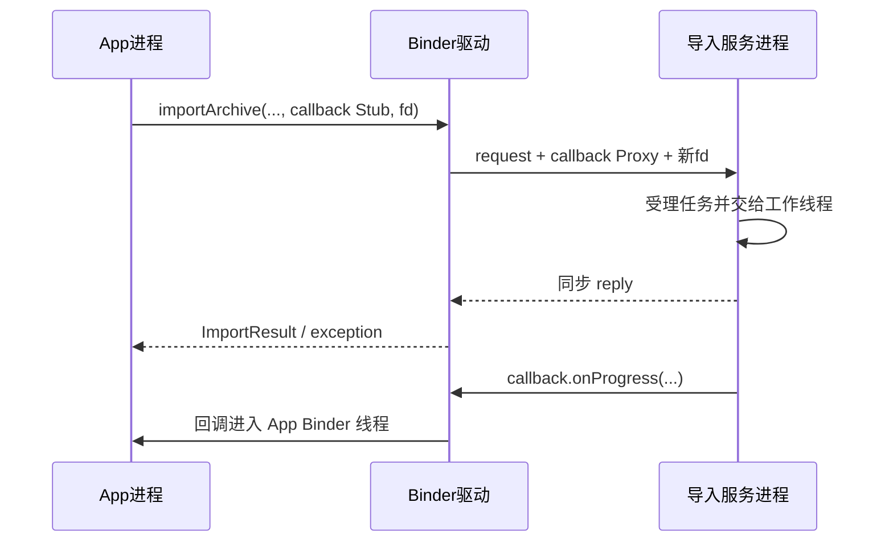

# 91 Android Parcel：一张偏移表怎样让 Binder 和 FD 跨进程

> 源码基线：Android 11 / API 30 / `android-11.0.0_r48`
>
> 学习方式：macOS 上静态阅读本地 AOSP，不要求编译或刷机。

一次文件导入请求同时携带了普通字段、进度回调和 `ParcelFileDescriptor`（Java 对文件描述符的封装，下文简称 PFD）。文件本来已经通过文件描述符（FD）传递，调用方却又误把整份文件读进 `byte[]` 塞入请求，最后抛出 `TransactionTooLargeException`。

**一句话结论：Parcel 是“顺序数据区 + 特殊对象偏移表 + 游标与所有权状态”；普通字段按字节复制，Binder/FD 由驱动根据偏移表校验并翻译，而大 `byte[]` 会直接挤占目标进程共享的 Binder 接收缓冲区。**

读完本章，你应该能做到四件事：

1. 看到 `mData` 和 `mObjects` 时，解释普通数据与 Binder/FD 为什么走不同处理路径；
2. 判断 callback 传递的是“反向调用能力”、FD 传递的是“已打开资源的引用”，而不是对象或整数副本；
3. 分开估算 request、reply 和 callback 的缓冲区压力，不把源码中的约 1 MiB 当成安全 payload；
4. 为带副作用的大事务设计 request ID、幂等和查询恢复，避免不确定失败造成重复执行。

本章聚焦远程 Java Binder。字符串细节、稳定 AIDL 的完整版本化规则、scatter-gather Binder 和不同设备内核改动不在这里展开。

## 1. 问题：已经传了 FD，为什么一个 `byte[]` 还能让请求失败

用下面这个示意 AIDL 表示场景。它只用于解释序列化布局，不是本工程中真实存在的接口：

```aidl
interface IImportService {
    ImportResult importArchive(long requestId, String displayName,
            in byte[] previewBytes,
            IImportCallback callback,
            in ParcelFileDescriptor archiveFd);
    ImportState queryImport(long requestId);
}
```

设计意图本来是：

- `requestId` 和 `displayName` 是少量元数据；
- `previewBytes` 只放小预览；
- `callback` 用于后续进度通知；
- `archiveFd` 让服务读取真正的大文件。

翻车代码却把整个文件读进了 `previewBytes`。结果同一份内容走了两条通道：FD 指向文件，`byte[]` 又把文件内容内联进 Parcel。

| 参数 | Binder transaction 中真正携带什么 | 是否随文件大小增长 |
|---|---|---|
| `long`、`String` | 顺序编码后的普通字节 | 只随字段内容增长 |
| `byte[]` | 长度、数组内容与对齐填充 | **会** |
| callback | 一个扁平 Binder 对象及其 offset | 不随回调代码大小增长 |
| `ParcelFileDescriptor` | 标记、FD 对象及其 offset | 不随文件内容大小增长 |

所以正确修复不是“把异常抓住再重试”，而是删掉重复的大数组：Parcel 只传小元数据、callback 和 FD，服务从 FD 流式读取文件。

## 2. 机制：Parcel 为什么不是一块可以随便复制的字节

如果 Parcel 只有 `byte[]`，驱动会遇到两个无法回答的问题：

- 数据里的某个整数究竟是业务数字，还是另一个进程的 Binder handle？
- 数值为 `12` 的字段究竟是业务字段，还是发送进程的文件描述符 12？

指针、Binder handle 和 FD number 都只在所属进程中有意义。Android 的办法是把 transaction 分成两份信息：

```text
mData
  [调用头][requestId][displayName][previewBytes]
  [callback 的 flat object][PFD 标记][FD 的 flat object]

mObjects
  [callback flat object 在 mData 中的位置,
   FD flat object 在 mData 中的位置]
```

这是概念布局，省略了 nullable、字符串、稳定性和对齐等辅助字段，不代表固定 byte offset。读端仍必须按写入协议的同一顺序读取。

`mObjects` 的作用很像海关申报单：箱子里的普通物品照常搬运，申报单指出哪些位置装的是需要查验和换证的特殊物品。类比到这里为止，真实源码成员是 `mData`、`mObjects`、`mDataPos`、`mDataSize` 和 `mOwner`。

Native `Parcel::writeObject()` 同时写 flat object 和记录 offset。下面是 Android 11 r48 的精简摘录，省略容量扩容与错误清理分支：

`frameworks/native/libs/binder/Parcel.cpp`

```cpp
*reinterpret_cast<flat_binder_object*>(mData + mDataPos) = val;
if (val.hdr.type == BINDER_TYPE_FD) {
    if (!mAllowFds) return FDS_NOT_ALLOWED;
    mHasFds = mFdsKnown = true;
}
if (nullMetaData || val.binder != 0) {
    mObjects[mObjectsSize] = mDataPos;
    acquire_object(ProcessState::self(), val, this, &mOpenAshmemSize);
    mObjectsSize++;
}
return finishWrite(sizeof(flat_binder_object));
```

这几行证明：flat object 本身仍位于 `mData` 中；`mObjects` 保存的是它写入前的 `mDataPos`。普通 `writeInt()` 或 `writeByteArray()` 不会因此自动进入对象表。

到了 IPC 层，两份信息一起进入 `binder_transaction_data`：

`frameworks/native/libs/binder/IPCThreadState.cpp`

```cpp
tr.data_size = data.ipcDataSize();
tr.data.ptr.buffer = data.ipcData();
tr.offsets_size =
        data.ipcObjectsCount() * sizeof(binder_size_t);
tr.data.ptr.offsets = data.ipcObjects();

mOut.writeInt32(cmd);
mOut.write(&tr, sizeof(tr));
```

这也说明 `Parcel.dataSize()` 只看数据区，并不能独自描述 transaction 的所有成本；offset 数组、驱动对象和分配器元数据也要占资源。

## 3. 方案：驱动怎样把 callback 和 FD 翻译成接收方能用的东西

UAPI 没有把 transaction 描述成一根指针，而是明确给出数据区和 offsets 区。下面是精简摘录，省略 target/data union 中与本章无关的替代成员：

`bionic/libc/kernel/uapi/linux/android/binder.h`

```c
struct binder_transaction_data {
    union { __u32 handle; binder_uintptr_t ptr; } target;
    binder_uintptr_t cookie;
    __u32 code;
    __u32 flags;
    pid_t sender_pid;
    uid_t sender_euid;
    binder_size_t data_size;
    binder_size_t offsets_size;
    union { struct { binder_uintptr_t buffer;
                     binder_uintptr_t offsets; } ptr; } data;
};
```

驱动先为目标进程分配 transaction buffer，再按 offsets 逐个定位对象。它会检查 offset 范围、顺序、重叠与对象类型；验证失败不是“读出一个奇怪字段”，而是整笔 transaction 失败。

对本章两个特殊对象，翻译结果不同：

| 发送对象 | 驱动做的关键工作 | 服务端看到什么 |
|---|---|---|
| App 本地 callback Stub | 建立或找到 Binder node，再为服务进程建立引用 | 指向原 callback node 的 handle / Proxy |
| App 的 FD | 取得底层 `struct file` 引用，做安全检查，在目标进程安装新 FD | 一个属于服务进程的 FD number |

因此下面两句话都不成立：

- “把 callback 对象的地址复制过去，服务就能调用。”另一个进程不能直接解引用这个地址。
- “把 fd=12 复制过去，服务也用 12。”服务端的 12 可能早已被占用，目标 FD 号码由目标进程分配，恰好相同也只是巧合。

本地 checkout 包含 Binder UAPI（用户空间与内核驱动共同遵守的协议头），但不含设备使用的 `drivers/android/binder.c`，因此本地可以核对 transaction 的数据结构，不能逐行核对驱动实现。

驱动通用动作可参考 Android common kernel 的 Android 11 分支，定位 `binder_transaction()`、`binder_translate_binder()`、`binder_translate_fd()` 与 `binder_apply_fd_fixups()`：[Android 11 common kernel binder.c](https://android.googlesource.com/kernel/common/+/refs/tags/android11-5.4.299_r00/drivers/android/binder.c)。

这份固定标签能证明本文引用版本的机制，不能替代具体设备的 kernel tag；厂商 backport 或改动仍要到目标设备匹配的内核树验证。

这正是 offsets table 不可省略的原因：驱动不会扫描普通 bytes 猜测哪里像 Binder 或 FD，只处理明确申报并通过校验的对象。

## 4. callback 传递的不是对象副本，而是一条反向调用能力

客户端的 `IImportCallback.Stub` 是本地 Binder。Native flatten 时，本地对象与已经拿到的远端 Proxy 会走不同分支。下面省略 null Binder、调度策略 flags、稳定性标记和错误分支：

`frameworks/native/libs/binder/Parcel.cpp`

```cpp
BBinder* local = binder->localBinder();
if (!local) {
    BpBinder* proxy = binder->remoteBinder();
    obj.hdr.type = BINDER_TYPE_HANDLE;
    obj.handle = proxy ? proxy->handle() : 0;
    obj.cookie = 0;
} else {
    obj.hdr.type = BINDER_TYPE_BINDER;
    obj.binder = reinterpret_cast<uintptr_t>(local->getWeakRefs());
    obj.cookie = reinterpret_cast<uintptr_t>(local);
}
```

本场景传的是客户端本地 Stub，所以先编码为 `BINDER_TYPE_BINDER`。驱动为它建立 App 所有的 node，并在服务进程生成引用；服务反序列化后拿到 Proxy。之后调用 `callback.onProgress()` 是一笔新的、方向相反的 Binder transaction。

下面的顺序建立在一个明确的业务协议上：`importArchive()` 只负责受理任务，实际导入在工作线程异步进行，因此先返回受理结果，稍后才报告进度。这是本例的设计，不是 Binder 自动保证的顺序。



这张图有四个边界：

- callback 不保证运行在 App 主线程；Stub 若要更新 UI，应再投递到主线程。
- 如果服务在 `importArchive()` 返回前直接调用 callback，回调可能先于原事务的 reply，甚至形成嵌套 Binder 调用；先 reply 后 callback 需要由业务实现自己保证。
- 服务持有 callback 会形成跨进程强引用关系，应定义注销、客户端死亡和重复注册策略。
- 本章描述远程 Binder；若 `asInterface()` 得到同进程本地实现，调用可能直接执行，不经过 Parcel 和驱动翻译。

## 5. FD 传递后到底该由谁关闭

Java `Parcel.writeFileDescriptor()` 进入 JNI 后，不直接把调用方原 FD 交给 native Parcel，而是先复制一份：

`frameworks/base/core/jni/android_os_Parcel.cpp`

```cpp
static jlong android_os_Parcel_writeFileDescriptor(
        JNIEnv* env, jclass clazz, jlong nativePtr, jobject object) {
    Parcel* parcel = reinterpret_cast<Parcel*>(nativePtr);
    if (parcel != NULL) {
        const status_t err = parcel->writeDupFileDescriptor(
                jniGetFDFromFileDescriptor(env, object));
        if (err != NO_ERROR) signalExceptionForError(env, clazz, err);
        return parcel->getOpenAshmemSize();
    }
    return 0;
}
```

`writeDupFileDescriptor()` 使用 `F_DUPFD_CLOEXEC`，并把副本作为 owned FD 写进 native Parcel。驱动随后引用同一个底层 file，在目标进程分配并安装另一个 FD number。

这里先补一个不影响主线的 PFD 变体：本场景的 `archiveFd` 没有关闭监听通信通道，所以只写一个 FD 对象。若 `ParcelFileDescriptor` 带 `OnCloseListener` 所需的 communication channel，序列化时还会多写一个通信 FD；特殊对象数量会增加，但文件内容依然不会进入 Binder buffer。

接收端 Java 也有一次明确的所有权切换：JNI 从 incoming Parcel 读出驱动安装的 FD，再次 `F_DUPFD_CLOEXEC`，用副本构造 Java `FileDescriptor`。incoming Parcel 释放时，`IPCThreadState::freeBuffer()` 调用 `Parcel::closeFileDescriptors()` 关闭它临时持有的原 FD；服务拿到的 `ParcelFileDescriptor` 则持有刚才 dup 出来的 FD，由服务代码负责关闭。

把本场景的责任写成表会更清楚：

| 资源 | 谁负责关闭 | 不能做的假设 |
|---|---|---|
| 客户端原 `ParcelFileDescriptor` | 客户端；本章 `in` 参数发送后仍归客户端 | “写进 Parcel 就自动转移所有权” |
| 客户端 request Parcel 持有的 dup | Parcel recycle/清理路径 | 业务代码手动关闭内部 raw fd |
| 服务端收到的 `ParcelFileDescriptor` | 服务端，用完后 `close()` | “客户端 close 会替服务端 close” |
| callback Binder 引用 | 服务注销或客户端死亡时清理 | “FD close 会顺便移除 callback” |

`ParcelFileDescriptor.writeToParcel()` 在带 `PARCELABLE_WRITE_RETURN_VALUE` flag 时可以关闭原对象；这常用于返回值语义，不应套用到所有参数。若调用 `detachFd()`，关闭责任又会转移给拿到 raw fd 的代码。判断所有权时必须看具体 API 和 flags，不能只看类型名。

传 FD 也不是“文件零拷贝”的承诺。它只表示文件内容不内联进 Binder buffer；服务之后仍要通过文件系统、管道或共享内存 API 读数据。双方描述符引用同一个底层打开文件状态，文件位置和并发读写行为也应由协议明确。

## 6. 大小预算：约 1 MiB 为什么不能当成单次 payload 上限

Android 11 r48 的 libbinder 为普通 Binder 驱动请求的接收映射大小接近 1 MiB：

`frameworks/native/libs/binder/ProcessState.cpp`

```cpp
#define BINDER_VM_SIZE \
        ((1 * 1024 * 1024) - sysconf(_SC_PAGE_SIZE) * 2)

// ProcessState 构造函数中，省略前后的驱动打开与错误处理
mVMStart = mmap(nullptr, BINDER_VM_SIZE, PROT_READ,
        MAP_PRIVATE | MAP_NORESERVE, mDriverFD, 0);
```

这段源码是实现事实，不是应用协议应使用的最大常量。真正做预算时必须同时看四个维度。

### 方向：谁接收，谁的池子承压

| 方向 | 需要目标 buffer 的内容 | 主要占用谁的 Binder 接收映射 |
|---|---|---|
| App → Service request | 参数数据、offsets、特殊对象元数据 | Service 进程 |
| Service → App reply | 异常头、返回值、out 参数 | App 进程 |
| Service → App callback | 回调参数 | App 进程 |

发送方在用户空间构造的 `Parcel.mData` 是另一块内存，不能用“本地 Parcel 创建成功”证明接收方还有 Binder buffer。

一次同步调用的 request 与 reply 也不能简单相加，再拿总和去和 1 MiB 比较：request 分配在 Service 的接收区，reply 分配在 App 的接收区，它们分别和各自进程当时的其他 incoming transaction 竞争空间。

### 并发：不是每笔调用独享一块约 1 MiB 空间

同一接收进程中尚未释放的多笔 transaction 会共享空间。同步 request、同步 reply、oneway 调用、多个 Binder 线程以及尚未归还的 incoming buffer，都可能改变当时可用余量。

### 额外开销：`dataSize()` 不是全部

flat Binder/FD object 本体以及 Parcel 写字段产生的填充仍位于 `mData`，所以已经计入 `Parcel.dataSize()`。没有计入的主要是 object offsets 数组；驱动分配时还会分别对 data、offsets 做对齐，并承担 buffer/security-context 元数据和分配器碎片。因此“某次 700 KiB 成功”不能推出“以后所有 700 KiB 都安全”。具体设备还可能有不同内核与厂商配置。

### 设计：设置产品上限，不贴着驱动极限跑

本场景应把 `previewBytes` 定义成真正的小预览，并在进入 Binder 前执行产品级限制；超出就省略预览或让服务从 FD 读取。上限应由数据语义、并发压测和目标设备验证确定，本章不虚构一个通用安全数字。

```java
if (previewBytes.length > MAX_INLINE_PREVIEW_BYTES) {
    previewBytes = EMPTY_PREVIEW;
}
try (ParcelFileDescriptor fd = openArchive()) {
    service.importArchive(requestId, name,
            previewBytes, callback, fd);
}
```

这段是应用设计示意，不是 AOSP 源码。它减少 Binder 内联数据，但仍需限制文件大小、验证内容、处理取消，并避免在主线程同步读取大文件。

## 7. 异常与 reply：失败发生在哪一层，决定能否重试

一次同步 AIDL 调用至少有四类结果，不能都叫“Binder 报错”：

| 层次 | 例子 | 能否说明服务已执行 |
|---|---|---|
| 本地序列化/参数错误 | Parcelable 写入失败、FD 已关闭 | 通常还未发出 request |
| transport failure | `DEAD_OBJECT`、`FAILED_TRANSACTION` | 单凭客户端异常不一定能确定 |
| 远端 exception reply | `SecurityException`、`ServiceSpecificException` | request 已到达并由远端写回异常 |
| 正常业务结果 | `ImportResult.REJECTED` | transport 与 reply 协议均成功 |

远端 Java Binder 在同步调用中捕获支持的异常时，会清空 reply 并把异常编码进去；oneway 没有这条返回通道。下面是精简摘录，合并了 oneway 对 `RemoteException` 和其他运行时异常的不同日志文字：

`frameworks/base/core/java/android/os/Binder.java`

```java
} catch (RemoteException | RuntimeException e) {
    if ((flags & FLAG_ONEWAY) != 0) {
        Log.w(TAG, "Binder call failed.", e);
    } else {
        reply.setDataSize(0);
        reply.setDataPosition(0);
        reply.writeException(e);
    }
    res = true;
}
```

正常 Stub 会先 `writeNoException()` 再写返回值；Proxy 则先 `readException()`，只有没有异常时才继续读取 `ImportResult`。最简单的成功 reply 可以记成“成功头 + 返回值”，但 Android 11 还可能带 AppOps 或 StrictMode reply header，所以不要手写 `readInt()` 冒充 `readException()`。

### `TransactionTooLargeException` 为什么意味着“结果不确定”

Android 11 的文档明确要求按 partial failure 处理：可能是 request 根本送不出去，也可能是服务已经执行，但 reply 无法送回。对本章有副作用的导入操作，这两种情况的处理完全不同：

```text
request 失败：服务没有创建导入任务
reply 失败：服务可能已经创建任务，只是客户端没收到结果
```

这里还要把“失败语义”和“Java 异常类怎么选”分开。Android 11 r48 的 `android_os_BinderProxy_transact()` 把**调用方请求 Parcel 的 `dataSize()`**传给 `signalExceptionForError()`。本版遇到 `FAILED_TRANSACTION` 时使用固定启发式：允许抛 `RemoteException` 且请求大于 `200 * 1024` 字节，映射为 `TransactionTooLargeException`；否则映射为 `DeadObjectException`。这个大小不是驱动实际失败一侧的 payload 大小。

所以，即使真正失败的是一个很大的 reply，只要原 request 不超过该阈值，客户端也可能看到 `DeadObjectException`。反过来，超过阈值的 request 收到 `FAILED_TRANSACTION` 时，异常名也不能证明原因一定是空间不足；驱动还可能因 malformed object 或已关闭 FD 等原因失败。`TransactionTooLargeException` 文档所说的 partial failure 解释“为什么结果可能不确定”，JNI 的 200 KiB 规则只解释“Android 11 为什么选择这个异常类”，两者不能混成一条判断。

正确恢复协议是：

1. 客户端为操作生成稳定 `requestId`；
2. 服务按“调用方身份 + requestId”去重；
3. 客户端遇到不确定 transport failure 时先 `queryImport(requestId)`；
4. 只有协议确认未受理时才重试；
5. reply 保持很小，只返回 ID、状态和必要错误码。

不要把 callback 当成唯一真相：客户端可能在注册回调后死亡、漏掉回调或重连。可查询的状态才是恢复点。

## 8. macOS 上怎样验证这条链，而不是背结论

先进入源码根目录：

```bash
cd /Users/ninebot/androidSource
```

### 第一步：证明 Parcel 同时维护 data 与 object offsets

```bash
rg -n 'writeObject\(|mData|mObjects|ipcData|ipcObjects' \
  frameworks/native/libs/binder/Parcel.cpp \
  frameworks/native/libs/binder/include/binder/Parcel.h
```

预期观察：`writeObject()` 把 flat object 写到 `mData + mDataPos`，并把 `mDataPos` 追加到 `mObjects`；普通字段没有这一步。

### 第二步：证明 transaction 向驱动提交两块信息

```bash
sed -n '1038,1060p' \
  frameworks/native/libs/binder/IPCThreadState.cpp
sed -n '115,165p' \
  bionic/libc/kernel/uapi/linux/android/binder.h
```

预期观察：`binder_transaction_data` 同时带 `data_size/buffer` 和 `offsets_size/offsets`。

### 第三步：分别追 callback 与 FD

```bash
rg -n 'flattenBinder|BINDER_TYPE_BINDER|BINDER_TYPE_HANDLE' \
  frameworks/native/libs/binder/Parcel.cpp
rg -n 'writeDupFileDescriptor|BINDER_TYPE_FD|nativeReadFileDescriptor' \
  frameworks/native/libs/binder/Parcel.cpp \
  frameworks/base/core/jni/android_os_Parcel.cpp
rg -n 'freeBuffer|closeFileDescriptors' \
  frameworks/native/libs/binder/IPCThreadState.cpp \
  frameworks/native/libs/binder/Parcel.cpp
```

预期观察：本地 Binder 与远端 handle 编码不同；Java 写 FD 时先 dup，Java 读 FD 时也为返回对象 dup；incoming Parcel 释放时关闭驱动安装的临时接收 FD。

### 第四步：核对 buffer 和异常边界

```bash
rg -n 'BINDER_VM_SIZE|mmap\(' \
  frameworks/native/libs/binder/ProcessState.cpp
rg -n 'FAILED_TRANSACTION|TransactionTooLargeException' \
  frameworks/base/core/jni/android_util_Binder.cpp \
  frameworks/base/core/java/android/os/TransactionTooLargeException.java
```

预期观察：源码有接近 1 MiB 的接收映射实现值，但 Java 文档强调共享与 request/reply 歧义；JNI 还明确写着 `FAILED_TRANSACTION` 不只代表大事务，并只用调用方 request 的 `dataSize()` 做 200 KiB 启发式分类。

### 第五步：画出本章场景的两张表

不要抄整份 `Parcel.cpp`，只记录：

```text
字段             data 中的内容       是否有 object offset
requestId        普通编码             否
previewBytes     长度 + 内联 bytes    否
callback         flat Binder object    是
archiveFd        flat FD object        是

方向             接收 buffer 属于谁
request          Service 进程
reply/callback   App 进程
```

如果能独立解释这两张表，就已经掌握了本章主线。macOS 静态阅读能证明代码结构和默认实现，不能证明某台设备的实际 buffer 余量、厂商 kernel 行为或你的产品安全阈值；这些要用目标设备和并发场景验证。

## 9. 检查题、答案与立即可用的设计清单

### 检查题与答案

1. **`mData` 中已经有 flat Binder object，为什么还必须有 `mObjects`？**

   因为任意普通 bytes 都可能长得像 object。offsets 明确指出可校验、可翻译的位置；没有它，驱动不会猜测，也不能安全建立 node/ref 或安装 FD。

2. **客户端传入 fd=12，服务端也会得到 12 吗？**

   不保证。驱动引用同一底层 file，并在目标进程分配新的 FD number；两边只需各自关闭自己拥有的描述符。

3. **使用 `ParcelFileDescriptor` 是否等于文件内容零拷贝？**

   不等于。它只避免把文件内容内联进 Binder transaction；后续文件读取、共享内存映射或管道传输仍有各自成本和生命周期。

4. **源码接近 1 MiB，是否说明 800 KiB request 一定安全？**

   不能。接收进程的 buffer 被并发 transaction 共享；除 `dataSize()` 已包含的 flat object 与 Parcel 填充外，还要承担 object offsets、驱动侧对齐/元数据、碎片和设备差异。单次成功也不能形成通用保证。

5. **捕获 `TransactionTooLargeException` 后能否认定服务没执行？**

   不能。request 可能没送达，也可能服务执行后 reply 发送失败。用 requestId、幂等与查询接口消除不确定性。

6. **服务抛出 `SecurityException` 与驱动返回 `FAILED_TRANSACTION` 有什么不同？**

   前者是 request 已到服务后编码进同步 reply 的远端异常；后者是 transport 层失败，可能来自空间、对象翻译、FD 或目标状态，不能按业务异常处理。

### 读完立刻能做的事

检查一个真实 AIDL 接口时，按下面顺序做一次“Parcel 预算审计”：

```text
[ ] 标出所有内联 String、byte[]、Bundle、List 和 Parcelable 的产品上限
[ ] 标出所有 Binder callback，并写清注册、死亡与线程切换策略
[ ] 标出所有 FD/PFD，并写清 sender、Parcel、receiver 的 close 责任
[ ] 分开估算 request、reply 和 callback 三个方向
[ ] 用目标设备并发测试余量，不把约 1 MiB 当 payload 常量
[ ] 有副作用的方法加入 requestId、幂等和 query/recovery
[ ] 将大内容移到 FD、共享内存、Provider、分页或流式协议
[ ] 将 transport error、远端 exception 和业务 status 分层记录
```

回到开头的翻车请求，最小而正确的修复是：文件只走 `ParcelFileDescriptor`，`previewBytes` 严格限为小预览，callback 只传进度，reply 只返回小状态；无论是否看到 `TransactionTooLargeException`，都以 requestId 查询最终结果，而不是直接重复导入。
