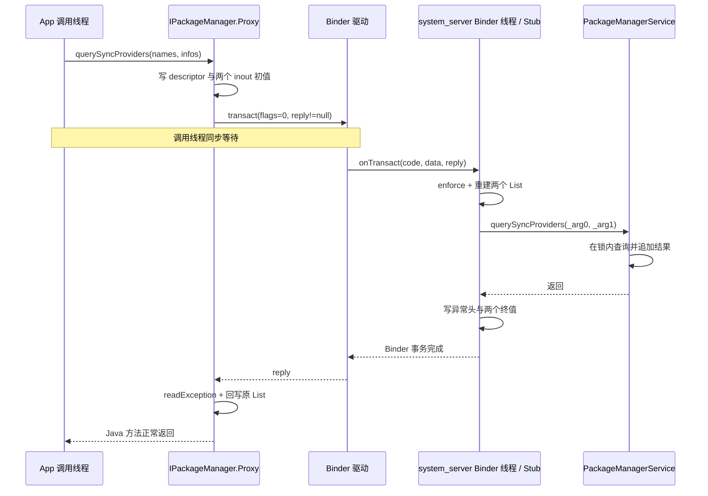

# 92 Android AIDL 生成代码：从声明还原 Proxy、Stub 与数据方向

> 源码基线：Android 11 / API 30 / `android-11.0.0_r48`
>
> 贯穿接口：`android.content.pm.IPackageManager`
>
> 阅读方式：macOS 上静态阅读即可，不要求编译 Android

你在调用栈里看到 `IPackageManager.querySyncProviders()`，传入两个 `List`，调用结束后列表里却多了数据；同一接口的 `notifyPackageUse()` 又标着 `oneway`，调用者似乎不等服务端。只看 `.aidl` 的一行声明，很难回答：数据到底写进了哪个 Parcel、代码在哪个线程执行、什么时候才算调用完成。

**先给结论：AIDL 是一份双向 Parcel 协议。** 对远程 Binder，`Proxy` 按声明写请求，`Stub.onTransact()` 按同一顺序读请求并调用实现；同步方法再由 Stub 写回复、Proxy 读回复。`in/out/inout` 描述的是**相对调用方**的数据方向，`oneway` 则直接取消回复通道。

读完本章，你应该能做到三件事：

1. 从任意 Java AIDL 方法还原 `Proxy → transact → Stub → 实现`；
2. 不运行程序，也能判断参数是否回写、调用者是否等待、异常能否返回；
3. 区分普通平台 AIDL 与 Android 11 已有的稳定 AIDL version/hash 机制。

本章只讲 AIDL 编译器的 Java 代码生成路径（Java backend）及其 Binder 协议骨架。权限策略、Binder 驱动内部队列、C++/NDK 代码生成路径的具体类名留在各自章节。

## 一、为什么不能把 AIDL 只看成“自动生成接口”

普通 Java 接口只约束方法名和类型；AIDL 还必须让两个进程对同一串字节作出相同解释。以下五件事只要有一件不一致，IPC 就会读错：

- transaction code 对应哪个方法；
- 接口标识串（descriptor）怎样确认请求没有投错接口；
- 请求 Parcel 依次写入哪些参数；
- 回复先读异常、返回值，还是 `out` 参数；
- 本次事务有没有回复 Parcel。

可以把 Parcel 想成两个按固定格式装箱的快递箱：

```text
请求箱 data：调用方 → 服务端
回复箱 reply：服务端 → 调用方
```

`in/out/inout` 决定东西放进哪个箱子；`oneway` 相当于只寄请求箱，不附回邮信封。类比只帮助建立方向感，真正的证据仍要落到生成代码的 `write*()`、`read*()` 和 `transact()`。

本章用同一个真实服务讲清楚：App 或 framework 进程持有 `IPackageManager`，远程目标是 `system_server` 中的 `PackageManagerService`。其中：

- `querySyncProviders(inout List, inout List)` 展示一次完整往返；
- `getPreferredActivities(out List, out List, String)` 用来对比纯 `out`；
- `notifyPackageUse(String, int)` 展示 `oneway`。

`querySyncProviders()` 在本版属于隐藏 framework 接口，`PackageManagerService` 中的实现标记了 `@Deprecated`。本章选它是因为它能清楚展示真实的 `inout List` 协议，不是在建议应用调用隐藏 API。

## 二、第一步先判断：拿到的是本地实现，还是远程 Proxy

App 进程获取 PackageManager Binder 的入口很短：

```java
public static IPackageManager getPackageManager() {
    if (sPackageManager != null) {
        return sPackageManager;
    }
    final IBinder b = ServiceManager.getService("package");
    sPackageManager = IPackageManager.Stub.asInterface(b);
    return sPackageManager;
}
```

源码位置：`frameworks/base/core/java/android/app/ActivityThread.java`，`getPackageManager()`。

真正的分岔在生成的 `asInterface()`。Android 11 r48 的生成结果核心如下：

```java
public static IPackageManager asInterface(IBinder obj) {
    if (obj == null) return null;
    IInterface iin = obj.queryLocalInterface(DESCRIPTOR);
    if (iin != null && iin instanceof IPackageManager) {
        return (IPackageManager) iin;
    }
    return new IPackageManager.Stub.Proxy(obj);
}
```

因此读 AIDL 的第一问不是“Proxy 做了什么”，而是“这次真的经过 Proxy 吗”。

| 情况 | `asInterface()` 返回什么 | 方法在哪里执行 | 是否发生 Parcel 拷贝 |
|---|---|---|---|
| Binder 在另一个进程 | `Stub.Proxy` | 服务端 Binder 线程 | 是 |
| Binder 与调用者同进程，且 descriptor 匹配 | 已注册的本地接口对象 | 当前调用线程 | 否 |

这会带来一个很容易踩的坑：**同一个 AIDL 方法，跨进程和同进程的对象语义、线程语义并不完全相同。** 本地路径是普通 Java 调用，`inout` 传的是同一个对象引用；远程路径传的是两次序列化之间的副本。就连 `oneway` 在本地路径也不会自动异步，它会像普通方法一样执行完才返回。

本章后续默认讨论常见远程路径：App 进程中的 Proxy 调用 `system_server` 中的 Stub。

## 三、从 AIDL 声明先画出“请求箱”和“回复箱”

先看 `IPackageManager.aidl` 中三个真实方法：

```aidl
void querySyncProviders(inout List<String> outNames,
        inout List<ProviderInfo> outInfo);

int getPreferredActivities(out List<IntentFilter> outFilters,
        out List<ComponentName> outActivities, String packageName);

oneway void notifyPackageUse(String packageName, int reason);
```

源码位置：`frameworks/base/core/java/android/content/pm/IPackageManager.aidl`。

生成器还会给双方写入相同的 transaction code；本版结果如下：

```java
static final int TRANSACTION_querySyncProviders =
        IBinder.FIRST_CALL_TRANSACTION + 39;
static final int TRANSACTION_getPreferredActivities =
        IBinder.FIRST_CALL_TRANSACTION + 57;
static final int TRANSACTION_notifyPackageUse =
        IBinder.FIRST_CALL_TRANSACTION + 100;
```

数字本身不必背，但不能由客户端和服务端各自猜测。Proxy 用 code 发信，Stub 用同一个 code 选择 case；稳定接口的兼容检查还会防止旧方法的 code 因重排而改变。

方向永远站在**调用方**看：

| 声明 | 请求中有没有初值 | 回复中有没有终值 | 远程调用后调用方对象会否被更新 |
|---|---:|---:|---:|
| `in` | 有 | 无 | 否 |
| `out` | 无 | 有 | 是 |
| `inout` | 有 | 有 | 是 |

于是还没看生成代码，我们就能先写出协议草图：

```text
querySyncProviders 请求：descriptor → outNames 初值 → outInfo 初值
querySyncProviders 回复：异常头 → outNames 终值 → outInfo 终值

getPreferredActivities 请求：descriptor → packageName
getPreferredActivities 回复：异常头 → int 返回值 → 两个 List 终值

notifyPackageUse 请求：descriptor → packageName → reason
notifyPackageUse 回复：不存在
```

这里的“初值/终值”不是共享内存。远程 `inout` 至少经历两次复制：调用方对象写入请求，服务端重建本地对象；实现修改后，服务端对象写入回复，Proxy 再更新调用方原对象。

另一个细节是：并非所有类型都要求显式写 `in`。本版 AIDL 对 `String`、基本类型等只能作为输入的类型允许省略方向；对 `List`、Parcelable 等可作为输出的类型，编译器要求写清 `in/out/inout`。判断数据流时看类型规则与生成代码，不要把“没写 `in`”误读成“没有方向”。

## 四、同步调用怎样从 Proxy 到 transact

假设调用方准备两个空列表：

```java
List<String> names = new ArrayList<>();
List<ProviderInfo> infos = new ArrayList<>();
pm.querySyncProviders(names, infos);
// 远程调用正常返回后，两个原 List 已被回复内容更新。
```

Android 11 r48 自带 `aidl` 对真实接口生成的 Proxy，核心请求部分如下。为便于阅读只简化了全限定类名，并把回复读取与 `finally` 放到下一段，读写顺序未改变：

```java
Parcel _data = Parcel.obtain();
Parcel _reply = Parcel.obtain();
try {
    _data.writeInterfaceToken(DESCRIPTOR);
    _data.writeStringList(outNames);
    _data.writeTypedList(outInfo);
    boolean _status = mRemote.transact(Stub.TRANSACTION_querySyncProviders,
            _data, _reply, 0);
    if (!_status && getDefaultImpl() != null) {
        getDefaultImpl().querySyncProviders(outNames, outInfo);
        return;
    }
```

这几行证明两件事：

1. `inout` 的初值确实进入 `_data`；即使通常传空列表，协议仍允许初始元素到达服务端；
2. flags 是 `0` 且存在 `_reply`，所以这是同步事务。

代码中的 default implementation 是“远端不认识 transaction code 时改调本地备用实现”的兼容分支，不是服务端返回的业务结果。它不影响本节的正常远程主线，第八节会再说明它的边界。

`transact()` 期间，发起调用的线程等待远程事务完成。它不是“App 主线程专用 API”：哪个线程调用 Proxy，哪个线程就被同步等待；如果恰好从主线程调用，主线程就可能被慢服务拖住。

服务端回信后，Proxy 继续：

```java
    _reply.readException();
    _reply.readStringList(outNames);
    _reply.readTypedList(outInfo, ProviderInfo.CREATOR);
} finally {
    _reply.recycle();
    _data.recycle();
}
```

`readStringList()`/`readTypedList()` 会把回复内容写进调用方传入的原 List：覆盖共同下标、补充新项、移除多余旧项。它不是把参数变量重新指向一个新 List。因此 Java 调用方要传可修改且非空的列表对象。

两种错误发生的位置不同：本例传 `null` 时，请求会把 null 原样送到服务端；对普通调用者，`ComponentResolver` 执行 `add()` 时就会抛出 `NullPointerException`，客户端通常在 `readException()` 看到远端异常。传不可修改的 List 时，服务端操作的是重建出的可变副本，真正的问题通常出现在 Proxy 把回复写回调用方原 List 时，客户端本地抛出 `UnsupportedOperationException`。这也是为什么只写“参数不合法”不足以排障。

同步调用的完成点也由此明确：**只有 `readException()` 通过、所有返回值和 `out/inout` 参数解码完成，Java 方法才算正常返回。** `transact()` 返回到 native 层并不等于上层参数已经更新完毕。

## 五、Stub 如何解包，并在哪个线程调用真正实现

Binder 驱动把事务送到 `system_server` 后，一条 Binder 线程进入生成 Stub 的 `onTransact()`。对应 case 的核心是：

```java
case TRANSACTION_querySyncProviders: {
    data.enforceInterface(DESCRIPTOR);
    List<String> _arg0 = data.createStringArrayList();
    List<ProviderInfo> _arg1 =
            data.createTypedArrayList(ProviderInfo.CREATOR);
    this.querySyncProviders(_arg0, _arg1);
    reply.writeNoException();
    reply.writeStringList(_arg0);
    reply.writeTypedList(_arg1);
    return true;
}
```

`enforceInterface()` 校验请求写入的 descriptor，防止把别的接口的 transaction code 误投到这里；它不是权限检查。真正的访问控制仍需实现根据 calling UID/PID、权限或用户范围判断。

`this.querySyncProviders()` 最终落到真实服务类，因为：

```java
public class PackageManagerService extends IPackageManager.Stub {
    // ...

    @Deprecated
    public void querySyncProviders(List<String> outNames,
            List<ProviderInfo> outInfo) {
        if (getInstantAppPackageName(Binder.getCallingUid()) != null) return;
        mComponentResolver.querySyncProviders(
                outNames, outInfo, mSafeMode, UserHandle.getCallingUserId());
    }
}
```

源码位置：`frameworks/base/services/core/java/com/android/server/pm/PackageManagerService.java`。

实现没有把工作投递给 Handler，所以这段方法以及随后查询默认都运行在**接收该事务的 system_server Binder 线程**。下层在 `ComponentResolver` 中进入锁保护区并把结果追加到服务端列表：

```java
void querySyncProviders(List<String> outNames,
        List<ProviderInfo> outInfo, boolean safeMode, int userId) {
    synchronized (mLock) {
        // 省略筛选 provider、用户和 safe mode 的过程
        outNames.add(mProvidersByAuthority.keyAt(i));
        outInfo.add(info);
    }
}
```

源码位置：`frameworks/base/services/core/java/com/android/server/pm/ComponentResolver.java`。

因此完整线程与完成关系是：



不要把“跨进程”自动等同于“切到主线程”。这里的自然落点是 Binder 线程；只有实现显式 `Handler.post()`、调用其他调度器时，才会再切线程。

锁也不是 AIDL 自动加的。上面的 `mLock` 来自业务实现；生成的 Proxy/Stub 只负责协议，不替服务解决并发一致性。

## 六、`out` 与 `inout` 的差别，生成代码里一眼就能看见

同一接口的 `getPreferredActivities()` 使用纯 `out`：

```aidl
int getPreferredActivities(
        out List<IntentFilter> outFilters,
        out List<ComponentName> outActivities,
        String packageName);
```

Stub 不从请求读取两个 List，而是直接创建空容器：

```java
case TRANSACTION_getPreferredActivities: {
    data.enforceInterface(DESCRIPTOR);
    List<IntentFilter> _arg0 = new ArrayList<>();
    List<ComponentName> _arg1 = new ArrayList<>();
    String _arg2 = data.readString();
    int _result = this.getPreferredActivities(_arg0, _arg1, _arg2);
    reply.writeNoException();
    reply.writeInt(_result);
    reply.writeTypedList(_arg0);
    reply.writeTypedList(_arg1);
}
```

对比 `querySyncProviders()` 的 `create*ArrayList()`，差异很清楚：

- `out`：服务端拿到新建的空容器，调用方原有内容没有发送；
- `inout`：服务端先从请求重建初值，再在这个副本上修改；
- 两者都在同步回复中写终值，Proxy 都会更新调用方对象。

为什么要区分？因为 `out` 能省掉无意义的上行序列化，并明确服务端不应依赖调用方初值；`inout` 则适合“带着当前状态过去，服务端在其上修改”。代价是 `inout` 同时消耗请求和回复两边的 Parcel 空间。

在本例中，`ComponentResolver` 对传入列表使用 `add()`。所以如果远程调用者给 `querySyncProviders()` 传入非空列表，这些初始项会先到服务端，查询结果再追加，最终整个列表回写。方法注释说的是“Filled in”，正常用法应传空的可变列表；但 wire 语义确实是 `inout`，不能擅自把它理解成纯 `out`。

还有两个类型边界：

- 纯 `out` 数组为了让服务端知道应分配多长，Java 生成器会在请求中写入数组长度；所以“`out` 请求绝对一个字节也不写”对所有类型并不成立。
- 远程 `in` Parcelable 也是副本。服务端修改自己的对象不会自动反映给调用方；需要回传就应设计返回值、`out/inout` 或回调。

## 七、`oneway` 为什么没有回复，以及如何拿到“结果”

真实调用来自 `LoadedApk`：跨包使用代码时，它通知 PackageManager 记录一次 package use。

```java
try {
    ActivityThread.getPackageManager().notifyPackageUse(
            mPackageName,
            PackageManager.NOTIFY_PACKAGE_USE_CROSS_PACKAGE);
} catch (RemoteException re) {
    throw re.rethrowFromSystemServer();
}
```

对应 AIDL 是：

```aidl
/** Notify the package manager that a package is going to be used and why. */
oneway void notifyPackageUse(String packageName, int reason);
```

这类通知的价值是把“发生过包使用”交给 PMS 记录；调用方当前工作不需要 PMS 返回计算结果。若强制同步，调用线程还要等待 system_server 获取锁并更新时间，增加无必要的等待链。

生成 Proxy 明确取消了回复通道：

```java
Parcel _data = Parcel.obtain();
try {
    _data.writeInterfaceToken(DESCRIPTOR);
    _data.writeString(packageName);
    _data.writeInt(reason);
    mRemote.transact(Stub.TRANSACTION_notifyPackageUse,
            _data, null, IBinder.FLAG_ONEWAY);
} finally {
    _data.recycle();
}
```

决定远程异步语义的关键证据是 flags 含 `FLAG_ONEWAY`。

`reply` 为 `null`、Proxy 没有 `readException()` 是与它配套的两个交叉证据。不要倒过来只看 `reply`：如果 flags 为 `0`，即使 native 调用者不给 reply，libbinder 仍会创建临时 reply 并同步等待。

Stub 在这个 oneway case 中只调用实现，不写任何回包：

```java
case TRANSACTION_notifyPackageUse: {
    data.enforceInterface(DESCRIPTOR);
    String _arg0 = data.readString();
    int _arg1 = data.readInt();
    this.notifyPackageUse(_arg0, _arg1);
    return true;
}
```

所以“oneway 怎么取回复”的准确答案是：**取不到，因为协议里根本没有回复。** 如果业务确实需要最终结果，接口必须另行设计，例如请求里传一个 callback Binder 和 requestId，服务完成后反向调用 callback；或者调用方稍后使用另一个同步查询方法。callback 是第二笔 Binder 事务，不是 oneway 原事务迟到的 reply。

`oneway` 也不等于“每次新建线程”：

- 远程调用方不等待服务方法完成，但仍要完成参数序列化和事务提交；
- 服务端仍由 Binder 线程池分发，不会为每次调用自动创建新线程；
- Android 11 的 `IBinder` 契约保证：发往**同一个 IBinder 对象**的多个 oneway 调用按发送顺序一次分发一个，但各次执行可能落到不同 Binder 线程；
- 不同 Binder 对象之间没有这项顺序保证；同一对象上混合 oneway 与同步调用，也不能套用这项保证；
- PMS 的真实实现随后在 `synchronized (mLock)` 中更新时间，因此锁等待发生在服务端 Binder 线程，而不是由调用方同步承担。

最重要的完成点对比是：

| 方法 | 调用方何时返回 | 服务端何时完成 |
|---|---|---|
| 同步 `querySyncProviders` | 回复到达且参数解码完成 | 在写回复之前已从实现返回 |
| 远程 `oneway notifyPackageUse` | 请求成功提交后，不等实现 | Binder 线程可能在调用方返回前或后执行；两者没有“完成谁先谁后”的保证 |
| 同进程 `oneway notifyPackageUse` | 直接 Java 调用执行完 | 与调用方返回是同一个时刻 |

## 八、异常、`reply` 与 `transact()` 返回值不要混为一谈

同步 Stub 的正常路径先 `writeNoException()`，再写返回值和 `out/inout`。Proxy 必须先 `readException()`，再按相同顺序读取业务数据。这个“异常头”更准确地说是 RPC 回复头。

如果服务实现抛出 `Binder.execTransactInternal()` 捕获的 `RemoteException` 或 `RuntimeException`，同步事务会清空回复并尝试写入异常：

```java
} catch (RemoteException | RuntimeException e) {
    if ((flags & FLAG_ONEWAY) != 0) {
        if (e instanceof RemoteException) {
            Log.w(TAG, "Binder call failed.", e);
        } else {
            Log.w(TAG, "Caught a RuntimeException from the binder stub implementation.", e);
        }
    } else {
        reply.setDataSize(0);
        reply.setDataPosition(0);
        reply.writeException(e);
    }
    res = true;
}
```

源码位置：`frameworks/base/core/java/android/os/Binder.java`，`execTransactInternal()`。它不是捕获所有 `Throwable`；`Error` 等不在这个 catch 中。即便进入 catch，Parcel 也只对有限的一组异常类型保留对应映射，不能假设任意自定义运行时异常会原样跨进程。

对 oneway，上述被捕获的服务端异常发生时没有 reply 可写，只会由 Binder 框架在服务端记录；调用方不会收到这次业务执行失败。调用方仍可能在提交事务阶段遇到 `RemoteException`，例如 Binder 对端已经死亡，但这不等于它能获知服务实现的业务结果。

还要区分 `IBinder.transact()` 的 boolean。在同步远程事务中：

- `true` 通常表示 transaction code 被处理；
- `false` 通常表示 code 不被理解，即 `UNKNOWN_TRANSACTION`；
- 它不是业务成功标记，业务结果应来自返回值、reply 异常或单独 callback。

Android 11 生成的 Proxy 在 `_status == false` 且注册了 default implementation 时会回退到该本地默认实现。这个回退不是远程服务的回复，也不应被误当成稳定接口自动完成了能力协商。

远程 oneway 是重要例外：调用方不等待服务端 `onTransact()`，因此远端 case 返回 `false` 或执行期抛异常都不会回到调用方，不能靠 `_status == false` 判断旧服务“不认识这个 oneway 方法”。即使生成代码包含 default implementation 分支，它也不是可靠的 oneway 版本协商机制；跨版本能力仍应使用稳定 AIDL 的 version 查询或单独的显式协议。

## 九、Android 11 的 version/hash 只属于“被版本化的稳定 AIDL”

`IPackageManager.aidl` 是 platform 内部的大型接口。本章从它学 Proxy/Stub 和方向参数，但它本身没有通过这里的 `aidl_interface { versions: ... }` 形成稳定 AIDL 快照，因此不能凭空调用 `IPackageManager.getInterfaceVersion()` 或 `getInterfaceHash()`。

Android 11 r48 已经存在稳定 AIDL 的 version/hash 机制。真实例子是 Identity Credential HAL（硬件抽象层接口）：

```bp
aidl_interface {
    name: "android.hardware.identity",
    vendor_available: true,
    srcs: ["android/hardware/identity/*.aidl"],
    imports: ["android.hardware.keymaster"],
    stability: "vintf",
    versions: [
        "1",
        "2",
    ],
}
```

源码位置：`hardware/interfaces/identity/aidl/Android.bp`。冻结快照位于 `aidl_api/android.hardware.identity/1` 和 `2`，各自 `.hash` 保存 API 内容哈希。

V2 并没有重排旧方法，而是在接口末尾增加新方法。例如 `IIdentityCredential` 的 V2 比 V1 多：

```aidl
void setRequestedNamespaces(
        in RequestNamespace[] requestNamespaces);
void setVerificationToken(
        in VerificationToken verificationToken);
```

本版 Android 构建系统 Soong 会把版本号和 `.hash` 内容传给 AIDL 编译器；编译器再加入两个保留的“接口自报版本”方法。源码内部是构造语法树节点的机械过程，压缩成判断条件如下（这是等价伪代码，不是可编译源码）：

```text
if (options.Version() > 0) {
    // 构造 int getInterfaceVersion()，使用保留 transaction id
    interface->GetMutableMethods().emplace_back(version_method);
}
if (!options.Hash().empty()) {
    // 构造 String getInterfaceHash()，使用保留 transaction id
    interface->GetMutableMethods().emplace_back(hash_method);
}
```

源码位置：`system/tools/aidl/aidl.cpp`。这段条件很重要：`version/hash` 是构建链传入版本信息后生成的，不是所有写了 `.aidl` 的接口天然都有。

生成的稳定接口同时有编译期常量和远端查询：

```java
public static final int VERSION = 2;
public static final String HASH =
        "194e04be642728623d65ec8321a3764fdea52ae0";

public int getInterfaceVersion() throws RemoteException;
public String getInterfaceHash() throws RemoteException;
```

`VERSION/HASH` 表示**调用方编译时所用接口**；Proxy 的 `getInterfaceVersion()/getInterfaceHash()` 发起保留 transaction，读取并缓存**远端对象实现的版本和哈希**。两者不同是允许出现的，正因如此才有查询价值。

正确使用方式是：新 client 准备调用 V2 新方法前，先确认远端 `getInterfaceVersion() >= 2`；否则走旧功能或明确报“不支持”。AIDL 不会自动把所有 V2 方法改写成兼容 V1 的行为。

`getInterfaceHash()` 更像“远端使用哪份冻结 API 快照”的指纹，可用于严格匹配或诊断。它不是功能协商的替代品，也不能证明：

- 服务实现的业务逻辑一定正确；
- 调用方一定有权限；
- 设备厂商一定实现了可选能力；
- 两端没有语义层面的行为差异。

本版 `aidl --checkapi` 会检查旧方法未被删除或改变、transaction ID 未改变、`oneway` 与参数方向未改变；结构化 Parcelable 只能在末尾追加字段，不能删减或重排旧字段。version/hash 帮助识别版本，真正保持 wire 兼容仍依赖这些冻结与检查规则。

## 十、把任意 AIDL 还原成调用链的固定读法

以后遇到陌生接口，不要从数千行生成文件开头读到结尾。按下面六步定位：

1. **找声明**：记录方法返回值、参数顺序、每个方向和 `oneway`。
2. **找 Binder 来源**：搜索 `ServiceManager.getService()`、回调参数或其他返回 Binder 的入口。
3. **先看 `asInterface()`**：确认当前场景可能是本地实现还是 Proxy。
4. **只看一个 Proxy 方法**：记录 `_data` 写入顺序、reply 是否为空、flags、`readException()` 和回复读取顺序。
5. **只看一个 Stub case**：检查读取顺序是否镜像、实现调用点、正常回复的写入顺序。
6. **跳到实现**：确认真实进程、Binder/Handler 线程、锁、权限和最终副作用。

可以把结果记成一张小表：

| 项目 | `querySyncProviders` 的答案 |
|---|---|
| Binder 来源 | `ServiceManager.getService("package")` |
| 远程入口 | `IPackageManager.Stub.Proxy` |
| transaction | `TRANSACTION_querySyncProviders` |
| 请求 | descriptor、两个 List 初值 |
| flags/reply | `0` / 非空 reply，同步 |
| 服务线程 | `system_server` Binder 线程 |
| 实现 | `PackageManagerService` → `ComponentResolver` |
| 锁 | `ComponentResolver.mLock` 保护查询 |
| 回复 | 异常头、两个 List 终值 |
| 调用方完成点 | reply 解码并更新原 List 之后 |

这套读法比死记“Proxy 是客户端、Stub 是服务端”更有用，因为它最终回答的是故障问题：谁在等谁、数据在哪里复制、异常能不能回来、慢在哪里发生。

## 十一、macOS 只读验证与检查题答案

下面命令只读源码，不会编译 AOSP，也不会修改文件。先进入源码根目录，再逐组执行：

```bash
cd /Users/ninebot/androidSource
```

### 验证 1：同一份 AIDL 中的三种协议

```bash
rg -n "querySyncProviders|getPreferredActivities|notifyPackageUse" \
  frameworks/base/core/java/android/content/pm/IPackageManager.aidl
```

应看到 `inout`、`out`、`oneway` 三种声明。然后在生成器中找决定请求、回复和 flags 的分支：

```bash
rg -n "IN_DIR|OUT_DIR|FLAG_ONEWAY|readException|writeNoException" \
  system/tools/aidl/generate_java_binder.cpp
```

预期结论：带 `IN_DIR` 才写请求，带 `OUT_DIR` 才读写回复；oneway 不创建 reply，并使用 `FLAG_ONEWAY`。

### 验证 2：从 Binder 获取点走到业务实现

```bash
rg -n "getPackageManager\(\)|ServiceManager.getService\(\"package\"\)" \
  frameworks/base/core/java/android/app/ActivityThread.java
rg -n "class PackageManagerService extends|querySyncProviders\(" \
  frameworks/base/services/core/java/com/android/server/pm/PackageManagerService.java
rg -n "querySyncProviders\(|synchronized \(mLock\)|outNames.add|outInfo.add" \
  frameworks/base/services/core/java/com/android/server/pm/ComponentResolver.java
```

预期结论：生成 Stub 直接调用 PMS，实现继续在 Binder 线程执行，并在 `ComponentResolver` 的业务锁内向两个 List 追加结果。

### 验证 3：确认 version/hash 没有被后续版本知识污染

```bash
sed -n '1,35p' hardware/interfaces/identity/aidl/Android.bp
find hardware/interfaces/identity/aidl/aidl_api/android.hardware.identity \
  -maxdepth 2 -name .hash -print
rg -n "options.Version|options.Hash|getInterfaceVersion|getInterfaceHash" \
  system/tools/aidl/aidl.cpp system/tools/aidl/generate_java_binder.cpp
```

预期看到 `versions: ["1", "2"]`、两个冻结版本的 `.hash`，以及 compiler 只在收到 version/hash 参数时加入 meta method。

### 检查题与答案

**1. `inout` 是否表示两个进程共享同一个 List？**

不是。远程路径是“调用方 List → 请求 Parcel → 服务端 List 副本 → 回复 Parcel → 更新调用方原 List”。只有 local interface 快路径才是普通 Java 引用传递。

**2. `out List` 为什么调用方还要先创建 List？**

因为 Java Proxy 收到 reply 后要把元素读进这个调用方容器。它的初始内容不会发送给服务端，但容器本身要可修改且非空。

**3. oneway 调用怎样取得服务端返回值或异常？**

不能取得；它没有 reply。需要结果就设计 callback 或后续同步查询。服务端执行期异常只在服务端记录，不能通过原事务返回。

**4. oneway 是否保证服务端在另一个新线程执行？**

不保证。远程事务由现有 Binder 线程池分发；同进程 local interface 甚至就在调用线程同步执行。

**5. 同步方法何时才算对 Java 调用方完成？**

服务实现返回、Stub 写好 reply、reply 回到调用方、Proxy 通过 `readException()` 并解码返回值及全部 `out/inout` 之后。

**6. `getInterfaceVersion()` 和 `getInterfaceHash()` 有什么区别？**

version 适合判断远端至少支持到哪一版，再决定能否调用新增方法；hash 标识一份具体冻结 API 快照，更严格，主要用于匹配与诊断。两者都不会自动保证业务正确。

**7. 为什么不能给 `IPackageManager` 套用稳定 AIDL 的 version/hash 结论？**

因为本章所读的 `IPackageManager` 没有走带 `versions` 和 `.hash` 的稳定 `aidl_interface` 生成链。Android 11 compiler 支持该机制，不等于每个 AIDL 都启用了该机制。

最后只记住一句可操作的话：**看到 AIDL，先按调用方视角画出 data 与 reply，再用 Proxy 的写入顺序和 Stub 的读取顺序互相校验；最后跳到实现确认线程、锁和完成点。**
