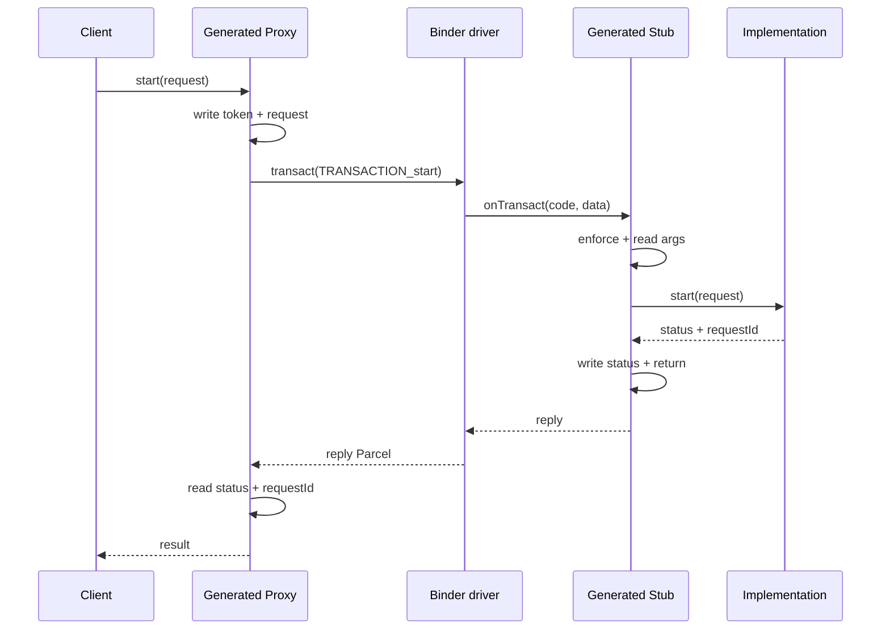

# 92 Android AIDL 生成代码：Proxy、Stub、方向参数与版本化接口

> 源码版本：Android 11 / API 30 / `android-11.0.0_r48`
>
> 本章不要求运行 aidl 编译器。通过 `.aidl`、generator 源码和真实 HAL 接口，理解生成
> 代码的稳定骨架；具体类名和 helper 会因 Java/CPP/NDK backend 与 Android 版本不同。

---

## 1. AIDL 做了什么

AIDL 把一份接口声明转换成两端都遵守的 Binder 协议：

```text
.aidl
  → interface descriptor
  → transaction code
  → Proxy 参数写入顺序
  → Stub 参数读取顺序
  → implementation method call
  → reply exception/return/out 写入顺序
  → Proxy reply 读取顺序
```

它消除了大量手写 Parcel 的机械错误，但不会替你决定权限、业务范围、线程、超时、幂等、
大数据和兼容语义。

---

## 2. 源码地图

| 路径 | 作用 |
|---|---|
| `system/tools/aidl/generate_java_binder.cpp` | Java Stub/Proxy 生成逻辑 |
| `system/tools/aidl/generate_cpp.cpp` | CPP backend Bp/Bn 和 onTransact |
| `system/tools/aidl/generate_ndk.cpp` | NDK backend 生成逻辑 |
| `system/tools/aidl/aidl_to_cpp_common.cpp` | backend 共用类型/Parcel 映射 |
| `system/tools/aidl/aidl_unittest.cpp` | 语法、版本、meta method 规则测试 |
| `system/tools/aidl/docs/aidl-cpp.md` | CPP backend 使用说明 |
| `hardware/interfaces/light/aidl/android/hardware/light/ILights.aidl` | 稳定 AIDL HAL 示例的当前接口源 |
| `hardware/interfaces/vibrator/aidl/android/hardware/vibrator/IVibrator.aidl` | capability/callback 示例的当前接口源 |
| `hardware/interfaces/vibrator/aidl/android/hardware/vibrator/IVibratorCallback.aidl` | oneway callback 示例的当前接口源 |
| `hardware/interfaces/identity/aidl/android/hardware/identity/IIdentityCredential.aidl` | `finishRetrieval()`、`generateSigningKeyPair()` 的 `out byte[]` 示例 |
| `system/tools/aidl/build/tests_1/some_package/IFoo.aidl` | `inout` parcelable 测试接口 |
| `frameworks/native/libs/binder/Parcel.cpp` | native wire helper |
| `frameworks/base/core/java/android/os/Binder.java` | Java Stub 的 Binder 基类 |

---

## 3. 用一份教学 AIDL 建立总图

```aidl
package com.android.mower;

interface IMower {
    MowerSnapshot getSnapshot();
    long start(in StartRequest request);
    void fillDiagnostics(out Diagnostics result);
    void normalize(inout Calibration calibration);
    oneway void cancel(long requestId);
    void registerCallback(in IMowerCallback callback);
}
```

生成骨架概念：

```text
IMower interface
├─ Stub/Bn: server Binder endpoint
│  └─ onTransact(code, data, reply, flags)
└─ Proxy/Bp: client remote implementation
   └─ each method builds Parcel and transact()
```

Java 常见 `IMower.Stub`/`IMower.Stub.Proxy`；CPP 常见 `BnMower`/`BpMower`；NDK 常见
`BnMower`/`BpMower` 与 `ndk::ScopedAStatus`。命名不同，协议角色相同。

---

## 4. asInterface 为什么先判断本地对象

Java 概念：

```java
static IMower asInterface(IBinder obj) {
    if (obj == null) return null;
    IInterface iin = obj.queryLocalInterface(DESCRIPTOR);
    if (iin instanceof IMower) return (IMower) iin;
    return new Proxy(obj);
}
```

如果 Binder object 与调用者同进程，返回真实 Stub implementation，可直接调用；否则
创建 Proxy。

后果：

- 同一 API 可能 IPC，也可能直接调用；
- 本地调用不会自动切换到 Binder pool；
- 本地 exception/引用传递行为可能更直接；
- implementation 不能依赖“所有调用一定来自远端”；
- 测试应覆盖 local 与 remote 两种路径。

---

## 5. descriptor 是接口身份

```text
com.android.mower.IMower
android.hardware.light.ILights
```

Proxy 写 interface token，Stub enforce descriptor。descriptor 与 service manager instance
name 不同：

```text
descriptor: android.hardware.light.ILights
instance:   android.hardware.light.ILights/default
```

descriptor 防 transaction code 投错接口；它不是权限秘钥，任何知道字符串的进程都可能
构造 token，服务仍要检查 calling identity。

---

## 6. transaction code 如何产生

生成代码通常定义：

```text
TRANSACTION_getSnapshot = FIRST_CALL_TRANSACTION + 0
TRANSACTION_start       = FIRST_CALL_TRANSACTION + 1
...
```

Proxy 和 Stub 必须使用相同 code。code 是接口 wire ABI 的一部分，不能在冻结接口中随意
重排方法导致旧 client 调错 method。

meta transactions（version/hash/interface descriptor 等）使用保留 code/机制，不应由用户
接口声明同名冲突；aidl compiler 有相应验证。

---

## 7. Java Proxy 同步调用骨架

```java
Parcel data = Parcel.obtain();
Parcel reply = Parcel.obtain();
try {
    data.writeInterfaceToken(DESCRIPTOR);
    data.writeTypedObject(request, 0);
    boolean ok = remote.transact(TRANSACTION_start, data, reply, 0);
    reply.readException();
    long result = reply.readLong();
    return result;
} finally {
    reply.recycle();
    data.recycle();
}
```

具体 Android 11 生成 helper 可能使用 presence int 而非新版本 `writeTypedObject` 名字；应
关注协议顺序，不机械背 API 拼写。

---

## 8. CPP Proxy 真实生成顺序

`generate_cpp.cpp::DefineClientTransaction()` 展示：

```text
declare data/reply/status
data.writeInterfaceToken(descriptor)
for arguments:
  in/inout → write value
  pure out array → request 写期望长度
remote()->transact(transactionCode, data, &reply, flags)
UNKNOWN_TRANSACTION 时可尝试 default impl
若非 oneway：status.readFromParcel(reply)
read return value
read out/inout values
return binder::Status
```

这正好与上一章 Parcel 协议对应。

---

## 9. Stub onTransact 骨架

```text
switch (code) {
case TRANSACTION_start:
  enforce interface
  read StartRequest
  validate Parcel read status
  call implementation.start(request, &returnValue)
  write binder Status/exception
  write returnValue
  return OK
default:
  return BBinder/Binder super.onTransact(...)
}
```

Stub 负责 wire 机械工作，implementation 负责业务。不要在 generated 文件直接改代码；
下次构建会覆盖，也破坏多 backend 一致性。应改 `.aidl`、generator 或实现类。

---

## 10. 参数顺序必须双向镜像

同步 method：

```text
Request:
  interface header
  in arg 1
  in arg 2
  inout initial value
  out array requested size（特定 backend/type）

Reply:
  exception/status header
  return value
  out arg 1
  inout updated value
```

生成器决定精确顺序。手写 client 若把 out value 放在 return 前面，就无法与生成 Stub
互通。

---

## 11. `in` 到底表示什么

`in T value`：caller 序列化值给 server。对于 Parcelable，server 得到重建对象；对于
Binder interface，server 得到 local/Proxy interface；对于 fd，server 得到新 fd 引用。

`in` 不保证 implementation 不修改自己的 server-side object，只表示修改不会自动写回
caller。

Java 引用类型在 AIDL 中通常必须明确方向（现代规则/类型可能默认 in）；读当前 compiler
诊断，不依赖模糊记忆。

---

## 12. `out` 为什么不是“server 随便 new”这么简单

`out T result` 表示 caller 不上传初始内容，server 填充，reply 写回。backend method 签名
可能表现为指针/holder/预先创建 object。

数组尤其特殊：caller 可能先在 request 写预期长度，让 server 生成代码按该形状填充。
这会增加复杂度和 allocation 风险。

很多新接口更清晰地直接返回 Parcelable/array：

```aidl
Diagnostics getDiagnostics();
```

而不是 `void getDiagnostics(out Diagnostics d)`。

---

## 13. `inout` 是两次序列化

```text
caller initial object
  → request write
  → server read and mutate
  → reply write updated object
  → caller read back into output
```

代价大、别名语义复杂、升级困难。若对象大，既上传又下载，容易造成大事务。

优先设计：

```text
NormalizedCalibration normalize(in Calibration input);
```

明确输入和输出，不在原对象上制造远程“引用参数”错觉。

---

## 14. direction 不等于内存共享

`out/inout` 是 wire 读写方向，不代表 server 持有 caller Java object reference。caller
最终看到的是 reply 反序列化的值。

唯一具有跨进程对象身份的是 Binder interface/token；共享内存则必须显式通过 fd/handle。

---

## 15. 返回值与 out 参数顺序

CPP generator 注释明确“return value first by convention”，然后读取 out args。服务端必须
对应先写 return，再写 out/inout。

```text
reply status
return
out1
inout2
```

这不是 C++ ABI 的栈返回规则，而是 AIDL Parcel wire convention。

---

## 16. nullable 编码

`@nullable` 必须表达：

```text
null
empty value
non-empty value
```

Parcelable/Binder/string/list 的 presence/length 表达不同。生成代码保证成对读写，但
implementation 仍需处理 null 业务语义。

不要为了“以后可能用”给所有字段 nullable；它扩大状态空间。安全关键参数若 null 无意义，
应 non-null 并在边界拒绝。

---

## 17. oneway 的生成差异

```aidl
oneway void onComplete();
```

Proxy：

```text
write token/args
transact(code, data, null/no meaningful reply, FLAG_ONEWAY)
不 readException
不读取 return/out
```

Stub 收到后调用 implementation，但 Binder sender 不等待 reply。AIDL 规则因此要求 oneway
method 没有普通返回值和 out/inout reply 数据。

---

## 18. oneway interface 与 oneway method

AIDL 可将单个 method 标记 oneway；某些语法也允许 interface-level oneway，使所有方法
异步。无论哪种，不能混入需要同步返回的 method。

选择 method-level 更容易明确哪些是 command/notification，避免读者误以为整个服务无
错误反馈。

---

## 19. oneway 保序边界

Binder 对同一 target node 的 async transaction 有串行队列，通常保持来自调用关系的
顺序，但不要扩展成全局顺序保证：

- 不同 Binder objects 有不同队列；
- 多 sender 的全局先后不构成业务 total order；
- process death 会丢未处理工作；
- queue/buffer 会积压；
- callback 执行后又投递 Handler 会形成第二层顺序。

业务需要序号/generation，而不是仅靠“oneway 写的先后”。

---

## 20. oneway 的错误边界

caller 可发现部分发送层错误，例如 proxy 已死亡或 transaction 无法入队，但不能通过
reply 得知 implementation 抛异常、参数业务非法或硬件执行失败。

因此：

- best-effort notification 可用 oneway；
- 需要 accepted/rejected 应用同步 request；
- 长动作使用同步 accepted + 异步 completion；
- 安全命令不能静默失败；
- oneway implementation 异常要在 server 端记录/指标化，但注意隐私。

---

## 21. default implementation

CPP/Java 生成代码可能支持 `setDefaultImpl/getDefaultImpl`。当 `transact()` 返回
`UNKNOWN_TRANSACTION` 时，Proxy 可调用本地 default implementation。

它用于版本兼容 fallback，不是：

- remote process death fallback；
- permission denial绕过；
- hardware failure掩盖；
- 任意 transport error 重试。

default impl 在 client 进程执行，不能冒充远端服务的状态或权限边界。

---

## 22. UNKNOWN_TRANSACTION 的正确含义

常见原因：

- old server 不认识新 method code；
- interface/version 不匹配；
- transaction 投给错误对象；
- Stub default 分支拒绝。

这和 `DEAD_OBJECT`、`SecurityException`、`EX_UNSUPPORTED_OPERATION` 不同。只有明确生成
fallback 才调用 default impl。

---

## 23. 异常链路

同步 server：

```text
implementation status/exception
  → Stub writes response status
  → Binder transaction succeeds
  → Proxy reads status/exception
  → language-specific exception/ScopedAStatus/binder::Status
```

transport error 在 `transact()` 处发生，可能根本没有 reply。生成代码先检查 transaction
status，再解析 reply exception，最后才读 return/out。

---

## 24. Java、CPP、NDK status 形态

| backend | server/client 常见形态 |
|---|---|
| Java | method return/throws `RemoteException`，reply `readException()` |
| CPP | `android::binder::Status` + output pointers |
| NDK | `ndk::ScopedAStatus` + output pointers/references |

wire 可以互通，但用户代码 API 不同。跨 backend 文档应描述稳定异常码/业务语义，不要只
写“抛某个 C++ 类”。

---

## 25. Stub 是否自动检查权限

AIDL 自动 enforce descriptor 和序列化边界；特定注解/平台版本可生成额外权限检查，但
不能笼统认为所有 AIDL 都自动有业务权限。

SystemService 通常仍需：

```text
check calling UID/user
permission
AppOps
package↔UID binding
rate/quota
state and ownership
```

HAL 还需 SELinux Binder call 与 driver/node 权限。

---

## 26. Stub 运行线程

远端调用的 `onTransact` 在 server Binder pool thread 执行；本地 `asInterface` fast path
则在 caller 当前线程直接调用。

implementation 必须同时考虑：

- 多 Binder thread 并发；
- local direct call；
- nested callback/reentrancy；
- one-way async queue；
- remote call不持关键锁；
- 长工作投递 worker/Handler。

---

## 27. Parcel trailing data

新版本生成代码可能在读完 args 后 enforce no extra data，防隐藏/歧义字段；Android 11
具体 backend/接口未必统一生成这一检查。

稳定协议不能依赖“Stub 永远忽略尾部 bytes”做非正式扩展。新增 method/parcelable field
应走 AIDL 正式版本化规则。

---

## 28. transaction code 与方法重排

未冻结的内部接口重新生成时，方法顺序变化可能改变 transaction ID。若 client/server
始终同一 build，这可接受；跨独立更新边界则会灾难性错配。

stable AIDL 的 API dump/freeze 阻止不兼容修改。不要通过手工指定/复制旧 generated code
逃避构建检查。

---

## 29. stable AIDL 的版本快照

`aidl_interface`：

```bp
aidl_interface {
    name: "android.hardware.light",
    stability: "vintf",
    versions: ["1"],
    ...
}
```

目录：

```text
aidl_api/android.hardware.light/1/...
aidl_api/android.hardware.light/current/...
```

`current` 是开发中的 API snapshot，数字目录是冻结版本。构建工具比较它们，生成对应
backend library。不能只改 frozen 文件而不按更新流程演进。

---

## 30. getInterfaceVersion

stable/versioned AIDL 生成 meta method：

```text
int getInterfaceVersion()
```

server 返回编译时 interface VERSION；Proxy 通常缓存结果，因为同一 Binder object 的
interface version 不应在生命周期中改变。

client 用法：

```text
if version >= methodAddedVersion
  call new method
else
  fallback
```

但更稳的是生成 Proxy 对 UNKNOWN_TRANSACTION/default 的规则与 capability 结合；不要每次
业务调用都远程查 version。

---

## 31. getInterfaceHash

stable AIDL 还可生成：

```text
String/std::string getInterfaceHash()
```

hash 表示冻结接口定义身份，帮助确认 client/server schema。Proxy 同样可缓存。

hash 不是安全签名、服务身份认证或硬件固件 hash；它不能替代 SELinux、VINTF 或运行时
capability。

---

## 32. version/hash meta method 为什么保留名字

aidl compiler 将它们视为 meta transactions。用户不能随意声明一个不同返回类型的
`getInterfaceVersion()`；源码 unit test 专门验证该冲突。

这是 wire 管理机制的一部分，而非普通业务 API。业务不要用相似名字另造版本系统。

---

## 33. 版本与 capability 再区分

```text
interface version
  → wire contract 支持哪些 method/field

interface hash
  → contract identity

hardware capability
  → 当前实现/设备是否支持某 effect/mode/range

service state
  → 当前是否 ready/busy/disconnected
```

version 2 的设备也可能没有可选 compose 能力；version 1 服务也可能通过旧 method 支持
某硬件特性。四者不可混为一个数字。

---

## 34. stable Parcelable 的 size prefix

稳定 AIDL generated Parcelable 使用 size-prefixed pattern，使旧 reader 可跳过新字段，新
reader 读取旧 object 时在 end 前停止。

```text
parcelable size
field A
field B
new field C
```

兼容添加字段仍需默认值和语义安全。若新 server 缺字段时把默认 0 当危险 command，就
不是兼容设计。

---

## 35. 新增方法的兼容方式

安全演进：在新 frozen version 添加 method，不改变旧 transaction 的参数/返回/异常语义。
新 client 对旧 server：

```text
get version / call new transaction
  → old server UNKNOWN_TRANSACTION
  → generated default/fallback or report unsupported
```

旧 client 对新 server：继续调用旧 code，新 Stub 保留旧行为。

---

## 36. 哪些修改危险

- 删除或重排 method；
- 改 parameter direction；
- 改 nullable；
- 改字段类型/单位；
- 改 enum backing/已有值；
- 改 oneway↔sync；
- 改异常/错误语义；
- 把可选字段变必填且无默认；
- 缩小合法范围；
- 改 Binder object ownership/lifecycle。

即使 compiler 未捕获所有语义变化，接口评审也必须阻止。

---

## 37. `@VintfStability` 额外意味着什么

它表示 interface/parcelable 承诺跨 system/vendor 独立升级的 VINTF 稳定性。generator
会标记 Binder stability，构建/VINTF 使用 frozen versions。

它不表示：

- 每个 method 实时；
- 永不 crash；
- 硬件一定支持；
- 无需 version/capability；
- 可以随意传 platform-private 类型。

可用类型/backend/partition 受更严格规则约束。

---

## 38. Java AIDL 与 AIDL HAL 的区别

| 维度 | Framework Java AIDL | Stable AIDL HAL |
|---|---|---|
| 边界 | app/framework 或 system内部 | system/vendor |
| stability | 常随同一 platform build | VINTF frozen |
| 常用 backend | Java/CPP | vendor native 常用 NDK |
| manager | servicemanager | servicemanager |
| 权限 | framework permission/AppOps | SELinux + Framework policy |
| 版本压力 | client APK 跨版本 | system/vendor 独立升级 |

两者都走 Binder/Parcel，但兼容承诺和可用类型不同。

---

## 39. NDK backend 的价值

vendor native 进程使用 NDK backend，依赖 stable NDK Binder API，而不是 platform-private
libbinder C++ ABI。

生成结构概念：

```text
BnInterface extends ndk::BnCInterface
BpInterface wraps AIBinder
ScopedAParcel
ScopedAStatus
AServiceManager_addService
```

wire 与 Java/CPP backend 对应，API 形态不同。

---

## 40. CPP backend 与 NDK backend 不要混头文件

同一 `.aidl` 可生成不同库后缀/namespace/header。实现若把 CPP `sp<>/binder::Status` 与
NDK `std::shared_ptr/ScopedAStatus` 混用，会产生类型和 ABI 问题。

先看 `aidl_interface.backend`、模块依赖和分区，不要靠类名猜 backend。

---

## 41. callback interface 设计

真实 vibrator：

```aidl
@VintfStability
interface IVibratorCallback {
    oneway void onComplete();
}
```

简单 completion 无参数，但更复杂系统建议：

```text
onComplete(requestId, generation, result)
```

否则多个并发 request、取消/超时/重连时无法关联。是否可并发由 HAL contract 决定。

---

## 42. callback 注册生命周期

server 收到 callback Binder 后应：

- 按 session/UID 保存；
- linkToDeath；
- 限制数量、去重；
- 不持锁远程回调；
- remote failure 时移除；
- unregister/session close 时清理；
- service/hardware generation 改变时防旧回调；
- 不把 callback 当 permission token。

client callback method 在 Binder thread，需投递 UI/Handler。

---

## 43. AIDL interface 参数的身份语义

```aidl
void registerCallback(in IMowerCallback cb);
```

Binder object 保留远程 identity，不像 Parcelable 值复制。server 可用 `asBinder()` 比较
是否同一 endpoint，但不能用 Java wrapper object `==` 推断跨代理 identity。

callback 所有者死亡会触发 death；普通 Parcelable 对象没有这种自动生命周期通知。

---

## 44. FileDescriptor 参数

AIDL `ParcelFileDescriptor`/NDK fd wrapper 会通过 Binder FD object 传递。direction 仍描述
wire 流向，ownership 则由生成 helper/API contract 决定。

server 必须：

- 验证 fd 类型和内容；
- 限制 size；
- 不信任路径/metadata；
- 明确是否 dup/consume；
- close 所有错误路径；
- 不在 Binder thread 读取巨大文件。

---

## 45. 数组 out 参数的风险

CPP generator 对 pure out array 会先在 request 写 vector size，让 server 知道 caller 的
预期形状。这可能造成：

- caller 提供巨大 length；
- 双方 allocation；
- server result 被截断/长度不一致；
- API 语义不直观。

新 API 优先返回 bounded list/parcelable，并定义最大数量、分页 token。

---

## 46. 手写 Binder 与 AIDL 的边界

手写 `onTransact` 适合极底层/特殊性能或历史协议，但代价：

- 自己管理 code；
- 自己写读 Parcel；
- 自己处理 exception/status；
- 自己维护版本；
- 多语言互通困难；
- fuzz/safety 责任更大。

大多数稳定接口优先 AIDL。若必须手写，应有明确 protocol 文档、size/version、fuzzer 和
兼容测试。

---

## 47. 生成代码为什么值得读

读生成器/生成物能回答：

- 参数具体先写谁；
- nullable presence 如何编码；
- out array 是否写长度；
- oneway flags；
- default impl 触发条件；
- exception header；
- version/hash cache；
- Stub default 分支；
- backend status 类型。

但定位业务 bug 应回到 `.aidl` 和 implementation，不要停在机械代码。

---

## 48. 典型调用时序



每个箭头都可能失败；transport、decode、permission、business 和 hardware 是不同错误层。

---

## 49. mower 接口改进版

```aidl
@VintfStability
interface IMower {
    MowerCapabilities getCapabilities();
    MowerSnapshot getSnapshot();
    long start(in StartRequest request);
    void cancel(in long requestId);
    void registerCallback(in IMowerCallback callback);
    void unregisterCallback(in IMowerCallback callback);
}

@VintfStability
interface IMowerCallback {
    oneway void onRequestComplete(long generation, long requestId, in MowerResult result);
    oneway void onStateInvalidated(long generation, long snapshotVersion);
}
```

这里 `cancel` 选择同步 void，是为了能通过 exception/status 得知请求是否被接受；若改
oneway，就必须接受无法同步获知 rejected 的语义。

---

## 50. 线程与锁示例

Stub implementation：

```text
Binder pool thread
  → validate request
  → lock briefly: allocate requestId/update state
  → unlock
  → enqueue worker
  → return accepted
```

worker completion：

```text
lock: finalize state, snapshot callbacks
unlock
for callbacks: oneway notify
```

callback 仍可能堵在 Binder async queue；需要速率限制、合并 state-invalidated 通知和
client death cleanup。

---

## 51. 常见误解复盘

1. **AIDL 是一个运行时进程**：错，它是 IDL/编译生成机制。
2. **Proxy 是服务实现**：错，Proxy 是 client 远端代理。
3. **Stub 只在 Java 主线程运行**：错，远端调用通常在 Binder pool。
4. **asInterface 总返回 Proxy**：错，同进程可返回 local interface。
5. **同进程 fast path 与远端线程语义相同**：错，直接调用在当前线程。
6. **descriptor 是权限密码**：错，它只做接口协议校验。
7. **transaction code 可冻结后重排**：错，会破坏 wire ABI。
8. **in 表示 server 不能修改对象**：错，只表示不自动回传。
9. **out/inout 是共享引用**：错，是 reply 序列化。
10. **inout 只传一次**：错，request 和 reply 都传。
11. **oneway 表示 server 已完成**：错，只是不等 reply。
12. **oneway 不会失败/积压**：错，发送层会失败，async queue 有限。
13. **oneway 异常会回传 caller**：错，无普通 reply。
14. **default impl 可处理所有远端故障**：错，仅针对 UNKNOWN_TRANSACTION 等生成路径。
15. **AIDL 自动完成所有权限检查**：错，业务权限仍由 service 负责。
16. **版本号越高硬件能力越强**：错，仍需 capability。
17. **interface hash 是安全签名**：错，它是 schema identity。
18. **stable AIDL 可随意改旧字段语义**：错，语义兼容同样重要。
19. **CPP 和 NDK backend 类型可混用**：错，API/ABI 不同。
20. **generated code 应直接修改**：错，应改 AIDL/generator/implementation。

---

## 52. Mac 上十二轮只读练习

### 第一轮：真实接口

```bash
sed -n '1,180p' hardware/interfaces/light/aidl/android/hardware/light/ILights.aidl
sed -n '1,240p' hardware/interfaces/vibrator/aidl/android/hardware/vibrator/IVibrator.aidl
```

列出 return、in、callback、capability 和 VINTF stability。

### 第二轮：oneway callback

```bash
cat hardware/interfaces/vibrator/aidl/android/hardware/vibrator/IVibratorCallback.aidl
cat hardware/interfaces/power/aidl/android/hardware/power/IPower.aidl
```

比较 oneway callback 与 oneway control method 的错误语义。

### 第三轮：Java generator

```bash
rg -n 'class StubClass|class ProxyClass|onTransact|FLAG_ONEWAY|readException' \
  system/tools/aidl/generate_java_binder.cpp
```

画 Java Proxy/Stub 生成树。

### 第四轮：CPP Proxy

```bash
sed -n '250,390p' system/tools/aidl/generate_cpp.cpp
```

按顺序标出 token、in/out size、transact、status、return 和 out。

### 第五轮：CPP Stub

```bash
sed -n '500,770p' system/tools/aidl/generate_cpp.cpp
```

找到 switch、read args、implementation、write status/reply 和 super default。

### 第六轮：NDK generator

```bash
rg -n 'AIBinder|ScopedAStatus|FLAG_ONEWAY|onTransact|getInterfaceVersion|getInterfaceHash' \
  system/tools/aidl/generate_ndk.cpp | head -n 180
```

对照 CPP backend 的 API 形态差异。

### 第七轮：inout/out 样例

```bash
cat system/tools/aidl/build/tests_1/some_package/IFoo.aidl
rg -n ' out ' hardware/interfaces/identity/aidl/android -g '*.aidl' | head
```

画 request/reply 各传哪些数据。

### 第八轮：API freeze

```bash
find hardware/interfaces/light/aidl/aidl_api/android.hardware.light -maxdepth 2 -type d
diff -u \
  hardware/interfaces/light/aidl/aidl_api/android.hardware.light/1/android/hardware/light/ILights.aidl \
  hardware/interfaces/light/aidl/aidl_api/android.hardware.light/current/android/hardware/light/ILights.aidl
```

理解 frozen 与 current；无差异也是有效结果。

### 第九轮：version/hash

```bash
rg -n 'getInterfaceVersion|getInterfaceHash|VERSION|HASH' \
  system/tools/aidl/generate_java_binder.cpp \
  system/tools/aidl/generate_cpp.cpp \
  system/tools/aidl/generate_ndk.cpp
```

找到 server constant 和 client cache。

### 第十轮：meta method 测试

```bash
sed -n '1090,1140p' system/tools/aidl/aidl_unittest.cpp
```

解释为什么用户不能错误声明 `getInterfaceVersion()`。

### 第十一轮：server implementation

```bash
sed -n '1,220p' hardware/interfaces/light/aidl/default/Lights.cpp
sed -n '1,100p' hardware/interfaces/light/aidl/default/main.cpp
```

区分 generated Bn base、implementation 和 service registration。

### 第十二轮：手工展开 mower method

为：

```aidl
long start(in StartRequest request);
```

各写一份伪代码 Proxy/Stub，严格标出 token、transaction code、status、return 和所有失败点。

---

## 53. 故障排查表

| 现象 | 首查 |
|---|---|
| asInterface 返回 null | Binder object null/service lookup 失败 |
| 调用没进 Proxy | 同进程 local interface fast path |
| UNKNOWN_TRANSACTION | client/server version、method code、错误 interface |
| enforceInterface 失败 | descriptor/token/backend 协议不一致 |
| Stub 参数错位 | 生成物版本不一致、手写一端、nullable/direction |
| client 永久等待 | 同步 method server 卡死、pool/锁/下游 IPC |
| oneway 无回调错误 | 本来就无 reply，需独立 completion/status |
| out array 异常 | caller length、server result shape、allocation |
| default impl 意外执行 | old server 不认识 method，应检查版本部署 |
| RemoteException/DEAD_OBJECT | transport/service death，不是业务 unsupported |
| ServiceSpecificException | 稳定业务错误码，查 contract |
| upgrade 后 method 错配 | 未冻结/重排 transaction code/混用生成库 |
| capability 调用失败 | version 足够不代表硬件支持/ready |
| callback 泄漏 | 未 unlink/unregister/death cleanup |

---

## 54. 接口设计检查表

```text
[ ] descriptor/package/interface/instance 含义已区分
[ ] method 顺序在稳定接口中不重排
[ ] 参数方向最小化，优先 in + return，少用 out/inout
[ ] nullable 只在业务确有 null 状态时使用
[ ] return/out 的 wire 顺序由同一版本生成器保证
[ ] oneway 只用于无需同步业务结果的操作
[ ] oneway 流量有界、可合并、有状态恢复
[ ] 需要 accepted/rejected 的命令保持同步小回复
[ ] 长动作使用 requestId + callback + query + timeout/cancel
[ ] transport、exception、business result 分层
[ ] UNKNOWN_TRANSACTION fallback 不吞 death/permission/hardware error
[ ] Stub 实现不依赖固定 Binder thread
[ ] local asInterface fast path 也线程安全
[ ] callback 有 death、数量限制、去重和 unregister
[ ] 不持锁做远程 callback
[ ] stable AIDL 按 freeze/version 流程演进
[ ] 新字段有安全默认值和 unknown handling
[ ] interface version/hash 与 capability/state 分开
[ ] 选对 Java/CPP/NDK backend 和依赖
[ ] 大数据不用 out/inout/巨大 Parcel
[ ] generated code 不手改，源码事实可从 generator 验证
```

---

## 55. 自测题

1. AIDL 从声明生成哪些协议要素？
2. Proxy、Stub、implementation 分别在哪一侧做什么？
3. asInterface 为什么可能不创建 Proxy？
4. local fast path 对线程语义有什么影响？
5. descriptor 与 service instance 有何区别？
6. transaction code 为什么是稳定 ABI？
7. Proxy 写 request 的基本顺序是什么？
8. Stub onTransact 的基本顺序是什么？
9. 同步 reply 为何先 status、再 return、再 out？
10. in 参数的 server 修改为何不回 caller？
11. out array 为什么可能在 request 先写 length？
12. inout 为什么成本高且语义复杂？
13. direction 为什么不是共享内存？
14. oneway Proxy 与同步 Proxy 有哪些差异？
15. oneway 为什么不能有普通 return/out？
16. oneway 保序有哪些边界？
17. default impl 在什么错误下触发？
18. UNKNOWN_TRANSACTION 与 DEAD_OBJECT 有何区别？
19. Java/CPP/NDK 如何表达 remote status？
20. AIDL 是否自动完成所有业务权限检查？
21. Stub 在什么线程运行？local path 又在哪个线程？
22. stable AIDL frozen/current 目录各表示什么？
23. getInterfaceVersion 为什么可以缓存？
24. interface hash 为什么不是安全签名？
25. version、hash、capability、state 有何区别？
26. stable Parcelable size prefix 如何支持新字段？
27. 哪些接口修改会破坏兼容？
28. VINTF-stable AIDL 为什么常使用 NDK backend？
29. callback interface 与普通 Parcelable 生命周期有何区别？
30. 为什么不应直接编辑 generated code？

---

## 56. 最终记忆图

```text
【声明】
.aidl interface/method/direction/oneway/nullable/stability
  → aidl compiler

【Client】
asInterface
  ├─ local interface → direct call
  └─ Proxy
      → write token + in/inout (+ out array size)
      → transact(code, flags)
      → sync: read status + return + out/inout
      → oneway: no business reply

【Server】
Stub/Bn onTransact
  → switch transaction code
  → enforce descriptor
  → read args
  → call implementation on current Binder/local caller thread
  → sync: write status + return + out/inout

【稳定演进】
frozen API versions
getInterfaceVersion/getInterfaceHash
UNKNOWN_TRANSACTION/default fallback
size-prefixed Parcelable
capability query remains separate

【设计原则】
in/out/inout are serialization directions, not shared refs
oneway is queued, not completion
local and remote paths differ in threading
transport error ≠ remote exception ≠ business result
generated mechanics ≠ permission/policy/validation
```

---

## 57. 本章总结

1. AIDL generator 把接口声明固化为 descriptor、transaction code、Proxy 写入与 Stub 读取/回复的镜像协议；
2. `asInterface()` 会优先返回同进程 local interface，否则创建 Proxy，因此实现必须兼容直接调用和 Binder pool 两种线程语义；
3. 同步 Proxy 依次写 token/输入、transact、读 status/return/out，Stub 则反向执行；
4. `in/out/inout` 是 request/reply 序列化方向，不是跨进程共享引用，其中 inout 上传下载两次，通常应避免；
5. oneway 使用 `FLAG_ONEWAY`、没有业务 reply，不能同步返回异常/out，也不代表执行完成或永不积压；
6. default implementation 主要处理 `UNKNOWN_TRANSACTION` 兼容，不能吞掉死亡、权限或硬件错误；
7. generated Stub 只完成协议机械工作，calling permission、AppOps、范围、速率和状态仍由 implementation 检查；
8. stable AIDL 通过 frozen API、version/hash meta method 和 size-prefixed Parcelable 支持 system/vendor 独立演进；
9. interface version/hash 描述 wire contract，capability 描述硬件能力，service state 描述当前可用性；
10. Java、CPP、NDK backend 的 API 形态不同但遵循同一 wire contract，必须选择正确生成库且不直接修改生成代码。

下一章：**第 93 章——Android ServiceManager 深入：服务注册、查询缓存、通知、SELinux servicemanager 规则与 lazy service 链路**。
