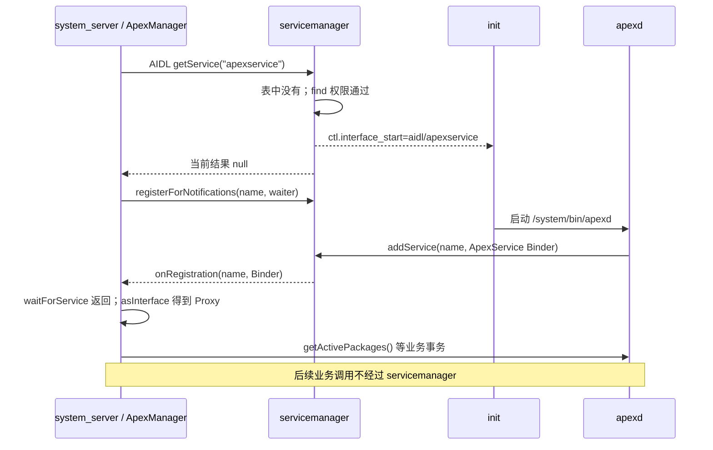

# 93 Android ServiceManager：为什么 `getService()` 找不到，`waitForService()` 却能拉起服务

> 源码基线：Android 11 / API 30 / `android-11.0.0_r48`
> 贯穿场景：`system_server` 获取按需启动的 `apexservice`
> 阅读方式：macOS 上静态阅读本地 AOSP，不要求编译或连接设备

`system_server` 要调用 `apexservice`，但 `apexd.rc` 把对应进程声明成了 `disabled`。如果直接查服务表，结果可能是 `null`；换成 `waitForService("apexservice")`，servicemanager 却会通知 init 启动 `apexd`，等它完成注册后再返回 Binder。

这类问题最容易被一句“ServiceManager 就是服务注册表”糊弄过去：同一个服务名，`checkService()`、Java `getService()`、Native `getService()` 和 `waitForService()` 在 Android 11 并不具有相同的启动、等待语义。

**一句话结论：servicemanager 只负责“名字 → Binder”的发现与生命周期协调；Android 11 只有走到服务端 AIDL `getService` 的路径才会请求启动 lazy service，而真正等待注册发生在客户端 `waitForService` 的通知与重查循环中。**

读完本章，你应该能够：

1. 从 `addService` 追到服务表、死亡监听和注册通知；
2. 准确判断五种查询/等待路径是否触发 lazy start、是否等待、何时返回 `null`；
3. 区分“能找到服务”的 SELinux 权限与“能调用服务”的 Binder 权限；
4. 解释 Java 两类缓存、lazy 退出回调以及 Android 11 的版本边界。

本章只讨论 `/dev/binder` 上 Android 11 的 AIDL servicemanager。APEX 业务逻辑、init 完整状态机、Binder 驱动引用计数实现和新版本 ServiceManager API 不在这里展开。

## 1. 问题：同一个 `apexservice`，为什么查询结果不同

Android 11 的 `ApexManager` 没有用普通 `getService()`，而是明确选择等待：

`frameworks/base/services/core/java/com/android/server/pm/ApexManager.java`

```java
protected IApexService waitForApexService() {
    // Since apexd is a trusted platform component, synchronized calls are allowable
    return IApexService.Stub.asInterface(
            Binder.allowBlocking(ServiceManager.waitForService("apexservice")));
}
```

这段代码解决的不是“把一个名字转换成 Java 对象”这么简单，而是三个现实问题：

- `apexd` 可能尚未运行；
- 启动进程和注册 Binder 之间存在时间差；
- 查询为空后、开始等待前，服务可能恰好完成注册。

`Binder.allowBlocking()` 也不要读反。Java 会先执行 `waitForService()`，拿到 Binder 后才调用 `allowBlocking()` 标记这个代理允许同步调用；它不会让等待变成异步。

把 ServiceManager 想成前台登记簿即可：

```text
apexd：登记“apexservice 对应这个 Binder”
system_server：按名字领取 Binder
领取以后：system_server 直接调用 apexd，不再经过前台
```

这个类比只说明职责。真正需要源码回答的是：谁能登记、查不到是否开店、怎样避免错过开店通知，以及登记簿里的引用何时删除。

## 2. 机制起点：客户端怎样找到“第一个目录服务”

普通服务要先向 servicemanager 注册，但客户端若连 servicemanager 也需要按名字查询，就会形成循环。Binder 用 **context manager / handle 0** 解决启动入口：

```text
固定入口 handle 0
        ↓
IServiceManager Binder
        ↓ 按名字查询
任意已注册服务 Binder
```

Android 11 servicemanager 启动时先选择 Binder 驱动并建立 context manager：

`frameworks/native/cmds/servicemanager/main.cpp`

```cpp
const char* driver = argc == 2 ? argv[1] : "/dev/binder";

sp<ProcessState> ps = ProcessState::initWithDriver(driver);
ps->setThreadPoolMaxThreadCount(0);
ps->setCallRestriction(ProcessState::CallRestriction::FATAL_IF_NOT_ONEWAY);

sp<ServiceManager> manager = new ServiceManager(std::make_unique<Access>());
if (!manager->addService("manager", manager, false /*allowIsolated*/,
        IServiceManager::DUMP_FLAG_PRIORITY_DEFAULT).isOk()) {
    LOG(ERROR) << "Could not self register servicemanager";
}
IPCThreadState::self()->setTheContextObject(manager);
ps->becomeContextManager(nullptr, nullptr);
```

随后，同一个 `main()` 建立 Looper，把 Binder fd 与 lazy-client 检查都接入事件循环：

```cpp
sp<Looper> looper = Looper::prepare(false /*allowNonCallbacks*/);

BinderCallback::setupTo(looper);
ClientCallbackCallback::setupTo(looper, manager);

while(true) {
    looper->pollAll(-1);
}
```

`becomeContextManager()` 把本进程设为当前 Binder context 的管理者；客户端的 `BinderInternal.getContextObject()` 或 Native `ProcessState::getContextObject()` 因而能取得 handle 0 的代理。

名字 `manager` 与 handle 0 是两件事：

- handle 0 是驱动 context 的特殊入口，解决“先找到谁”；
- `manager` 是 servicemanager 给自己添加的一条普通名字记录。

本版 servicemanager 也不是普通多线程业务服务。它把 Binder fd 放进单线程 Looper，调用 `handlePolledCommands()`；另一个 timerfd 每 5 秒检查 lazy 服务的客户端状态。因此它应该只做轻量目录工作，真正的 APEX 操作仍在 `apexd`。

还有一个范围边界：Android 11 同时可见 `/dev/binder` 的 servicemanager、`/dev/vndbinder` 的 vndservicemanager，以及 `/dev/hwbinder` 的 hwservicemanager。三者不是共享一张表；本章的 `apexservice` 位于第一套。

## 3. 注册：`apexd` 怎样把 Binder 放进名字表

### 为什么它能按需启动

`apexd` 的 init 配置明确把服务设为不随 class 自动启动，并声明可由 AIDL 接口名触发：

`system/apex/apexd/apexd.rc`

```rc
service apexd /system/bin/apexd
    interface aidl apexservice
    class core
    user root
    group system
    oneshot
    disabled # does not start with the core class
    reboot_on_failure reboot,apexd-failed
```

`disabled` 不等于永远不能启动，而是不能仅靠 class start 自动启动；`interface aidl apexservice` 给 init 留下了“按接口启动”的匹配项。

进程起来后，`apexd` 使用 `LazyServiceRegistrar` 注册真实 Binder：

`system/apex/apexd/apexservice.cpp`

```cpp
static constexpr const char* kApexServiceName = "apexservice";

void CreateAndRegisterService() {
  sp<ProcessState> ps(ProcessState::self());

  // Create binder service and register with LazyServiceRegistrar
  sp<ApexService> apexService = new ApexService();
  auto lazyRegistrar = LazyServiceRegistrar::getInstance();
  lazyRegistrar.forcePersist(true);
  lazyRegistrar.registerService(apexService, kApexServiceName);
}
```

同一文件稍后用另一个小函数解除“强制常驻”：

```cpp
void AllowServiceShutdown() {
  LazyServiceRegistrar::getInstance().forcePersist(false);
}
```

先 `forcePersist(true)` 是为了避免启动阶段暂时没有客户端就退出；`apexd_main.cpp` 完成启动工作后再允许 lazy 关闭。它不是所有 lazy 服务都必须复制的固定模板，而是 `apexd` 自己的生命周期选择。

### `addService()` 不只是写入 map

servicemanager 的服务表核心是 `mNameToService`。写入前会检查调用身份、SELinux、参数、名字、稳定性和死亡监听。以下两个代码块来自 `addService()` 中前后相邻的检查段，未把不同分支拼成一段：

`frameworks/native/cmds/servicemanager/ServiceManager.cpp`

```cpp
if (multiuser_get_app_id(ctx.uid) >= AID_APP) {
    return Status::fromExceptionCode(Status::EX_SECURITY);
}
if (!mAccess->canAdd(ctx, name)) {
    return Status::fromExceptionCode(Status::EX_SECURITY);
}
if (binder == nullptr) {
    return Status::fromExceptionCode(Status::EX_ILLEGAL_ARGUMENT);
}
```

```cpp
if (!isValidServiceName(name)) {
    LOG(ERROR) << "Invalid service name: " << name;
    return Status::fromExceptionCode(Status::EX_ILLEGAL_ARGUMENT);
}
#ifndef VENDORSERVICEMANAGER
if (!meetsDeclarationRequirements(binder, name)) {
    // already logged
    return Status::fromExceptionCode(Status::EX_ILLEGAL_ARGUMENT);
}
#endif  // !VENDORSERVICEMANAGER
```

检查通过后，它对远端 Binder `linkToDeath()`，再写入服务表并通知已登记的等待者：

```cpp
mNameToService[name] = Service {
    .binder = binder,
    .allowIsolated = allowIsolated,
    .dumpPriority = dumpPriority,
    .debugPid = ctx.debugPid,
};

auto it = mNameToRegistrationCallback.find(name);
if (it != mNameToRegistrationCallback.end()) {
    for (const sp<IServiceCallback>& cb : it->second) {
        mNameToService[name].guaranteeClient = true;
        cb->onRegistration(name, binder);
    }
}
```

这几行分别解决：

| 机制 | 解决的问题 |
|---|---|
| app-id 限制与 SELinux `add` | 防止普通应用冒充全局系统服务 |
| 名字和 Binder 校验 | 防止目录中出现不可用条目 |
| VINTF stability 条件检查 | 要求标成 VINTF-stable 的 Binder 有 manifest 声明 |
| `linkToDeath` | 服务进程死亡后移除目录条目 |
| registration callback | 唤醒正在等这个名字的客户端 |

`apexservice` 是平台内部 AIDL 服务，不是 VINTF-stable AIDL HAL，因此它的 init `interface aidl` 声明不能等同于 VINTF manifest 声明。只有 Binder 的 stability 要求 VINTF 时，`meetsDeclarationRequirements()` 才强制核对 manifest。

## 4. 五种“查询/等待”路径必须按 Android 11 的真实实现区分

先看结论表。这里的“等待”是等待服务**出现**，不包括一次普通 Binder 查询自身的短暂同步耗时。

| 调用路径 | 查不到时是否请求 lazy start | 是否等待服务注册 | 典型结果 |
|---|---:|---:|---|
| Java `ServiceManager.checkService(name)` | 否 | 否 | 一次查询后得到 Binder 或 `null` |
| Java `ServiceManager.getService(name)` | **否（r48 兼容层行为）** | 否 | Binder 或 `null` |
| Native `defaultServiceManager()->getService(name)` | 自身不触发 | 最多轮询约 5 秒 | Binder 或 `null` |
| 服务端 AIDL `IServiceManager.getService(name)` | 是 | 否 | 发启动请求后仍可返回 `null` |
| Java / platform C++ `waitForService(name)` | 是 | 是，无固定超时 | Binder；权限/致命错误时可能 `null` |

### 最容易写错的一行：Java `getService` 实际调用 `checkService`

Java facade 先通过 handle 0 得到 `ServiceManagerProxy`。Android 11 的兼容代理这样实现：

`frameworks/base/core/java/android/os/ServiceManagerNative.java`

```java
public IBinder getService(String name) throws RemoteException {
    // Same as checkService (old versions of servicemanager had both methods).
    return mServiceManager.checkService(name);
}

public IBinder checkService(String name) throws RemoteException {
    return mServiceManager.checkService(name);
}
```

所以在 **Android 11 r48 的 Java `ServiceManager` 路径**中，`getService("apexservice")` 不会因为名字缺失而拉起 `apexd`。这也是为什么真实 `ApexManager` 选择 `waitForService()`。

### 服务端两个同名方法只差一个布尔值

`frameworks/native/cmds/servicemanager/ServiceManager.cpp`

```cpp
Status ServiceManager::getService(const std::string& name, sp<IBinder>* outBinder) {
    *outBinder = tryGetService(name, true);
    // returns ok regardless of result for legacy reasons
    return Status::ok();
}

Status ServiceManager::checkService(const std::string& name, sp<IBinder>* outBinder) {
    *outBinder = tryGetService(name, false);
    // returns ok regardless of result for legacy reasons
    return Status::ok();
}
```

`startIfNotFound=true` 只表示“请求启动”，不表示 servicemanager 会把当前事务挂住等服务注册。它调用启动逻辑后仍返回当前查找结果，此时通常还是 `null`。

### Native 历史 `getService` 是有限轮询，不是 lazy 等待

`ServiceManagerShim::getService()` 先 `checkService()`，找不到才轮询：

`frameworks/native/libs/binder/IServiceManager.cpp`

```cpp
sp<IBinder> svc = checkService(name);
if (svc != nullptr) return svc;

const bool isVendorService =
    strcmp(ProcessState::self()->getDriverName().c_str(), "/dev/vndbinder") == 0;
const long timeout = uptimeMillis() + 5000;
```

中间的源码根据系统是否完成启动选择 100 ms 或 1000 ms 的重试间隔；循环本身始终调用 `checkService()`：

```cpp
while (uptimeMillis() < timeout) {
    usleep(1000*sleepTime);
    sp<IBinder> svc = checkService(name);
    if (svc != nullptr) return svc;
}
ALOGW("Service %s didn't start. Returning NULL", String8(name).string());
return nullptr;
```

循环里仍是 `checkService`，所以它自己不会发 `ctl.interface_start`。若别的路径已经启动服务，它可能在约 5 秒窗口内碰巧等到；否则最后返回 `null`。

这张表是本章最重要的 Android 11 边界。看到其他版本源码或网络文章时，必须重新核对 facade、兼容 shim 和服务端三层，不能只凭方法名推断。

## 5. 等待：notification 怎样补上“先查后订阅”的竞态

如果客户端按下面的朴素逻辑等待，会丢事件：

```text
t0  客户端查询：服务不存在
t1  服务完成注册
t2  客户端才注册通知
```

Android 11 的 Native `waitForService()` 先调用真正的服务端 AIDL `getService`，既查询又触发 lazy start；为空时再注册 callback：

`frameworks/native/libs/binder/IServiceManager.cpp`

```cpp
sp<IBinder> out;
if (!mTheRealServiceManager->getService(name, &out).isOk()) {
    return nullptr;
}
if (out != nullptr) return out;

sp<Waiter> waiter = new Waiter;
if (!mTheRealServiceManager->registerForNotifications(
        name, waiter).isOk()) {
    return nullptr;
}
```

若服务恰好在“首次查询”和“注册 callback”之间出现，服务端注册通知时会检查当前表；已经存在就立即回调：

`frameworks/native/cmds/servicemanager/ServiceManager.cpp`

```cpp
mNameToRegistrationCallback[name].push_back(callback);
if (auto it = mNameToService.find(name);
        it != mNameToService.end()) {
    const sp<IBinder>& binder = it->second.binder;
    CHECK(binder != nullptr);
    callback->onRegistration(name, binder);
}
return Status::ok();
```

因此 t1 的注册不会永久错过。回调把 Binder 保存到 `Waiter`，唤醒条件变量；函数退出前再注销 notification。

等待循环还每秒重新调用一次服务端 `getService`：

```cpp
while (true) {
    {
        std::unique_lock<std::mutex> lock(waiter->mMutex);
        using std::literals::chrono_literals::operator""s;
        waiter->mCv.wait_for(lock, 1s, [&] {
            return waiter->mBinder != nullptr;
        });
        if (waiter->mBinder != nullptr) return waiter->mBinder;
    }
    if (!mTheRealServiceManager->getService(name, &out).isOk()) {
        return nullptr;
    }
    if (out != nullptr) return out;
}
```

这不是普通的“怕 callback 丢了所以轮询”。源码注释给出的特定竞态是：lazy 服务死亡、servicemanager 先处理死亡并请求 init 启动，但 init 尚未处理旧进程死亡，误以为服务仍在运行；下一次 `getService` 会重新发启动请求。

完成点必须说清：

- `checkService/getService` 返回 `null`，只代表这次路径没有交付 Binder；
- 服务端 AIDL `getService` 返回，不代表 lazy 进程已经启动；
- `waitForService` 正常返回，才表示客户端已经拿到一次注册回调或补查得到的 Binder；
- 拿到 Binder 仍不代表第一次业务调用一定成功，服务可能紧接着死亡。

`registerForNotifications` 在 r48 是内部 AIDL 能力。Java `ServiceManagerProxy.registerForNotifications()` 直接抛 `RemoteException`；Java 公共门面没有把它开放成普通注册 API，`ServiceManager.waitForService()` 是经 JNI 复用 Native 实现。不要把新版本 Java API 写回本章。

## 6. lazy service：谁发启动请求，谁决定退出

### 启动端只通知 init，不负责 fork

servicemanager 查无结果且 `startIfNotFound=true` 时执行：

`frameworks/native/cmds/servicemanager/ServiceManager.cpp`

```cpp
void ServiceManager::tryStartService(const std::string& name) {
    ALOGI("Since '%s' could not be found, trying to start it as a lazy AIDL service",
          name.c_str());

    std::thread([=] {
        (void)base::SetProperty("ctl.interface_start", "aidl/" + name);
    }).detach();
}
```

对贯穿场景，属性值是：

```text
ctl.interface_start = aidl/apexservice
```

init 用 `apexd.rc` 的 `interface aidl apexservice` 找到进程配置并启动 `/system/bin/apexd`。servicemanager 不 fork、不执行 APEX 初始化，也不保证一次 miss 只发送一次请求；`waitForService` 的每秒补查可能再次请求，init 的状态机负责处理重复 start。

完整启动时序如下：



图中启动通知与 callback 都是协调动作。真正的 APEX 数据并不由 servicemanager 转发，所以业务调用慢时不要把它误判成“ServiceManager 转发瓶颈”。

### 退出端依靠另一种 callback

platform libbinder 的 C++ `LazyServiceRegistrar.registerService()` 不只调用 `addService`，还登记 `IClientCallback`：

`frameworks/native/libs/binder/LazyServiceRegistrar.cpp`

```cpp
if (!manager->addService(name.c_str(), service,
        allowIsolated, dumpFlags).isOk()) {
    ALOGE("Failed to register service %s", name.c_str());
    return false;
}
if (!reRegister) {
    if (!manager->registerClientCallback(name, service, this).isOk()) {
        ALOGE("Failed to add client callback for service %s", name.c_str());
        return false;
    }
    // Only add this when a service is added for the first time, as it is not removed
    mRegisteredServices[name] = {service, allowIsolated, dumpFlags};
}
```

servicemanager 每 5 秒向驱动查询该 Binder node 的强引用数。它自己持有一个引用，因此常规检查用 `count > 1` 判断是否还有外部客户端；`guaranteeClient` 用来避免“刚把 Binder 交给客户端，客户端又在下次采样前释放”导致从未报告过 `true`。

两类 callback 不要混：

| callback | 谁登记 | 通知什么 | 用途 |
|---|---|---|---|
| `IServiceCallback` | 等服务的客户端 | 某名字注册了 Binder | 唤醒 `waitForService` |
| `IClientCallback` | lazy 服务进程 | 该服务有/无外部 Binder 引用 | 决定是否尝试退出 |

收到“无客户端”不等于进程立刻退出。Registrar 先调用 `tryUnregisterService()`；servicemanager 会复核调用 PID、Binder 身份、`guaranteeClient` 和引用数。复核成功后 Registrar 才退出进程；失败则保守存活，避免在新客户端到来时误退出。

强引用数反映 Binder 引用，不等于业务会话数；5 秒也是 r48 servicemanager timer 的采样周期，不是“释放后恰好 5 秒必退出”的 SLA。

## 7. SELinux：能注册、能发现、能调用是三道不同的门

服务名先通过 `service_contexts` 映射为安全 type：

`system/sepolicy/private/service_contexts`

```text
apexservice    u:object_r:apex_service:s0
```

相关策略把三个动作分开：

```text
add_service(apexd, apex_service)
allow system_server apex_service:service_manager find;
allow system_server apexd:binder call;
```

源码分别位于 `system/sepolicy/public/apexd.te` 与 `system/sepolicy/private/system_server.te`。三行含义是：

| 权限 | 主体 → 目标 | 只证明什么 |
|---|---|---|
| `service_manager add` | `apexd → apex_service` | apexd 可以用该名字注册 |
| `service_manager find` | `system_server → apex_service` | system_server 可以取得 Binder |
| `binder call` | `system_server → apexd` | 可以向真实服务进程发事务 |

`find` 通过不代表业务方法一定成功，后面还可能有 AIDL 参数校验、UID 检查或服务自己的权限逻辑。

`Access.cpp` 的核心不是按字符串硬编码 UID，而是“调用方 SID + 服务名映射出的目标 type + service_manager 权限”：

`frameworks/native/cmds/servicemanager/Access.cpp`

```cpp
Access::CallingContext Access::getCallingContext() {
    IPCThreadState* ipc = IPCThreadState::self();

    const char* callingSid = ipc->getCallingSid();
    pid_t callingPid = ipc->getCallingPid();

    return CallingContext {
        .debugPid = callingPid,
        .uid = ipc->getCallingUid(),
        .sid = callingSid ? std::string(callingSid) : getPidcon(callingPid),
    };
}
```

```cpp
bool Access::actionAllowedFromLookup(const CallingContext& sctx,
        const std::string& name, const char *perm) {
    char *tctx = nullptr;
    if (selabel_lookup(getSehandle(), &tctx, name.c_str(),
            SELABEL_CTX_ANDROID_SERVICE) != 0) {
        return false;
    }
    bool allowed = actionAllowed(sctx, tctx, perm, name);
    freecon(tctx);
    return allowed;
}
```

这里还有一个容易遗漏的默认规则：r48 的 `service_contexts` 最后一项把未显式命中的名字映射为 `default_android_service`，而 `domain.te` 用 `neverallow` 禁止对该 type 的 service-manager 操作。因此新服务仍须添加专用映射；`selabel_lookup` 的失败分支不是设备上“未知名字”最常见的结果。

对 `getService/checkService`，r48 的 `tryGetService()` 在 `canFind` 失败时返回空 Binder，而外层仍因兼容原因返回 OK status；调用者常只看到 `null`，真实原因要看 servicemanager 日志和 SELinux AVC。注册 notification 则会返回 security status，`waitForService` 因此返回 `null`。

`allowIsolated=true` 也只跳过“isolated UID 不得领取该服务”的额外门槛，不会绕过 SELinux `find`，更不会自动获得 `binder call` 或业务权限。

## 8. 缓存与死亡：目录中的 Binder 不是永久对象

Android 11 Java 层有两个常被混为一谈的缓存：

| 成员 | 缓存什么 | 怎样填充 |
|---|---|---|
| `sServiceManager` | handle 0 对应的目录服务代理 | 第一次 `getIServiceManager()` |
| `sCache` | 少量进程启动时注入的 well-known Binder | `ActivityThread` bind application 时调用 `initServiceCache()` |

`getService()` 先查 `sCache`，但普通查询成功后不会自动写回：

`frameworks/base/core/java/android/os/ServiceManager.java`

```java
IBinder service = sCache.get(name);
if (service != null) {
    return service;
} else {
    return Binder.allowBlocking(rawGetService(name));
}
```

```java
public static void initServiceCache(Map<String, IBinder> cache) {
    if (sCache.size() != 0) {
        throw new IllegalStateException("setServiceCache may only be called once");
    }
    sCache.putAll(cache);
}
```

因此“查过一次就永远从 ServiceManager 缓存取”在 r48 是错的。`waitForService()` 的 JNI/Native 路径也不靠 Java `sCache`；它缓存的是 `defaultServiceManager()` 目录代理，不是所有业务服务。

服务注册后，servicemanager 对远程 Binder 设置 death recipient。服务进程死亡时，`binderDied()` 删除对应目录项；但已经发给客户端的旧 `IBinder` 变量不会被改成 `null`。下一次业务调用可能得到 `DeadObjectException`，客户端需要：

```text
发现死亡 → 丢弃旧 Proxy/会话 → 重新 wait/query
         → 重新注册业务 callback → 恢复状态
```

registration callback 只报告“发生注册”，不是服务死亡回调。需要感知已拿到的服务死亡，客户端仍要对业务 Binder 使用 `linkToDeath` 或由上层设计重连。

同名服务重新注册也不会把旧 handle 自动改指向新 Binder node。目录表可被新条目覆盖，但旧客户端必须重新查询；迟到的旧 Binder 死亡通知也不会删掉新条目，因为 `binderDied()` 会比较 Binder 身份。

## 9. 排障：从 `null` 到根因，按完成点逐层判断

继续使用 `apexservice`，一次拿不到服务可拆成下面几层：

| 完成点 | 失败现象 | 应查证据 |
|---|---|---|
| 找到 servicemanager | handle 0/IPC 异常 | servicemanager 是否运行、Binder context 是否选对 |
| 名字可发现 | 查询返回 `null` | `service_contexts`、调用 domain、`find` AVC |
| init 接受 lazy start | 持续等待 | `apexd.rc` 的 `interface aidl apexservice` 与 init 日志 |
| 进程存活 | 反复启动/死亡 | apexd crash、oneshot 状态、启动依赖 |
| `addService` 成功 | 进程在但目录无条目 | app-id、`add` 权限、名字、Binder、stability 检查 |
| notification 到达 | 已注册仍等待 | callback 是否存活、Binder 线程池、每秒补查日志 |
| 业务 Binder 可调用 | 拿到后仍异常 | `binder call`、服务权限、Binder death、AIDL 协议 |

三个典型翻车点：

1. **把 `getService` 当等待。** Java r48 路径实际委托 `checkService`；Native 历史路径也只有约 5 秒有限轮询。
2. **在不能长期阻塞的线程调用 `waitForService`。** 对有合法标签但没有匹配 init 服务、或服务持续注册失败的名字，它没有固定超时。
3. **只看进程，不看注册。** `apexd` 已启动不代表 `addService` 已通过；registered 才代表目录中已有 Binder。

还要明确两项 Android 11 边界：

- `isDeclared(name)` 查询的是 VINTF manifest 中的 stable AIDL 实例，不是 init rc 的 `interface aidl`。因此不能用 `waitForDeclaredService("apexservice")` 代替这里的等待。这里的 lazy registrar 是 platform C++ libbinder 能力；r48 的 NDK `AServiceManager` 尚未暴露 wait、isDeclared、lazy 注册或 notification。
- 本地 platform checkout 能确认 libbinder、servicemanager、init 配置和 sepolicy；具体设备可能有厂商策略、不同 kernel tag 与服务配置。Binder 驱动内部的引用统计细节应以目标设备内核为准。

## 10. macOS 上怎样静态验证整条链

在源码根目录执行这组只读命令：

```bash
cd /Users/ninebot/androidSource
rg -n "waitForApexService|waitForService\\(\\"apexservice\\"" \
  frameworks/base/services/core/java/com/android/server/pm/ApexManager.java
rg -n "waitForService" frameworks/base/core/jni/android_os_ServiceManager.cpp
sed -n '45,80p' frameworks/base/core/java/android/os/ServiceManagerNative.java
sed -n '115,165p' frameworks/native/cmds/servicemanager/ServiceManager.cpp
rg -n "ctl.interface_start|tryStartService" frameworks/native/cmds/servicemanager/ServiceManager.cpp
rg -n "interface aidl apexservice|disabled|oneshot" system/apex/apexd/apexd.rc
rg -n "CreateAndRegisterService|registerService|forcePersist" system/apex/apexd
rg -n "registerForNotifications|onRegistration|wait_for" \
  frameworks/native/libs/binder/IServiceManager.cpp \
  frameworks/native/cmds/servicemanager/ServiceManager.cpp
rg -n "apexservice|apex_service" system/sepolicy/private/service_contexts \
  system/sepolicy/public/apexd.te \
  system/sepolicy/private/system_server.te
rg -n "registerClientCallback|guaranteeClient|count > 1" \
  frameworks/native/cmds/servicemanager/ServiceManager.cpp \
  frameworks/native/libs/binder/LazyServiceRegistrar.cpp
```

验证时只抓四个结论：Java `get` 落到 `check`；wait 经 JNI 进入 platform C++；lazy start 只是写 init 控制属性；注册通知、客户端通知和 SELinux add/find/call 各有独立源码。

macOS 静态阅读能证明代码分支和默认配置，不能证明某台设备何时启动、实际等待多久、AVC 是否发生或厂商是否修改策略。要回答这些运行时问题，仍需目标设备的 init/servicemanager 日志、`service list/check`、`dumpsys` 与 SELinux audit。

## 11. 检查题、答案与可立即执行的结论

先用八个问题检查自己是否真正读懂：

1. **为什么不用名字查询 servicemanager？** handle 0 是 context manager 的特殊入口；`manager` 只是普通名字记录。
2. **Java `getService("apexservice")` 会拉起 `apexd` 吗？** r48 不会，它经兼容代理调用 `checkService()`；拉起并等待应使用 `waitForService()`。
3. **服务端 AIDL `getService()` 为何仍可返回 `null`？** 它只异步写 `ctl.interface_start`，不等待 init、进程初始化与 `addService`。
4. **wait 怎样避免丢通知？** 注册 callback 后服务端重查表，已有服务就立即 `onRegistration()`；等待端还每秒补查。
5. **有 `find` 为何仍可能调用失败？** 实际事务还需 `binder call`，并受服务内权限、UID 与参数校验约束。
6. **`sCache` 会缓存每次成功查询吗？** 不会，它只在进程绑定时一次性注入少量 well-known Binder。
7. **没有客户端为何不等于马上退出？** 强引用不是业务会话；Registrar 还要通过 `tryUnregisterService` 的竞态复核。
8. **`isDeclared("apexservice")` 能证明 init 声明吗？** 不能；VINTF stable AIDL 声明与 rc 的 `interface aidl` 是两套机制。

实战排查“服务拿不到”时，至少记录：

```text
[ ] 服务名、instance、Binder context 与实际 API 路径
[ ] lazy start 需求、rc 接口名，以及 addService 是否成功
[ ] SELinux type 与 add/find/call 三项权限
[ ] 缓存、等待完成点、线程与超时策略
[ ] 死亡后是否丢弃旧 Proxy 并重建 callback/session
```

回到开头：`ApexManager` 选择 `waitForService("apexservice")`，不是因为它比 `getService` “更保险”，而是因为协议需求不同——该调用必须负责请求启动、跨过注册时间窗并只在拿到 Binder 后继续。随后 `IApexService` 的业务事务由 Binder 驱动直接送到 `apexd`，servicemanager 的任务已经结束。
