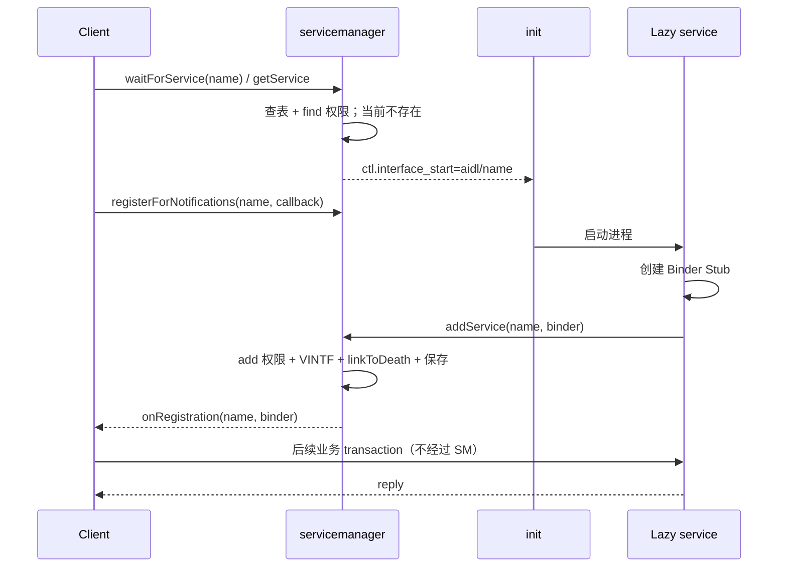

# 93 Android ServiceManager：服务注册、查询、通知、SELinux 与 lazy service

> 源码版本：Android 11（`android-11.0.0_r48`）  
> 阅读环境：macOS 只读本地源码，不要求编译或连接设备。  
> 本章目标：理解 ServiceManager 是“Binder 服务目录”，能从 handle 0 追到服务注册与查询，能解释缓存、权限、死亡清理、通知和 lazy service 的真实边界。  
> 阅读方式：先建立全景图，再顺着 `main → addService → get/check/wait → callback → SELinux → lazy` 阅读。

---

## 1. 先用一句话认识 ServiceManager

ServiceManager 是 Binder 世界的**服务名称注册表**：服务端把“名字 + Binder 对象”登记进去，客户端用名字换回 Binder 引用。

可以把它想成前台通讯录：

- 服务端说：“请登记，`activity` 对应这个 Binder 对象。”
- 客户端问：“`activity` 的 Binder 在哪里？”
- ServiceManager 返回 Binder 引用。
- 之后客户端调用 ActivityManager 的业务方法，**不会再经过 ServiceManager**。

```text
注册阶段：服务进程 ── addService("demo", binder) ──> servicemanager

查询阶段：客户进程 ── getService("demo") ─────────> servicemanager
                                              返回 Binder 引用

业务阶段：客户进程 ═════ transact ════════════════> 服务进程
                     （不经过 servicemanager）
```

这是本章最重要的边界：ServiceManager 负责“发现”，Binder 驱动负责后续“通信”。

---

## 2. 为什么 Binder 必须有一个“第一个服务”

普通服务可以向 ServiceManager 注册，但客户端要先拿到 ServiceManager 才能查询。这里存在“先有鸡还是先有蛋”的问题。

Binder 用一个特殊约定解决它：**handle 0 是 context manager**。

客户端调用：

```java
BinderInternal.getContextObject()
```

native 层最终取得 handle 0 的代理。handle 0 不需要先按名称查询，因此它成为进入整个 Binder 服务目录的固定入口。

注意三个概念：

| 概念 | 含义 |
|---|---|
| context manager | Binder 驱动为当前 Binder context 指定的管理者 |
| handle 0 | 客户端访问 context manager 的特殊句柄 |
| `manager` 服务名 | servicemanager 又把自己登记为普通名称；它不是 handle 0 机制本身 |

不要把 `handle 0` 理解成内核里固定地址为 0 的 Java 对象。它是 Binder 引用命名空间中的特殊入口。

---

## 3. Android 不只有一个服务管理器

Android 11 中常见三套 Binder context：

| 管理进程 | 驱动 | 主要接口世界 | 常见用途 |
|---|---|---|---|
| `servicemanager` | `/dev/binder` | Framework Binder、stable AIDL | system/system_ext 与 AIDL HAL |
| `vndservicemanager` | `/dev/vndbinder` | vendor Binder | 旧式 vendor Binder 隔离场景 |
| `hwservicemanager` | `/dev/hwbinder` | HIDL/HwBinder | HIDL HAL |

它们不是一个全局表的三个名字。每个 Binder 驱动 context 都有自己的 handle、节点和 context manager。

本章正文主要研究：

```text
frameworks/native/cmds/servicemanager/
```

也就是 `/dev/binder` 上的新 AIDL servicemanager。

---

## 4. 本章源码地图

建议依次打开：

```text
frameworks/native/cmds/servicemanager/main.cpp
frameworks/native/cmds/servicemanager/ServiceManager.h
frameworks/native/cmds/servicemanager/ServiceManager.cpp
frameworks/native/cmds/servicemanager/Access.cpp
frameworks/native/libs/binder/IServiceManager.cpp
frameworks/native/libs/binder/aidl/android/os/IServiceManager.aidl
frameworks/base/core/java/android/os/ServiceManager.java
frameworks/base/core/java/android/os/ServiceManagerNative.java
frameworks/native/cmds/servicemanager/servicemanager.rc
system/sepolicy/private/service_contexts
```

把它们分成四层更容易读：

```text
Java 门面       ServiceManager.java
                     │
libbinder 兼容层  IServiceManager.cpp / ServiceManagerShim
                     │
服务端实现       cmds/servicemanager/ServiceManager.cpp
                     │
安全裁决         Access.cpp + service_contexts + sepolicy
```

---

## 5. servicemanager 如何启动

`servicemanager.rc` 由 init 解析并启动 servicemanager。进入 `main.cpp` 后，关键步骤可以压缩成：

```cpp
const char* driver = argc > 1 ? argv[1] : "/dev/binder";
sp<ProcessState> ps = ProcessState::initWithDriver(driver);
ps->setThreadPoolMaxThreadCount(0);
ps->setCallRestriction(ProcessState::CallRestriction::FATAL_IF_NOT_ONEWAY);

sp<ServiceManager> manager = new ServiceManager(std::make_unique<Access>());
manager->addService("manager", manager, false,
        IServiceManager::DUMP_FLAG_PRIORITY_DEFAULT);
IPCThreadState::self()->setTheContextObject(manager);
ps->becomeContextManager();
```

逐句解释：

1. 选择 `/dev/binder`，进入 Framework Binder context。
2. 最大 Binder 线程数设为 0，不采用普通 Binder 线程池处理模式。
3. 限制 servicemanager 发出的同步调用，降低互相等待和死锁风险。
4. 创建真正保存服务表的 `ServiceManager` 对象。
5. 用名字 `manager` 登记自己。
6. 设置本进程 context object。
7. 通过 Binder 驱动把本进程声明为 context manager。

第 5 步和第 7 步目的不同：第 7 步解决 handle 0 的启动入口；第 5 步只是普通名字注册。

---

## 6. 它为什么没有普通 Binder 线程池

主函数把 Binder fd 加入 Looper：

```cpp
BinderCallback::setupTo(looper);
ClientCallbackCallback::setupTo(looper, manager);

while (true) {
    looper->pollAll(-1);
}
```

Binder fd 可读后，callback 调用：

```cpp
IPCThreadState::self()->handlePolledCommands();
```

因此 Android 11 servicemanager 的主要模型是：

```text
单线程 Looper
 ├─ Binder fd：处理注册、查询、通知等事务
 └─ timerfd：每 5 秒检查 lazy service 是否仍有客户端
```

这也解释了为什么 servicemanager 的实现应保持很轻：它是系统关键目录，不适合执行耗时业务。

---

## 7. 服务表的核心数据结构

最核心的成员是：

```cpp
std::map<std::string, Service> mNameToService;
```

可将 `Service` 简化理解为：

```text
Service
 ├─ binder          真正的服务 Binder 对象
 ├─ allowIsolated   是否允许 isolated UID 查询
 ├─ dumpPriority    dumpsys/listServices 的优先级筛选
 ├─ debugPid        注册服务的进程 PID
 ├─ guaranteeClient 防止漏报短命客户端的临时标记
 └─ hasClients      上次观察到的客户端状态
```

此外还有两类 callback 表：

```text
mNameToRegistrationCallback  等某个名字注册成功
mNameToClientCallback        告诉 lazy 服务“有/无客户端”
```

它们名称相近，但用途完全不同，后面单独对比。

---

## 8. `IServiceManager.aidl` 定义了什么

Android 11 的 servicemanager 本身已经使用 AIDL 接口，主要能力包括：

```text
getService(name)
checkService(name)
addService(name, binder, allowIsolated, dumpPriority)
listServices(dumpPriority)
registerForNotifications(name, callback)
unregisterForNotifications(name, callback)
isDeclared(name)
getDeclaredInstances(interface)
registerClientCallback(name, service, callback)
tryUnregisterService(name, service)
```

可按职责分组：

- 查目录：`get/check/list/isDeclared`
- 改目录：`addService`
- 等注册：registration notification
- 管理 lazy 生命周期：client callback、try unregister

---

## 9. Java 客户端怎样拿到 IServiceManager

`ServiceManager.java` 中：

```java
private static IServiceManager getIServiceManager() {
    if (sServiceManager != null) {
        return sServiceManager;
    }
    sServiceManager = ServiceManagerNative.asInterface(
            Binder.allowBlocking(BinderInternal.getContextObject()));
    return sServiceManager;
}
```

链路是：

```text
BinderInternal.getContextObject()
  → native 获取 handle 0
  → 得到 IBinder 代理
  → ServiceManagerNative.asInterface()
  → 得到 IServiceManager 接口
```

`sServiceManager` 缓存的是“ServiceManager 自己的接口代理”，不是所有业务服务。

---

## 10. Java `sCache` 到底是什么缓存

`getService()` 先查：

```java
IBinder service = sCache.get(name);
if (service != null) {
    return service;
}
return Binder.allowBlocking(rawGetService(name));
```

容易产生误解：“每次查询成功后都会自动放入 `sCache`。”源码并没有这样做。

`sCache` 是进程启动时一次性注入的 **well-known services 快照**：

```java
public static void initServiceCache(Map<String, IBinder> cache) {
    if (sCache.size() != 0) {
        throw new IllegalStateException("setServiceCache may only be called once");
    }
    sCache.putAll(cache);
}
```

结论：

- `sServiceManager`：缓存目录服务代理。
- `sCache`：少量已知服务引用，由进程初始化路径一次填入。
- 普通 `getService()` 成功：Android 11 此处不会自动写入 `sCache`。
- 因此不能笼统地讨论“所有服务缓存如何自动失效”。

Binder 死亡仍应由具体客户端通过 `linkToDeath`、重查或上层重连策略处理。

---

## 11. 三种查询 API 不要混在一起

| API/路径 | 找不到时 | 是否触发 lazy start | 等待行为 |
|---|---|---|---|
| `checkService` | 返回 null | 否 | 不主动等待 |
| Java `ServiceManager.getService` → 新 AIDL 服务端 | 返回 null | 是 | 服务端发启动请求后即可返回 |
| native `defaultServiceManager()->getService` → 历史 shim | 最终返回 null | **仅自身不会触发** | 用 `checkService` 最多轮询约 5 秒 |
| `waitForService` | 致命错误/权限问题才返回 null | 是 | 注册通知并持续等待 |

这里必须区分两层实现。

### 11.1 服务端 AIDL `getService`

服务端执行：

```cpp
return tryGetService(name, true);
```

`true` 表示找不到时请求启动 lazy service，但当前 Binder 事务本身不在 servicemanager 服务端无限等待。

### 11.2 libbinder 的历史兼容 shim

Android 11 `ServiceManagerShim::getService()` 先 `checkService()`，然后最多轮询约 5 秒：

```cpp
while (uptimeMillis() < timeout) {
    usleep(1000 * sleepTime);
    sp<IBinder> svc = checkService(name);
    if (svc != nullptr) return svc;
}
return nullptr;
```

这段 shim 在循环中仍调用 `checkService()`，所以**它自身不会请求 lazy start**。如果另一个调用者已经触发启动，它可以在 5 秒窗口内等到结果。

所以说“getService 都会触发 lazy”“getService 完全不等待”或“getService 会永远等到服务出现”都不准确。必须注明是 Java 新 AIDL 路径、native 历史 shim，还是服务端实现。这是 Android 11 迁移期尤其容易踩的同名 API 陷阱。

### 11.3 `waitForService`

它先调用服务端 `getService` 触发 lazy start；若仍为空，就注册 notification，并等待条件变量。每隔一秒还会再次调用 `getService`，修补 init 与服务死亡之间的竞态。

---

## 12. 完整查询链路

以 Java `ServiceManager.getService("demo")` 为例：

```text
Java ServiceManager.getService
 ├─ 命中 sCache → 直接返回
 └─ 未命中
      ↓
 rawGetService
      ↓ Binder transaction
 native servicemanager::getService
      ↓
 tryGetService(name, startIfNotFound=true)
      ├─ 查 mNameToService
      ├─ 检查 isolated UID
      ├─ SELinux canFind
      ├─ 找不到：ctl.interface_start = aidl/name
      └─ 找到：返回 Binder 引用
```

拿到引用后：

```java
IDemoService demo = IDemoService.Stub.asInterface(binder);
demo.doWork();
```

`doWork()` 事务的目标是 demo 服务 Binder 节点，不是 servicemanager。

---

## 13. `tryGetService()` 的检查顺序

逻辑可简化为：

```cpp
auto ctx = mAccess->getCallingContext();
auto it = mNameToService.find(name);

if (it != end && !it->second.allowIsolated && isIsolated(ctx.uid)) {
    return nullptr;
}
if (!mAccess->canFind(ctx, name)) {
    return nullptr;
}
if (it == end) {
    if (startIfNotFound) tryStartService(name);
    return nullptr;
}
it->second.guaranteeClient = true;
return it->second.binder;
```

顺序背后的含义：

1. 找到候选条目。
2. 根据注册时的 `allowIsolated` 阻止 isolated UID。
3. 通过 SELinux `find` 权限裁决调用者能否发现该名字。要注意 r48 的
   `tryGetService()` 在拒绝时直接返回 `nullptr`，外层 `getService/checkService` 仍为兼容性
   返回 OK status；调用者通常只看到“没拿到 Binder”，而拒绝原因要从 AVC/servicemanager
   日志确认，并不会收到这里虚构出的 `SecurityException`。
4. 不存在且允许启动时，通知 init 启动 lazy service。
5. 存在时标记“马上可能出现客户端”，避免 lazy 服务过早退出。

`allowIsolated=true` 只放开 isolated UID 这一道门，不会绕过 SELinux，也不会授予业务接口权限。

---

## 14. 服务端如何注册服务

Java 常见入口：

```java
ServiceManager.addService(name, binder, allowIsolated, dumpPriority);
```

SystemServer 中常见封装则是：

```java
publishBinderService(name, service);
```

最终都是跨 Binder 调用 servicemanager 的 `addService()`。

完整思路：

```text
服务创建 Stub/Binder 对象
  → addService(name, binder)
  → servicemanager 获取调用者 SID/PID/UID
  → 校验调用身份与名字
  → SELinux canAdd
  → 对远程 Binder linkToDeath
  → 写入 mNameToService[name]
  → 通知等待此名字的 registration callbacks
```

---

## 15. `addService()` 具体检查什么

Android 11 源码包含这些关键检查：

### 15.1 普通应用 UID 不能注册

若调用者 `appid >= AID_APP`，直接拒绝。ServiceManager 不是让任意三方应用发布全局系统服务的公共注册中心。

### 15.2 SELinux `add`

调用者必须对该服务名映射出的 service type 拥有：

```text
class service_manager permission add
```

### 15.3 Binder 不能为空

空 Binder 没有可供客户端调用的对象。

### 15.4 名字格式

长度必须为 1～127；允许字母、数字以及 `_ - . /`。AIDL HAL 常用斜线表达：

```text
android.hardware.foo.IFoo/default
```

### 15.5 stable AIDL 的 VINTF 声明

如果 Binder 标记为 VINTF stability，实例必须在 device/framework VINTF manifest 中声明，否则拒绝注册。

### 15.6 死亡监听

若注册的是远程 Binder，servicemanager 对它 `linkToDeath`。服务进程死亡后目录条目才能被清理。

### 15.7 同名覆盖

源码会用新 `Service` 直接覆盖 map 中同名旧条目；这个 r48 实现本身在该分支没有额外
“同名覆盖”警告日志。不要把静默覆盖理解成推荐的热替换协议；客户端已持有的旧 Binder
引用不会自动变成新对象，而且旧 Binder 的 death notification 后续也可能与新条目产生
难懂时序，服务设计应避免把同名覆盖当升级机制。

---

## 16. 服务名为什么也受 SELinux 管理

`service_contexts` 把服务名字映射成安全 type，例如概念上：

```text
activity         u:object_r:activity_service:s0
package          u:object_r:package_service:s0
demo             u:object_r:demo_service:s0
```

这不是给某个文件贴标签，而是给“ServiceManager 名字”建立 SELinux 安全上下文。

`Access.cpp` 大致做三件事：

1. 从 Binder 调用取得 calling SID、PID、UID。
2. 用 `selabel_lookup(..., SELABEL_CTX_ANDROID_SERVICE)` 查服务名的目标上下文。
3. 检查 `service_manager` class 的 `add/find/list` 权限。

如果名字没有匹配到 `service_contexts`，访问会被拒绝，而不是自动当成安全的默认服务。

---

## 17. `add`、`find`、`list` 是三种独立能力

| 权限 | 谁常需要 | 含义 |
|---|---|---|
| `add` | 服务端 domain | 能以此名字注册服务 |
| `find` | 客户端 domain | 能按名字取得 Binder |
| `list` | 调试/系统组件 | 能枚举可见服务 |

策略宏常把常见组合包装起来，但思考时应拆开。

例如，允许 `demo_client` 发现 `demo_service`，并不代表它能冒充服务端注册同名对象。

更重要的是：

```text
service_manager find 权限 ≠ Binder call 权限
```

前者让客户端拿到目录中的引用；后者决定客户端能否向真正的服务 Binder 发事务。Framework 权限、AppOps 和服务内部 UID 检查还可能继续裁决。

---

## 18. 为什么 SELinux 要知道 calling SID

UID 只能说明 Linux 身份，不能完整表达 Android SELinux domain。两个进程可能有不同 domain，却不能仅靠一条粗糙的 UID 判断表达策略。

Binder 驱动把调用者安全上下文传给服务端，servicemanager 使用 calling SID 判断：

```text
源 domain ── find/add/list ──> 目标 service type
```

排查拒绝时要同时确认：

- 调用方实际 domain 是什么；
- 服务名实际映射到哪个 type；
- 被拒绝的是 `find`、`add`、`list` 还是后续 `binder call`。

---

## 19. 服务死亡后发生什么

服务注册时，servicemanager 对远程 Binder 设置死亡通知。`binderDied()` 会清除：

- 指向死亡 Binder 的服务表项；
- 已死亡的 registration callback；
- 已死亡的 client callback。

但需要分清两个事实：

1. servicemanager 清理的是自己的目录状态。
2. 客户端手里早已拿到的 Binder 代理不会被“清空变量”；它会在调用时看到 `DeadObjectException`，或收到自己注册的 death recipient。

因此健壮客户端通常需要：

```text
收到死亡 → 清理本地状态 → 重新查询/等待 → 重建 callback/session
```

---

## 20. 注册通知 `registerForNotifications`

某个客户端希望等待名字 `demo` 出现，可以注册 `IServiceCallback`。

服务端流程：

1. 检查调用者对该名字的 `find` 权限。
2. 校验名字和 callback 非空。
3. 对 callback 设置死亡通知。
4. 保存到 `mNameToRegistrationCallback[name]`。
5. 如果服务已经存在，立刻调用一次 `onRegistration(name, binder)`。

第 5 点很重要，它缩小“先查询为空、注册 callback 前服务恰好出现”的竞态窗口。

`waitForService()` 仍会在注册后循环补查，因为 lazy service 与 init 死亡处理还存在更复杂时序。

---

## 21. registration callback 与 client callback 的区别

| 对比 | registration callback | client callback |
|---|---|---|
| 接口 | `IServiceCallback` | `IClientCallback` |
| 注册者 | 等待服务的客户端 | lazy 服务端自己 |
| 事件 | 某名字已注册 | 此服务当前有/无外部客户端 |
| 用途 | 唤醒 `waitForService` 等等待者 | 决定 lazy 服务能否退出 |
| 触发方式 | `addService` 时立即通知 | 强引用计数变化的周期检查 |

一句话记忆：

```text
registration callback：客户等“店开门”
client callback：店家看“还有没有顾客”
```

---

## 22. lazy AIDL service 如何被启动

`tryGetService()` 找不到服务且 `startIfNotFound=true` 时执行：

```cpp
SetProperty("ctl.interface_start", "aidl/" + name);
```

注意它是异步线程执行属性设置，避免 servicemanager 自己阻塞。

init 根据 `.rc` 中的 interface 声明寻找对应服务，概念示例：

```rc
service vendor.demo /vendor/bin/demo_service
    class hal
    interface aidl vendor.demo.IDemo/default
    disabled
    oneshot
```

触发值应理解为：

```text
ctl.interface_start = aidl/vendor.demo.IDemo/default
```

完整时序：

```text
客户端 get/wait
  → servicemanager 查无此名
  → 写 ctl.interface_start
  → init 匹配 interface 并启动进程
  → 服务进程 addService
  → servicemanager 保存条目并通知等待者
  → 客户端拿到 Binder
```

ServiceManager 本身不 fork 服务进程，也不解析完整 init service 生命周期；它只是向 init 发接口启动请求。

---

## 23. lazy AIDL 与 lazy HIDL 不要混写

两者理念相似，但服务目录与接口前缀不同：

| 类型 | 服务管理器 | Binder 驱动 | init interface 启动值 |
|---|---|---|---|
| lazy AIDL | servicemanager | `/dev/binder` | `aidl/<descriptor>/<instance>` |
| lazy HIDL | hwservicemanager | `/dev/hwbinder` | `<fqname>/<instance>`，不是 `aidl/` 前缀 |

例如 AIDL 名字可能是：

```text
android.hardware.foo.IFoo/default
```

而 HIDL 名字表达类似：

```text
android.hardware.foo@1.0::IFoo/default
```

不能因为它们都叫 lazy service 就把注册 API、manifest 格式或 Binder 驱动混为一谈。

---

## 24. lazy 服务如何知道“没有客户端了”

lazy 服务端调用 `registerClientCallback()` 登记 `IClientCallback`。servicemanager 会严格校验：

- 调用者拥有该名字的 `add` 权限；
- 服务已经注册；
- 调用 PID 与注册服务时记录的 `debugPid` 相同；
- 传来的 Binder 与表中对象完全一致。

这保证普通客户端不能替服务端操纵退出协议。

servicemanager 每 5 秒通过 Binder 驱动查询节点强引用数：

```cpp
bool hasClients = count > 1; // servicemanager 自己持有一个强引用
```

然后向服务端回调：

```text
onClients(service, true)   有客户端
onClients(service, false)  已无客户端
```

这是一种基于驱动引用计数的近似生命周期信号，不是业务会话数，也不是“有几个 App 正在使用”的精准统计。

---

## 25. `guaranteeClient` 为什么存在

假设客户端刚取得 Binder 就很快释放：

```text
t0  ServiceManager 返回 Binder
t1  客户端短暂使用并释放
t2  5 秒周期检查到来
```

仅在 t2 看强引用，可能从未观察到“有客户端”。于是 `tryGetService()` 成功返回时先设置：

```cpp
service.guaranteeClient = true;
```

周期处理若发现此前没有记录客户端，会先补发 `hasClients=true`，再在后续周期报告 false。

它保证的是生命周期通知不轻易漏掉一次客户端出现，并不意味着 Binder 引用永久保活，也不保证客户端完成了业务调用。

---

## 26. lazy 服务怎样注销自己

`tryUnregisterService(name, binder)` 不是任何进程都能调用。它检查：

1. Binder 非空。
2. 调用者有 `add` 权限。
3. 名字确实存在。
4. 调用 PID 就是登记的服务进程 PID。
5. Binder 与登记对象完全相同。
6. 没有 `guaranteeClient` 表示即将到来的客户端。
7. 驱动引用计数显示没有其他客户端。

事务执行期间，Binder 驱动和 servicemanager 自己都会持有引用，所以源码用 `clients > 2` 判断仍有其他持有者。若驱动不支持统计或发生错误，也保守地认为“还有客户端”，拒绝注销。

这体现了一个安全原则：宁愿服务暂时不退出，也不要在客户端将要使用时误注销。

---

## 27. `isDeclared()` 与“正在运行”不同

`isDeclared(name)` 查询 VINTF manifest 中是否声明了 stable AIDL 实例。它不等于：

- 服务进程当前正在运行；
- 服务已经 `addService`；
- 当前调用者一定有权限访问；
- 该服务绝不会启动失败。

可用四个状态区分：

```text
declared  配置上承诺存在
started   进程已被 init 启动
registered 已进入 ServiceManager 表
reachable 调用者通过权限检查并拿到可用 Binder
```

`waitForDeclaredService()` 只是先用 declared 过滤，再调用 `waitForService()`。

---

## 28. `listServices()` 与 dumpsys 优先级

注册时的 `dumpPriority` 是位掩码，用于筛选服务列表，例如 critical/high/normal/default 等优先级。

`listServices(priority)` 会：

1. 检查调用者的 `service_manager list` 权限；
2. 遍历服务表；
3. 仅返回 dump priority 匹配的名字。

它不表示服务运行线程优先级，也不改变 Binder 调度优先级。这里的 priority 主要服务于 `dumpsys` 信息采集策略。

---

## 29. `service list`、`service check` 与 `dumpsys`

即使不编译源码，在已有设备或模拟器上也可帮助建立直觉：

```bash
adb shell service list
adb shell service check activity
adb shell dumpsys -l
adb shell dumpsys activity
```

概念区别：

- `service list/check` 主要观察 Binder 服务目录。
- `dumpsys -l` 获取可 dump 服务列表。
- `dumpsys activity` 拿到 Binder 后调用该服务的 dump 接口。

命令失败时不要立刻认定“服务不存在”；还可能是 shell domain 没有 find/list/call 权限，或设备版本实现不同。

---

## 30. 一次完整启动竞态示例

假设 lazy 服务尚未运行，A、B 两个客户端同时等待：

```text
A: waitForService → getService → 未找到 → 请求 init 启动
B: waitForService → getService → 未找到 → 再次请求 init 启动
A/B: 注册 registration callback
init: 启动服务（重复 start 请求不会产生两份正常实例）
server: addService
SM: 写入表并通知 A、B
A/B: 条件变量唤醒，取得同一 Binder 服务节点的引用
```

因此 `ctl.interface_start` 请求可能重复，系统正确性不能建立在“只发一次启动请求”的假设上。init 的服务状态管理负责消化重复请求。

---

## 31. ServiceManager 是否会转发业务调用

不会。第一次查询返回 Binder 引用时，Binder 驱动为客户端建立 `binder_ref`/handle，目标仍是服务端的 Binder node。

```text
             只参与名字查询
Client ───────────────> ServiceManager
   │                         │
   │ 返回服务 Binder handle  │
   <─────────────────────────┘
   │
   │ 后续 transaction
   └───────────────────────> Real Service
```

这带来两个实际结论：

- servicemanager 不会成为所有 Binder 业务流量的数据中转瓶颈。
- 服务端死亡后，即使目录很快注册了新对象，旧客户端 handle 仍指向旧节点，必须重新查询。

---

## 32. 常见误区逐条纠正

### 误区 1：所有系统服务都运行在 servicemanager 进程

错误。它只保存 Binder 引用。服务可运行在 system_server、独立 native daemon、HAL 进程等。

### 误区 2：ServiceManager 返回 Java Service 实例

错误。跨进程返回的是 Binder 引用；Java `asInterface()` 再包装成 Proxy，只有同进程优化时才可能返回本地接口。

### 误区 3：`getService()` 每次都会缓存结果

错误。Android 11 Java `sCache` 不由普通查询自动填充。

### 误区 4：`checkService()` 也会拉起 lazy 服务

错误。服务端使用 `startIfNotFound=false`。

### 误区 5：能 find 就一定能调用所有方法

错误。后续还受 Binder SELinux、Framework permission、AppOps、UID/package 校验等控制。

### 误区 6：`allowIsolated=true` 等于所有进程可访问

错误。它只取消 isolated UID 的特定阻断，不绕过其他权限。

### 误区 7：lazy 服务无客户端后立刻退出

错误。Android 11 servicemanager 周期观察引用，服务端收到 callback 后再尝试注销；存在时间窗口和保守拒绝。

### 误区 8：AIDL 和 HIDL lazy 服务走同一个管理器

错误。它们分别走 Binder/servicemanager 与 HwBinder/hwservicemanager。

---

## 33. 读源码时的线程与进程表

| 代码 | 进程 | 典型线程/上下文 |
|---|---|---|
| Java `ServiceManager.getService` | 调用者进程 | 调用它的线程 |
| `ServiceManagerShim` | 调用者 native 侧 | 调用线程 |
| native `ServiceManager.cpp` | servicemanager | 单线程 Looper/Binder polling |
| `Access.cpp` | servicemanager | 同一事务处理上下文 |
| init property/interface 处理 | init | init 主事件循环相关路径 |
| `addService` 调用 | 服务进程 → servicemanager | 服务启动线程/Binder 服务端 Looper |
| registration callback | 等待者进程 | 对方 Binder 线程，再唤醒等待线程 |

不要因为函数名都叫 `ServiceManager` 就默认它们运行在同一个进程。

---

## 34. 一张总时序图



最后两条业务事务没有经过 servicemanager。

---

## 35. 安全排障的分层方法

遇到“拿不到服务”时，按顺序判断：

### 第一层：名字与 Binder context

- 名字拼写和 instance 是否一致？
- 客户端连接 `/dev/binder`、`/dev/vndbinder` 还是 `/dev/hwbinder`？
- AIDL/HIDL 是否选错世界？

### 第二层：声明与启动

- stable AIDL 是否在 VINTF manifest 声明？
- init `.rc` 的 `interface aidl ...` 是否匹配？
- 服务进程是否启动、崩溃或反复重启？

### 第三层：注册

- 是否真的调用 `addService`？
- 名字是否合法？
- 是否被“应用 UID 不准 add”拦截？

### 第四层：SELinux 与身份

- 服务端是否有 `add`？
- 客户端是否有 `find`？
- `service_contexts` 映射是否存在且 type 正确？

### 第五层：业务 Binder

- 拿到 Binder 后是否又被 `binder call`、permission 或 AppOps 拒绝？
- Binder 是否已经死亡？
- AIDL descriptor/version 是否匹配？

这样能避免看到 `null` 就只盯着 ServiceManager 表。

---

## 36. Mac 上的源码阅读练习（无需编译）

### 练习 1：找到 handle 0 入口

```bash
rg -n "getContextObject|becomeContextManager|setTheContextObject" \
  frameworks/native frameworks/base/core
```

目标：分别标出客户端入口、服务端 context object 和驱动 context manager 注册。

### 练习 2：对比三种查询

```bash
rg -n "getService\(|checkService\(|waitForService\(" \
  frameworks/native/libs/binder/IServiceManager.cpp \
  frameworks/native/cmds/servicemanager/ServiceManager.cpp \
  frameworks/base/core/java/android/os/ServiceManager.java
```

目标：写出每个 API 的“是否启动、是否等待、何时返回 null”。

### 练习 3：追服务名标签

```bash
rg -n "activity_service|package_service" system/sepolicy
rg -n "SELABEL_CTX_ANDROID_SERVICE|canFind|canAdd" \
  frameworks/native/cmds/servicemanager
```

目标：把 `名字 → type → add/find` 串成一条链。

### 练习 4：追 lazy 协议

```bash
rg -n "ctl.interface_start|registerClientCallback|tryUnregisterService|guaranteeClient" \
  frameworks/native/cmds/servicemanager \
  frameworks/native/libs/binder
```

目标：解释为什么 `guaranteeClient` 和 `clients > 2` 同时存在。

---

## 37. 建议亲手画的两张图

第一张只画查询：

```text
Java API → handle 0 IServiceManager → service map → returned Binder → real service
```

第二张只画 lazy 生命周期：

```text
not found → interface_start → addService → onRegistration
         → client ref count → onClients(false) → tryUnregister
```

不要一开始把 SELinux、init、VINTF、死亡通知全挤进同一张图。先拆开，再叠加，理解会稳很多。

---

## 38. 自测题

1. 为什么客户端不需要先查询就能拿到 ServiceManager？
2. `manager` 服务名和 handle 0 是不是同一机制？
3. Java `sCache` 是否在每次 `getService` 成功后更新？
4. `checkService`、`getService`、`waitForService` 的差异是什么？
5. 为什么查询业务服务成功后，后续调用不再经过 ServiceManager？
6. `allowIsolated` 能否绕过 SELinux `find`？
7. `service_manager find` 与 `binder call` 有何区别？
8. registration callback 和 client callback 分别由谁注册？
9. lazy AIDL 服务由 servicemanager 直接 fork 吗？
10. 为什么客户端拿着旧 Binder 时，同名重新注册不能自动修复它？
11. `isDeclared=true` 为什么不代表服务当前已注册？
12. lazy 服务为什么不能只用一次瞬时强引用计数决定退出？

---

## 39. 自测题参考答案

1. Binder 约定 handle 0 指向当前 context manager。
2. 不是；前者是普通名字登记，后者是驱动层特殊入口。
3. 不会；Android 11 普通查询路径不把结果写入 `sCache`。
4. check 非触发、非主动等待；Java 新 AIDL get 会请求 lazy start，native 历史 shim get 只用 check 轮询约 5 秒；wait 用通知持续等待并反复补触发。
5. 返回的 Binder handle 直接指向真实服务节点，驱动直接路由业务事务。
6. 不能，它只处理 isolated UID 这一项注册属性。
7. find 控制能否从目录发现；call 控制能否向服务节点发 Binder 事务。
8. 等待者注册前者；lazy 服务端注册后者。
9. 不会；它写 `ctl.interface_start`，由 init 启动进程。
10. 旧 handle 仍指向已死亡的旧 Binder node，客户端必须重查。
11. declared 是 VINTF 配置承诺，不是运行和注册状态。
12. 检查有周期窗口，短命客户端可能出现后消失；还要处理事务自身和 servicemanager 持有的引用。

---

## 40. 本章复读：最容易不理解的五个地方

### 40.1 “getService 会不会等待”不能脱离层次回答

Java 新 AIDL 路径进入服务端 `getService`，它负责触发 lazy start 后返回；Android 11 libbinder 历史 shim 只用 `checkService` 做最多约 5 秒轮询，本身不触发 lazy；`waitForService` 则调用真实 AIDL get 触发启动，并在注册通知后持续等待。看到同名函数时先确认 Java、shim 还是服务端实现。

### 40.2 两个缓存不是一回事

`sServiceManager` 缓存目录代理，`sCache` 保存一次性注入的少量服务快照。普通查询并未形成一个自动更新的全服务缓存。

### 40.3 两种 callback 的方向相反

registration callback 从服务端目录通知等待客户“服务出现了”；client callback 从目录通知 lazy 服务端“客户出现/消失了”。

### 40.4 “服务存在”有多重含义

manifest 声明、进程启动、完成注册、客户端有权限、Binder 仍存活是五个不同状态。排障时必须指出你说的是哪个完成点。

### 40.5 ServiceManager 不是代理转发层

它只参与发现。一旦返回 Binder，业务事务由 Binder 驱动直达真实服务，因此服务调用慢通常不能归咎于 servicemanager 转发。

---

## 41. 本章结论

把整章压缩成一条主线：

```text
handle 0 找到 servicemanager
  → 服务端经 add + SELinux + VINTF 检查写入名字表
  → 客户端经 find 检查用名字换 Binder
  → 后续业务事务直接到真实服务
  → 死亡通知清理目录
  → registration callback 解决等待注册
  → client callback + 引用计数支持 lazy 服务退出
  → ctl.interface_start 把真正的进程启动交给 init
```

读懂这一章后，再看 `SystemServiceRegistry` 就会清楚：`Context.getSystemService()` 返回的通常是 Java Manager 门面，而它底层如何取得 Binder、如何按 Context 缓存、服务端又如何 publish，是 ServiceManager 之上的另一层抽象。

---

## 42. 下一章预告

第 94 章将学习：

**Android SystemServiceRegistry：Context.getSystemService、Manager 缓存与服务发布链路**

重点回答：

- `getSystemService(Class)` 如何映射服务名和 Manager 类型；
- `CachedServiceFetcher`、`StaticServiceFetcher` 有何区别；
- 一个 Context 为什么有自己的 Manager 缓存；
- `SystemService.publishBinderService()` 与本章 ServiceManager 怎样接上；
- 为什么拿到 `WifiManager`、`PowerManager` 不等于直接拿到 Binder Stub。
