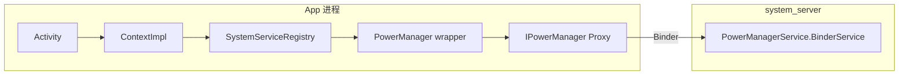
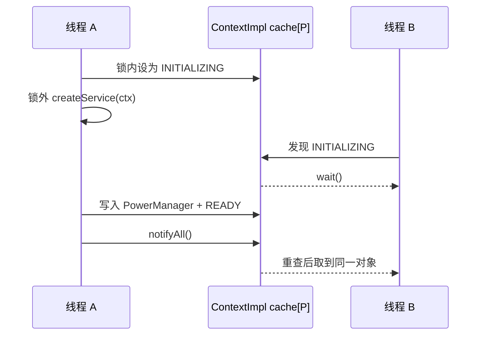

# 94 Android SystemServiceRegistry：同一 Activity 为什么取到同一个 PowerManager

> 源码基线：Android 11 / API 30 / `android-11.0.0_r48`
> 本章主场景：一个 Activity 先后两次调用 `getSystemService(PowerManager.class)`

你可能写过这样的代码：

```java
PowerManager first = getSystemService(PowerManager.class);
PowerManager second = getSystemService(PowerManager.class);
Log.d("Power", "same = " + (first == second));
```

在 Android 11 r48 中，若这两次查询落到同一个 `ContextImpl`，且首次创建成功，两个变量会指向同一个 `PowerManager` 对象。

**先给结论：`getSystemService()` 取到的是 App 进程内的 Manager wrapper，不是 system_server 里的服务对象。** 首次调用会把 `PowerManager.class` 映射为 `"power"`，找到创建配方，构造 `PowerManager` 并放进该 `ContextImpl` 的缓存槽；后续查询直接返回这个槽里的对象。

这个知识不只是为了记一条调用链。它能帮你判断：

- 为什么重复查询通常不会重新构造 Manager；
- 为什么换一个 Activity、display Context 或 user Context 后，对象可能不再 `==`；
- 为什么 Manager 非空，远端 Binder 仍可能已经死亡；
- 为什么底层的 `ServiceNotFoundException` 通常变成了公开 API 的 `null`。

本章只追踪“查表→创建→缓存→失败”。不展开 WakeLock 业务、SystemServer 完整启动顺序，也不把 Android 11 的内部缓存实现当成所有版本的 API 承诺。

## 1. 你拿到的到底是谁：先把四个“系统服务”拆开

“系统服务”在口语里常同时指好几样东西。如果不先拆开，很容易把“缓存 Manager”错听成“在 App 里缓存了整个电源服务”。

| 名字 | 本场景中的对象 | 在哪里 | 作用 |
|---|---|---|---|
| Context service name | `"power"` / `Context.POWER_SERVICE` | 字符串常量 | 连接 Registry 配方与 Binder 目录 |
| Manager wrapper | `PowerManager` | App 进程 | 向应用提供易用 Java API |
| Binder 接口 | `IPowerManager` | App 端通常是 Proxy | 把 Manager 调用变成 Binder 事务 |
| 服务端实现 | `PowerManagerService.BinderService` | system_server | 做权限检查并执行电源逻辑 |

它们的进程和持有关系如下：



这张图的意义是：

- `PowerManager` 是本地 Java 对象，构造它不等于复制了一份 `PowerManagerService`；
- Manager 里可以保存 AIDL 接口、`Context`、`Handler` 和客户端状态；
- 真正的电源操作仍要经 Binder 到 system_server；
- 缓存本地 Manager 和保证远端存活，是两件事。

可以把 `PowerManager` 想成“银行 App 里的客户端页面”，把 `PowerManagerService` 想成“银行后台”。手机上保留了页面对象，不能证明后台此刻一定可达。这个类比只用来建立第一层印象，下面回到 r48 真实类和字段。

## 2. 为什么 class 入口还要绕到字符串入口

表面上，`PowerManager.class` 已经能唯一表达类型，似乎可以直接拿它去 Registry 查对象。但 `Context` 的兼容边界要求 class 版本最终仍调用可被子类重写的字符串版本。

Android 11 r48 的公开入口只有几行：

```java
public final @Nullable <T> T getSystemService(
        @NonNull Class<T> serviceClass) {
    String serviceName = getSystemServiceName(serviceClass);
    return serviceName != null
            ? (T) getSystemService(serviceName) : null;
}
```

源码：`frameworks/base/core/java/android/content/Context.java`，方法 `getSystemService(Class<T>)`。

这几行证明了两件事：

1. class 入口先得到 service name，再调用字符串入口；
2. class 没有对应名字时，公开方法直接返回 `null`。

在 Activity 中，调用还会经过 `ContextWrapper`。它默认只把工作交给 `mBase`：

```java
public Object getSystemService(String name) {
    return mBase.getSystemService(name);
}

public String getSystemServiceName(Class<?> serviceClass) {
    return mBase.getSystemServiceName(serviceClass);
}
```

源码：`frameworks/base/core/java/android/content/ContextWrapper.java`。Activity 的 base 最终是一个 Activity 专属的 `ContextImpl`。

`ContextImpl` 在做完错误视觉 Context 的诊断后，把查询交给 Registry：

```java
public Object getSystemService(String name) {
    // 省略 incorrect Context 使用诊断
    return SystemServiceRegistry.getSystemService(this, name);
}

public String getSystemServiceName(Class<?> serviceClass) {
    return SystemServiceRegistry.getSystemServiceName(serviceClass);
}
```

源码：`frameworks/base/core/java/android/app/ContextImpl.java`。注释明确说明省略了中间诊断代码，不把两段伪装成原文中紧邻的全部实现。

于是本场景的入口链是：

```text
Activity.getSystemService(PowerManager.class)
  → getSystemServiceName(PowerManager.class)
  → "power"
  → Activity/ContextWrapper.getSystemService("power")
  → Activity 的 ContextImpl
  → SystemServiceRegistry.getSystemService(ctx, "power")
```

这里没有反射构造 `PowerManager.class`，也没有自动切到主线程。调用是同步的：哪个线程调用，查表和首次构造就在哪个线程上进行；只是构造器可能额外保存一个主线程 `Handler`。

## 3. Registry 不存服务端，它存的是“如何造 Manager”

如果把 `SystemServiceRegistry` 误认为 servicemanager，就会误以为它的 Map 里放着 system_server 对象。实际上，Android 11 r48 的三张表是：

```java
private static final Map<Class<?>, String>
        SYSTEM_SERVICE_NAMES = new ArrayMap<>();
private static final Map<String, ServiceFetcher<?>>
        SYSTEM_SERVICE_FETCHERS = new ArrayMap<>();
private static final Map<String, String>
        SYSTEM_SERVICE_CLASS_NAMES = new ArrayMap<>();
```

源码：`frameworks/base/core/java/android/app/SystemServiceRegistry.java`。

| 表 | 输入 → 输出 | 本场景的结果 |
|---|---|---|
| `SYSTEM_SERVICE_NAMES` | Manager class → service name | `PowerManager.class → "power"` |
| `SYSTEM_SERVICE_FETCHERS` | service name → 创建/缓存策略 | `"power" → PowerManager fetcher` |
| `SYSTEM_SERVICE_CLASS_NAMES` | service name → 类的简名 | 用于错误 Context 等诊断 |

登记方法只是把这三个关系同时放进表：

```java
private static <T> void registerService(
        String serviceName, Class<T> serviceClass,
        ServiceFetcher<T> serviceFetcher) {
    SYSTEM_SERVICE_NAMES.put(serviceClass, serviceName);
    SYSTEM_SERVICE_FETCHERS.put(serviceName, serviceFetcher);
    SYSTEM_SERVICE_CLASS_NAMES.put(
            serviceName, serviceClass.getSimpleName());
}
```

**登记配方不等于立即构造对象。** `SystemServiceRegistry` 做静态初始化时，它只会创建 fetcher 并填表；`PowerManager` 要等某个 `ContextImpl` 首次查询时才会创建。

PowerManager 的真实配方是：

```java
registerService(Context.POWER_SERVICE, PowerManager.class,
        new CachedServiceFetcher<PowerManager>() {
    public PowerManager createService(ContextImpl ctx)
            throws ServiceNotFoundException {
        IBinder pb = ServiceManager.getServiceOrThrow(Context.POWER_SERVICE);
        IPowerManager ps = IPowerManager.Stub.asInterface(pb);
        IBinder tb = ServiceManager.getServiceOrThrow(Context.THERMAL_SERVICE);
        IThermalService ts = IThermalService.Stub.asInterface(tb);
        return new PowerManager(ctx.getOuterContext(), ps, ts,
                ctx.mMainThread.getHandler());
    }
});
```

源码：`SystemServiceRegistry` 中 PowerManager 的注册块。Android 11 中这两个常量分别是 `"power"` 和 `"thermalservice"`。

这段源码证明：

- PowerManager 选择的是 `CachedServiceFetcher`；
- 它构造时会取 `power` 和 `thermalservice` 两个 Binder；
- `asInterface()` 把 `IBinder` 变成 AIDL 接口；
- 最后创建的才是 App 看到的 `PowerManager`；
- 一个 Manager 并不必然只包装一个 Binder 服务。

另一端，`PowerManagerService.onStart()` 用同一个名字发布 Binder：

```java
public void onStart() {
    publishBinderService(Context.POWER_SERVICE, mBinderService,
            false, DUMP_FLAG_PRIORITY_DEFAULT
                    | DUMP_FLAG_PRIORITY_CRITICAL);
    publishLocalService(PowerManagerInternal.class, mLocalService);
}
```

源码：`frameworks/base/services/core/java/com/android/server/power/PowerManagerService.java`。本章只关心第一条 Binder 发布。

于是两个注册中心的分工是：

```text
SystemServiceRegistry（App 进程内）
  "power" → 如何创建 PowerManager

ServiceManager / servicemanager（Binder 目录）
  "power" → PowerManagerService 发布的 IBinder
```

前者产生客户端 wrapper，后者定位 Binder 能力。两边都用 `"power"`，不表示它们是同一张 Map。

## 4. 为什么缓存是数组槽，而不是每个 Context 再存一张 Map

每一个 `CachedServiceFetcher` 在被创建时，会领到一个固定索引：

```java
private final int mCacheIndex;

CachedServiceFetcher() {
    mCacheIndex = sServiceCacheSize++;
}
```

Registry 的静态初始化完成后，`sServiceCacheSize` 就是一个 `ContextImpl` 需要的缓存槽数。`ContextImpl` 创建自己的两个数组：

```java
final Object[] mServiceCache =
        SystemServiceRegistry.createServiceCache();

final int[] mServiceInitializationStateArray =
        new int[mServiceCache.length];
```

源码：`frameworks/base/core/java/android/app/ContextImpl.java`。

两类对象的关系可以画成：

```text
进程内唯一的 Power fetcher
  mCacheIndex = P（P 是内部值，不应硬编码）
           │
           ├─ Activity ContextImpl.mServiceCache[P] → PowerManager A
           │
           ├─ Application ContextImpl.mServiceCache[P] → PowerManager B
           │
           └─ User ContextImpl.mServiceCache[P] → PowerManager C
```

索引 P 对该进程中的各个 `ContextImpl` 含义一致，但槽中的 Manager 对象分属不同 Context。不要记某个具体数字：注册顺序、编译配置和模块化注册都可以让它改变。

为什么这样设计？源码能直接确定的是：

- name 到 fetcher 的查表只放在全局 Registry；
- 找到 fetcher 后，它用整数索引访问当前 Context 的槽；
- 缓存对象和初始化状态长度完全对齐。

由此可以推断，这个结构避免了每个 Context 再维护一份字符串到对象的映射，并让缓存值与并发状态用同一个索引配对。代价是可缓存服务必须在 `ContextImpl` 分配数组前完成受控注册。Android 11 的模块化注册 API 也用 `ensureInitializing()` 限制它只能在 Registry 类初始化期执行。

## 5. 两个线程同时首次查询，为什么只会创建一份

单看 `mServiceCache[P] == null` 不够。`null` 可能表示“没开始”，也可能表示“另一个线程正在创建”或“已确认服务不存在”。

`ContextImpl` 因此为每个槽保留状态：

| 状态 | 数值 | 意义 |
|---|---:|---|
| `STATE_UNINITIALIZED` | 0 | 尚未有线程创建 |
| `STATE_INITIALIZING` | 1 | 某个线程正在创建 |
| `STATE_READY` | 2 | 创建路径已正常完成 |
| `STATE_NOT_FOUND` | 3 | 初始化未发布为 READY；正常缺失路径是 `ServiceNotFoundException` |

第一个进入的线程在 cache 锁下抢到“初始化权”：

```java
synchronized (cache) {
    T service = (T) cache[mCacheIndex];
    if (service != null
            || gates[mCacheIndex] == STATE_NOT_FOUND) {
        ret = service;
        break;
    }
    if (gates[mCacheIndex] == STATE_UNINITIALIZED) {
        doInitialize = true;
        gates[mCacheIndex] = STATE_INITIALIZING;
    }
}
```

上面是 `CachedServiceFetcher.getService()` 的关键分支，常量在原文中通过 `ContextImpl.` 限定，这里为了聚焦状态转换省略了限定名。

抢到权限后，线程会先释放 cache 锁，再调用 `createService(ctx)`：

```java
T service = null;
int newState = STATE_NOT_FOUND;
try {
    service = createService(ctx); // 此时没持有 cache 锁
    newState = STATE_READY;
} catch (ServiceNotFoundException e) {
    onServiceNotFound(e);
} finally {
    synchronized (cache) {
        cache[mCacheIndex] = service;
        gates[mCacheIndex] = newState;
        cache.notifyAll();
    }
}
```

这是整个并发设计里最值得理解的一点：**锁内决定谁初始化，锁外做可能较慢的 Binder 查询和对象构造，锁内发布结果。**

如果整个 `createService()` 都持有 cache 锁，一次 Binder 查询或构造器重入就可能长时间占住同一 `ContextImpl` 的服务缓存锁。r48 的选择是让其他线程看到 `INITIALIZING` 后等待，而不是再构造一份。



完成点也要说准：

- `cache[P]` 与最终状态在同一次 `synchronized(cache)` 中发布；
- `notifyAll()` 只表示等待者可以重查状态，不表示远端服务永远存活；
- 创建者返回 Manager 后，本次 `getSystemService()` 才结束；
- 所有这些步骤都在 App 进程内，不会自动切线程。

等待者如果被 interrupt，这个 API 不会向外抛 `InterruptedException`。它记住中断，等槽位稳定后再恢复当前线程的 interrupt 标志。这是并发协调细节，不是服务构造被取消。

还有一个防御分支：若状态是 `READY` 但对象变成了 `null`，r48 会把状态退回 `UNINITIALIZED` 并重新创建。这不是一个公开的缓存驱逐 API，也不意味着 Manager 会定期刷新。

## 6. CachedServiceFetcher 与 StaticServiceFetcher 到底差在哪里

两个 fetcher 的“创建一次”不是同一个范围。最容易记住的方法是：看它把对象放在哪里。

| 维度 | `CachedServiceFetcher` | `StaticServiceFetcher` |
|---|---|---|
| 缓存位置 | `ctx.mServiceCache[mCacheIndex]` | fetcher 自己的 `mCachedInstance` |
| 实例范围 | 每个 `ContextImpl` 一份 | 每个 Java 进程一份 |
| 创建入参 | `createService(ContextImpl)` | `createService()` |
| 并发协调 | Context cache 槽位状态机 | `synchronized(fetcher)` |
| 缺失后再查 | 同一 Context 记 `NOT_FOUND` | 对象仍为 null，下次重试 |
| r48 例子 | `PowerManager` | `HdmiControlManager` |

`StaticServiceFetcher` 的实现很直接：

```java
private T mCachedInstance;

public final T getService(ContextImpl ctx) {
    synchronized (StaticServiceFetcher.this) {
        if (mCachedInstance == null) {
            try {
                mCachedInstance = createService();
            } catch (ServiceNotFoundException e) {
                onServiceNotFound(e);
            }
        }
        return mCachedInstance;
    }
}
```

源码：`SystemServiceRegistry.StaticServiceFetcher`。

“Static”只表示它的 fetcher 挂在该 Java 进程的静态 Registry 中。它不是跨 App 进程、跨用户或跨设备的单例，更不是 system_server 里的服务端对象。

PowerManager 为什么不用 static 方案？从 r48 构造器可以看到，它保存了来自当前 `ContextImpl` 的 outer Context 和主线程 Handler：

```java
public PowerManager(Context context,
        IPowerManager service,
        IThermalService thermalService, Handler handler) {
    mContext = context;
    mService = service;
    mThermalService = thermalService;
    mHandler = handler;
}
```

这证明 wrapper 携带客户端 Context 环境；至于所有历史设计动机，单凭这个构造器无法全部还原，不需要虚构理由。

Android 11 还有 `StaticApplicationContextServiceFetcher`：它仍在 fetcher 上保留一份进程级 wrapper，但首次构造时传 application Context，r48 的 `ConnectivityManager` 使用它。这是当版本的特殊折中，不应被理解成“所有 Manager 都该使用 application Context”。

## 7. 换 Context 或换用户后，哪些东西会变，哪些不会

“per-Context 缓存”的精确说法是 **per-`ContextImpl`**。很多对外暴露的 Context 是 wrapper，自己并没有 `mServiceCache`。

按 Android 11 r48 的默认转发与创建路径，可以这样判断：

| 两次查询 | PowerManager wrapper 的典型结果 | 原因 |
|---|---|---|
| 同一 Activity，先后查两次 | 同一对象 | 落到同一 Activity `ContextImpl` 的同一槽 |
| 两个 wrapper 默认转发到同一 base | 同一对象 | 实际使用同一 `ContextImpl` 缓存 |
| Activity Context 与 Application Context | 通常不是同一对象 | 它们通常是不同 `ContextImpl` |
| 两个 Activity | 通常不是同一对象 | Activity 各有 ContextImpl |
| `createContextAsUser()` 返回的 Context | 有自己的 wrapper | r48 会新建 `ContextImpl` 并保存目标 user |
| 另一个 App 进程 | 必然是另一份 Java 对象 | Registry 静态状态也不跨进程 |

表里说的是 r48 内部对象身份，不是鼓励业务代码依赖 `==`。`Context` 的公开文档反而提醒：由某个 Context 取得的服务可能与该 Context 紧密相关，一般不要在不同 Context 之间随意共享。

不同 wrapper 也不意味着不同服务端：

```text
Activity A 的 PowerManager ─┐
                              ├─ IPowerManager ─Binder→ 同一 power 服务
Application 的 PowerManager ─┘
```

对 `PowerManager` 这个贯穿例子来说，`"power"` 仍是同一个 Binder 目录名。用户 Context 中创建了另一个 Manager，不等于驱动为它克隆了一个 `PowerManagerService`。

用户与权限语义也不能只靠缓存隔离来判断：

- Context 可以向 Manager 提供 user、package、attribution、display 和 Resources；
- Binder 调用到服务端后，服务端还会根据 calling UID/PID、权限和具体 API 规则裁决；
- 某个 Manager 是全局服务、按 user 设计，还是按 display 设计，要继续读那个 Manager 与服务端，不能仅凭 fetcher 名称猜。

一个实用的泄漏边界是：`PowerManager` 保存了构造时的 Context。Activity 自己的 cache 持有 Manager，两者同寿命通常没问题；如果应用又把这个 Manager 放进长寿命静态字段，就可能间接留住 Activity。但不能因此就把所有查询机械地改成 application Context；视觉、display 或 user 相关 Manager 需要正确的 Context 语义。

## 8. 查询失败时，为什么有时是 null，有时却是远端异常

先把失败分在不同阶段。否则看到一个 `null` 就去查 Binder 驱动，很可能从错误的层次开始。

| 失败点 | r48 的关键结果 | 同一 Context 下次怎样 |
|---|---|---|
| `PowerManager.class` 没有 class→name 映射 | class API 返回 `null` | 仍是 `null` |
| `"power"` 没有 fetcher | Registry 返回 `null` | 仍是 `null` |
| fetcher 查不到 `power` 或 `thermalservice` | 抛出后捕获 `ServiceNotFoundException`，返回 `null` | Cached 槽已是 `NOT_FOUND` |
| `createService()` 正常返回 null | 本次是 `READY + null` | 下次退回 `UNINITIALIZED` 再试 |
| Manager 已构造，远端后来死亡 | Manager 仍可能非空，业务调用失败 | Registry 通常仍返回旧 Manager |

`ServiceManager.getServiceOrThrow()` 的契约是：按名字取不到 `IBinder` 时，抛受检的 `ServiceNotFoundException`。但 `CachedServiceFetcher` 已经在内部捕获它，调用 `onServiceNotFound()` 记日志，然后把该 Context 的槽发布为 `STATE_NOT_FOUND`。

所以，应用通过 `Context.getSystemService()` 查 PowerManager 时，通常不会直接捕获到这个受检异常，而是得到 `null`。对普通 App UID，`onServiceNotFound()` 写 warning；对核心系统 UID，它使用 `Log.wtf`。`wtf` 首先是严重诊断日志，不应简化为“此处一定抛给调用者”。

### `NOT_FOUND` 为什么是个启动时序承诺

假设 Activity 在 `power` 已发布、`thermalservice` 尚未发布时首次查询：

```text
查到 power Binder
  → 查 thermalservice 失败
  → ServiceNotFoundException
  → Activity ContextImpl 的 Power 槽 = NOT_FOUND
  → 以后同一 ContextImpl 直接返回 null
```

即使 thermal service 稍后发布，这个槽也不会因为 servicemanager 变化自动从 `NOT_FOUND` 回到 `UNINITIALIZED`。因此 `CachedServiceFetcher + getServiceOrThrow()` 适合 Framework 预期在客户端可用前已经发布的服务。可晚到的后端不能不加思考地照搬这个模式。

### Manager 非空为什么仍不能作为存活检查

成功时的引用链是：

```text
mServiceCache[P]
  → PowerManager
      → IPowerManager Proxy
      → IThermalService Proxy
```

远端死亡不会自动把 `mServiceCache[P]` 清成 `null`。因此再次 `getSystemService()` 仍可能得到同一 Manager，但之后的业务 Binder 调用才报 `RemoteException` 或经 Manager 转换后的运行时异常。是否能重连，必须读具体 Manager；`SystemServiceRegistry` 没有为所有服务提供统一的 Binder death 恢复。

还有一条实现边界：Fetcher 只捕获 `ServiceNotFoundException`。若 `createService()` 抛出未检查异常，异常会继续传给调用者；`finally` 仍会以初始值 `NOT_FOUND` 发布槽位并唤醒等待者。不要把“未注册的 class 按契约返回 null”扩大成“这条路径绝不可能抛任何运行时异常”。

## 9. 排查时别被这些表面现象带偏

遇到问题时，先判断它停在“class→name”、“name→fetcher”、“fetcher创建”还是“Manager调远端”，再放断点：

| 观察到的问题 | 第一个断点/搜索点 | 先排除什么 |
|---|---|---|
| class 查询为 null | `getSystemServiceName(class)` | class 没注册 |
| name 查询为 null | `SYSTEM_SERVICE_FETCHERS.get(name)` | name 不存在 |
| 首次构造为 null | `createService()` / `onServiceNotFound()` | Binder 尚未发布 |
| 不同 Context 对象不同 | `ContextImpl.mServiceCache` | per-ContextImpl 缓存 |
| Manager 非空但调用失败 | Manager 内的 AIDL 字段 | 远端死亡/业务异常 |

因此，“两次是同一对象”应查 cached fetcher，“换 Activity 后对象不同”应先查 `ContextImpl`，“Manager 非空但调用失败”才应继续追 AIDL 与远端生命周期。

## 10. 在 macOS 上不编译，怎样自己证明这条链

下面都是只读命令。先进入 Android 11 r48 源码根目录：

```bash
cd /Users/ninebot/androidSource
```

### 验证一：class 入口为什么会回到 name

```bash
rg -n 'getSystemService\(|getSystemServiceName\(' \
  frameworks/base/core/java/android/content/Context.java \
  frameworks/base/core/java/android/content/ContextWrapper.java \
  frameworks/base/core/java/android/app/ContextImpl.java
```

应记录三个观察：

1. `Context.getSystemService(Class)` 是 final；
2. 它先 class→name，然后调字符串方法；
3. `ContextWrapper` 默认转发，`ContextImpl` 进入 Registry。

### 验证二：PowerManager 的配方和槽位在哪

```bash
rg -n 'POWER_SERVICE, PowerManager.class|mCacheIndex|createServiceCache' \
  frameworks/base/core/java/android/app/SystemServiceRegistry.java \
  frameworks/base/core/java/android/app/ContextImpl.java
```

继续用 `sed` 打开命中位置附近，应证明：

- PowerManager 使用 `CachedServiceFetcher`；
- fetcher 同时取 power 与 thermal Binder；
- fetcher 保存索引，Manager 保存在 `ContextImpl` 数组中。

### 验证三：并发创建与失败后果

```bash
rg -n 'STATE_(UNINITIALIZED|INITIALIZING|READY|NOT_FOUND)|notifyAll|wait\(' \
  frameworks/base/core/java/android/app/ContextImpl.java \
  frameworks/base/core/java/android/app/SystemServiceRegistry.java
```

读 `CachedServiceFetcher.getService()` 时，在纸上记下：哪些操作在 `synchronized(cache)` 里，`createService()` 在哪里，`ServiceNotFoundException` 会把 gate 改成什么。

### 验证四：客户端名字与服务端发布是否接上

```bash
rg -n 'publishBinderService\(Context.POWER_SERVICE|getServiceOrThrow' \
  frameworks/base/services/core/java/com/android/server/power/PowerManagerService.java \
  frameworks/base/core/java/android/app/SystemServiceRegistry.java \
  frameworks/base/core/java/android/os/ServiceManager.java
```

预期结果是：服务端以 `Context.POWER_SERVICE` 发布，PowerManager fetcher 以同一常量查询。`getServiceOrThrow()` 本身在 Binder 不存在时抛受检异常，Fetcher 再决定如何转成 Manager 获取结果。

这些静态阅读可以证明类映射、缓存位置、锁与失败分支。它不能证明某台设备此刻的 `power` 服务一定存在，也不能替代运行时 trace。厂商分支若修改 Registry 或服务发布，应以设备对应 commit 再核对。

## 11. 检查题、答案与立即可做的 takeaway

### 1. `getSystemService(PowerManager.class)` 为什么不直接拿 class 创建对象？

答：`Context` 的 class 入口先通过 Registry 把 class 映射为 `"power"`，然后调用可被 Context 子类重写的字符串入口。实际创建逻辑在 `ServiceFetcher`，不是反射 `PowerManager.class`。

### 2. 同一 Activity 两次查询的对象为什么相同？

答：两次默认都转发到同一 Activity `ContextImpl`。PowerManager 的 cached fetcher 使用同一 `mCacheIndex`，第二次直接命中 `mServiceCache[index]`。

### 3. `CachedServiceFetcher` 为什么不只判断 cache 是否为 null？

答：`null` 无法区分未初始化、其他线程正在初始化和已确认找不到。状态数组负责单次创建、等待与 `NOT_FOUND` 记忆。

### 4. 为什么 `createService()` 在 cache 锁外执行？

答：它可能查 Binder 或调用更复杂的构造逻辑。锁内只抢初始化权和发布结果，可以避免长时间占有 Context 的公共 cache 锁。

### 5. PowerManager fetcher 抛出 `ServiceNotFoundException` 后，应用一定能捕到这个异常吗？

答：通常不能。`CachedServiceFetcher` 在内部捕获它、记录日志、标记 `STATE_NOT_FOUND`，最终 `Context.getSystemService()` 返回 `null`。

### 6. PowerManager 非空，能否证明远端 power 服务正常？

答：不能。Registry 缓存的是 Manager wrapper，远端死亡不会自动清除槽位。存活、重连和异常转换要继续读具体 Manager。

### 可立即执行的阅读法

下次遇到任意 `getSystemService(XxxManager.class)`，不要先把整个 Registry 从头读到尾。只做六步：

1. 在 `Context.java` 找 `XxxManager` 对应的 service name；
2. 在 `SystemServiceRegistry.java` 找这一条 `registerService`；
3. 记下它是 Cached 还是 Static，对象缓存在哪里；
4. 只读 `createService()` 的关键几行，看 Binder 在哪里取得；
5. 按同一 name 搜索服务端 `publishBinderService()`；
6. 记下三个边界：调用线程、Context/user 范围、缺失与死亡后的行为。

只要能用自己的话说出这句话，本章就算建立了模型：

```text
class 先变成 name，name 找到 fetcher；
fetcher 创建并缓存本地 Manager，
Manager 再持有通往远端服务的 Binder 接口。
```

这同时回答了开头的问题：同一 Activity 的第二次查询返回同一 `PowerManager`，是因为它命中了同一 `ContextImpl` 的 Manager 缓存槽，不是因为 system_server 的服务对象被复制到了 App 中。
