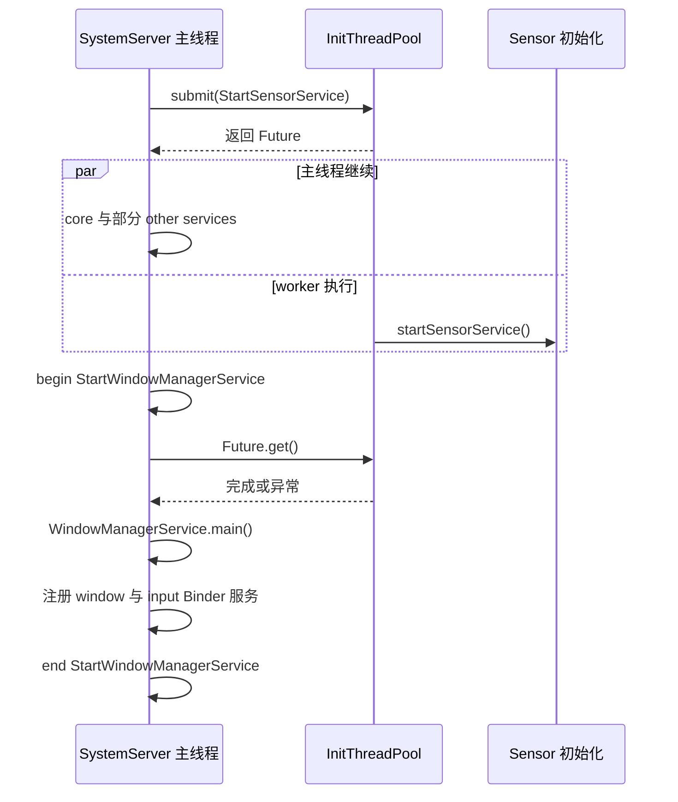

# 96 Android SystemServer 启动性能：从一段大耗时追到真正的关键路径

> 源码基线：Android 11 / API 30 / `android-11.0.0_r48`
> 阅读环境：macOS 上静态阅读本地 AOSP，不要求编译
> 贯穿场景：`StartServices` 很宽，继续拆开 `StartWindowManagerService` 内的等待、创建与注册

开机明显变慢，日志里却只有一条很宽的 `StartServices`，最容易做出的错误判断是：“SystemServer 启动服务太多，所以整体都慢。”这句话没有指出哪个线程、哪项工作、哪个等待点控制了完成时间，也无法指导修改。

本章用一条真实源码路径拆开它：SystemServer 主线程在 bootstrap 阶段把 SensorService 提交给初始化线程池，自己继续启动其他服务；进入 `StartWindowManagerService` 后，主线程先通过 Future 等 Sensor，再创建 WMS，最后向 ServiceManager 注册 window 和 input 两个 Binder 服务。这个 slice 很宽时，三段中的任何一段都可能控制结束时间，不能只凭名字归因。

**一句话结论：先用 SystemServer timing slice 缩小主线程区间，再把 submit、worker slice、Future 汇合点和线程状态连成同一条关键路径；只有控制了某个完成里程碑的那段执行或等待，才是这次启动慢的有效解释。**

读完后你应该能做到四件事：

1. 解释 `TimingsTraceAndSlog` 的 trace、begin 日志和 duration 日志为什么不是同一种证据；
2. 区分主线程顺序执行、线程池提交、worker 真正完成和 Future 汇合；
3. 判断 `StartWindowManagerService` 变宽时，慢在 Sensor 等待、WMS 创建还是 Binder 服务注册；
4. 在 Mac 上完成静态路径核对，并为以后真机 Perfetto 验证写出可证伪的假设。

本章不提供“优化后快了多少”的数字。没有同设备、同构建、同启动类型的实测，任何毫秒收益都只是猜测。

## 1. 先定义问题：你测的到底是哪一段启动

“开机完成”至少可能指下面几种不同终点：

| 观察范围 | 可能的起点与终点 | 本章能解释多少 |
|---|---|---|
| 整机开机 | 上电到可交互 | 只能解释其中一段 |
| userspace | init 启动到 framework ready | 能解释 system_server 部分 |
| SystemServer 初始启动 | `SystemServer.run()` 到进入 `Looper.loop()` | timing trace 覆盖较多 |
| 某个 boot phase | phase 开始到所有回调返回 | 可结合 SSM slice |
| 用户可交互 | Launcher/SystemUI 可用 | 还受其他进程和系统状态影响 |

因此看到 `StartServices` 很宽，只能先得出：

> SystemServer 主线程从开始启动服务，到 bootstrap、core、other 三组方法返回，经历了较长墙钟时间。

它不能直接证明：

- CPU 一直在执行 Java；
- 某个 `SystemService.onStart()` 是根因；
- 初始化线程池没有贡献；
- SystemUI 或 Launcher 已经可交互；
- 某个静态阈值已经被“实测达到”。

本章把诊断目标定义得更小、更可验证：

```text
StartServices
  → 找最宽的子区间
  → 定位该区间内的同步调用或 Future 汇合
  → 连接对应 worker / Binder / 锁 / I/O
  → 判断谁控制这个区间的 traceEnd
```

这里的“完成点”是理解性能的核心。一个方法被 submit，不代表开始；worker 开始，不代表完成；Future 完成，也不代表用户已经可交互。

## 2. 主线程骨架：三组服务启动仍是顺序调用

`SystemServer.run()` 在准备环境、主 Looper、SystemServiceManager 和初始化线程池后，按固定顺序进入三组服务启动方法。

`frameworks/base/services/java/com/android/server/SystemServer.java`

```java
try {
    t.traceBegin("StartServices");
    startBootstrapServices(t);
    startCoreServices(t);
    startOtherServices(t);
} catch (Throwable ex) {
    Slog.e("System", "******************************************");
    Slog.e("System", "************ Failure starting system services", ex);
    throw ex;
} finally {
    t.traceEnd(); // StartServices
}
```

这段代码给出两个重要边界：

1. 三个方法是同一线程上的普通 Java 调用，`startCoreServices` 必须等 `startBootstrapServices` 返回；
2. 这三个方法本身不会自动并行；若有工作与主线程重叠，源码中必然存在显式异步边界，例如线程池提交、自建线程或 Handler、Binder/native 异步调用。

bootstrap、core、other 是源码组织分组，不是三个并发层，也不是严格的稳定性或权限等级。

可以把主线程看成一条单行铁路：

```text
SystemServer 主线程
  InitBeforeStartServices
       ↓
  startBootstrapServices
       ↓
  startCoreServices
       ↓
  startOtherServices
       ↓
  StartServices.traceEnd
       ↓
  Looper.loop
```

大多数 `t.traceBegin("StartX")` / `traceEnd()` 是这条铁路上的站牌。某个站牌很宽，表示当前线程从 begin 到 end 的墙钟区间很宽；区间里可能包含当前线程运行、调度等待、同步 Binder、锁、文件 I/O、Future 或 GC 暂停。

所以第一步不是猜服务内部算法，而是继续展开嵌套 slice，并看该线程在区间内究竟处于什么状态。

### `traceEnd` 到底证明了什么

`StartServices.traceEnd` 证明三个启动方法已经返回或异常路径进入 finally。它不证明所有提交到线程池的任务都结束，因为有些 Future 会在更晚的消费者处等待，有些只由 boot-completed 阶段的线程池 shutdown 收口。

同理，`StartService X` 的 `traceEnd()` 位于 `finally`：正常路径结束说明构造与 `onStart()` 已返回，异常路径也会关闭 slice，此时只能说明控制流已经离开这段范围，不能说服务启动成功。即使正常返回，服务另起的线程、延迟消息或后续 boot phase 也可能仍未完成。

## 3. TimingsTraceAndSlog：同一个名字产生三类线索

SystemServer 用 `TimingsTraceAndSlog t = new TimingsTraceAndSlog()` 创建主线程专用计时对象。

`TimingsTraceAndSlog` 的 begin 先写一条 info 日志，再调用父类：

`frameworks/base/services/core/java/com/android/server/utils/TimingsTraceAndSlog.java`

```java
@Override
public void traceBegin(@NonNull String name) {
    Slog.i(mTag, name);
    super.traceBegin(name);
}
```

父类真正发出同步 trace slice，并在非 user 构建中保存开始时间：

`frameworks/base/core/java/android/util/TimingsTraceLog.java`

```java
public void traceBegin(String name) {
    assertSameThread();
    Trace.traceBegin(mTraceTag, name);

    if (!DEBUG_BOOT_TIME) return;
    if (mCurrentLevel + 1 >= mMaxNestedCalls) {
        Slog.w(mTag, "not tracing duration of '" + name + "' because already reached "
                + mMaxNestedCalls + " levels");
        return;
    }
    mCurrentLevel++;
    mStartNames[mCurrentLevel] = name;
    mStartTimes[mCurrentLevel] = SystemClock.elapsedRealtime();
}
```

结束时先关闭 trace slice；非 user 构建再计算 duration：

```java
public void traceEnd() {
    assertSameThread();
    Trace.traceEnd(mTraceTag);

    if (!DEBUG_BOOT_TIME) return;
    if (mCurrentLevel < 0) {
        Slog.w(mTag, "traceEnd called more times than traceBegin");
        return;
    }
    final String name = mStartNames[mCurrentLevel];
    final long duration = SystemClock.elapsedRealtime() - mStartTimes[mCurrentLevel];
    mCurrentLevel--;
    logDuration(name, duration);
}
```

三类线索不要混成一条：

| 线索 | 产生位置 | 它能回答什么 | 看不到时不能推断什么 |
|---|---|---|---|
| begin 日志 | `TimingsTraceAndSlog.traceBegin` 的 `Slog.i` | 代码走到哪个阶段 | 看不到不一定没执行，可能是采集/过滤问题 |
| trace slice | `Trace.traceBegin/End` | 线程上的 begin-end 时间线 | slice 宽不等于 CPU 时间长 |
| duration 日志 | 非 user 构建的 `logDuration` | Java 计时栈算出的墙钟耗时 | user build 没日志不代表没有 trace |

r48 中 `DEBUG_BOOT_TIME = !Build.IS_USER`。因此 user build 仍会调用 Trace API，但 `traceEnd()` 不会维护 Java duration 数组并输出每段 `"... took to complete"` 日志；代码若直接调用 `logDuration()`（例如后文的 `TotalBootTime`）仍是另一条路径。trace 是否最终可见，还取决于目标设备是否启用相应 tag、采集配置和缓冲区。

`TimingsTraceAndSlog` 另有 `BOTTLENECK_DURATION_MS = -1`。这表示它自己的 “Slow duration” warning 默认关闭，不能把它写成某个已经生效的慢调用阈值。

### 为什么主线程的 `t` 不能传给 worker

`TimingsTraceLog` 在构造时记录当前线程 id，每次 begin/end 都先 `assertSameThread()`。同步 trace 和嵌套计时栈都属于创建它的线程。

异步任务应在线程内部创建：

```java
TimingsTraceAndSlog traceLog = TimingsTraceAndSlog.newAsyncLog();
traceLog.traceBegin("AsyncWork");
try {
    doWork();
} finally {
    traceLog.traceEnd();
}
```

`newAsyncLog()` 使用日志 tag `SystemServerTimingAsync`，trace tag 仍是 `TRACE_TAG_SYSTEM_SERVER`。不要捕获主线程的 `t` 到 pool 中使用；这会触发同线程检查。

## 4. 缩小到具体服务：外层 slice 与 50 ms warning 范围不同

假设你已从 `StartServices` 展开到 `StartWindowManagerService`。仍不能直接说“WMS 创建慢”，因为这个 SystemServer 外层区间同时包住 Future 等待、WMS 创建和 Binder 注册。这里的 WMS 也不是经 SystemServiceManager 启动的 `SystemService`，所以这条路径根本没有一个可供归因的“WMS `onStart()`”。

其他经 SystemServiceManager 启动的服务才会出现 `StartService <类名>` 和 50 ms `onStart()` 计时。下面用它作范围对照；中间省略类型检查和反射异常分支：

`frameworks/base/services/core/java/com/android/server/SystemServiceManager.java`

```java
public <T extends SystemService> T startService(Class<T> serviceClass) {
    try {
        final String name = serviceClass.getName();
        Slog.i(TAG, "Starting " + name);
        Trace.traceBegin(Trace.TRACE_TAG_SYSTEM_SERVER, "StartService " + name);
```

```java
        startService(service);
        return service;
    } finally {
        Trace.traceEnd(Trace.TRACE_TAG_SYSTEM_SERVER);
    }
}
```

`startService(service)` 中只对 `onStart()` 单独测量：

```java
long time = SystemClock.elapsedRealtime();
try {
    service.onStart();
} catch (RuntimeException ex) {
    throw new RuntimeException("Failed to start service " + service.getClass().getName()
            + ": onStart threw an exception", ex);
}
warnIfTooLong(SystemClock.elapsedRealtime() - time, service, "onStart");
```

超过阈值只打印警告：

```java
private void warnIfTooLong(long duration, SystemService service, String operation) {
    if (duration > SERVICE_CALL_WARN_TIME_MS) {
        Slog.w(TAG, "Service " + service.getClass().getName() + " took " + duration + " ms in "
                + operation);
    }
}
```

Android 11 r48 中几个容易被误读的数字如下：

| 源码常量/条件 | 作用范围 | 超过后的行为 | 不能当成什么 |
|---|---|---|---|
| SSM `> 50 ms` | `onStart`、`onBootPhase` 及部分用户生命周期回调 | 写 warning，继续执行 | ANR、Watchdog 或服务超时 |
| SystemServer `60 * 1000` | 非 runtime restart、非首启/升级时，检查开机以来 `elapsedRealtime` | `Slog.wtf` | 单独 `StartServices` 的实测耗时 |
| Looper dispatch 100 ms | 主 Looper 消息执行 | slow log | `Looper.loop()` 前的启动代码计时 |
| Looper delivery 200 ms | 消息等待到开始分发 | slow log | 某个服务初始化阈值 |
| pool shutdown 20 s | phase 1000 后等待线程池终止 | 抓栈并抛异常 | 每个 Future 的超时 |

这些都是源码中的诊断条件，不是这台设备的测量结果。必须把“阈值是 50 ms”与“某次实际用了多少”分开。

60 秒分支尤其容易被标题误导。它实际比较的是开机以来的 `elapsedRealtime()`，并跳过 runtime restart、首启和升级：

`frameworks/base/services/java/com/android/server/SystemServer.java`

```java
if (!mRuntimeRestart && !isFirstBootOrUpgrade()) {
    final long uptimeMillis = SystemClock.elapsedRealtime();
    FrameworkStatsLog.write(FrameworkStatsLog.BOOT_TIME_EVENT_ELAPSED_TIME_REPORTED,
            FrameworkStatsLog
                    .BOOT_TIME_EVENT_ELAPSED_TIME__EVENT__SYSTEM_SERVER_READY,
            uptimeMillis);
    final long maxUptimeMillis = 60 * 1000;
    if (uptimeMillis > maxUptimeMillis) {
        Slog.wtf(SYSTEM_SERVER_TIMING_TAG,
                "SystemServer init took too long. uptimeMillis=" + uptimeMillis);
    }
}
```

### 外层慢、warning 不出现，应该查哪里

可能慢在服务构造、类加载、静态初始化、SystemServer 调用前后、Future、同步 Binder、锁或 I/O；50 ms warning 只测指定生命周期回调。反过来，看到 warning 也只说明回调值得调查，它不会中断、回滚或自动把工作移到后台，更不证明这段一定控制当前开机里程碑。

## 5. InitThreadPool：submit 只完成“入队”，不是完成任务

SystemServer 在启动服务前调用 `SystemServerInitThreadPool.start()`。构造器按运行时报告的可用处理器数建立固定线程池：

`frameworks/base/services/core/java/com/android/server/SystemServerInitThreadPool.java`

```java
private SystemServerInitThreadPool() {
    final int size = Runtime.getRuntime().availableProcessors();
    Slog.i(TAG, "Creating instance with " + size + " threads");
    mService = ConcurrentUtils.newFixedThreadPool(size,
            "system-server-init-thread", Process.THREAD_PRIORITY_FOREGROUND);
}
```

这解释了线程名、池大小和优先级，但不证明“线程越多启动越快”。worker 可能与主线程、其他进程争抢 CPU、I/O、内存带宽或全局锁。

提交时，description 先进入 pending 列表，然后 Executor 返回 Future：

```java
synchronized (mPendingTasks) {
    Preconditions.checkState(!mShutDown, TAG + " already shut down");
    mPendingTasks.add(description);
}
return mService.submit(() -> {
    TimingsTraceAndSlog traceLog = TimingsTraceAndSlog.newAsyncLog();
    traceLog.traceBegin("InitThreadPoolExec:" + description);
```

任务执行与异常分支紧接在后面：

```java
try {
    runnable.run();
} catch (RuntimeException e) {
    Slog.e(TAG, "Failure in " + description + ": " + e, e);
    traceLog.traceEnd();
    throw e;
}
synchronized (mPendingTasks) {
    mPendingTasks.remove(description);
}
```

源码随后可选打印“Finished executing”，再执行 `traceLog.traceEnd()`。这条路径有四个不同完成点：

| 时刻 | 已经保证什么 | 尚未保证什么 |
|---|---|---|
| `submit()` 返回 | Executor 已接受并返回 Future | worker 可能尚未开始 |
| `InitThreadPoolExec:X` begin | worker 开始包装任务 | X 尚未完成 |
| Future 进入完成态 | 包装任务返回、抛异常，或 Future 被取消 | 依赖方尚未观察；取消也不保证忽略中断的任务已经停下 |
| `Future.get()` 返回 | 任务成功，依赖方越过屏障 | 后续服务或用户可交互仍未保证 |

任务抛 `RuntimeException` 时，wrapper 会记录错误、调用一次 `traceEnd()` 并重新抛出，异常被 Future 保存。提交线程不会在 `submit()` 当场收到它；只有持有 Future 的代码执行 `get`，才能让失败传播到依赖点。若 runnable 自己开启了嵌套 slice 却未在异常路径关闭，最终 trace 仍可能不配对。

异常分支还发生在 `mPendingTasks.remove(description)` 之前。因此 pending 描述主要是 shutdown 失败时的诊断线索，不应被当成一套精确、独立的任务状态机。

## 6. 贯穿案例：SensorService 在哪里并行，又在哪里变回串行

SensorService 不能过早启动：源码注释说明它需要 PackageManager、AppOps 和 permission service。依赖具备后，bootstrap 末尾才提交：

`frameworks/base/services/java/com/android/server/SystemServer.java`

```java
mSensorServiceStart = SystemServerInitThreadPool.submit(() -> {
    TimingsTraceAndSlog traceLog = TimingsTraceAndSlog.newAsyncLog();
    traceLog.traceBegin(START_SENSOR_SERVICE);
    startSensorService();
    traceLog.traceEnd();
}, START_SENSOR_SERVICE);

t.traceEnd(); // startBootstrapServices
```

主线程随后进入 core 和 other services。进入 WMS 的外层 slice 后，源码先设置硬依赖，再创建 WMS，并注册两个 Binder 服务，最后才结束 slice：

```java
t.traceBegin("StartWindowManagerService");
// WMS needs sensor service ready
ConcurrentUtils.waitForFutureNoInterrupt(mSensorServiceStart, START_SENSOR_SERVICE);
mSensorServiceStart = null;
wm = WindowManagerService.main(context, inputManager, !mFirstBoot, mOnlyCore,
        new PhoneWindowManager(), mActivityManagerService.mActivityTaskManager);
ServiceManager.addService(Context.WINDOW_SERVICE, wm, false,
        DUMP_FLAG_PRIORITY_CRITICAL | DUMP_FLAG_PROTO);
ServiceManager.addService(Context.INPUT_SERVICE, inputManager, false,
        DUMP_FLAG_PRIORITY_CRITICAL);
t.traceEnd();
```

关键时序是：



并行收益来自 submit 与第一个消费者之间的独立工作窗口；风险来自共享状态、资源竞争和错误传播：

- Sensor 早已完成时，Future 汇合几乎不再增加关键路径；
- Sensor 尚未完成时，剩余时间落进 `StartWindowManagerService` 外层 slice；
- Sensor 失败时，Future 在汇合点把异常带回主线程；
- worker 若持有主线程更早需要的锁，并行窗口可能提前消失；
- 删除 wait 会破坏 WMS 的明确依赖，不是“免费优化”。

### 为什么这个 wait 没有自己的超时

`ConcurrentUtils.waitForFutureNoInterrupt` 直接调用 `Future.get()`：

`frameworks/base/core/java/com/android/internal/util/ConcurrentUtils.java`

```java
public static <T> T waitForFutureNoInterrupt(Future<T> future, String description) {
    try {
        return future.get();
    } catch (InterruptedException e) {
        Thread.currentThread().interrupt();
        throw new IllegalStateException(description + " interrupted");
    } catch (ExecutionException e) {
        throw new RuntimeException(description + " failed", e);
    }
}
```

它没有 timeout 参数。“NoInterrupt”也不表示吞掉中断：源码恢复 interrupt flag，然后抛异常。

本章把等待依赖俗称为“join”，但 r48 这里没有调用 `Thread.join()`：早期屏障实际是 `Future.get()`，线程池总屏障实际是 `awaitTermination()`。

如果 Sensor 一直不完成，这次 `Future.get()` 自身不会超时，主线程的正常控制流也无法继续到 phase 1000。Watchdog 杀掉进程等外部机制仍可能终止这次等待，但后面的“线程池 shutdown 最多等 20 秒”不会替这个早期 Future 汇合兜底。

### 怎样判断宽 slice 的责任归属

在同一时间轴同时看：

1. 主线程 `StartWindowManagerService` 的起止；
2. worker 上 `InitThreadPoolExec:StartSensorService` 与内层 `StartSensorService`；
3. 主线程在 `Future.get` 附近是 Sleeping/Blocked 还是 Running；
4. worker 内部又在运行、等 Binder、等锁还是等 I/O；
5. `WindowManagerService.main()` 与随后两次 `ServiceManager.addService()` 各自占了多少。

若 worker 的结束点与主线程重新运行对齐，Sensor 分支很可能控制了汇合；若 worker 早已结束，就应继续分析 `WindowManagerService.main()` 和两个 Binder 服务注册。这里必须用 trace 或栈验证，不能按标签名称猜。

## 7. 不同汇合点：早期消费者与 boot-completed 总屏障

SystemServer 的异步任务并不都在同一个地方等待。下表是代表路径，不是整个进程所有 pool 提交的穷举：

| 任务 | 提交后的主线程行为 | 明确汇合点 | 为什么在那里等 |
|---|---|---|---|
| SensorService | 继续 core/other services | WMS 创建前 | WMS 明确需要 Sensor ready |
| BlobStore service | 继续启动其他服务 | device-specific ready 后 | 后续 ready 流程前收口 |
| secondary Zygote preload | 提前运行 | WebView worker 内等待 | WebView preparation 依赖 preload |
| WebView preparation | 与 system-ready 工作重叠 | phase 600 前 | 三方应用可能使用 WebView |
| 未保存 Future 的启动任务 | 主线程继续 | pool shutdown | 最多等待 20 秒；超时后诊断并让当前启动路径失败，不保证任务已停下 |

这些任务是否存在还受 ABI、feature 和 `mOnlyCore` 等分支影响；表格描述的是 r48 中相应路径被启用后的依赖。

WebView 的结构说明 join 不一定发生在主线程：

```text
secondary Zygote preload
          ↓ worker 内 join
WebView preparation
          ↓ 主线程 join
PHASE_THIRD_PARTY_APPS_CAN_START
```

这条链上任意一段变慢，都可能最终推迟 phase 600。只看主线程最后一次 `Future.get`，仍需向上游 worker 继续追。

### phase 1000 后的 shutdown 是限时收口检查

SystemServiceManager 给所有已启动服务分发 boot-completed phase 后，记录总时长并关闭 init pool：

`frameworks/base/services/core/java/com/android/server/SystemServiceManager.java`

```java
if (phase == SystemService.PHASE_BOOT_COMPLETED) {
    final long totalBootTime = SystemClock.uptimeMillis() - mRuntimeStartUptime;
    t.logDuration("TotalBootTime", totalBootTime);
    SystemServerInitThreadPool.shutdown();
}
```

`OnBootPhase_1000` 的 trace 在上述判断之前已经结束，所以它不包含 pool 等待；shutdown 自己另有 `WaitInitThreadPoolShutdown` slice。不过调用 `startBootPhase()` 的父级 `FinishBooting` slice 尚未结束，因此父级区间仍会包含这次等待。`TotalBootTime` 使用 uptime 差值，50 ms 生命周期告警使用 `elapsedRealtime`，两种口径不能直接混算。

shutdown 禁止新任务，调用 Executor shutdown，再最多等待源码常量 20 秒：

```java
synchronized (sInstance.mPendingTasks) {
    sInstance.mShutDown = true;
}
sInstance.mService.shutdown();
final boolean terminated;
try {
    terminated = sInstance.mService.awaitTermination(SHUTDOWN_TIMEOUT_MILLIS,
            TimeUnit.MILLISECONDS);
} catch (InterruptedException e) {
    Thread.currentThread().interrupt();
    dumpStackTraces();
    t.traceEnd();
    throw new IllegalStateException(TAG + " init interrupted");
}
```

若 20 秒内未终止，它先抓 system_server 与 Watchdog 关注的 native 进程堆栈，再调用 `shutdownNow()` 尝试中断任务，最后抛出包含未开始 runnable 和 pending descriptions 的 `IllegalStateException`。任务若忽略中断，仍可能继续运行；这里保证的是等待方失败，不是 worker 已被强制停止。

因此 shutdown 不是“boot completed 后后台任务随便继续”，也不是每项任务的通用 20 秒超时。它只把 phase 1000 后同步等待线程池正常终止的时间限制为 20 秒；超时后的诊断与抛异常并不能给每个任务提供强制终止保证。

## 8. 从“大段耗时”到根因：按证据层级逐步缩小

下面这张表可以直接用于一次慢启动调查：

| 观察 | 当前最多能下什么结论 | 下一份证据 |
|---|---|---|
| `StartServices` 很宽 | 三组启动方法的墙钟区间宽 | 展开 bootstrap/core/other |
| 某个 `StartX` 很宽 | 当前线程被该代码范围占住 | 看嵌套 slice、线程状态、调用栈 |
| SSM 打印 `took ... in onStart` | 回调超过 50 ms 诊断线 | 查回调内部，并判断是否在关键路径 |
| 主线程停在 `Future.get` | 它在等异步任务完成 | 找对应 `InitThreadPoolExec:X` |
| worker slice 很宽 | runnable 的墙钟区间宽 | 看 Running/Runnable、Binder、锁、I/O |
| 主线程 Runnable | 想运行但未获 CPU | 查 CPU 竞争、频率和占用者 |
| 主线程 Sleeping/Blocked | 在等某种依赖 | 查唤醒者、锁 owner 或 Binder 对端 |
| begin 日志存在、无 duration | 已进入阶段 | 核对 build type、日志级别和 trace |
| 没看到 slice | 当前采集没有该事件 | 查 tag/category、缓冲区，不能断言代码没走 |

### 一条可复用的“问题 → 机制 → 验证”链

**问题：`StartWindowManagerService` 为什么变宽？**

先提出三个区段：Sensor Future 汇合、`WindowManagerService.main()`、两个 Binder 服务注册。每个区段内部又可能被 Binder、锁、I/O、调度或 GC 拖住。

再用源码确认边界：

- Future wait 位于 slice begin 后、`WindowManagerService.main()` 前；
- wait 无超时；
- worker 有 `InitThreadPoolExec:StartSensorService`；
- 两次 `ServiceManager.addService()` 位于 WMS 创建之后、slice end 之前；
- SSM 的 50 ms warning 不覆盖这条直接启动 WMS 的路径。

最后用同一次 trace 验证：

- 对齐 main 和 worker 的时间；
- 找 main 的阻塞调用栈或线程状态；
- Binder 沿 transaction 到对端，锁找到 owner；
- I/O 对齐文件系统事件，Runnable 检查 CPU 竞争。

只有证据支持某一条依赖控制 `traceEnd`，才能把它写成根因。

### 优化也要围绕完成点

确认依赖后，才考虑提前 submit、缩短 worker 工作、减少共享锁、把非关键工作延后到合适 phase。必要 join 和异常传播必须保留。

“submit 后马上 wait”“全部扔进线程池”“删除 wait”“把工作移出 trace 标签”都可能让代码更复杂或数字更好看，却没有缩短真实关键路径。

## 9. macOS 静态验证与以后真机验证

先在本地源码根目录执行：

```bash
cd /Users/ninebot/androidSource
```

### 第一步：确认主线程骨架和 trace 名字

```bash
rg -n 'traceBegin\("StartServices"|startBootstrapServices\(t\)|startCoreServices\(t\)|startOtherServices\(t\)' \
  frameworks/base/services/java/com/android/server/SystemServer.java
rg -n 't\.traceBegin\("' \
  frameworks/base/services/java/com/android/server/SystemServer.java
```

按行号阅读，才能保留真实启动顺序；把 trace 名字按字母排序没有诊断价值。

### 第二步：配对 submit、Future 与 join

```bash
rg -n 'SystemServerInitThreadPool\.submit|waitForFutureNoInterrupt' \
  frameworks/base/services/java/com/android/server/SystemServer.java
rg -n 'mSensorServiceStart|START_SENSOR_SERVICE|StartWindowManagerService' \
  frameworks/base/services/java/com/android/server/SystemServer.java
```

把结果记成“提交行 → Future 保存位置 → 第一个消费者 → wait 行”，就能先画出静态依赖图。

### 第三步：核对计时与阈值的范围

```bash
rg -n 'DEBUG_BOOT_TIME|traceBegin|traceEnd|logDuration|assertSameThread' \
  frameworks/base/core/java/android/util/TimingsTraceLog.java
rg -n 'SERVICE_CALL_WARN_TIME_MS|warnIfTooLong|SystemServerInitThreadPool.shutdown' \
  frameworks/base/services/core/java/com/android/server/SystemServiceManager.java
rg -n 'SHUTDOWN_TIMEOUT_MILLIS|mPendingTasks|awaitTermination|dumpStackTraces' \
  frameworks/base/services/core/java/com/android/server/SystemServerInitThreadPool.java
```

这些命令能验证控制流、默认常量和静态依赖，不能告诉你目标设备哪段实际最慢。

### 有设备时补齐动态证据

先低成本保留日志：

```bash
adb logcat -b all -v threadtime \
  -s SystemServerTiming SystemServerTimingAsync \
  SystemServiceManager SystemServerInitThreadPool
```

然后查看目标设备支持的 atrace category，并用 Perfetto 采集 system_server trace、sched 线程状态与唤醒、Binder transaction；按问题补 CPU frequency、I/O 和 ART GC。

对同一问题要记录 build 类型、冷启动或 runtime restart、首启/升级状态、设备温度和采集配置。前后版本在相同条件下重复采样，再报告 P50/P90 等分布；本章没有这些数据，因此不编造收益。

日志适合快速找名字，Perfetto 适合证明线程与等待关系。不同次启动的日志与 trace 不能强行拼成同一条因果链。

## 10. 常见翻车点、检查题答案与行动清单

### 六个常见翻车点

1. **把 slice 时长当 CPU 时间。** begin-end 是墙钟区间，包含等待与调度。
2. **把 submit 当完成。** 它只返回 Future，任务甚至可能尚未开始。
3. **只看主线程。** Future 后面可能连着 worker、Binder、锁或 I/O。
4. **把 50 ms warning 当超时。** 它只报警，不取消、不回滚，也不是 ANR。
5. **认为 20 秒 shutdown 会保护所有 join。** 早期 Future 卡住时可能根本到不了 phase 1000。
6. **比较不同样本。** userdebug 与 user、冷启与 runtime restart、首启与稳定重启不能直接横比。

### 检查题与答案

1. **为什么 `StartServices` 很宽仍不能定位服务？** 它包住三组方法及其中所有运行和等待，必须继续展开。
2. **user build 没 duration 日志，能否断言没有 trace？** 不能；r48 仍调用 Trace API，只是不维护 Java duration 栈。
3. **为何异步任务要 `newAsyncLog()`？** 计时对象绑定创建线程，主线程实例不能跨线程 begin/end。
4. **SSM 的 50 ms warning 测什么？** `onStart`、`onBootPhase` 等一次生命周期回调的 elapsed time；外层范围更大。
5. **Sensor submit 后主线程为何能前进？** submit 返回 Future，不等待 runnable 完成。
6. **Sensor 的剩余耗时何时进入关键路径？** 主线程到 WMS 前调用 `Future.get()` 而 worker 尚未结束时。
7. **`waitForFutureNoInterrupt` 有超时吗？** 没有；中断和任务异常都会转成异常传播。
8. **pool 的 20 秒是什么？** phase 1000 后 `awaitTermination` 的上限，不是每个任务的 timeout。
9. **怎样区分 Sensor、WMS 创建和服务注册谁慢？** 对齐外层 slice、worker 结束点、主线程栈，并为创建与两次注册补更细的区间或调用证据。
10. **Mac 静态阅读能证明优化收益吗？** 不能；收益需目标设备同条件多次测量。

### 读完就能做的事

以后看到 SystemServer 启动慢，按下面顺序记录：

```text
[ ] 明确起点、终点、build 和启动类型
[ ] 从 StartServices 向下找到最小可信 slice
[ ] 标出区间内每个 submit、worker、Future 和 join
[ ] 对齐主线程与 worker 的线程状态和完成点
[ ] 沿 Binder、锁、I/O、GC 或调度追到真正控制者
[ ] 修改前写清依赖、异常传播和不可越过的 boot phase
[ ] 同条件重复采样，用分布和功能回归验证结果
```

回到贯穿场景：`StartWindowManagerService` 很宽时，正确结论不是“WMS 慢”，而是“这个区间包含 Sensor Future 汇合、WMS 创建以及 window/input 两次 Binder 服务注册”。先分清哪一段控制 `traceEnd()`，再决定优化 Sensor、WMS、注册过程，还是它们背后的 Binder、锁、I/O 或调度链。
