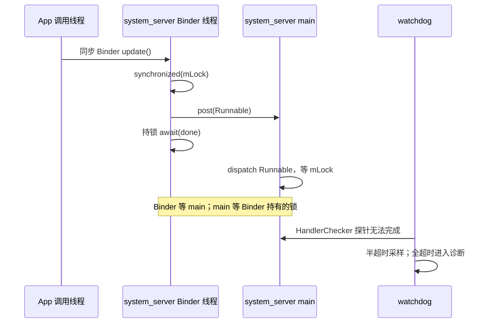

# 97 Android system_server 线程模型：从一个锁死等到 Watchdog

> 源码基线：Android 11 / API 30 / `android-11.0.0_r48`
> 本章只做源码静态学习，不伪造设备实测数据

想象一个故障：App 同步调用 system_server 里的某个服务。服务的 Binder 线程拿着 `mLock`，向 system_server 主 Handler 投了一个任务，然后等它完成；主线程执行该任务时又要取 `mLock`。

结果不只是“一个 API 慢”：

- App 调用线程等 Binder reply；
- system_server Binder 线程等主线程；
- system_server 主线程等 Binder 线程手里的锁；
- 其他依赖主 Looper 或同一 Binder 线程池的服务也可能陆续失去响应；
- Watchdog 最后报告的可能是“main thread blocked”，但根因是跨线程等待环。

**先给结论：system_server 是一个进程，但不是一条执行队列。** 跨进程 Binder 入口默认在 Binder 线程池执行；只有服务显式 `post` 后，后续工作才转到主 Looper、`FgThread` 或专用 Handler 线程。Watchdog 检查的是特定线程与 monitor 能否前进，它不会直接告诉你等待环的第一条边是谁写的。

读完后，你应该能：

1. 看一个 system_server 方法时，不靠类名猜线程，而是追入口与 `Handler` 来源；
2. 画出“谁持锁、谁等谁”，区分消息积压、Binder 线程池饥饿和锁死；
3. 解释 Watchdog 的 Handler checker、monitor、半超时与全超时分别证明什么；
4. 看到“Watchdog 报 main”时，继续沿锁主人和 Binder 目标找真正根因。

本章不把 system_server 所有线程列成百科。只保留理解这个等待环必需的主线程、Binder 池、Handler 线程和 Watchdog。App ANR 的超时规则、内核 Binder 完整调度以及进程重启后的恢复顺序不在本章展开。

## 1. 先把故障画成等待环，不要先怪“主线程慢”

下面是故障模型伪代码，**不是 AOSP 某个服务的原文**：

```java
void updateFromBinder(Request request) throws InterruptedException {
    CountDownLatch done = new CountDownLatch(1);
    synchronized (mLock) {                 // Binder 线程持锁
        mMainHandler.post(() -> {
            try {
                synchronized (mLock) {     // main 等同一把锁
                    applyOnMain(request);
                }
            } finally {
                done.countDown();
            }
        });
        done.await();                      // 持锁等 main
    }
}
```

这段代码的问题不在 `CountDownLatch` 这个类，而在“等待时仍持有对方必须取得的锁”。把关系改写成等待图：

```text
App 调用线程
  │ 等同步 Binder reply
  ▼
system_server Binder 线程
  │ 持有 mLock，等 done
  ▼
system_server main
  │ 等 mLock
  └────────────────┘
```

`done.countDown()` 在 main 取到 `mLock` 之后才能执行；`mLock` 只有 Binder 线程结束 `done.await()` 后才能释放。两个条件互相要求对方先完成，所以这是逻辑死锁，不是调高线程优先级就能解决的调度慢。

为什么要先画图？因为 Watchdog 最容易观察到的是 main 无法处理探针，而 main 只是等待环中的一个受害者。如果只修“main 这一行拿锁太慢”，却保留 Binder 线程持锁同步等 Handler 的设计，环仍然存在。

## 2. 方法属于哪个服务，不能告诉你它运行在哪个线程

system_server 把很多 Java 服务装在同一进程，但执行位置由“怎样进入”决定：

| 入口/转移 | 默认执行位置 | 是否自动切线程 |
|---|---|---|
| 其他进程调用 Java Binder Stub | system_server Binder 线程 | 已由 Binder 跨到服务端线程，但不会再自动转 main |
| `handler.post(runnable)` | handler 绑定的 Looper 线程 | 是，到已存在的目标线程 |
| system_server 内普通 Java/LocalServices 直调 | 调用者当前线程 | 否 |
| `executor.execute(runnable)` | executor 真实后端 | 取决于 executor |
| 同步 Binder 向外调用 | 发起线程等 reply | 对端线程另算，本线程不消失 |

因此读任意方法时，先回答四个问题：

1. 它是 Binder Stub 入口、Handler callback，还是普通 Java 直调？
2. 若有 Handler，它构造时使用的 `Looper` 来自哪里？
3. 该方法在 `post` 前做了什么，`post` 后又是谁继续执行？
4. 有没有持锁跨过等待、Binder 调用或线程转移？

一个服务完全可以同时出现三种路径：Binder 线程负责入口检查，主 Handler 负责一部分串行状态，专用 `ServiceThread` 负责另一部分工作。“它是 PowerManagerService 的方法”仍然不是线程结论。

`oneway` 也不是“在后台 Handler 执行”的注解。它只让客户端不同步等 reply；服务端 Stub 仍由 Binder 线程取出事务。若服务想转到 Handler，仍需自己 `post`。

## 3. SystemServer 主线程有两个阶段：先直接启动，再进入 Looper

SystemServer 早期把当前线程准备成主 Looper 线程：

```java
BinderInternal.disableBackgroundScheduling(true);
BinderInternal.setMaxThreads(sMaxBinderThreads);

Process.setThreadPriority(Process.THREAD_PRIORITY_FOREGROUND);
Process.setCanSelfBackground(false);
Looper.prepareMainLooper();
Looper.getMainLooper().setSlowLogThresholdMs(
        SLOW_DISPATCH_THRESHOLD_MS,
        SLOW_DELIVERY_THRESHOLD_MS);
```

源码：`frameworks/base/services/java/com/android/server/SystemServer.java`，`run()`。Binder 配置与 Looper 准备在同一段早期初始化中，但它们建立的是两套执行机制。

然后 `run()` 直接调用三组服务启动方法：

```java
startBootstrapServices(t);
startCoreServices(t);
startOtherServices(t);

// 前面的同步启动返回后
Looper.loop();
throw new RuntimeException(
        "Main thread loop unexpectedly exited");
```

这证明主线程有两个阶段：

```text
阶段 A：Looper 已 prepare，但主线程仍在直接执行启动代码
阶段 B：启动主线返回，进入 Looper.loop() 消费 MessageQueue
```

因此，早期 `SystemService.onStart()` 卡住时，不一定能在栈上看到 `Looper.loop()`；它可能正卡在 `startBootstrapServices()` 的直接调用链。系统运行起来后，投到 main Handler 的任务才由同一条主线程在 Looper 中串行处理。

Watchdog 也不是等所有服务完全启动才出现。r48 在 `startBootstrapServices()` 开头就调用：

```java
final Watchdog watchdog = Watchdog.getInstance();
watchdog.start();
```

此时 main Looper 已 prepare，但 `SystemServer.run()` 还没走到最后的 `Looper.loop()`。这让 Watchdog 能覆盖早期启动死锁；同时也解释了为什么 r48 对某些已知的长启动操作提供成对的 pause/resume Watchdog 机制。pause 是精确的例外，不是遮住普通死锁的办法。

## 4. Binder 线程池是入口，不是通往主线程的中转站

App 跨进程调用 system_server 的 Java Binder 对象时，驱动把事务交给 system_server 的 Binder looper 线程。Java Binder 入口最终在这条线程上调 `onTransact()`：

```java
private boolean execTransactInternal(int code,
        long dataObj, long replyObj, int flags, int callingUid) {
    Parcel data = Parcel.obtain(dataObj);
    Parcel reply = Parcel.obtain(replyObj);
    boolean res;
    try {
        res = onTransact(code, data, reply, flags);
    } finally {
        // 省略 Parcel 回收与观测逻辑
    }
    return res;
}
```

源码：`frameworks/base/core/java/android/os/Binder.java`。这是按 r48 调用方向缩减的片段，省略了 AppOps、trace、异常写 reply 和大 Parcel 检查。关键是：`onTransact()` 直接在当前入站线程执行，中间没有隐藏的 `mainHandler.post()`。

Android 11 r48 还为 system_server 设置：

```java
private static final int sMaxBinderThreads = 31;

BinderInternal.setMaxThreads(sMaxBinderThreads);
```

JNI 再调用 `ProcessState::setThreadPoolMaxThreadCount(31)`，通过 `BINDER_SET_MAX_THREADS` 配置驱动，调用成功时更新 libbinder 中的 `mMaxThreads`。r48 libbinder 的普通默认值是 15，system_server 主动把配置提到 31。

同一段早期代码还调用 `disableBackgroundScheduling(true)`。r48 的 SystemServer 注释把目的写成让进入 system_server 的 Binder 调用按前台优先级处理；在 libbinder 中，它关闭了向本地 Binder 对象附加后台调度默认值的行为。它不会把 Binder 方法切到 main，也不能解决逻辑锁死。

但“31”不应解读成：

- 进程启动时已预创建 31 条 Java 线程；
- 任意时刻 `ps` 都必须精确看到 31 条；
- 只要还没到 31，就不可能发生锁死；
- 每个系统服务都有自己的 31 条线程。

这是 system_server 进程 Binder 池的配置上限语义，线程池会按需参与入站处理，还存在显式加入线程池等实现细节。排障时应以实际 tid 和栈为准，不用常量推导现场线程数。

更重要的是，这个池被同一进程中大量 Binder 服务共享。本场景最初只占住一条 Binder 线程；若后续客户端调用也进入同一把锁或同一等待条件，更多 Binder 线程才会堆积。当池中可用执行能力被耗尽时，原本与该服务无关的入站 IPC 也会被拖累。

Binder 线程池饥饿并不等于 CPU 一定很高。线程可能全在等锁、等条件变量、等磁盘/HAL，或等另一个同步 Binder reply。“CPU 很低”只能说没有大量运算，不能排除系统已无法处理新 IPC。

## 5. Handler 是显式的线程切换，ServiceThread 则是可控的 Looper 载体

`Handler.post()` 不会为每个 Runnable 新建线程。它把任务放进 Handler 绑定 Looper 的 `MessageQueue`，由那条已存在的线程串行取出。

所以本场景的 `mMainHandler.post(...)` 产生了一个非常具体的切换点：

```text
post 前：system_server Binder 线程
post 本身：只是入队，不是 Runnable 已执行
dispatch 时：system_server main
```

服务不想占 main 时，可以使用 system_server 共享线程，或创建服务专用线程。Android 11 的 `ServiceThread` 是面向系统服务的 `HandlerThread` 扩展：

```java
public void run() {
    Process.setCanSelfBackground(false);
    if (!mAllowIo) {
        StrictMode.initThreadDefaults(null);
    }
    super.run();
}
```

源码：`frameworks/base/services/core/java/com/android/server/ServiceThread.java`。

`allowIo=false` 表示在该线程安装 StrictMode 默认策略以暴露不合适的 I/O，不是内核从此禁止它读写文件。`setCanSelfBackground(false)` 也是线程调度约束，不是死锁解决器。

`FgThread` 是一个共享 `ServiceThread`：

```java
private FgThread() {
    super("android.fg", Process.THREAD_PRIORITY_DEFAULT,
            true /* allowIo */);
}

private static void ensureThreadLocked() {
    if (sInstance == null) {
        sInstance = new FgThread();
        sInstance.start();
        sHandler = new Handler(sInstance.getLooper());
    }
}
```

源码：`frameworks/base/services/core/java/com/android/server/FgThread.java`，片段省略 trace tag、slow log 阈值和 executor 创建。

要记住的不是每条共享线程的优先级数字，而是三种隔离程度：

| 选择 | 主要优点 | 主要风险 |
|---|---|---|
| system_server main | 与主状态/生命周期串行 | 一次阻塞拖住大量 main 任务 |
| `FgThread` 等共享线程 | 复用线程，与 main 分开 | 一个服务可堆塞共享队列 |
| 服务专用 `ServiceThread` | 队列和故障隔离更强 | 增加线程、生命周期和监控成本 |

无论选哪个 Handler，都不应在持有目标 Runnable 必需的锁时同步等它。把故障从 main 换到专用线程，只是改了等待环里的线程名，不会自动打破环。

## 6. 一个局部死锁是怎样扩散成“很多系统服务都异常”的

把贯穿场景按时间排开：



然后会出现三层扩散：

### 第一层：当前调用无法返回

App 发起的是同步 Binder 事务，因此它等服务端 reply。Binder 驱动没有为所有同步事务统一附加“Watchdog 60 秒超时”；客户端是否最终因 ANR、上层 timeout 或进程死亡结束，是另一层契约。

### 第二层：main 队列不再前进

main 已经开始 dispatch 这个 Runnable，并卡在取锁上。后面的启动阶段、用户生命周期、广播或其他服务投到 main 的工作都不能越过当前 dispatch。`postAtFrontOfQueue()` 也只能放到待处理队列前端，不能抢占已在执行的 Runnable。

### 第三层：Binder 线程可能继续堆积

一条被卡 Binder 线程不等于整个池立即耗尽。但若其他事务也要 `mLock`、要同一主线程结果，或从另一条路径进入同一等待链，占用数才会增长。只有到可用池能力被耗尽时，无关 Binder 服务的新 IPC 才会因共享池而普遍等待。

这也是为什么诊断要分开两个问题：

1. main 是否已因一条具体等待边停止？
2. Binder 池是否已经饱和，还是只有少量线程受影响？

客户端 App 如果恰好用主线程做这次同步 Binder 调用，它还可能另行触发 App 自己的 input ANR。那是 App 进程的响应性检查；Watchdog 检查的是 system_server 关键线程/锁和 Binder 池是否前进。两者可由同一等待链引发，却不是同一个超时器。

## 7. Watchdog 不是扫描所有线程，而是让指定 checker 和 monitor 证明自己能前进

Android 11 r48 的 Watchdog 有两种检查对象：

| 机制 | 怎样检查 | 本场景能看到什么 |
|---|---|---|
| `HandlerChecker` | 让目标 Handler/Looper 执行 checker Runnable | main 卡在 `mLock`，无法回到队列执行探针 |
| `Monitor` | checker Runnable 在目标线程上调用 `monitor()` | 检查某把关键锁或 Binder 池可用性 |

Handler checker 的调度核心是：

```java
if ((mMonitors.size() == 0
        && mHandler.getLooper().getQueue().isPolling())
        || mPauseCount > 0) {
    mCompleted = true;
    return;
}
if (!mCompleted) return;

mCompleted = false;
mCurrentMonitor = null;
mStartTime = SystemClock.uptimeMillis();
mHandler.postAtFrontOfQueue(this);
```

源码：`frameworks/base/services/core/java/com/android/server/Watchdog.java`，`HandlerChecker.scheduleCheckLocked()`。

如果没有 monitor，而目标 Looper 正在 queue polling，这本身就证明线程已处理完先前工作并回到了队列，可以省掉一次探针切换。但有 monitor 时不能跳过：Looper 空闲不能证明 monitor 要取的锁可用。

checker Runnable 真正运行时，会在目标 Handler 的线程上串行调各 monitor：

```java
for (int i = 0; i < mMonitors.size(); i++) {
    synchronized (Watchdog.this) {
        mCurrentMonitor = mMonitors.get(i);
    }
    mCurrentMonitor.monitor();
}
synchronized (Watchdog.this) {
    mCompleted = true;
    mCurrentMonitor = null;
}
```

这里的完成点是 `mCompleted = true`：它表示该轮 Handler 探针已运行，且所有 monitor 已返回。它不表示目标服务的所有队列已清空，也不表示所有 Binder 调用都已完成。

r48 默认为 FgThread、main、UI、I/O、display、animation 和 surface-animation 线程建立 checker。这里列出它们是为了界定 Watchdog 范围，不是要背线程百科。

边界是：

- 一个服务新建了专用 HandlerThread，不会因此自动获得 Watchdog checker；
- 服务要用 `Watchdog.addThread(handler, timeout)` 显式加入关键线程；
- `addMonitor()` 把 monitor 加到主 monitor checker，该 checker 绑在 FgThread；
- BackgroundThread 因允许更长工作而没被默认监控，但它持有 main 所需锁时仍可成为根因。

## 8. BinderThreadMonitor 检查的是池可用性，不是每个 Binder 方法的超时

Watchdog 构造时把 `BinderThreadMonitor` 加到 FgThread 上的 monitor checker。它只有一个调用：

```java
private static final class BinderThreadMonitor
        implements Watchdog.Monitor {
    public void monitor() {
        Binder.blockUntilThreadAvailable();
    }
}
```

Java 方法经 JNI 进入 r48 libbinder。关键条件是：

```cpp
pthread_mutex_lock(&mProcess->mThreadCountLock);
while (mProcess->mExecutingThreadsCount
        >= mProcess->mMaxThreads) {
    pthread_cond_wait(&mProcess->mThreadCountDecrement,
            &mProcess->mThreadCountLock);
}
pthread_mutex_unlock(&mProcess->mThreadCountLock);
```

源码：`frameworks/native/libs/binder/IPCThreadState.cpp`，`blockUntilThreadAvailable()`。

因此，Binder monitor 能证明的是：当前 libbinder 记录的执行中线程数是否已达该进程配置上限，以及是否有线程退出执行使它能返回。

它不能单独证明：

- 每一条 Binder 线程都在等同一把锁；
- 某个具体服务已经死锁；
- 一条同步 Binder 调用超过 60 秒就会被 Binder 驱动取消；
- 只卡住一条 Binder 线程时，该 monitor 也一定会卡住。

回到本场景：main checker 可以在只卡住一条 Binder 线程时就超时，因为 main 已经等 `mLock`。只有当更多入站事务堆积到 libbinder 判定池已无可用执行余量时，`BinderThreadMonitor` 才会在 FgThread 上阻塞。这时 Watchdog 可能同时报 main handler 与 Binder monitor，两者是同一等待链的不同观测。

## 9. “等了 30 秒”与“等了 60 秒”分别发生什么

Android 11 r48 此处的常量是：

```java
private static final long DEFAULT_TIMEOUT =
        DB ? 10 * 1000 : 60 * 1000;
private static final long CHECK_INTERVAL =
        DEFAULT_TIMEOUT / 2;

private static final int COMPLETED = 0;
private static final int WAITING = 1;
private static final int WAITED_HALF = 2;
private static final int OVERDUE = 3;
```

r48 中 `DB` 是 `false`，所以默认 checker 的 `mWaitMax` 是 60 秒，Watchdog 循环的检查间隔是 30 秒。状态从探针的 `mStartTime` 起算：

```java
if (mCompleted) return COMPLETED;
long latency = SystemClock.uptimeMillis() - mStartTime;
if (latency < mWaitMax / 2) {
    return WAITING;
} else if (latency < mWaitMax) {
    return WAITED_HALF;
}
return OVERDUE;
```

### 半超时：先留现场，不杀进程

第一次进入 `WAITED_HALF` 时，Watchdog 会记录日志并调用 `ActivityManagerService.dumpStackTraces(...)`，然后继续等。

```java
if (!waitedHalf) {
    Slog.i(TAG, "WAITED_HALF");
    ArrayList<Integer> pids =
            new ArrayList<>(mInterestingJavaPids);
    ActivityManagerService.dumpStackTraces(
            pids, null, null,
            getInterestingNativePids(), null);
    waitedHalf = true;
}
continue;
```

所以半超时的完成点是“本次现场收集调用返回，Watchdog 继续观察”。它不是死锁被证明，不是 system_server 已被 kill，更不是设备已恢复。长但有界的任务也可能跨过半超时后自行完成。

### 全超时：进入诊断管线，仍不是立即 kill

进入 `OVERDUE` 后，Watchdog 会先取 overdue checkers 和 subject，然后执行诊断，r48 主线包括：

1. 写 Watchdog event，再收集 Java 与关注的 native/HAL 栈；
2. 额外等待 5 秒，更新 CPU 状态；
3. 用 SysRq 请求内核输出阻塞任务与 CPU 回溯；
4. 启动 dropbox 写入线程，最多 `join(2000)` 等它 2 秒；
5. 询问 activity controller，并检查 debugger 和 `mAllowRestart`；
6. 只在允许 kill 时运行最后 checker 诊断，再杀 system_server。

最后分支的核心是：

```java
if (debuggerWasConnected >= 2) {
    // 记录日志，不 kill
} else if (debuggerWasConnected > 0) {
    // 记录日志，不 kill
} else if (!allowRestart) {
    // 记录日志，不 kill
} else {
    WatchdogDiagnostics.diagnoseCheckers(blockedCheckers);
    Process.killProcess(Process.myPid());
    System.exit(10);
}
```

因此“默认 60 秒”要加三个边界：

- 60 秒从这轮 checker 探针调度时起算，不是从业务第一行变慢的精确时刻起算；
- Watchdog 每 30 秒轮询，线程调度、探针投递和诊断本身都会让真实墙钟时间更长；
- `Process.killProcess()` 被调用只表示 system_server 自杀已发起，不表示 init/zygote 的后续重启与用户可见恢复已经完成。

Watchdog 使用 `uptimeMillis()` 计时，设备休眠时不把同样无法运行的线程误算成超时。服务还可以通过 `addThread(handler, customTimeout)` 获得不同 `mWaitMax`，所以 60 秒是 r48 默认值，不是所有 checker 的不可改参数。

## 10. 看 Watchdog 现场时，应沿哪条线找到最后的锁主人

先看 Watchdog subject，但不要在 subject 停下。`HandlerChecker.describeBlockedStateLocked()` 只区分两类直接现象：

```text
Blocked in handler on main thread (...)
Blocked in monitor XxxMonitor on foreground thread (...)
```

第一句表示 main checker 没完成；第二句表示 FgThread 已开始 checker，却卡在具体 monitor。它们都是“谁无法证明前进”，不是“谁一定最先写出 bug”。

对本场景，应按以下顺序追：

1. 在 main 栈中找 `BLOCKED`、`waiting to lock` 或具体 monitor 地址；
2. 找出该锁的 owner tid，不只看 main 栈顶的服务名；
3. 打开 owner Binder 线程的完整栈，看它是在 `await()`、同步 Binder、I/O 还是其他锁上等待；
4. 若它等 Handler，找 Handler 绑定的 Looper 和那个 Runnable 的完成条件；
5. 若它在 `BinderProxy.transactNative` 等 reply，沿 Binder 调用链追到目标进程和目标线程；
6. 对比半超时与全超时栈，看相同线程是否仍在同一等待点。

下表可以防止过度推断：

| 观察 | 可以说明 | 还不能说明 |
|---|---|---|
| main 长期 `BLOCKED` 在 `mLock` | main 无法完成当前 dispatch | main 是最初根因 |
| 多条 Binder 线程等同一锁 | 存在共同串行瓶颈 | 已精确到达 31 或 monitor 必定超时 |
| `BinderThreadMonitor` 超时 | libbinder 没等到低于配置上限的执行数 | 每条线程的具体根因一样 |
| 半/全两份栈位置不变 | 支持“稳定等待/死锁”的判断 | 不需要再找 owner 和完成条件 |
| 某次 main 在 `nativePollOnce` | 该快照时 main 回到队列/poll | 故障期间它从未被阻塞 |

修复原则也应针对等待边：不持锁做同步 Handler 等待，不持业务锁做可回调的 Binder 调用，锁内复制最小快照后锁外通知，必须同步返回时明确超时、取消和状态提交语义。但“全部改成异步”也不是通用答案，公开 API 原有返回与顺序契约不能被静默改掉。

## 11. 在 macOS 上怎样静态验证，哪些结论必须留给设备现场

下面的命令只读源码，不要编译 Android：

```bash
cd /Users/ninebot/androidSource
```

### 验证一：主 Looper 和 Binder 池在什么时候配置

```bash
rg -n 'sMaxBinderThreads|setMaxThreads|prepareMainLooper|Looper.loop' \
  frameworks/base/services/java/com/android/server/SystemServer.java
```

应看到：先配置 Binder 最大线程数并 prepare 主 Looper，中间直接启动大量服务，最后才进入 `Looper.loop()`。

### 验证二：Binder 入口是否自动 post main

```bash
rg -n 'execTransactInternal|onTransact\(' \
  frameworks/base/core/java/android/os/Binder.java
```

打开 `execTransactInternal()` 附近，只能看到它在当前入站路径直接调 `onTransact()`。若某服务后续切 main/Fg/专用线程，必须在该服务自己的代码中找到 `post` / `sendMessage` / executor 证据。

### 验证三：ServiceThread 与 FgThread 提供了什么

```bash
rg -n 'class ServiceThread|setCanSelfBackground|initThreadDefaults' \
  frameworks/base/services/core/java/com/android/server/ServiceThread.java
rg -n 'class FgThread|android.fg|ensureThreadLocked|getHandler' \
  frameworks/base/services/core/java/com/android/server/FgThread.java
```

应分清：`ServiceThread` 扩展了 `HandlerThread`；`FgThread` 是惰性创建的共享实例；取到 Handler 不代表调用者已经在该线程，只有投递后 dispatch 才切过去。

### 验证四：Watchdog 的探针、monitor 和两阶段超时

```bash
rg -n 'DEFAULT_TIMEOUT|scheduleCheckLocked|WAITED_HALF|OVERDUE|killProcess' \
  frameworks/base/services/core/java/com/android/server/Watchdog.java
rg -n 'BinderThreadMonitor|blockUntilThreadAvailable|mExecutingThreadsCount' \
  frameworks/base/services/core/java/com/android/server/Watchdog.java \
  frameworks/native/libs/binder/IPCThreadState.cpp
```

记录四个完成点：checker 被投递、checker/monitor 完成、半超时栈收集返回、全超时诊断后进入允许 kill 的分支。这四者不是同一个时刻。

### 设备现场的边界

macOS 静态阅读能证明 r48 的机制，却不能证明某台设备此刻的等待图。真实归因还需要同一时段的：

- Watchdog subject 与半/全超时线程栈；
- system_server 所有相关 tid 的锁 owner/waiter 关系；
- Binder 调用目标、对端栈与调用时序；
- 必要时的 Perfetto 调度、Looper 和 Binder 轨迹。

普通 user 设备可用权限和 trace 开关可能不足，厂商也可能修改 Watchdog 或服务线程。因此本章能确定的是 `android-11.0.0_r48` 的源码语义；具体设备必须对齐 build 与 commit，不能拿本章的默认数值冒充现场测量。

## 12. 检查题、答案与读完就能做的事

### 1. 一个方法写在 `PowerManagerService` 里，能否断定它在 main 执行？

答：不能。Binder Stub 入口默认在 Binder 线程，Handler callback 在 Handler 绑定 Looper，LocalServices/普通 Java 直调继续在调用者线程。必须追入口和切换点。

### 2. Binder Stub 为什么不会自动切到服务的 Handler？

答：r48 的 Java Binder 入口直接在当前 Binder 线程调 `onTransact()`。只有服务实现显式 `post/sendMessage/execute` 时才切换。

### 3. system_server 把 Binder 最大线程数设为 31，是否表示启动时已有 31 条线程？

答：不是。31 是 r48 传给 libbinder/驱动的最大线程配置，不是预创建数量或现场活跃数量的承诺。

### 4. 贯穿场景为什么是死锁，而不只是慢？

答：Binder 线程持有 `mLock` 等 main 的 `done`；main 必须取得 `mLock` 才能到达 `countDown()`。没有外部破坏条件时，两边都不可能自行前进。

### 5. `WAITED_HALF` 与 `OVERDUE` 的主要区别是什么？

答：默认探针约 30 秒未完成时，半超时首次采集栈并继续等；达到默认 60 秒 `OVERDUE` 后进入完整诊断与条件 kill 路径。时间从探针调度起算，kill 也不是超时瞬间必然发生。

### 6. `BinderThreadMonitor` 超时能否直接定位某个服务的锁？

答：不能。它通过 libbinder 等一条可用执行余量，表明进程级 Binder 池可用性出了问题。具体哪些线程等锁、IPC 或 I/O，要继续读所有 Binder 栈。

### 7. Watchdog 报 main blocked，为什么 main 不一定是根因？

答：Watchdog 只证明 main 没完成 checker。main 可能在等 Binder 线程或 BackgroundThread 持有的锁，而锁 owner 又在等另一个 Handler/Binder。必须沿 owner 继续追。

### 8. 服务创建了专用 ServiceThread，Watchdog 会自动监控它吗？

答：不会。r48 Watchdog 只有默认 checker 与后续显式 `addThread()` 的 handler。专用线程还需设计是否加入 Watchdog、用什么 timeout。

### 可立即执行的阅读法

从任意一个 system_server BinderService 方法开始，在纸上只写五列：

```text
当前线程 | 持有的锁 | post/execute 到哪 | 同步等什么 | 完成条件在谁手里
```

然后做三件事：

1. 把所有“等”画成有向边，看是否形成环；
2. 对每个 Handler 追到 Looper/线程的构造处，不根据变量名猜；
3. 对每个关键线程查 Watchdog 默认列表或 `addThread/addMonitor` 证据。

最后用一句话收住本章：

```text
Binder 只负责把跨进程请求交给服务端 Binder 线程；
Handler 才是服务显式选择的下一个执行线程；
Watchdog 报告谁不能前进，根因要沿等待图继续找。
```
