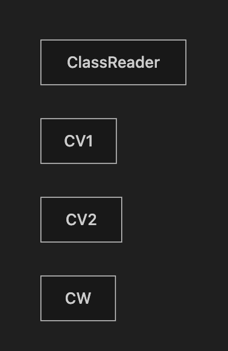
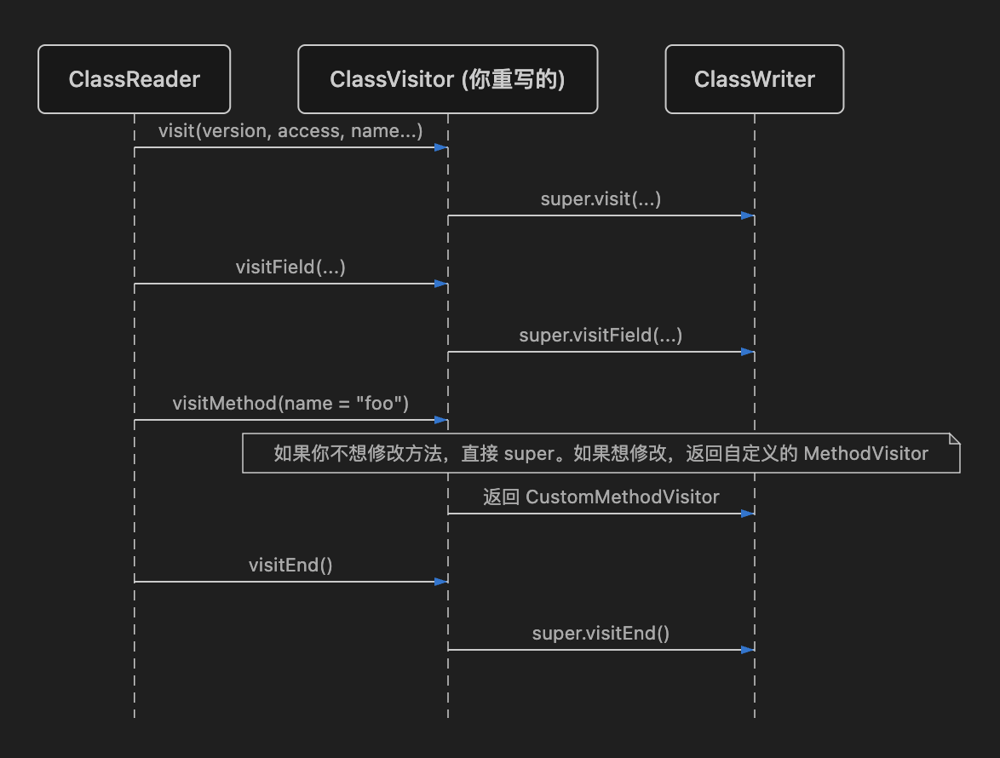

# ASM 字节码操作详解：从入门到精通

> 本文由内部知识库文档整理为 GitHub 可直接阅读的 Markdown。已移除原始内部链接、附件直链、账号标识、组织域名等公司相关信息。
> 图片已下载到 `image/`，附件已下载到 `file/` 并使用相对路径引用；可导出的文本绘图、代码块与表格已尽量保留。

ASM 是一个强大、高性能的 Java 字节码操作和分析框架。它被广泛应用于动态代理（CGLIB）、AOP 框架（Spring）、静态分析工具以及 Android 编译期插桩（AGP Transform / AsmClassVisitorFactory）中。

## 1、ASM 核心架构与 API 分类

ASM 提供了两种不同的 API 模型来处理字节码：

**1、Core API (基于事件/访问者模式)**：类似于 XML 的 SAX 解析。它以事件流的形式逐个扫描字节码指令，**内存占用极小，执行速度极快**。大多数生产环境（包括你的项目）都使用它。

**2、Tree API (基于对象树)**：类似于 XML 的 DOM 解析。它将整个类加载到内存中，构建成一棵由 ClassNode、MethodNode 等组成的对象树。适合需要进行复杂控制流分析或大幅度改变代码结构的场景。

### Core API 核心类铁三角

Core API 建立在三个核心类之上：



- **ClassReader**：负责读取 .class 文件的字节数组，并触发相关的 visitXxx 事件。
- **ClassVisitor**：负责接收 ClassReader 发出的事件。开发者可以通过继承它并重写相应的方法来拦截和修改字节码。
- **ClassWriter**：ClassVisitor 的一个实现类。它的作用是将接收到的 visitXxx 事件重新拼装回 .class 字节数组。

## 2、JVM 字节码前置基础（必知必会）

在使用 ASM 之前，必须了解 JVM 是如何表示类名和类型的，这与我们平时写的 Java/Kotlin 代码不同。

### 2.1 内部名 (Internal Name)

在字节码中，类的全限定名使用 / 替代 .。

- java.lang.String → java/lang/String
- com.Example.mower.MainActivity → com/Example/mower/MainActivity

### 2.2 类型描述符 (Type Descriptor)

JVM 使用简短的字符来表示数据类型：


| Java 类型 | 字节码描述符 | 记忆方法 |
| --- | --- | --- |
| int | I | Integer |
| boolean | Z | Zero (底层用 0/1 表示) |
| char | C | Char |
| void | V | Void |
| long | J | J (L 被对象占了，顺延用 J) |
| Object (对象) | Ljava/lang/Object; | L + 内部名 + ; |
| int[] (数组) | [I | [ 表示一维数组 |
| String[][] | [[Ljava/lang/String; | [[ 表示二维数组 |


### 2.3 方法描述符 (Method Descriptor)

格式为：(参数描述符)返回值描述符。**注意括号内没有逗号和空格**。

- void m(int i, float f) → (IF)V
- int m(Object o) → (Ljava/lang/Object;)I
- String m(int[] i, String s) → ([ILjava/lang/String;)Ljava/lang/String;

## 3、ClassVisitor 访问顺序与生命周期

ClassReader 调用 ClassVisitor 的方法是**有严格顺序要求**的。官方文档中定义的调用序列如下：

```kotlin
visit
[visitSource]
[visitModule]
[visitNestHost]
[visitPermittedSubclass]
[visitOuterClass]
( visitAnnotation | visitTypeAnnotation | visitAttribute )*
( visitNestMember )*
( visitInnerClass )*
( visitRecordComponent )*
( visitField | visitMethod )*
visitEnd
```

- **必定调用 1 次**：visit (开始) 和 visitEnd (结束)。
- **任意次调用**：visitField (字段) 和 visitMethod (方法)，每遇到一个字段/方法就调用一次。



## 4、实战 Demo：从入门到高级应用

下面提供可以直接在本地运行的 API 示例代码（以 Kotlin 为例，Java 同理）。需要引入 org.ow2.asm:asm:9.6，在你的项目中，因为 kotlin-compiler-embeddable 已经 Shade 了 ASM（org.jetbrains.org.objectweb.asm.\*），你可以直接使用。

#### Demo 1：无中生有 —— 动态生成一个类

我们不依赖源代码，凭空生成一个 public class HelloWorld { public static void main(String[] args) { println("Hello"); } } 的字节码。

```kotlin
package org.example
import org.objectweb.asm.ClassWriter
import org.objectweb.asm.MethodVisitor
import org.objectweb.asm.Opcodes
import java.io.File
//TIP To <b>Run</b> code, press <shortcut actionId="Run"/> or
// click the <icon src="AllIcons.Actions.Execute"/> icon in the gutter.
fun main() {
    generateHelloWorldClass()
}

fun generateHelloWorldClass() {
    // 1. 创建 ClassWriter (0 表示手动计算最大栈大小和局部变量表，COMPUTE_FRAMES 表示自动计算)
    val cw = ClassWriter(ClassWriter.COMPUTE_FRAMES)
    // 2. 定义类头部 (JDK 1.8, public, 类名, 父类是 Object)
    cw.visit(Opcodes.V1_8, Opcodes.ACC_PUBLIC, "com/example/HelloWorld", null, "java/lang/Object", null)
    // 3. 生成默认构造函数 <init>
    // public HelloWorld() { super(); }
    val mvInit = cw.visitMethod(Opcodes.ACC_PUBLIC, "<init>", "()V", null, null)
    mvInit.visitCode()
    mvInit.visitVarInsn(Opcodes.ALOAD, 0) // 将 this 压栈
    mvInit.visitMethodInsn(Opcodes.INVOKESPECIAL, "java/lang/Object", "<init>", "()V", false) // 调用父类构造
    mvInit.visitInsn(Opcodes.RETURN)      // 返回
    mvInit.visitMaxs(0, 0)                // 由于开启了 COMPUTE_FRAMES，这里传 0 即可
    mvInit.visitEnd()
    // 4. 生成 main 方法
    // public static void main(String[] args) { System.out.println("Hello ASM!"); }
    val mvMain = cw.visitMethod(Opcodes.ACC_PUBLIC + Opcodes.ACC_STATIC, "main", "([Ljava/lang/String;)V", null, null)
    mvMain.visitCode()
    // 获取 System.out 静态字段
    mvMain.visitFieldInsn(Opcodes.GETSTATIC, "java/lang/System", "out", "Ljava/io/PrintStream;")
    // 将字符串常量压栈
    mvMain.visitLdcInsn("Hello ASM!")
    // 调用 println 方法
    mvMain.visitMethodInsn(Opcodes.INVOKEVIRTUAL, "java/io/PrintStream", "println", "(Ljava/lang/String;)V", false)
    mvMain.visitInsn(Opcodes.RETURN)
    mvMain.visitMaxs(0, 0)
    mvMain.visitEnd()
    cw.visitEnd()
    // 5. 写入文件
    val bytes = cw.toByteArray()
    println("user.dir = " + System.getProperty("user.dir"))
    val out = File("com/example/HelloWorld.class")
    out.parentFile.mkdirs()
    out.writeBytes(bytes)
    println("written = " + out.absolutePath + ", exists=" + out.exists())
}
```

#### Demo 2：代码注入 AOP —— 给方法添加耗时统计

这是 Android 性能监控中最常用的手段。我们要在每个方法的开头记录当前时间，在 return 前计算耗时。

**目标代码转换前：**

```kotlin
public void doWork() {
    Thread.sleep(1000);
}
```

**目标代码转换后：**

```kotlin
public void doWork() {
    long startTime = System.currentTimeMillis();
    Thread.sleep(1000);
    long duration = System.currentTimeMillis() - startTime;
    System.out.println("Cost: " + duration);
}
```

**ASM 实现代码：**

```kotlin
package org.example

import org.objectweb.asm.*

class TimingClassVisitor(cw: ClassVisitor) : ClassVisitor(Opcodes.ASM9, cw) {
    private lateinit var className: String

    override fun visit(version: Int, access: Int, name: String, signature: String?, superName: String?, interfaces: Array<out String>?) {
        className = name
        super.visit(version, access, name, signature, superName, interfaces)
    }

    override fun visitMethod(access: Int, name: String, descriptor: String, signature: String?, exceptions: Array<out String>?): MethodVisitor {
        var mv = super.visitMethod(access, name, descriptor, signature, exceptions)
        // 过滤掉构造函数和静态初始化块
        if (name != "<init>" && name != "<clinit>") {
            // 返回自定义的 MethodVisitor 来拦截方法内部指令
            mv = TimingMethodVisitor(mv, className, name)
        }
        return mv
    }
}

class TimingMethodVisitor(mv: MethodVisitor, private val className: String, private val methodName: String)
    : MethodVisitor(Opcodes.ASM9, mv) {

    private var timeLocalVarIndex = -1 // 用于存储局部变量槽的索引

    // 1. 在方法刚进入时（visitCode）注入：startTime = System.currentTimeMillis()
    override fun visitCode() {
        super.visitCode()
        mv.visitMethodInsn(Opcodes.INVOKESTATIC, "java/lang/System", "currentTimeMillis", "()J", false)

        // 这里的难点是局部变量表：我们需要分配一个新的槽位来存 long 类型。
        // 为了简单演示，假设我们硬编码将其存入局部变量表较后的位置（如索引 50），
        // 实际开发中应该使用 LocalVariablesSorter 工具类来自动分配未使用的索引。
        timeLocalVarIndex = 50
        mv.visitVarInsn(Opcodes.LSTORE, timeLocalVarIndex)
    }

    // 2. 拦截所有的 return 指令（包括正常的 RETURN，IRETURN 等），在返回前注入耗时计算逻辑
    override fun visitInsn(opcode: Int) {
        if ((opcode >= Opcodes.IRETURN && opcode <= Opcodes.RETURN) || opcode == Opcodes.ATHROW) {
            // duration = System.currentTimeMillis() - startTime
            mv.visitMethodInsn(Opcodes.INVOKESTATIC, "java/lang/System", "currentTimeMillis", "()J", false)
            mv.visitVarInsn(Opcodes.LLOAD, timeLocalVarIndex)
            mv.visitInsn(Opcodes.LSUB)

            // 下面这段稍微复杂，等价于 System.out.println("Method ... cost: " + duration)
            // 简单起见，我们直接调用一个专门的耗时打印工具类
            // mv.visitMethodInsn(Opcodes.INVOKESTATIC, "com/example/LogUtil", "printCost", "(J)V", false)

            // 为了演示直接输出，简化如下（打印 duration long值本身）：
            val tempDurationIndex = 52
            mv.visitVarInsn(Opcodes.LSTORE, tempDurationIndex) // 暂存耗时

            mv.visitFieldInsn(Opcodes.GETSTATIC, "java/lang/System", "out", "Ljava/io/PrintStream;")
            mv.visitVarInsn(Opcodes.LLOAD, tempDurationIndex)
            mv.visitMethodInsn(Opcodes.INVOKEVIRTUAL, "java/io/PrintStream", "println", "(J)V", false)
        }
        super.visitInsn(opcode)
    }
}
```

局部变量表的坑 MethodVisitor 操作最困难的部分在于操作栈和局部变量表。在方法中插入新变量时，必须小心计算索引，尤其是 long 和 double 会占用 2 个 Slot（槽位）。在实际项目中，继承 org.objectweb.asm.commons.LocalVariablesSorter 或 AdviceAdapter 可以极大简化注入逻辑。

调用方式：

```kotlin
package org.example

import org.objectweb.asm.ClassReader
import org.objectweb.asm.ClassWriter
import java.io.File

fun instrumentClass(inputClassFile: String, outputClassFile: String) {
    val originBytes = File(inputClassFile).readBytes()

    val cr = ClassReader(originBytes)
    val cw = ClassWriter(cr, ClassWriter.COMPUTE_FRAMES or ClassWriter.COMPUTE_MAXS)
    val cv = TimingClassVisitor(cw)

    cr.accept(cv, ClassReader.EXPAND_FRAMES)
    val newBytes = cw.toByteArray()

    File(outputClassFile).parentFile?.mkdirs()
    File(outputClassFile).writeBytes(newBytes)
    println("instrumented -> $outputClassFile")
}

fun main() {
    // 例子：把编译好的 com.example.Demo.class 增强后输出
    instrumentClass(
        inputClassFile = "build/classes/kotlin/main/org/example/Demo.class",
        outputClassFile = "build/instrumented/org/example/Demo.class"
    )
}
```

#### Demo 3：结合项目实战 —— 精准丢弃特定行号 (覆盖率死探针剔除)

在你的项目 InstrumentCoverageTask 中，正是使用了 ASM 精妙地解决了 Kotlin inline 函数导致的覆盖率幽灵/死探针问题。这属于典型的**过滤型拦截**。

**核心思想**：拦截 visitMethod → 在自定义 MethodVisitor 中拦截 visitLineNumber → 选择性丢弃不需要的行号指令。

```kotlin
// 抽取自 InstrumentCoverageTask，这是非常高级且优雅的用法
private fun remapClassLines(classBytes: ByteArray): ByteArray {
    val reader = ClassReader(classBytes)
    
    // ... 第一遍扫描省略，假设我们已经找出了 inline 函数的方法签名集合
    val inlineMethods = setOf("foo()V") 
    // ... 假设解析 SMAP 得到了行号映射
    val lineMapping = mapOf(10 to 5) 

    val writer = ClassWriter(0) 
    
    // 第二遍扫描修改
    reader.accept(object : ClassVisitor(Opcodes.ASM9, writer) {
        override fun visitMethod(
            access: Int, name: String, descriptor: String,
            signature: String?, exceptions: Array<out String>?
        ): MethodVisitor {
            val mv = super.visitMethod(access, name, descriptor, signature, exceptions)
            val isOriginalInlineMethod = inlineMethods.contains("$name$descriptor")

            // 返回一个包装过的 MethodVisitor 拦截指令
            return object : MethodVisitor(Opcodes.ASM9, mv) {
                // visitLineNumber 代表字节码中的 LineNumberTable 记录
                // JaCoCo 就是靠这个来对齐源码行号渲染绿/红色的
                override fun visitLineNumber(line: Int, start: org.objectweb.asm.Label) {
                    if (isOriginalInlineMethod) {
                        // 拦截！如果是原始的 inline 函数，我们直接 return，不调用 super
                        // 这样生成的字节码里，这行记录就被完全删除了！探针将无视这里。
                        return
                    }
                    // 修改事件参数：替换为真实的源文件物理行号
                    val remapped = lineMapping[line] ?: line
                    super.visitLineNumber(remapped, start)
                }
            }
        }
    }, 0)

    return writer.toByteArray()
}
```

## 5、高级特性与避坑指南

### 5.1 ClassWriter 的栈帧计算标志

当你创建 ClassWriter 时，构造函数参数非常关键：

1、ClassWriter(0)：不会自动计算方法的操作数栈大小（Max Stack）和局部变量表大小（Max Locals），你需要自己通过 mv.visitMaxs(maxStack, maxLocals) 准确计算传入。如果算错了，在运行或者类加载阶段 JVM 校验器会直接抛出 VerifyError 异常导致崩溃。

2、ClassWriter(ClassWriter.COMPUTE_MAXS)：ASM 会自动帮你计算操作数栈和局部变量表的大小。速度稍慢一点（约 10%）。

3、ClassWriter(ClassWriter.COMPUTE_FRAMES)：最傻瓜、最安全的模式。从 Java 7 开始引入了 StackMapFrame，这个标志会让 ASM 自动从头计算整个方法的控制流并重建帧图。**性能损失较大（可能慢一倍）**，但你再也不需要担心栈帧校验错误。

> NOTE
> 
> 在 InstrumentCoverageTask 中使用了 ClassWriter(0)，因为在这个 task 中，我们**并没有添加或删除任何会对操作数栈深度/局部变量个数造成影响的字节码指令**，我们只修改了非指令属性（visitLineNumber），因此原始字节码的栈帧依然完全正确，传 0 是性能最高的做法。

### 5.2 如何阅读/编写自己不熟的字节码指令？

在编写 MethodVisitor 时，最痛苦的是不知道 Java 代码对应的 ASM API 该怎么写。 **神器推荐：ASM Bytecode Outline 插件（IDEA 插件）。**

你可以：

先写好 Java/Kotlin 目标代码

编译出 .class

右键该文件，使用插件查看 "ASMified" 代码。

插件会直接生成一模一样的 ASM Java 代码！你只需要把这段代码复制过来，把其中写死的变量改成动态插入即可。

## 6、Tree API (树形 API) 简介

除了上面讲的 ClassVisitor，ASM 还提供了 tree 包下的 ClassNode 体系。

```kotlin
import org.objectweb.asm.ClassReader
import org.objectweb.asm.tree.ClassNode

// 将整个类读取成一个完整的对象树，放进内存
val classNode = ClassNode()
val cr = ClassReader(bytes)
cr.accept(classNode, 0)

// 此时 classNode.methods 包含了所有的 MethodNode
classNode.methods.forEach { methodNode ->
    println("Method: ${methodNode.name}")
    // 可以直接遍历指令列表（双向链表），方便做前向/后向分析，或复杂的指令重排
    methodNode.instructions.iterator().forEach { insnNode ->
        // ...
    }
}

// 修改完毕后，再转换回字节数组
val cw = ClassWriter(ClassWriter.COMPUTE_MAXS)
classNode.accept(cw)
val newBytes = cw.toByteArray()
```

**对比总结**：

如果你是做简单的插桩（首尾加日志、过滤注解、删行号），坚定使用 **Core API (Visitor)**。

如果你要做代码混淆（修改控制流图、指令乱序重排）、复杂的静态数据流分析（查找未使用的变量、空指针分析），使用 **Tree API** 会轻松得多，因为它允许你随意前后游走，而 Visitor 模式只能单向从头扫到尾。
