# App 加固 详解

> 本文由内部知识库文档整理为 GitHub 可直接阅读的 Markdown。已移除原始内部链接、附件直链、账号标识、组织域名等公司相关信息。
> 图片已下载到 `image/`，附件已下载到 `file/` 并使用相对路径引用；可导出的文本绘图、代码块与表格已尽量保留。

## 1、加固简介

Android App 加固，本质上是：

> *在不改变 App 原有业务逻辑的前提下，把原 APK 的核心代码、资源或 so 做加密/混淆/校验，然后外面包一层“壳”，运行时由壳负责解密、加载、校验和防护*

可以简单理解成：

```java
原 APK
  ↓
加固工具处理
  ↓
壳代码 + 加密后的原始代码/资源/so
  ↓
重新打包签名
  ↓
加固 APK
```

加固后的 APK 表面上看，入口变成了壳的入口；但运行起来之后，壳会把真正的业务代码加载回来，所以用户看到的功能还是原来的功能。

## 2、加固主要解决什么问题？

加固的作用一般有几类：


| 目标 | 说明 |
| --- | --- |
| 防静态分析 | 让别人直接反编译 APK 时看不到完整业务代码 |
| 防代码篡改 | APK 被改后运行时检测出来 |
| 防二次打包 | 防止别人改包名、插广告、植入恶意代码后重新签名发布 |
| 防调试 | 检测 debugger、ptrace、frida、xposed 等环境 |
| 防 Hook | 检测 Java 层/Native 层 Hook 框架 |
| 防 so 逆向 | 对 native so 做加密、压缩、符号处理 |
| 防资源泄露 | 对关键 assets、配置、模型文件等做加密 |
| 保护算法/协议 | 防止关键算法、接口签名逻辑被直接反编译 |
| 完整性校验 | 校验 dex、so、签名、证书指纹、包结构是否被改 |


但要注意：

> *加固不是绝对安全，它是提高逆向和篡改成本。*

因为 App 最终必须在用户设备上运行，代码总会在某个时刻被解密、加载、执行。只要在攻击者可控设备上运行，就不存在绝对不可逆。

## 3、加固前后的 APK 长什么样？

### 3.1 原始 APK

一个普通 APK 大概是：

```java
origin.apk
├── AndroidManifest.xml
├── classes.dex
├── classes2.dex
├── resources.arsc
├── res/
├── assets/
├── lib/
│   ├── arm64-v8a/libxxx.so
│   └── armeabi-v7a/libxxx.so
└── META-INF/ 或 APK Signing Block
```

业务代码主要在：

```java
classes.dex
classes2.dex
...
```

Native 代码主要在：

```java
lib/arm64-v8a/*.so
```

资源在：

```java
res/
resources.arsc
assets/
```

### 3.2 加固后的 APK

加固后可能变成：

```java
protected.apk
├── AndroidManifest.xml
├── classes.dex                  # 壳 dex，体积通常较小
├── assets/
│   ├── encrypted_payload.bin     # 加密后的原 dex / so / 配置
│   └── shell_config.bin
├── lib/
│   ├── arm64-v8a/libshell.so     # 壳 native loader
│   └── armeabi-v7a/libshell.so
├── res/
├── resources.arsc
└── APK Signing Block
```

核心变化是：

```java
原 classes.dex 被加密藏起来
新的 classes.dex 是壳代码
壳代码负责运行时恢复原 App
```

图：


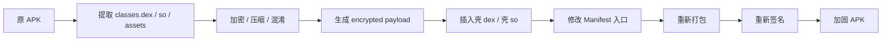


## 4、加固最核心的技术：壳

加固里的“壳”一般包含两部分：

```java
Java 壳
Native 壳
```

### 4.1 Java 壳

Java 壳通常负责：

```java
接管 Application 入口
准备运行环境
调用 native 壳
替换 ClassLoader
恢复原 Application
代理生命周期
```

常见入口：

```typescript
public class ShellApplication extends Application {

    @Override
    protected void attachBaseContext(Context base) {
        super.attachBaseContext(base);

        // 1. 初始化壳
        // 2. 加载 native 壳
        // 3. 解密原 dex
        // 4. 创建 ClassLoader
        // 5. 替换系统 ClassLoader
        // 6. 准备原 Application
    }

    @Override
    public void onCreate() {
        super.onCreate();

        // 调用原 Application.onCreate()
    }
}
```

### 4.2 Native 壳

Native 壳一般是 .so，负责更敏感的逻辑：

```java
解密算法
完整性校验
反调试
反 Hook
dex 解密
so 解密
内存加载
环境检测
```

为什么很多加固逻辑放 native？

因为 Java 层更容易反编译，而 native 层逆向成本更高一些。不是不能逆，而是成本更高。

## 5、加固运行时发生了什么？

加固 APK 安装后，Android 系统看到的是一个正常 APK。启动时，系统先启动壳 Application。

运行流程大概是：


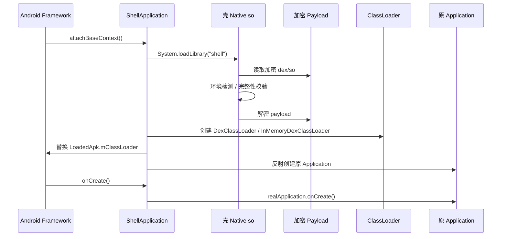


关键点：

```java
系统启动的是壳
壳恢复原 App
恢复后业务代码继续按原逻辑运行
```

## 6、为什么加固后不会影响 App 功能？

这是重点。

加固之所以理论上不影响功能，是因为它不是重写你的业务逻辑，而是：

```java
把原业务代码加密保存
运行时再解密加载
最终执行的还是原来的代码
```

也就是：

```java
原 App：
Android Framework -> 原 Application -> 原业务代码

加固 App：
Android Framework -> 壳 Application -> 解密加载 -> 原 Application -> 原业务代码
```

图：


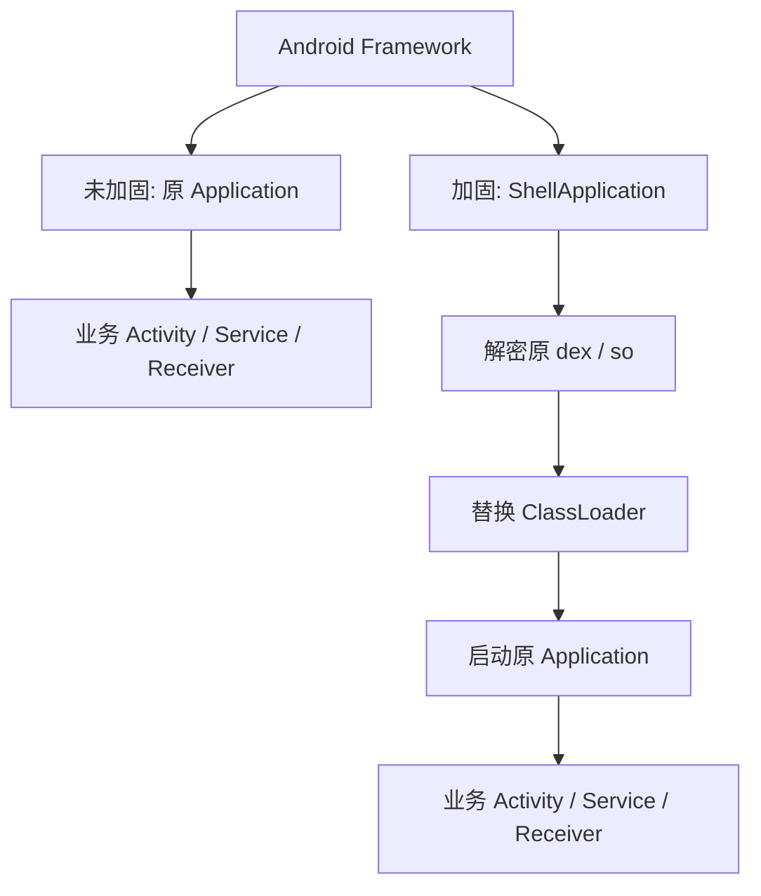


最终业务路径仍然是：

```java
原 Application
原 Activity
原 Service
原 Receiver
原业务 class
```

壳只是多了一层启动前置逻辑。

## 7、具体为什么能保持功能不变？

### 7.1 Manifest 里的组件还在

你的原始 App 可能有：

```xml
<application
    android:name=".MyApplication">

    <activity android:name=".MainActivity" />
    <service android:name=".PushService" />
    <receiver android:name=".BootReceiver" />

</application>
```

加固后，工具通常会改成：

```xml
<application
    android:name="com.shell.ShellApplication">

    <meta-data
        android:name="REAL_APPLICATION"
        android:value="com.xxx.MyApplication" />

    <activity android:name=".MainActivity" />
    <service android:name=".PushService" />
    <receiver android:name=".BootReceiver" />

</application>
```

注意：

```java
application 入口变成壳
activity/service/receiver 仍然保留
原 Application 名字被记录下来
```

壳启动后会恢复原 Application。

### 7.2 ClassLoader 被替换或追加

Android 加载 Java 类靠 ClassLoader。

原来：

```java
PathClassLoader -> classes.dex
```

加固后：

```java
Shell ClassLoader -> 壳 dex
Real DexClassLoader -> 解密后的原 dex
```

壳会把原 dex 加进类加载路径，让系统后续能找到原来的类。

简化模型：


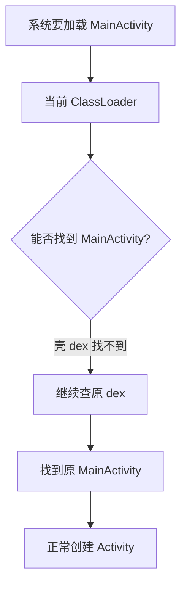


所以 Activity、Service 等还是能正常启动。

### 7.3 原 Application 生命周期被代理

壳需要处理原 Application 的生命周期。

正常 App：

```java
Application.attachBaseContext()
Application.onCreate()
```

加固后：

```java
ShellApplication.attachBaseContext()
  -> 解密加载
  -> 创建 RealApplication
  -> 调用 RealApplication.attachBaseContext()

ShellApplication.onCreate()
  -> 调用 RealApplication.onCreate()
```

只要代理做得正确，原 App 的初始化逻辑就能跑。

### 7.4 原 dex 解密后语义不变

加固一般不会改变原 dex 的语义，只是：

```java
编译产物 dex
  ↓
加密保存
  ↓
运行时解密
  ↓
交给 ART 执行
```

所以执行结果还是原来的结果。

## 8、它是怎么做到“加密”的？

加固里的“加密”通常分几类。

### 8.1 Dex 加密

最常见。

原始 APK 里：

```java
classes.dex = 明文 dex
```

加固后：

```java
classes.dex = 壳 dex
assets/payload.bin = 加密后的原 dex
```

运行时：

```java
读取 payload.bin
校验环境
解密 dex
加载 dex
```

流程：


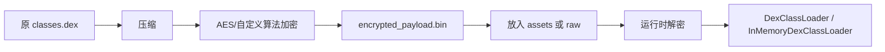


### 8.2 Method 级别加密 / 抽取

有些加固不会简单加密整个 dex，而是做更细粒度处理。

比如：

```java
把某些方法体抽走
原方法里只保留壳调用
运行时再恢复方法体
```

原始方法：

```java
public String sign(String data) {
    return md5(data + secret);
}
```

加固后反编译可能看到：

```java
public String sign(String data) {
    return Shell.invoke(10001, data);
}
```

真正逻辑藏在加密数据或 native 里。

这种叫：

```java
函数抽取
方法体加密
指令替换
```

优点：

```java
静态反编译看不到关键逻辑
```

风险：

```java
兼容性和性能成本更高
```

### 8.3 字符串加密

原始代码里可能有：

```java
private static final String API_KEY = "abc123";
private static final String HOST = "https://api.xxx.com";
```

反编译容易直接看到。

加固后变成：

```java
private static final String API_KEY = StringDecoder.decode("A91F...");
```

运行时再还原。

作用：

```java
隐藏接口地址
隐藏 key
隐藏协议字段
隐藏错误提示
```

但注意：

> *字符串运行时总要变成明文，否则业务用不了，所以它只能提高静态分析成本。*

### 8.4 so 加密

Native so 也可以加密。

原始：

```java
lib/arm64-v8a/libbusiness.so
```

加固后：

```java
assets/libbusiness_arm64.enc
lib/arm64-v8a/libshell.so
```

运行时：

```java
壳 so 解密 libbusiness.so
写入私有目录或内存加载
System.load(...)
```

流程：


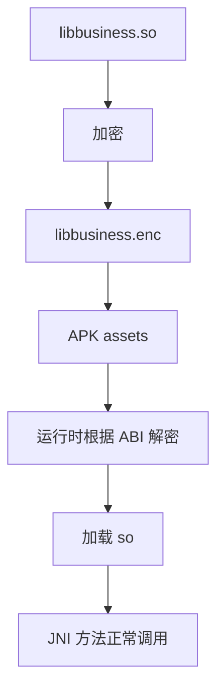


### 8.5 资源加密

资源分两种：

```java
res/ 资源
assets/ 资源
```

#### assets 更容易加密

比如：

```java
assets/config.json
assets/model.bin
assets/cert.pem
```

可以加密成：

```java
assets/config.enc
```

业务读取时通过壳 SDK 解密。

#### res 不一定适合全量加密

res/layout、resources.arsc、drawable 等 Android 系统启动和资源解析早期就要用。全量加密会影响系统资源加载。

所以很多加固方案不会完全加密 res，而是：

```java
加密关键 assets
混淆资源名
压缩无用资源
校验 resources.arsc 完整性
```

## 9、加固为什么不影响 Android 签名？

这里要注意顺序。

Android APK 签名保护的是：

```java
APK 打包完成后的内容
```

加固会修改 APK 内容，所以必须：

```java
先加固
再签名
```

正确流程：


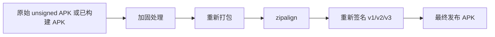


如果你：

```java
先签名
再加固
```

加固会修改 APK，签名就失效。

所以加固平台一般会要求：

```java
上传 APK
加固后下载 unsigned/aligned APK
本地重新签名
```

或者平台帮你签名。

## 10、加固的核心模块有哪些？

一个完整加固方案通常包括这些模块：


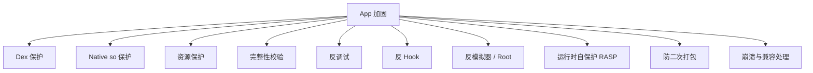


### 10.1 Dex 保护

常见能力：

```java
dex 加密
dex 压缩
方法抽取
指令变形
控制流混淆
字符串加密
类名/方法名混淆增强
```

作用：

```java
降低 jadx / apktool / dex2jar 直接分析效果
```

### 10.2 Native so 保护

常见能力：

```java
so 加密
符号表清理
JNI 方法动态注册
反调试
反 dump
代码段校验
native 层控制流混淆
```

作用：

```java
保护 C/C++ 里的算法、协议、密钥处理逻辑
```

### 10.3 完整性校验

运行时校验：

```java
APK 签名证书
包名
classes.dex hash
resources.arsc hash
so hash
Manifest hash
安装路径
```

比如：

```java
当前签名 SHA-256 是否等于官方签名？
当前包名是否等于 com.xxx.app？
当前 dex hash 是否被改？
```

一旦不一致：

```java
退出
限制功能
上报风险
拒绝登录
```

### 10.4 防二次打包

攻击者常见流程：

```java
解包 APK
修改 dex
插广告 SDK
重新打包
用自己的 key 签名
发布
```

加固防二次打包通常靠：

```java
签名证书校验
包名校验
APK hash 校验
运行时环境校验
服务端校验
```

其中最重要的是：

```java
签名证书校验
```

因为二次打包后一定会换签名，除非攻击者拿到你的私钥。

### 10.5 反调试

检测：

```java
Debugger.isDebuggerConnected()
TracerPid
ptrace
JDWP
断点行为
调试端口
/proc/self/status
```

目的：

```java
增加动态调试难度
```

### 10.6 反 Hook

检测：

```java
Xposed
Frida
Substrate
inline hook
PLT/GOT hook
Java method hook
native function hook
```

可能做：

```java
扫描 maps
扫描可疑 so
检查方法入口
检查内存页权限
检查调用栈
校验函数 prologue
```

作用：

```java
防止关键函数被替换
防止接口签名、支付、登录逻辑被 Hook
```

### 10.7 RASP

RASP 是 Runtime Application Self-Protection，运行时自保护。

它不是单纯加密，而是在运行时持续判断环境是否可信。

比如：

```java
是否 root
是否模拟器
是否有调试器
是否有 Hook 框架
签名是否异常
so 是否被改
是否运行在多开环境
是否注入未知 so
```

发现风险后可以：

```java
上报
弹窗
退出
降级功能
拒绝敏感操作
服务端风控
```

## 11、加固和混淆有什么区别？


| 能力 | ProGuard/R8 混淆 | 加固 |
| --- | --- | --- |
| 改类名方法名 | 支持 | 支持或增强 |
| 删除无用代码 | 支持 | 一般不负责 |
| 优化字节码 | 支持 | 有些支持 |
| Dex 加密 | 不支持 | 支持 |
| 运行时解密加载 | 不支持 | 支持 |
| 反调试 | 不支持 | 支持 |
| 防 Hook | 不支持 | 支持 |
| 签名校验 | 不支持 | 支持 |
| 防二次打包 | 弱 | 强一些 |
| 兼容风险 | 低 | 中高 |
| 性能影响 | 通常较低 | 可能影响启动 |


一般推荐：

```java
R8 混淆 + 加固 + 服务端风控
```

而不是只靠其中一个。

## 12、加固会带来哪些副作用？

加固不是零成本的。

### 12.1 启动变慢

因为启动时多了：

```java
壳初始化
环境检测
payload 解密
dex 加载
Application 代理
```

尤其大 dex、多 dex、大 so，冷启动可能明显变慢。

### 12.2 崩溃栈变复杂

崩溃堆栈可能出现壳类：

```java
ShellApplication
ShellClassLoader
Native loader
```

如果加固同时做了方法抽取/混淆，定位问题更困难。

### 12.3 兼容性问题

容易出问题的点：

```java
MultiDex
热修复
插件化
动态加载
反射
JNI
ContentProvider 初始化
App Startup
Hilt/Dagger
ARouter/TheRouter
Flutter/React Native
WebView 预加载
Instant Run/Apply Changes
Split APK / Dynamic Feature
Android 12/13/14/15 系统限制
```

比如 ContentProvider 初始化顺序很早，如果壳还没把原 dex 加载好，Provider 类找不到，就会崩。

### 12.4 和加固前签名不一致

如果加固后重新签名用了不同 keystore，会导致：

```java
无法覆盖安装线上版本
第三方 SDK 签名校验失败
微信/地图/推送 SDK 绑定签名不匹配
```

所以 release 加固后必须用正式签名。

### 12.5 调试不方便

Debug 包一般不建议重度加固，否则：

```java
断点不好打
热部署失效
日志不完整
崩溃难定位
```

通常是：

```java
debug 不加固
release 或灰度包加固
```

## 13、为什么加固能防篡改？

假设攻击者改了 APK：

```java
classes.dex 被改
so 被改
资源被改
签名被换
```

加固运行时可以检查：

```java
当前 APK 签名证书 == 官方证书？
当前 dex hash == 预期 hash？
当前 so hash == 预期 hash？
当前 payload 是否能正确解密？
当前包名是否正确？
```

如果不一致：

```java
直接崩溃 / 退出 / 上报 / 限制功能
```

图：


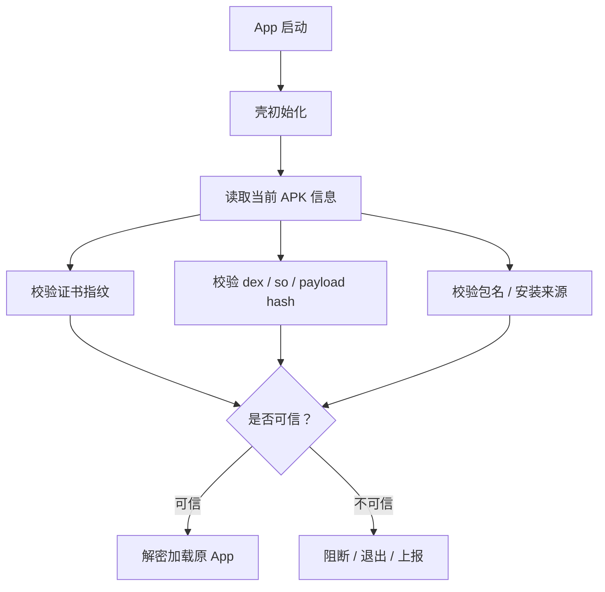


## 14、为什么加固能防静态分析？

未加固时，攻击者拿到 APK：

```java
jadx app.apk
```

可能直接看到：

```java
public class LoginManager {
    public String sign(...) {
        ...
    }
}
```

加固后，APK 里明面上的 classes.dex 主要是壳代码：

```java
public class ShellApplication {
    ...
}
```

真正业务 dex 可能是：

```java
assets/payload.bin
```

而且是加密的。

所以静态分析看到的是：

```java
壳逻辑
加密数据
少量代理方法
```

看不到完整业务逻辑。

## 15、为什么加固不能保证绝对安全？

因为 Android App 必须在设备上运行。

只要运行，就会有某个时刻：

```java
dex 被解密
class 被加载
方法被执行
字符串被还原
so 被加载
```

攻击者如果有足够能力，可以从运行时下手：

```java
内存 dump
动态调试
Hook 解密函数
Hook ClassLoader
抓取明文字符串
抓包
模拟业务请求
```

所以加固的定位应该是：

```java
增加成本
拖慢攻击
过滤低成本攻击
配合服务端风控
```

不是：

```java
绝对防逆向
绝对防破解
绝对防抓包
```

## 16、加固和服务端风控应该怎么配合？

如果你的核心风险是接口被刷、业务被盗用、支付被绕过，只做本地加固不够。

推荐组合：


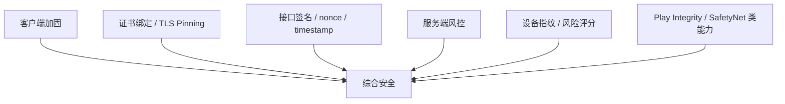


客户端做：

```java
加固
反调试
签名校验
环境检测
接口签名
证书绑定
```

服务端做：

```java
token 校验
重放保护
设备风险评分
异常请求频率控制
版本合法性校验
签名证书指纹校验
黑名单策略
```

核心原则：

> *客户端可以被攻破，服务端不能完全信任客户端。*

## 17、Android 加固常见流程

完整工程流程通常是：


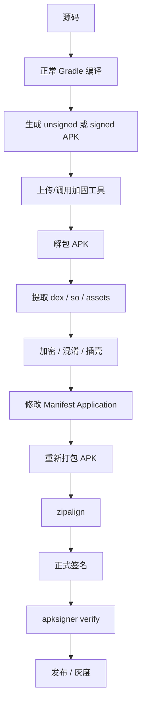


实际 CI 里一般是：

```java
assembleRelease
→ reinforce
→ zipalign
→ apksigner
→ verify
→ upload
```

## 18、接入加固时最容易踩坑的点

### 18.1 Application 被替换

加固会改：

```java
android:name=".MyApplication"
```

变成：

```java
android:name="ShellApplication"
```

如果壳没有正确代理原 Application，业务初始化会丢。

比如：

```java
MMKV 初始化
推送初始化
Flutter 初始化
地图 SDK 初始化
路由初始化
Crash SDK 初始化
```

都可能受影响。

### 18.2 ContentProvider 初始化早于 Application.onCreate

Android 启动顺序里，ContentProvider 很早创建。

如果某个 Provider 在原 dex 里，但壳还没完成加载，就可能：

```java
ClassNotFoundException
```

加固厂商通常要专门处理 Provider。

### 18.3 MultiDex

多 dex 场景：

```java
classes.dex
classes2.dex
classes3.dex
```

加固必须保证所有 dex 都被处理和加载。

否则可能：

```java
某些类找不到
低版本系统启动失败
```

### 18.4 Native so ABI

如果 App 有：

```java
arm64-v8a
armeabi-v7a
```

加固后壳 so 也必须覆盖对应 ABI。

否则某些设备会：

```java
UnsatisfiedLinkError
```

### 18.5 第三方 SDK 签名校验

微信、地图、推送、登录 SDK 经常绑定：

```java
包名
签名 SHA1/SHA256
```

加固后如果重新签名错了，就会导致：

```java
登录失败
地图不可用
推送注册失败
支付失败
```

### 18.6 v2/v3 签名

Android 7+ 对 v2/v3 签名校验更严格。

如果加固后没有正确重新签名，或者签名后又修改了 APK，会导致：

```java
INSTALL_PARSE_FAILED_NO_CERTIFICATES
INSTALL_FAILED_INVALID_APK
```

正确顺序一定是：

```java
加固 → zipalign → 签名 → 验签
```

## 19、加固方案的强度分层

可以按强度分成几档。


| 等级 | 方案 | 说明 |
| --- | --- | --- |
| 基础 | R8 混淆 + 字符串加密 | 成本低，防简单反编译 |
| 中等 | dex 加密 + 壳加载 | 防静态分析明显 |
| 较强 | 方法抽取 + native 壳 | 关键逻辑更难分析 |
| 高强 | 代码虚拟化 VMProtect 类 | 性能成本高，适合少量核心函数 |
| 运行时防护 | 反调试/反 Hook/RASP | 防动态攻击 |
| 业务级 | 服务端风控 | 真正决定安全下限 |


## 20、代码虚拟化是什么？

高级加固有时会做“代码虚拟化”。

它不是简单加密，而是把原始指令转换成自定义虚拟机指令。

原代码：

```java
int result = a + b;
```

可能变成：

```java
VM 指令：
LOAD a
LOAD b
ADD
RETURN
```

运行时由壳里的 VM 解释执行。

图：


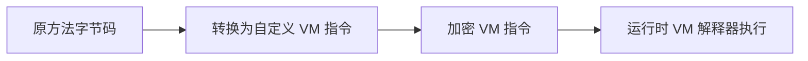


优点：

```java
静态分析难度高
恢复原逻辑成本高
```

缺点：

```java
性能下降明显
兼容风险更高
一般只保护核心函数
```

## 21、加固后为什么还能过系统安装？

因为对 Android 系统来说，加固 APK 仍然是合法 APK：

```java
有 AndroidManifest.xml
有 classes.dex
有资源表
有签名
包结构合法
```

系统并不关心你的 classes.dex 是业务 dex 还是壳 dex。它只关心：

```java
APK 格式是否合法
签名是否合法
Manifest 是否合法
入口类是否能加载
运行时是否崩溃
```

壳类能加载，签名也合法，所以可以安装和启动。

## 22、加固后 APK 体积为什么会变大？

因为加固多了：

```java
壳 dex
壳 so
加密 payload
校验数据
配置数据
冗余保护代码
```

同时原 dex 可能被压缩或加密，但壳自身也有体积。

所以体积变化可能是：

```java
略微变大
明显变大
部分场景压缩后接近原大小
```

## 23、加固后性能为什么可能变差？

主要影响：

```java
冷启动
首次解密
ClassLoader 创建
native 检测
Hook 检测
完整性校验
方法抽取调用开销
虚拟化解释执行开销
```

所以加固策略要分级：

```java
全量 dex 加密：可接受
关键方法抽取：少量使用
代码虚拟化：只保护极少核心方法
高频方法不要虚拟化
启动路径不要做重度保护
```

## 24、加固到底保护了什么？

可以这样理解：

```java
加固主要保护客户端“静态资产”和“运行环境”
```

包括：

```java
dex 代码
so 代码
字符串
关键配置
算法
签名逻辑
接口协议
资源文件
App 完整性
运行环境可信度
```

但它不适合单独承担：

```java
账号安全
支付安全
接口防刷
业务权限
数据最终可信
```

## 25、最后总结

App 加固的核心原理是：

```java
把原 App 的 dex / so / 关键资源加密或变形，
再放入一个壳中，
运行时由壳完成环境检测、完整性校验、解密和动态加载，
最终把执行权交还给原 App。
```

它不影响功能的原因是：

```java
原业务代码没有被删除，只是从“静态明文存在”变成“运行时解密加载”；
壳代理了 Application 和 ClassLoader；
Activity、Service、Receiver 等组件仍然按原逻辑运行。
```

它能加密和防护的原因是：

```java
APK 静态文件里不再直接暴露完整 dex / so / 字符串；
运行时校验签名、hash、环境；
非法修改、二次打包、Hook、调试会被检测或阻断。
```

但它不是绝对安全：

```java
运行时总要解密和执行；
高级攻击者可以从内存和动态行为入手；
所以加固必须配合 R8、服务端风控、接口签名、证书绑定和完整性校验。
```

一句话：

> *加固不是让 App 永远不可破解，而是把“直接反编译就能看懂、改完就能跑”的低成本攻击，提升到需要动态分析、内存对抗、环境绕过和服务端欺骗的高成本攻击。*
