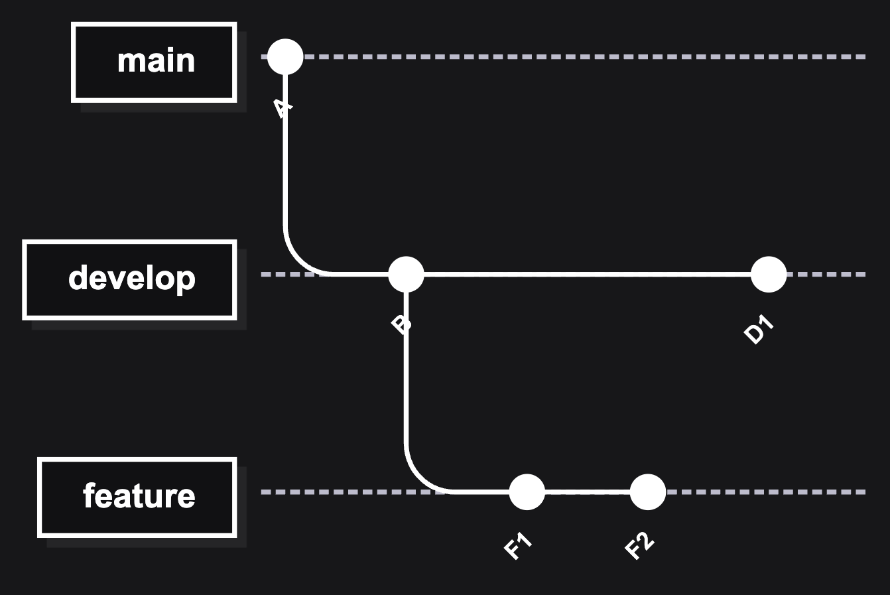
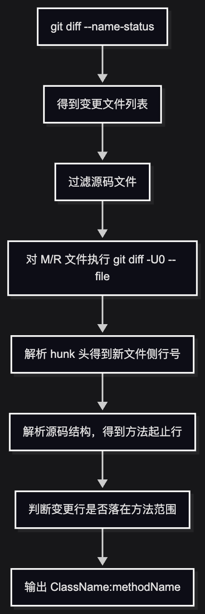

# Git 分支差异获取与结果解析规则

> 本文由内部知识库文档整理为 GitHub 可直接阅读的 Markdown。已移除原始内部链接、附件直链、账号标识、组织域名等公司相关信息。
> 图片已下载到 `image/`，附件已下载到 `file/` 并使用相对路径引用；可导出的文本绘图、代码块与表格已尽量保留。

本文只讨论一个通用问题：如何通过 Git 命令获取两个分支或两个提交之间的差异，以及如何把 Git 命令输出解析成可用于后续处理的数据结构。

这里重点关注三层差异：


| 层级 | 目标 | 常用命令 |
| --- | --- | --- |
| 文件级差异 | 哪些文件新增、修改、删除、重命名 | git diff --name-status base HEAD |
| 行级差异 | 某个文件里哪些新行发生变化 | git diff -U0 base HEAD -- file |
| 方法级差异 | 变更行落在哪些方法里 | 结合 diff 行号和源码解析 |


## 1、分支差异的基本模型

假设当前在功能分支 feature/demo 上，想知道它相对 develop 有哪些变化，最直接的命令是：

```bash
git diff develop HEAD
```

它比较的是：

```bash
develop 指向的代码树  vs  HEAD 指向的代码树
```

其中：


| 名称 | 含义 |
| --- | --- |
| develop | 基准分支，也可以是任意分支名、提交 ID、tag |
| HEAD | 当前检出的提交，通常是当前分支最新提交 |
| git diff A B | 比较 A 和 B 两个提交对应的文件树差异 |




如果当前在 feature，执行：

```bash
git diff develop HEAD
```

比较的是：

```bash
develop 的 D1 代码树
feature 的 F2 代码树
```

这叫“两点 diff”，它看的是两个端点的最终状态差异。

如果要看“当前分支从公共祖先开始引入了哪些变化”，通常更适合用三点 diff：

```bash
git diff develop...HEAD
```

它等价于：

```bash
git diff "$(git merge-base develop HEAD)" HEAD
```

两种写法对比：


| 命令 | 语义 | 适合场景 |
| --- | --- | --- |
| git diff develop HEAD | 比较 develop 和 HEAD 的最终文件树 | 看两个分支当前结果差异 |
| git diff develop...HEAD | 比较公共祖先和 HEAD | PR/MR 增量分析 |
| git merge-base develop HEAD | 找两个提交最近公共祖先 | 构建稳定基线 |


## 2、获取文件级差异

文件级差异通常用：

```bash
git diff --name-status develop HEAD
```

示例输出：

```bash
M        app/src/main/java/com/example/UserManager.kt
A        app/src/main/java/com/example/OrderService.java
D        app/src/main/java/com/example/OldService.java
R100        app/src/main/java/com/example/OldName.kt        app/src/main/java/com/example/NewName.kt
C075        app/src/main/java/com/example/Base.java        app/src/main/java/com/example/BaseCopy.java
```

--name-status 会输出“状态码 + 文件路径”，字段之间通常用 tab 分隔。

## 3、文件状态码解析

常见状态码如下：


| 状态码 | 英文 | 含义 | 输出列数 |
| --- | --- | --- | --- |
| A | Added | 新增文件 | 2 列：状态、新路径 |
| M | Modified | 修改文件 | 2 列：状态、路径 |
| D | Deleted | 删除文件 | 2 列：状态、旧路径 |
| Rxxx | Renamed | 重命名文件，xxx 是相似度 | 3 列：状态、旧路径、新路径 |
| Cxxx | Copied | 复制文件，xxx 是相似度 | 3 列：状态、源路径、新路径 |
| T | Type changed | 文件类型变化 | 2 列 |
| U | Unmerged | 文件存在未解决冲突 | 2 列 |


状态码中的 `xxx` 是 Git 计算出的相似度百分比，例如：

```bash
R100
R087
C075
```

含义分别是：


| 状态 | 含义 |
| --- | --- |
| R100 | 文件重命名，内容 100% 相似 |
| R087 | 文件重命名，内容 87% 相似 |
| C075 | 文件复制，内容 75% 相似 |


## 4、解析 --name-status 输出

普通新增、修改、删除可以按 tab 拆成两列：

```bash
val parts = line.split("\t")
val status = parts[0]
val path = parts[1]
```

例如：

```bash
M        app/src/main/java/com/example/UserManager.kt
```

解析为：

```bash
{"status": "M","path": "app/src/main/java/com/example/UserManager.kt"}
```

但重命名和复制需要三列：

```bash
R100        app/src/main/java/com/example/OldName.kt        app/src/main/java/com/example/NewName.kt
```

解析为：

```json
{"status": "R100","oldPath": "app/src/main/java/com/example/OldName.kt","newPath": "app/src/main/java/com/example/NewName.kt"}
```

解析代码：

```sql
data class ChangedFile(
    val status: String,
    val oldPath: String?,
    val newPath: String?
)

fun parseNameStatusLine(line: String): ChangedFile? {
    if (line.isBlank()) return nullval parts = line.split("\t")
    if (parts.size < 2) return nullval status = parts[0].trim()

    return when {
        status.startsWith("R") && parts.size >= 3 -> {
            ChangedFile(
                status = status,
                oldPath = parts[1].trim(),
                newPath = parts[2].trim()
            )
        }

        status.startsWith("C") && parts.size >= 3 -> {
            ChangedFile(
                status = status,
                oldPath = parts[1].trim(),
                newPath = parts[2].trim()
            )
        }

        status.startsWith("D") -> {
            ChangedFile(
                status = status,
                oldPath = parts[1].trim(),
                newPath = null
            )
        }

        else -> {
            ChangedFile(
                status = status,
                oldPath = null,
                newPath = parts[1].trim()
            )
        }
    }
}
```

解析结果可以进一步分桶：

```kotlin
val addedFiles = files.filter { it.status.startsWith("A") }
val modifiedFiles = files.filter { it.status.startsWith("M") }
val deletedFiles = files.filter { it.status.startsWith("D") }
val renamedFiles = files.filter { it.status.startsWith("R") }
val copiedFiles = files.filter { it.status.startsWith("C") }
```

## 5、文件类型过滤

如果只关心源码文件，可以在文件级结果上做后缀过滤。

例如只保留 Java/Kotlin：

```kotlin
fun isSourceFile(path: String): Boolean {
    return path.endsWith(".java") || path.endsWith(".kt")
}
```

对新增、修改、重命名、复制文件，一般检查新路径：

```kotlin
val targetPath = changedFile.newPath ?: changedFile.oldPath
if (targetPath != null && isSourceFile(targetPath)) {
    // keep
}
```

对删除文件只能检查旧路径，因为新路径不存在。

常见规则可以设计成：


| 文件状态 | 使用路径 | 处理方式 |
| --- | --- | --- |
| A | newPath | 新增文件，分析整个文件 |
| M | newPath | 修改文件，继续分析行级 diff |
| D | oldPath | 删除文件，通常忽略或记录为删除 |
| Rxxx | newPath | 重命名文件，按新路径继续分析 |
| Cxxx | newPath | 复制文件，可按新增文件处理 |


## 6、获取某个文件的行级差异

拿到修改文件后，可以继续获取该文件的行级 diff：

```kotlin
git diff -U0 develop HEAD -- app/src/main/java/com/example/UserManager.kt
```

参数解释：


| 参数 | 含义 |
| --- | --- |
| -U0 | 等价于 --unified=0，不输出上下文行 |
| develop HEAD | 比较基准和当前提交 |
| -- | 分隔提交参数和文件路径，避免路径和分支名歧义 |
| file | 只查看指定文件的 diff |


为什么用 `-U0`？

默认 diff 会带上下文行：

```kotlin
@@ -10,7 +10,8 @@ fun updateName(name: String) {
     val oldName = this.name
+    this.name = name.trim()
     notifyChanged()
}
```

上下文行没有实际变化，但也会出现在 diff 文本里。如果目的是精确找变更行，使用 `-U0` 更合适：

```kotlin
@@ -11,0 +12,1 @@ fun updateName(name: String) {
+    this.name = name.trim()
```

## 7、Unified diff 的 hunk 头格式

Git diff 的每一段变更叫 hunk，hunk 头通常长这样：

```kotlin
@@ -oldStart,oldCount +newStart,newCount @@ optional heading
```

字段含义：


| 字段 | 含义 |
| --- | --- |
| oldStart | 旧文件侧起始行号 |
| oldCount | 旧文件侧涉及行数 |
| newStart | 新文件侧起始行号 |
| newCount | 新文件侧涉及行数 |
| optional heading | Git 尝试显示的函数名或上下文标题 |


示例：

```kotlin
@@ -10,2 +20,3 @@
```

含义：

```kotlin
旧文件从第 10 行开始，涉及 2 行
新文件从第 20 行开始，涉及 3 行
```

如果要在当前工作区文件中定位变更，通常应该使用新文件侧的行号：

```kotlin
+20,3
```

因为当前工作区文件对应的是 `HEAD` 侧，也就是新文件。

## 8、解析 hunk 头获取变更行号

可以使用正则解析 hunk 头：

```python
val hunkRegex = Regex("""@@ -(\d+)(?:,(\d+))? \+(\d+)(?:,(\d+))? @@""")
```

捕获组：


| 捕获组 | 含义 | 示例 |
| --- | --- | --- |
| group 1 | 旧文件起始行 | 10 |
| group 2 | 旧文件行数，可为空 | 2 |
| group 3 | 新文件起始行 | 20 |
| group 4 | 新文件行数，可为空 | 3 |


如果只关心新文件侧行号：

```kotlin
fun parseChangedNewLines(diffOutput: String): List<Int> {
    val result = mutableListOf<Int>()
    val hunkRegex = Regex("""@@ -\d+(?:,\d+)? \+(\d+)(?:,(\d+))? @@""")

    diffOutput.lineSequence().forEach { line ->
        val match = hunkRegex.find(line) ?: return@forEachval startLine = match.groupValues[1].toInt()
        val count = match.groupValues[2]
            .takeIf { it.isNotEmpty() }
            ?.toInt()
            ?: 1for (offset in 0 until count) {
            result.add(startLine + offset)
        }
    }

    return result
}
```

示例 1：

```kotlin
@@ -10,2 +20,3 @@
```

解析为：

```kotlin
20, 21, 22
```

示例 2：

```kotlin
@@ -10 +20 @@
```

解析为：

```kotlin
20
```

因为省略行数时，Git 表示行数为 1。

示例 3：纯新增

```kotlin
@@ -30,0 +31,4 @@
```

解析为：

```kotlin
31, 32, 33, 34
```

示例 4：纯删除

```kotlin
@@ -40,3 +39,0 @@
```

如果只解析新文件侧行号，得到的是空列表：

```kotlin
newStart = 39
newCount = 0
changedLines = []
```

这意味着“纯删除”无法自然映射到新文件中的具体变更行。处理纯删除通常需要额外策略：


| 策略 | 说明 |
| --- | --- |
| 忽略纯删除 | 删除代码不参与后续方法级分析 |
| 使用 newStart 作为锚点 | 把删除位置附近的新文件行作为近似位置 |
| 使用旧文件侧行号 | 从基准版本文件中定位被删除代码 |
| 文件级兜底 | 只要文件有删除，就把整个文件或类标记为变更 |


## 9、从行级差异映射到方法级差异

文件级和行级 diff 只能告诉我们：

```kotlin
哪个文件变了
哪些行变了
```

如果要进一步知道：

```kotlin
哪些方法变了
```

就需要把变更行号和源码结构关联起来。

通用流程：



方法级判断规则：

```kotlin
如果任意变更行号落在方法的 beginLine..endLine 范围内，则认为该方法发生变化。
```

伪代码：

```kotlin
data class MethodRange(
    val className: String,
    val methodName: String,
    val beginLine: Int,
    val endLine: Int
)

fun findChangedMethods(
    changedLines: List<Int>,
    methods: List<MethodRange>
): List<String> {
    return methods
        .filter { method ->
            changedLines.any { line -> line in method.beginLine..method.endLine }
        }
        .map { method -> "${method.className}:${method.methodName}" }
        .distinct()
}
```

示例：

```java
val changedLines = listOf(12, 13)

val methods = listOf(
    MethodRange("UserManager", "loadUser", 3, 8),
    MethodRange("UserManager", "updateName", 10, 16),
    MethodRange("UserManager", "clear", 18, 22)
)
```

输出：

```kotlin
UserManager:updateName
```

## 10、Java 方法范围解析示例

Java 可以用 AST 解析库获取方法起止行，例如 JavaParser。

示例代码：

```kotlin
val cu = StaticJavaParser.parse(file)
val className = cu.primaryTypeName.orElse(file.nameWithoutExtension)

cu.findAll(MethodDeclaration::class.java).forEach { method ->
    val beginLine = method.begin.get().line
    val endLine = method.end.get().line
    val name = method.nameAsString
}

cu.findAll(ConstructorDeclaration::class.java).forEach { constructor ->
    val beginLine = constructor.begin.get().line
    val endLine = constructor.end.get().line
    val name = "<init>"
}
```

Java 方法解析推荐使用 AST，而不是字符串匹配。原因是 Java 语法里有注解、泛型、throws、多行声明、内部类等情况，靠正则容易误判。

示例：

```typescript
public class UserManager {
    public void updateName(String name) {
        this.name = name.trim();
        notifyChanged();
    }
}
```

如果变更行是第 3 行：

```kotlin
changedLines = [3]
```

方法范围：

```kotlin
UserManager:updateName = 2..5
```

命中后输出：

```kotlin
UserManager:updateName
```

## 11、Kotlin 方法范围解析示例

Kotlin 最稳妥的方式是使用 Kotlin PSI 或 compiler parser 获取语法树。

如果只是简单场景，也可以用启发式方案：从变更行向上回溯，找最近的 `fun` 声明。

示例代码：

```kotlin
fun findEnclosingKotlinFun(fileLines: List<String>, changedLine: Int): String? {
    for (index in (changedLine - 1) downTo 0) {
        val line = fileLines.getOrNull(index) ?: continueif (line.contains("fun ")) {
            val name = line
                .substringAfter("fun ")
                .substringBefore("(")
                .trim()

            if (name.isNotEmpty() && !name.contains(" ")) {
                return name
            }
        }
    }

    return null
}

```

示例：

```kotlin
class UserManager {
    fun updateName(name: String) {
        this.name = name.trim()
        notifyChanged()
    }
}
```

如果变更行落在：

```kotlin
this.name = name.trim()
```

向上找到最近的：

```kotlin
fun updateName(name: String)
```

输出：

```kotlin
UserManager:updateName
```

启发式方案的限制：


| Kotlin 场景 | 风险 |
| --- | --- |
| 构造函数参数变化 | 不一定能找到 fun |
| init {} 块变化 | 可能找不到方法，或误匹配上一个方法 |
| 属性 getter/setter | 可能漏掉 |
| 一个文件多个类 | 文件名不等于真实类名 |
| 内部类 | 简单类名可能不准确 |
| 局部函数 | 可能和字节码方法名不一致 |
| 多行函数声明 | 字符串截取容易失败 |


## 12、新增文件的处理

新增文件通常没有必要逐行分析，因为整个文件都是新增的。

常见规则：

```kotlin
如果文件状态是 A，则文件内所有方法都视为变更方法。
```

Java 新增文件可以通过 AST 收集所有方法和构造函数。

Kotlin 新增文件可以通过 PSI 收集所有函数；简单场景下也可以用正则扫描：

```python
val funRegex = Regex("""^\s*(public|private|protected|internal|override|suspend|inline|operator|tailrec|open|final|abstract|actual|expect|\s)*\s*fun\s+""")

```

示例：

```kotlin
class OrderService {
    fun createOrder() {}
    fun cancelOrder() {}
}
```

输出：

```kotlin
OrderService:createOrder
OrderService:cancelOrder
```

## 13、输出结果设计

最终可以把解析结果输出成两类数据：

### 13.1 变更文件列表

```json
{
  "files": [
    {
      "status": "M",
      "path": "app/src/main/java/com/example/UserManager.kt"
    },
    {
      "status": "A",
      "path": "app/src/main/java/com/example/OrderService.java"
    },
    {
      "status": "R100",
      "oldPath": "app/src/main/java/com/example/OldName.kt",
      "newPath": "app/src/main/java/com/example/NewName.kt"
    }
  ]
}
```

### 13.2 变更方法列表

```kotlin
{
  "methods": [
    "UserManager:updateName",
    "OrderService:createOrder",
    "OrderService:cancelOrder"
  ]
}
```

如果后续还需要按类处理，可以从方法列表中提取类名：

```kotlin
val changedClasses = changedMethods
    .map { it.substringBefore(":") }
    .distinct()
```

输出：

```kotlin
{
  "classes": [
    "UserManager",
    "OrderService"
  ]
}
```

## 14、完整示例

### 14.1 文件级 diff

命令：

```kotlin
git diff --name-status develop HEAD
```

输出：

```kotlin
M        app/src/main/java/com/example/UserManager.kt
A        app/src/main/java/com/example/OrderService.java
D        app/src/main/java/com/example/OldService.java
M        app/src/main/res/layout/activity_main.xml
```

过滤 Java/Kotlin 后：

```json
[
  {
    "status": "M",
    "path": "app/src/main/java/com/example/UserManager.kt"
  },
  {
    "status": "A",
    "path": "app/src/main/java/com/example/OrderService.java"
  },
  {
    "status": "D",
    "path": "app/src/main/java/com/example/OldService.java"
  }
]
```

分桶：


| 桶 | 文件 |
| --- | --- |
| 新增 | OrderService.java |
| 修改 | UserManager.kt |
| 删除 | OldService.java |


### 14.2 修改文件行级 diff

命令：

```kotlin
git diff -U0 develop HEAD -- app/src/main/java/com/example/UserManager.kt
```

输出：

```kotlin
diff --git a/app/src/main/java/com/example/UserManager.kt b/app/src/main/java/com/example/UserManager.kt
index 1111111..2222222 100644
--- a/app/src/main/java/com/example/UserManager.kt
+++ b/app/src/main/java/com/example/UserManager.kt
@@ -8,0 +9,2 @@ class UserManager {
+        this.name = name.trim()
+        notifyChanged()
```

hunk 头：

```kotlin
@@ -8,0 +9,2 @@
```

解析新文件侧行号：

```kotlin
startLine = 9
count = 2
changedLines = [9, 10]
```

### 14.3 方法定位

当前文件：

```kotlin
class UserManager {
    fun updateName(name: String) {
        this.name = name.trim()
        notifyChanged()
    }
}
```

行号 9、10 落在 updateName 方法内，因此输出：

```kotlin
UserManager:updateName
```

新增文件 OrderService.java：

```typescript
public class OrderService {
    public void createOrder() {}
    public void cancelOrder() {}
}
```

新增文件所有方法都算变更：

```kotlin
OrderService:createOrder
OrderService:cancelOrder
```

### 14.4 最终结果

```kotlin
{
  "methods": [
    "UserManager:updateName",
    "OrderService:createOrder",
    "OrderService:cancelOrder"
  ]
}
```

```kotlin
{
  "classes": [
    "UserManager",
    "OrderService"
  ]
}
```

## 15、规则总结


| 步骤 | 输入 | 处理 | 输出 |
| --- | --- | --- | --- |
| 1 | base、HEAD | git diff --name-status base HEAD | 文件状态列表 |
| 2 | 文件状态列表 | 按 tab 解析状态和路径 | 结构化文件变更 |
| 3 | 文件路径 | 按后缀过滤源码文件 | 源码变更文件 |
| 4 | M/R 文件 | git diff -U0 base HEAD -- file | 文件级 diff |
| 5 | hunk 头 | 解析 +newStart,newCount | 新文件侧变更行号 |
| 6 | 变更行号、源码 AST | 判断行号是否落在方法范围 | 变更方法 |
| 7 | A 文件 | 收集文件内所有方法 | 变更方法 |
| 8 | 变更方法 | 去重、提取类名 | methods/classes 结果 |


状态处理建议：


| 状态 | 建议规则 |
| --- | --- |
| A | 新增文件，所有方法算变更 |
| M | 修改文件，按行号映射方法 |
| D | 删除文件，通常不进入当前源码方法分析 |
| Rxxx | 使用新路径继续分析；如果内容也变了，按行号映射方法 |
| Cxxx | 可按新增文件处理，或按复制来源决定策略 |


行号解析建议：


| diff 类型 | hunk 示例 | 新文件侧结果 |
| --- | --- | --- |
| 单行修改 | @@ -10 +10 @@ | [10] |
| 多行修改 | @@ -10,2 +10,3 @@ | [10, 11, 12] |
| 纯新增 | @@ -10,0 +11,2 @@ | [11, 12] |
| 纯删除 | @@ -10,2 +10,0 @@ | []，需要额外策略 |


## 16、常见坑


| 问题 | 原因 | 处理建议 |
| --- | --- | --- |
| develop 不存在 | 本地或 CI 没有该分支引用 | 使用 origin/develop 或先 fetch |
| 两点 diff 不符合 PR 语义 | git diff develop HEAD 比较最终树 | PR 场景用 develop...HEAD |
| 重命名解析错 | Rxxx 是三列输出 | 对 R/C 单独解析 |
| 纯删除无法映射行号 | 新文件侧行数为 0 | 使用旧文件侧、锚点或文件级兜底 |
| Kotlin 方法识别不准 | Kotlin 语法复杂 | 使用 Kotlin PSI |
| 简单类名冲突 | 不同包可能有同名类 | 输出全限定类名或 JVM internal name |
| 手写 JSON 容易出错 | 字符串拼接缺少转义 | 使用 JSON 序列化库 |


## 17、最简伪代码

```java
val base = "develop"val head = "HEAD"val files = run("git", "diff", "--name-status", base, head)
    .lineSequence()
    .mapNotNull(::parseNameStatusLine)
    .filter { changed ->
        val path = changed.newPath ?: changed.oldPath
        path != null && (path.endsWith(".java") || path.endsWith(".kt"))
    }
    .toList()

val changedMethods = mutableListOf<String>()

for (file in files) {
    when {
        file.status.startsWith("A") -> {
            changedMethods += parseAllMethods(file.newPath!!)
        }

        file.status.startsWith("M") -> {
            val diff = run("git", "diff", "-U0", base, head, "--", file.newPath!!)
            val lines = parseChangedNewLines(diff)
            val methods = parseMethodRanges(file.newPath!!)
            changedMethods += findChangedMethods(lines, methods)
        }

        file.status.startsWith("R") -> {
            val path = file.newPath ?: return@forval diff = run("git", "diff", "-U0", base, head, "--", path)
            val lines = parseChangedNewLines(diff)
            val methods = parseMethodRanges(path)
            changedMethods += findChangedMethods(lines, methods)
        }
    }
}

val result = changedMethods.distinct()
```

## 18、结论

获取和解析分支差异可以拆成一个稳定流程：

```markdown
1. 用 git diff --name-status 获取文件级变化
2. 解析状态码和路径，区分 A/M/D/R/C
3. 对源码文件继续执行 git diff -U0
4. 从 hunk 头解析新文件侧变更行号
5. 用 AST 或语法解析得到方法范围
6. 判断变更行是否落在方法范围内
7. 输出变更文件、变更方法、变更类等结构化结果
```

核心难点不在 Git 命令本身，而在边界处理：两点 diff 还是三点 diff、重命名三列输出、纯删除没有新文件侧行号、Kotlin 方法定位、同名类冲突。只要这些规则提前定义清楚，Git diff 的文本输出就可以稳定转换成后续系统可消费的结构化结果。
