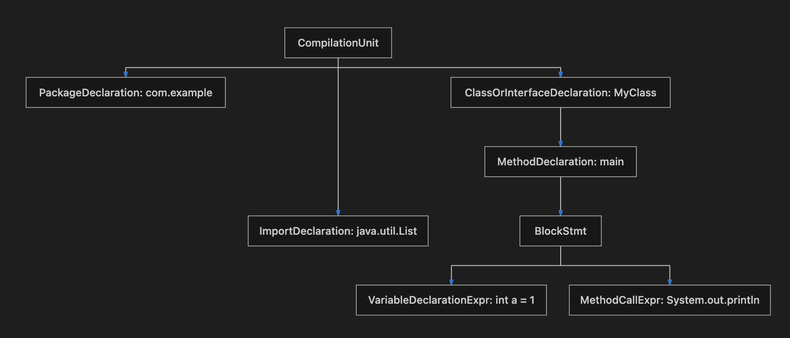

# JavaParser 核心原理与常见用法指南

> 本文由内部知识库文档整理为 GitHub 可直接阅读的 Markdown。已移除原始内部链接、附件直链、账号标识、组织域名等公司相关信息。
> 图片已下载到 `image/`，附件已下载到 `file/` 并使用相对路径引用；可导出的文本绘图、代码块与表格已尽量保留。

JavaParser 是一个功能强大的开源库，用于解析、分析、修改和生成 Java 源代码。它将 Java 源码转换为**抽象语法树 (Abstract Syntax Tree, AST)**，从而允许开发者以极其灵活且结构化的方式去处理 Java 代码。

## 1、核心概念

**CompilationUnit (编译单元)**

这是整棵 AST 的根节点，通常代表一个完整的 `.java` 源文件。它包含了包声明 (Package Declaration)、导入语句 (Imports) 和类型声明 (Type Declarations，如类、接口等)。

**Node (节点)**

AST 的基本组成部分。Java 代码的每一个元素（如类定义、方法定义、变量声明、表达式等）在 AST 中都有对应的 Node 子类（如 ClassOrInterfaceDeclaration, MethodDeclaration, VariableDeclarator）

**Visitor (访问者模式)**

JavaParser 推荐使用访问者模式来遍历这棵复杂的 AST，从而提取或修改你关心的节点。

**Symbol Solver (符号解析器)**

 纯粹的 AST 只是语法结构（例如它知道这是一个方法调用 `foo()`），但不包含上下文（它不知道 `foo()` 属于哪个类、返回值是什么）。Symbol Solver 赋予了 AST 语义理解的能力，可以解析出变量、方法和类型的具体引用。

## 2、AST 结构示意图

以下是一个简单的 Java 类及其对应 AST 结构的简化示意图：



## 3、引入依赖

在 Maven 项目中，通常需要引入以下依赖：

```xml
<dependencies>
    <!-- JavaParser 核心库，包含解析和 AST 操作 -->
    <dependency>
        <groupId>com.github.javaparser</groupId>
        <artifactId>javaparser-core</artifactId>
        <version>3.25.9</version>
    </dependency>
    
    <!-- JavaParser 符号解析库 (可选，但在做深度静态分析时必不可少) -->
    <dependency>
        <groupId>com.github.javaparser</groupId>
        <artifactId>javaparser-symbol-solver-core</artifactId>
        <version>3.25.9</version>
    </dependency>
</dependencies>
```

## 4、基础与常见用法

### 4.1 解析单一文件与整个项目工程 (Parsing & SourceRoot)

除了简单的字符串解析，在真实的工程扫描场景中，我们往往需要一次性扫描一整个 Java 项目目录。SourceRoot 是官方推荐批量处理工程的工具类。

```java
import com.github.javaparser.StaticJavaParser;
import com.github.javaparser.ast.CompilationUnit;
import com.github.javaparser.utils.SourceRoot;
import java.nio.file.Paths;

public class ParsingDemo {
   public static void main(String[] args) throws IOException {
        // 1. 基础：从字符串直接解析
        CompilationUnit cuFromString = StaticJavaParser.parse("class A { int x = 10; }");
        System.out.println("从字符串解析出的类名：" + cuFromString.getType(0).getNameAsString());
        // 2. 进阶：解析整个源码工程目录 (SourceRoot)
        // SourceRoot 能自动识别目录下的所有 .java 文件，并进行批量的解析和保存回写
        SourceRoot sourceRoot = new SourceRoot(Paths.get("src/main/java"));
        // 解析工程中指定包下的具体类
        CompilationUnit cu = sourceRoot.parse("org.example", "MyClass.java");
        System.out.println("从字符串解析出的类名：" + cu.getType(0).getNameAsString());
        // 批量遍历解析整个源码树中的所有文件
        sourceRoot.tryToParse().forEach(parseResult -> {
            parseResult.getResult().ifPresent(parsedCu -> {
                System.out.println("成功解析文件，包含的类型有: " + parsedCu.getTypes());
            });
        });
    }
}
```

### 4.2、节点遍历与精确信息提取 (Visitor & findAll)

提取信息主要有两套方法：传统的 Visitor 模式，以及简便快捷的 findAll 流式查询。

```typescript
import com.github.javaparser.StaticJavaParser;
import com.github.javaparser.ast.CompilationUnit;
import com.github.javaparser.ast.body.MethodDeclaration;
import com.github.javaparser.ast.stmt.IfStmt;
import com.github.javaparser.ast.visitor.VoidVisitorAdapter;

public class ExtractInfoDemo {
    public static void main(String[] args) {
        String code = "class Test { " +
                      "  void run() { if (true) { System.out.println(\"A\"); } } " +
                      "}";
        CompilationUnit cu = StaticJavaParser.parse(code);

        // 方式 A：使用 findAll 进行一键式的精确提取 (推荐日常使用，代码更简洁)
        // 例如：获取 AST 树中所有的 If 条件语句块
        cu.findAll(IfStmt.class).forEach(ifStmt -> {
            System.out.println("发现 If 语句，条件是: " + ifStmt.getCondition());
        });

        // 方式 B：使用 Visitor 模式做更复杂的上下文相关遍历
        cu.accept(new VoidVisitorAdapter<Void>() {
            @Override
            public void visit(MethodDeclaration n, Void arg) {
                super.visit(n, arg); // 必须保留该调用，以便向下继续遍历子节点
                System.out.println("发现方法声明: " + n.getNameAsString());
                // 可以在此根据复杂的逻辑链控制是否进入特定分支
            }
        }, null);
    }
}
```

### 4.3、完全通过 API 编程式地生成代码 (Code Generation)

有时候我们不需要解析现有的代码，而是想从零开始自动生成一个 `.java` 文件的抽象语法树，然后再将整棵树保存为代码。

```java
import com.github.javaparser.ast.CompilationUnit;
import com.github.javaparser.ast.Modifier;
import com.github.javaparser.ast.body.ClassOrInterfaceDeclaration;
import com.github.javaparser.ast.body.MethodDeclaration;
import com.github.javaparser.ast.stmt.BlockStmt;

public class CodeGenDemo {
    public static void main(String[] args) {
        // 1. 创建一个空白的编译单元
        CompilationUnit cu = new CompilationUnit("com.example.generated");
        cu.addImport("java.util.List");

        // 2. 添加类声明
        ClassOrInterfaceDeclaration myClass = cu.addClass("UserService").setPublic(true);
        
        // 3. 为类添加字段
        myClass.addField("String", "serviceName", Modifier.Keyword.PRIVATE);

        // 4. 为类添加一个完整的方法和代码块
        MethodDeclaration startMethod = myClass.addMethod("start", Modifier.Keyword.PUBLIC);
        startMethod.setBody(new BlockStmt().addStatement("System.out.println(\"Service Started!\");"));

        // 5. 打印出最终生成的完美排版源码
        System.out.println(cu.toString());
    }
}
```

## 5、高级与进阶用法

### 5.1 深入节点修改、删除与“词法保留” (Lexical Preservation)

普通的 JavaParser 修改后输出(cu.toString())，会按照内置格式化器重排行距和缩进。如果你正在开发重构工具，**仅仅想修改一行代码，且完全保留原代码中的缩进和用户留下的所有注释**，你必须开启**词法保留模式 (Lexical Preserving Printer)**。

TIP

LexicalPreservingPrinter 能够确保你改完代码后，Git Diff 只有你真正改动的那行差异，而不会导致整个文件的格式大变动。

```java
package org.example;
import com.github.javaparser.StaticJavaParser;
import com.github.javaparser.ast.CompilationUnit;
import com.github.javaparser.ast.Node;
import com.github.javaparser.ast.expr.MethodCallExpr;
import com.github.javaparser.ast.stmt.ExpressionStmt;
import com.github.javaparser.printer.lexicalpreservation.LexicalPreservingPrinter;

public class AdvancedModifyDemo {
    public static void main(String[] args) {
        String code = "class Test {\n" +
                "    // 用户的原始多行注释\n" +
                "    // 必须被 100% 完美保留\n" +
                "    void demo() {\n" +
                "        System.out.println(\"Log: start\");\n" +
                "        int a = 1; // 另一处行内注释\n" +
                "    }\n" +
                "}";
        CompilationUnit cu = StaticJavaParser.parse(code);
        // 1. 将该 CompilationUnit 开启词法保留追踪
        LexicalPreservingPrinter.setup(cu);
        // 2. 高级修改：删除特定节点 (删除代码里的所有 println 调用，即使在一行中间也能平滑移除)
        cu.findAll(MethodCallExpr.class).forEach(call -> {
            System.out.println("call.getNameAsString() = "+call.getNameAsString());
            if (call.getNameAsString().equals("println")) {
                call.findAncestor(ExpressionStmt.class)
                        .ifPresent(Node::remove); // 将该方法调用节点从 AST 中彻底剪除
            }
        });
        // 3. 高级修改：修改特定的节点值 (把变量声明 'a' 改名为 'myVar')
        cu.findAll(com.github.javaparser.ast.body.VariableDeclarator.class).forEach(var -> {
            if (var.getNameAsString().equals("a")) {
                var.setName("myVar"); // 仅做重命名
            }
        });
        // 4. 注意：必须使用词法保留打印器输出代码，而不是普通的 toString()
        System.out.println(LexicalPreservingPrinter.print(cu));
    }
}
```

### 5.2、高级符号求解 (Advanced Symbol Solving)

普通的 AST 只有表面字符串。符号求解的威力在于能结合 Jar 包和本地其他代码建立复杂的类型网，进行跨文件的深度静态分析。

```java
import com.github.javaparser.StaticJavaParser;
import com.github.javaparser.ast.CompilationUnit;
import com.github.javaparser.ast.expr.NameExpr;
import com.github.javaparser.resolution.declarations.ResolvedValueDeclaration;
import com.github.javaparser.resolution.types.ResolvedType;
import com.github.javaparser.symbolsolver.JavaSymbolSolver;
import com.github.javaparser.symbolsolver.resolution.typesolvers.CombinedTypeSolver;
import com.github.javaparser.symbolsolver.resolution.typesolvers.JarTypeSolver;
import com.github.javaparser.symbolsolver.resolution.typesolvers.JavaParserTypeSolver;
import com.github.javaparser.symbolsolver.resolution.typesolvers.ReflectionTypeSolver;
import java.io.File;

public class AdvancedSymbolSolverDemo {
    public static void main(String[] args) throws Exception {
        // 1. 设置复杂的 Type Solver 寻找链
        CombinedTypeSolver combinedTypeSolver = new CombinedTypeSolver();
        
        // A: 解决 Java 标准库内置类型 (String, List 等)
        combinedTypeSolver.add(new ReflectionTypeSolver());
        
        // B: (可选) 解决项目自身的其他源码。让解析器认识同工程里其它包下的代码
        // combinedTypeSolver.add(new JavaParserTypeSolver(new File("src/main/java")));
        
        // C: (可选) 解决引用的第三方依赖。比如推断 Guava、Spring 里的代码结构
        // combinedTypeSolver.add(new JarTypeSolver("path/to/spring-core.jar"));

        // 注册求解器到全局配置
        JavaSymbolSolver symbolSolver = new JavaSymbolSolver(combinedTypeSolver);
        StaticJavaParser.getParserConfiguration().setSymbolResolver(symbolSolver);

        String code = "class Example {\n" +
                      "  void test(String input) {\n" +
                      "      int length = input.length();\n" +
                      "      System.out.println(length);\n" +
                      "  }\n" +
                      "}";
        CompilationUnit cu = StaticJavaParser.parse(code);

        // 案例 1：逆向推断局部变量被定义的位置与本质
        cu.findAll(NameExpr.class).stream()
          .filter(name -> name.getNameAsString().equals("input"))
          .forEach(nameExpr -> {
              // resolve() 能找到变量 'input' 是在哪里声明的
              ResolvedValueDeclaration resolved = nameExpr.resolve();
              System.out.println("'input' 引用的严格类型是: " + resolved.getType().describe());
              System.out.println("它被定义为方法的一个参数吗: " + resolved.isParameter());
          });
          
        // 案例 2：推断表达式运行时的具体类型
        // 比如要推断 input.length() 表达式算出的结果是什么类型
        cu.findAll(com.github.javaparser.ast.expr.MethodCallExpr.class).forEach(call -> {
             // calculateResolvedType 可以对任意表达式的最终结果类型进行运算和推导
             ResolvedType returnType = call.calculateResolvedType();
             System.out.println("调用 " + call.getNameAsString() + "() 返回类型是: " + returnType.describe());
        });
    }
}
```

*高级符号求解可以进行极深的依赖追踪分析（例如：寻找由于错误类型的强制转换造成的潜在漏洞，或追踪局部变量的生命周期与定义位置）。*

## 6、封装方法与 API 详解

在实际企业级开发中，我们通常不会到处散落着 StaticJavaParser.parse()，而是会将其封装成一个类似 parseJavaSourceWithAST 的通用工具方法，以便统一配置语言级别、字符集、甚至符号求解器。

下面是一个标准的 parseJavaSourceWithAST 封装实现，并对其内部使用的各个核心 API 进行了详细讲解：

```java
import com.github.javaparser.ParserConfiguration;
import com.github.javaparser.StaticJavaParser;
import com.github.javaparser.ast.CompilationUnit;
import com.github.javaparser.symbolsolver.JavaSymbolSolver;
import com.github.javaparser.symbolsolver.resolution.typesolvers.CombinedTypeSolver;
import com.github.javaparser.symbolsolver.resolution.typesolvers.ReflectionTypeSolver;

import java.io.File;
import java.io.FileNotFoundException;
import java.nio.charset.StandardCharsets;

public class ASTUtil {

    /**
     * 统一的 Java 源码解析入口 (parseJavaSourceWithAST)
     * 
     * @param sourceFile 待解析的 Java 源文件
     * @return 解析后的抽象语法树根节点 CompilationUnit
     */
    public static CompilationUnit parseJavaSourceWithAST(File sourceFile) throws FileNotFoundException {
        // 1. 初始化并配置解析器参数
        ParserConfiguration configuration = new ParserConfiguration();
        
        // 设置 Java 语言级别（例如支持 Java 17 的 record 语法等）
        configuration.setLanguageLevel(ParserConfiguration.LanguageLevel.JAVA_17);
        
        // 设置字符编码，防止中文注释乱码
        configuration.setCharacterEncoding(StandardCharsets.UTF_8);

        // 2. （可选）配置符号解析器环境
        CombinedTypeSolver typeSolver = new CombinedTypeSolver(new ReflectionTypeSolver());
        JavaSymbolSolver symbolSolver = new JavaSymbolSolver(typeSolver);
        configuration.setSymbolResolver(symbolSolver);

        // 3. 将配置应用到全局解析器
        StaticJavaParser.setConfiguration(configuration);

        // 4. 执行文件解析
        CompilationUnit cu = StaticJavaParser.parse(sourceFile);
        
        return cu;
    }
}
```

### 1. ParserConfiguration (解析器配置对象)

用于定制解析行为的核心类。

**setLanguageLevel(LanguageLevel level)**

**作用**：告诉解析器以什么版本的 Java 语法规则来读取代码。

**重要场景**：如果你尝试解析带有 var 关键字（Java 10+）或 record（Java 14+）的代码，但语言级别还停留在默认的较低版本，解析器就会抛出 ParseProblemException 语法错误。必须通过此方法调高语言级别。

**setCharacterEncoding(Charset encoding)**

**作用**：设定读取源文件时的字符集。

**重要场景**：如果不明确指定 UTF-8，在不同操作系统的默认编码下，你的源码中的中文注释或中文字符串在转换为 AST 后可能会变成乱码，从而导致写入文件时发生数据损坏。

**setSymbolResolver(SymbolResolver resolver)**

**作用**：将配好的符号解析器挂载到当前配置中，这是让后续的 AST 节点可以调用 .resolve() 的大前提。

### 2、StaticJavaParser (静态外观门面类)

这是 JavaParser 库最常用的入口点，它封装了底层的实例化过程。

**setConfiguration(ParserConfiguration configuration)**

**作用**：将上面设定好的所有参数全局应用到 StaticJavaParser 中。这应该在调用 parse() 方法之前执行。

**parse(File file)**:

**作用**：执行真正的词法分析（Lexing）和语法分析（Parsing），将物理文件转换成内存中的树形数据结构。如果存在语法错误，会抛出包含错误坐标的异常。除了 File，它还重载支持传入 String、InputStream 或 Path。

### 3、返回的核心结果 CompilationUnit

解析成功后返回的最终结果，代表一整个源文件。拿到它之后，通常会调用以下方法做进一步处理：

**getClassByName(String name)**: 快速在整个文件中寻找名字匹配的类声明。

**getImports()**: 获取该文件顶部所有的 import 导入声明。

**getPackageDeclaration()**: 提取 package xxx.yyy; 包名声明信息。

## 7、深入剖析 Visitor 模式、accept 与 VoidVisitorAdapter

在处理 AST 时，经常会遇到 cu.accept(visitor, arg) 这样的代码。理解其背后的 **Visitor (访问者) 设计模式** 是精通 JavaParser 的必经之路。

### 7.1 VoidVisitorAdapter 到底是什么？

VoidVisitorAdapter 是 JavaParser 提供的一个核心抽象类，专门用于安全、高效地遍历 AST。 一棵完整的 AST 就像是由成百上千个节点组成的巨大的树。如果你手动写递归函数去处理它，代码里会塞满无数的 if (node instanceof MethodDeclaration) 类型判断。这不仅丑陋，而且极难维护，这被称为“类型判断地狱”。 VoidVisitorAdapter 的内部机制已经替你写好了深度优先遍历这棵树的所有基础控制逻辑。当你继承它时，你就像是挂载在遍历轨道上的一个“监听器”，**你只需要覆写（关注）你感兴趣的特定节点类型**即可，其他的节点它会自动帮你跳过或深入。

### 7.2 为什么会有那么多 override void visit(...) 的重载方法？

在 JavaParser 的体系中，Java 语法的每一种具体元素（类、方法、变量、if语句、for循环、甚至加号减号）都对应着一个独立的 Node 子类（总数有近百种之多）。

**MethodDeclaration** 代表方法声明。

**VariableDeclarator** 代表局部变量声明。

**MethodCallExpr** 代表方法调用表达式。

Visitor 模式极大地利用了 Java 的**方法重载 (Overload)** 与**双重分派 (Double Dispatch)** 特性。 JavaParser 为这近百种节点类型，都在 Visitor 接口中准备了一个名字叫 visit，但**参数类型各不相同**的重载方法。当解析引擎遍历这棵树到达某个特定类型的节点时，它会自动匹配并精确触发对应的那个 visit 方法。这就使得你的代码极度清晰，不需要写任何 instanceof 和强制类型转换。

### 7.3 accept 方法第二个参数有什么用？(状态上下文传递)

当我们执行 **cu.accept(new MyVisitor(), arg)** 时，相当于对这棵树发出了“开始全面遍历”的指令。

- **第一个参数**：是你自己实现的 Visitor 实例对象。
- **第二个参数 (arg)**：这是至关重要的**上下文状态参数 (Context/Argument)**。它对应了 VoidVisitorAdapter<A> 类定义中的泛型 <A>。

**为什么必须要有第二个参数？** 因为 Visitor 遍历是树状的深度递归调用。在实际业务中，我们经常想把某种状态（比如一个用来收集数据的 List，或者一个当前类的类名字符串，甚至一个层级计数器）从树的最外层根节点，一直完好无损地传递到最内层的叶子节点的 visit 方法里。 如果不使用第二个参数，你就只能把这些状态定义为 Visitor 类的成员全局变量，而在复杂递归或者多线程并发复用同一个 Visitor 实例时，成员变量极易造成“状态污染”。 有了第二个参数，你就可以像纯函数式编程一样，安全地在各个层级的 visit 回调之间穿梭传递数据。

##### 代码实战：利用第二个参数收集所有的类名与方法名

```java
import com.github.javaparser.StaticJavaParser;
import com.github.javaparser.ast.CompilationUnit;
import com.github.javaparser.ast.body.MethodDeclaration;
import com.github.javaparser.ast.visitor.VoidVisitorAdapter;
import java.util.ArrayList;
import java.util.List;

public class VisitorContextDemo {
    public static void main(String[] args) {
        String code = "class Test { void run(){} void stop(){} }";
        CompilationUnit cu = StaticJavaParser.parse(code);

        // 场景：我们需要收集整段代码里的所有方法名
        // 这个 List 将作为我们遍历过程中的“上下文容器”
        List<String> methodNames = new ArrayList<>();
        
        // 调用 accept 触发遍历，并将 methodNames 作为第二个参数 (arg) 安全地传递进去
        cu.accept(new MethodCollectorVisitor(), methodNames);
        
        System.out.println("最终收集到的方法集合: " + methodNames);
    }

    // 注意这里的泛型 <List<String>>，它严格决定了 visit 方法里第二个参数接收到的具体类型
    private static class MethodCollectorVisitor extends VoidVisitorAdapter<List<String>> {
        
        @Override
        public void visit(MethodDeclaration md, List<String> collector) {
            // [极其重要]: 必须调用 super.visit()，它负责继续向下驱动去遍历方法体内的其他子节点！
            // 如果你把这行删了，解析引擎遍历到当前方法时就会"刹车"，不再进入方法的内部深处。
            super.visit(md, collector); 
            
            // 将当前扫描到的方法名，塞入随着递归层层传递进来的 collector 容器中
            collector.add(md.getNameAsString());
        }
    }
}
```

## 8、核心 AST 节点类详解

为了能够熟练地对 Java 语法树进行查询和改造，必须深入了解 JavaParser 核心 AST 节点类的分工与核心方法。以下是日常开发中**最常用、最核心的 7 个节点类**的深度剖析：

### 8.1 ClassOrInterfaceDeclaration

**作用**：代表 Java 中的**类 (Class)** 或 **接口 (Interface)** 声明。

**主要属性与 API 方法**：

**isInterface()**: 返回布尔值，用于区分该节点代表的是普通类还是接口。

**getExtendedTypes()**: 获取它继承的父类/父接口列表（对应 **extends** 关键字后面的类型）。

**getImplementedTypes()**: 获取该类实现的接口列表（对应 **implements** 关键字后面的类型）。

**getMethods()** / **getFields()** / **getConstructors()**: 分别直接获取类中声明的所有方法、成员变量、构造函数的 AST 节点列表。

**addMethod(...)** / **addField(...)**: 辅助脚手架方法，允许你直接用非常简短的代码向该类中追加成员，而不需要手动构建复杂的节点。

### 8.2 EnumDeclaration

**作用**：代表 Java 中的**枚举 (Enum)** 声明。

**主要属性与 API 方法**：

**getEntries()**: 获取枚举类中定义的全部枚举项列表（返回 **EnumConstantDeclaration** 列表，例如 RED, GREEN, BLUE 节点）。

**getImplementedTypes()**: 获取该枚举实现的接口列表（Java 中枚举不能继承类，但可以实现接口）。

与 ClassOrInterfaceDeclaration 类似，它同样支持包含字段、方法、构造函数，也可以使用 getMethods() 等获取成员。

### 8.3 ObjectCreationExpr

**作用**：代表代码中的**对象创建表达式**（即实例化操作，如 new MyClass("arg")）。

**注意点**：它是一个**表达式 (Expression)** 节点，通常作为赋值语句的右值，或作为方法的入参。

**主要属性与 API 方法**：

**getType()**: 获取当前正在实例化的类型节点（如 MyClass）。

**getArguments()**: 获取传递给构造函数的参数表达式列表（如 NodeList<Expression>）。

**getAnonymousClassBody()**: 如果是**匿名内部类**的创建（例如 **new Runnable() { @Override public void run(){} }**），该方法会返回一个 Optional<NodeList<BodyDeclaration<?>>>，代表大括号内部的类体。

### 8.4 MethodDeclaration

**作用**：代表一个**普通方法声明**。

**主要属性与 API 方法**：

**getNameAsString()**: 获取方法的名字（例如 "run"）。

**getType()** / **getTypeAsString()**: 获取该方法的返回值类型（例如 void, List<String>）。

**getParameters()**: 获取方法的形参列表（返回 NodeList<Parameter>，可进一步调用 parameter.getType() 获取参数类型，parameter.getNameAsString() 获取参数名）。

**getBody()**: 返回方法的代码体块（Optional<BlockStmt>）。对于抽象方法或接口中的默认无体方法，此值为空。

**getModifiers()**: 获取该方法的修饰符集合（如 public, static, final 等）。

### 8.5 ConstructorDeclaration

**作用**：代表一个类的**构造函数声明**。

**主要属性与 API 方法**：

与 MethodDeclaration 非常相似，但**没有返回值类型**这一属性。

**getNameAsString()**: 返回构造函数名，必定与声明它的类名一致。

**getParameters() / getBody()**: 同样用于获取构造函数的入参和构造器体块内的具体代码语句。

### 8.6 InitializerDeclaration

**作用**：代表类中的**初始化块 (Initializer Block)** 声明。

**注意点**：这包括了**静态代码块**和**实例代码块**。

**主要属性与 API 方法**：

**isStatic()**: 用于快速判断该代码块是否被 static 关键字修饰（如果是 static { ... } 则返回 true；如果是普通的 { ... } 实例初始化块则返回 false）。

**getBody()**: 获取初始化块大括号内部的具体语句块（BlockStmt），从而能进一步遍历或修改块内的代码。

### 8.7 FieldDeclaration

**作用**：代表类中的**成员变量（字段）声明**。

**【关键坑点】设计差异**：

在 Java 语法中，一行代码可以声明多个变量，例如：private int a = 1, b = 2;。

因此在 JavaParser 中，FieldDeclaration **并不等同于单个变量**！它其实是一个“声明容器”。

它用 getModifiers() 存放修饰符（如 private），用 getCommonType() 存放公共类型（如 int）。

而这行代码声明的每个具体变量，是由 VariableDeclarator 节点表示的。

**主要属性与 API 方法**：

**getVariables()**: 返回此行声明中包含的所有具体变量声明列表（NodeList<VariableDeclarator>）。对于 private int a = 1;，列表里只有一个 VariableDeclarator；对于 private int a, b; 则有两个。

**getVariable(int index)**: 快捷获取指定索引处的具体变量。

**getModifiers()**: 获取字段前面的修饰符。
