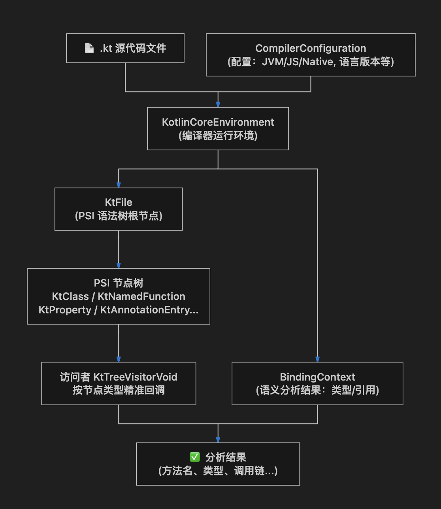
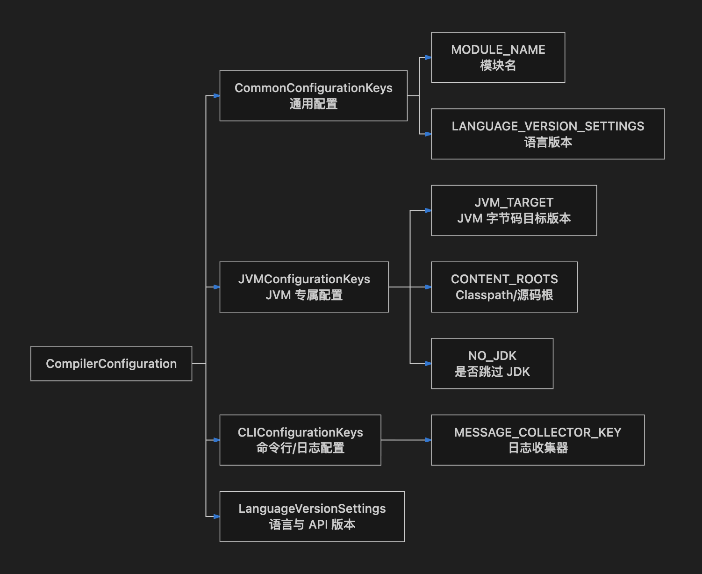

# Kotlin Compiler PSI 编程完全指南

> 本文由内部知识库文档整理为 GitHub 可直接阅读的 Markdown。已移除原始内部链接、附件直链、账号标识、组织域名等公司相关信息。
> 图片已下载到 `image/`，附件已下载到 `file/` 并使用相对路径引用；可导出的文本绘图、代码块与表格已尽量保留。

Kotlin 编译器内置了一套强大的 **PSI（Program Structure Interface，程序结构接口）** 系统，它是 IntelliJ Platform 的核心子系统。通过 kotlin-compiler-embeddable 库，开发者可以在自己的工具、脚本或 Gradle 插件中以编程方式将 Kotlin 源代码解析成可遍历、可查询的**语法树（AST）**。这是构建代码扫描器、静态分析工具、代码生成器与自动化重构工具的底层基础。

## 1、核心概念与架构总览

在动手写代码之前，必须先理解几个关键概念的层次关系：

#### PSI vs AST vs 语义分析


| 层次 | 名称 | 代表类 | 能力边界 |
| --- | --- | --- | --- |
| 语法层 (Syntax) | PSI / AST | KtFile, KtClass, KtNamedFunction | 只知道代码写了什么，不知道它"是什么" |
| 语义层 (Semantics) | 绑定上下文 | BindingContext (K1), KaSession (K2) | 知道变量类型、方法归属、引用解析 |
| 中间代码层 (IR) | 中间表示 | IrElement | 编译器后端，用于生成字节码 |


本文主要聚焦于 **PSI 层**（语法）和 **BindingContext**（语义）的 K1 前端 API，这也是目前绝大多数静态分析工具（如 Detekt、ktlint）的底层基础。如果你针对 Kotlin 1.9+/2.x 做全新开发，可以考虑新的 **Kotlin Analysis API (K2)**，但 PSI 节点本身（**KtFile**、**KtClass** 等）在两套体系中通用。

## 2、整体架构示意图



## 3、引入依赖

在 **build.gradle.kts** 中引入以下依赖：

```kotlin
// build.gradle.kts
dependencies {
    // 方案 A：直接使用 Kotlin 编译器底层（完全自行控制，灵活度最高）
    implementation("org.jetbrains.kotlin:kotlin-compiler-embeddable:1.9.25")

    // 方案 B：使用 Detekt 封装的 detekt-parser（推荐！已处理好所有初始化样板代码）
    // KtCompiler 类就在这个库中，是对 kotlin-compiler-embeddable 的高层封装
   implementation("io.gitlab.arturbosch.detekt:detekt-parser:1.23.6")
    // detekt-parser 已自动依赖 kotlin-compiler-embeddable，无需再单独引入
}
```

**TIP：**

**如果你的目标是快速搭建一个 Kotlin 代码静态分析工具，强烈推荐优先使用 `detekt-parser`，它封装了所有繁琐的 `KotlinCoreEnvironment` 初始化、`Disposable` 管理、Classpath 配置等样板代码，开箱即用。**

## 4、KtCompiler 完整详解

**KtCompiler** 是 Detekt 的 **detekt-parser** 模块中的核心封装类，它将原始的 Kotlin 编译器 PSI API（**KotlinCoreEnvironment**、**KtPsiFactory** 等）封装成了一个极简的高层接口。它的目标是：**让调用方只需关心"把哪个文件解析成 KtFile"，而不用关心底层环境如何初始化和管理**。

### 4.1 类结构与源码原理

**KtCompiler** 的内部结构大致如下（根据 Detekt 源码整理）：

```kotlin
package io.github.detekt.parser

import com.intellij.openapi.util.Disposer
import org.jetbrains.kotlin.cli.common.CLIConfigurationKeys
import org.jetbrains.kotlin.cli.common.messages.MessageCollector
import org.jetbrains.kotlin.cli.jvm.compiler.EnvironmentConfigFiles
import org.jetbrains.kotlin.cli.jvm.compiler.KotlinCoreEnvironment
import org.jetbrains.kotlin.config.CommonConfigurationKeys
import org.jetbrains.kotlin.config.CompilerConfiguration
import org.jetbrains.kotlin.config.JVMConfigurationKeys
import org.jetbrains.kotlin.config.JvmTarget
import org.jetbrains.kotlin.psi.KtFile
import org.jetbrains.kotlin.psi.KtPsiFactory
import java.nio.file.Path

// KtCompiler 是一个 open class，允许子类继承并扩展（例如 Detekt 内部的 KotlinCoreEnvironmentWrapper）
open class KtCompiler(
    // 构造函数参数：KotlinCoreEnvironment 实例
    // 默认调用伴生对象工厂方法创建，也可以传入外部自定义的 environment
    protected val environment: KotlinCoreEnvironment = createKotlinCoreEnvironment()
) {
    // 内部持有 KtPsiFactory，用于将字符串/文件内容转为 KtFile PSI 节点
    // markGenerated = false：表示解析出的文件是真实用户代码而非代码生成器生成的
    protected val psiFileFactory: KtPsiFactory = KtPsiFactory(environment.project, markGenerated = false)

    /**
     * 核心解析方法：将 Path 指向的 Kotlin 源文件解析为 KtFile
     * @param root    工程的源码根目录（用于计算相对路径，影响 KtFile.name 的值）
     * @param subPath 相对于 root 的相对路径（例如 "com/example/Foo.kt"）
     * @return 解析完成的 KtFile PSI 对象
     */
    fun compile(root: Path, subPath: Path): KtFile {
        val absolutePath = root.resolve(subPath)
        val content = absolutePath.toFile().readText(Charsets.UTF_8)
        // 使用 KtPsiFactory 将文件内容创建为 KtFile
        // 第一个参数是文件名（用于错误信息中的定位），第二个参数是源码字符串
        return psiFileFactory.createFile(subPath.toString(), content)
    }

    companion object {
        /**
         * 工厂方法：创建一个已配置好的 KotlinCoreEnvironment
         * 可传入自定义 CompilerConfiguration 进行扩展配置
         */
        fun createKotlinCoreEnvironment(
            configuration: CompilerConfiguration = CompilerConfiguration()
        ): KotlinCoreEnvironment {
            // 注入 Detekt 推荐的默认配置
            configuration.apply {
                put(CommonConfigurationKeys.MODULE_NAME, "detekt")
                // 静默模式：关闭编译器日志，避免分析过程中产生干扰输出
                put(CLIConfigurationKeys.MESSAGE_COLLECTOR_KEY, MessageCollector.NONE)
                // 指定 JVM 字节码目标版本
                put(JVMConfigurationKeys.JVM_TARGET, JvmTarget.JVM_1_8)
            }
            val disposable = Disposer.newDisposable()
            return KotlinCoreEnvironment.createForProduction(
                disposable,
                configuration,
                EnvironmentConfigFiles.JVM_CONFIG_FILES
            )
        }

        /**
         * 工厂方法：根据已有的 Project 创建 KtPsiFactory
         */
        fun createPsiFactory(project: com.intellij.openapi.project.Project): KtPsiFactory {
            return KtPsiFactory(project, markGenerated = false)
        }
    }
}
```

### 4.2 核心方法详解

##### compile(root: Path, subPath: Path): KtFile

这是使用频率最高的方法，通常在批量扫描工程源文件时调用：

```kotlin
import io.github.detekt.parser.KtCompiler
import java.nio.file.Paths

fun main() {
    // 1. 创建 KtCompiler 实例（内部自动完成 KotlinCoreEnvironment 初始化）
    val compiler = KtCompiler()
    println(Paths.get("").toAbsolutePath())
    // 2. 定义源码根目录与目标文件的相对路径
    val basePath = Paths.get("src/main/kotlin").toAbsolutePath().normalize()
    val path = basePath.resolve("com/example/service/UserService.kt").normalize()
    // 3. 解析 → 得到 KtFile PSI 树
    val ktFile = compiler.compile(basePath, path)
    // 4. 即可直接使用所有 PSI API
    println("文件包名: ${ktFile.packageFqName}")
    println("顶层声明数量: ${ktFile.declarations.size}")
    ktFile.declarations.forEach { decl ->
        println("  - ${decl::class.simpleName}: ${decl.name}")
    }
}
```

**compile(root, subPath)** 中 **root** 和 **subPath** 的**分工非常重要**：

**root** 是你的"项目源码根"，例如 src/main/kotlin，它本身不会出现在生成的 **KtFile.name** 中

**subPath** 是相对路径，例如 com/example/Foo.kt，这个值会成为 **KtFile.name**

两个 path 合并后得到文件的物理绝对路径用于读取内容

这样设计的目的是：让解析后的 **KtFile.name** 保持"包相对路径"的形式，而非宿主机的完整物理路径，便于跨机器使用和错误信息定位。

##### **createKotlinCoreEnvironment(configuration): KotlinCoreEnvironment**

伴生对象工厂方法，通常在需要**自定义编译器配置**（如添加 Classpath、调整 JVM 版本、启用实验性语言功能）时使用：

```java
import io.github.detekt.parser.KtCompiler
import org.jetbrains.kotlin.cli.jvm.config.addJvmClasspathRoots
import org.jetbrains.kotlin.config.CompilerConfiguration
import org.jetbrains.kotlin.config.JVMConfigurationKeys
import org.jetbrains.kotlin.config.JvmTarget
import io.github.detekt.parser.createKotlinCoreEnvironment
import java.io.File

// 场景：需要解析依赖了第三方库的代码，BindingContext 语义分析需要对应的 Classpath
val customConfig = CompilerConfiguration().apply {
    // 在 Detekt 默认配置基础上，额外添加工程依赖的 Jar 包
    addJvmClasspathRoots(
        File("libs").listFiles { f -> f.extension == "jar" }?.toList() ?: emptyList()
    )
    // 也可以覆盖 JVM 目标版本
    put(JVMConfigurationKeys.JVM_TARGET, JvmTarget.JVM_17)
}

// 将自定义配置传入 KtCompiler，内部创建的 KotlinCoreEnvironment 就会带上这些 Classpath
val compiler = KtCompiler(
    environment = createKotlinCoreEnvironment(customConfig)
)
```

##### **createPsiFactory(project): KtPsiFactory**

伴生对象工厂方法，当你需要**脱离文件系统**（例如直接从字符串构造 PSI 节点）时使用：

```java
package org.example
import io.github.detekt.parser.KtCompiler
import org.jetbrains.kotlin.psi.KtPsiFactory

fun main() {
    // KtCompiler 的 environment 是 protected，子类中可访问
    class ExposedKtCompiler : KtCompiler() {
        fun project() = environment.project
    }

    val compiler = ExposedKtCompiler()
    val psiFactory = KtPsiFactory(compiler.project(), markGenerated = false)

    // 现在可以从字符串直接创建 PSI
    val ktFile = psiFactory.createFile("Temp.kt", "class Foo { fun bar() {} }")
    val expr = psiFactory.createExpression("a + b * 2")
    val klass = psiFactory.createClass("data class Point(val x: Int, val y: Int)")

    println("文件包名: ${ktFile.packageFqName}")
    println("表达式: ${expr.text}")
    println("类名: ${klass.name}")
}
```

### 4.3、KtPsiFactory：直接从字符串创建 PSI 节点

**KtPsiFactory** 是 Kotlin PSI 体系中的**代码工厂类**，它依附于某个 **Project** 实例，能将各种代码片段字符串解析成对应的 PSI 节点，而无需创建真实的磁盘文件。这在代码生成、代码注入、单元测试等场景下极为实用。

```kotlin
package org.example

import io.github.detekt.parser.KtCompiler
import org.jetbrains.kotlin.psi.KtPsiFactory

// 重点：KtCompiler.environment 是 protected，外部不能直接访问。
// 通过子类暴露 project，再交给 KtPsiFactory 使用。
private class ExposedKtCompiler : KtCompiler() {
    fun psiFactory(): KtPsiFactory = KtPsiFactory(environment.project, markGenerated = false)
}

fun main() {
    val psiFactory = ExposedKtCompiler().psiFactory()

    // 重点：以下 API 都是“从字符串构建 PSI 节点”
    val ktFile = psiFactory.createFile(
        "Generated.kt",
        """
        package com.example

        class Hello {
            fun greet() = println("Hello!")
        }
        """.trimIndent()
    )
    val ktClass = psiFactory.createClass("data class User(val name: String)")
    val ktFunction = psiFactory.createFunction("fun add(a: Int, b: Int): Int = a + b")
    val ktProperty = psiFactory.createProperty("val maxSize: Int = 100")
    val ktExpression = psiFactory.createExpression("listOf(1, 2, 3).filter { it > 1 }")
    val ktAnnotation = psiFactory.createAnnotationEntry("@Suppress(\"UNCHECKED_CAST\")")
    val ktType = psiFactory.createType("List<String>?")
    val ktParameter = psiFactory.createParameter("name: String = \"default\"")

    println("file package = ${ktFile.packageFqName}")
    println("class = ${ktClass.name}")
    println("function = ${ktFunction.name}")
    println("property = ${ktProperty.name}")
    println("expression = ${ktExpression.text}")
    println("annotation = ${ktAnnotation.text}")
    println("type = ${ktType.text}")
    println("parameter = ${ktParameter.text}")
}
```

### 4 .4、批量扫描工程的完整实战示例

下面是使用 **KtCompiler** 对整个工程目录进行批量解析分析的完整生产级代码：

```kotlin
package org.example

import io.github.detekt.parser.KtCompiler
import org.jetbrains.kotlin.lexer.KtTokens
import org.jetbrains.kotlin.psi.KtClass
import org.jetbrains.kotlin.psi.KtNamedFunction
import org.jetbrains.kotlin.psi.KtTreeVisitorVoid
import java.nio.file.Files
import java.nio.file.Paths

data class FunctionInfo(
    val file: String,
    val className: String?,
    val funcName: String,
    val isSuspend: Boolean,
    val paramCount: Int
)

fun scanProject(sourceRootDir: String): List<FunctionInfo> {
    val sourceRoot = Paths.get(sourceRootDir)
    val compiler = KtCompiler()                      // 一次创建，复用整个扫描过程
    val results = mutableListOf<FunctionInfo>()

    // 遍历所有 .kt 文件，构建相对路径
    val ktFiles = Files.walk(sourceRoot)
        .filter { it.toString().endsWith(".kt") }
        .toList()

    println("共发现 ${ktFiles.size} 个 Kotlin 源文件，开始解析...")

    ktFiles.forEach { absolutePath ->
        val subPath = sourceRoot.relativize(absolutePath)  // 计算相对路径

        // compile(basePath, path): path 必须是实际存在的文件路径
        val ktFile = runCatching {
            compiler.compile(sourceRoot, absolutePath)
        }.getOrElse { e ->
            println("  ⚠️ 解析失败: $absolutePath → ${e.message}")
            return@forEach
        }

        // 用 Visitor 提取函数信息
        ktFile.accept(object : KtTreeVisitorVoid() {
            private var currentClassName: String? = null

            override fun visitClass(klass: KtClass) {
                val prev = currentClassName
                currentClassName = klass.name
                super.visitClass(klass)    // 继续深入类内部
                currentClassName = prev    // 恢复上下文（处理嵌套类）
            }

            override fun visitNamedFunction(function: KtNamedFunction) {
                super.visitNamedFunction(function)
                results.add(FunctionInfo(
                    file = subPath.toString(),
                    className = currentClassName,
                    funcName = function.name ?: "<anonymous>",
                    isSuspend = function.hasModifier(KtTokens.SUSPEND_KEYWORD),
                    paramCount = function.valueParameters.size
                ))
            }
        })
    }

    println("解析完成，共提取 ${results.size} 个函数。")
    return results
}

// 运行示例
fun main() {
    val funcs = scanProject("src/main/kotlin")

    // 筛选出所有的 suspend 函数
    val suspendFuncs = funcs.filter { it.isSuspend }
    println("\n📋 suspend 函数清单（共 ${suspendFuncs.size} 个）：")
    suspendFuncs.forEach {
        println("  [${it.file}] ${it.className ?: "顶层"}.${it.funcName}(${it.paramCount} 个参数)")
    }
}
```

### 4.5 KtCompiler vs 原始 API 对比


| 对比维度 | 直接使用 KotlinCoreEnvironment | 使用 KtCompiler |
| --- | --- | --- |
| 初始化代码量 | 约 20-30 行样板代码 | 1 行：val c = KtCompiler() |
| Disposable 管理 | 需要手动创建和管理 | 内部自动处理 |
| 默认配置 | 需要手动设置所有 Key | 已内置合理默认值 |
| 自定义扩展 | 完全自由 | 可传入自定义 CompilerConfiguration |
| 适用场景 | 需要精细控制、跨平台（JS/Native）目标 | 快速开发 JVM 平台静态分析工具 |


## 5、初始化：解析 Kotlin 源码为 KtFile

### 5.1 完整的初始化封装

这是所有后续操作的基础。从零到拿到 **KtFile** 的全流程如下：

```kotlin
import org.jetbrains.kotlin.cli.common.CLIConfigurationKeys
import org.jetbrains.kotlin.cli.common.messages.MessageRenderer
import org.jetbrains.kotlin.cli.common.messages.PrintingMessageCollector
import org.jetbrains.kotlin.cli.jvm.compiler.EnvironmentConfigFiles
import org.jetbrains.kotlin.cli.jvm.compiler.KotlinCoreEnvironment
import org.jetbrains.kotlin.com.intellij.openapi.util.Disposer
import org.jetbrains.kotlin.com.intellij.psi.PsiFileFactory
import org.jetbrains.kotlin.config.CommonConfigurationKeys
import org.jetbrains.kotlin.config.CompilerConfiguration
import org.jetbrains.kotlin.config.JvmTarget
import org.jetbrains.kotlin.config.JVMConfigurationKeys
import org.jetbrains.kotlin.idea.KotlinFileType
import org.jetbrains.kotlin.psi.KtFile

object KtParser {

    /**
     * 将一段 Kotlin 源码字符串解析为 KtFile（PSI 语法树）
     *
     * @param code    Kotlin 源代码字符串
     * @param fileName 虚拟文件名，不影响解析结果（影响包名推断）
     * @return 解析后的 PSI 根节点 KtFile
     */
    fun parseKotlinSource(code: String, fileName: String = "temp.kt"): KtFile {
        // 1. 创建编译器配置
        val configuration = CompilerConfiguration().apply {
            // 关闭编译器自身的日志输出，避免解析时控制台刷屏
            put(
                CLIConfigurationKeys.MESSAGE_COLLECTOR_KEY,
                PrintingMessageCollector(System.err, MessageRenderer.PLAIN_FULL_PATHS, false)
            )
            // 设置模块名
            put(CommonConfigurationKeys.MODULE_NAME, "my-analysis-module")
            // 指定 JVM 目标版本（对 PSI 解析影响不大，但对语义分析有用）
            put(JVMConfigurationKeys.JVM_TARGET, JvmTarget.JVM_17)
        }

        // 2. 创建 Disposable（用于管理 IntelliJ Platform 核心资源的生命周期）
        //    当不再需要时，调用 Disposer.dispose(disposable) 来释放资源
        val disposable = Disposer.newDisposable()

        // 3. 创建 KotlinCoreEnvironment（等同于一个轻量级的虚拟 IDE 项目环境）
        val environment = KotlinCoreEnvironment.createForProduction(
            disposable,
            configuration,
            EnvironmentConfigFiles.JVM_CONFIG_FILES // 告知这是 JVM 平台目标
        )

        // 4. 使用 PsiFileFactory 将源码字符串创建为 KtFile PSI 对象
        val psiFileFactory = PsiFileFactory.getInstance(environment.project)
        val ktFile = psiFileFactory.createFileFromText(
            fileName,
            KotlinFileType.INSTANCE,
            code
        ) as KtFile

        return ktFile
    }
}
```

### 5.2 从真实文件解析

```kotlin
import java.io.File

fun parseFromFile(file: File): KtFile {
    val code = file.readText(Charsets.UTF_8)
    return KtParser.parseKotlinSource(code, file.name)
}
```

### 5.3 资源管理最佳实践

**KotlinCoreEnvironment** 内部持有一个 IntelliJ Platform 的 **Project** 对象，占用较多内存。在工具类场景中，建议复用单例环境，而非每次解析都重建：

```kotlin
object SingletonKtParser {
    private val disposable = Disposer.newDisposable()
    private val environment: KotlinCoreEnvironment by lazy {
        val config = CompilerConfiguration()
        config.put(CLIConfigurationKeys.MESSAGE_COLLECTOR_KEY,
            PrintingMessageCollector(System.err, MessageRenderer.PLAIN_FULL_PATHS, false))
        KotlinCoreEnvironment.createForProduction(
            disposable, config, EnvironmentConfigFiles.JVM_CONFIG_FILES
        )
    }
    private val psiFactory: PsiFileFactory by lazy {
        PsiFileFactory.getInstance(environment.project)
    }

    fun parse(code: String, fileName: String = "temp.kt"): KtFile {
        return psiFactory.createFileFromText(fileName, KotlinFileType.INSTANCE, code) as KtFile
    }

    // 程序退出时调用，释放 IntelliJ 内部的 Application 单例
    fun dispose() = Disposer.dispose(disposable)
}
```

## 6. CompilerConfiguration 深度详解

**CompilerConfiguration** 是整个 Kotlin 编译器的**配置中枢**，采用类型安全的 Key-Value 存取机制（**put(Key, Value) / get(Key)**）。所有的编译行为——语言版本、classpath、JVM 目标版本、模块名——都通过它来控制。

### 6.1 配置项分类总览



### 6.2 完整配置项详解与代码示例

```java
import org.jetbrains.kotlin.cli.common.CLIConfigurationKeys
import org.jetbrains.kotlin.cli.common.messages.*
import org.jetbrains.kotlin.cli.jvm.config.addJavaSourceRoot
import org.jetbrains.kotlin.cli.jvm.config.addJvmClasspathRoot
import org.jetbrains.kotlin.cli.jvm.config.addJvmClasspathRoots
import org.jetbrains.kotlin.config.*
import java.io.File

val configuration = CompilerConfiguration()

// ─────────────────────────────────────────────
// 【CLIConfigurationKeys】日志与消息配置
// ─────────────────────────────────────────────

// MESSAGE_COLLECTOR_KEY：控制编译器诊断信息（警告/错误）的输出目标
// MessageRenderer.PLAIN_FULL_PATHS → 输出包含完整文件路径的纯文本格式
// 第三个参数 verbose=false → 不输出 INFO 级别的冗余日志
configuration.put(
    CLIConfigurationKeys.MESSAGE_COLLECTOR_KEY,
    PrintingMessageCollector(System.err, MessageRenderer.PLAIN_FULL_PATHS, false)
)

// 如果你想完全吞掉所有编译器日志输出（静默模式），使用：
configuration.put(CLIConfigurationKeys.MESSAGE_COLLECTOR_KEY, MessageCollector.NONE)

// ─────────────────────────────────────────────
// 【CommonConfigurationKeys】通用配置
// ─────────────────────────────────────────────

// MODULE_NAME：设置模块名，会影响生成的 .kotlin_module 文件名
// 在做静态分析工具时，任意命名即可
configuration.put(CommonConfigurationKeys.MODULE_NAME, "my-analysis-tool")

// LANGUAGE_VERSION_SETTINGS：精细控制语言版本和 API 版本
// 这决定了哪些 Kotlin 语法是合法的（例如 K2 特性、实验性 API）
val langSettings = LanguageVersionSettingsImpl(
    languageVersion = LanguageVersion.KOTLIN_1_9,  // 语言版本：1.6 / 1.7 / 1.8 / 1.9 / 2.0
    apiVersion = ApiVersion.KOTLIN_1_9,             // 标准库 API 版本
    analysisFlags = mapOf(
        // 允许解析使用了 @OptIn 实验性注解的 API，不抛错
        AnalysisFlags.optIn to listOf("kotlin.RequiresOptIn")
    )
)
configuration.put(CommonConfigurationKeys.LANGUAGE_VERSION_SETTINGS, langSettings)

// ─────────────────────────────────────────────
// 【JVMConfigurationKeys】JVM 专属配置
// ─────────────────────────────────────────────

// JVM_TARGET：指定生成的字节码兼容的 JVM 版本
// 影响语义分析时对 JDK API 可见性的判断
configuration.put(JVMConfigurationKeys.JVM_TARGET, JvmTarget.JVM_17)  // 支持 JVM_8 到 JVM_21

// NO_JDK：是否在解析时跳过 JDK（默认 false）
// 设置为 true 时，JDK 的类（如 java.lang.String）将无法被符号解析器找到
// 适合纯 Kotlin 分析、不需要跨 Java 调用分析的场景
configuration.put(JVMConfigurationKeys.NO_JDK, false)

// NO_REFLECT：是否排除 kotlin-reflect 库
configuration.put(JVMConfigurationKeys.NO_REFLECT, true)

// ─────────────────────────────────────────────
// 【Classpath / 源码根目录配置】
// ─────────────────────────────────────────────

// 【重要】添加 JVM Classpath 条目（Jar 包或编译后的 classes 目录）
// BindingContext 做跨文件符号解析时，必须把依赖的 Jar 包都加进来
// 方法一：添加单个 Jar 文件
configuration.addJvmClasspathRoot(File("libs/gson-2.10.jar"))

// 方法二：批量添加多个 Jar 文件
val classpathJars = File("libs").listFiles { f -> f.extension == "jar" }?.toList() ?: emptyList()
configuration.addJvmClasspathRoots(classpathJars)

// 方法三：添加当前运行时 JVM 的 classpath（最常用！可以解析当前进程依赖的所有库）
val runtimeClasspath = System.getProperty("java.class.path")
    .split(File.pathSeparator)
    .map { File(it) }
    .filter { it.exists() }
configuration.addJvmClasspathRoots(runtimeClasspath)

// 添加 Java 源码根目录（需要同时分析 Java 代码时使用）
configuration.addJavaSourceRoot(File("src/main/java"))
```

### 6.3 **MessageCollector**：自定义日志收集

在生产工具中，往往需要把编译器的诊断信息（错误、警告）汇总到自己的日志系统中，而非直接打印到 **System.err**。此时需要自定义实现 **MessageCollector**：

```kotlin
import org.jetbrains.kotlin.cli.common.messages.CompilerMessageSeverity
import org.jetbrains.kotlin.cli.common.messages.CompilerMessageSourceLocation
import org.jetbrains.kotlin.cli.common.messages.MessageCollector

class CustomMessageCollector : MessageCollector {
    // 收集到的所有错误信息
    val errors = mutableListOf<String>()
    private var hasErrors = false

    override fun clear() {
        errors.clear()
        hasErrors = false
    }

    override fun hasErrors(): Boolean = hasErrors

    override fun report(
        severity: CompilerMessageSeverity,    // 严重程度：ERROR / WARNING / INFO / LOGGING
        message: String,                       // 诊断信息内容
        location: CompilerMessageSourceLocation? // 出错的文件、行列号（可为 null）
    ) {
        if (severity.isError) {
            hasErrors = true
            val loc = location?.let { " at ${it.path}:${it.line}:${it.column}" } ?: ""
            errors.add("[${severity.name}]$loc: $message")
        }
        // 可以在这里将 WARNING 等级别的信息转发到 SLF4J 等日志框架
    }
}

// 使用方式
val collector = CustomMessageCollector()
configuration.put(CLIConfigurationKeys.MESSAGE_COLLECTOR_KEY, collector)

// 解析完后，检查是否有语法错误
if (collector.hasErrors()) {
    println("解析过程中发现错误：")
    collector.errors.forEach { println("  $it") }
}
```

## 7. KotlinCoreEnvironment 深度详解

**KotlinCoreEnvironment** 是整个 Kotlin PSI 解析体系的**核心运行环境**，内部封装了一个完整的轻量级 IntelliJ Platform 应用实例（**Application**）和项目实例（**Project**），所有的 PSI 文件解析都必须在它提供的容器中进行。

### 7.1 三种创建模式对比


| 工厂方法 | 适用场景 | 区别 |
| --- | --- | --- |
| createForProduction(...) | 生产工具/CLI 工具（推荐） | 使用独立的 Application 实例，与 IDE 完全隔离，性能最优 |
| createForTests(...) | 单元测试环境 | 复用测试框架提供的 Application，避免测试间资源泄漏 |
| getOrCreateApplicationEnvironmentForProduction(...) | 需要跨多个 Environment 共享 Application | 复用已有的 Application，减少初始化开销 |


### 7.2 核心方法详解与代码示例

```kotlin
import org.jetbrains.kotlin.cli.common.CLIConfigurationKeys
import org.jetbrains.kotlin.cli.common.messages.MessageRenderer
import org.jetbrains.kotlin.cli.common.messages.PrintingMessageCollector
import org.jetbrains.kotlin.cli.jvm.compiler.EnvironmentConfigFiles
import org.jetbrains.kotlin.cli.jvm.compiler.KotlinCoreEnvironment
import org.jetbrains.kotlin.com.intellij.openapi.util.Disposer
import org.jetbrains.kotlin.com.intellij.psi.PsiFileFactory
import org.jetbrains.kotlin.config.CommonConfigurationKeys
import org.jetbrains.kotlin.config.CompilerConfiguration
import org.jetbrains.kotlin.config.JvmTarget
import org.jetbrains.kotlin.config.JVMConfigurationKeys
import org.jetbrains.kotlin.idea.KotlinFileType
import org.jetbrains.kotlin.psi.KtFile
import java.io.File
import java.nio.file.Paths

object KtParser {

    /**
     * 将一段 Kotlin 源码字符串解析为 KtFile（PSI 语法树）
     *
     * @param code    Kotlin 源代码字符串
     * @param fileName 虚拟文件名，不影响解析结果（影响包名推断）
     * @return 解析后的 PSI 根节点 KtFile
     */
    fun parseKotlinSource(code: String, fileName: String = "temp.kt"): KtFile {
        // 1. 创建编译器配置
        val configuration = CompilerConfiguration().apply {
            // 关闭编译器自身的日志输出，避免解析时控制台刷屏
            put(
                CLIConfigurationKeys.MESSAGE_COLLECTOR_KEY,
                PrintingMessageCollector(System.err, MessageRenderer.PLAIN_FULL_PATHS, false)
            )
            // 设置模块名
            put(CommonConfigurationKeys.MODULE_NAME, "my-analysis-module")
            // 指定 JVM 目标版本（对 PSI 解析影响不大，但对语义分析有用）
            put(JVMConfigurationKeys.JVM_TARGET, JvmTarget.JVM_17)
        }

        // 2. 创建 Disposable（用于管理 IntelliJ Platform 核心资源的生命周期）
        //    当不再需要时，调用 Disposer.dispose(disposable) 来释放资源
        val disposable = Disposer.newDisposable()

        // 3. 创建 KotlinCoreEnvironment（等同于一个轻量级的虚拟 IDE 项目环境）
        val environment = KotlinCoreEnvironment.createForProduction(
            disposable,
            configuration,
            EnvironmentConfigFiles.JVM_CONFIG_FILES // 告知这是 JVM 平台目标
        )

        // 4. 使用 PsiFileFactory 将源码字符串创建为 KtFile PSI 对象
        val psiFileFactory = PsiFileFactory.getInstance(environment.project)
        val ktFile = psiFileFactory.createFileFromText(
            fileName,
            KotlinFileType.INSTANCE,
            code
        ) as KtFile
        println(ktFile.toString())
        return ktFile
    }

    fun parseFromFile(file: File): KtFile {
        val code = file.readText(Charsets.UTF_8)
        return KtParser.parseKotlinSource(code, file.name)
    }
}

fun main() {
    val basePath = Paths.get("src/main/kotlin/com/example/service/UserService.kt")
    var file = File(basePath.toString())
    KtParser.parseFromFile(file)
}
```

### 7.3 "批量注册文件 + 统一获取 KtFile"模式

这是处理整个工程源码时最推荐的工作流，比每次调用 **PsiFileFactory.createFileFromText** 更高效：

```kotlin
package org.example

import org.jetbrains.kotlin.cli.common.CLIConfigurationKeys
import org.jetbrains.kotlin.cli.common.messages.MessageCollector
import org.jetbrains.kotlin.cli.jvm.compiler.EnvironmentConfigFiles
import org.jetbrains.kotlin.cli.jvm.compiler.KotlinCoreEnvironment
import org.jetbrains.kotlin.cli.jvm.config.addJvmClasspathRoots
import org.jetbrains.kotlin.com.intellij.openapi.util.Disposer
import org.jetbrains.kotlin.config.CommonConfigurationKeys
import org.jetbrains.kotlin.config.CompilerConfiguration
import org.jetbrains.kotlin.config.JVMConfigurationKeys
import org.jetbrains.kotlin.config.JvmTarget
import org.jetbrains.kotlin.psi.KtFile
import java.io.File

/**
 * 将一个工程的源码根目录注册到 environment，并批量获取所有 KtFile
 */
fun loadProjectKtFiles(
    sourceRootDir: String,          // 例如: "src/main/kotlin"
    environment: KotlinCoreEnvironment
): List<KtFile> {
    // 1. 将源码根目录（包含所有子包）注册进 environment
    environment.addKotlinSourceRoots(listOf(File(sourceRootDir)))

    // 2. 从 environment 中取出所有已解析完毕的 KtFile 列表
    //    这是一次性、批量读取，内部会自动扫描子目录中的所有 .kt 文件
    return environment.getSourceFiles()
}

// 实战：批量分析一个工程
fun main() {
    val disposable = Disposer.newDisposable()
    val config = CompilerConfiguration().apply {
        put(CLIConfigurationKeys.MESSAGE_COLLECTOR_KEY, MessageCollector.NONE)
        put(CommonConfigurationKeys.MODULE_NAME, "project-scan")
        put(JVMConfigurationKeys.JVM_TARGET, JvmTarget.JVM_17)
        addJvmClasspathRoots(
            System.getProperty("java.class.path")
                .split(File.pathSeparator)
                .map { File(it) }
                .filter { it.exists() }
        )
    }

    val env = KotlinCoreEnvironment.createForProduction(
        disposable, config, EnvironmentConfigFiles.JVM_CONFIG_FILES
    )

    // 批量加载源码
    val allKtFiles = loadProjectKtFiles("src/main/kotlin", env)
    println("共加载 ${allKtFiles.size} 个 Kotlin 源文件")

    // 对每个文件进行分析
    allKtFiles.forEach { ktFile ->
        println("文件: ${ktFile.name}，包名: ${ktFile.packageFqName}")
        ktFile.declarations.forEach { decl ->
            println("  顶层声明: ${decl::class.simpleName} - ${decl.name}")
        }
    }

    // 用完释放资源
    Disposer.dispose(disposable)
}
```

## 8、KtFile：PSI 树的根节点

**KtFile** 是整棵语法树的入口，对应于一个完整的 **.kt** 源文件。

```go
import org.jetbrains.kotlin.com.intellij.psi.util.PsiTreeUtil
import org.jetbrains.kotlin.psi.KtClass
import org.jetbrains.kotlin.psi.KtFile

fun main() {
    val code = """
    package com.example

    import java.util.List
    import kotlin.collections.ArrayList

    class User(val name: String)
    
    fun greet(user: User): String = "Hello, ${'$'}{user.name}"
""".trimIndent()

    val ktFile: KtFile = KtParser.parseKotlinSource(code)

    // --- KtFile 的核心 API ---

    // 1. 获取包名声明
    println(ktFile.packageFqName)               // → com.example
    println(ktFile.packageDirective?.text)      // → "package com.example"

    // 2. 获取所有 import 声明列表
    ktFile.importDirectives.forEach { imp ->
        println(imp.importedFqName)             // → java.util.List / kotlin.collections.ArrayList
        println(imp.isAllUnder)                 // 是否是 import xxx.* 的通配符导入
    }

    // 3. 获取文件顶层声明（类、顶层函数、顶层变量）
    ktFile.declarations.forEach { decl ->
        println("${decl::class.simpleName}: ${decl.name}")
        // → KtClass: User
        // → KtNamedFunction: greet
    }

    // 4. 递归查找所有特定类型的 PSI 节点（强大的泛型工具方法）
    // 在整棵 PSI 树中找出所有的类声明
    val allClasses = PsiTreeUtil.findChildrenOfType(ktFile, KtClass::class.java)

    println("共找到 ${allClasses.size} 个类声明")

    // 对每个类进行分析
    allClasses.forEach { klass ->
        println("类名: ${klass.name}")
        println("  所在包: ${ktFile.packageFqName}")
        println("  主构造参数数: ${klass.primaryConstructorParameters.size}")
    }
}
```

## 9、访问者模式：高效遍历 PSI 树

### 9.1 两个访问者基类的关键区别


| 基类 | 是否自动递归 | 适用场景 |
| --- | --- | --- |
| KtVisitorVoid | ❌ 否，需手动调用 element.acceptChildren(this) | 精细控制，只处理特定层级 |
| KtTreeVisitorVoid | ✅ 是，内部自动调用 acceptChildren | 绝大多数场景，全树扫描 |


IMPORTANT

使用 **KtTreeVisitorVoid** 时，如果你在 **override fun visitXxx()** 中**没有调用 super.visitXxx()**，遍历引擎会在该节点处"刹车"，不再深入该节点的任何子节点。这是最常见的遍历 Bug，请务必记住。

### 9.2 KtTreeVisitorVoid 完整示例

```kotlin
import org.jetbrains.kotlin.psi.*

class FullCodeScanner : KtTreeVisitorVoid() {

    // 每当遍历到一个类声明时触发
    override fun visitClass(klass: KtClass) {
        super.visitClass(klass) // ← 必须保留，继续向下遍历类的内部成员
        println("发现类: ${klass.name}, 是否是 data class: ${klass.isData()}")
    }

    // 每当遍历到一个命名函数时触发（普通 fun xxx() 声明）
    override fun visitNamedFunction(function: KtNamedFunction) {
        super.visitNamedFunction(function)
        println("发现函数: ${function.name}, 返回类型: ${function.typeReference?.text}")
    }

    // 每当遍历到一个属性/变量声明时触发
    override fun visitProperty(property: KtProperty) {
        super.visitProperty(property)
        val keyword = if (property.isVar) "var" else "val"
        println("发现属性: $keyword ${property.name}: ${property.typeReference?.text}")
    }

    // 每当遍历到一个函数调用表达式时触发
    override fun visitCallExpression(expression: KtCallExpression) {
        super.visitCallExpression(expression)
        println("发现调用: ${expression.calleeExpression?.text}()")
    }

    // 每当遍历到一个注解入口时触发
    override fun visitAnnotationEntry(annotationEntry: KtAnnotationEntry) {
        super.visitAnnotationEntry(annotationEntry)
        println("发现注解: @${annotationEntry.shortName}")
    }
}

fun main(){
    // 使用方式
    val myCode = """
    package com.example

    import java.util.List
    import kotlin.collections.ArrayList

    class User(val name: String)
    
    fun greet(user: User): String = "Hello, ${'$'}{user.name}"
""".trimIndent()
    val ktFile = KtParser.parseKotlinSource(myCode)
    ktFile.accept(FullCodeScanner())
}
```

### 9.3 带上下文参数的 KtVisitor（状态传递）

当你需要在遍历过程中**收集数据**或**传递上下文状态**时，应使用带泛型参数的 **KtVisitor<R, D>**。**D** 是从外部传入的上下文数据，**R** 是每次 **visit** 的返回值类型（若不需要返回值，用 **Unit**）。

```kotlin
import org.jetbrains.kotlin.psi.KtElement
import org.jetbrains.kotlin.psi.KtNamedFunction
import org.jetbrains.kotlin.psi.KtVisitor

// 目标：收集所有函数名，把它们放进一个外部传入的 List 中
class FunctionCollector : KtVisitor<Void, MutableList<String>>() {
    override fun visitNamedFunction(function: KtNamedFunction, data: MutableList<String>): Void? {
        // data 就是从外部传入的 MutableList，直接向其中追加结果
        function.name?.let { data.add(it) }
        // 继续递归遍历子节点
        return super.visitNamedFunction(function, data)
    }

    // KtVisitor 不自动递归，统一在这里把 data 传递给所有 Kotlin PSI 子节点
    override fun visitKtElement(element: KtElement, data: MutableList<String>): Void? {
        element.acceptChildren(this, data)
        return null
    }
}

fun main() {
    val myCode = """
    package com.example

    import java.util.List
    import kotlin.collections.ArrayList

    class User(val name: String)
    
    fun greet(user: User): String = "Hello, ${'$'}{user.name}"
""".trimIndent()
    val ktFile = KtParser.parseKotlinSource(myCode)
    // 使用方式
    val names = mutableListOf<String>()
    // 第二个参数就是传递给每一个 visit 回调的上下文数据
    ktFile.accept(FunctionCollector(), names)
    println("找到的所有函数名: $names")
}
```

## 10、核心 PSI 节点类深度详解

### 10.1 KtClass — 类与接口声明

代表 class、abstract class、sealed class、interface、annotation class、data class 等各种类型的声明。

```kotlin
package com.example.service

import org.jetbrains.kotlin.psi.KtClass
import org.jetbrains.kotlin.psi.KtClassBody
import org.jetbrains.kotlin.psi.psiUtil.isAbstract

fun main(){
    val code = """
    @Entity
    data class User(
        val id: Long,
        val name: String,
        var email: String
    ) : BaseModel(), Serializable {
        companion object {
            const val TABLE_NAME = "users"
        }
        fun isValid(): Boolean = name.isNotEmpty()
    }
""".trimIndent()
    val ktFile = KtParser.parseKotlinSource(code)
    val klass = ktFile.declarations.filterIsInstance<KtClass>().first()

    // --- KtClass 核心 API ---
    println(klass.name)                      // → "User"
    println(klass.isData())                  // → true (data class)
    println(klass.isInterface())             // → false
    println(klass.isAbstract())             // → false
    println(klass.isSealed())               // → false
    println(klass.isInner())                // → false (内部类需 inner 关键字)

    // 获取类上的注解列表
    klass.annotationEntries.forEach { ann ->
        println(ann.shortName)               // → "Entity"
    }

    // 获取主构造函数 (primary constructor)
    val primaryCtor = klass.primaryConstructor
    primaryCtor?.valueParameters?.forEach { param ->
        println("主构造参数: ${param.name}: ${param.typeReference?.text}, isVal=${param.hasValOrVar()}")
        // → 主构造参数: id: Long, isVal=true
    }

    // 获取父类/父接口列表 (superTypeListEntries)
    klass.superTypeListEntries.forEach { entry ->
        println("继承/实现: ${entry.text}")  // → BaseModel() / Serializable
    }

    // 获取类体中的成员
    val classBody: KtClassBody? = klass.body
    classBody?.declarations?.forEach { member ->
        println("类成员: ${member::class.simpleName} - ${member.name}")
        // → KtObjectDeclaration - Companion
        // → KtNamedFunction - isValid
    }
}
```

### 10.2 KtNamedFunction — 函数声明

代表任何使用 fun 关键字声明的命名函数，包括顶层函数、成员函数、扩展函数。

```go
package org.example

import io.github.detekt.parser.KtCompiler
import org.jetbrains.kotlin.lexer.KtTokens
import org.jetbrains.kotlin.psi.KtNamedFunction
import org.jetbrains.kotlin.psi.KtPsiFactory

private class ExposedKtCompilerDd4 : KtCompiler() {
    fun psiFactory(): KtPsiFactory = KtPsiFactory(environment.project, markGenerated = false)
}

fun main() {
    val code = """
    suspend fun <T : Comparable<T>> findMax(
        list: List<T>,
        predicate: (T) -> Boolean = { true }
    ): T? {
        return list.filter(predicate).maxOrNull()
    }
""".trimIndent()
    val ktFile = ExposedKtCompilerDd4().psiFactory().createFile("Demo.kt", code)
    val func = ktFile.declarations.filterIsInstance<KtNamedFunction>().first()

    // --- KtNamedFunction 核心 API ---
    println(func.name)                       // → "findMax"
    println(func.hasModifier(KtTokens.SUSPEND_KEYWORD)) // → true (suspend 函数)
    println(func.isTopLevel)                 // → true (顶层函数)
    println(func.isLocal)                    // → false (非局部函数)
    println(func.hasBody())                  // → true
    println(func.hasDeclaredReturnType())    // → true

    // 获取返回值类型（文本形式）
    println(func.typeReference?.text)        // → "T?"

    // 获取函数的类型参数 (泛型)
    func.typeParameters.forEach { typeParam ->
        println("泛型参数: ${typeParam.name}, 上界: ${typeParam.extendsBound?.text}")
        // → 泛型参数: T, 上界: Comparable<T>
    }

    // 获取函数的值参数列表
    func.valueParameters.forEach { param ->
        println("参数名: ${param.name}")
        println("  类型: ${param.typeReference?.text}")
        println("  是否有默认值: ${param.hasDefaultValue()}")
        println("  默认值文本: ${param.defaultValue?.text}")
        // → 参数名: list, 类型: List<T>, 是否有默认值: false
        // → 参数名: predicate, 类型: (T) -> Boolean, 是否有默认值: true, 默认值文本: { true }
    }

    // 获取函数修饰符
    println(func.modifierList?.text)        // → "suspend"
    println(func.hasModifier(KtTokens.SUSPEND_KEYWORD))  // → true
    println(func.hasModifier(KtTokens.OVERRIDE_KEYWORD)) // → false

    // 获取函数体
    val bodyExpr = func.bodyExpression       // 表达式体: fun foo() = xxx
    val bodyBlock = func.bodyBlockExpression // 块体: fun foo() { ... }
}
```

### 10.3 KtProperty — 属性与变量

代表 val 和 var 的属性声明（包括成员属性和顶层属性）。**注意区分**：成员属性用 KtProperty，函数内的局部变量也用 KtProperty，但通过 isLocal 区分。

```kotlin
import org.jetbrains.kotlin.psi.KtClass
import org.jetbrains.kotlin.psi.KtPropertyAccessor
import org.jetbrains.kotlin.psi.KtPropertyDelegate

fun main(){
    val code = """
    class Config {
        val maxSize: Int = 100
        var name: String = "default"
            get() = field.uppercase()
            set(value) { field = value.trim() }
        val computed: Double get() = maxSize * 2.0
    }
""".trimIndent()
    val ktFile = KtParser.parseKotlinSource(code)
    val klass = ktFile.declarations.filterIsInstance<KtClass>().first()
    klass.body?.properties?.forEach { prop ->

        // --- KtProperty 核心 API ---
        println("属性名: ${prop.name}")
        println("  isVar: ${prop.isVar}")               // val=false, var=true
        println("  isLocal: ${prop.isLocal}")            // 是否是函数内局部变量
        println("  类型: ${prop.typeReference?.text}")

        // 初始化表达式
        println("  初始值: ${prop.initializer?.text}")   // → 100 / "default" / null(无直接初始值)

        // 自定义 getter / setter（委托属性或计算属性）
        val getter: KtPropertyAccessor? = prop.getter
        val setter: KtPropertyAccessor? = prop.setter
        println("  有自定义 getter: ${getter != null}")
        println("  有自定义 setter: ${setter != null}")
        getter?.bodyExpression?.let { println("  getter 体: ${it.text}") }

        // 委托（by xxx）
        val delegate: KtPropertyDelegate? = prop.delegate
        println("  委托表达式: ${delegate?.expression?.text}")
    }
}
```

### 10.4 KtObjectDeclaration — object 声明

代表三种场景：**单例 object**、**伴生 object (companion object)**、**匿名 object**。

```go
import org.jetbrains.kotlin.com.intellij.psi.util.PsiTreeUtil
import org.jetbrains.kotlin.psi.KtObjectDeclaration

fun main(){
    val code = """
    object AppConfig {
        const val VERSION = "1.0"
        fun getEnv() = System.getenv("APP_ENV")
    }
    
    class Repository {
        companion object Factory {
            fun create() = Repository()
        }
    }
""".trimIndent()
    val ktFile = KtParser.parseKotlinSource(code)

// 查找所有 object 声明
    val objects = PsiTreeUtil.findChildrenOfType(ktFile, KtObjectDeclaration::class.java)
    objects.forEach { obj ->
        println("object 名: ${obj.name}")
        println("  isCompanion: ${obj.isCompanion()}")       // → true/false
        println("  isObjectLiteral: ${obj.isObjectLiteral()}") // 匿名对象 object : XXX {}

        // 获取 object 中的成员
        obj.declarations.forEach { member ->
            println("  成员: ${member.name}")
        }

        // 获取父类/接口
        obj.superTypeListEntries.forEach { entry ->
            println("  实现/继承: ${entry.text}")
        }
    }
}
```

### 10.5 KtAnnotationEntry — 注解使用

代表在代码中**使用注解**的那一行（如 @Override, @SuppressWarnings("unchecked")）。

```go
import org.jetbrains.kotlin.psi.KtNamedFunction

fun main() {
    val code = """
    @Suppress("UNCHECKED_CAST")
    @Deprecated(
        message = "Use newApi() instead",
        replaceWith = ReplaceWith("newApi()")
    )
    fun oldApi() {}
""".trimIndent()
    val ktFile = KtParser.parseKotlinSource(code)
    val func = ktFile.declarations.filterIsInstance<KtNamedFunction>().first()

    func.annotationEntries.forEach { ann ->
        // --- KtAnnotationEntry 核心 API ---
        println("注解名: ${ann.shortName}")              // → Suppress / Deprecated
        println("注解全文: ${ann.text}")

        // 获取注解参数列表
        ann.valueArguments.forEach { arg ->
            val argName = arg.getArgumentName()?.asName  // 命名参数的参数名 (message=, replaceWith=)
            val argValue = arg.getArgumentExpression()   // 参数值表达式
            println("  参数: $argName = ${argValue?.text}")
            // → 参数: message = "Use newApi() instead"
            // → 参数: replaceWith = ReplaceWith("newApi()")
        }

        // 注解目标（@file:, @get:, @set: 等 use-site target）
        println("注解目标: ${ann.useSiteTarget?.text}")  // → null（无目标）或 "get" 等
    }
}
```

### 10.6 KtCallExpression — 函数与方法调用

代表任何函数或构造函数的调用，如 println("hello"), User(1, "Alice"), list.map { it \* 2 }。

```python
import org.jetbrains.kotlin.com.intellij.psi.util.PsiTreeUtil
import org.jetbrains.kotlin.psi.KtCallExpression

fun main() {
    val code = """
    fun main() {
        val list = listOf(1, 2, 3)
        val result = list
            .filter { it > 1 }
            .map { it * 2 }
        println(result)
    }
""".trimIndent()
    val ktFile = KtParser.parseKotlinSource(code)

// 找出所有的调用表达式
    val calls = PsiTreeUtil.findChildrenOfType(ktFile, KtCallExpression::class.java)
    calls.forEach { call ->
        // --- KtCallExpression 核心 API ---

        // 被调用的函数名/表达式（可能是 "println"，也可能是 "list.map" 里的 "map"）
        val callee = call.calleeExpression
        println("调用: ${callee?.text}")

        // 获取括号内的值参数列表
        call.valueArguments.forEach { arg ->
            println("  参数: ${arg.getArgumentExpression()?.text}")
        }

        // 获取 lambda 参数（trailing lambda，即括号外面的 { } 块）
        val lambdaArgs = call.lambdaArguments
        lambdaArgs.forEach { lambda ->
            println("  Lambda 体: ${lambda.getLambdaExpression()?.bodyExpression?.text}")
        }

        // 获取类型参数（泛型调用，如 emptyList<String>()）
        call.typeArguments.forEach { typeArg ->
            println("  类型参数: ${typeArg.text}")
        }
    }
}
```

### 10.7 KtParameter — 函数与构造器参数

代表函数定义中的形参。在**主构造函数**中，参数还可以同时声明为属性（带 val/var）。

```kotlin
import org.jetbrains.kotlin.psi.KtClass

fun main() {
    val code = """
    @Suppress("UNCHECKED_CAST")
    @Deprecated(
        message = "Use newApi() instead",
        replaceWith = ReplaceWith("newApi()")
    )
    class Service(
        val name: String,              // 主构造参数 + 属性声明
        private var count: Int = 0,   // 带默认值 + 访问修饰符
        vararg ids: Long               // vararg 可变参数
    ) {
        fun process(
            input: String,
            @Header("X-Token") token: String,   // 带注解的参数
            callback: (Result) -> Unit           // 函数类型参数
        ) {}
    }
""".trimIndent()
    val ktFile = KtParser.parseKotlinSource(code)
    val klass = ktFile.declarations.filterIsInstance<KtClass>().first()

// 分析主构造函数的参数
    klass.primaryConstructor?.valueParameters?.forEach { param ->
        // --- KtParameter 核心 API ---
        println("参数名: ${param.name}")
        println("  类型: ${param.typeReference?.text}")
        println("  是否是属性声明: ${param.hasValOrVar()}")  // 主构造中 val/var 参数
        println("  是否有默认值: ${param.hasDefaultValue()}")
        println("  默认值: ${param.defaultValue?.text}")
        println("  是否是 vararg: ${param.isVarArg}")
        println("  修饰符: ${param.modifierList?.text}")

        // 参数上的注解
        param.annotationEntries.forEach { ann ->
            val argsText = ann.valueArguments.joinToString { arg ->
                arg.getArgumentExpression()?.text ?: ""
            }
            println("  注解: @${ann.shortName}($argsText)")
        }
    }
}
```

## 11、语义分析：BindingContext 深度用法

纯 PSI 只能告诉你"代码写了什么"，但无法告诉你"它是什么类型"。这时就需要借助 **BindingContext** 进行**语义分析**。

### 11.1 构建 BindingContext

```kotlin
import org.jetbrains.kotlin.analyzer.AnalysisResult
import org.jetbrains.kotlin.cli.jvm.compiler.CliBindingTrace
import org.jetbrains.kotlin.cli.jvm.compiler.KotlinCoreEnvironment
import org.jetbrains.kotlin.cli.jvm.compiler.TopDownAnalyzerFacadeForJVM
import org.jetbrains.kotlin.psi.KtFile
import org.jetbrains.kotlin.resolve.BindingContext

fun buildBindingContext(
    ktFiles: List<KtFile>,
    environment: KotlinCoreEnvironment
): BindingContext {
    // TopDownAnalyzerFacadeForJVM 会对 ktFiles 中的文件做完整的类型检查和引用解析
    val analysisResult: AnalysisResult = TopDownAnalyzerFacadeForJVM.analyzeFilesWithJavaIntegration(
        project = environment.project,
        files = ktFiles,
        trace = CliBindingTrace(),         // 记录分析过程的绑定追踪器
        configuration = environment.configuration,
        packagePartProvider = environment::createPackagePartProvider
    )
    return analysisResult.bindingContext
}
```

### 11.2 使用 BindingContext 进行类型推导

```kotlin
import org.jetbrains.kotlin.psi.KtCallExpression
import org.jetbrains.kotlin.psi.KtFile
import org.jetbrains.kotlin.psi.KtProperty
import org.jetbrains.kotlin.psi.KtTreeVisitorVoid
import org.jetbrains.kotlin.resolve.BindingContext
import org.jetbrains.kotlin.resolve.calls.util.getResolvedCall
import org.jetbrains.kotlin.types.KotlinType

// 场景：推导表达式的类型
fun analyzeTypes(ktFile: KtFile, bindingContext: BindingContext) {
    ktFile.accept(object : KtTreeVisitorVoid() {
        override fun visitProperty(property: KtProperty) {
            super.visitProperty(property)

            // 从 BindingContext 中查询该属性的 KotlinType
            val descriptor = bindingContext[BindingContext.VARIABLE, property]
            val type: KotlinType? = descriptor?.type

            println("属性 '${property.name}' 的推导类型: ${type?.toString()}")
            println("  是否可空: ${type?.isMarkedNullable}")
        }

        override fun visitCallExpression(expression: KtCallExpression) {
            super.visitCallExpression(expression)

            // 解析调用表达式，找出它具体绑定的是哪个函数
            val resolvedCall = expression.getResolvedCall(bindingContext)
            resolvedCall?.let {
                val funcDescriptor = it.resultingDescriptor
                println("调用 '${expression.calleeExpression?.text}' 解析到:")
                println("  所属类: ${funcDescriptor.containingDeclaration.name}")
                println("  返回类型: ${funcDescriptor.returnType}")
            }
        }
    })
}
```

### 11.3 常用的 BindingContext 查询键


| 查询键（Slice） | 传入的 PSI 节点 | 返回的描述符 | 用途 |
| --- | --- | --- | --- |
| BindingContext.CLASS | KtClass | ClassDescriptor | 获取类的完整类型描述，包含继承关系 |
| BindingContext.FUNCTION | KtNamedFunction | FunctionDescriptor | 获取函数描述，含完整签名和返回类型 |
| BindingContext.VARIABLE | KtProperty / KtParameter | VariableDescriptor | 获取变量/属性的类型描述符 |
| BindingContext.EXPRESSION_TYPE_INFO | KtExpression | KotlinTypeInfo | 获取任意表达式的类型信息 |
| BindingContext.RESOLVED_CALL | Call | ResolvedCall<*> | 获取已解析的调用（含重载决议结果） |


## 12、完整实战场景

### 场景一：扫描所有被 @Deprecated 标记的函数

```kotlin
import org.jetbrains.kotlin.psi.KtFile
import org.jetbrains.kotlin.psi.KtNamedFunction
import org.jetbrains.kotlin.psi.KtTreeVisitorVoid

fun findDeprecatedFunctions(ktFile: KtFile): List<String> {
    val result = mutableListOf<String>()
    ktFile.accept(object : KtTreeVisitorVoid() {
        override fun visitNamedFunction(function: KtNamedFunction) {
            super.visitNamedFunction(function)
            val hasDeprecated = function.annotationEntries.any { ann ->
                ann.shortName?.asString() == "Deprecated"
            }
            if (hasDeprecated) {
                result.add("${function.containingKtFile.name}: ${function.name}()")
            }
        }
    })
    return result
}
```

### 场景二：提取整个 KtFile 的结构摘要

```kotlin
import org.jetbrains.kotlin.psi.KtClass
import org.jetbrains.kotlin.psi.KtFile

data class ClassSummary(
    val name: String,
    val isDataClass: Boolean,
    val functions: List<String>,
    val properties: List<String>
)

fun extractSummary(ktFile: KtFile): List<ClassSummary> {
    return ktFile.declarations
        .filterIsInstance<KtClass>()
        .map { klass ->
            ClassSummary(
                name = klass.name ?: "<anonymous>",
                isDataClass = klass.isData(),
                functions = klass.body?.functions?.mapNotNull { it.name } ?: emptyList(),
                properties = klass.body?.properties?.mapNotNull { it.name } ?: emptyList()
            )
        }
}
```

### 场景三：统计工程中所有 suspend 函数

```kotlin
import org.jetbrains.kotlin.lexer.KtTokens
import org.jetbrains.kotlin.psi.KtFile
import org.jetbrains.kotlin.psi.KtNamedFunction
import org.jetbrains.kotlin.psi.KtTreeVisitorVoid

fun countSuspendFunctions(ktFiles: List<KtFile>): Map<String, Int> {
    val result = mutableMapOf<String, Int>()
    ktFiles.forEach { ktFile ->
        var count = 0
        ktFile.accept(object : KtTreeVisitorVoid() {
            override fun visitNamedFunction(function: KtNamedFunction) {
                super.visitNamedFunction(function)
                if (function.hasModifier(KtTokens.SUSPEND_KEYWORD)) count++
            }
        })
        if (count > 0) result[ktFile.name] = count
    }
    return result
}
```

## 13、核心 API 速查表


| PSI 类 | 对应 Kotlin 语法 | 常用属性/方法 |
| --- | --- | --- |
| KtFile | .kt 源文件 | packageFqName, declarations, importDirectives |
| KtClass | class, interface, object, data class | name, isData(), isInterface(), body, primaryConstructor, superTypeListEntries |
| KtNamedFunction | fun xxx() {} | name, isSuspend, valueParameters, typeParameters, typeReference, bodyBlockExpression |
| KtProperty | val / var 属性 | name, isVar, isLocal, typeReference, initializer, getter, setter, delegate |
| KtObjectDeclaration | object Foo, companion object | name, isCompanion(), isObjectLiteral(), declarations |
| KtAnnotationEntry | @Annotation(args) | shortName, valueArguments, useSiteTarget |
| KtCallExpression | foo(), bar(a, b) | calleeExpression, valueArguments, lambdaArguments, typeArguments |
| KtParameter | 函数参数/主构造参数 | name, typeReference, hasValOrVar(), hasDefaultValue(), defaultValue, isVarArg |
| KtClassBody | 类的 { ... } 体 | declarations, functions, properties, enumEntries |
| KtImportDirective | import xxx | importedFqName, isAllUnder, aliasName |
| KtBlockExpression | { 语句1; 语句2 } 代码块 | statements |
| KtLambdaExpression | { params -> body } | valueParameters, bodyExpression, functionLiteral |
