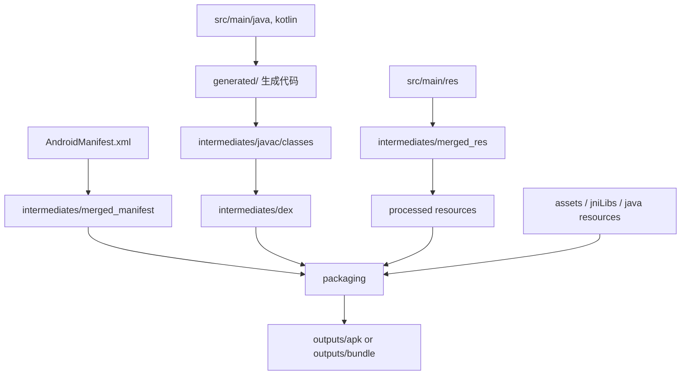

# build 目录详解

> 本文由内部知识库文档整理为 GitHub 可直接阅读的 Markdown。已移除原始内部链接、附件直链、账号标识、组织域名等公司相关信息。
> 图片已下载到 `image/`，附件已下载到 `file/` 并使用相对路径引用；可导出的文本绘图、代码块与表格已尽量保留。

Android 构建本质上是 Gradle 调度一堆 task，把源码、资源、Manifest、依赖等转换成 APK/AAB；AGP，也就是 Android Gradle Plugin，负责 Android 专属的编译、资源处理、打包等任务。官方也明确说 Android build system 会编译资源和源码，并打包成 APK 或 Android App Bundle；Gradle 用 task-based 的方式组织这些命令，插件负责注册和串联任务。

## 1、先说结论：build/ 目录能不能删？

可以删。

一般 Android 工程里的：

```java
/build
/app/build
/commonlibs/build
/deviceModule/build
...
```

都是构建产物目录，原则上都可以删。删了之后下一次编译会重新生成。

但是注意：


| 目录 | 能不能删 | 是否提交 Git | 说明 |
| --- | --- | --- | --- |
| 根目录 /build | 可以 | 不提交 | root project 的构建产物 |
| 模块 /app/build | 可以 | 不提交 | app 模块的编译中间产物和最终 APK |
| library 模块 /commonlibs/build | 可以 | 不提交 | AAR、中间 class、资源产物等 |
| .gradle/ | 可以，但谨慎 | 不提交 | Gradle 本地缓存/状态，删了会导致下次构建更慢 |
| ~/.gradle/caches | 可以，但更谨慎 | 不提交 | 全局依赖缓存，删了会重新下载依赖 |


通常遇到奇怪的构建问题时，可以先删：

```java
./gradlew clean
```

或者直接删某个模块：

```java
rm -rf app/build
```

## 2、Android 工程里常见的构建目录层级

以一个多模块工程为例：

```java
Android-Mower/
├── build/
├── app/
│   └── build/
├── commonlibs/
│   └── build/
├── deviceModule/
│   └── build/
├── libBluetooth/
│   └── build/
├── .gradle/
└── gradle/
```

主要看两类：

```java
根工程 build/
模块 build/
```

## 3、根目录 build/ 是干嘛的？

根目录：

```java
/project/build/
```

一般是 root project 级别的构建产物。

它通常不会放具体 APK，更多是一些全局性的任务输出、报告、脚本产物、聚合产物。

可能看到：

```java
build/
├── reports/
├── tmp/
├── kotlin/
├── generated/
└── outputs/
```

不同 AGP、Gradle、插件版本会不一样。

### 常见用途

#### 3.1 build/reports/

放构建报告、测试报告、lint 报告等，例如：

```java
build/reports/
├── problems/
├── tests/
├── lint-results.html
└── configuration-cache/
```

你遇到：

```java
BUILD FAILED
See the report at ...
```

#### 3.2 build/tmp/

临时文件目录。

Gradle task 执行过程中可能会在这里放临时输入输出。

#### 3.3 根目录 build/ 一般不用手动看

日常排查 Android 问题，更多看：

```java
app/build/
模块/build/
```

根目录 build/ 不是重点。

## 4、模块目录 build/ 是重点

比如：

```java
app/build/
commonlibs/build/
deviceModule/build/
```

每个 Android module 都有自己的 build/。

对于 app module：

```java
app/build/
```

它里面会有：

```java
app/build/
├── generated/
├── intermediates/
├── outputs/
├── tmp/
├── kotlin/
├── ksp/
├── kapt/
├── reports/
└── ...
```

这些目录可以理解成：


| 目录 | 作用 |
| --- | --- |
| generated/ | AGP 或插件生成的源码/资源 |
| intermediates/ | 编译中间产物，最重要但也最杂 |
| outputs/ | 最终产物，比如 APK、AAB、mapping |
| tmp/ | 临时文件 |
| kotlin/ | Kotlin 编译相关缓存/状态 |
| ksp/ | KSP 生成代码 |
| kapt/ | KAPT 生成代码 |
| reports/ | lint、测试、构建报告等 |


## 5. app/build/outputs/：最终产物目录

这个是你最常看的目录。

```java
app/build/outputs/
```

常见结构

```java
outputs/
├── apk/
│   ├── debug/
│   │   └── app-debug.apk
│   └── release/
│       └── app-release.apk
├── bundle/
│   └── release/
│       └── app-release.aab
├── mapping/
│   └── release/
│       ├── mapping.txt
│       ├── seeds.txt
│       └── usage.txt
├── logs/
└── aar/
```

### 5.1 outputs/apk/

APK 输出目录。

Debug 包一般在：

```java
app/build/outputs/apk/debug/app-debug.apk
```

Release 包一般在：

```java
app/build/outputs/apk/release/app-release.apk
```

命令：

```java
./gradlew :app:assembleDebug
```

通常生成：

```java
app/build/outputs/apk/debug/
```

官方文档也说明，可以用 Gradle Wrapper 执行 Android 项目的 build task，例如构建 debug APK、release APK 或 bundle

### 5.2 outputs/bundle/

AAB 输出目录。

命令：

```java
./gradlew :app:bundleRelease
```

生成类似：

```java
app/build/outputs/bundle/release/app-release.aab
```

### 5.3 outputs/mapping/

开启 R8/混淆后会生成：

```java
app/build/outputs/mapping/release/mapping.txt
```

常见文件：

```java
mapping.txt
seeds.txt
usage.txt
configuration.txt
```

含义：


| 文件 | 作用 |
| --- | --- |
| mapping.txt | 混淆前后类名/方法名映射 |
| usage.txt | 被 R8 删除的类和成员 |
| seeds.txt | 被 keep 规则保留的内容 |
| configuration.txt | 最终生效的混淆配置 |


线上崩溃还原堆栈时，mapping.txt 非常重要

### 5.4 outputs/aar/

如果是 library module，比如：

```java
commonlibs/build/outputs/aar/
```

里面会有：

```java
commonlibs-debug.aar
commonlibs-release.aar
```

app 模块一般不会有 aar，library 模块才有。

## 6. app/build/intermediates/：最重要的中间产物目录

这是 Android 构建里最复杂、也最有用的目录。

```java
app/build/intermediates/
```

它里面保存每个 task 的中间结果。

常见：

```java
intermediates/
├── merged_manifest/
├── packaged_manifests/
├── merged_res/
├── processed_res/
├── runtime_symbol_list/
├── compile_symbol_list/
├── javac/
├── classes/
├── dex/
├── project_dex_archive/
├── external_libs_dex_archive/
├── packaged_res/
├── assets/
├── merged_assets/
├── merged_jni_libs/
├── stripped_native_libs/
├── merged_java_res/
├── navigation_json/
├── incremental/
└── ...
```

不同 AGP 版本目录名会变化，不能把它当稳定 API。官方也强调 AGP 提供的是 Android 构建能力和扩展点；如果你要扩展构建，应该优先使用 AGP 官方 API，而不是硬依赖内部中间目录。

### 6.1 intermediates/merged_manifest/

最终合并后的 Manifest。

典型路径：

```java
app/build/intermediates/merged_manifest/debug/AndroidManifest.xml
```

或者：

```java
app/build/intermediates/merged_manifest/release/AndroidManifest.xml
```

用途：

- 查最终 AndroidManifest.xml 是什么；
- 查权限是不是被某个 AAR 带进来了；
- 查 provider、activity、service 有没有合并进去；
- 查 android:exported、uses-sdk、applicationId 等最终结果。

Manifest 来源很多：

```java
app/src/main/AndroidManifest.xml
src/debug/AndroidManifest.xml
flavor Manifest
依赖 AAR 的 Manifest
manifestPlaceholders
```

官方文档说明 Android manifest 合并器会合并 app、build variant 和依赖库中的 manifest，并且可以通过 tools: 规则控制合并行为。

#### 常见排查

比如你发现 APK 多了一个权限：

```java
<uses-permission android:name="android.permission.ACCESS_FINE_LOCATION" />
```

可以看：

```java
app/build/intermediates/merged_manifest/debug/AndroidManifest.xml
```

确认它最终是否存在。

### 6.2 intermediates/merged_res/

合并后的资源目录。

大概包括：

```java
app/src/main/res
src/debug/res
src/flavor/res
依赖 AAR 的 res
生成的 res
```

合并后进入 AAPT2 后续处理。

用途：

- 查最终资源有没有被合进去；
- 查某个 string/drawable/layout 是否被覆盖；
- 查 flavor/debug/release 资源优先级问题；
- 查 AAR 资源有没有带进来。

例如：

```java
app/build/intermediates/merged_res/debug/
```

里面可能有：

```java
layout/
drawable/
values/
mipmap/
```

#### 注意

merged_res 不是最终 APK 里的资源格式，只是中间状态。

最终 APK 里资源会被 AAPT2 编译/link，生成：

```java
resources.arsc
binary XML
compiled res
```

AAPT2 是 Android 的资源编译/打包工具，负责把 Android 资源编译、链接成应用可用的二进制资源。

### 6.3 intermediates/processed_res/ / packaged_res/

这类目录一般和 AAPT2 处理后的资源有关。

可能包含：

```java
resources-debug.ap_
out/
```

用途：

- 看 AAPT2 处理之后的资源包；
- 排查资源打包问题；
- 排查 R 引用、资源表问题。

一般业务开发很少直接看。

### 6.4 intermediates/runtime_symbol_list/

资源符号表。

常见文件：

```java
R.txt
```

用途：

- 记录资源 ID 符号；
- library module 产 AAR 时会用；
- app/link 资源时会用；
- 非传递 R 类、资源 shrink、增量构建等流程可能涉及。

如果你做 SDK/AAR 发布，经常会看到：

```java
R.txt
```

### 6.5 intermediates/compile_symbol_list/

编译期资源符号。

给当前模块编译时用，让 Java/Kotlin 能引用：

```java
R.layout.xxx
R.string.xxx
```

如果你遇到：

```java
cannot find symbol R.xxx.xxx
```

可能和资源没有进入 symbol list 有关。

### 6.6 intermediates/javac/

Java 编译产物。

典型路径：

```java
app/build/intermediates/javac/debug/classes/
```

里面是 .class 文件。

用途：

- 看 Java 编译后是否生成了 class；
- 查某个 Java 类有没有参与编译；
- 排查注解生成代码是否被 javac 编进去了。

例如：

```java
app/build/intermediates/javac/debug/classes/com/example/MainActivity.class
```

### 6.7 intermediates/classes/

某些 AGP 版本/插件会把 class 中间产物放这里。

可能包含：

```java
classes/
├── debug/
└── release/
```

用途类似 javac/，但具体结构随版本变化。

### 6.8 intermediates/dex/

dex 中间产物。

可能有：

```java
app/build/intermediates/dex/debug/
```

里面是：

```java
classes.dex
classes2.dex
```

用途：

- 查 dex 是否生成；
- 查 multidex；
- 排查 D8/R8 之后的产物。

Android 运行的不是普通 JVM .class，而是 DEX。D8 是把 Java bytecode 编译成 Android 设备可运行 DEX bytecode 的工具。

### 6.9 intermediates/project_dex_archive/

当前 project/module 的 dex archive。

Debug 增量构建时，为了快，AGP/D8 可能会把不同输入拆成 dex archive，后面再合并。

用途：

- 排查 dex 增量构建；
- 排查当前模块代码是否进 dex；
- 一般业务很少直接看。

### 6.10 intermediates/external_libs_dex_archive/

外部依赖转 dex 后的 archive。

来源包括：

```java
Maven 依赖
AAR 的 classes.jar
JAR 依赖
```

用途：

- 查第三方库是否被 dex；
- 排查重复类；
- 排查依赖有没有进入 APK。

### 6.11 intermediates/merged_assets/

合并后的 assets。

来源：

```java
app/src/main/assets
flavor assets
依赖 AAR 的 assets
生成的 assets
```

最终进入 APK：

```java
assets/
```

用途：

- 查某个配置 json、模型文件、证书、web 资源有没有被打进去；
- 查 assets 同名覆盖问题。

### 6.12 intermediates/merged_jni_libs/

合并后的 native so。

来源：

```java
src/main/jniLibs/
AAR/jni/
外部 native 依赖
```

结构类似：

```java
merged_jni_libs/
└── debug/
    └── out/
        ├── arm64-v8a/
        │   └── libxxx.so
        └── armeabi-v7a/
            └── libxxx.so
```

用途：

- 查 .so 有没有进入构建；
- 查 ABI 是否正确；
- 查多个 AAR 带了同名 so 导致冲突。

### 6.13 intermediates/stripped_native_libs/

被 strip 后的 .so。

Release 构建时，native library 可能会被 strip，去掉符号信息，减小体积。

用途：

- 查最终被打包的 so；
- 排查 native crash 符号；
- 排查 so 体积。

### 6.14 intermediates/merged_java_res/

合并 Java resources。

JAR 里可能有：

```java
META-INF/LICENSE
META-INF/services/xxx
META-INF/*.kotlin_module
```

这些不是 Android res/，而是 Java resources。

用途：

- 排查 META-INF 冲突；
- 排查 service loader 文件；
- 排查 packaging excludes/pickFirsts。

常见报错：

```java
Duplicate class
Duplicate files copied in APK META-INF/xxx
```

就可能和这里有关。

---

### 6.15 intermediates/incremental/

增量构建状态。

```java
intermediates/incremental/
```

用途：

- 保存 task 的增量输入输出状态；
- 下次编译判断哪些文件需要重新处理；
- 不建议手动改。

如果构建状态脏了，删掉 build/ 可以重来。

## 7. app/build/generated/：生成代码目录

```java
app/build/generated/
```

这里放各种生成代码和生成资源。

常见：

```java
generated/
├── source/
│   ├── buildConfig/
│   ├── r/
│   ├── aidl/
│   └── navigation-args/
├── res/
├── data_binding_base_class_source_out/
└── ...
```

### 7.1 generated/source/buildConfig/

生成 BuildConfig.java。

例如：

```java
app/build/generated/source/buildConfig/debug/com/example/BuildConfig.java
```

内容类似：

```java
public final class BuildConfig {
    public static final boolean DEBUG = true;
    public static final String APPLICATION_ID = "com.xxx.app";
    public static final String BUILD_TYPE = "debug";
    public static final int VERSION_CODE = 100;
    public static final String VERSION_NAME = "1.0.0";
}
```

来源：

```java
android {
    defaultConfig {
        versionCode 100
        versionName "1.0.0"
    }

    buildTypes {
        debug { }
        release { }
    }
}
```

也可以手动加：

```java
buildConfigField "String", "API_HOST", "\"https://xxx\""
```

### 7.2 generated/source/r/

生成 R 相关代码。

例如：

```java
R.layout.activity_main
R.string.app_name
R.drawable.icon
```

注意现在不同 AGP 版本下，R 可能不再以传统源码 .java 的形式大量存在，可能是 jar 或其他中间形态，但概念上就是给代码引用资源用。

### 7.3 generated/res/

生成的资源。

来源可能是：

```java
resValue
google-services plugin
navigation
data binding
自定义 Gradle task
```

比如：

```java
resValue "string", "api_host", "https://xxx"
```

会生成资源参与后续资源合并。

### 7.4 DataBinding / ViewBinding 生成目录

如果启用了：

```java
buildFeatures {
    viewBinding true
    dataBinding true
}
```

会生成：

```java
ActivityMainBinding
FragmentHomeBinding
```

这些生成类一般在：

```java
build/generated/data_binding_base_class_source_out/
```

或者相关 generated/intermediates 目录中。

## 8. app/build/tmp/：临时目录

```java
app/build/tmp/
```

Gradle task 执行时的临时文件。

比如：

```java
tmp/
├── compileDebugJavaWithJavac/
├── kotlin-classes/
├── expandedArchives/
└── ...
```

用途：

- 一般不用看；
- 编译器临时数据；
- task 临时输入输出；
- 出问题时偶尔用来查某个 task 的临时状态。

可以删。

## 9. app/build/kotlin/：Kotlin 编译状态

如果模块有 Kotlin，会看到：

```java
app/build/kotlin/
```

可能包含：

```java
compileDebugKotlin/
sessions/
```

用途：

- Kotlin incremental compilation 状态；
- Kotlin 编译缓存；
- 编译性能相关信息。

一般不用手动看

## 10. app/build/ksp/：KSP 生成代码

如果用了 KSP，比如 Room、Moshi、某些路由或 DI 框架，会有：

```java
app/build/generated/ksp/
app/build/ksp/
```

常见：

```java
build/generated/ksp/debug/kotlin/
build/generated/ksp/debug/java/
```

用途：

- 查 KSP 注解处理器有没有生成代码；
- 查 Room DAO、Database 实现；
- 查 Moshi adapter；
- 查某些 Router 生成类。

如果你遇到：

```java
Cannot find symbol Xxx_Impl
Unresolved reference XxxGenerated
```

可以看 KSP 生成目录。

## 11. app/build/generated/source/kapt/ / kapt/

如果用了 KAPT，比如 Dagger/Hilt、老版本 Room、Glide 等，可能有：

```java
app/build/generated/source/kapt/
app/build/tmp/kapt3/
```

用途：

- 查注解处理器生成的 Java 代码；
- 查 Dagger/Hilt 组件；
- 查 Glide GeneratedAppGlideModule；
- 查 ButterKnife、ARouter 等生成类。

你之前编译日志里类似：

```java
Wrote GeneratedAppGlideModule
```

这种就和注解处理生成代码有关。

## 12. app/build/reports/：报告目录

```java
app/build/reports/
```

可能有：

```java
reports/
├── lint-results-debug.html
├── lint-results-release.html
├── tests/
├── androidTests/
└── problems/
```

用途：

- 查看 lint 结果；
- 查看单元测试报告；
- 查看 instrumentation test 报告；
- 查看 Gradle problems 报告。

## 13. app/build/test-results/

单元测试结果。

```java
app/build/test-results/testDebugUnitTest/
```

里面可能是 XML：

```java
TEST-com.xxx.SomeTest.xml
```

CI 经常读取这里。

## 14. app/build/outputs/logs/

构建日志相关目录。

可能有：

```java
manifest-merger-debug-report.txt
manifest-merger-release-report.txt
```

这个很有用。

### Manifest 合并问题看这里

比如：

```java
app/build/outputs/logs/manifest-merger-debug-report.txt
```

可以看到：

```java
某个 permission 来自哪个 AAR
某个 activity 被谁覆盖
某个 provider authority 从哪里来
```

## 15、library 模块的 build/ 有什么不同？

比如：

```java
commonlibs/build/
```

library module 不会直接产 APK，而是产 AAR。

常见：

```java
commonlibs/build/
├── outputs/
│   └── aar/
│       ├── commonlibs-debug.aar
│       └── commonlibs-release.aar
├── intermediates/
├── generated/
└── tmp/
```

### library module 的关键产物

```java
build/outputs/aar/xxx-debug.aar
```

AAR 里面可能包含：

```java
AndroidManifest.xml
classes.jar
res/
assets/
jni/
R.txt
consumer-rules.pro
```

它被 app 依赖后，会参与 app 的：

```java
Manifest merge
资源 merge
Java/Kotlin compileClasspath
D8/R8 dex
assets 合并
jniLibs 合并
consumer ProGuard rules 合并
```

## 16、AAR 被展开后在哪里？

AGP 可能会把 AAR 解压到 Gradle transform/cache 或 module intermediates 中。不同版本路径不同，常见可能在：

```java
~/.gradle/caches/transforms-*/
```

或者 module 的某些 intermediates 目录中。

你不应该强依赖这些路径，因为它们属于 Gradle/AGP 内部实现，版本变化可能会变。

如果只是想看 AAR 内容，最稳的方式是直接解压：

```java
unzip -l xxx.aar
```

或者：

```java
jar tf xxx.aar
```

## 17. .gradle/ 和 build/ 有什么区别？

工程根目录下通常还有：

```java
.gradle/
```

它不是 build/，但和构建强相关。

### .gradle/

```java
.gradle/
├── 8.x/
├── buildOutputCleanup/
├── configuration-cache/
└── vcs-1/
```

作用：

- Gradle 本地状态；
- configuration cache；
- task history；
- 文件变化记录；
- 构建缓存状态；
- daemon 相关信息。

### 区别


| 目录 | 作用 |
| --- | --- |
| build/ | 当前 project/module 的构建产物 |
| .gradle/ | Gradle 本地执行状态和缓存 |
| ~/.gradle/caches/ | 全局依赖缓存、插件缓存、transform 缓存 |


如果你只想清某个模块产物，删：

```java
app/build
```

如果 Gradle 状态异常，再考虑删：

```java
.gradle
```

如果依赖缓存坏了，最后才考虑删：

```java
~/.gradle/caches
```

## 18、常见目录速查表

### App 模块

```bash
app/build/
├── generated/                      # 生成代码/生成资源
├── intermediates/                  # 编译中间产物
├── outputs/                        # APK/AAB/mapping/aar 等最终产物
├── tmp/                            # 临时文件
├── kotlin/                         # Kotlin 编译状态
├── ksp/                            # KSP 状态/产物
├── reports/                        # lint/test/problem 报告
└── test-results/                   # 单测结果
```

### outputs/

```bash
outputs/
├── apk/debug/app-debug.apk         # Debug APK
├── apk/release/app-release.apk     # Release APK
├── bundle/release/app-release.aab  # Release AAB
├── mapping/release/mapping.txt     # R8 混淆映射
├── logs/                           # Manifest merger 等日志
└── aar/                            # library module 的 AAR
```

### intermediates/

```python
intermediates/
├── merged_manifest/                # 合并后的 Manifest
├── merged_res/                     # 合并后的资源
├── processed_res/                  # AAPT2 处理后的资源
├── runtime_symbol_list/            # R.txt / 资源符号
├── javac/                          # Java 编译 class
├── dex/                            # dex 产物
├── project_dex_archive/            # 当前模块 dex archive
├── external_libs_dex_archive/      # 外部依赖 dex archive
├── merged_assets/                  # 合并 assets
├── merged_jni_libs/                # 合并 so
├── stripped_native_libs/           # strip 后 so
├── merged_java_res/                # Java resources 合并
└── incremental/                    # 增量构建状态
```

## 19、你排查问题时应该看哪里？

### 19.1 APK 有没有生成？

看：

```java
app/build/outputs/apk/debug/
app/build/outputs/apk/release/
```

### 19.2 AAB 有没有生成？

看：

```java
app/build/outputs/bundle/release/
```

### 19.3 混淆 mapping 在哪？

看：

```java
app/build/outputs/mapping/release/mapping.txt
```

### 19.4 最终 Manifest 是什么？

看：

```java
app/build/intermediates/merged_manifest/debug/AndroidManifest.xml
```

以及：

```java
app/build/outputs/logs/manifest-merger-debug-report.txt
```

### 19.5 某个资源有没有合进去？

看：

```java
app/build/intermediates/merged_res/debug/
```

### 19.6 某个 BuildConfig 字段有没有生成？

看：

```java
app/build/generated/source/buildConfig/debug/
```

### 19.7 KSP/KAPT 生成代码有没有出来？

看：

```java
app/build/generated/ksp/debug/
app/build/generated/source/kapt/debug/
```

### 19.8 某个 .so 有没有进包？

看：

```java
app/build/intermediates/merged_jni_libs/debug/
```

或者解压 APK：

```java
unzip -l app/build/outputs/apk/debug/app-debug.apk | grep ".so"
```

### 19.9 某个 class 有没有编译？

看：

```java
app/build/intermediates/javac/debug/classes/
```

或者看 dex：

```java
app/build/intermediates/dex/debug/
```

## 20、为什么不要在代码里依赖 build/intermediates 路径？

因为：

```java
build/intermediates 是 AGP 内部实现细节
不同 AGP 版本目录名可能变
不同 task 输出目录可能变
debug/release/flavor 路径也不同
```

如果你要写插件、生成代码、加入构建流程，建议用：

```java
Android Gradle Plugin Variant API
Gradle Task Provider
Artifacts API
SourceDirectories API
```

官方也提供了 AGP 扩展点，用于控制构建输入、扩展构建能力、集成新步骤。(developer.android.com)

也就是说，不建议这样：

```java
file("build/intermediates/xxx/debug")
```

更建议通过 AGP API 获取 artifact。

## 21、一句话理解各目录

可以这么记：

```java
generated/      编译前自动生成的源码/资源
intermediates/  编译过程中的中间结果
outputs/        最终你要拿走的东西
tmp/            临时文件
reports/        报告
kotlin/ksp/kapt Kotlin 和注解处理相关状态/生成物
.gradle/        Gradle 自己的本地状态
```

更直观一点：





## 22、实战建议

平时开发最常看的就这些：

```bash
app/build/outputs/apk/debug/
app/build/outputs/mapping/release/mapping.txt
app/build/intermediates/merged_manifest/debug/AndroidManifest.xml
app/build/outputs/logs/manifest-merger-debug-report.txt
app/build/intermediates/merged_res/debug/
app/build/generated/ksp/debug/
app/build/generated/source/kapt/debug/
```

如果构建异常，排查顺序可以是：

```java
1. 看 Gradle 控制台报错
2. 看 build/reports/
3. 看 app/build/outputs/logs/
4. 看 app/build/intermediates/merged_manifest/
5. 看 app/build/intermediates/merged_res/
6. 必要时 clean 或删除对应 module/build
```

如果只是普通脏构建：

```java
./gradlew clean
```

如果是某个模块状态异常：

```java
rm -rf app/build
```

如果是 Gradle 状态异常：

```java
rm -rf .gradle
```

如果是依赖缓存异常，最后再考虑：

```java
rm -rf ~/.gradle/caches
```

但最后这个成本最高，会导致依赖重新下载。
