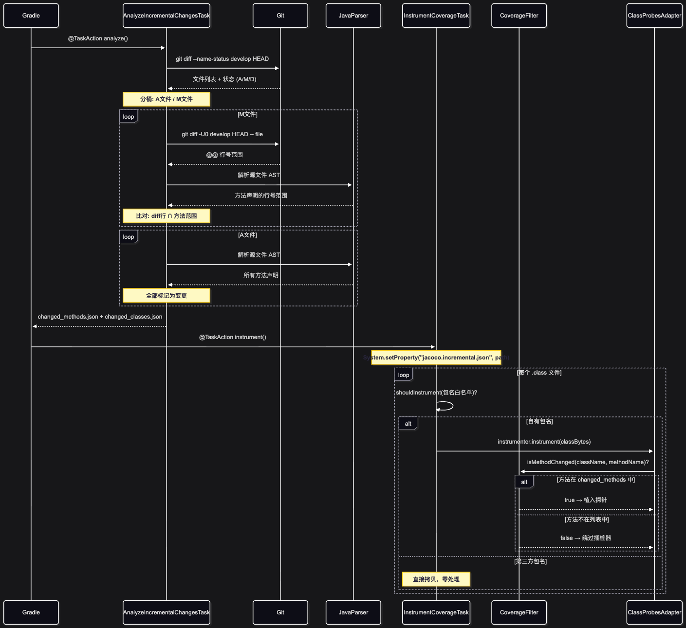
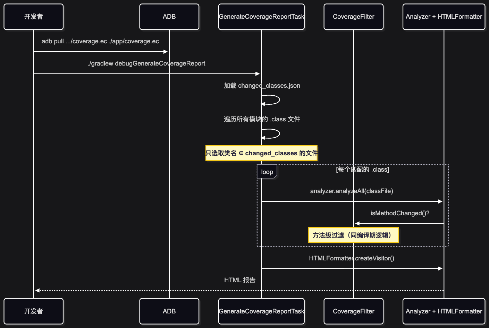
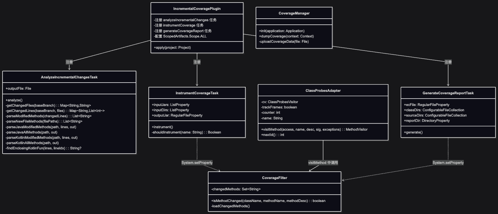

# 增量代码覆盖率统计设计

> 本文由内部知识库文档整理为 GitHub 可直接阅读的 Markdown。已移除原始内部链接、附件直链、账号标识、组织域名等公司相关信息。
> 图片已下载到 `image/`，附件已下载到 `file/` 并使用相对路径引用；可导出的文本绘图、代码块与表格已尽量保留。

## 一、背景与目标

在大型 Android 工程中，全量覆盖率统计会产生大量无关数据（历史代码占比 95%+），导致覆盖率数字失真、QA 难以聚焦。

**目标**：只统计「本分支相对于 develop 分支变动的代码」的覆盖率，让覆盖率数值真实反映本次迭代的测试质量。

**核心约束**：

- 不修改业务代码
- 不引入外部 CI 服务依赖
- Release 包零侵入
- 支持全工程所有子模块

## 二、整体架构


## 三、核心流程

### 3.1 编译期流程



### 3.2 运行时流程



### 3.3 报告生成流程



## 四、类图


## 五、两层过滤机制详解

这是整个系统最核心的设计，通过两层过滤实现精准的增量控制：

### 第一层：包名白名单（InstrumentCoverageTask）

```kotlin
目的：排除第三方库，避免不必要的处理开销
粒度：包级别
位置：InstrumentCoverageTask.shouldInstrument()

com/Example/mower/**  → ✅ 进入第二层
cn/example/**        → ✅ 进入第二层
com/example/**       → ✅ 进入第二层
androidx/**          → ❌ 直接拷贝
com/google/**        → ❌ 直接拷贝

```

### 第二层：变更方法匹配（CoverageFilter）

```kotlin
目的：精确到方法级别，只对变更的方法植入探针
粒度：方法级别
位置：ClassProbesAdapter.visitMethod() → CoverageFilter.isMethodChanged()

JVM className: com/Example/mower/MainActivity
                     ↓ 提取简短类名
              simpleClassName: MainActivity
                     ↓ 与 changed_methods.json 比对
              "MainActivity:onCreate" → ✅ 植入探针
              "MainActivity:onResume" → ❌ 绕过（该方法未修改）

```

### 绕过机制（ClassProbesAdapter 核心改造）

```kotlin
// ClassProbesAdapter.visitMethod() 中的关键代码
if (!CoverageFilter.isMethodChanged(this.name, name, desc)) {
    // 情况1: 插桩阶段 → 绕过 ClassInstrumenter，直接写入原始字节码
    if (cv != null && cv.getDelegate() != null) {
        return cv.getDelegate().visitMethod(access, name, desc, signature, exceptions);
    }
    // 情况2: 分析阶段 → 返回 null 跳过该方法
    return null;
}
// 通过过滤 → 进入正常的 JaCoCo 探针植入流程

```

## 六、数据格式

### changed_methods.json

```json
{
  "methods": [
    "MainActivity:onCreate",
    "MainActivity:onNewIntent",
    "DeviceNavigator:navigation",
    "RouteBuilder:withString",
    "AccountProviderImpl:<init>"
  ]
}

```

格式：`简短类名:方法名`，由 AnalyzeIncrementalChangesTask 生成。 消费者：CoverageFilter（编译期插桩 + 报告分析）。

### changed_classes.json

```kotlin
{
  "classes": [
    "MainActivity",
    "DeviceNavigator",
    "RouteBuilder",
    "AccountProviderImpl"
  ]
}

```

格式：简短类名列表（从 changed_methods 中提取去重）。 消费者：GenerateCoverageReportTask（报告阶段只分析这些类的 .class 文件）。

## 七、文件变更分类处理策略


| 含义 | 处理方式 | 依据 |
| --- | --- | --- |
| 新增文件 | 提取文件中所有方法 | 整个文件都是本分支新写的代码 |
| 修改文件 | 仅提取 diff 行所在的方法 | 只有被改动的方法才需要验证覆盖率 |
| 删除文件 | 忽略 | 已删除的代码不需要覆盖率 |
| 重命名 | 忽略 | 重命名不影响代码逻辑 |


### M 文件的方法定位算法

```kotlin
1. git diff -U0 develop HEAD -- file.java
   → 提取 @@ +10,3 @@ 中的行号范围 [10, 11, 12]

2. JavaParser 解析源文件 AST
   → 得到每个方法的 [begin.line, end.line]
   
3. 交集判断
   → 如果 diff 行号 ∈ [begin.line, end.line]，则该方法被标记为变更

```

![该图片是文件变更分类处理策略中，对应修改文件时的方法定位算法示意图，用于说明修改文件如何提取需验证覆盖率的方法。图中通过两个交集判断逻辑完成定位：一是将方法onCreate的行号范围8-25，与diff行号10、11、12取交集，由于10属于区间\[8,25\]，因此将该方法标记为需验证；二是将方法onResume的行号范围30-40，与上述diff行...](image/增量代码覆盖率统计设计-图06.png)

## 八、文件结构与职责

```bash
项目根目录/
├── buildSrc/                              # 编译期工具链
│   ├── build.gradle.kts                   # 依赖: JavaParser, JaCoCo Core
│   └── src/main/
│       ├── kotlin/com/example/coverage/
│       │   ├── IncrementalCoveragePlugin.kt    # ① 插件入口
│       │   ├── AnalyzeIncrementalChangesTask.kt # ② Git Diff + AST 分析
│       │   ├── InstrumentCoverageTask.kt        # ③ 字节码插桩
│       │   └── GenerateCoverageReportTask.kt    # ④ HTML 报告生成
│       └── java/org/jacoco/core/internal/flow/
│           ├── CoverageFilter.java              # ⑤ 方法级过滤器
│           └── ClassProbesAdapter.java          # ⑥ JaCoCo 核心改造
│
├── coverage-runtime/                      # 运行时模块
│   └── src/main/
│       ├── java/com/example/coverage/
│       │   ├── CoverageManager.kt              # ⑦ 数据自动采集
│       │   └── CoverageReceiver.kt             # 广播接收器(备用)
│       ├── resources/
│       │   └── jacoco-agent.properties          # ⑧ 禁用默认输出
│       └── AndroidManifest.xml
│
├── app/
│   ├── build/outputs/coverage/
│   │   ├── changed_methods.json           # 编译期产物
│   │   └── changed_classes.json           # 编译期产物
│   ├── coverage.ec                        # 运行时产物(adb pull)
│   └── build/reports/coverage/debug/
│       └── index.html                     # 最终报告

```

## 九、关键设计决策

### 9.1 为什么用 Scope.ALL 而不是 Scope.PROJECT？

Scope.PROJECT 只拦截当前模块（app）的 .class 文件。但 Android-Mower 是多模块工程，deviceModule、commonlibs、router 等子模块的代码也会被打进 APK。使用 Scope.ALL 才能拦截到所有模块的编译产物，实现全工程覆盖。

代价是会收到第三方库的 .class，所以配合 shouldInstrument() 白名单做包级别的预过滤。

### 9.2 为什么改造 ClassProbesAdapter 而不是在 InstrumentCoverageTask 中过滤？

InstrumentCoverageTask 能做到的最细粒度是**类级别**（跳过整个 .class 文件），无法做到**方法级别**。 JaCoCo 的探针植入发生在 ClassProbesAdapter.visitMethod() 内部，这是 ASM 的 Visitor 模式，每个方法被逐一 visit。 只有在这里插入 CoverageFilter.isMethodChanged() 判断，才能实现"同一个类中，只对被修改的方法植入探针"。

### 9.3 为什么用 output=none？

JaCoCo Agent 默认配置是 output=file，启动时会立即尝试写入 jacoco.exec。 在 Android 上，这个文件路径默认指向只读的系统根目录 /jacoco.exec，导致 Permission denied → ExceptionInInitializerError → App 崩溃。 设置 output=none 禁用自动输出，改由 CoverageManager 在合适的时机手动提取内存数据。

### 9.4 为什么在 onActivityStopped 中 dump？

- onDestroy 不可靠（系统可能直接杀进程）
- onPause 太频繁（弹个对话框就触发）
- onStopped 表示页面完全不可见，频率适中，且在进程被杀前一定会被调用

## 十、使用流程

```markdown
# 1. 编译 debug 包（自动分析 diff + 插桩）
./gradlew assembleDebug

# 2. 安装到手机，正常手工测试
adb install app/build/outputs/apk/debug/app-debug.apk

# 3. 测试完成后，拉取覆盖率数据
adb pull /storage/emulated/0/Android/data/com.Example.mower/files/coverage/coverage.ec ./app/coverage.ec

# 4. 生成增量覆盖率 HTML 报告
./gradlew debugGenerateCoverageReport

# 5. 浏览器打开报告
open app/build/reports/coverage/debug/index.html

```

## 十一、已知限制


| 限制 | 影响 | 解决方向 |
| --- | --- | --- |
| Kotlin 方法解析使用启发式（查找 fun 关键字） | 可能漏报 lambda/属性访问器 | 引入 kotlin-compiler-embeddable 做 AST 解析 |
| 方法名匹配不含参数签名 | 同名重载方法会全部被标记 | CoverageFilter 中增加 methodDesc 比对 |
| coverage.ec 需要手动 adb pull | 自动化程度不够 | CoverageManager 增加 HTTP 上传接口 |
