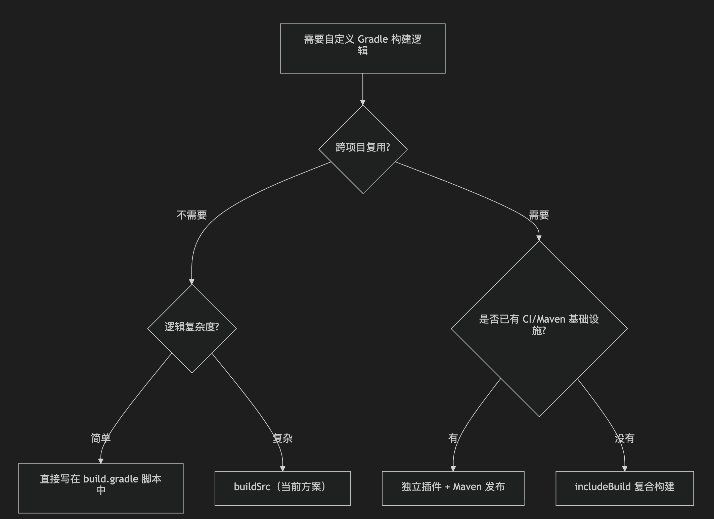

# 独立 Gradle 插件项目实现指南

> 本文由内部知识库文档整理为 GitHub 可直接阅读的 Markdown。已移除原始内部链接、附件直链、账号标识、组织域名等公司相关信息。
> 图片已下载到 `image/`，附件已下载到 `file/` 并使用相对路径引用；可导出的文本绘图、代码块与表格已尽量保留。

## 一、buildSrc vs 独立插件项目

```kotlin
buildSrc/                          独立插件项目/
├── 和主工程绑定在一起               ├── 独立的 Git 仓库
├── 不需要发布                      ├── 发布到 Maven（本地或远程）
├── 改一行就要全量重编译              ├── 版本化管理，按需升级
├── 不能跨项目复用                   ├── 多个项目都能用
└── 适合：项目级定制                 └── 适合：团队/公司级通用工具

```

## 二、独立插件项目的目录结构

```kotlin
coverage-plugin/                        ← 独立的项目（独立Git仓库）
├── build.gradle.kts                    ← 插件项目的构建配置
├── settings.gradle.kts
├── gradle.properties
├── src/main/
│   ├── kotlin/com/example/coverage/
│   │   ├── IncrementalCoveragePlugin.kt
│   │   ├── AnalyzeIncrementalChangesTask.kt
│   │   ├── InstrumentCoverageTask.kt
│   │   └── GenerateCoverageReportTask.kt
│   ├── java/org/jacoco/core/internal/flow/
│   │   ├── CoverageFilter.java
│   │   └── ClassProbesAdapter.java
│   └── resources/
│       └── META-INF/gradle-plugins/
│           └── com.example.coverage.properties

```

结构和 buildSrc 几乎一模一样，**核心区别在 build.gradle.kts**。

## 三、从零创建独立插件项目

### 3.1 build.gradle.kts（关键差异）

```javascript
// coverage-plugin/build.gradle.kts
plugins {
    `kotlin-dsl`
    `java-gradle-plugin`   // ← 独立插件必须加这个
    `maven-publish`         // ← 用于发布到 Maven 仓库
}

group = "com.example.tools"
version = "1.0.0"

repositories {
    google()
    mavenCentral()
}

dependencies {
    implementation("com.android.tools.build:gradle:8.6.0")
    implementation("org.ow2.asm:asm:9.6")
    implementation("org.ow2.asm:asm-commons:9.6")
    implementation("com.github.javaparser:javaparser-symbol-solver-core:3.25.8")
    implementation("org.jacoco:org.jacoco.core:0.8.11")
    implementation("org.jacoco:org.jacoco.report:0.8.11")
}

// ===== 插件元数据注册（替代 META-INF/gradle-plugins/*.properties） =====
gradlePlugin {
    plugins {
        create("incrementalCoverage") {
            id = "com.example.coverage"                                    // 插件 ID
            implementationClass = "com.example.coverage.IncrementalCoveragePlugin"  // 入口类
            displayName = "Incremental Coverage Plugin"
            description = "只对 Git 变更代码进行 JaCoCo 插桩和覆盖率统计"
        }
    }
}

// ===== 发布配置 =====
publishing {
    repositories {
        // 方式一：发布到本地目录（开发调试用）
        maven {
            name = "local"
            url = uri("${rootProject.projectDir}/repo")
        }

        // 方式二：发布到公司内部 Maven（正式使用）
        // maven {
        //     name = "internal"
        //     url = uri("https://nexus.example.com/repository/gradle-plugins/")
        //     credentials {
        //         username = findProperty("nexus.user") as? String
        //         password = findProperty("nexus.password") as? String
        //     }
        // }
    }
}
```

### 3.2 settings.gradle.kts

```kotlin
rootProject.name = "coverage-plugin"
```

### 3.3 插件源码（和 buildSrc 完全一样）

Plugin 类、Task 类的代码**不需要改任何一行**，直接从 buildSrc 拷贝过来即可。

## 四、两种发布方式

### 4.1 发布到本地目录（推荐先用这种调试）

```kotlin
cd coverage-plugin
./gradlew publishToMavenLocal
## 发布到 ~/.m2/repository/com/example/tools/coverage-plugin/1.0.0/

```

或者发布到项目内的本地目录：

```kotlin
./gradlew publish
## 发布到 coverage-plugin/repo/ 目录
```

### 4.2 发布到远程 Maven（公司 Nexus/Artifactory）

```kotlin
./gradlew publish -Pnexus.user=admin -Pnexus.password=xxx
```

## 五、在主工程中使用独立插件

### 5.1 根目录 build.gradle（声明插件依赖）

```java
// Android-Mower-Coverage/build.gradle（根目录）
buildscript {
    repositories {
        google()
        mavenCentral()
        mavenLocal()  // ← 如果发布到本地

        // 如果发布到本地目录
        // maven { url uri('/path/to/coverage-plugin/repo') }

        // 如果发布到公司 Maven
        // maven { url 'https://nexus.example.com/repository/gradle-plugins/' }
    }
    dependencies {
        classpath 'com.android.tools.build:gradle:8.6.0'
        // ↓ 引入独立插件，格式: group:artifact:version
        classpath 'com.example.tools:coverage-plugin:1.0.0'
    }
}

```

### 5.2 app/build.gradle（应用插件，和之前完全一样）

```kotlin
// app/build.gradle
apply plugin: 'com.android.application'
apply plugin: 'com.example.coverage'    // ← 用法不变
```

**对于使用者来说，唯一的区别就是在根 build.gradle 的 classpath 中多加一行依赖。**

## 六、对比：迁移前后的变化

### 迁移前（buildSrc）

```kotlin
Android-Mower-Coverage/
├── buildSrc/                          ← 编译期代码在这里
│   ├── build.gradle.kts
│   └── src/main/kotlin/...
├── app/
│   └── build.gradle
│       └── apply plugin: 'com.example.coverage'   ← 直接用
└── settings.gradle                    ← 不需要额外配置
```

#### 迁移后（独立插件）

```kotlin
coverage-plugin/                       ← 独立仓库
├── build.gradle.kts                   ← 多了 maven-publish 和 gradlePlugin 配置
├── src/main/kotlin/...                ← 代码一模一样
└── repo/                             ← 本地 Maven 产物

Android-Mower-Coverage/
├── （没有 buildSrc 了）
├── build.gradle                       ← 多了一行 classpath 依赖
│   └── classpath 'com.example.tools:coverage-plugin:1.0.0'
├── app/
│   └── build.gradle
│       └── apply plugin: 'com.example.coverage'   ← 用法不变

```

## 七、另一种方式：includeBuild（推荐过渡方案）

如果暂时不想发布到 Maven，但又想从 buildSrc 独立出来，可以用 Gradle 的 **复合构建（Composite Build）**：

### 7.1 把 buildSrc 改名移出去

```kotlin
mv buildSrc ../coverage-plugin
```

### 7.2 在主工程 settings.gradle 中引用

```kotlin
// Android-Mower-Coverage/settings.gradle
pluginManagement {
    // 告诉 Gradle：这个插件从本地目录加载
    includeBuild('../coverage-plugin')
}

```

### 7.3 在 app/build.gradle 中使用（完全不变）

```kotlin
apply plugin: 'com.example.coverage'
```

**好处**：

- 不需要发布到 Maven
- 代码改动后立即生效（和 buildSrc 一样）
- 但编译是增量的（比 buildSrc 快）
- 未来想发布到 Maven 时，只需要加 `maven-publish` 配置

## 八、三种方案选择指南




| 场景 | 推荐方案 |
| --- | --- |
| 只在这个项目用，快速迭代 | buildSrc（当前） |
| 想独立出来但不想搞 Maven | includeBuild |
| 多个项目复用，有 Nexus | 独立插件 + Maven |
| 开源发布给社区 | 独立插件 + Gradle Plugin Portal |


## 九、本项目的建议

当前使用 **buildSrc** 是合理的，因为：

- 覆盖率插件只在 Mower 项目中使用
- 还在快速迭代，经常改动
- 不需要版本管理

**未来如果**要给其他项目（如 example App、Fleet App）复用，推荐路径：

```kotlin
第一步：buildSrc → includeBuild（零成本迁移，改个目录名就行）
第二步：includeBuild → Maven 发布（加 publishing 配置，打通 CI）
```

[附件：独立Gradle插件项目实现指南-附件01.zip](file/独立Gradle插件项目实现指南-附件01.zip)
