# 签名详解

> 本文由内部知识库文档整理为 GitHub 可直接阅读的 Markdown。已移除原始内部链接、附件直链、账号标识、组织域名等公司相关信息。
> 图片已下载到 `image/`，附件已下载到 `file/` 并使用相对路径引用；可导出的文本绘图、代码块与表格已尽量保留。

## 1、签名的作用

Android App 签名解决的核心问题是：

> *这个 APK 是不是被同一个签名私钥持有者发布的？*  
> *APK 从打包后到安装前有没有被篡改？*  
> *这个新 APK 能不能覆盖安装旧版本？*

Android 并不是靠“包名”判断一个 App 是不是同一个开发者，而是靠：

```java
packageName + signing certificate
```

更新安装时，系统会比较新旧 APK 的签名证书。如果包名一样但签名不同，正常情况下不能覆盖安装。

## 2、为什么 App 需要签名？

如果 APK 不签名，会有几个问题。

### 2.1 防止 APK 被篡改

比如你发布了：

```java
com.example.app.apk
```

攻击者拿到 APK 后，往里面加一段恶意代码：

```java
原 APK
  ├── classes.dex
  ├── res/
  └── AndroidManifest.xml

被篡改 APK
  ├── classes.dex  // 被改了
  ├── res/
  └── AndroidManifest.xml
```

如果没有签名，系统无法知道这个 APK 是否被改过。

签名后，APK 中关键内容会被计算 digest/hash，然后用私钥签名。安装时系统用 APK 里的公钥证书验证签名。一旦 APK 字节被改，hash 就对不上，安装失败。

### 2.2 防止别人冒充你的更新包

假设用户已经安装了你的 App：

```java
packageName = com.example.app
signer = A
```

攻击者也做一个 APK：

```java
packageName = com.example.app
signer = B
```

系统安装更新时会比较签名：

```java
旧版本 signer = A
新版本 signer = B
```

不一致，系统拒绝覆盖安装。

所以攻击者即使知道你的包名，也不能正常冒充你的更新包。

### 2.3 支持 signature 权限、共享 UID、进程信任关系

Android 里有些权限是：

```java
android:protectionLevel="signature"
```

只有“和权限声明方使用相同签名”的 App 才能拿到。

这类能力依赖签名身份。如果没有签名，系统无法判断两个 App 是不是同一个开发主体。

## 3、签名的密码学原理

Android App 签名本质上用的是非对称加密签名。

你手里有一对密钥：

```java
私钥 private key：只能开发者持有，不能泄露
公钥 public key：放在证书里，可以公开
```

签名过程：


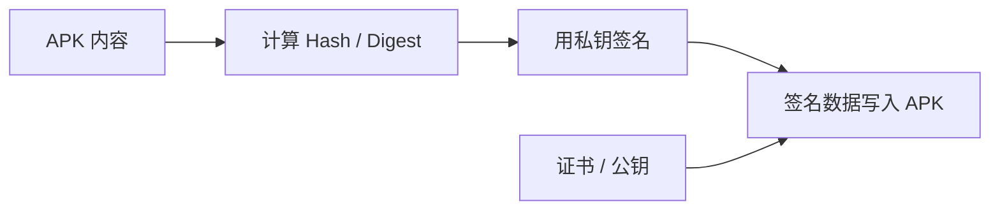


验证过程：


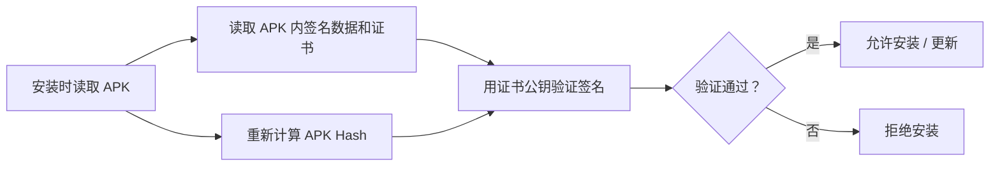


核心点：

```java
私钥能生成签名
公钥只能验证签名
```

所以别人即使能拿到你的 APK、公钥、证书，也不能伪造一个合法的新签名，除非他拿到了你的私钥。

## 4、Android 签名不是传统 HTTPS CA 证书

Android App 签名证书一般是 自签名证书。

也就是说，它不需要像 HTTPS 一样找 CA 机构签发。Android 关心的不是：

```java
这个证书是不是某个权威 CA 认证的？
```

而是：

```java
这次安装的 APK 和之前安装的 APK，是不是同一个签名身份？
```

所以 Android App 签名更像是：

```java
App 身份指纹
```

不是现实公司身份认证。

当然，如果你通过 Google Play 发布，Google Play 会引入额外的账号、上传密钥、Play App Signing 等机制。官方文档说明，使用 Android App Bundle 发布时，需要先用 upload key 签名上传，之后 Play App Signing 负责对分发给用户的应用签名。

## 5、APK 签名方案总览

Android 目前主要有这些 APK 签名方案：


| 签名方案 | 名称 | 引入版本 | 核心作用 |
| --- | --- | --- | --- |
| v1 | JAR signing | Android 早期 | 对 APK 内部 ZIP entry 逐个签名 |
| v2 | APK Signature Scheme v2 | Android 7.0 / API 24 | 对几乎整个 APK 做完整性保护 |
| v3 | APK Signature Scheme v3 | Android 9 / API 28 | 在 v2 基础上支持签名密钥轮换 |
| v3.1 | APK Signature Scheme v3.1 | Android 13 / API 33 | 更好支持面向新版系统的 key rotation |
| v4 | APK Signature Scheme v4 | Android 11 / API 30 | 为流式安装/增量安装提供外部签名文件 |


官方 AOSP 文档说明，Android 7.0 及以上支持 v2 及后续方案，v3 在 Android 9 中增加额外信息以支持 key rotation；v4 从 Android 11 开始支持，并且 v4 签名需要配套 v2 或 v3 签名。

## 6、APK 文件结构先看一下

APK 本质上是一个 ZIP 文件。

简化结构：

```java
app.apk
├── AndroidManifest.xml
├── classes.dex
├── resources.arsc
├── res/
├── assets/
├── lib/
├── META-INF/                 // v1 签名相关
│   ├── MANIFEST.MF
│   ├── CERT.SF
│   └── CERT.RSA
├── [APK Signing Block]        // v2/v3 签名相关
├── Central Directory
└── End of Central Directory
```

v1 和 v2/v3 最大区别是：

```java
v1：从 JAR/ZIP 角度，对每个文件 entry 做签名
v2/v3：从整个 APK 文件角度，对 APK 整体结构做签名
```

## 7、v1：JAR signing

### 7.1 v1 是什么？

v1 签名来自 Java JAR 签名机制。

APK 本质是 ZIP/JAR，所以早期 Android 直接复用了 JAR signing。

签名文件通常在：

```java
META-INF/
├── MANIFEST.MF // 清单文件 这是最内层的保护，记录了 APK 中每一个文件的摘要
├── CERT.SF // 签名摘要文件 计算整个 MANIFEST.MF 文件的摘要，记录为 SHA1-Digest-Manifest 同时也会为 MANIFEST.MF 中的每个条目单独计算摘要
└── CERT.RSA //签名证书文件 使用开发者的私钥对 CERT.SF 文件进行数字签名 同时嵌入包含公钥的数字证书（自签名证书，无需 CA 认证） 
```

结构大概是：


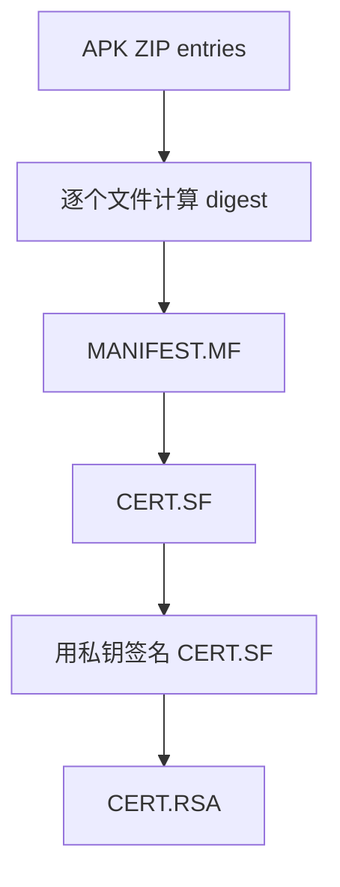


### 7.2 v1 怎么验证？

安装时，系统会读取 META-INF 里的签名文件，然后校验每个 ZIP entry 的 digest。

比如：

```java
classes.dex digest = xxx
res/layout/main.xml digest = yyy
AndroidManifest.xml digest = zzz
```

如果某个文件内容变了，对应 digest 对不上，安装失败。

### 7.3 v1 的问题

v1 的问题在于：

> *它主要保护 ZIP 里的每个 entry 内容，不是从“整个 APK 文件”的角度保护所有结构。*

也就是说，它对 ZIP 元数据、额外字段、Central Directory 等结构的保护不足。

这导致早期方案存在一些历史安全问题，例如可以利用 ZIP/JAR 解析差异做攻击。后来 Android 推出 v2，就是为了从 APK 整体层面做更强完整性保护。

### 7.4 v1 的优点

v1 的主要价值是：

```java
兼容 Android 7.0 以下设备
```

如果你的 minSdkVersion 很低，比如还要支持 Android 6、Android 5，那么 APK 通常需要保留 v1 签名。

## 8、v2：APK Signature Scheme v2

### 8.1 v2 是什么？

v2 是 Android 7.0 引入的新签名方案。

它不再只对 ZIP entry 分别签名，而是在 APK 中插入一个：

```java
APK Signing Block
```

位置大概在：

```java
[ZIP entries]
[APK Signing Block]
[Central Directory]
[End of Central Directory]
```

简化图：


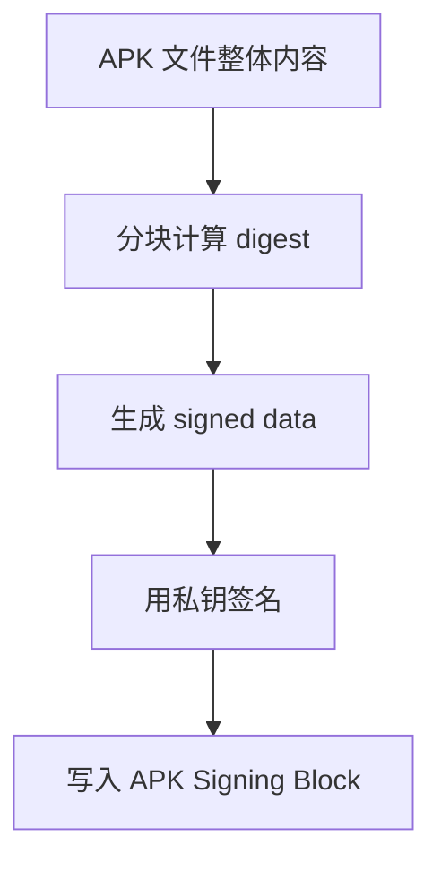


官方文档说明，v2 会保护 APK 的多个核心区段，包括 ZIP entries、Central Directory、End of Central Directory，以及 signing block 中的 signed data。

### 8.2 v2 保护范围更大

v1：

```java
主要保护 ZIP entry 文件内容
```

v2：

```java
保护 APK 文件整体结构
```

这意味着：

```java
classes.dex 改了，不行
resources.arsc 改了，不行
AndroidManifest.xml 改了，不行
ZIP Central Directory 改了，也不行
APK 结构被偷偷塞东西，也更难绕过
```

### 8.3 v2 的性能优势

v1 验证时，需要逐个解压/读取 ZIP entry。

v2 可以从 APK 整体角度做 chunk digest 校验，安装验证更快。

所以 v2 同时提升了：

```java
安全性
安装验证性能
```

### 8.4 v2 的兼容性

v2 支持：

```java
Android 7.0 / API 24 及以上
```

Android 7 以下设备不认识 v2。

所以如果要兼容 Android 6 及以下，通常要：

```java
同时启用 v1 + v2
```

## 9、v3：APK Signature Scheme v3

### 9.1 v3 是什么？

v3 是 Android 9 引入的签名方案。

它和 v2 的整体结构很像，核心增强是：

```java
支持 APK signing key rotation
```

也就是：

> *App 可以更换签名密钥，并让系统知道“新密钥和旧密钥之间的可信关系”。*

官方文档说明，Android 9 支持 APK key rotation；为了让轮换可行，APK 需要表达新旧签名密钥之间的信任关系，因此 v3 在 signing block 中加入了 proof-of-rotation 结构。

### 9.2 为什么需要 key rotation？

假设你的 App 用了一个签名 key：

```java
old key
```

几年后你发现：

```java
旧 key 可能不够安全
旧 key 算法太弱
旧 key 被放在不安全的机器上
公司需要更换密钥管理方案
```

你想换成：

```java
new key
```

但是 Android 更新安装会比较签名：

```java
旧版本 signer = old key
新版本 signer = new key
```

如果没有额外机制，系统会认为签名不同，拒绝更新。

v3 就是为了解决这个问题。

### 9.3 v3 怎么表达 key rotation？

v3 里可以包含：

```java
proof-of-rotation
```

可以理解成一条签名血缘链：


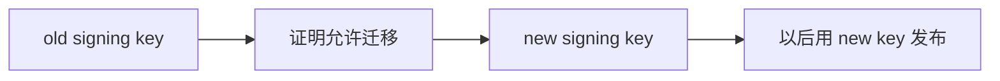


系统验证时，会知道：

```java
old key 信任 new key
new key 是 old key 的合法继任者
```

于是允许更新。

### 9.4 v3 的兼容性

v3 支持：

```java
Android 9 / API 28 及以上
```

Android 9 以下设备不认识 v3。

所以实际发布时通常会组合：

```java
v1 + v2 + v3
```

让不同系统选择自己支持的最高方案。

## 10、v3.1：Android 13 后更好的 key rotation

v3.1 是 v3 的增强，主要面向 Android 13 及以上。

官方文档说明，v3.1 支持 SDK version targeting，可以让 Android 13 及以上设备使用 rotated signer，而旧系统忽略 rotated signer，继续使用原 signer。

v3.1 是 v3 的增强，主要面向 Android 13 及以上。

官方文档说明，v3.1 支持 SDK version targeting，可以让 Android 13 及以上设备使用 rotated signer，而旧系统忽略 rotated signer，继续使用原 signer。

简单理解：

```java
Android 13+：可以使用新签名 key
Android 12 及以下：仍然看到旧签名 key
```

这样可以减少 key rotation 对旧系统的兼容性影响。

## 11、v4：APK Signature Scheme v4

### 11.1 v4 是什么？

v4 是 Android 11 引入的签名方案。

它和 v1/v2/v3 最大区别是：

```java
v4 签名不直接写在 APK 里面
```

而是生成一个独立文件：

```java
app.apk.idsig
```

官方文档说明，Android 11 支持 v4，v4 是一种 streaming-compatible signing scheme，签名基于整个 APK 字节计算的 Merkle hash tree；Android 11 会把签名存储在独立的 <apk name>.apk.idsig 文件中，并且 v4 要求 APK 同时具备 v2 或 v3 签名。

### 11.2 v4 解决什么问题？

v4 主要不是为普通“完整 APK 安装”设计的，而是为了：

```java
流式安装
增量安装
快速验证
```

比如：

```java
APK 很大
还没完整下载完就想开始验证部分内容
安装时只更新发生变化的部分
```

v4 用 Merkle tree 可以支持按块验证。

### 11.3 Merkle tree 是什么？

可以简单理解成：

```java
把 APK 拆成很多块
每块算 hash
再把 hash 两两组合继续算 hash
最后得到一个 root hash
```

图：


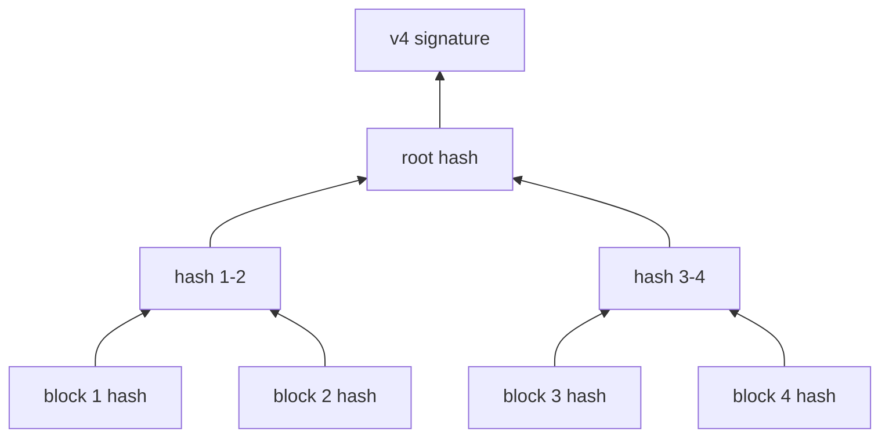


好处是：

```java
验证某一块时，不需要重新 hash 整个 APK
可以快速证明这一块属于完整可信 APK
```

### 11.4 v4 不能单独存在

很重要：

```java
v4 必须配合 v2 或 v3
```

因为 v4 是外部 .idsig 文件，它不是传统意义上替代 v2/v3 的完整安装签名。

所以不能理解成：

```java
只开 v4 就够了
```

而应该理解成：

```java
v2/v3 负责 APK 本体可信
v4 辅助流式/增量安装
```

## 12、v1/v2/v3/v4 对比表


| 维度 | v1 JAR signing | v2 APK Signature Scheme | v3 APK Signature Scheme | v4 APK Signature Scheme |
| --- | --- | --- | --- | --- |
| 引入目的 | 早期 APK/JAR 签名 | 保护整个 APK | 支持 key rotation | 支持流式/增量安装 |
| 支持系统 | 所有早期 Android | Android 7.0+ | Android 9+ | Android 11+ |
| 签名位置 | META-INF/ | APK Signing Block | APK Signing Block | 独立 .idsig 文件 |
| 保护粒度 | ZIP entry 文件级 | APK 整体级 | APK 整体级 + 轮换信息 | APK 分块 Merkle tree |
| 是否防整体结构篡改 | 弱 | 强 | 强 | 依赖 v2/v3 |
| 是否支持 key rotation | 不支持 | 不支持 | 支持 | 不负责 |
| 是否可单独用于现代安装 | 可以但不推荐 | 可以 | 可以 | 不可以，需配合 v2/v3 |
| 主要价值 | 兼容旧系统 | 安全和性能 | 换签名 key | 快速/增量验证 |


## 13、系统安装时怎么选择签名方案？

一个 APK 可以同时包含多种签名：

```java
v1 + v2 + v3
```

不同 Android 版本会选择自己支持的方案。


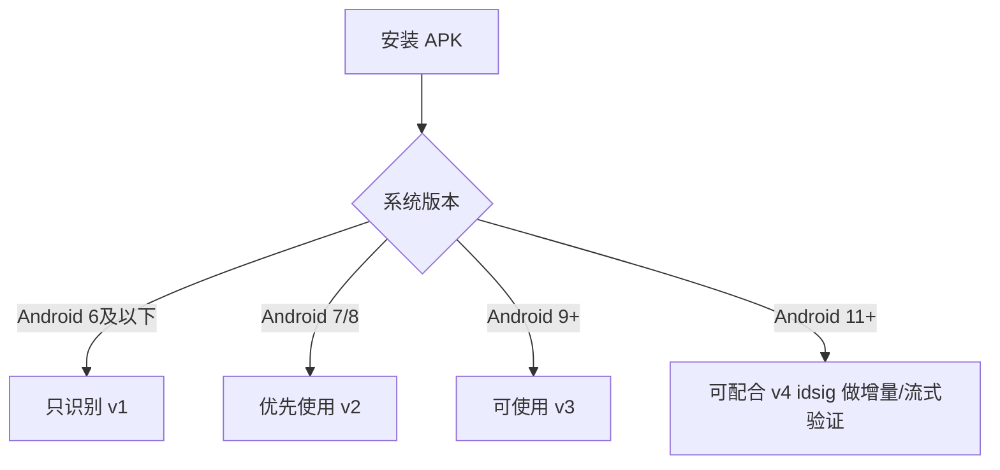


注意：

```java
高版本系统一般优先使用更高版本签名方案
低版本系统会忽略自己不认识的签名块
```

## 14、为什么不会被冒充？

这里要分几种“冒充”。

### 14.1 冒充更新包：不能

攻击者想做一个同包名 APK：

```java
packageName = com.example.app
```

然后覆盖用户手机里的正版 App。

系统检查：


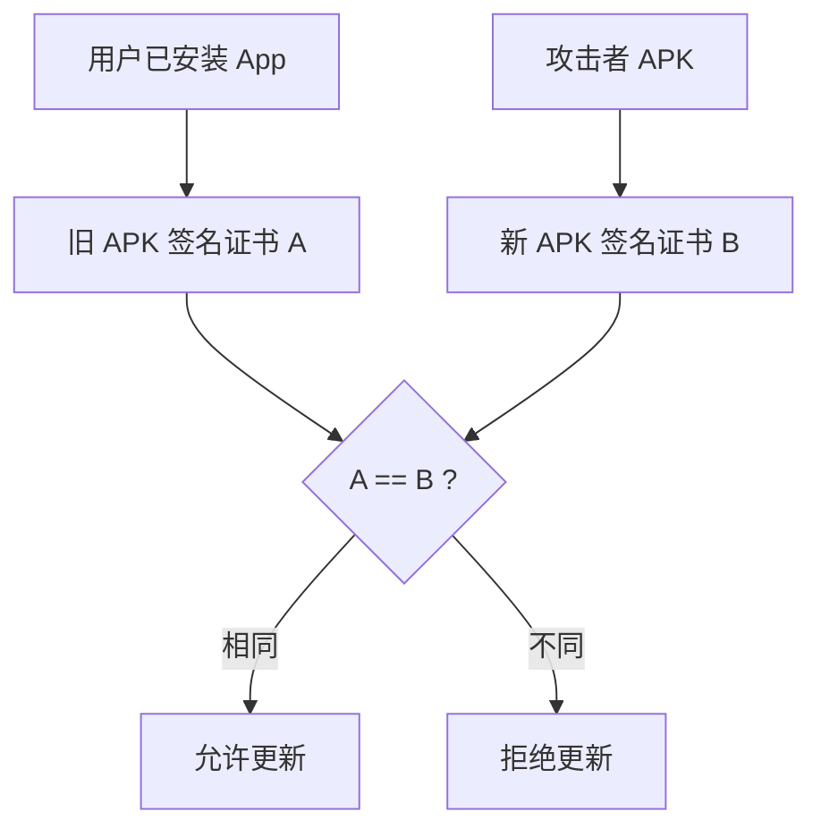


由于攻击者没有你的私钥，无法生成同一个签名身份，所以不能覆盖安装。

### 14.2 冒充 APK 内容：不能

攻击者修改 APK 内容：

```java
classes.dex
AndroidManifest.xml
resources.arsc
```

安装时系统重新计算 digest：

```java
重新计算 digest != 签名里的 digest
```

验证失败。

### 14.3 冒充应用名/图标：签名不解决

这个要注意。

攻击者可以做一个新的 App：

```java
packageName = com.fake.app
appName = 和你一样
icon = 和你一样
```

这种从用户视觉上“山寨”你的 App，Android 签名本身不防。

签名防的是：

```java
不能冒充你的包名更新
不能篡改你的 APK
不能拿到你 signature 权限
不能和你被系统视为同一签名身份
```

但不防：

```java
别人做一个不同包名、同图标、同名字的山寨 App
```

这个需要应用商店审核、品牌保护、Play Protect、系统安装来源限制等机制配合。

## 15、如果私钥泄露会怎样？

如果签名私钥泄露，问题就严重了。

攻击者可以：

```java
用你的签名 key 签 APK
伪造你的更新包
申请你定义的 signature 权限
和你的其他同签名 App 建立信任关系
```

所以签名私钥必须保护好。

最佳实践：

```java
release keystore 不要提交 Git
CI/CD 用安全密钥库或密文注入
限制 keystore 访问权限
尽量使用 Play App Signing
区分 upload key 和 app signing key
定期评估 key rotation
```

## 16、Play App Signing 下的两个 key

如果使用 Google Play App Signing，会有两个概念：

```java
App signing key
Upload key
```

### 16.1 App signing key

这是最终分发给用户 APK 的签名 key。

```java
Google Play 持有和保护
用户安装的 APK 使用它签名
```

### 16.2 Upload key

这是你上传 AAB/APK 到 Play Console 时用的 key。

```java
开发者持有
用于证明上传者身份
泄露后可以申请重置
```

简化流程：


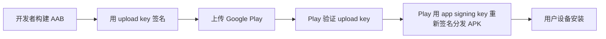


这比开发者自己长期保存最终 app signing key 更安全。

## 17、Gradle 里怎么配置签名？

常见配置：

```sql
android {
    signingConfigs {
        release {
            storeFile file("release.keystore")
            storePassword "xxx"
            keyAlias "xxx"
            keyPassword "xxx"

            enableV1Signing true
            enableV2Signing true
            enableV3Signing true
            enableV4Signing false
        }
    }

    buildTypes {
        release {
            signingConfig signingConfigs.release
            minifyEnabled true
            shrinkResources true
        }
    }
}
```

Kotlin DSL 类似：

```sql
android {
    signingConfigs {
        create("release") {
            storeFile = file("release.keystore")
            storePassword = "xxx"
            keyAlias = "xxx"
            keyPassword = "xxx"

            enableV1Signing = true
            enableV2Signing = true
            enableV3Signing = true
            enableV4Signing = false
        }
    }

    buildTypes {
        release {
            signingConfig = signingConfigs.getByName("release")
            isMinifyEnabled = true
            isShrinkResources = true
        }
    }
}
```

实际是否能打开某个签名方案，也和 AGP、build tools、minSdk、打包方式有关。

## 18、怎么查看 APK 使用了哪些签名？

用 apksigner：

```java
apksigner verify --verbose --print-certs app-release.apk
```

输出里会看到类似：

```sql
Verified using v1 scheme (JAR signing): true
Verified using v2 scheme (APK Signature Scheme v2): true
Verified using v3 scheme (APK Signature Scheme v3): true
Verified using v4 scheme (APK Signature Scheme v4): false
```

也可以看证书指纹：

```java
Signer #1 certificate SHA-256 digest: ...
Signer #1 certificate SHA-1 digest: ...
```

apksigner 是查看 APK 签名信息的推荐工具之一，Google 支持文档也说明它可以提取 APK 的签名信息，覆盖 v1/v2/v3/v4 场景。

## 19、v1/v2/v3/v4 和 minSdk 怎么选？

一般建议：

### 19.1 如果还支持 Android 6 及以下

```java
enableV1Signing = true
enableV2Signing = true
enableV3Signing = true
```

原因：

```java
Android 6 及以下只认识 v1
Android 7+ 可以用 v2
Android 9+ 可以用 v3
```

### 19.2 如果 minSdk >= 24

理论上可以不需要 v1：

```java
enableV1Signing = false
enableV2Signing = true
enableV3Signing = true
```

因为 Android 7.0 及以上支持 v2。

### 19.3 v4 是否必须？

一般业务手动发 APK：

```java
v4 通常不是必须
```

如果通过 Google Play 分发，Play App Signing 可能会自动为符合条件的应用使用 v4 来优化 Android 11+ 设备分发。Google Play 文档说明，对于符合条件的应用，Play App Signing 会自动使用 v4 signing 来支持 Android 11+ 的优化分发，开发者通常无需手动处理。

## 20、常见误区

### 20.1 “签名是为了加密 APK 内容？”

不是。

签名不是加密。APK 内容仍然可以被解压、反编译、分析。

签名保证的是：

```java
完整性
身份一致性
不可伪造
```

不保证：

```java
代码不被看见
资源不被提取
逻辑不被逆向
```

### 20.2 “有签名就不会被破解？”

不是。

攻击者可以：

```java
反编译 APK
修改代码
重新用他自己的 key 签名
```

这个修改版不能覆盖安装正版，但可以作为另一个来源安装到未安装正版的设备上，或者换包名安装。

所以防破解还需要：

```java
代码混淆
完整性校验
服务端风控
Play Integrity API
证书指纹校验
反调试
关键逻辑服务端化
```

### 20.3 “包名一样就能覆盖安装？”

不行。

必须：

```java
包名一样
签名兼容
versionCode 更高或满足安装条件
```

否则系统拒绝。

### 20.4 “换了 keystore 重新打包没关系？”

如果是已经发布给用户的 App，不能随便换。

你换了 keystore，用户手机上旧版本是：

```java
signer = old
```

新版本是：

```java
signer = new
```

系统会拒绝覆盖更新。

除非你使用了：

```java
APK Signature Scheme v3/v3.1 key rotation
或 Google Play App Signing 的 key upgrade 能力
```

否则换签名基本等于另一个 App 身份。


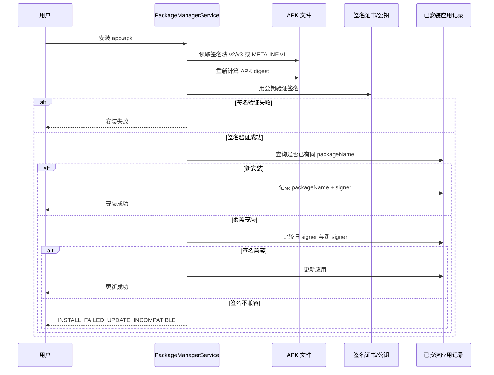


## 22、实际开发建议

### 普通应用

推荐：

```java
v1：如果 minSdk < 24，开启
v2：开启
v3：开启
v4：一般交给 Play 或按需开启
```

### 高安全要求应用

建议：

```java
使用 Play App Signing
保护 release keystore
CI 不明文保存密码
开启 v2/v3
尽量规划 key rotation
保存 mapping 和签名证书指纹
上线前 apksigner verify
```

### 发版前检查

```java
apksigner verify --verbose --print-certs app-release.apk
```

确认：

```java
v1/v2/v3 是否符合预期
证书 SHA-256 是否正确
是否使用了 release key 而不是 debug key
```

## 23、最后一张总图


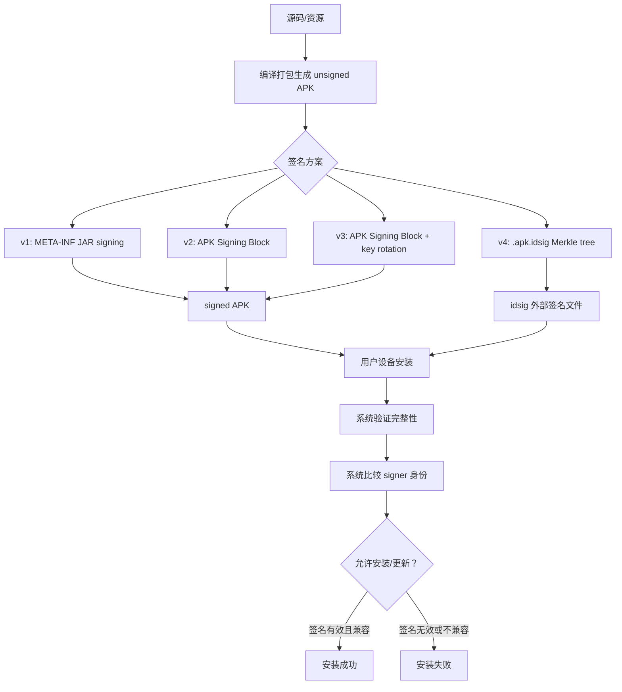


## 24、一句话总结

```java
v1 是老式 JAR entry 签名，主要为了兼容旧系统；
v2 是现代 APK 整体签名，解决安全和性能问题；
v3 在 v2 基础上支持签名 key rotation；
v4 是外部 idsig 文件，服务于 Android 11+ 的流式/增量安装。
```

Android 之所以不会被简单冒充，是因为：

```java
攻击者没有你的私钥，无法生成与你相同的签名；
系统更新安装时不仅看 packageName，还会比较签名身份；
APK 内容一旦被改，签名校验就会失败。
```
