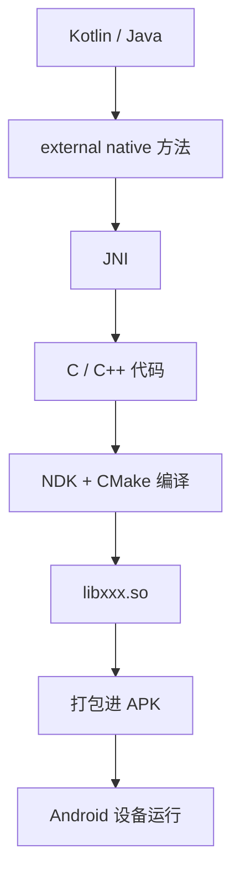
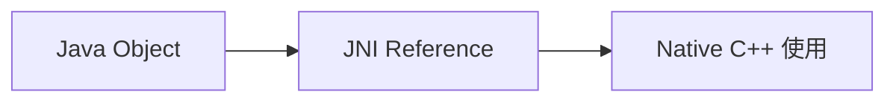
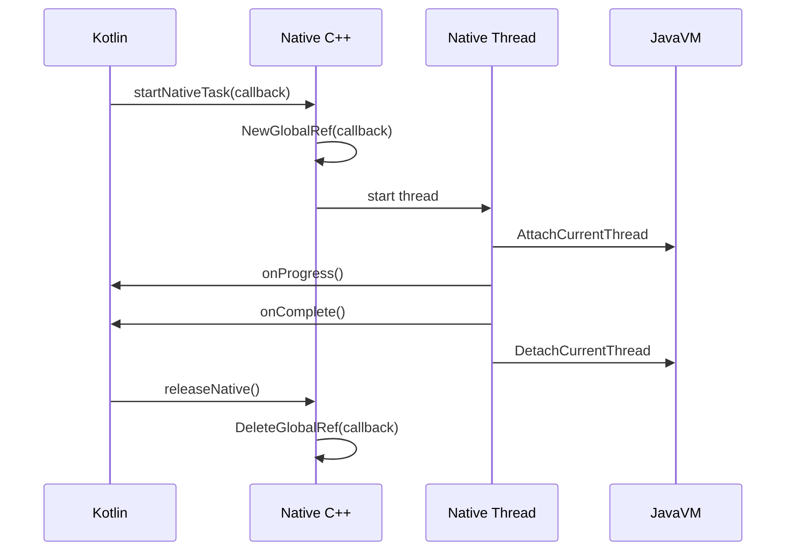
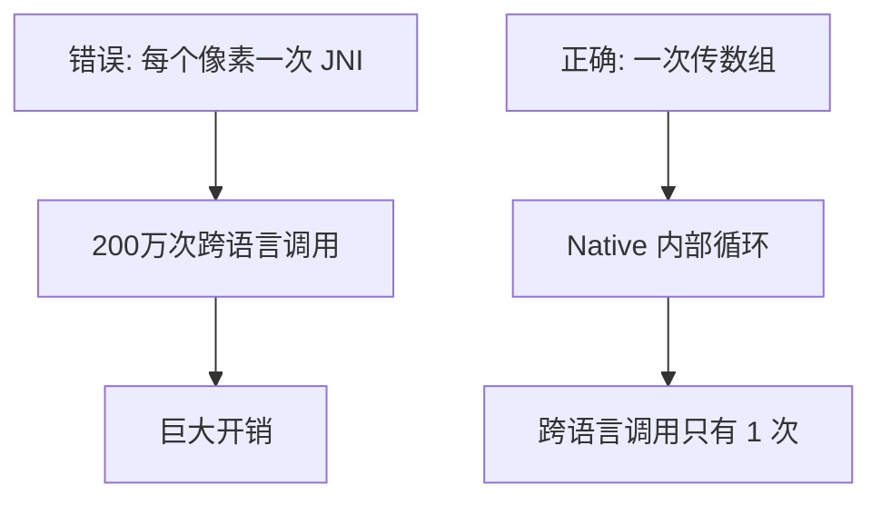
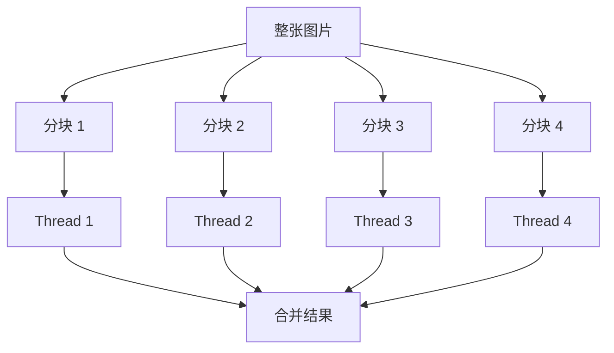
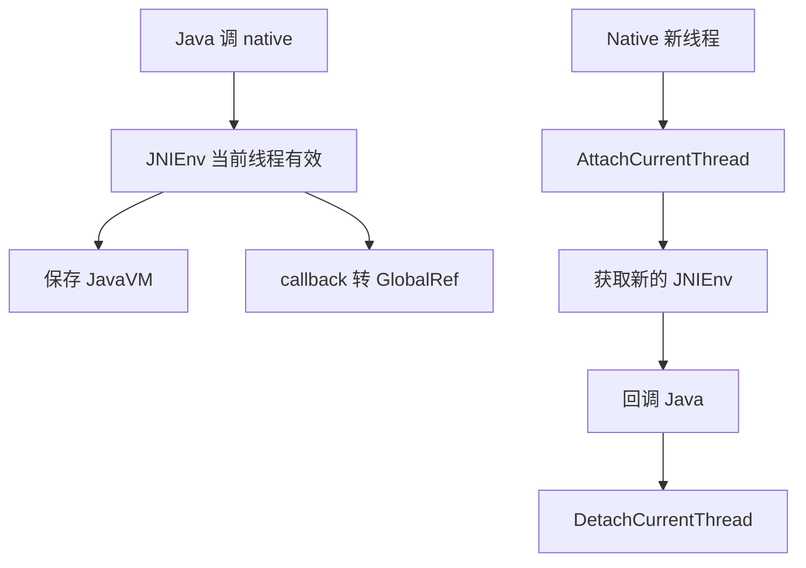
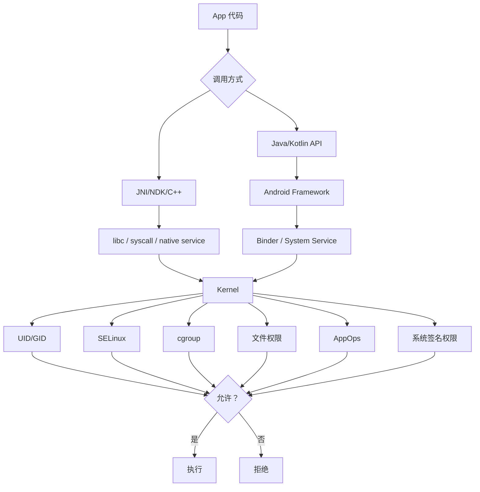

# JNI 与 NDK 零基础入门指南

> 本文由内部知识库文档整理为 GitHub 可直接阅读的 Markdown。已移除原始内部链接、附件直链、账号标识、组织域名等公司相关信息。
> 图片目录为 `image/`，附件目录为 `file/`；本篇未导出独立图片/附件。嵌入表格已转为 Markdown；只读绘图块因接口未返回图形数据，已保留待补占位。

## JNI 与 NDK 零基础入门到精通指南

> *适合对象：你熟悉 Java/Kotlin，但 C/C++ 基础较弱，希望系统深入学习 Android JNI / NDK。*

先给你一个核心判断：

> *JNI / NDK 不是 Android 的另一套体系，而是 Java/Kotlin 和 C/C++ 协作的一座桥。*  
> *你已经会 Android 上层开发，接下来要补的是：Native 世界的语言、内存、线程、构建和调试规则。*

## 1. JNI 和 NDK 是什么？

### 1.1 用一个比喻理解

假设一个 App 是一家餐厅：

```java
Java / Kotlin 层 = 前厅服务员、菜单、点餐系统
C / C++ 层 = 后厨、专业厨师、复杂设备
JNI = 前厅和后厨之间的传菜窗口 + 翻译
NDK = 后厨的刀具、炉灶、排烟系统、施工工具包
```

Java/Kotlin 很适合写：

```java
页面
业务流程
网络请求
数据库
权限
生命周期
组件交互
```

C/C++ 更适合写：

```java
音视频处理
图像算法
OpenGL 渲染
加解密
压缩
跨平台核心库
高性能计算
复用已有 C/C++ SDK
```

但是 Java/Kotlin 和 C/C++ 是两种语言，内存模型、对象模型、异常机制都不一样，不能直接互相调用。

于是就有了：

```java
JNI：规定 Java/Kotlin 怎么和 C/C++ 对话
NDK：提供在 Android 上编译、链接、调试 C/C++ 的工具链
```

## 2、JNI 是什么？

JNI 全称：

```java
Java Native Interface
```

它是一套标准接口，作用是：

> *让 Java/Kotlin 可以调用 C/C++，也让 C/C++ 可以访问 Java 对象、调用 Java 方法、创建 Java 对象。*

例如 Kotlin：

```java
external fun helloFromNative(): String
```

C++：

```java
extern "C"
JNIEXPORT jstring JNICALL
Java_com_example_jnidemo_NativeBridge_helloFromNative(
        JNIEnv* env,
        jobject thiz
) {
    return env->NewStringUTF("Hello from C++");
}
```

Kotlin 调用：

```java
val text = NativeBridge().helloFromNative()
```

这就是一次 Java/Kotlin 到 C++ 的跨语言调用。

## 3、NDK 是什么？

NDK 全称：

```java
Native Development Kit
```

它是 Android 提供的 Native 开发工具包，里面包括：

```java
clang 编译器
linker 链接器
Android native API 头文件
libc++ 标准库
CMake / ndk-build 支持
调试工具
多 ABI 支持
```

NDK 最常见的产物是：

```java
.so 动态库
```

例如：

```java
libnative-lib.so
libcrypto.so
libopencv.so
libffmpeg.so
```

最终会被打进 APK：

```java
app.apk
└── lib/
    ├── arm64-v8a/
    │   └── libnative-lib.so
    └── armeabi-v7a/
        └── libnative-lib.so
```

Java/Kotlin 通过：

```java
System.loadLibrary("native-lib")
```

加载：

```java
libnative-lib.so
```

注意：

```java
System.loadLibrary("native-lib")
不是
System.loadLibrary("libnative-lib.so")
```

## 4、JNI 和 NDK 的关系

一句话：

> *JNI 是规则，NDK 是工具。*


| 名称 | 作用 |
| --- | --- |
| JNI | Java/Kotlin 与 C/C++ 互调的接口规范 |
| NDK | Android 上编译 C/C++ 的工具链 |
| CMake | 描述如何编译 native 代码 |
| .so | C/C++ 编译后的动态库 |
| ABI | CPU 架构接口，例如 arm64-v8a |
| JNIEnv | Native 操作 Java 世界的入口 |
| JavaVM | JVM/ART 虚拟机实例，常用于跨线程获取 JNIEnv |


整体关系：




## 5、第一个可运行 Demo：Kotlin 调 C++

下面是一个最小可运行 Demo。

### 5.1 工程结构

```java
app/
└── src/
    └── main/
        ├── java/com/example/jnidemo/
        │   ├── MainActivity.kt
        │   └── NativeBridge.kt
        └── cpp/
            ├── native-lib.cpp
            └── CMakeLists.txt
```

### 5.2 NativeBridge.kt

```sql
package com.example.jnidemo

class NativeBridge {

    external fun helloFromNative(): String

    external fun add(a: Int, b: Int): Int

    external fun reverseText(text: String): String

    external fun xorBytes(data: ByteArray, key: Byte): ByteArray

    companion object {
        init {
            System.loadLibrary("native-lib")
        }
    }
}
```

### 5.3 MainActivity.kt

```java
package com.example.jnidemo

import android.os.Bundle
import android.util.Log
import androidx.appcompat.app.AppCompatActivity

class MainActivity : AppCompatActivity() {

    private val nativeBridge = NativeBridge()

    override fun onCreate(savedInstanceState: Bundle?) {
        super.onCreate(savedInstanceState)

        Log.d("JNI_DEMO", nativeBridge.helloFromNative())

        val sum = nativeBridge.add(3, 5)
        Log.d("JNI_DEMO", "sum = $sum")

        val reversed = nativeBridge.reverseText("Android")
        Log.d("JNI_DEMO", "reversed = $reversed")

        val bytes = byteArrayOf(1, 2, 3, 4)
        val result = nativeBridge.xorBytes(bytes, 0x0F)
        Log.d("JNI_DEMO", "xor = ${result.joinToString()}")
    }
}
```

### 5.4 native-lib.cpp

```cpp
#include <jni.h>
#include <string>
#include <algorithm>
#include <vector>

extern "C"
JNIEXPORT jstring JNICALL
Java_com_example_jnidemo_NativeBridge_helloFromNative(
        JNIEnv *env,
        jobject thiz
) {
    return env->NewStringUTF("Hello from C++");
}

extern "C"
JNIEXPORT jint JNICALL
Java_com_example_jnidemo_NativeBridge_add(
        JNIEnv *env,
        jobject thiz,
        jint a,
        jint b
) {
    return a + b;
}

extern "C"
JNIEXPORT jstring JNICALL
Java_com_example_jnidemo_NativeBridge_reverseText(
        JNIEnv *env,
        jobject thiz,
        jstring text
) {
    const char *chars = env->GetStringUTFChars(text, nullptr);

    std::string cppText(chars);
    std::reverse(cppText.begin(), cppText.end());

    env->ReleaseStringUTFChars(text, chars);

    return env->NewStringUTF(cppText.c_str());
}

extern "C"
JNIEXPORT jbyteArray JNICALL
Java_com_example_jnidemo_NativeBridge_xorBytes(
        JNIEnv *env,
        jobject thiz,
        jbyteArray data,
        jbyte key
) {
    jsize len = env->GetArrayLength(data);
    jbyte *input = env->GetByteArrayElements(data, nullptr);

    std::vector<jbyte> output(len);

    for (int i = 0; i < len; i++) {
        output[i] = input[i] ^ key;
    }

    env->ReleaseByteArrayElements(data, input, JNI_ABORT);

    jbyteArray result = env->NewByteArray(len);
    env->SetByteArrayRegion(result, 0, len, output.data());

    return result;
}
```

### 5.5 CMakeLists.txt

```java
cmake_minimum_required(VERSION 3.22.1)

project("jni-demo")

add_library(
        native-lib
        SHARED
        native-lib.cpp
)

find_library(
        log-lib
        log
)

target_link_libraries(
        native-lib
        ${log-lib}
)
```

### 5.6 app/build.gradle.kts

```cpp
android {
    namespace = "com.example.jnidemo"
    compileSdk = 35

    defaultConfig {
        applicationId = "com.example.jnidemo"
        minSdk = 23
        targetSdk = 35
        versionCode = 1
        versionName = "1.0"

        externalNativeBuild {
            cmake {
                cppFlags += "-std=c++17"
            }
        }

        ndk {
            abiFilters += listOf("arm64-v8a", "armeabi-v7a")
        }
    }

    externalNativeBuild {
        cmake {
            path = file("src/main/cpp/CMakeLists.txt")
        }
    }
}
```

## 6、JNI 核心机制解析

### 6.1 JNIEnv 是什么？

JNIEnv\* 是 Native 访问 Java 世界的入口。

你可以把它理解为：

```java
JNIEnv = Native 层操作 Java 对象的工具箱
```

通过它可以：

```java
env->NewStringUTF(...) //将一个 C 风格的 UTF-8 字符串转换为 Java 层的 String 对象。
jstring jStr = env->NewStringUTF("Hello from C++");

env->FindClass(...) // 根据类的全限定名（用 / 分隔）查找并加载一个 Java 类，返回 jclass。
jclass stringClass = env->FindClass("java/lang/String");

env->GetMethodID(...) //获取某个类中指定方法的 ID（jmethodID），后续调用该方法时需要用到。 
jmethodID methodId = env->GetMethodID(myClass, "doSomething", "(Ljava/lang/String;)V");

env->CallVoidMethod(...) // 调用一个返回类型为 void 的 Java 实例方法。
env->CallVoidMethod(obj, methodId, jStr);

env->GetByteArrayElements(...) // 获取 Java byte[] 数组在 C++ 层的指针，以便直接读写数组内容。
jbyteArray javaArray = ...; // 从 Java 传过来的 byte[]
jbyte* cArray = env->GetByteArrayElements(javaArray, NULL);
// cArray 现在指向数组数据，可以像普通 C 数组一样操作
cArray[0] = 100;

env->ReleaseByteArrayElements(...) //释放通过 GetByteArrayElements 获取的数组指针，并决定如何将修改同步回 Java 层。
env->ReleaseByteArrayElements(javaArray, cArray, 0);
```

重要规则：

> *JNIEnv 只在当前线程有效，不能跨线程保存使用。*

错误示例：

```java
static JNIEnv* g_env = nullptr;

void saveEnv(JNIEnv* env) {
    g_env = env; // 错误：不要跨线程保存 JNIEnv
}

JNIEnv 是线程绑定的
JNIEnv* 是一个线程局部（thread-local）的指针，它只在创建它的那个线程中有效。
每个线程都有自己独立的 JNIEnv，它们之间不能混用。


```

正确做法：

```java
跨线程时保存 JavaVM
在线程中 AttachCurrentThread 获取 JNIEnv

例子：
static JavaVM* g_vm = nullptr;

// 在 JNI_OnLoad 或某个 native 方法中保存 JavaVM
JNIEXPORT jint JNICALL JNI_OnLoad(JavaVM* vm, void* reserved) {
    g_vm = vm; // ✅ JavaVM 是全局有效的，可以跨线程使用
    return JNI_VERSION_1_6;
}

// 在任意线程中获取当前线程的 JNIEnv
JNIEnv* getEnv() {
    JNIEnv* env = nullptr;
    // 尝试获取当前线程的 env
    jint ret = g_vm->GetEnv((void**)&env, JNI_VERSION_1_6);
    
    if (ret == JNI_EDETACHED) {
        // 当前线程未附加到 JVM，需要附加
        ret = g_vm->AttachCurrentThread(&env, nullptr);
        if (ret != JNI_OK) {
            return nullptr;
        }
    } else if (ret != JNI_OK) {
        return nullptr;
    }
    
    return env; // ✅ 这是当前线程合法的 env
}

```

### 6.2 JavaVM 是什么？

JavaVM\* 表示当前进程中的 Java 虚拟机实例。

通常一个 Android 进程只有一个 JavaVM。

它常用于：

```java
Native 线程回调 Java
跨线程获取 JNIEnv
```

通常在 JNI_OnLoad 保存：

```java
JavaVM* g_vm = nullptr;

JNIEXPORT jint JNICALL JNI_OnLoad(JavaVM* vm, void*) {
    g_vm = vm;
    return JNI_VERSION_1_6;
}
```

### 6.3 jobject 和 jclass 是什么？


| 类型 | 含义 |
| --- | --- |
| jobject | Java 对象实例 |
| jclass | Java Class 对象 |
| jstring | Java String |
| jarray | Java 数组 |
| jbyteArray | Java byte[] |
| jintArray | Java int[] |


例如：

```java
jclass clazz = env->GetObjectClass(thiz);
```

表示获取当前对象的 Class。

## 7、JNI 引用类型：Local / Global / Weak Global

这是 JNI 里最重要，也最容易出错的部分。

### 7.1 为什么 JNI 需要引用？

Java 对象由 ART 虚拟机管理，Native 不能直接长期拿着 Java 对象裸指针。

JNI 通过引用机制管理 Java 对象生命周期。




### 7.2 Local Reference 本地引用

#### 什么是 Local Reference？

在 native 方法里拿到的大多数 Java 对象引用，默认都是 Local Reference。

例如：

```java
extern "C"
JNIEXPORT void JNICALL
Java_com_example_jnidemo_NativeBridge_test(
        JNIEnv* env,
        jobject thiz,
        jstring text
) {
    // thiz 是 Local Reference
    // text 是 Local Reference

    jclass clazz = env->GetObjectClass(thiz);
    // clazz 也是 Local Reference
}
```

#### 特点

```java
只在当前 native 调用期间有效
方法返回后自动释放
只能在当前线程使用
数量有限
```

#### 使用场景

适合：

```java
临时访问 Java 对象
临时创建 String、Class、Array
native 方法内短时间使用
```

#### 需要手动 DeleteLocalRef 吗？

普通短方法可以不删，因为方法返回会自动释放。

但是如果在循环中大量创建 LocalRef，必须手动删除。

错误示例：

```java
for (int i = 0; i < 10000; i++) {
    jstring str = env->NewStringUTF("hello");
    // 没有 DeleteLocalRef，可能导致 Local Reference Table 溢出
}
```

正确：

```java
for (int i = 0; i < 10000; i++) {
    jstring str = env->NewStringUTF("hello");
    // 使用 str
    env->DeleteLocalRef(str);
}
```

### 7.3 Global Reference 全局引用

#### 什么是 Global Reference？

如果 Native 想把 Java 对象保存起来，在方法返回后继续用，就必须创建 GlobalRef。

例如保存 callback：

```java
jobject g_callback = nullptr;

extern "C"
JNIEXPORT void JNICALL
Java_com_example_jnidemo_NativeBridge_setCallback(
        JNIEnv* env,
        jobject thiz,
        jobject callback
) {
    if (g_callback != nullptr) {
        env->DeleteGlobalRef(g_callback);
    }

    g_callback = env->NewGlobalRef(callback);
}
```

#### 特点

```java
跨 native 方法有效
可以跨线程使用
会阻止 Java 对象被 GC
必须手动 DeleteGlobalRef
```

#### 使用场景

适合：

```java
保存 Java callback
保存 Java object
Native 异步任务完成后回调 Java
Native 线程长期使用 Java 对象
```

#### 最大风险

> *忘记 DeleteGlobalRef 会导致 Java 对象无法被 GC，造成内存泄漏。*

释放：

```java
if (g_callback != nullptr) {
    env->DeleteGlobalRef(g_callback);
    g_callback = nullptr;
}
```

### 7.4 Weak Global Reference全局弱引用

#### 什么是 Weak Global Reference？

全局弱引用不会阻止 Java 对象被 GC。

```java
jweak weakObj = env->NewWeakGlobalRef(obj);
```

#### 特点

```java
跨方法有效
不会阻止 GC
使用前必须判断对象是否还活着
```

#### 使用场景

适合：

```java
缓存 Java 对象但不希望阻止释放
避免强引用导致 Activity 泄漏
Native 层弱持有 UI 对象
```

#### 使用方式

```java
jobject strongObj = env->NewLocalRef(weakObj);
if (strongObj != nullptr) {
    // 对象还活着，可以安全使用

    env->DeleteLocalRef(strongObj);
} else {
    // 对象已经被 GC
}
```

释放：

```java
env->DeleteWeakGlobalRef(weakObj);
```

### 7.5 三种引用对比表


| 类型 | 生命周期 | 是否跨线程 | 是否阻止 GC | 是否需要手动释放 | 场景 |
| --- | --- | --- | --- | --- | --- |
| LocalRef | 当前 native 调用 | 否 | 是，短暂 | 通常不用，大量循环要删 | 临时对象 |
| GlobalRef | 手动释放前 | 是 | 是 | 必须 | callback、长期保存对象 |
| WeakGlobalRef | 手动释放前 | 是 | 否 | 必须 | 弱持有 Java 对象 |


## 8、Java 与 C++ 之间的高效数据传递

JNI 调用不是免费的。跨语言调用涉及：

```java
线程状态切换
参数转换
引用管理
边界检查
可能的数据拷贝
```

所以高效数据传递的核心是：

> *少调用、批量传、少拷贝、生命周期清晰。*

### 8.1 基本类型传递

基本类型成本较低：


| Java/Kotlin | JNI | C/C++ |
| --- | --- | --- |
| Int | jint | int |
| Long | jlong | long long |
| Float | jfloat | float |
| Double | jdouble | double |
| Boolean | jboolean | uint8_t / bool |


适合：

```java
状态值
配置项
索引
尺寸
开关
```

### 8.2 String 传递

Kotlin：

```java
external fun reverseText(text: String): String
```

C++：

```java
const char *chars = env->GetStringUTFChars(text, nullptr);
std::string cppText(chars);
env->ReleaseStringUTFChars(text, chars);
```

注意：

```java
GetStringUTFChars 之后必须 ReleaseStringUTFChars
```

不适合：

```java
大量高频传字符串
超大文本反复跨 JNI
```

如果是高频日志、协议解析，建议批量传或在一侧完成。


| 对比项 | GetStringUTFChars | ReleaseStringUTFChars |
| --- | --- | --- |
| 功能 | 获取（转换）字符串 | 释放字符串资源 |
| 方向 | Java → Native | 清理 Native 侧资源 |
| 返回值 | const char* | void |
| 是否必须调用 | 需要时调用 | 必须配对调用，否则内存泄漏 |
| 调用时机 | 需要使用 Java 字符串时 | 使用完字符串后立即调用 |


### 8.3 byte[] 传递

适合：

```java
图片数据
音频 PCM
视频帧
加密数据
二进制协议
```

C++ 读取：

```java
jbyte* bytes = env->GetByteArrayElements(array, nullptr);
jsize len = env->GetArrayLength(array);

// 使用 bytes

env->ReleaseByteArrayElements(array, bytes, JNI_ABORT);
```

ReleaseByteArrayElements 第三个参数：


| 参数 | 含义 |
| --- | --- |
| 0 | 拷贝回 Java，并释放 native buffer |
| JNI_COMMIT | 拷贝回 Java，但不释放 native buffer |
| JNI_ABORT | 不拷贝回 Java，只释放 native buffer |


如果只是读取，不修改：

```java
JNI_ABORT
```

如果修改后希望 Java 侧看到变化：

```java
0
```

### 8.4 批量传递优于频繁调用

错误设计：

```java
for (i in pixels.indices) {
    nativeProcessPixel(pixels[i])
}
```

这会产生大量 JNI 调用。

正确设计：

```java
nativeProcessPixels(pixels)
```

让 C++ 内部循环：

```java
for (int i = 0; i < len; i++) {
    // 处理所有像素
}
```

原则：

```java
不要让 JNI 调用出现在超大循环内
把循环放到 Native 内部
```

### 8.5 DirectByteBuffer：减少拷贝

DirectByteBuffer 是高性能传递大块内存的常用方式。

Java/Kotlin：

```java
val buffer = ByteBuffer.allocateDirect(1024 * 1024)
buffer.order(ByteOrder.nativeOrder())

nativeFillBuffer(buffer, buffer.capacity())
```

C++：

```cpp
extern "C"
JNIEXPORT void JNICALL
Java_com_example_jnidemo_NativeBridge_nativeFillBuffer(
        JNIEnv* env,
        jobject thiz,
        jobject buffer,
        jint size
) {
    auto* data = static_cast<uint8_t*>(env->GetDirectBufferAddress(buffer));

    if (data == nullptr) {
        return;
    }

    for (int i = 0; i < size; i++) {
        data[i] = static_cast<uint8_t>(i % 256);
    }
}
```

优点：

```java
Native 可以直接访问 buffer 内存
减少 Java byte[] 和 native 内存之间的拷贝
适合音视频、图像、大块二进制数据
```

注意：

```java
必须使用 allocateDirect
普通 ByteArray 包装的 ByteBuffer 不一定能 GetDirectBufferAddress
底层数据存储在 JVM 堆外的本地内存（native memory）中 
通过类似 malloc() 或 mmap() 的系统调用分配
内存地址固定，不受 GC 影响，连续的，不用挪动
```

### 8.6 Bitmap 数据处理

如果处理图像，可以使用 Android NDK 的 Bitmap API。

CMake 需要链接：

```java
find_library(
        jnigraphics-lib
        jnigraphics
)

target_link_libraries(
        native-lib
        ${log-lib}
        ${jnigraphics-lib}
)


add_library(native-lib STATIC native-lib.cpp utils.cpp)
```

####  **find_library 两个参数**

  
**第一个参数 jnigraphics-lib**：自定义的变量名，用于存储查找结果（即库文件的完整路径）。命名约定通常加 -lib 后缀以表明这是一个库路径变量。  
**第二个参数 jnigraphics**：要查找的库名称。CMake 会自动在 Android NDK 的系统库目录中搜索 libjnigraphics.so

**查找路径**

CMake 会自动在以下路径中搜索：

\$ANDROID_NDK/platforms/android-xx/arch-arm/usr/lib/

\$ANDROID_NDK/sources/android/jnigraphics/

以及其他 NDK 预定义的库搜索路径

#### **target_link_libraries 参数**

将指定的库链接到目标（target）native-lib 上，使其在编译和运行时可用。

第一个参数 native-lib：目标名称，通常是前面通过 add_library(native-lib ...) 定义的你的 native 库。

后续参数：要链接的库列表，可以是：

通过 find_library 找到的系统库变量（如 \${log-lib}、\${jnigraphics-lib}）

通过 add_library 定义的自定义库

直接写库名（如 android、m 等）

```bash
## 1. 查找系统库
find_library(
        log-lib
        log
)

find_library(
        jnigraphics-lib
        jnigraphics
)

## 2. 定义自己的 native 库
add_library(
        native-lib
        SHARED
        native-lib.cpp
)

## 3. 链接系统库到自己的库
target_link_libraries(
        native-lib
        ${log-lib}           # 链接 log 库，用于 __android_log_print
        ${jnigraphics-lib}   # 链接 jnigraphics 库，用于操作 Android Bitmap
)
```

Android NDK 提供了不少预编译的系统库，可以通过 find_library() 直接查找并链接。根据官方文档，这些库分为几大类：

**基础类库**


| 库名 | 变量名示例 | 用途 |
| --- | --- | --- |
| log | ${log-lib} | 日志输出（__android_log_print） |
| android | ${android-lib} | Android 原生 API（传感器、窗口、AssetManager 等） |
| c | — | C 标准库（libc，通常自动链接） |
| m | — | 数学库（libm，通常自动链接） |
| dl | — | 动态链接库（dlopen/dlsym 等） |
| z | — | 压缩库（zlib） |
| c++_shared / c++_static | — | C++ 标准库（LLVM libc++） |


**图形与多媒体类库**


| 库名 | 用途 |
| --- | --- |
| jnigraphics | Bitmap 像素操作（AndroidBitmap_getInfo 等） |
| EGL | OpenGL ES 窗口系统接口 |
| GLESv1_CM | OpenGL ES 1.x |
| GLESv2 | OpenGL ES 2.0 |
| GLESv3 | OpenGL ES 3.0 |
| vulkan | Vulkan 图形 API |
| OpenSLES | OpenSL ES 音频 |
| OpenMAXAL | OpenMAX AL 音频 |
| mediandk | 媒体 NDK（MediaCodec、MediaExtractor 等） |


**系统与硬件类库**


| 库名 | 用途 |
| --- | --- |
| nativewindow | 原生窗口（ANativeWindow，用于 Surface 渲染） |
| camera2ndk | Camera2 NDK（相机采集） |
| neuralnetworks | NNAPI 神经网络加速 |
| sync | 同步原语（sync fence 操作） |
| android_net | 网络相关原生 API |


**以源码形式提供的辅助库**

这些库不是预编译的 .so，而是以 .c 源码形式提供，需要用 add_library() 自行编译：


| 库 | 路径 | 用途 |
| --- | --- | --- |
| native_app_glue | $NDK/sources/android/native_app_glue/ | 管理 NativeActivity 生命周期和输入事件 |
| cpufeatures | $NDK/sources/android/cpufeatures/ | 检测 CPU 特性（ARM NEON、x86 SSE 等） |
| game-activity | $NDK/sources/android/game-activity/ | 游戏活动支持（替代 NativeActivity） |


**典型 CMake 配置示例**

```bash
## 查找系统库
find_library(log-lib log)
find_library(android-lib android)
find_library(jnigraphics-lib jnigraphics)
find_library(EGL-lib EGL)
find_library(GLESv3-lib GLESv3)

## 编译源码库
add_library(cpufeatures STATIC
    ${ANDROID_NDK}/sources/android/cpufeatures/cpu-features.c)

## 定义自己的库
add_library(native-lib SHARED native-lib.cpp)

## 链接所有库
target_link_libraries(native-lib
    ${log-lib}
    ${android-lib}
    ${jnigraphics-lib}
    ${EGL-lib}
    ${GLESv3-lib}
    cpufeatures
)
```

#### add_library 参数


| 参数 | 说明 |
| --- | --- |
| <name> | 库的目标名称（如 native-lib），后续通过该名称引用此库 |
| STATIC | 创建静态库（.a / .lib），代码会被嵌入到最终可执行文件中 |
| SHARED | 创建动态库/共享库（.so / .dll），运行时动态加载 |
| MODULE | 创建模块库（插件形式），运行时动态加载但不参与链接 |
| EXCLUDE_FROM_ALL | 可选，表示该库默认不参与构建（如 make 时不编译），需显式指定才构建 |
| <source>... | 构建该库所需的源文件列表（.cpp、.c、.h 等） |


**五种库类型详解**

**普通库（STATIC / SHARED / MODULE）**

自己编译源码生成库，最常用。

```java
## 静态库：编译为 libnative-lib.a，代码会被嵌入到链接它的共享库中
add_library(native-lib STATIC native-lib.cpp utils.cpp)

## 动态库：编译为 libnative-lib.so，Android JNI 中最常见的形式
add_library(native-lib SHARED native-lib.cpp utils.cpp)

## 模块库：类似动态库，但不自动链接，通常用于插件系统
add_library(my-plugin MODULE plugin.cpp)
```

> 💡 Android NDK 中，JNI 入口库通常使用 `SHARED`，因为 Java 通过 `System.loadLibrary()` 加载的是 `.so` 文件。

**对象库（OBJECT）**

只编译不链接，生成 `.o` 对象文件，供其他目标使用。

```java
add_library(my-objects OBJECT foo.cpp bar.cpp)

## 其他库可以引用这些对象文件
add_library(lib1 SHARED $<TARGET_OBJECTS:my-objects> extra1.cpp)
add_library(lib2 SHARED $<TARGET_OBJECTS:my-objects> extra2.cpp)
```

适用于多个库共享同一批源文件，避免重复编译。

**接口库（INTERFACE）**

不编译任何代码，只定义接口属性（头文件路径、编译选项、依赖等），供其他目标继承。

```java
add_library(my-headers INTERFACE)

## 定义使用者需要的头文件路径和编译选项
target_include_directories(my-headers INTERFACE include/)
target_compile_definitions(my-headers INTERFACE MY_LIB_VERSION=1)

## 其他库链接后自动获得上述属性
target_link_libraries(native-lib my-headers)
```

适用于纯头文件库或抽象依赖管理。

**导入库（IMPORTED）**

引用外部已存在的预编译库（第三方 `.so` 或 `.a` 文件）。

```markdown
## 声明一个导入的共享库
add_library(imported-lib SHARED IMPORTED)

## 指定库文件的实际路径（支持 ${ANDROID_ABI} 变量适配不同架构）
set_target_properties(imported-lib PROPERTIES
    IMPORTED_LOCATION ${CMAKE_SOURCE_DIR}/libs/${ANDROID_ABI}/libimported-lib.so
)

## 指定头文件路径
target_include_directories(imported-lib INTERFACE
    ${CMAKE_SOURCE_DIR}/libs/include/
)

## 链接使用
target_link_libraries(native-lib imported-lib)
```

适用于集成第三方预编译库（如 FFmpeg、OpenCV 等）。

**别名库（ALIAS）**

给已有库目标起一个别名，不创建新库。

```java
add_library(real-lib SHARED real.cpp)

## 创建别名
add_library(alias-lib ALIAS real-lib)

## 两者等价，都可以链接
target_link_libraries(native-lib real-lib)
target_link_libraries(native-lib alias-lib)
```

适用于为库提供命名空间式的短名称，或兼容旧名称。

C++：

```cpp
#include <jni.h>
#include <android/bitmap.h>
#include <cstdint>

extern "C"
JNIEXPORT void JNICALL
Java_com_example_jnidemo_NativeBridge_grayBitmap(
        JNIEnv* env,
        jobject thiz,
        jobject bitmap
) {
    AndroidBitmapInfo info;
    void* pixels = nullptr;

    if (AndroidBitmap_getInfo(env, bitmap, &info) < 0) {
        return;
    }

    if (info.format != ANDROID_BITMAP_FORMAT_RGBA_8888) {
        return;
    }

    if (AndroidBitmap_lockPixels(env, bitmap, &pixels) < 0) {
        return;
    }

    auto* line = static_cast<uint32_t*>(pixels);
    int pixelCount = info.width * info.height;

    for (int i = 0; i < pixelCount; i++) {
        uint32_t color = line[i];

        uint8_t r = (color >> 0) & 0xFF;
        uint8_t g = (color >> 8) & 0xFF;
        uint8_t b = (color >> 16) & 0xFF;
        uint8_t a = (color >> 24) & 0xFF;

        uint8_t gray = static_cast<uint8_t>(0.299 * r + 0.587 * g + 0.114 * b);

        line[i] = (a << 24) | (gray << 16) | (gray << 8) | gray;
    }

    AndroidBitmap_unlockPixels(env, bitmap);
}
```

AndroidBitmapInfo 是一个结构体，包含 Bitmap 的元信息：

width：宽度（像素）

height：高度（像素）

stride：每行字节数（可能包含 padding）

format：像素格式（如 RGBA_8888、RGB_565 等）

AndroidBitmap_getInfo()：从 Java Bitmap 对象中提取这些信息，失败返回负数。

适合：

```java
滤镜
图像灰度
二维码预处理
边缘检测
视觉算法前处理
```

## 9、Demo：Native 线程回调 Kotlin

这个 Demo 展示：

```java
GlobalRef
JavaVM
AttachCurrentThread
Native 异步线程
回调 Kotlin
```

### 9.1 Kotlin Callback

```java
package com.example.jnidemo

interface NativeCallback {
    fun onProgress(progress: Int)
    fun onComplete(message: String)
}
```

### 9.2 NativeBridge.kt

```java
package com.example.jnidemo

class NativeBridge {

    external fun startNativeTask(callback: NativeCallback)

    external fun releaseNative()

    companion object {
        init {
            System.loadLibrary("native-lib")
        }
    }
}
```

### 9.3 调用

```typescript
nativeBridge.startNativeTask(object : NativeCallback {
    override fun onProgress(progress: Int) {
        Log.d("JNI_DEMO", "progress = $progress")
    }

    override fun onComplete(message: String) {
        Log.d("JNI_DEMO", "complete = $message")
    }
})
```

### 9.4 C++ 实现

```cpp
#include <jni.h>
#include <thread>
#include <chrono>
#include <atomic>

JavaVM* g_vm = nullptr;
jobject g_callback = nullptr;
std::atomic<bool> g_running{false};

JNIEXPORT jint JNICALL JNI_OnLoad(JavaVM* vm, void*) {
    g_vm = vm;
    return JNI_VERSION_1_6;
}

extern "C"
JNIEXPORT void JNICALL
Java_com_example_jnidemo_NativeBridge_startNativeTask(
        JNIEnv* env,
        jobject thiz,
        jobject callback
) {
    if (g_callback != nullptr) {
        env->DeleteGlobalRef(g_callback);
        g_callback = nullptr;
    }

    g_callback = env->NewGlobalRef(callback);
    g_running = true;

    std::thread([]() {
        JNIEnv* env = nullptr;

        bool attached = false;
        if (g_vm->GetEnv(reinterpret_cast<void**>(&env), JNI_VERSION_1_6) != JNI_OK) {
            if (g_vm->AttachCurrentThread(&env, nullptr) == JNI_OK) {
                attached = true;
            } else {
                return;
            }
        }

        jclass callbackClass = env->GetObjectClass(g_callback);
        jmethodID onProgress = env->GetMethodID(callbackClass, "onProgress", "(I)V");
        jmethodID onComplete = env->GetMethodID(callbackClass, "onComplete", "(Ljava/lang/String;)V");

        for (int i = 0; i <= 100 && g_running; i += 20) {
            env->CallVoidMethod(g_callback, onProgress, i);
            std::this_thread::sleep_for(std::chrono::milliseconds(300));
        }

        if (g_running) {
            jstring msg = env->NewStringUTF("Native task finished");
            env->CallVoidMethod(g_callback, onComplete, msg);
            env->DeleteLocalRef(msg);
        }

        env->DeleteLocalRef(callbackClass);

        if (attached) {
            g_vm->DetachCurrentThread();
        }
    }).detach();
}

extern "C"
JNIEXPORT void JNICALL
Java_com_example_jnidemo_NativeBridge_releaseNative(
        JNIEnv* env,
        jobject thiz
) {
    g_running = false;

    if (g_callback != nullptr) {
        env->DeleteGlobalRef(g_callback);
        g_callback = nullptr;
    }
}
```

### 9.5 这段代码核心点

```java
callback 必须 NewGlobalRef，否则 native 方法返回后引用失效
Native 新线程回调 Java 前必须 AttachCurrentThread
线程结束后 DetachCurrentThread
GlobalRef 用完 DeleteGlobalRef
```

调用关系：




## 10、3 个真实性能优化案例

### 案例 1：减少 JNI 调用次数

**场景**

一个图像处理功能，最初设计是 Java 遍历像素，每个像素调用一次 Native：

```java
for (i in pixels.indices) {
    pixels[i] = nativeGrayPixel(pixels[i])
}
```

如果一张图片有：

```java
1080 * 1920 = 2,073,600 个像素
```

就会发生 200 多万次 JNI 调用。

**问题**

JNI 调用有边界开销：

```java
Java -> Native 切换
参数转换
线程状态切换
返回值转换
```

每次很小，但百万次就非常大。

**优化**

改成一次传整张图：

```java
nativeGrayPixels(pixels)
```

C++ 内部循环：

```java
for (int i = 0; i < len; i++) {
    pixels[i] = gray(pixels[i]);
}
```

**效果**

通常可以从：

```java
几百毫秒甚至数秒
```

降低到：

```java
几十毫秒
```

**原则**

> *JNI 调用要粗粒度，不要细粒度。*

图：





### 案例 2：byte[] 改 DirectByteBuffer，减少拷贝

**场景**

音频处理：

```java
Java 从 AudioRecord 读取 PCM
传给 Native 做降噪
Native 返回处理后 PCM
```

原始方案：

```java
external fun processPcm(input: ByteArray): ByteArray
```

Native 里：

```java
GetByteArrayElements
处理
NewByteArray
SetByteArrayRegion
```

**问题**

byte[] 可能发生拷贝：

```java
Java heap -> Native buffer
Native buffer -> Java heap
```

音频是高频数据，例如：

```java
每 10ms 一帧
每秒 100 次
```

拷贝成本明显。

**优化**

使用 DirectByteBuffer：

```java
val input = ByteBuffer.allocateDirect(frameSize)
val output = ByteBuffer.allocateDirect(frameSize)

nativeProcessPcm(input, output, frameSize)
```

C++：

```java
auto* in = static_cast<int16_t*>(env->GetDirectBufferAddress(input));
auto* out = static_cast<int16_t*>(env->GetDirectBufferAddress(output));

for (int i = 0; i < sampleCount; i++) {
    out[i] = process(in[i]);
}
```

**效果**

优化方向：

```java
减少内存拷贝
降低 GC 压力
降低音频卡顿概率
```

**原则**

> *大块、高频、二进制数据优先考虑 DirectByteBuffer。*

### 案例 3：Native 多线程并发处理图像块

**场景**

一张大图做滤镜：

```java
4000 x 3000
1200 万像素
```

单线程 C++ 处理耗时较长。

**原始方案**

```java
for (int y = 0; y < height; y++) {
    processRow(y);
}
```

**优化**

把图片按行分块，多线程处理：

```cpp
int threadCount = 4;
int rowsPerThread = height / threadCount;

std::vector<std::thread> threads;

for (int t = 0; t < threadCount; t++) {
    int startY = t * rowsPerThread;
    int endY = (t == threadCount - 1) ? height : startY + rowsPerThread;

    threads.emplace_back([=]() {
        for (int y = startY; y < endY; y++) {
            processRow(y);
        }
    });
}

for (auto& thread : threads) {
    thread.join();
}
```

**效果**

如果 CPU 有多个核心，可能获得接近 2 到 4 倍加速。

**注意**

多线程不是越多越好。

要考虑：

```java
CPU 核心数
线程创建成本
内存带宽
是否会阻塞 UI
是否需要线程池
```

Android 上建议：

```java
复用线程池
避免每帧创建大量线程
低端机限制并发数
```

图：





## 11、NDK 调试工具链

### 11.1 Android Studio + LLDB

LLDB 是 Android Studio 调试 native 代码的核心调试器。

你可以：

```java
给 C++ 代码打断点
单步执行
查看变量
查看调用栈
查看线程
查看内存
```

**使用方式**

1. 使用 Debug 运行 App；
2. 确保 native 代码是 debug 构建；
3. 在 .cpp 文件里打断点；
4. 调用 JNI 方法；
5. 断点命中。

**build.gradle.kts 建议**

```java
android {
    buildTypes {
        debug {
            isDebuggable = true
            isJniDebuggable = true
        }
    }
}
```

### 11.2 CMake Debug 配置

CMake 可以添加调试参数：

```java
set(CMAKE_CXX_FLAGS_DEBUG "${CMAKE_CXX_FLAGS_DEBUG} -O0 -g")
set(CMAKE_CXX_FLAGS_RELEASE "${CMAKE_CXX_FLAGS_RELEASE} -O2")
```

含义：


| 参数 | 作用 |
| --- | --- |
| -g | 生成调试符号 |
| -O0 | 关闭优化，方便调试 |
| -O2 | Release 优化 |
| -fno-omit-frame-pointer | 保留栈帧，方便崩溃栈分析 |


推荐 debug：

```java
target_compile_options(native-lib PRIVATE
        $<$<CONFIG:Debug>:-O0 -g -fno-omit-frame-pointer>
)
```

### 11.3 ndk-stack

当 native 崩溃时，logcat 里可能看到：

```java
signal 11 (SIGSEGV), code 1
backtrace:
  #00 pc 0000000000012344 /data/app/.../libnative-lib.so
```

如果有符号文件，可以用 ndk-stack 符号化：

```java
ndk-stack -sym app/build/intermediates/cxx/Debug/xxxx/obj/arm64-v8a -dump crash.log
```

它可以把：

```java
pc 0000000000012344
```

解析成：

```java
native-lib.cpp:123
```

### 11.4 addr2line

也可以用 addr2line：

```java
llvm-addr2line -C -f -e libnative-lib.so 0000000000012344
```

参数：


| 参数 | 作用 |
| --- | --- |
| -C | 还原 C++ 符号名 |
| -f | 显示函数名 |
| -e | 指定 so 文件 |


### 11.5 ASan：AddressSanitizer

ASan 可以检测：

```java
越界访问
use-after-free
double free
内存泄漏部分问题
栈溢出
```

CMake：

```java
target_compile_options(native-lib PRIVATE -fsanitize=address -fno-omit-frame-pointer)
target_link_options(native-lib PRIVATE -fsanitize=address)
```

适合 debug 阶段使用，不建议直接用于 release。

### 11.6 常见 native crash 信号


| 信号 | 含义 | 常见原因 |
| --- | --- | --- |
| SIGSEGV | 段错误 | 空指针、野指针、越界 |
| SIGABRT | 主动 abort | assert、JNI 检测失败 |
| SIGBUS | 总线错误 | 内存对齐、非法地址 |
| SIGILL | 非法指令 | ABI 不匹配、CPU 指令不支持 |
| SIGFPE | 算术错误 | 除 0 等 |


## 12、初学者最容易踩的 3 个坑

### 坑 1：JNI 方法签名错误

**现象**

```java
java.lang.UnsatisfiedLinkError:
No implementation found for ...
```

或者：

```java
couldn't find "libnative-lib.so"
```

#### 原因 1：C++ 方法名和 Java/Kotlin 不匹配

Kotlin：

```java
package com.example.jnidemo

class NativeBridge {
    external fun helloFromNative(): String
}
```

C++ 静态注册方法名必须是：

```java
Java_com_example_jnidemo_NativeBridge_helloFromNative
```

包名、类名、方法名错一个字符都不行。

#### 原因 2：忘记 extern "C"

C++ 会做 name mangling。

错误：

```java
JNIEXPORT jstring JNICALL
Java_com_example_jnidemo_NativeBridge_helloFromNative(...)
```

正确：

```java
extern "C"
JNIEXPORT jstring JNICALL
Java_com_example_jnidemo_NativeBridge_helloFromNative(...)
```

#### 原因 3：方法重载签名复杂

如果 Java 有重载：

```java
external fun test(value: Int)
external fun test(value: String)
```

静态注册名字会更复杂，不适合初学者手写。

**避坑指南**

建议掌握 动态注册 JNI。

## 13、Demo：动态注册 JNI

动态注册比静态长方法名更适合大型项目。

**Kotlin**

```java
package com.example.jnidemo

class DynamicNativeBridge {

    external fun nativeAdd(a: Int, b: Int): Int

    external fun nativeHello(): String

    companion object {
        init {
            System.loadLibrary("native-lib")
        }
    }
}
```

**C++**

```cpp
#include <jni.h>

jint nativeAdd(JNIEnv* env, jobject thiz, jint a, jint b) {
    return a + b;
}

jstring nativeHello(JNIEnv* env, jobject thiz) {
    return env->NewStringUTF("Hello from dynamic register");
}

static JNINativeMethod gMethods[] = {
        {
                "nativeAdd",
                "(II)I",
                reinterpret_cast<void*>(nativeAdd)
        },
        {
                "nativeHello",
                "()Ljava/lang/String;",
                reinterpret_cast<void*>(nativeHello)
        }
};

JNIEXPORT jint JNICALL JNI_OnLoad(JavaVM* vm, void*) {
    JNIEnv* env = nullptr;

    if (vm->GetEnv(reinterpret_cast<void**>(&env), JNI_VERSION_1_6) != JNI_OK) {
        return JNI_ERR;
    }

    jclass clazz = env->FindClass("com/example/jnidemo/DynamicNativeBridge");
    if (clazz == nullptr) {
        return JNI_ERR;
    }

    int result = env->RegisterNatives(
            clazz,
            gMethods,
            sizeof(gMethods) / sizeof(gMethods[0])
    );

    env->DeleteLocalRef(clazz);

    if (result != JNI_OK) {
        return JNI_ERR;
    }

    return JNI_VERSION_1_6;
}
```

**JNI 签名规则**


| Java/Kotlin | JNI 签名 |
| --- | --- |
| Int | I |
| Long | J |
| Float | F |
| Double | D |
| Boolean | Z |
| Byte | B |
| Char | C |
| Short | S |
| Void | V |
| String | Ljava/lang/String; |
| ByteArray | [B |
| IntArray | [I |
| Object | Ljava/lang/Object; |


例如：

```java
external fun test(a: Int, b: String): Boolean
```

签名：

```java
(ILjava/lang/String;)Z
```

### 坑 2：内存泄漏和引用泄漏

#### 错误 1：Get 了不 Release

错误：

```java
const char* chars = env->GetStringUTFChars(text, nullptr);
// 忘记 Release
```

正确：

```java
const char* chars = env->GetStringUTFChars(text, nullptr);

// 使用 chars

env->ReleaseStringUTFChars(text, chars);
```

#### 错误 2：GlobalRef 不释放

错误：

```java
g_callback = env->NewGlobalRef(callback);
// 之后从不 DeleteGlobalRef
```

正确：

```java
if (g_callback != nullptr) {
    env->DeleteGlobalRef(g_callback);
    g_callback = nullptr;
}
```

#### 错误 3：循环创建 LocalRef 不删除

错误：

```java
for (int i = 0; i < 10000; i++) {
    jstring str = env->NewStringUTF("test");
}
```

正确：

```java
for (int i = 0; i < 10000; i++) {
    jstring str = env->NewStringUTF("test");
    env->DeleteLocalRef(str);
}
```

**避坑指南**

记住配对关系：


| 创建/获取 | 释放 |
| --- | --- |
| GetStringUTFChars | ReleaseStringUTFChars |
| GetByteArrayElements | ReleaseByteArrayElements |
| GetIntArrayElements | ReleaseIntArrayElements |
| NewGlobalRef | DeleteGlobalRef |
| NewWeakGlobalRef | DeleteWeakGlobalRef |
| NewLocalRef | DeleteLocalRef |
| AttachCurrentThread | DetachCurrentThread |


### 坑 3：线程错误使用 JNIEnv / jobject

**错误示例**

```java
static JNIEnv* g_env = nullptr;

extern "C"
JNIEXPORT void JNICALL
Java_com_example_jnidemo_NativeBridge_init(JNIEnv* env, jobject thiz) {
    g_env = env;
}
```

然后在另一个线程使用：

```java
g_env->CallVoidMethod(...);
```

这是错误的。

**原因**

```java
JNIEnv 只属于当前线程
不能跨线程保存使用
```

**正确方式**

```java
保存 JavaVM
Native 线程中 AttachCurrentThread 获取 JNIEnv
使用完 DetachCurrentThread
jobject 跨线程保存要 NewGlobalRef
```

架构图：



## 14、ASan（AddressSanitizer）

AddressSanitizer 是一个内存错误检测工具，集成在 Clang/LLVM 编译器中，NDK 原生支持。

### 能检测的错误类型

- 堆缓冲区溢出（heap buffer overflow）
- 栈缓冲区溢出（stack buffer overflow）
- 全局缓冲区溢出（global buffer overflow）
- 使用已释放内存（use-after-free）
- 内存泄漏（memory leak）
- 返回栈地址（returning address of stack variable）

### 启用方式

```java
## CMakeLists.txt
if(ASAN)
    target_compile_options(native-lib PRIVATE -fsanitize=address -fno-omit-frame-pointer)
    target_link_options(native-lib PRIVATE -fsanitize=address)
endif()
```

```java
// build.gradle
android {
    defaultConfig {
        ndk {
            // 启用 ASan
            cppFlags "-fsanitize=address -fno-omit-frame-pointer"
            ldFlags "-fsanitize=address"
        }
    }
}
```

## 15、为什么 NDK 不能越权？

因为 Android 的安全模型不是这样的：

```java
Java 层检查权限
```

而是这样的：


