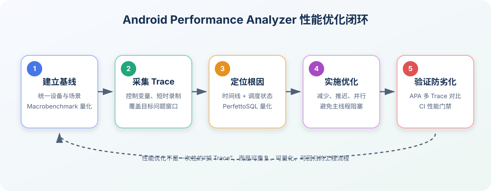

# Android Performance Analyzer 工具使用详解

> 适用对象：Android 应用、游戏、NDK、Vulkan 开发者，以及负责启动速度、卡顿、CPU、GPU、内存和功耗优化的工程师。  
> 文档版本：v1.0  
> 整理日期：2026-07-24  
> 隐私说明：本文中的公司名、项目名、包名、设备序列号和业务数据均使用通用示例代替。



## 目录

- [1. APA 是什么](#1-apa-是什么)
- [2. APA、Perfetto 与 Android Studio Profiler 的关系](#2-apaperfetto-与-android-studio-profiler-的关系)
- [3. 安装与环境准备](#3-安装与环境准备)
- [4. 第一次录制 System Trace](#4-第一次录制-system-trace)
- [5. 录制配置详解](#5-录制配置详解)
- [6. Trace View 阅读方法](#6-trace-view-阅读方法)
- [7. 启动耗时分析实战](#7-启动耗时分析实战)
- [8. 卡顿与掉帧分析实战](#8-卡顿与掉帧分析实战)
- [9. CPU 与线程调度分析](#9-cpu-与线程调度分析)
- [10. GPU、Vulkan 与游戏性能分析](#10-gpuvulkan-与游戏性能分析)
- [11. 内存与功耗分析思路](#11-内存与功耗分析思路)
- [12. PerfettoSQL 自定义查询](#12-perfettosql-自定义查询)
- [13. AI 辅助分析](#13-ai-辅助分析)
- [14. 多 Trace 对比与优化验证](#14-多-trace-对比与优化验证)
- [15. 常见问题与排查](#15-常见问题与排查)
- [16. 团队落地建议](#16-团队落地建议)
- [17. 快速检查清单](#17-快速检查清单)

---

## 1. APA 是什么

**Android Performance Analyzer，简称 APA**，是面向 Android 生态的独立性能分析桌面工具。它以系统级 Trace 为核心，把 Android 系统、应用进程、线程调度、CPU 频率、图形渲染、GPU Counter、Vulkan 调试信息等数据放在同一条时间线上，帮助开发者回答以下问题：

- 应用启动慢，时间到底消耗在进程创建、`Application`、`ContentProvider`、页面创建还是首帧绘制？
- 页面卡顿时，主线程是在执行耗时任务、等待锁、等待 I/O，还是没有获得 CPU 时间片？
- 游戏掉帧是 CPU Bound、GPU Bound、内存带宽不足，还是 Render Pass 配置不合理？
- 优化之后，耗时是真正降低了，还是只发生了测试波动？
- 不同版本、不同配置、不同设备的 Trace 应该如何组织和对比？

APA 不是只显示一个“CPU 百分比”或“启动耗时数字”的监控面板。它更像一台性能问题的“显微镜”：先采集完整证据，再从时间线和 SQL 两个角度定位根因。

### 1.1 核心能力

| 能力 | 说明 | 典型场景 |
|---|---|---|
| System Profiler | 采集和展示系统级 Trace | 启动、卡顿、调度、I/O、功耗 |
| Perfetto Trace | 使用 Perfetto 数据格式和分析能力 | 跨进程、跨线程的统一时间线 |
| PerfettoSQL | 把 Trace 当作数据库查询 | 批量统计、耗时排序、自动化分析 |
| GPU Counters | 查看 GPU 利用率、频率、带宽等指标 | 游戏、Vulkan、复杂动画 |
| Vulkan Layers | 注入额外的 Vulkan 分析信息 | API Timing、Render Pass、截图 |
| 项目化管理 | 在项目中保存并同时打开多个 Trace | 优化前后 A/B 对比 |
| AI 辅助 | 为 Trace 分析建议切入点或生成 SQL | 降低复杂 Trace 的入门门槛 |

### 1.2 APA 的正确使用方式

推荐遵循以下闭环：

1. **建立基线**：先用稳定、可重复的方法确认问题存在。
2. **采集 Trace**：只采集覆盖问题窗口所需的数据。
3. **定位根因**：结合时间线、线程状态、调用切片和 SQL 查询。
4. **实施优化**：减少工作量、延迟非必要任务、并行化或换用更合适的实现。
5. **再次采集**：使用完全相同的设备、场景和录制配置。
6. **量化验证**：同时比较 Trace 证据和统计指标。
7. **持续检测**：把关键指标接入 Macrobenchmark 或 CI 性能门禁。

> 不推荐“看到某个 Slice 很长就立即改代码”。一个长 Slice 可能是根因，也可能只是被锁、I/O、Binder 或 CPU 调度拖长后的表象。

---

## 2. APA、Perfetto 与 Android Studio Profiler 的关系

### 2.1 工具定位对比

| 工具 | 主要定位 | 优势 | 更适合的场景 |
|---|---|---|---|
| APA | 独立桌面性能分析工具 | 项目化、多 Trace、系统级数据、GPU/Vulkan、SQL、AI | 深度性能归因与优化验证 |
| Perfetto UI | 通用 Trace 查看与 SQL 分析 | 开放、轻量、生态成熟 | 快速打开 Trace、通用系统分析 |
| Android Studio Profiler | IDE 内嵌分析 | 与开发调试流程结合紧密 | CPU、内存、网络的日常开发分析 |
| Macrobenchmark | 自动化性能基准 | 可重复、可统计、适合 CI | 启动、帧性能、滚动等量化测试 |
| Simpleperf | Native CPU Profiling | Native 栈和硬件事件分析 | C/C++、NDK、游戏引擎 |

### 2.2 如何组合使用

最稳妥的方式不是在工具之间“二选一”，而是让它们分别解决不同问题：

```text
Macrobenchmark：问题是否存在？优化前后差多少？
        ↓
APA / Perfetto：时间花在哪里？为什么会慢？
        ↓
代码、架构或资源优化
        ↓
Macrobenchmark：收益是否稳定？有没有回归？
```

例如，Macrobenchmark 测出冷启动 P50 从 850 ms 劣化到 1100 ms，但它通常不会直接告诉你是 `ContentProvider`、主线程 I/O 还是类加载导致的。此时应使用 APA 录制启动 Trace 做深度归因。

---

## 3. 安装与环境准备

### 3.1 宿主机要求

APA 是独立桌面应用，不是 Android Studio 中的一个窗口。安装前应核对官方页面上的最新系统要求。参考要求包括：

- Windows：64 位 Windows 10 或更高版本；
- macOS：macOS 12 或更高版本，当前要求 ARM 架构；
- Linux：64 位系统，并安装工具所需的系统库；
- Android SDK 中已经安装 `platform-tools`；
- `adb` 可以在终端中直接执行；
- 建议设置 `ANDROID_HOME` 或 `ANDROID_SDK_ROOT`。

环境检查：

```bash
adb version
adb devices -l
echo "$ANDROID_HOME"
echo "$ANDROID_SDK_ROOT"
```

如果 `adb devices` 显示 `unauthorized`，需要解锁手机并允许 USB 调试授权。

### 3.2 测试设备要求

System Profiler 录制设备通常需要：

- Android 12 或更高版本；
- 已打开“开发者选项”和“USB 调试”；
- USB 连接稳定；
- 设备有足够存储空间；
- 录制期间尽量不要进行无关触摸、通知操作或后台下载。

第一次连接设备时，APA 可能执行设备验证。验证期间保持设备解锁、连接稳定，不要反复插拔数据线。

### 3.3 测试应用配置

#### Java/Kotlin 应用

如果目标是评估接近发布环境的启动、卡顿和调度表现，应该优先测试：

- `release` 或 `benchmark` 变体；
- 关闭调试器；
- 避免 `debug` 变体额外检查造成的干扰；
- 使用与生产环境接近的 R8、资源压缩和 Baseline Profile 配置。

#### Vulkan 或游戏应用

当需要采集 Vulkan 专用数据、注入 Vulkan Layer 或查看更多图形调试信息时，应用可能需要启用 `debuggable`。开启调试能力会改变运行环境，因此：

1. 用调试配置定位图形根因；
2. 用接近发布的配置复测总体帧性能；
3. 不要直接把调试构建的绝对性能数据当作线上结论。

### 3.4 控制测试变量

开始录制前建议固定：

- 设备型号和系统版本；
- 屏幕刷新率、分辨率和亮度；
- 电量区间及温度；
- 网络类型和服务端环境；
- 应用账号、数据量和页面内容；
- 编译模式；
- 是否清除应用数据；
- 冷启动、温启动或热启动定义；
- 每轮测试前的等待时间。

如果优化前设备温度是 30℃，优化后已经热到 43℃，CPU 降频会让对比结果失去意义。

---

## 4. 第一次录制 System Trace

### 4.1 创建项目

1. 启动 APA。
2. 创建一个新的 Project。
3. 项目名称使用通用、可检索的命名，例如：

   ```text
   sample-app-performance
   ```

4. 按问题类型规划 Trace 文件：

   ```text
   startup/
   jank/
   cpu/
   gpu/
   memory/
   ```

项目化管理的价值在于：优化前后的 Trace、不同设备的 Trace、不同实验组的 Trace 可以放在同一工作空间中对比，而不是散落在下载目录里。

### 4.2 选择录制模式

常见模式：

| 模式 | 行为 | 适用场景 |
|---|---|---|
| Launch app and record | APA 启动目标应用并开始录制 | 冷启动、温启动、启动阶段初始化 |
| Record a running app | 对已经运行的应用录制 | 页面滑动、动画、游戏战斗、后台任务 |

如果分析启动问题，优先选择 `Launch app and record`。如果分析某个页面滑动，应先把应用导航到目标页面，再选择对运行中应用录制。

### 4.3 配置录制触发器

开始触发方式：

- **On Startup**：应用启动时开始；
- **On Startup with Delay**：启动后延迟一段时间开始；
- **Manual**：手动开始。

结束触发方式：

- **Duration**：录制固定时长；
- **Manual**：手动停止。

建议：

- 启动分析：`On Startup + Duration 5~10 s`；
- 页面卡顿：`Manual + Manual`，录制 10~30 s；
- 游戏场景：只覆盖能够稳定复现问题的短场景；
- 不要一上来录制几分钟且勾选全部数据源。

### 4.4 执行录制

1. 确认设备、应用包名和录制模式。
2. 点击开始录制。
3. 按预先定义的脚本复现问题。
4. 停止录制或等待 Duration 结束。
5. 等待 Trace 拉取和解析。
6. 打开 Trace View。

建议的文件命名：

```text
startup_before_deviceA_cold_01_20260724.pftrace
startup_after_deviceA_cold_01_20260724.pftrace
jank_feed_scroll_deviceA_03_20260724.pftrace
```

不要把真实设备序列号、用户 ID、内部项目代号放进对外共享的文件名。

---

## 5. 录制配置详解

### 5.1 数据源不是越多越好

每增加一个数据源，都可能带来：

- 更大的 Trace 文件；
- 更高的采集开销；
- 更慢的解析速度；
- 更复杂的时间线；
- 更高的缓冲区溢出风险。

配置原则：

| 问题 | 优先数据 |
|---|---|
| 启动慢 | 调度、CPU 频率、应用 ATrace、Activity/Window、Binder、I/O |
| 页面卡顿 | Frame Timeline、Choreographer、主线程、RenderThread、调度、频率 |
| Native CPU 高 | 调度、CPU Sampling、Simpleperf/Native 栈 |
| GPU 慢 | GPU Counters、Vulkan、Surface/Frame、频率和带宽 |
| 功耗高 | CPU/GPU 频率、调度、网络、唤醒、长任务 |
| 内存问题 | 进程内存、Heap/Profile、GPU 内存相关计数器 |

### 5.2 Trace 时长与缓冲区

短 Trace 适合精细数据，长 Trace 适合观察趋势。

- 5~10 秒：启动；
- 10~30 秒：稳定复现的卡顿；
- 30~60 秒：游戏或持续动画；
- 超过 1 分钟：减少数据源，并检查 Buffer 配置。

使用 Ring Buffer 时，缓冲区写满后旧数据可能被覆盖。因此，结束录制的时间点应该尽量靠近问题发生时间。

### 5.3 自定义 TraceConfig

APA 支持使用自定义 Perfetto TraceConfig。适合以下情况：

- 团队希望统一录制模板；
- UI 中没有暴露某个高级数据源；
- 需要固定 ATrace 分类；
- 需要为目标包名限定采集范围；
- 希望在不同设备、不同实验之间保持一致配置。

示例配置：

- [apa_trace_config_example.pbtxt](./file/apa_trace_config_example.pbtxt)

使用前至少要替换：

```text
com.example.app
```

自定义配置无法保证在所有设备上完全通用。设备内核、Android 版本、GPU 厂商和 Perfetto 版本不同，支持的数据源也会不同。

### 5.4 Vulkan Layers

Vulkan 场景中，APA 可以通过 Layer 注入额外分析信息。

#### CPU Timing Layer

作用：在 Vulkan API 调用线程上生成 Timing Slice，帮助判断 CPU 侧 API 调用开销。

注意：

- 高频命令可能被排除，以避免采集开销过高；
- Timing Layer 会改变运行环境；
- 需要用未注入 Layer 的构建再次验证总体性能。

#### Render Pass Debug Names

通过 Vulkan Debug Annotation 给 Render Pass 设置业务可读名称后，Trace 中可以直接显示这些名称。相比只看到底层句柄，`ShadowPass`、`MainScenePass`、`PostProcessPass` 更容易理解。

#### Screenshots

在支持的呈现链路中，可以把帧截图与 Trace 时间线关联起来，方便确认某一帧具体显示了什么内容。该能力依赖设备和 Vulkan 呈现配置，并非所有应用都可用。

---

## 6. Trace View 阅读方法

### 6.1 先建立“从上到下”的阅读顺序

打开一个复杂 Trace 后，不要立即在几百条 Track 中随机点击。建议按以下顺序：

1. **时间范围**：问题发生在哪几秒？
2. **系统概览**：CPU 是否满载、频率是否变化？
3. **目标进程**：应用进程何时创建、何时活跃？
4. **关键线程**：主线程、RenderThread、工作线程；
5. **Frame / Surface**：是否存在 missed frame 或长帧？
6. **Slice**：长任务是什么？
7. **Thread State**：长任务期间线程到底在运行还是等待？
8. **跨线程/跨进程事件**：Binder、锁、I/O、系统服务；
9. **SQL 量化**：问题占比和排序。

### 6.2 常用导航

常见快捷方式：

- `A` / `D` 或方向键：左右移动；
- `W` / `S`：放大、缩小；
- 上下方向键：垂直滚动；
- 配合 `Shift`：加速移动；
- 点击事件：查看详情；
- `Ctrl` 加拖拽：选择时间范围；
- 使用 Track Filter：按名称筛选；
- Pin Track：把主线程或帧 Track 固定在顶部；
- Bookmark：标记启动、点击、卡顿等关键时间点。

不同版本或操作系统的快捷键可能略有差异，应以 APA 菜单和快捷键提示为准。

### 6.3 Slice 的三种解释

看到一个 80 ms 的 Slice，不能直接断言“CPU 执行了 80 ms”。它可能是：

1. **Running**：线程确实在 CPU 上运行；
2. **Runnable**：线程想运行，但 CPU 忙，没有及时获得时间片；
3. **Sleeping / Blocked**：线程在等待锁、Binder、I/O、条件变量或其他事件。

所以分析长 Slice 时，必须对齐查看 `thread_state` 或调度 Track。

### 6.4 常见线程

| 线程 | 关注点 |
|---|---|
| main | 生命周期、输入、布局、绘制、主线程 I/O |
| RenderThread | RenderNode、GPU 命令提交、渲染同步 |
| Binder:* | 跨进程调用是否阻塞 |
| FinalizerDaemon | 大量对象回收或资源释放 |
| HeapTaskDaemon | GC 相关后台工作 |
| DefaultDispatcher-* | Kotlin 协程默认调度器任务 |
| pool-* / AsyncTask | 线程池任务排队和并发 |
| GLThread / UnityMain / Render | 游戏或图形引擎线程 |

线程名只是线索。最终仍应结合 Slice、调用栈、调度状态和代码埋点判断。

### 6.5 推荐增加自定义埋点

对于应用自己的初始化流程，可使用系统 Trace API：

```kotlin
import android.os.Trace

inline fun <T> traceSection(name: String, block: () -> T): T {
    Trace.beginSection(name)
    return try {
        block()
    } finally {
        Trace.endSection()
    }
}

fun initialize() {
    traceSection("AppInit/Database") {
        // 初始化数据库
    }

    traceSection("AppInit/RemoteConfig") {
        // 加载必要配置
    }
}
```

命名建议：

```text
AppInit/Database
AppInit/Router
Home/FirstData
Feed/BindItem
Image/Decode
```

不要在埋点名称中写入用户手机号、账号、Token、精确位置或业务订单号。

---

## 7. 启动耗时分析实战

### 7.1 先统一启动类型

Android 启动通常分为：

- **冷启动**：应用进程不存在，需要创建进程并初始化；
- **温启动**：进程存在，但 Activity 需要重新创建；
- **热启动**：Activity 仍在内存中，主要恢复到前台。

三种启动不能混在一起统计。冷启动测试前至少执行：

```bash
adb shell am force-stop com.example.app
adb shell am start -W com.example.app/.MainActivity
```

`am start -W` 可用于快速观察，但不应代替正式的统计基准。稳定量化建议使用 Macrobenchmark。

示例：

- [StartupBenchmarkExample.kt](./file/StartupBenchmarkExample.kt)

### 7.2 推荐录制配置

```text
Mode: Launch app and record
Start: On Startup
End: Duration
Duration: 5~10 秒
```

测试步骤：

1. 保证应用进程已停止；
2. 保证设备温度处于稳定区间；
3. 使用固定测试账号和数据；
4. 连续采集多次，不只看一次；
5. 标记优化前后的构建版本；
6. 保存完整录制配置。

### 7.3 启动链路阅读顺序

冷启动可按以下链路检查：

```text
Launcher 发起启动
    ↓
系统创建或复用应用进程
    ↓
ActivityThread / bindApplication
    ↓
ContentProvider 初始化
    ↓
Application.attachBaseContext
    ↓
Application.onCreate
    ↓
Activity 创建与 onCreate
    ↓
布局 Inflate / Compose 首次组合
    ↓
Measure / Layout / Draw
    ↓
首帧提交和显示
```

不同 Android 版本和 Trace 配置显示的 Slice 名称可能不同，不要依赖单一固定字符串。

### 7.4 Application 阶段

重点检查：

- `Application.onCreate` 中是否初始化全部 SDK；
- 是否同步读取大文件、SharedPreferences 或数据库；
- 是否进行同步网络请求；
- 是否扫描 Class、Dex、注解或反射；
- 是否一次性创建大量对象；
- 是否执行密集 JSON 解析；
- 是否等待其他线程初始化完成；
- 是否有多个第三方 SDK 重复初始化线程池。

优化原则：

| 分类 | 处理方式 |
|---|---|
| 首屏立即需要 | 保留，但压缩执行路径 |
| 首屏稍后需要 | 与首帧并行或首帧后执行 |
| 进入特定功能才需要 | 按需初始化 |
| 非必要统计/预热 | 空闲时初始化 |
| 重复初始化 | 合并或缓存结果 |

### 7.5 ContentProvider 阶段

很多库使用 `ContentProvider` 完成自动初始化。问题在于 Provider 通常早于 `Application.onCreate` 执行，多个 Provider 会把启动任务提前塞进关键路径。

检查：

- Provider 数量；
- 每个 Provider 的初始化耗时；
- Provider 是否执行磁盘读写；
- 是否可用 AndroidX App Startup 合并；
- 是否可以关闭自动初始化并改为手动按需初始化。

### 7.6 主线程 I/O

常见表现：

- 主线程 Slice 跨度很长；
- `thread_state` 显示睡眠或 I/O wait；
- CPU 使用率不一定高；
- Trace 中出现文件、数据库、资源或 Binder 相关事件。

优化方向：

- 避免主线程读取大文件；
- 减少启动时 SharedPreferences 全量读取；
- 数据库预创建或异步打开；
- 缓存解析结果；
- 把非首屏数据加载移出关键路径；
- 使用 StrictMode 在开发阶段暴露主线程 I/O。

### 7.7 锁竞争

如果主线程等待后台线程持有的锁，单纯“把任务异步化”可能反而让启动更慢。

典型反模式：

```kotlin
executor.execute {
    synchronized(lock) {
        heavyInit()
    }
}

synchronized(lock) {
    // 主线程很快就需要同一把锁
}
```

分析时要查看：

- 主线程何时进入等待；
- 持锁线程是谁；
- 持锁线程当时是否在运行；
- 是否存在锁粒度过大；
- 是否可以使用不可变快照、原子状态或更细粒度锁。

### 7.8 类加载、编译与 Baseline Profiles

启动期间大量类加载和解释执行会增加 CPU 工作。Baseline Profiles 可以提前描述关键代码路径，让系统更好地优化这些路径。

验证时要区分：

- 无编译或清理后状态；
- Partial Compilation；
- 设备已经使用多次后的热状态；
- 是否安装了对应 Baseline Profile；
- 优化前后 APK/AAB 是否来自相同构建类型。

### 7.9 首帧不是全部

“首帧显示”只说明屏幕第一次有内容，不代表页面已经可交互。建议同时定义：

- TTID：Time To Initial Display；
- TTFD：Time To Full Display；
- 首次内容可见；
- 首次可交互；
- 首次关键数据完成。

对自定义完成点可使用 `reportFullyDrawn()`，并用 Trace 埋点记录业务关键阶段。

### 7.10 启动分析 SQL

本仓库提供一组可直接修改的查询：

- [apa_startup_queries.sql](./file/apa_startup_queries.sql)

推荐先运行：

1. 查找目标进程；
2. 查找主线程；
3. 按耗时排序主线程 Slice；
4. 汇总主线程状态；
5. 搜索 `AppInit/*` 自定义埋点。

---

## 8. 卡顿与掉帧分析实战

### 8.1 帧预算

理论帧预算：

| 刷新率 | 单帧预算 |
|---:|---:|
| 60 Hz | 约 16.67 ms |
| 90 Hz | 约 11.11 ms |
| 120 Hz | 约 8.33 ms |

但不能只用“主线程是否超过 16.67 ms”判断所有卡顿。Android 渲染涉及主线程、RenderThread、SurfaceFlinger、GPU 和显示时序。

### 8.2 卡顿录制方法

1. 提前进入目标页面；
2. 启动录制；
3. 等待 1~2 秒建立稳定状态；
4. 按固定速度执行滑动、动画或点击；
5. 复现卡顿后尽快结束录制；
6. 记录卡顿发生的大致时间和操作。

自动化场景优于纯手工操作，因为滑动速度和路径更稳定。

### 8.3 分析顺序

1. 找到异常帧；
2. 对齐主线程与 RenderThread；
3. 查看主线程是否有长任务；
4. 查看 RenderThread 是否忙；
5. 查看线程是 Running、Runnable 还是 Blocked；
6. 检查 CPU 频率和大核调度；
7. 检查 GC；
8. 检查 Binder、锁和 I/O；
9. 如果 CPU 侧正常，再进一步检查 GPU。

### 8.4 常见卡顿根因

| 根因 | Trace 特征 | 优化方向 |
|---|---|---|
| 主线程计算过重 | 主线程长时间 Running | 拆分、缓存、异步、降低算法复杂度 |
| 布局过深 | Measure/Layout Slice 密集 | 扁平化布局、减少重复布局 |
| 图片解码 | Decode Slice 或大块 CPU 工作 | 缩略图、尺寸匹配、后台解码 |
| GC | GC Slice 与帧重叠 | 降低瞬时分配、对象复用 |
| 锁竞争 | 主线程 Blocked | 缩小锁范围、消除同步等待 |
| CPU 抢占 | 长时间 Runnable | 限制后台并发、线程优先级治理 |
| Binder 慢 | 主线程同步 Binder 调用 | 缓存、异步、减少跨进程次数 |
| GPU Bound | CPU 提交正常但 GPU 迟迟未完成 | 降低 Overdraw、Shader 和带宽压力 |

### 8.5 Compose 场景

Compose 卡顿可重点排查：

- 首次组合工作量；
- 不必要的重组；
- 状态读取范围过大；
- Lazy 列表 Item 不稳定；
- 主线程图片处理；
- 重组与 Measure/Layout 同时放大；
- Debug 构建带来的额外开销。

不要只根据重组次数判断性能，关键是重组是否发生在关键帧、涉及多少节点、是否触发布局和绘制。

---

## 9. CPU 与线程调度分析

### 9.1 CPU 高不一定是坏事

短时间充分使用 CPU，可能比低 CPU 但长时间阻塞更快完成工作。应同时判断：

- 工作是否在关键路径；
- 是否使用了合适的核心；
- 是否持续时间过长；
- 是否导致温升和降频；
- 是否影响主线程和 RenderThread；
- 是否存在无效轮询或重复计算。

### 9.2 Running 与 Runnable

- **Running**：线程正在 CPU 上执行；
- **Runnable**：线程已经准备执行，但正在排队等 CPU；
- **Sleeping/Blocked**：线程等待事件、锁、I/O 或定时器。

如果主线程长时间 Runnable：

- 后台线程可能过多；
- CPU 可能被其他进程占用；
- 设备可能处于低频；
- 线程优先级可能不合理；
- 可能发生热降频。

### 9.3 线程池治理

常见问题：

- 每个 SDK 自建线程池；
- `newCachedThreadPool` 无界扩张；
- CPU 密集和 I/O 密集任务共用同一池；
- 启动阶段突然并发几十个任务；
- 协程 Dispatcher 与 Java 线程池重复建设；
- 高优先级线程长期运行。

建议：

- 统一线程资源；
- 区分 CPU Bound 与 I/O Bound；
- 为任务设置优先级和阶段；
- 启动期限制并发；
- 避免主线程等待 Future、Latch 或 `runBlocking`；
- 使用 Trace 埋点记录排队与执行时间。

### 9.4 CPU 频率

性能问题可能与 CPU 频率有关：

- 任务刚开始时 CPU 尚未升频；
- 长时间高负载导致降频；
- 关键线程没有被调度到性能核心；
- 省电模式限制频率；
- 后台任务和系统任务争抢 CPU。

因此，优化前后比较必须同步观察频率和温度条件。

---

## 10. GPU、Vulkan 与游戏性能分析

### 10.1 CPU Bound 与 GPU Bound

粗略判断：

| 类型 | 常见特征 |
|---|---|
| CPU Bound | CPU 提交命令慢，主线程或渲染线程先超时 |
| GPU Bound | CPU 很快提交，但 GPU 完成时间长 |
| CPU + GPU 同时受限 | 两端都接近或超过帧预算 |
| 同步问题 | CPU/GPU 大量等待 Fence、Semaphore 或资源 |

### 10.2 GPU Counters

可用 Counter 取决于 GPU 厂商和设备。常见维度包括：

- GPU 频率；
- GPU 利用率；
- Shader Core 利用率；
- Texture 或 Vertex 带宽；
- 内存读写带宽；
- Fragment、Vertex 工作量；
- Cache 命中率；
- Stall 比例。

不要孤立解释一个 Counter。例如 GPU 利用率高可能是正常满负载，也可能是低效 Shader；必须与帧时间、频率、带宽和渲染内容一起判断。

### 10.3 Vulkan CPU Timing

CPU Timing Layer 可以回答：

- 哪类 Vulkan API 调用在 CPU 侧最贵？
- 是否存在频繁创建、销毁对象？
- 是否每帧更新大量 Descriptor？
- 是否有异常同步或等待？
- Command Buffer 录制是否过重？

### 10.4 Render Pass 命名

建议在引擎层统一设置 Debug Name：

```text
DepthPrePass
ShadowMap
MainOpaque
MainTransparent
PostProcessBloom
UIComposite
```

这样 Trace 才能从“底层调用序列”提升为“业务渲染阶段”。

### 10.5 常见 GPU 优化方向

- 降低 Overdraw；
- 减少全屏 Pass；
- 优化 Shader 分支和复杂度；
- 降低高分辨率 Render Target 数量；
- 压缩纹理并使用合适格式；
- 降低纹理带宽；
- 合并 Draw Call；
- 避免频繁创建 GPU 对象；
- 优化同步；
- 根据设备能力动态调整画质。

---

## 11. 内存与功耗分析思路

APA 的核心优势是时间线关联。内存或功耗问题不应只看一个最终数值，而要回答“何时增长、谁在工作、与什么操作相关”。

### 11.1 内存分析

关注：

- 进程 RSS/PSS 趋势；
- Java Heap 与 Native Heap；
- GPU/图形内存；
- GC 的频率和停顿；
- 页面退出后是否回落；
- 瞬时大对象分配；
- 图片、纹理、Buffer 生命周期。

内存持续增长不一定立即说明泄漏，也可能是缓存。判断关键是：

- 是否有明确上限；
- 内存压力时是否释放；
- 页面退出后是否可回收；
- 多次进入退出是否阶梯式增长。

### 11.2 功耗分析

功耗常与以下行为相关：

- CPU 长时间高频；
- GPU 长时间高负载；
- 频繁网络唤醒；
- 传感器持续工作；
- 高频定时器或轮询；
- 后台线程无法休眠；
- 不必要的动画和刷新；
- 大量 Binder 或系统服务调用。

功耗分析要看较长时间趋势，但数据源仍应克制，以免采集工具本身显著改变系统负载。

---

## 12. PerfettoSQL 自定义查询

### 12.1 为什么需要 SQL

时间线适合直观定位，SQL 适合回答：

- 最耗时的 100 个 Slice 是什么？
- 主线程各状态总共占多少时间？
- 某类事件一共发生多少次？
- 优化前后某个阶段的总耗时变化多少？
- 多个 Trace 能否用同一套查询模板分析？

### 12.2 基础概念

常见表：

| 表 | 用途 |
|---|---|
| `slice` | 有开始时间和持续时间的区间事件 |
| `process` | 进程信息 |
| `thread` | 线程信息 |
| `thread_track` | 线程与 Slice Track 的关联 |
| `thread_state` | 线程调度状态 |
| `sched` | CPU 调度片段 |
| `counter` / `counter_track` | 随时间变化的计数器 |
| `trace_bounds` | Trace 起止时间 |

通常：

- `ts`：时间戳；
- `dur`：持续时间；
- 单位为纳秒；
- `dur / 1e6` 转换为毫秒。

### 12.3 SQL 面板使用

1. 在 Trace View 打开 SQL 面板；
2. 输入查询；
3. 执行查询；
4. 检查结果数量和单位；
5. 保存到查询历史；
6. 将稳定查询沉淀到团队脚本库。

示例：

```sql
SELECT
  s.name,
  s.dur / 1e6 AS duration_ms
FROM slice s
WHERE s.dur > 0
ORDER BY s.dur DESC
LIMIT 50;
```

### 12.4 查询失败怎么办

Perfetto 表结构和标准库会演进。如果示例查询报错：

```sql
SELECT * FROM slice LIMIT 1;
SELECT * FROM thread_state LIMIT 1;
```

先查看当前版本实际字段，再调整查询。还要确认：

- 当前 Trace 是否采集了对应数据；
- 目标线程名是否正确；
- 应用是否存在多进程；
- 包名与进程名是否一致；
- Trace 时间单位是否转换正确。

完整示例：

- [apa_startup_queries.sql](./file/apa_startup_queries.sql)

---

## 13. AI 辅助分析

APA 支持面向 Trace 分析的 AI 能力，主要用于：

- 根据高层问题建议分析入口；
- 帮助生成 PerfettoSQL；
- 解释查询结果；
- 引导检查相关 Track。

示例问题：

```text
找出目标应用主线程耗时最长的 Slice，并按毫秒排序。
```

```text
分析 3.2 秒到 3.8 秒之间主线程为什么没有及时运行。
```

```text
统计启动窗口中所有 AppInit/ 前缀埋点的耗时。
```

### 13.1 不要盲信 AI 结论

AI 生成的 SQL 可能存在：

- 表名或字段与当前版本不匹配；
- 进程过滤条件不准确；
- 把纳秒误当毫秒；
- 没有限定目标时间窗口；
- 把相关性误判为因果关系；
- 忽略采集缺失。

验证方法：

1. 先阅读 SQL；
2. 检查时间单位；
3. 检查进程和线程过滤；
4. 检查是否重复 Join；
5. 用时间线抽样核对结果；
6. 修改一个条件，确认结果变化符合预期。

### 13.2 数据安全

使用 AI 辅助前，应遵守团队的数据安全规则：

- 不提交用户隐私数据；
- 不提交 Token、Cookie、账号和设备序列号；
- 不提交未经允许的内部包名、服务地址或项目代号；
- Trace 对外共享前检查进程名、线程名、埋点名和文件名；
- 使用 `com.example.app` 一类通用标识制作示例。

---

## 14. 多 Trace 对比与优化验证

### 14.1 A/B 对比步骤

1. 采集优化前 Trace；
2. 保存录制配置；
3. 修改代码；
4. 在同一设备、同一温度区间、同一场景下采集优化后 Trace；
5. 同时打开两个 Trace；
6. 使用垂直或水平分屏；
7. Pin 相同 Track；
8. 对齐相同业务起点；
9. 运行相同 SQL；
10. 比较 Macrobenchmark 的多轮统计结果。

### 14.2 不能只比较一次

性能测量会受到以下噪声影响：

- 系统后台任务；
- JIT/AOT 编译状态；
- 文件缓存；
- 网络波动；
- CPU/GPU 温度；
- 电量与省电策略；
- 屏幕刷新率；
- 服务端响应时间。

因此至少要报告：

- 样本数量；
- 中位数 P50；
- P90/P95；
- 最小值和最大值；
- 设备与系统版本；
- 构建类型；
- 测试场景。

### 14.3 推荐优化报告结构

```markdown
## 问题
冷启动 P50 为 1100 ms，目标为 850 ms。

## 基线
- 设备：测试设备 A
- 系统：Android XX
- 构建：benchmark
- 次数：20

## Trace 证据
- Application 阶段：220 ms
- 数据库同步打开：95 ms
- 非首屏 SDK 初始化：80 ms

## 修改
- 数据库预创建
- 非必要 SDK 延迟到首帧后

## 结果
- P50：1100 ms → 820 ms
- P90：1280 ms → 930 ms

## 风险
- 首帧后任务并发增加，需要继续观察前 5 秒卡顿。
```

---

## 15. 常见问题与排查

### 15.1 找不到设备

检查：

```bash
adb kill-server
adb start-server
adb devices -l
```

并确认：

- USB 调试已开启；
- 数据线支持数据传输；
- 没有多个 `adb` 版本冲突；
- 设备已授权；
- 其他工具没有独占连接。

### 15.2 设备验证失败

- 保持设备解锁；
- 不要在验证期间操作设备；
- 重新插拔 USB；
- 重启 `adb`；
- 检查 Android 版本；
- 检查 Platform-Tools 是否过旧；
- 重启 APA 和设备。

### 15.3 Trace 是空的

可能原因：

- 录制触发器配置错误；
- 目标应用没有真正启动；
- 录制时间太短；
- 自定义 TraceConfig 不受设备支持；
- 包名过滤错误；
- Buffer 或数据源配置异常。

排查时先恢复默认录制配置，确认基础录制正常，再逐项添加自定义数据源。

### 15.4 Trace 文件非常大

- 减少录制时间；
- 减少 Ftrace Event；
- 减少高频 Counter；
- 缩小应用范围；
- 使用更合理的 Buffer；
- 不要长时间启用高开销 Vulkan Layer；
- 只采集能够回答当前问题的数据。

### 15.5 找不到目标 Slice

- Slice 名称可能因 Android 版本不同；
- 应用没有加入自定义 Trace 埋点；
- 没有启用对应 ATrace 分类；
- 目标代码运行在其他线程或进程；
- 时间窗口选错；
- 目标事件可能在 Counter 而不是 Slice 中。

### 15.6 SQL 查询没有结果

- 先取消过滤条件；
- `SELECT * FROM table LIMIT 10` 查看实际数据；
- 检查进程名；
- 检查应用是否多进程；
- 检查 `dur = -1` 的未闭合事件；
- 检查时间范围；
- 检查当前 Trace 是否采集了对应 Track。

### 15.7 优化后反而更慢

常见原因：

- 把任务异步化后，主线程又同步等待结果；
- 后台并发过高导致 CPU 抢占；
- 延迟任务集中在首帧后，造成后续卡顿；
- 缓存增加了内存和 GC 压力；
- 优化前后编译模式不同；
- 设备温度不同；
- 样本太少；
- 只优化了局部 Slice，却增加了全链路工作。

---

## 16. 团队落地建议

### 16.1 建立统一 Trace 模板

至少维护：

```text
startup.pbtxt
jank.pbtxt
cpu.pbtxt
gpu.pbtxt
power.pbtxt
```

每个模板写清：

- 适用问题；
- 数据源；
- 时长；
- Buffer；
- 设备要求；
- 采集开销；
- 结果解读方式。

### 16.2 建立统一命名

Trace：

```text
<scene>_<before|after>_<device>_<run>_<date>.pftrace
```

自定义埋点：

```text
模块/阶段
```

例如：

```text
AppInit/Database
Home/FirstContent
Feed/BindItem
Player/Prepare
```

### 16.3 性能评审必须有证据

一个完整结论至少包含：

- 基线指标；
- Trace 文件；
- 关键时间窗口截图或 Bookmark；
- SQL 查询；
- 根因解释；
- 代码修改；
- 优化后指标；
- 副作用和风险。

### 16.4 接入 CI

适合门禁的指标：

- 冷启动 P50/P90；
- TTID/TTFD；
- 慢帧或卡顿帧比例；
- 关键页面加载耗时；
- APK 大小；
- 内存峰值；
- 特定自动化场景 CPU 时间。

APA 更适合深入归因和人工验证，Macrobenchmark 更适合自动化回归。两者结合才能形成稳定闭环。

---

## 17. 快速检查清单

### 录制前

- [ ] 明确问题是启动、卡顿、CPU、GPU、内存还是功耗；
- [ ] 固定设备、系统、刷新率和测试数据；
- [ ] 确认构建类型；
- [ ] 确认设备温度；
- [ ] 确认 `adb devices` 正常；
- [ ] 只选择必要数据源；
- [ ] 设计复现脚本；
- [ ] 记录录制配置。

### 分析时

- [ ] 先定位问题时间窗口；
- [ ] Pin 主线程和关键 Frame Track；
- [ ] 同时查看 Slice 与 Thread State；
- [ ] 检查 CPU 频率；
- [ ] 检查锁、I/O、Binder 和 GC；
- [ ] 使用 SQL 排序和汇总；
- [ ] 用代码埋点连接 Trace 与业务阶段；
- [ ] 不把相关性直接当作因果。

### 优化后

- [ ] 使用同一配置重新录制；
- [ ] 比较多个样本；
- [ ] 对比 P50、P90/P95；
- [ ] 使用 APA 多 Trace 分屏；
- [ ] 运行相同 SQL；
- [ ] 检查首帧后是否出现新卡顿；
- [ ] 把稳定指标接入 CI；
- [ ] 对共享材料进行脱敏。

---

## 附件

- [APA 启动与调度分析 SQL](./file/apa_startup_queries.sql)
- [APA 自定义 TraceConfig 示例](./file/apa_trace_config_example.pbtxt)
- [Macrobenchmark 启动测试示例](./file/StartupBenchmarkExample.kt)
- [APA 性能优化闭环示意图](./image/apa-analysis-loop.svg)

## 参考资料

- Android Performance Analyzer：<https://developer.android.com/android-performance-analyzer>
- APA Quickstart：<https://developer.android.com/android-performance-analyzer/quickstart>
- Record a system trace：<https://developer.android.com/android-performance-analyzer/run>
- View a system trace：<https://developer.android.com/android-performance-analyzer/view>
- Use AI-powered analysis features：<https://developer.android.com/android-performance-analyzer/analyze/ai>
- PerfettoSQL Getting Started：<https://perfetto.dev/docs/analysis/perfetto-sql-getting-started>
- Perfetto TraceConfig：<https://perfetto.dev/docs/reference/trace-config-proto>

> APA 仍在持续演进。安装要求、界面名称、快捷键、数据源及实验能力应以使用时的官方文档和应用内提示为准。
