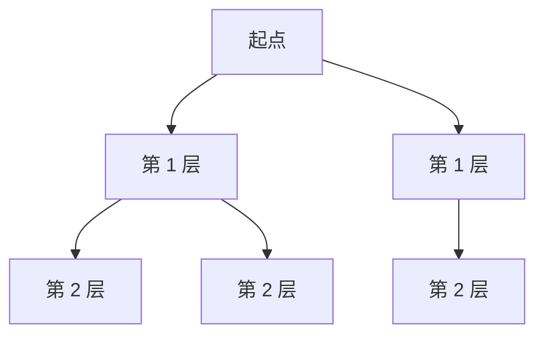
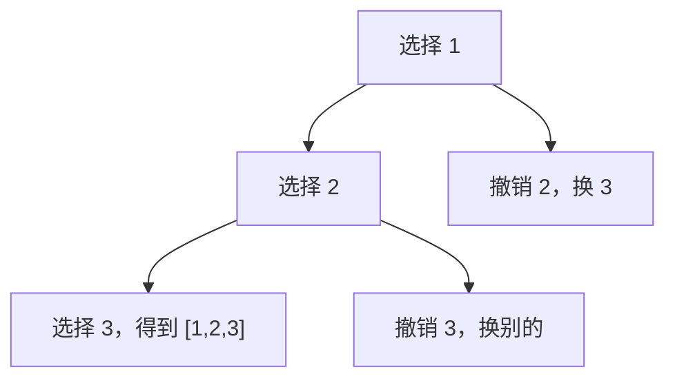

# DFS、BFS与回溯讲透：搜索类问题怎么想

搜索类问题的核心是：

```text
从一个状态出发，不断尝试下一步，直到找到答案或遍历完所有可能。
```

常见三兄弟：

```text
DFS：一条路走到底
BFS：一层一层扩散
回溯：试错，走不通就撤销
```

---

## 1. DFS 是什么？

DFS，深度优先搜索。

它的思路是：

```text
先沿着一个方向一直走，走不动再回来换方向。
```

适合：

```text
树的遍历
图的连通性
岛屿数量
所有路径
```

树的 DFS：

```java
void dfs(TreeNode root) {
    if (root == null) return;

    visit(root);
    dfs(root.left);
    dfs(root.right);
}
```

图的 DFS：

```java
void dfs(int node, List<Integer>[] graph, boolean[] visited) {
    if (visited[node]) return;

    visited[node] = true;

    for (int next : graph[node]) {
        dfs(next, graph, visited);
    }
}
```

---

## 2. BFS 是什么？

BFS，广度优先搜索。

它的思路是：

```text
先访问距离起点 1 步的，再访问 2 步的，再访问 3 步的。
```

BFS 天然适合求无权图最短路径。



模板：

```java
int bfs(int start, int target, List<Integer>[] graph) {
    Queue<Integer> queue = new ArrayDeque<>();
    boolean[] visited = new boolean[graph.length];

    queue.offer(start);
    visited[start] = true;
    int step = 0;

    while (!queue.isEmpty()) {
        int size = queue.size();

        for (int i = 0; i < size; i++) {
            int cur = queue.poll();

            if (cur == target) {
                return step;
            }

            for (int next : graph[cur]) {
                if (!visited[next]) {
                    visited[next] = true;
                    queue.offer(next);
                }
            }
        }

        step++;
    }

    return -1;
}
```

---

## 3. DFS 和 BFS 怎么选？

| 需求 | 更适合 |
|---|---|
| 判断能不能到达 | DFS / BFS 都行 |
| 求无权最短路径 | BFS |
| 枚举所有路径 | DFS / 回溯 |
| 遍历整棵树或图 | DFS 常见 |
| 层序遍历 | BFS |
| 状态空间很深 | BFS 可能爆内存，DFS 更省空间 |

---

## 4. 回溯是什么？

回溯是 DFS 的一种。

它通常用于：

```text
排列
组合
子集
棋盘放置
括号生成
```

核心动作是：

```text
做选择
递归
撤销选择
```

模板：

```java
void backtrack(路径, 选择列表) {
    if (满足结束条件) {
        记录答案;
        return;
    }

    for (选择 : 选择列表) {
        做选择;
        backtrack(路径, 新选择列表);
        撤销选择;
    }
}
```

---

## 5. 例子：全排列

```java
List<List<Integer>> permute(int[] nums) {
    List<List<Integer>> ans = new ArrayList<>();
    boolean[] used = new boolean[nums.length];
    List<Integer> path = new ArrayList<>();

    backtrack(nums, used, path, ans);
    return ans;
}

void backtrack(int[] nums, boolean[] used, List<Integer> path, List<List<Integer>> ans) {
    if (path.size() == nums.length) {
        ans.add(new ArrayList<>(path));
        return;
    }

    for (int i = 0; i < nums.length; i++) {
        if (used[i]) continue;

        used[i] = true;
        path.add(nums[i]);

        backtrack(nums, used, path, ans);

        path.remove(path.size() - 1);
        used[i] = false;
    }
}
```

这里必须撤销选择，否则会影响其他分支。



---

## 6. 例子：组合

从 `1..n` 中选 `k` 个数。

```java
List<List<Integer>> combine(int n, int k) {
    List<List<Integer>> ans = new ArrayList<>();
    backtrack(1, n, k, new ArrayList<>(), ans);
    return ans;
}

void backtrack(int start, int n, int k, List<Integer> path, List<List<Integer>> ans) {
    if (path.size() == k) {
        ans.add(new ArrayList<>(path));
        return;
    }

    for (int i = start; i <= n; i++) {
        path.add(i);
        backtrack(i + 1, n, k, path, ans);
        path.remove(path.size() - 1);
    }
}
```

组合和排列的区别：

```text
排列关心顺序，需要 used 数组
组合不关心顺序，用 start 控制只能往后选
```

---

## 7. 剪枝

回溯可能很慢，所以要剪枝。

组合题中，如果剩余数字不够选，可以提前停止：

```java
for (int i = start; i <= n - (k - path.size()) + 1; i++) {
    path.add(i);
    backtrack(i + 1, n, k, path, ans);
    path.remove(path.size() - 1);
}
```

剪枝的本质是：

```text
明知道这条路不可能产生答案，就不要继续走。
```

---

## 8. 岛屿数量：DFS/BFS 典型题

```java
int numIslands(char[][] grid) {
    int m = grid.length;
    int n = grid[0].length;
    int count = 0;

    for (int i = 0; i < m; i++) {
        for (int j = 0; j < n; j++) {
            if (grid[i][j] == '1') {
                count++;
                dfs(grid, i, j);
            }
        }
    }

    return count;
}

void dfs(char[][] grid, int i, int j) {
    if (i < 0 || i >= grid.length || j < 0 || j >= grid[0].length) return;
    if (grid[i][j] != '1') return;

    grid[i][j] = '0';

    dfs(grid, i + 1, j);
    dfs(grid, i - 1, j);
    dfs(grid, i, j + 1);
    dfs(grid, i, j - 1);
}
```

---

## 9. 一句话总结

DFS：

```text
一条路走到底。
```

BFS：

```text
一层一层扩散，常用于最短步数。
```

回溯：

```text
做选择、递归、撤销选择，用来枚举所有可能。
```
