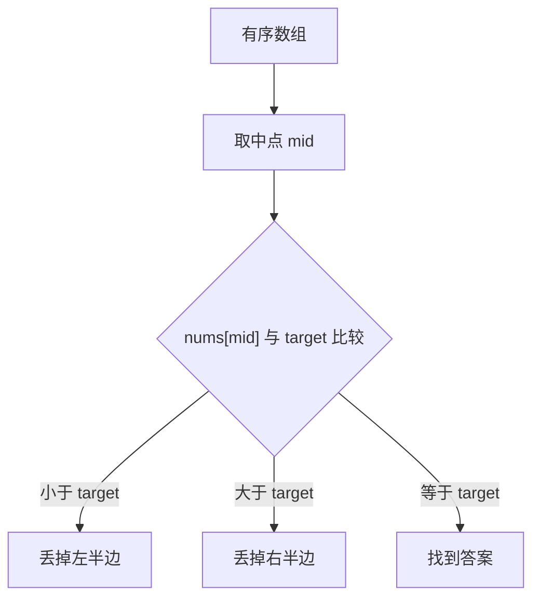

# 二分查找讲透：从有序数组到答案二分

二分查找不是只会在有序数组里找一个数。真正刷题时，二分更常见的形态是：

```text
在一段有单调性的答案范围里，找到第一个满足条件的位置，或者最后一个满足条件的位置。
```

如果只记 `left <= right`，很容易写出边界 bug。要真正掌握二分，核心不是模板，而是理解：**单调性 + 边界含义**。

---

## 1. 最基础的二分：找一个目标值

数组有序：

```text
nums = [1, 3, 5, 7, 9, 11]
target = 7
```

每次取中间值：

```text
mid = (left + right) / 2
```

如果 `nums[mid]` 小了，说明目标在右边。

如果大了，说明目标在左边。



代码：

```java
int binarySearch(int[] nums, int target) {
    int left = 0;
    int right = nums.length - 1;

    while (left <= right) {
        int mid = left + (right - left) / 2;

        if (nums[mid] == target) {
            return mid;
        } else if (nums[mid] < target) {
            left = mid + 1;
        } else {
            right = mid - 1;
        }
    }

    return -1;
}
```

---

## 2. 二分最容易错的是边界

很多人二分写错，不是因为不会比较，而是因为不知道 `left` 和 `right` 表示什么。

常见写法有两种：

| 写法 | 搜索区间 | 循环条件 |
|---|---|---|
| 闭区间 | `[left, right]` | `left <= right` |
| 左闭右开 | `[left, right)` | `left < right` |

两种都可以，但不要混着写。

初学建议先熟练闭区间：

```text
left 和 right 都是可能答案
```

所以循环条件是：

```text
left <= right
```

当 `left > right` 时，说明搜索区间空了。

---

## 3. 找第一个大于等于 target 的位置

这比“找一个值”更重要。

问题：

```text
nums = [1, 2, 2, 2, 4, 5]
target = 2
```

找第一个 `>= 2` 的位置，答案是下标 `1`。

这类问题可以理解成：

```text
找到第一个满足 nums[i] >= target 的 i
```

代码：

```java
int lowerBound(int[] nums, int target) {
    int left = 0;
    int right = nums.length;

    while (left < right) {
        int mid = left + (right - left) / 2;

        if (nums[mid] >= target) {
            right = mid;
        } else {
            left = mid + 1;
        }
    }

    return left;
}
```

这里用的是左闭右开区间 `[left, right)`。

最终 `left == right`，就是第一个满足条件的位置。

---

## 4. 找最后一个小于等于 target 的位置

```java
int upperBoundLastLE(int[] nums, int target) {
    int left = 0;
    int right = nums.length;

    while (left < right) {
        int mid = left + (right - left) / 2;

        if (nums[mid] <= target) {
            left = mid + 1;
        } else {
            right = mid;
        }
    }

    return left - 1;
}
```

为什么返回 `left - 1`？

因为循环结束时，`left` 是第一个 `> target` 的位置，所以最后一个 `<= target` 的位置就是 `left - 1`。

---

## 5. 答案二分：二分的真正威力

有些题数组并不是有序的，但答案有单调性。

比如：给一些货物重量，按顺序装船，要求 `D` 天内运完，问船的最低载重。

如果船载重是 `x`：

```text
x 太小：运不完
x 足够大：能运完
x 更大：一定也能运完
```

这就是单调性。


我们要找的是：

```text
第一个可行的载重
```

### 5.1 检查函数

```java
boolean canShip(int[] weights, int days, int capacity) {
    int needDays = 1;
    int cur = 0;

    for (int w : weights) {
        if (cur + w > capacity) {
            needDays++;
            cur = 0;
        }
        cur += w;
    }

    return needDays <= days;
}
```

### 5.2 二分答案

```java
int shipWithinDays(int[] weights, int days) {
    int left = 0;
    int right = 0;

    for (int w : weights) {
        left = Math.max(left, w);
        right += w;
    }

    while (left < right) {
        int mid = left + (right - left) / 2;

        if (canShip(weights, days, mid)) {
            right = mid;
        } else {
            left = mid + 1;
        }
    }

    return left;
}
```

---

## 6. 什么题要想到答案二分？

看到这些字眼，可以想二分答案：

| 关键词 | 例子 |
|---|---|
| 最小化最大值 | 最小船载重、最小最大分组和 |
| 最大化最小值 | 最大最小距离、分糖果间距 |
| 是否可行 | 给一个答案，能不能满足条件 |
| 单调变化 | 答案越大越容易，或答案越大越困难 |

判断关键：

```text
如果 x 可行，那么比 x 更大的答案是否一定可行？
或者如果 x 不可行，那么比 x 更小的答案是否一定不可行？
```

能回答，就是二分答案。

---

## 7. 二分常见错误

### 错误一：mid 溢出

不要写：

```java
int mid = (left + right) / 2;
```

更安全：

```java
int mid = left + (right - left) / 2;
```

### 错误二：边界不收缩

如果写成：

```java
left = mid;
```

在某些情况下会死循环。

如果使用 `[left, right)` 找第一个满足条件的位置，通常是：

```java
right = mid;
left = mid + 1;
```

### 错误三：不知道返回 left 还是 right

循环结束时：

```text
left == right
```

所以返回谁都一样。但前提是你清楚它代表什么。

---

## 8. 一句话总结二分

二分查找的本质不是“找中间”，而是：

```text
利用单调性，每次排除一半不可能的答案。
```

普通二分找的是有序数组中的位置。

答案二分找的是单调可行区间中的临界点。
