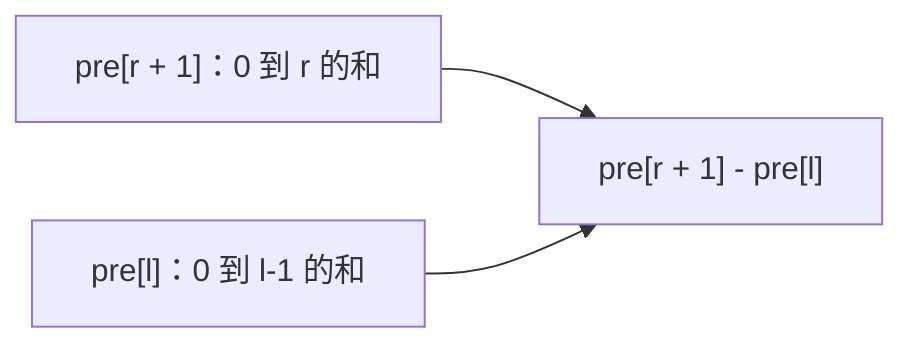

# 前缀和与差分讲透：区间求和和批量修改

前缀和和差分是一对非常实用的技巧。

前缀和解决：

```text
频繁查询区间和
```

差分解决：

```text
频繁对区间做批量加减
```

它们都能把很多看似重复的操作降到更低复杂度。

---

## 1. 前缀和是什么？

给数组：

```text
nums = [2, 4, 1, 7, 3]
```

前缀和数组 `pre` 定义为：

```text
pre[i] = nums[0] + nums[1] + ... + nums[i - 1]
```

也就是说：

```text
pre[0] = 0
pre[1] = nums[0]
pre[2] = nums[0] + nums[1]
```

代码：

```java
int[] buildPrefix(int[] nums) {
    int n = nums.length;
    int[] pre = new int[n + 1];

    for (int i = 0; i < n; i++) {
        pre[i + 1] = pre[i] + nums[i];
    }

    return pre;
}
```

区间 `[l, r]` 的和：

```text
sum(l, r) = pre[r + 1] - pre[l]
```



---

## 2. 前缀和例子：区间求和

```java
class NumArray {
    private int[] pre;

    public NumArray(int[] nums) {
        pre = new int[nums.length + 1];
        for (int i = 0; i < nums.length; i++) {
            pre[i + 1] = pre[i] + nums[i];
        }
    }

    public int sumRange(int left, int right) {
        return pre[right + 1] - pre[left];
    }
}
```

如果没有前缀和，每次查询都要循环，复杂度 `O(n)`。

有了前缀和，每次查询 `O(1)`。

---

## 3. 前缀和 + 哈希：和为 k 的子数组

题意：给数组 `nums` 和整数 `k`，求和为 `k` 的连续子数组个数。

如果数组有负数，滑动窗口不好用，因为窗口和不单调。

这时用前缀和。

如果：

```text
pre[j] - pre[i] = k
```

说明：

```text
nums[i..j-1] 的和是 k
```

变形：

```text
pre[i] = pre[j] - k
```

所以扫描到当前前缀和 `sum` 时，只要之前出现过 `sum - k`，就能组成答案。

```java
int subarraySum(int[] nums, int k) {
    Map<Integer, Integer> count = new HashMap<>();
    count.put(0, 1);

    int sum = 0;
    int ans = 0;

    for (int num : nums) {
        sum += num;

        ans += count.getOrDefault(sum - k, 0);
        count.put(sum, count.getOrDefault(sum, 0) + 1);
    }

    return ans;
}
```

---

## 4. 二维前缀和

矩阵求子矩形和时，用二维前缀和。

定义：

```text
pre[i][j] = matrix 左上角到 (i - 1, j - 1) 的矩形和
```

构建：

```java
int[][] buildPrefix2D(int[][] matrix) {
    int m = matrix.length;
    int n = matrix[0].length;
    int[][] pre = new int[m + 1][n + 1];

    for (int i = 0; i < m; i++) {
        for (int j = 0; j < n; j++) {
            pre[i + 1][j + 1] = matrix[i][j]
                + pre[i][j + 1]
                + pre[i + 1][j]
                - pre[i][j];
        }
    }

    return pre;
}
```

查询 `(r1, c1)` 到 `(r2, c2)`：

```java
int sumRegion(int[][] pre, int r1, int c1, int r2, int c2) {
    return pre[r2 + 1][c2 + 1]
        - pre[r1][c2 + 1]
        - pre[r2 + 1][c1]
        + pre[r1][c1];
}
```

---

## 5. 差分是什么？

差分是前缀和的反操作。

如果原数组是：

```text
nums = [2, 4, 1, 7, 3]
```

差分数组 `diff`：

```text
diff[0] = nums[0]
diff[i] = nums[i] - nums[i - 1]
```

如果你想对区间 `[l, r]` 全部加 `val`，只需要：

```text
diff[l] += val
diff[r + 1] -= val
```

最后对 `diff` 做前缀和，就能还原修改后的数组。


---

## 6. 差分例子：航班预订统计

题意：有 `n` 个航班，多个预订记录 `[first, last, seats]`，表示从 `first` 到 `last` 每个航班增加 `seats`。

```java
int[] corpFlightBookings(int[][] bookings, int n) {
    int[] diff = new int[n + 1];

    for (int[] b : bookings) {
        int l = b[0] - 1;
        int r = b[1] - 1;
        int seats = b[2];

        diff[l] += seats;
        diff[r + 1] -= seats;
    }

    int[] ans = new int[n];
    int cur = 0;

    for (int i = 0; i < n; i++) {
        cur += diff[i];
        ans[i] = cur;
    }

    return ans;
}
```

---

## 7. 前缀和和差分怎么选？

| 需求 | 用什么 |
|---|---|
| 多次查询区间和 | 前缀和 |
| 多次对子区间加减，最后看结果 | 差分 |
| 有负数的连续子数组和 | 前缀和 + 哈希 |
| 矩阵子区域求和 | 二维前缀和 |
| 矩阵区域批量修改 | 二维差分 |

---

## 8. 一句话总结

前缀和：

```text
把多次区间查询变成 O(1)。
```

差分：

```text
把多次区间修改变成 O(1)，最后统一还原。
```

它们适合处理“区间”问题，是数组题里非常值得优先掌握的基础技巧。
