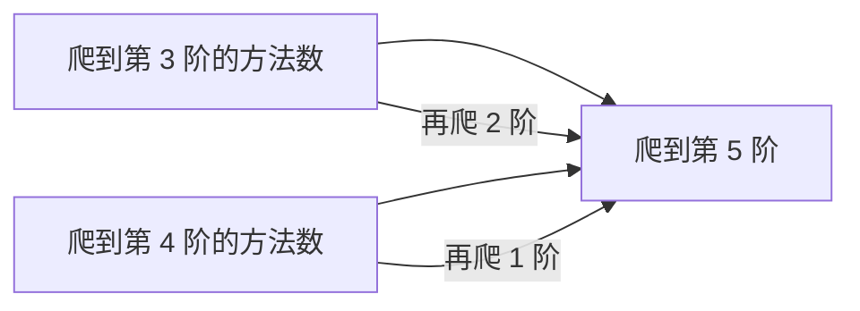
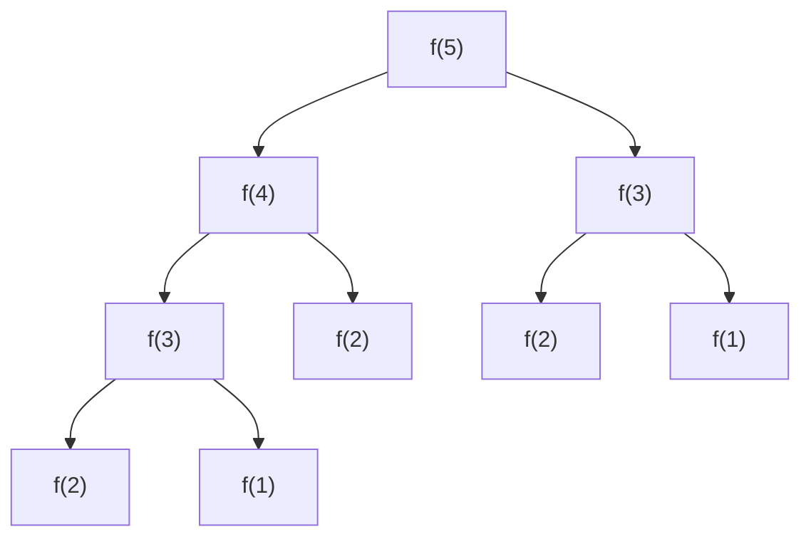
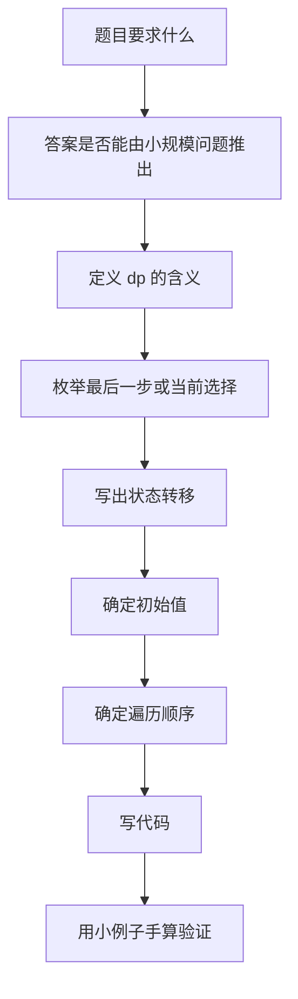

# 动态规划讲透：从暴力递归到状态转移

动态规划，英文叫 Dynamic Programming，简称 DP。

很多人觉得 DP 难，不是因为它真的玄学，而是因为它经常被讲成一句话：

> 找状态，写转移方程。

这句话没错，但对初学者几乎等于没说。因为真正难的是：**状态到底是什么？为什么这样转移？为什么这样遍历？**

这篇文章不把动态规划当公式背，而是把它拆成一个很朴素的问题：

> 当一个问题可以被拆成很多重复的小问题时，不要重复算，把算过的结果存起来。

---

## 1. 先把 DP 说成人话

假设你要爬楼梯，一次可以爬 1 阶或 2 阶，问爬到第 `n` 阶有多少种方法。

如果 `n = 5`，最后一步只有两种可能：

```text
从第 4 阶爬 1 阶到第 5 阶
从第 3 阶爬 2 阶到第 5 阶
```

所以：

```text
爬到 5 的方法数 = 爬到 4 的方法数 + 爬到 3 的方法数
```

也就是：

```text
dp[5] = dp[4] + dp[3]
```

这就是动态规划的核心。

它不是突然冒出来的公式，而是来自最后一步的拆解。



---

## 2. DP 到底解决什么问题？

DP 最适合解决这类问题：

```text
问题可以拆成子问题
子问题会重复出现
大问题的答案依赖小问题的答案
```

比如爬楼梯的递归写法：

```java
int f(int n) {
    if (n == 1) return 1;
    if (n == 2) return 2;
    return f(n - 1) + f(n - 2);
}
```

看起来很自然，但它会重复计算。

例如 `f(5)`：



你会发现：

```text
f(3) 被算了多次
f(2) 被算了多次
f(1) 被算了多次
```

DP 的做法就是：

```text
第一次算出来就存下来，下次直接拿。
```

---

## 3. 动态规划的两种写法

DP 通常有两种写法：

| 写法 | 也叫 | 思路 | 适合谁 |
|---|---|---|---|
| 递归 + 记忆化 | 自顶向下 | 从目标问题往下拆，算过的缓存 | 更容易理解 |
| 数组递推 | 自底向上 | 从最小子问题开始，一步步推到目标 | 更常见、更高效 |

### 3.1 递归 + 记忆化

```java
int climbStairs(int n) {
    int[] memo = new int[n + 1];
    return dfs(n, memo);
}

int dfs(int n, int[] memo) {
    if (n == 1) return 1;
    if (n == 2) return 2;

    if (memo[n] != 0) {
        return memo[n];
    }

    memo[n] = dfs(n - 1, memo) + dfs(n - 2, memo);
    return memo[n];
}
```

这里的 `memo[n]` 表示：

```text
爬到第 n 阶有多少种方法
```

### 3.2 数组递推

```java
int climbStairs(int n) {
    if (n == 1) return 1;

    int[] dp = new int[n + 1];
    dp[1] = 1;
    dp[2] = 2;

    for (int i = 3; i <= n; i++) {
        dp[i] = dp[i - 1] + dp[i - 2];
    }

    return dp[n];
}
```

### 3.3 空间优化

因为 `dp[i]` 只依赖 `dp[i - 1]` 和 `dp[i - 2]`，所以不用保存整个数组。

```java
int climbStairs(int n) {
    if (n == 1) return 1;
    if (n == 2) return 2;

    int prev2 = 1;
    int prev1 = 2;

    for (int i = 3; i <= n; i++) {
        int cur = prev1 + prev2;
        prev2 = prev1;
        prev1 = cur;
    }

    return prev1;
}
```

这里很多人会问：既然能空间优化，是不是一开始就应该这么写？

不建议。

学习 DP 时，先写清楚 `dp[]`，把状态和转移写明白。等理解以后，再做空间优化。

---

## 4. DP 的四个核心问题

写 DP 时，不要一上来就背模板。每道题都问自己四个问题：

| 问题 | 你要回答什么 |
|---|---|
| 1. 状态是什么？ | `dp[i]` 或 `dp[i][j]` 表示什么 |
| 2. 选择是什么？ | 当前一步有哪些选择 |
| 3. 转移是什么？ | 当前状态怎么从之前状态推出来 |
| 4. 初始值和遍历顺序是什么？ | 从哪里开始算，按什么顺序算 |

这四个问题比任何模板都重要。

---

## 5. 例子一：最小花费爬楼梯

题意：有一个数组 `cost`，每一阶有花费。每次可以爬 1 阶或 2 阶，问到达楼顶的最小花费。

例如：

```text
cost = [10, 15, 20]
```

可以从第 0 阶或第 1 阶开始。

### 5.1 状态定义

```text
dp[i] = 到达第 i 阶的最小花费
```

注意：这里的第 `i` 阶可以理解为“站到这个位置”。楼顶是 `n`，不是数组里的某个台阶。

### 5.2 选择

到达第 `i` 阶，最后一步可能来自：

```text
第 i - 1 阶
第 i - 2 阶
```

### 5.3 转移

```text
dp[i] = min(
    dp[i - 1] + cost[i - 1],
    dp[i - 2] + cost[i - 2]
)
```

### 5.4 代码

```java
int minCostClimbingStairs(int[] cost) {
    int n = cost.length;
    int[] dp = new int[n + 1];

    dp[0] = 0;
    dp[1] = 0;

    for (int i = 2; i <= n; i++) {
        dp[i] = Math.min(
            dp[i - 1] + cost[i - 1],
            dp[i - 2] + cost[i - 2]
        );
    }

    return dp[n];
}
```

### 5.5 为什么不是 `dp[i] = min(dp[i - 1], dp[i - 2]) + cost[i]`？

因为你要分清楚：

```text
花费发生在离开某个台阶时，还是到达某个台阶时？
```

这个题里，到达楼顶不需要付费。你从 `i - 1` 走到 `i`，需要付的是 `cost[i - 1]`。

DP 很多 bug 都来自这种含义没定义清楚。

---

## 6. 例子二：打家劫舍

题意：一排房子，每个房子有钱。不能偷相邻房子，问最多能偷多少钱。

例如：

```text
nums = [2, 7, 9, 3, 1]
```

### 6.1 状态定义

```text
dp[i] = 考虑前 i 个房子时，最多能偷多少钱
```

注意这里是“前 i 个”，不是“第 i 个”。这样更容易处理边界。

### 6.2 选择

对于第 `i` 个房子，有两种选择：

```text
不偷第 i 个房子
偷第 i 个房子
```

如果不偷第 `i` 个：

```text
dp[i] = dp[i - 1]
```

如果偷第 `i` 个：

```text
dp[i] = dp[i - 2] + nums[i - 1]
```

所以：

```text
dp[i] = max(dp[i - 1], dp[i - 2] + nums[i - 1])
```

### 6.3 代码

```java
int rob(int[] nums) {
    int n = nums.length;
    int[] dp = new int[n + 1];

    dp[0] = 0;
    dp[1] = nums[0];

    for (int i = 2; i <= n; i++) {
        dp[i] = Math.max(dp[i - 1], dp[i - 2] + nums[i - 1]);
    }

    return dp[n];
}
```

### 6.4 这题为什么不是贪心？

有人可能会想：每次偷金额更大的房子不就行了？

看这个例子：

```text
[2, 1, 1, 2]
```

如果贪心看到开头 `2`，偷它；后面可能又偷最后一个 `2`，这里刚好对。

但换一个：

```text
[2, 7, 9, 3, 1]
```

局部看 `7` 很大，但最优是：

```text
2 + 9 + 1 = 12
```

不是只盯着当前最大。因为当前选择会影响后续可选集合，所以要 DP。

---

## 7. 例子三：零钱兑换

题意：给定硬币面额 `coins` 和金额 `amount`，求凑出金额的最少硬币数。

例如：

```text
coins = [1, 2, 5]
amount = 11
答案 = 3，因为 11 = 5 + 5 + 1
```

### 7.1 状态定义

```text
dp[x] = 凑出金额 x 所需的最少硬币数
```

### 7.2 选择

最后一枚硬币可能是任意一个 `coin`。

如果最后用了一枚 `coin`，那么前面要凑的是：

```text
x - coin
```

所以：

```text
dp[x] = min(dp[x], dp[x - coin] + 1)
```

### 7.3 初始化

`dp[0] = 0`，因为凑 0 元不需要硬币。

其他位置先设成一个很大的数。

### 7.4 代码

```java
int coinChange(int[] coins, int amount) {
    int INF = amount + 1;
    int[] dp = new int[amount + 1];
    Arrays.fill(dp, INF);

    dp[0] = 0;

    for (int x = 1; x <= amount; x++) {
        for (int coin : coins) {
            if (x >= coin) {
                dp[x] = Math.min(dp[x], dp[x - coin] + 1);
            }
        }
    }

    return dp[amount] == INF ? -1 : dp[amount];
}
```

### 7.5 这题为什么不能总是贪心？

如果硬币是：

```text
[1, 5, 10]
```

凑 `18`，贪心拿最大硬币：

```text
10 + 5 + 1 + 1 + 1 = 5 枚
```

这没问题。

但如果硬币是：

```text
[1, 3, 4]
amount = 6
```

贪心会：

```text
4 + 1 + 1 = 3 枚
```

最优是：

```text
3 + 3 = 2 枚
```

所以零钱兑换一般要 DP，不能默认贪心。

---

## 8. 例子四：0/1 背包

题意：有一些物品，每个物品有重量和价值，每个物品最多选一次。背包容量为 `W`，问最大价值。

例如：

| 物品 | 重量 | 价值 |
|---|---:|---:|
| A | 1 | 15 |
| B | 3 | 20 |
| C | 4 | 30 |

容量：

```text
W = 4
```

### 8.1 状态定义

```text
dp[i][w] = 只考虑前 i 个物品，背包容量为 w 时的最大价值
```

### 8.2 选择

对于第 `i` 个物品：

```text
不选它
选它
```

如果不选：

```text
dp[i][w] = dp[i - 1][w]
```

如果选：

```text
dp[i][w] = dp[i - 1][w - weight[i - 1]] + value[i - 1]
```

所以：

```text
dp[i][w] = max(
    dp[i - 1][w],
    dp[i - 1][w - weight[i - 1]] + value[i - 1]
)
```

### 8.3 二维代码

```java
int knapsack(int[] weight, int[] value, int W) {
    int n = weight.length;
    int[][] dp = new int[n + 1][W + 1];

    for (int i = 1; i <= n; i++) {
        for (int w = 0; w <= W; w++) {
            dp[i][w] = dp[i - 1][w];

            if (w >= weight[i - 1]) {
                dp[i][w] = Math.max(
                    dp[i][w],
                    dp[i - 1][w - weight[i - 1]] + value[i - 1]
                );
            }
        }
    }

    return dp[n][W];
}
```

### 8.4 一维优化

```java
int knapsack(int[] weight, int[] value, int W) {
    int n = weight.length;
    int[] dp = new int[W + 1];

    for (int i = 0; i < n; i++) {
        for (int w = W; w >= weight[i]; w--) {
            dp[w] = Math.max(dp[w], dp[w - weight[i]] + value[i]);
        }
    }

    return dp[W];
}
```

注意：0/1 背包的一维数组里，容量必须倒序遍历。

为什么？

因为每个物品只能用一次。如果正序遍历，会在同一轮里重复使用当前物品。

```text
倒序：用的是上一轮的 dp[w - weight]
正序：可能用到刚更新过的 dp[w - weight]
```

---

## 9. 例子五：最长公共子序列

题意：给两个字符串，求最长公共子序列长度。

例如：

```text
text1 = "abcde"
text2 = "ace"
答案 = 3，因为 "ace"
```

### 9.1 状态定义

```text
dp[i][j] = text1 的前 i 个字符和 text2 的前 j 个字符的最长公共子序列长度
```

### 9.2 转移

如果两个最后字符相同：

```text
text1[i - 1] == text2[j - 1]
```

说明这个字符可以加入公共子序列：

```text
dp[i][j] = dp[i - 1][j - 1] + 1
```

如果不同：

```text
dp[i][j] = max(dp[i - 1][j], dp[i][j - 1])
```

### 9.3 代码

```java
int longestCommonSubsequence(String text1, String text2) {
    int m = text1.length();
    int n = text2.length();
    int[][] dp = new int[m + 1][n + 1];

    for (int i = 1; i <= m; i++) {
        for (int j = 1; j <= n; j++) {
            if (text1.charAt(i - 1) == text2.charAt(j - 1)) {
                dp[i][j] = dp[i - 1][j - 1] + 1;
            } else {
                dp[i][j] = Math.max(dp[i - 1][j], dp[i][j - 1]);
            }
        }
    }

    return dp[m][n];
}
```

---

## 10. 什么时候该想到 DP？

看到这些信号，可以优先怀疑是 DP：

| 信号 | 常见表达 |
|---|---|
| 求最值 | 最大、最小、最多、最少 |
| 求方案数 | 有多少种方法、路径数、组合数 |
| 选择会影响未来 | 选了当前，后面某些不能选 |
| 可以拆成前缀问题 | 前 i 个、前 i 天、前 i 个字符 |
| 状态可以描述局面 | 当前容量、当前位置、当前金额、当前剩余 |
| 暴力递归有重复子问题 | 同一个参数组合被算多次 |

但是注意：**不是所有最值题都是 DP。**

如果每一步的局部最优一定能推出全局最优，那可能是贪心。

---

## 11. DP 最常见的状态类型

| 类型 | 状态长什么样 | 示例 |
|---|---|---|
| 一维线性 DP | `dp[i]` | 爬楼梯、打家劫舍 |
| 二维表格 DP | `dp[i][j]` | 最长公共子序列、编辑距离 |
| 背包 DP | `dp[i][w]` 或 `dp[w]` | 0/1 背包、完全背包 |
| 区间 DP | `dp[l][r]` | 戳气球、合并石子 |
| 树形 DP | `dp[node]` | 树上最大独立集 |
| 状态压缩 DP | `dp[mask]` | 旅行商、集合选择 |

一开始不需要全都掌握。重要的是会把题目翻译成状态。

---

## 12. 写 DP 的实战步骤

拿到题目后，可以按这个顺序想：



最关键的是：

```text
先定义 dp 的含义，再写转移。
```

不要反过来。

---

## 13. DP 常见错误

### 错误一：状态含义不清

比如 `dp[i]` 到底是：

```text
到达第 i 个位置
还是前 i 个位置
```

这两个含义差很多。

### 错误二：边界初始化乱写

如果 `dp[0]` 是空集合、空字符串、金额 0，一般有特殊意义。

例如零钱兑换：

```text
dp[0] = 0
```

表示凑出 0 元需要 0 枚硬币。

### 错误三：遍历顺序错

如果 `dp[i]` 依赖 `dp[i - 1]`，那就从小到大。

如果一维 0/1 背包，容量要倒序。

如果完全背包，容量通常正序。

### 错误四：把贪心硬写成 DP，或者把 DP 硬想成贪心

DP 是保留多个可能性，贪心是每步直接做决定。

如果当前决定会影响未来，而且不能证明局部最优安全，就不要轻易贪心。

---

## 14. 一句话总结 DP

动态规划不是背公式，而是：

```text
把一个大问题拆成小问题，明确状态含义，用已经算出的状态推出新的状态。
```

真正写 DP 时，记住这四句话：

```text
1. dp 表示什么？
2. 当前有哪些选择？
3. 当前状态从哪些旧状态来？
4. 旧状态是否已经被算出来？
```

如果这四个问题能回答清楚，DP 就不再是玄学。
