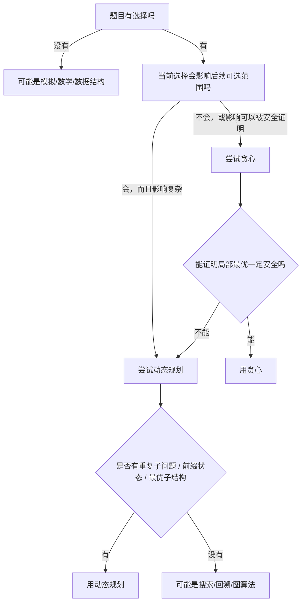
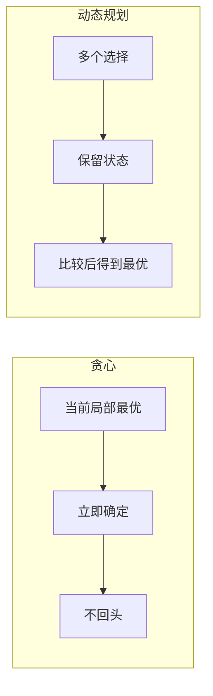

# 动态规划还是贪心：场景区分和实战判断

很多题最难的不是写代码，而是判断：

```text
这题到底该用动态规划，还是贪心？
```

动态规划和贪心都在处理“选择”。

区别是：

```text
动态规划：我不敢只做一个选择，所以把可能性都保留下来，逐步求最优。
贪心：我能证明当前这个选择一定安全，所以直接做掉，不回头。
```

---

## 1. 核心区别一句话

| 算法 | 核心思想 | 选择方式 |
|---|---|---|
| 动态规划 | 保留历史最优结果，用小问题推大问题 | 多种选择都比较 |
| 贪心 | 每一步做一个安全的局部最优选择 | 只做一个选择 |

更口语一点：

```text
DP：我先别急着定死，看看所有可能里哪个最好。
贪心：这个选择一定不吃亏，我现在就定了。
```

---

## 2. 一个非常实用的判断流程



---

## 3. 用一句话区分

### 贪心问的是：

```text
我现在选这个，未来一定不会后悔吗？
```

### 动态规划问的是：

```text
我现在有多个选择，能不能把每种选择后的最优结果算出来再比较？
```

如果你能自信回答“不会后悔”，贪心。

如果你要说“看后面情况”，DP。

---

## 4. 对比一：零钱兑换

### 4.1 情况一：普通币制可能贪心有效

```text
coins = [1, 5, 10, 25]
amount = 63
```

贪心：

```text
25 + 25 + 10 + 1 + 1 + 1
```

通常正确。

### 4.2 情况二：自定义币值贪心会错

```text
coins = [1, 3, 4]
amount = 6
```

贪心：

```text
4 + 1 + 1 = 3 枚
```

最优：

```text
3 + 3 = 2 枚
```

### 4.3 怎么判断？

如果题目没有明确说明币制满足贪心性质，通常不能贪心。

应该 DP：

```text
dp[x] = 凑出金额 x 的最少硬币数
```

因为当前拿最大硬币，可能导致剩余金额很尴尬。

---

## 5. 对比二：0/1 背包 vs 分数背包

这是区分 DP 和贪心最经典的例子。

### 5.1 0/1 背包

每个物品只能选或不选，不能切开。

| 物品 | 重量 | 价值 | 性价比 |
|---|---:|---:|---:|
| A | 10 | 60 | 6 |
| B | 5 | 50 | 10 |
| C | 5 | 50 | 10 |

容量：

```text
10
```

按价值选：A = 60。

按性价比选：B + C = 100，这个例子刚好对。

但换一组：

| 物品 | 重量 | 价值 | 性价比 |
|---|---:|---:|---:|
| A | 10 | 100 | 10 |
| B | 6 | 70 | 11.67 |
| C | 5 | 60 | 12 |

容量：

```text
10
```

按性价比选 C，剩 5 放不下 B，价值 60。

最优是 A，价值 100。

所以 0/1 背包不能简单贪心，要 DP。

### 5.2 分数背包

如果物品可以切开，比如黄金、粮食、液体，那么按性价比从高到低拿就是对的。

因为每一份重量都是独立收益，拿性价比最高的那一份不会影响后续最优。

| 类型 | 能不能切 | 常用方法 |
|---|---|---|
| 0/1 背包 | 不能 | 动态规划 |
| 分数背包 | 能 | 贪心 |

---

## 6. 对比三：会议安排为什么是贪心？

题目：最多参加多少个不重叠会议。

策略：按结束时间排序，每次选结束最早且不冲突的会议。

为什么是贪心？

因为选择结束最早的会议，会给后面留下最大空间。

更关键的是，它可以证明安全：

```text
任意最优解的第一场会议，如果不是结束最早的那个，
也可以换成结束更早的会议，后续不会更差。
```

这就是交换论证。

所以这题不用 DP。

---

## 7. 对比四：打家劫舍为什么是 DP？

题目：不能偷相邻房子，问最多偷多少钱。

如果你总是偷当前金额最大的房子，可能错。

例如：

```text
[2, 7, 9, 3, 1]
```

局部看 `9` 最大，但整体还要考虑左右限制。

DP 的状态：

```text
dp[i] = 前 i 个房子最多能偷多少钱
```

转移：

```text
dp[i] = max(
    dp[i - 1],
    dp[i - 2] + nums[i - 1]
)
```

原因是第 `i` 个房子有两个选择：

```text
偷
不偷
```

这两个选择都可能走向最优，不能提前定死。

---

## 8. 对比五：股票问题有的贪心，有的 DP

股票题非常适合理解差异。

### 8.1 可以无限次交易：贪心

题意：可以多次买卖，同一时间只能持有一股。

只要明天比今天高，就吃掉上涨差价。

```java
int maxProfit(int[] prices) {
    int profit = 0;
    for (int i = 1; i < prices.length; i++) {
        if (prices[i] > prices[i - 1]) {
            profit += prices[i] - prices[i - 1];
        }
    }
    return profit;
}
```

为什么可以贪心？

因为总收益可以拆成每一天的正差价。

```text
1 -> 3 -> 5
整体收益 = 5 - 1 = 4
拆开收益 = (3 - 1) + (5 - 3) = 4
```

### 8.2 只能交易一次：可以贪心，也可以 DP

只需要维护历史最低价：

```java
int maxProfit(int[] prices) {
    int minPrice = Integer.MAX_VALUE;
    int ans = 0;

    for (int price : prices) {
        minPrice = Math.min(minPrice, price);
        ans = Math.max(ans, price - minPrice);
    }

    return ans;
}
```

这本质是贪心维护最优前缀。

### 8.3 最多交易两次、带冷冻期、带手续费：通常 DP

因为状态变复杂了：

```text
今天是否持有股票
交易了几次
是否处于冷冻期
是否扣过手续费
```

这时每一步的局部选择不容易证明安全，通常要 DP。

---

## 9. 动态规划和贪心的本质差异图



---

## 10. 判断表：遇到题时怎么想

| 题目特征 | 更像贪心 | 更像 DP |
|---|---|---|
| 每一步选择后不能反悔 | 如果能证明安全 | 如果不能证明安全 |
| 当前选择影响后续 | 影响很单调，可维护边界 | 影响复杂，需要比较多种情况 |
| 题目要求最值 | 可能是贪心也可能是 DP | 可能是贪心也可能是 DP |
| 有明显前缀/容量/金额/字符串位置 | 不一定 | 很常见 |
| 有“最多不重叠区间” | 常见贪心 | 少数变形才 DP |
| 有“每个物品选或不选” | 通常不是 | 常见 DP |
| 有“可以切分” | 常见贪心 | 不一定 |
| 有“方案数” | 很少贪心 | 常见 DP |
| 有“最少步数/最短路径” | 有时贪心/BFS | 有时 DP/图算法 |

---

## 11. 一个实战判断方法：先试贪心，再找反例

很多时候可以这样做：

```text
1. 想一个最自然的贪心策略
2. 手写几个小例子
3. 主动构造反例
4. 如果找不到反例，再尝试证明
5. 如果能证明，用贪心
6. 如果不能证明，转 DP 或搜索
```

比如零钱兑换：

自然贪心：每次拿最大硬币。

主动找反例：

```text
coins = [1, 3, 4]
amount = 6
```

贪心失败，所以转 DP。

比如会议安排：

自然贪心：选结束最早的。

尝试反例很难，因为结束早确实给后面留出更多空间。

再用交换论证证明，就可以放心贪心。

---

## 12. 为什么有些 DP 看起来也很“贪心”？

比如最长递增子序列有一种 `O(n log n)` 解法：

```text
tails[i] 表示长度为 i + 1 的递增子序列的最小结尾
```

每次用二分去替换一个更小的结尾。

它看起来像贪心，但背后其实仍然在维护状态。

很多高级算法不是纯 DP 或纯贪心，而是：

```text
DP 状态 + 贪心优化
DP 状态 + 二分优化
贪心选择 + 数据结构维护
```

所以不要死记分类，要看它到底在干什么：

```text
它是在保留多个状态，还是只做一个不可回头的选择？
```

---

## 13. 两个算法的思维对照

### 动态规划思维

```text
这个问题能不能拆成更小的问题？
我需要记录哪些信息，才能从小问题推出大问题？
当前选择有几种？
我是不是要比较这些选择？
```

### 贪心思维

```text
有没有一个排序或选择规则？
按这个规则先选，会不会让后续更差？
能不能把任意最优解改造成包含这个选择？
能不能维护一个单调边界或当前最优？
```

---

## 14. 最后用一句话压住区别

如果只能记一句话：

```text
贪心是“我证明现在这样选一定没问题”；
动态规划是“我不知道现在怎么选最好，所以把选择后的结果都算出来比较”。
```

遇到题时，先问自己：

```text
当前局部最优能不能被证明一定通向全局最优？
```

能，就是贪心。

不能，但有重复子问题和状态转移，就是动态规划。

---

## 15. 再补几个容易混淆的场景

### 15.1 区间覆盖：有时是贪心

题目类似：给很多区间，问最少用几个区间覆盖目标范围。

常见策略是：

```text
在所有起点 <= 当前覆盖边界的区间里，选择终点最远的那个。
```

这就是贪心。

为什么？

因为当前已经能覆盖到 `cur`，下一步无论选哪个区间，都必须从所有 `start <= cur` 的区间里选。既然都能接上当前边界，那当然选能把右边界推得最远的区间，不会更差。


这类题的关键词是：

```text
覆盖范围
最少区间
每次扩展最远右边界
```

它们经常是贪心。

### 15.2 路径计数：通常是 DP

题目类似：一个网格，只能向右或向下走，问从左上到右下有多少条路径。

这不是贪心，因为不是要选一条“最好”的路，而是要数所有路径。

状态很自然：

```text
dp[i][j] = 走到格子 (i, j) 的路径数
```

转移：

```text
dp[i][j] = dp[i - 1][j] + dp[i][j - 1]
```

只要看到：

```text
多少种方法
多少条路径
多少种组合
```

优先想 DP。

### 15.3 最长递增子序列：普通版本是 DP，优化版带贪心味道

普通 DP：

```text
dp[i] = 以 nums[i] 结尾的最长递增子序列长度
```

转移：

```text
如果 nums[j] < nums[i]
dp[i] = max(dp[i], dp[j] + 1)
```

这是标准 DP。

但 `O(n log n)` 的优化会维护一个 `tails` 数组：

```text
tails[len] = 长度为 len + 1 的递增子序列中，最小的结尾值
```

这里有贪心思想：同样长度下，结尾越小越好，因为更容易接后面的数。

所以这题能提醒你：

```text
算法不是非黑即白，很多高效解法是 DP + 贪心性质 + 二分。
```

### 15.4 最短路径：不要乱套 DP 或贪心

看到“最短”两个字，不一定是 DP。

如果是图上的边权最短路：

```text
无权图：BFS
非负权图：Dijkstra
有负权边：Bellman-Ford / SPFA 类思路
```

Dijkstra 也有贪心思想：每次确定当前距离最小的未确定点。

但它依赖一个前提：

```text
边权不能为负
```

如果有负权边，当前看起来最近的点，未来可能被一条负权边改得更近，贪心就不安全。

这个例子说明：

```text
贪心能不能用，经常取决于题目约束。
```

---

## 16. 面对新题时的“反例意识”

判断贪心时，最有用的能力不是背题，而是主动找反例。

比如你想出一个策略：

```text
每次选当前最大的
```

你就应该马上问：

```text
会不会因为选了当前最大的，导致后面两个中等的都选不了？
```

这就容易构造出背包、打家劫舍这类反例。

再比如你想：

```text
每次选最短的
```

你就问：

```text
最短的会不会不关键，真正关键的是结束时间、覆盖范围、剩余容量？
```

反例意识可以帮你避免“看起来很贪心”的错误解。

---

## 17. 判断 DP 时的“状态意识”

如果贪心证明不了，就不要慌。接着问：

```text
为了描述当前局面，我最少需要记录哪些信息？
```

比如：

| 问题 | 状态里通常要记录什么 |
|---|---|
| 爬楼梯 | 当前台阶 |
| 背包 | 当前物品位置 + 剩余容量 |
| 股票 | 当前天数 + 是否持有 + 交易次数 |
| 字符串匹配 | 两个字符串各自处理到哪里 |
| 区间问题 | 当前区间左右端点 |
| 树形问题 | 当前节点以及选/不选当前节点 |

状态不是越多越好，而是：

```text
足够描述未来决策所需信息，同时尽量少。
```

如果状态少了，转移会不正确。

如果状态多了，复杂度会爆炸。

---

## 18. 最后再压一遍实战口令

拿到一道选择类题，可以这样念一遍：

```text
1. 我能不能证明某个局部选择永远不亏？
   能：优先贪心。

2. 如果不能，我能不能定义一个状态，把当前局面描述清楚？
   能：优先 DP。

3. 如果状态也不好定义，可能要搜索、回溯、图算法或数据结构。
```

这三个问题比背“这题属于什么类型”更有用。

真正刷题时，你会发现：

```text
贪心题难在证明；
DP 题难在定义状态；
两者都不是背模板，而是理解选择会怎样影响未来。
```
