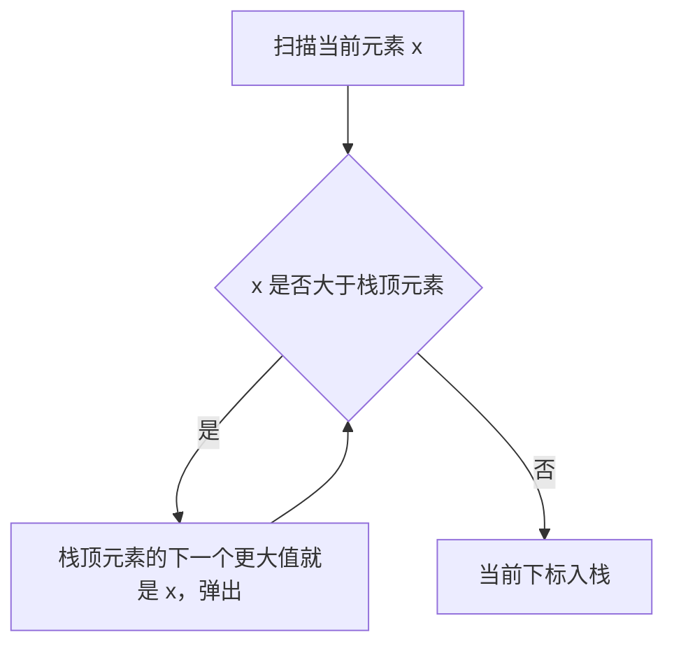

# 单调栈与单调队列讲透：下一个更大和窗口最值

单调栈和单调队列听起来高级，其实核心很简单：

```text
维护一个有单调性的容器，把没用的元素提前删掉。
```

它们常用于：

```text
下一个更大元素
下一个更小元素
柱状图最大矩形
滑动窗口最大值
```

---

## 1. 单调栈是什么？

普通栈是先进后出。

单调栈是在普通栈基础上额外要求：

```text
栈内元素保持递增或递减
```

例如维护一个单调递减栈：

```text
从栈底到栈顶越来越小
```

当新元素比栈顶大时，栈顶就找到了“下一个更大元素”。

---

## 2. 例子：下一个更大元素

数组：

```text
[2, 1, 2, 4, 3]
```

对每个元素，找右边第一个比它大的数。

答案：

```text
[4, 2, 4, -1, -1]
```

代码：

```java
int[] nextGreaterElement(int[] nums) {
    int n = nums.length;
    int[] ans = new int[n];
    Arrays.fill(ans, -1);

    Deque<Integer> stack = new ArrayDeque<>();

    for (int i = 0; i < n; i++) {
        while (!stack.isEmpty() && nums[i] > nums[stack.peek()]) {
            int index = stack.pop();
            ans[index] = nums[i];
        }

        stack.push(i);
    }

    return ans;
}
```

栈里存下标，不直接存值，因为答案要写回对应位置。



---

## 3. 为什么每个元素只进出一次？

虽然代码里有 `while`，但总复杂度不是 `O(n^2)`。

因为每个元素：

```text
最多入栈一次
最多出栈一次
```

所以总复杂度是 `O(n)`。

---

## 4. 柱状图最大矩形

给柱子高度：

```text
[2, 1, 5, 6, 2, 3]
```

求最大矩形面积。

关键思想：对每根柱子，找它左边第一个比它矮的位置，右边第一个比它矮的位置。

这样它能扩展的宽度就确定了。

代码：

```java
int largestRectangleArea(int[] heights) {
    int n = heights.length;
    int[] newHeights = new int[n + 2];

    for (int i = 0; i < n; i++) {
        newHeights[i + 1] = heights[i];
    }

    Deque<Integer> stack = new ArrayDeque<>();
    int ans = 0;

    for (int i = 0; i < newHeights.length; i++) {
        while (!stack.isEmpty() && newHeights[i] < newHeights[stack.peek()]) {
            int h = newHeights[stack.pop()];
            int right = i;
            int left = stack.peek();
            int width = right - left - 1;
            ans = Math.max(ans, h * width);
        }
        stack.push(i);
    }

    return ans;
}
```

这里加了两个高度为 0 的哨兵，方便处理边界。

---

## 5. 单调队列是什么？

单调队列常用于滑动窗口最大值或最小值。

它和单调栈类似，但队列两端都要操作：

```text
队尾：删除不可能成为答案的元素
队头：删除已经滑出窗口的元素
```

---

## 6. 例子：滑动窗口最大值

题意：数组中每个长度为 `k` 的窗口，求最大值。

```text
nums = [1,3,-1,-3,5,3,6,7]
k = 3
答案 = [3,3,5,5,6,7]
```

维护一个单调递减队列，队头永远是当前窗口最大值。

```java
int[] maxSlidingWindow(int[] nums, int k) {
    int n = nums.length;
    int[] ans = new int[n - k + 1];
    Deque<Integer> deque = new ArrayDeque<>();

    for (int i = 0; i < n; i++) {
        while (!deque.isEmpty() && deque.peekFirst() <= i - k) {
            deque.pollFirst();
        }

        while (!deque.isEmpty() && nums[i] >= nums[deque.peekLast()]) {
            deque.pollLast();
        }

        deque.offerLast(i);

        if (i >= k - 1) {
            ans[i - k + 1] = nums[deque.peekFirst()];
        }
    }

    return ans;
}
```

---

## 7. 单调栈和单调队列怎么区分？

| 问题 | 用什么 |
|---|---|
| 找右边第一个更大/更小 | 单调栈 |
| 找左右边界 | 单调栈 |
| 固定窗口最大/最小 | 单调队列 |
| 元素过期需要从队头删除 | 单调队列 |

---

## 8. 一句话总结

单调栈和单调队列的本质是：

```text
把将来不可能成为答案的元素提前删掉。
```

它们的难点不在代码长，而在想清楚：

```text
什么元素已经没用了？
什么时候该弹？
答案什么时候产生？
```

---

## 9. 再理解一下：为什么被弹出的元素没用了？

以滑动窗口最大值为例，如果新元素 `x` 比队尾元素更大，并且 `x` 的下标更靠右，那么队尾元素以后永远不可能成为最大值。

原因是：

```text
1. x 更大
2. x 更晚进入窗口，所以会更晚过期
```

既然它又小又更早过期，就没有任何保留价值。

这就是单调队列的核心删除逻辑。

单调栈也类似。找下一个更大元素时，如果当前元素比栈顶大，那么当前元素就是栈顶右边遇到的第一个更大元素。栈顶答案已经确定，可以弹出。

---

## 10. 常见变形

| 题型 | 维护方向 | 触发答案的时机 |
|---|---|---|
| 下一个更大元素 | 单调递减栈 | 当前元素大于栈顶时 |
| 下一个更小元素 | 单调递增栈 | 当前元素小于栈顶时 |
| 左边第一个更大 | 从左到右维护递减栈 | 入栈前看栈顶 |
| 柱状图最大矩形 | 单调递增栈 | 当前高度小于栈顶高度时 |
| 滑动窗口最大值 | 单调递减队列 | 每个窗口形成后取队头 |
| 滑动窗口最小值 | 单调递增队列 | 每个窗口形成后取队头 |

很多题只是把“更大”换成“更小”，把“右边”换成“左边”。真正要抓的是：

```text
栈里保留的是还没有确定答案的元素。
队列里保留的是未来仍有可能成为窗口最值的元素。
```
