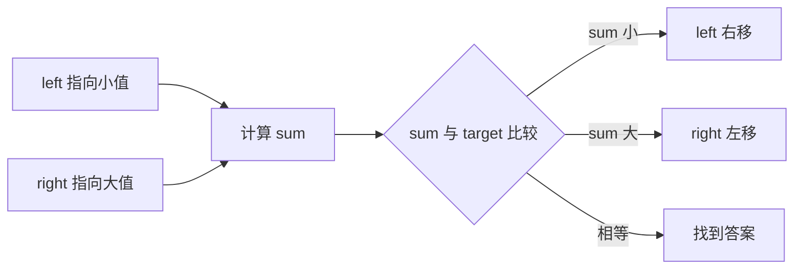
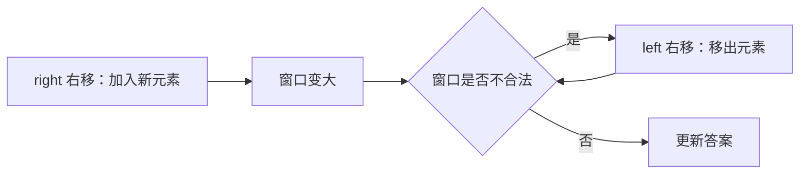

# 双指针与滑动窗口讲透：数组字符串题的第一反应

数组和字符串题里，双指针、滑动窗口非常常见。

它们的共同点是：

```text
用两个指针维护一段区间，避免重复扫描。
```

暴力解法经常是 `O(n^2)`，双指针和滑动窗口常常能降到 `O(n)`。

---

## 1. 双指针是什么？

双指针不是固定算法，而是一种操作方式。

常见形式：

| 类型 | 指针怎么动 | 常见题型 |
|---|---|---|
| 左右指针 | 一个从左，一个从右 | 两数之和、有序数组、回文 |
| 快慢指针 | 一个快，一个慢 | 链表环、原地去重 |
| 滑动窗口 | 左右都从左往右 | 子数组、子串、连续区间 |

---

## 2. 左右指针：有序数组两数之和

题意：有序数组中找两个数，使和等于 target。

```text
nums = [1, 2, 4, 6, 10]
target = 8
```

思路：

```text
left 指向最小
right 指向最大
```

如果和太小，说明左边太小，`left++`。

如果和太大，说明右边太大，`right--`。

```java
int[] twoSumSorted(int[] nums, int target) {
    int left = 0;
    int right = nums.length - 1;

    while (left < right) {
        int sum = nums[left] + nums[right];

        if (sum == target) {
            return new int[]{left, right};
        } else if (sum < target) {
            left++;
        } else {
            right--;
        }
    }

    return new int[]{-1, -1};
}
```

图示：



---

## 3. 快慢指针：原地删除重复项

有序数组去重，要求原地返回新长度。

```text
[1, 1, 2, 2, 3]
```

慢指针 `slow` 表示新数组最后一个位置。

快指针 `fast` 扫描原数组。

```java
int removeDuplicates(int[] nums) {
    if (nums.length == 0) return 0;

    int slow = 0;

    for (int fast = 1; fast < nums.length; fast++) {
        if (nums[fast] != nums[slow]) {
            slow++;
            nums[slow] = nums[fast];
        }
    }

    return slow + 1;
}
```

这里的含义是：

```text
nums[0..slow] 是已经处理好的无重复区域
fast 负责寻找下一个新元素
```

---

## 4. 滑动窗口是什么？

滑动窗口通常用于连续子数组或连续子串。

它维护一个区间：

```text
[left, right]
```

右指针负责扩张窗口。

左指针负责收缩窗口。



---

## 5. 滑动窗口例子：最长无重复子串

题意：给字符串，求不含重复字符的最长子串长度。

```text
s = "abcabcbb"
答案 = 3，对应 "abc"
```

思路：窗口里不能有重复字符。

用 `Set` 维护窗口字符。

```java
int lengthOfLongestSubstring(String s) {
    Set<Character> set = new HashSet<>();
    int left = 0;
    int ans = 0;

    for (int right = 0; right < s.length(); right++) {
        char c = s.charAt(right);

        while (set.contains(c)) {
            set.remove(s.charAt(left));
            left++;
        }

        set.add(c);
        ans = Math.max(ans, right - left + 1);
    }

    return ans;
}
```

---

## 6. 滑动窗口例子：最小覆盖子串

题意：给 `s` 和 `t`，在 `s` 中找包含 `t` 所有字符的最短子串。

这是滑动窗口经典题。

窗口要满足：

```text
窗口内包含 t 需要的所有字符及数量
```

```java
String minWindow(String s, String t) {
    Map<Character, Integer> need = new HashMap<>();
    Map<Character, Integer> window = new HashMap<>();

    for (char c : t.toCharArray()) {
        need.put(c, need.getOrDefault(c, 0) + 1);
    }

    int left = 0;
    int valid = 0;
    int start = 0;
    int len = Integer.MAX_VALUE;

    for (int right = 0; right < s.length(); right++) {
        char c = s.charAt(right);
        if (need.containsKey(c)) {
            window.put(c, window.getOrDefault(c, 0) + 1);
            if (window.get(c).equals(need.get(c))) {
                valid++;
            }
        }

        while (valid == need.size()) {
            if (right - left + 1 < len) {
                start = left;
                len = right - left + 1;
            }

            char d = s.charAt(left);
            left++;

            if (need.containsKey(d)) {
                if (window.get(d).equals(need.get(d))) {
                    valid--;
                }
                window.put(d, window.get(d) - 1);
            }
        }
    }

    return len == Integer.MAX_VALUE ? "" : s.substring(start, start + len);
}
```

---

## 7. 什么时候想到滑动窗口？

看到这些词，可以优先想滑动窗口：

| 关键词 | 说明 |
|---|---|
| 连续子数组 | 子数组必须连续 |
| 连续子串 | 子串必须连续 |
| 最长/最短 | 在连续窗口里求最值 |
| 满足某条件 | 和、字符种类、频次、乘积 |
| 每个元素进出一次 | 可以做到 `O(n)` |

但是注意：滑动窗口通常要求窗口变化有一定单调性。

例如全是正数的数组，窗口和随着右扩会变大，左缩会变小，适合滑动窗口。

如果有负数，窗口和就不单调，可能需要前缀和 + 哈希。

---

## 8. 固定窗口 vs 可变窗口

| 类型 | 特点 | 例子 |
|---|---|---|
| 固定窗口 | 窗口长度固定为 k | 长度为 k 的最大平均值 |
| 可变窗口 | 窗口根据条件伸缩 | 最长无重复子串、最小覆盖子串 |

固定窗口代码通常更简单：

```java
int maxSumOfK(int[] nums, int k) {
    int sum = 0;
    for (int i = 0; i < k; i++) {
        sum += nums[i];
    }

    int ans = sum;
    for (int i = k; i < nums.length; i++) {
        sum += nums[i];
        sum -= nums[i - k];
        ans = Math.max(ans, sum);
    }

    return ans;
}
```

---

## 9. 一句话总结

双指针和滑动窗口的本质是：

```text
用两个指针维护有意义的区间，让每个元素最多进出一次，从而避免重复枚举。
```

如果题目是数组、字符串、连续区间，先想它们，通常很划算。
