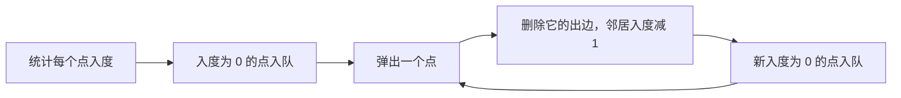
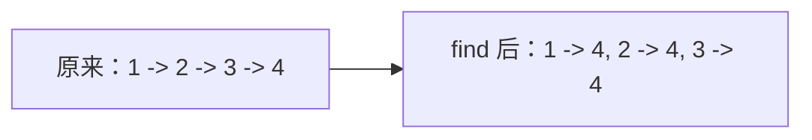

# 图论基础讲透：拓扑排序、最短路和并查集

图论题一开始会让人害怕，因为名词很多：

```text
有向图、无向图、入度、出度、环、连通分量、最短路、拓扑排序、并查集
```

但工程和刷题里最常见的图论能力，先掌握这几块就很有用：

```text
图怎么表示
DFS/BFS 怎么遍历
拓扑排序
最短路
并查集
```

---

## 1. 图怎么表示？

图由点和边组成。

常见表示方式有两种：

| 表示 | 适合场景 |
|---|---|
| 邻接表 | 点多边少，最常用 |
| 邻接矩阵 | 点少，查询两点是否相连方便 |

邻接表：

```java
List<Integer>[] graph = new ArrayList[n];
for (int i = 0; i < n; i++) {
    graph[i] = new ArrayList<>();
}

graph[0].add(1);
graph[0].add(2);
```

表示：

```text
0 -> 1
0 -> 2
```

---

## 2. 拓扑排序

拓扑排序用于有向无环图。

典型场景：课程依赖。

```text
学课程 B 之前，必须先学课程 A
A -> B
```

如果存在环，就无法完成所有课程。

### 2.1 Kahn 算法

核心思想：

```text
先找入度为 0 的点
删除它以及它发出的边
继续找新的入度为 0 的点
```



代码：

```java
boolean canFinish(int numCourses, int[][] prerequisites) {
    List<Integer>[] graph = new ArrayList[numCourses];
    for (int i = 0; i < numCourses; i++) {
        graph[i] = new ArrayList<>();
    }

    int[] indegree = new int[numCourses];

    for (int[] p : prerequisites) {
        int course = p[0];
        int pre = p[1];
        graph[pre].add(course);
        indegree[course]++;
    }

    Queue<Integer> queue = new ArrayDeque<>();
    for (int i = 0; i < numCourses; i++) {
        if (indegree[i] == 0) {
            queue.offer(i);
        }
    }

    int count = 0;
    while (!queue.isEmpty()) {
        int cur = queue.poll();
        count++;

        for (int next : graph[cur]) {
            indegree[next]--;
            if (indegree[next] == 0) {
                queue.offer(next);
            }
        }
    }

    return count == numCourses;
}
```

---

## 3. 最短路：BFS 和 Dijkstra

### 3.1 无权图最短路：BFS

如果每条边代价都一样，BFS 就能求最短路。

因为 BFS 是一层层扩散，第一次到达目标就是最短步数。

### 3.2 非负权图最短路：Dijkstra

如果边有权重，而且权重非负，用 Dijkstra。

核心思想：

```text
每次从未确定的点里，取当前距离最小的点，把它确定下来。
```

代码：

```java
int[] dijkstra(int n, List<int[]>[] graph, int start) {
    int INF = Integer.MAX_VALUE / 2;
    int[] dist = new int[n];
    Arrays.fill(dist, INF);
    dist[start] = 0;

    PriorityQueue<int[]> pq = new PriorityQueue<>((a, b) -> a[1] - b[1]);
    pq.offer(new int[]{start, 0});

    while (!pq.isEmpty()) {
        int[] cur = pq.poll();
        int node = cur[0];
        int d = cur[1];

        if (d > dist[node]) continue;

        for (int[] edge : graph[node]) {
            int next = edge[0];
            int weight = edge[1];

            if (dist[next] > dist[node] + weight) {
                dist[next] = dist[node] + weight;
                pq.offer(new int[]{next, dist[next]});
            }
        }
    }

    return dist;
}
```

Dijkstra 不能处理负权边，因为负权边可能让已经确定的点再次变短。

---

## 4. 并查集

并查集用于处理连通性问题。

典型问题：

```text
两个点是否属于同一个集合
把两个集合合并
有多少个连通分量
```

### 4.1 基础结构

```java
class UnionFind {
    private int[] parent;
    private int[] size;
    private int count;

    public UnionFind(int n) {
        parent = new int[n];
        size = new int[n];
        count = n;

        for (int i = 0; i < n; i++) {
            parent[i] = i;
            size[i] = 1;
        }
    }

    public int find(int x) {
        if (parent[x] != x) {
            parent[x] = find(parent[x]);
        }
        return parent[x];
    }

    public void union(int a, int b) {
        int rootA = find(a);
        int rootB = find(b);

        if (rootA == rootB) return;

        if (size[rootA] < size[rootB]) {
            parent[rootA] = rootB;
            size[rootB] += size[rootA];
        } else {
            parent[rootB] = rootA;
            size[rootA] += size[rootB];
        }

        count--;
    }

    public boolean connected(int a, int b) {
        return find(a) == find(b);
    }

    public int count() {
        return count;
    }
}
```

### 4.2 路径压缩

`find` 里这句非常关键：

```java
parent[x] = find(parent[x]);
```

它会把树压扁，让后续查询更快。



---

## 5. 什么时候用哪个？

| 场景 | 方法 |
|---|---|
| 有依赖顺序 | 拓扑排序 |
| 判断有向图是否能完成任务 | 拓扑排序 / DFS 判环 |
| 无权最短步数 | BFS |
| 非负权最短路 | Dijkstra |
| 动态合并集合 | 并查集 |
| 判断无向图连通分量 | DFS/BFS/并查集 |

---

## 6. 一句话总结

图论不要一开始就背很多名词。

先抓住：

```text
依赖关系：拓扑排序
最短路径：BFS 或 Dijkstra
连通关系：并查集或 DFS/BFS
```

这三类已经覆盖了大量工程和面试场景。
