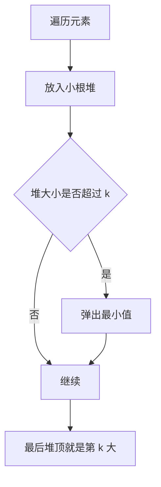

# 堆与优先队列讲透：TopK和动态最值

堆是一种能快速拿到最大值或最小值的数据结构。

在 Java 里，常用的是：

```java
PriorityQueue
```

默认是小根堆，也就是堆顶最小。

---

## 1. 堆适合解决什么问题？

堆适合这类问题：

```text
数据不断进来
每次都想快速拿到最大/最小
只关心前 K 个
多路合并
任务调度
```

复杂度：

| 操作 | 复杂度 |
|---|---|
| 插入 | `O(log n)` |
| 弹出堆顶 | `O(log n)` |
| 查看堆顶 | `O(1)` |

---

## 2. Java PriorityQueue 基础

小根堆：

```java
PriorityQueue<Integer> minHeap = new PriorityQueue<>();
```

大根堆：

```java
PriorityQueue<Integer> maxHeap = new PriorityQueue<>((a, b) -> b - a);
```

常用操作：

```java
heap.offer(x);  // 入堆
heap.poll();    // 弹出堆顶
heap.peek();    // 查看堆顶
```

---

## 3. Top K 问题

题意：找数组中第 `k` 大的元素。

思路：维护一个大小为 `k` 的小根堆。

```text
堆里始终保存当前最大的 k 个数
堆顶就是这 k 个数里最小的，也就是第 k 大
```

代码：

```java
int findKthLargest(int[] nums, int k) {
    PriorityQueue<Integer> heap = new PriorityQueue<>();

    for (int num : nums) {
        heap.offer(num);

        if (heap.size() > k) {
            heap.poll();
        }
    }

    return heap.peek();
}
```



---

## 4. 为什么第 k 大用小根堆？

因为我们只想保留最大的 `k` 个。

如果来了一个很小的数，它进堆后会很快被弹出去。

堆顶始终是“当前 Top K 里最弱的那个”。

这很适合数据流场景。

---

## 5. 合并 K 个有序链表

每个链表都是有序的，要合并成一个有序链表。

思路：每次从 K 个链表头里拿最小的节点。

```java
ListNode mergeKLists(ListNode[] lists) {
    PriorityQueue<ListNode> heap = new PriorityQueue<>((a, b) -> a.val - b.val);

    for (ListNode node : lists) {
        if (node != null) {
            heap.offer(node);
        }
    }

    ListNode dummy = new ListNode(0);
    ListNode cur = dummy;

    while (!heap.isEmpty()) {
        ListNode node = heap.poll();
        cur.next = node;
        cur = cur.next;

        if (node.next != null) {
            heap.offer(node.next);
        }
    }

    return dummy.next;
}
```

---

## 6. 数据流中位数

需要动态维护中位数。

用两个堆：

```text
大根堆 left：保存较小的一半
小根堆 right：保存较大的一半
```

保证：

```text
left.size() == right.size()
或者 left.size() == right.size() + 1
```

代码：

```java
class MedianFinder {
    private PriorityQueue<Integer> left = new PriorityQueue<>((a, b) -> b - a);
    private PriorityQueue<Integer> right = new PriorityQueue<>();

    public void addNum(int num) {
        if (left.isEmpty() || num <= left.peek()) {
            left.offer(num);
        } else {
            right.offer(num);
        }

        if (left.size() > right.size() + 1) {
            right.offer(left.poll());
        } else if (right.size() > left.size()) {
            left.offer(right.poll());
        }
    }

    public double findMedian() {
        if (left.size() == right.size()) {
            return (left.peek() + right.peek()) / 2.0;
        }
        return left.peek();
    }
}
```

---

## 7. 堆和排序怎么选？

| 场景 | 建议 |
|---|---|
| 一次性全部排序 | 排序 |
| 只要 Top K | 堆 |
| 数据流不断加入 | 堆 |
| 每次要动态最大/最小 | 堆 |
| K 很小，N 很大 | 堆很合适 |

---

## 8. 一句话总结

堆适合处理动态最值：

```text
不断有数据进来，但你只关心当前最大、最小或 Top K。
```

遇到 Top K、合并多个有序结构、数据流中位数，优先想到堆。

---

## 9. 堆容易踩的坑

### 9.1 比较器溢出

很多代码喜欢写：

```java
(a, b) -> b - a
```

如果数字很大，可能整数溢出。更稳妥：

```java
(a, b) -> Integer.compare(b, a)
```

### 9.2 堆里对象被修改

如果堆里放的是对象，入堆后不要随便修改参与比较的字段。否则堆不会自动重排，可能导致顺序错误。

### 9.3 删除任意元素不高效

`PriorityQueue` 擅长删除堆顶，不擅长删除任意元素。需要频繁删除任意元素时，可能要配合哈希表做延迟删除，或者换 TreeMap / TreeSet。

---

## 10. 堆和 TreeMap 的区别

| 数据结构 | 优点 | 缺点 |
|---|---|---|
| 堆 | 快速拿最大/最小，常数小 | 不擅长删除任意元素，不支持有序遍历 |
| TreeMap/TreeSet | 支持有序、前驱后继、删除任意元素 | 常数更大，实现更复杂 |

如果只需要不断取最大/最小，用堆。

如果还需要删除任意值、找前驱后继，用有序集合。

---

## 11. 再看一个调度场景

比如有一批任务，每个任务有处理时间。想让总等待时间尽量小，通常会优先处理耗时短的任务。

这类“每次取当前最小耗时任务”的场景，可以用小根堆动态维护。

```java
int processTasks(int[] tasks) {
    PriorityQueue<Integer> heap = new PriorityQueue<>();
    for (int task : tasks) {
        heap.offer(task);
    }

    int time = 0;
    int totalWait = 0;

    while (!heap.isEmpty()) {
        int task = heap.poll();
        totalWait += time;
        time += task;
    }

    return totalWait;
}
```

这类题和贪心也有关：每次取最短任务，可以减少后面任务的累计等待。
