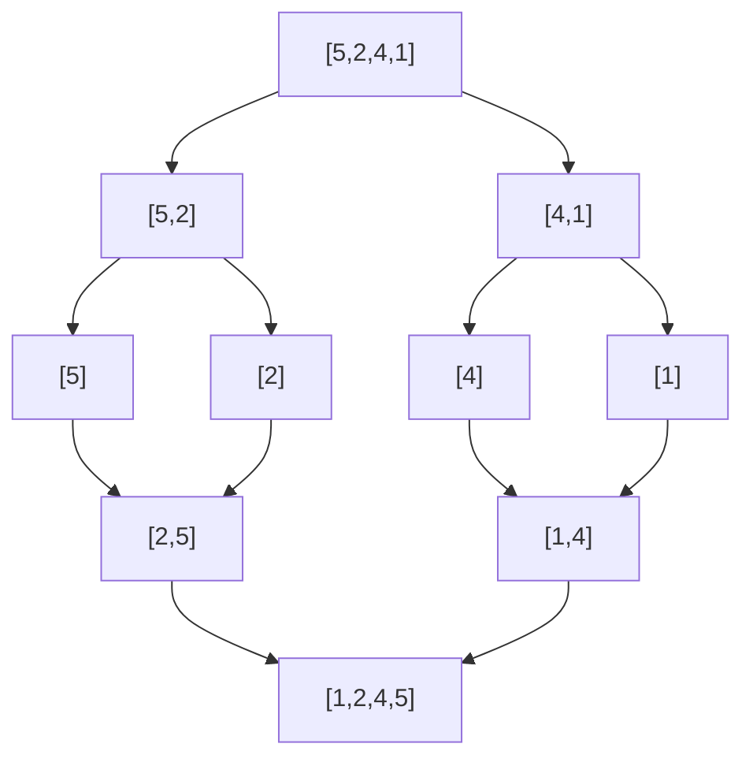

# 排序与分治讲透：归并、快排和逆序对

排序不只是把数组排好。很多算法思想都藏在排序里，尤其是分治。

分治的核心是：

```text
把大问题拆成小问题，分别解决，再合并答案。
```

最经典的两个排序：

```text
归并排序
快速排序
```

---

## 1. 归并排序

归并排序的思路：

```text
先把数组分成两半
分别排序
再把两个有序数组合并
```



代码：

```java
void mergeSort(int[] nums) {
    int[] temp = new int[nums.length];
    sort(nums, 0, nums.length - 1, temp);
}

void sort(int[] nums, int left, int right, int[] temp) {
    if (left >= right) return;

    int mid = left + (right - left) / 2;
    sort(nums, left, mid, temp);
    sort(nums, mid + 1, right, temp);
    merge(nums, left, mid, right, temp);
}

void merge(int[] nums, int left, int mid, int right, int[] temp) {
    int i = left;
    int j = mid + 1;
    int k = left;

    while (i <= mid && j <= right) {
        if (nums[i] <= nums[j]) {
            temp[k++] = nums[i++];
        } else {
            temp[k++] = nums[j++];
        }
    }

    while (i <= mid) temp[k++] = nums[i++];
    while (j <= right) temp[k++] = nums[j++];

    for (int p = left; p <= right; p++) {
        nums[p] = temp[p];
    }
}
```

复杂度：

```text
时间 O(n log n)
空间 O(n)
```

---

## 2. 快速排序

快排的思路：

```text
选一个基准值 pivot
把小于 pivot 的放左边
大于 pivot 的放右边
再递归处理左右两边
```

代码：

```java
void quickSort(int[] nums) {
    quickSort(nums, 0, nums.length - 1);
}

void quickSort(int[] nums, int left, int right) {
    if (left >= right) return;

    int pivotIndex = partition(nums, left, right);
    quickSort(nums, left, pivotIndex - 1);
    quickSort(nums, pivotIndex + 1, right);
}

int partition(int[] nums, int left, int right) {
    int pivot = nums[right];
    int i = left;

    for (int j = left; j < right; j++) {
        if (nums[j] <= pivot) {
            swap(nums, i, j);
            i++;
        }
    }

    swap(nums, i, right);
    return i;
}

void swap(int[] nums, int i, int j) {
    int temp = nums[i];
    nums[i] = nums[j];
    nums[j] = temp;
}
```

快排平均 `O(n log n)`，最坏 `O(n^2)`。

实际中通常会随机选 pivot，降低最坏情况概率。

---

## 3. 归并和快排怎么选？

| 对比 | 归并排序 | 快速排序 |
|---|---|---|
| 平均时间 | `O(n log n)` | `O(n log n)` |
| 最坏时间 | `O(n log n)` | `O(n^2)` |
| 额外空间 | `O(n)` | 平均 `O(log n)` |
| 稳定性 | 稳定 | 通常不稳定 |
| 链表排序 | 很适合 | 不太适合 |

---

## 4. 分治不只是排序：逆序对

逆序对：如果 `i < j` 且 `nums[i] > nums[j]`，就是一个逆序对。

暴力是 `O(n^2)`。

可以用归并排序统计。

当左右两边都已经有序时，如果：

```text
nums[i] > nums[j]
```

因为左边从 `i` 到 `mid` 都大于 `nums[j]`，所以一下子贡献：

```text
mid - i + 1
```

代码：

```java
int reversePairs(int[] nums) {
    int[] temp = new int[nums.length];
    return mergeCount(nums, 0, nums.length - 1, temp);
}

int mergeCount(int[] nums, int left, int right, int[] temp) {
    if (left >= right) return 0;

    int mid = left + (right - left) / 2;
    int count = mergeCount(nums, left, mid, temp)
        + mergeCount(nums, mid + 1, right, temp);

    int i = left;
    int j = mid + 1;
    int k = left;

    while (i <= mid && j <= right) {
        if (nums[i] <= nums[j]) {
            temp[k++] = nums[i++];
        } else {
            count += mid - i + 1;
            temp[k++] = nums[j++];
        }
    }

    while (i <= mid) temp[k++] = nums[i++];
    while (j <= right) temp[k++] = nums[j++];

    for (int p = left; p <= right; p++) {
        nums[p] = temp[p];
    }

    return count;
}
```

---

## 5. 分治类题的特征

看到这些特征，可以想分治：

| 特征 | 例子 |
|---|---|
| 可以拆成左右两半 | 排序、最大子数组 |
| 左右答案能合并 | 归并、逆序对 |
| 要找第 k 大 | 快排 partition |
| 子问题结构相同 | 递归天然适合 |

---

## 6. 一句话总结

排序题不只是排序。

归并排序教你：

```text
先解决左右子问题，再合并答案。
```

快速排序教你：

```text
通过一次 partition 把问题规模缩小。
```

分治思想在很多高级题里都会出现。
