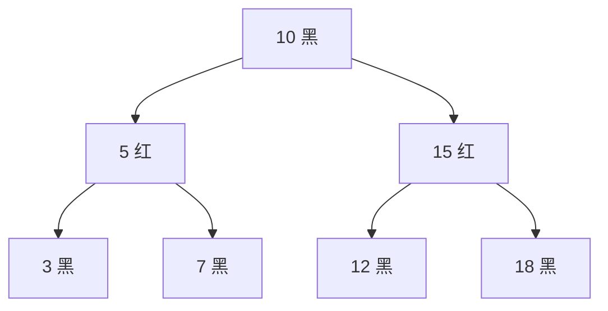
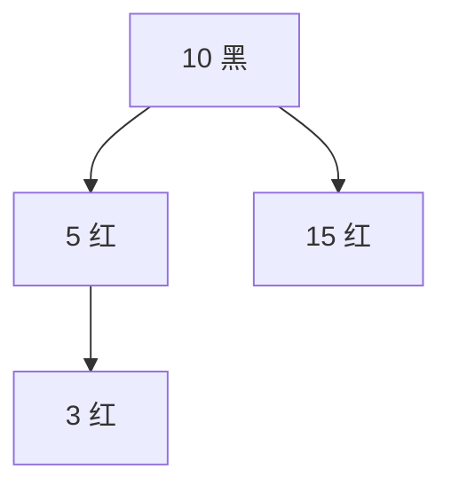
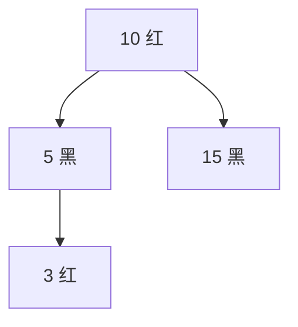
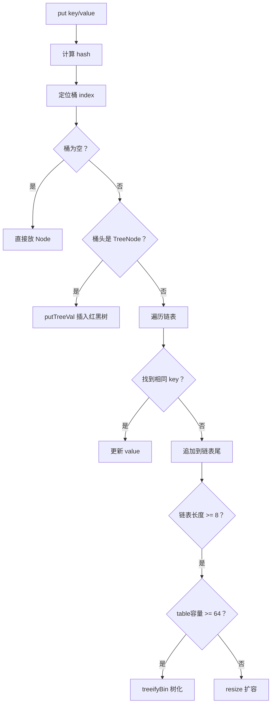
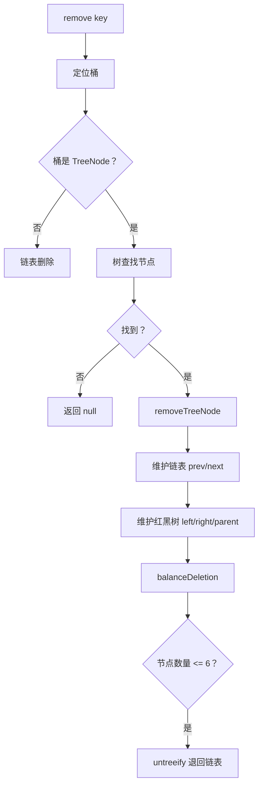

# 红黑树彻底入门：从原理到插入、删除、HashMap 中的红黑树实现

> 本文由内部知识库文档整理为 GitHub 可直接阅读的 Markdown。已移除原始内部链接、附件直链、账号标识、组织域名等公司相关信息。
> 图片目录为 `image/`，附件目录为 `file/`；本篇未导出独立图片/附件。嵌入表格已转为 Markdown；只读绘图块因接口未返回图形数据，已保留待补占位。

你可以把红黑树理解成一句话：

> *红黑树是一棵“差不多平衡”的二叉搜索树，它通过给节点染红/黑色，再配合旋转，保证树不会退化成链表。*

它没有 AVL 树那么严格平衡，但插入、删除、查询都可以稳定保持：

```java
O(log n)
```

Java HashMap 在链表过长时，会把链表转成红黑树，目的就是：

> *防止哈希冲突严重时，查询从 O(n) 退化，使用红黑树后可以变成 O(log n)。*

## 1、为什么需要红黑树？

先看普通二叉搜索树。

假设你依次插入：

```java
1, 2, 3, 4, 5, 6, 7
```

普通 BST 会变成这样：

```java
1
 \
  2
   \
    3
     \
      4
       \
        5
         \
          6
           \
            7
```

这就退化成链表了。

查询 7 的复杂度是：

```java
O(n)
```

这不是我们想要的。

所以我们希望树尽量长这样：

```java
        4
      /   \
     2     6
    / \   / \
   1   3 5   7
```

查询复杂度就是：

```java
O(log n)
```

红黑树的意义就是：

> *在每次插入、删除后，通过染色和旋转，让树保持大致平衡。*

## 2、红黑树的五条核心性质

红黑树是一棵二叉搜索树，同时满足以下规则。

### 2.1 每个节点不是红色就是黑色

```java
RED 或 BLACK
```

### 2.2 根节点一定是黑色

```java
root.color = BLACK
```

### 2.3 所有叶子 NIL 节点都是黑色

这里的叶子不是我们平时说的普通叶子节点，而是空节点 null，也叫 NIL 节点。

示意：

```java
    10B
   /   \
 null  null
```

这两个 null 在红黑树逻辑中被认为是黑色。

### 2.4 红色节点不能连续

也就是说：

```java
红节点的父节点不能是红色
红节点的子节点也不能是红色
```

不允许：

```java
    10R
   /
  5R
```

允许：

```java
    10B
   /
  5R
```

这条规则非常重要。

### 2.5 从任意节点到其所有叶子 NIL 节点的黑色节点数量相同

这叫：

```java
black-height 黑高
```

例如：

```java
        10B
       /   \
     5R     15R
    / \     /  \
  3B  7B  12B  18B
```

从 10 到所有 null 叶子路径上的黑色节点数量是一样的。

这条规则保证树不会一边特别长、一边特别短。

最关键的是这两条：

```java
红色不能连着红色
每条路径黑色数量一样
```

这两个规则保证树不会太歪。

## 3、一个正常红黑树长这样



它满足：

- 根节点是黑色；
- 红色节点 5 和 15 的子节点都是黑色；
- 从根到每个 null 叶子的黑色数量一致。

## 4、红黑树为什么能保持平衡？

因为红黑树限制了：

> *最长路径不会超过最短路径的 2 倍。*

为什么？

因为：

- 红色节点不能连续；
- 所以最长路径最多是黑红黑红黑红；
- 最短路径全是黑色；
- 因此最长路径最多约等于最短路径 2 倍。

所以红黑树不是绝对平衡树，而是 弱平衡树。

对比一下：


| 树 | 平衡程度 | 插入删除成本 |
| --- | --- | --- |
| AVL 树 | 更严格 | 调整更频繁 |
| 红黑树 | 相对宽松 | 插入删除更快 |
| 普通 BST | 不保证 | 可能退化 |
| B+ 树 | 多路平衡 | 常用于数据库、文件系统 |


Java TreeMap、HashMap 树化桶使用红黑树，就是因为它在工程上插入删除性能比较均衡。

## 5、红黑树的核心操作：旋转

红黑树调整结构主要靠两个动作：

```java
左旋
右旋
```

### 5.1 左旋

左旋的直觉：

> *让右孩子上位，自己变成右孩子的左孩子。*

左旋前：

```java
    x
     \
      y
     / \
    T2 T3
```

左旋后：

```java
      y
     / \
    x   T3
     \
      T2
```

代码逻辑：

```java
void rotateLeft(Node x) {
    Node y = x.right;        // y 是 x 的右孩子

    x.right = y.left;        // y 的左子树，变成 x 的右子树
    if (y.left != null) {
        y.left.parent = x;
    }

    y.parent = x.parent;     // y 接替 x 的位置

    if (x.parent == null) {
        root = y;
    } else if (x == x.parent.left) {
        x.parent.left = y;
    } else {
        x.parent.right = y;
    }

    y.left = x;              // x 变成 y 的左孩子
    x.parent = y;
}
```

### 5.2 右旋

右旋的直觉：

> *让左孩子上位，自己变成左孩子的右孩子。*

右旋前：

```java
      x
     /
    y
   / \
  T1 T2
```

右旋后：

```java
    y
   / \
  T1  x
     /
    T2
```

代码逻辑：

```java
void rotateRight(Node x) {
    Node y = x.left;         // y 是 x 的左孩子

    x.left = y.right;        // y 的右子树，变成 x 的左子树
    if (y.right != null) {
        y.right.parent = x;
    }

    y.parent = x.parent;     // y 接替 x 的位置

    if (x.parent == null) {
        root = y;
    } else if (x == x.parent.right) {
        x.parent.right = y;
    } else {
        x.parent.left = y;
    }

    y.right = x;             // x 变成 y 的右孩子
    x.parent = y;
}
```

## 6、红黑树插入逻辑

### 6.1 插入分两步

红黑树插入不是直接乱插，而是：

```java
第一步：按照普通二叉搜索树规则插入
第二步：把新节点标红，然后修复红黑树规则
```

为什么新节点默认是红色？

因为如果新节点是黑色，会直接影响某条路径的黑色数量，容易破坏规则 5。

新节点用红色，只可能破坏：

```java
红色不能连续
```

这个问题比较容易修。

### 6.2 插入伪代码

```java
void put(int key) {
    Node node = bstInsert(key);
    node.red = true;
    fixAfterInsertion(node);
    root.red = false;
}
```

## 7、插入修复的核心场景

插入新节点后，只需要关注：

```java
当前节点 node
父节点 parent
祖父节点 grand
叔叔节点 uncle
```

图示：

```java
        grand
       /     \
   parent   uncle
     /
   node
```

### 7.1 情况一：父节点是黑色

这种最简单。

```java
父节点黑色，新插入红色，不违反规则
```

不用调整。

```java
if (parent is black) {
    return;
}
```

### 7.2 情况二：父节点是红色，叔叔也是红色

例如：





这里出现了：

```java
5 红
3 红
```

红红冲突。

修复方式：

```java
父节点变黑
叔叔节点变黑
祖父节点变红
然后继续把祖父节点当作新节点向上修复
```

变成：





为什么要继续向上修？

因为祖父节点变红后，可能和它的父节点又产生红红冲突。

代码：

```java
if (isRed(uncle)) {
    parent.red = false;
    uncle.red = false;
    grand.red = true;
    node = grand;
    continue;
}
```

### 7.3 情况三：父节点红，叔叔黑，形成 LL

结构：

```java
        grand 黑
        /
    parent 红
      /
   node 红
```

也就是：

```java
左左
```

修复方式：

```java
父节点变黑
祖父节点变红
对祖父节点右旋
```

图：

```java
修复前：

        10黑
       /
     5红
    /
  3红

修复后：

       5黑
      /   \
    3红   10红
```

代码：

```java
parent.red = false;
grand.red = true;
rotateRight(grand);
```

### 7.4 情况四：父节点红，叔叔黑，形成 LR

结构：

```java
        grand 黑
        /
    parent 红
        \
        node 红
```

也就是：

```java
左右
```

这种要先转换成 LL。

修复方式：

```java
先对 parent 左旋
再按 LL 处理
```

图：

```java
修复前：

        10黑
       /
     5红
       \
        7红

先左旋 5：

        10黑
       /
     7红
    /
  5红

再右旋 10：

       7黑
      /   \
    5红   10红
```

代码：

```java
if (node == parent.right) {
    rotateLeft(parent);
    Node tmp = parent;
    parent = node;
    node = tmp;
}

parent.red = false;
grand.red = true;
rotateRight(grand);
```

### 7.5 RR 和 RL 是对称情况

如果父节点是祖父节点的右孩子：

#### RR

```java
    grand 黑
         \
        parent 红
             \
             node 红
```

处理：

```java
parent 变黑
grand 变红
对 grand 左旋
```

#### RL

```java
    grand 黑
         \
        parent 红
        /
      node 红
```

处理：

```java
先对 parent 右旋
再对 grand 左旋
```

## 8、插入修复完整代码

下面是接近 Java TreeMap / HashMap 红黑树风格的伪代码：

```java
void fixAfterInsertion(Node x) {
    x.red = true;

    while (x != null && x != root && isRed(parentOf(x))) {
        Node parent = parentOf(x);
        Node grand = parentOf(parent);

        if (parent == grand.left) {
            Node uncle = grand.right;

            // 情况 1：叔叔是红色
            if (isRed(uncle)) {
                setBlack(parent);
                setBlack(uncle);
                setRed(grand);
                x = grand;
            } else {
                // 情况 2：LR，先左旋父节点
                if (x == parent.right) {
                    x = parent;
                    rotateLeft(x);
                    parent = parentOf(x);
                    grand = parentOf(parent);
                }

                // 情况 3：LL，右旋祖父节点
                setBlack(parent);
                setRed(grand);
                rotateRight(grand);
            }
        } else {
            // 对称情况：parent 是 grand 的右孩子
            Node uncle = grand.left;

            if (isRed(uncle)) {
                setBlack(parent);
                setBlack(uncle);
                setRed(grand);
                x = grand;
            } else {
                // RL
                if (x == parent.left) {
                    x = parent;
                    rotateRight(x);
                    parent = parentOf(x);
                    grand = parentOf(parent);
                }

                // RR
                setBlack(parent);
                setRed(grand);
                rotateLeft(grand);
            }
        }
    }

    root.red = false;
}
```

## 9、红黑树删除逻辑为什么更难？

插入只会破坏：

```java
红红冲突
```

删除可能破坏：

```java
黑色高度一致
```

也就是规则 5。

比如你删掉一个黑色节点，某条路径少了一个黑色节点。

这个问题比红红冲突更麻烦。

## 10、删除节点的基本流程

红黑树删除分三步：

```java
1. 按普通二叉搜索树规则找到要删除的节点
2. 如果它有两个孩子，用后继节点替换
3. 真正删除一个最多只有一个孩子的节点
4. 如果破坏黑色平衡，做删除修复
```

## 11、为什么两个孩子的节点不能直接删？

例如：

```java
        10
       /  \
      5    15
          /  \
         12   18
```

如果删除 15，直接删会断掉左右子树。

普通 BST 的做法是：

> *找右子树中最小节点，也就是后继节点，替换自己。*

15 的后继是 18？不对，是右子树最左节点。

如果是：

```java
        15
       /  \
      12   18
          /
         16
```

那么 15 的后继是 16。

后继节点有一个特点：

```java
它最多只有一个右孩子
```

所以最终删除问题会被转换成：

```java
删除一个最多只有一个孩子的节点
```

## 12、删除时分颜色讨论

### 12.1 删除红色叶子节点

最简单。

```java
红色叶子删掉，不影响黑色高度
```

直接删。

### 12.2 删除黑色节点，且有一个红色孩子

比如：

```java
    10黑
    /
  5红
```

删除 10黑 后，让 5红 顶上来，并染黑。

```java
5黑
```

这样黑色高度不变。

### 12.3 删除黑色叶子节点

最麻烦。

因为某条路径少了一个黑色节点。

这时会产生一个概念：

```java
double black，双重黑
```

它不是节点真实颜色，而是一种“这条路径少黑色”的状态。

修复删除就是在处理这个 double black。

## 13、删除修复的核心角色

删除修复关注：

```java
x：当前需要修复的位置
parent：x 的父节点
sibling：x 的兄弟节点
```

图：

```java
        parent
       /      \
      x      sibling
```

假设 x 是左孩子，sibling 是右孩子。

如果 x 是右孩子，所有逻辑左右对称。

## 14、删除修复情况一：兄弟是红色

结构：

```java
        parent 黑
       /      \
     x黑      sibling 红
              /       \
          left黑      right黑
```

兄弟是红色，说明父节点一定是黑色，兄弟的两个孩子一定是黑色。

处理方式：

```java
兄弟变黑
父节点变红
对父节点左旋
```

目的：

> *把红兄弟变成黑兄弟场景。*

图：

```java
修复前：

        P黑
       /   \
     X双黑  S红
           /  \
         SL黑 SR黑

左旋 P 后：

          S黑
         /   \
       P红   SR黑
      /  \
   X双黑 SL黑
```

代码：

```java
if (isRed(sibling)) {
    setBlack(sibling);
    setRed(parent);
    rotateLeft(parent);
    sibling = parent.right;
}
```

注意：

> *这个情况处理完，问题并没有结束，只是转成了兄弟为黑色的情况。*

## 15、删除修复情况二：兄弟黑，兄弟两个孩子也黑

结构：

```java
        parent ?
       /       \
    x双黑      sibling黑
              /       \
           黑/null    黑/null
```

处理方式：

```java
兄弟变红
x 上移到 parent
```

为什么？

因为兄弟那边黑色太多，我们把兄弟变红，相当于兄弟路径少一个黑色，让两边平衡。

但是这样 parent 所在路径可能又少黑，所以继续向上修。

代码：

```java
if (isBlack(sibling.left) && isBlack(sibling.right)) {
    setRed(sibling);
    x = parent;
}
```

如果 parent 原来是红色，则把 parent 变黑即可结束。

## 16、删除修复情况三：兄弟黑，近侄子红，远侄子黑

假设 x 是左孩子，那么：

```java
sibling 是右孩子
sibling.left 是近侄子
sibling.right 是远侄子
```

结构：

```java
        parent ?
       /       \
    x双黑      sibling黑
              /
          near红
```

处理方式：

```java
近侄子变黑
兄弟变红
对兄弟右旋
```

目的是把情况三转成情况四。

图：

```java
修复前：

        P
       / \
      X   S黑
         /
       N红

右旋 S：

        P
       / \
      X   N黑
           \
            S红
```

代码：

```java
if (isBlack(sibling.right)) {
    setBlack(sibling.left);
    setRed(sibling);
    rotateRight(sibling);
    sibling = parent.right;
}
```

## 17、删除修复情况四：兄弟黑，远侄子红

结构：

```java
        parent ?
       /       \
    x双黑      sibling黑
                    \
                    far红
```

处理方式：

```java
兄弟继承父节点颜色
父节点变黑
远侄子变黑
对父节点左旋
修复结束
```

代码：

```java
sibling.red = parent.red;
setBlack(parent);
setBlack(sibling.right);
rotateLeft(parent);
x = root;
```

为什么可以结束？

因为旋转和变色后，所有路径黑色数量恢复一致。

## 18、删除修复完整伪代码

假设 x 是被替换上来的节点，或者是空位。

```java
void fixAfterDeletion(Node x) {
    while (x != root && isBlack(x)) {
        if (x == parentOf(x).left) {
            Node sibling = parentOf(x).right;

            // 情况 1：兄弟是红色
            if (isRed(sibling)) {
                setBlack(sibling);
                setRed(parentOf(x));
                rotateLeft(parentOf(x));
                sibling = parentOf(x).right;
            }

            // 情况 2：兄弟黑，两个孩子都黑
            if (isBlack(leftOf(sibling)) && isBlack(rightOf(sibling))) {
                setRed(sibling);
                x = parentOf(x);
            } else {
                // 情况 3：兄弟黑，远侄子黑，近侄子红
                if (isBlack(rightOf(sibling))) {
                    setBlack(leftOf(sibling));
                    setRed(sibling);
                    rotateRight(sibling);
                    sibling = parentOf(x).right;
                }

                // 情况 4：兄弟黑，远侄子红
                sibling.red = parentOf(x).red;
                setBlack(parentOf(x));
                setBlack(rightOf(sibling));
                rotateLeft(parentOf(x));
                x = root;
            }
        } else {
            // 对称逻辑：x 是右孩子
            Node sibling = parentOf(x).left;

            if (isRed(sibling)) {
                setBlack(sibling);
                setRed(parentOf(x));
                rotateRight(parentOf(x));
                sibling = parentOf(x).left;
            }

            if (isBlack(rightOf(sibling)) && isBlack(leftOf(sibling))) {
                setRed(sibling);
                x = parentOf(x);
            } else {
                if (isBlack(leftOf(sibling))) {
                    setBlack(rightOf(sibling));
                    setRed(sibling);
                    rotateLeft(sibling);
                    sibling = parentOf(x).left;
                }

                sibling.red = parentOf(x).red;
                setBlack(parentOf(x));
                setBlack(leftOf(sibling));
                rotateRight(parentOf(x));
                x = root;
            }
        }
    }

    setBlack(x);
}
```

## 19、删除逻辑总流程代码

```java
void delete(Node p) {
    if (p == null) {
        return;
    }

    // 如果 p 有两个孩子，找后继节点替换
    if (p.left != null && p.right != null) {
        Node s = successor(p);
        p.key = s.key;
        p.value = s.value;
        p = s;
    }

    // 到这里，p 最多只有一个孩子
    Node replacement = p.left != null ? p.left : p.right;

    if (replacement != null) {
        // p 有一个孩子
        replacement.parent = p.parent;

        if (p.parent == null) {
            root = replacement;
        } else if (p == p.parent.left) {
            p.parent.left = replacement;
        } else {
            p.parent.right = replacement;
        }

        p.left = p.right = p.parent = null;

        // 如果删除的是黑色节点，需要修复
        if (isBlack(p)) {
            fixAfterDeletion(replacement);
        }
    } else if (p.parent == null) {
        // 删除的是根节点，且没有孩子
        root = null;
    } else {
        // p 是叶子节点
        if (isBlack(p)) {
            fixAfterDeletion(p);
        }

        if (p.parent != null) {
            if (p == p.parent.left) {
                p.parent.left = null;
            } else if (p == p.parent.right) {
                p.parent.right = null;
            }
            p.parent = null;
        }
    }
}
```

## 20、红黑树的修改逻辑

这里要分两种情况。

### 20.1 修改 value

如果只是修改 value：

```java
map.put(existingKey, newValue);
```

树结构不变。

因为红黑树排序依赖的是：

```java
key 或 hash
```

不是 value。

所以修改 value 很简单：

```java
Node node = find(key);
if (node != null) {
    node.value = newValue;
}
```

不会触发旋转，不会触发变色。

### 20.2 修改 key

如果你修改了 key，问题就严重了。

因为树的结构是按照 key 排序的。

比如原来：

```java
      10
     /  \
    5    20
```

你把 5 改成 30，树就错了：

```java
      10
     /  \
    30   20
```

这已经不满足二叉搜索树规则了。

所以正确做法是：

```java
先删除旧 key
再插入新 key
```

代码：

```java
V value = map.remove(oldKey);
map.put(newKey, value);
```

在 HashMap 中更要注意：

> 不要修改已经作为 HashMap key 的对象字段，尤其是参与 hashCode / equals 的字段。

否则会出现：

```java
map.put(user, "A");

user.id = 10086;

map.get(user); // 可能取不到
```

这是 HashMap 和红黑树都非常经典的坑。

## 21、HashMap 为什么需要红黑树？

Java 8 之后，HashMap 桶内元素太多时，会从链表转成红黑树。

普通情况下：

```java
数组 + 链表
```

结构：

```java
table[index] -> node1 -> node2 -> node3
```

如果大量 key hash 冲突，会变成很长的链表。

查找复杂度：

```java
O(n)
```

极端情况下很慢。

树化后：

```java
table[index] -> 红黑树 root
```

查找复杂度变成：

```java
O(log n)
```

## 22、HashMap 树化条件

JDK 8 HashMap 里有几个关键常量：

```sql
static final int TREEIFY_THRESHOLD = 8;
static final int UNTREEIFY_THRESHOLD = 6;
static final int MIN_TREEIFY_CAPACITY = 64;
```

含义：


| 常量 | 含义 |
| --- | --- |
| TREEIFY_THRESHOLD = 8 | 桶内节点数量达到 8，考虑树化 |
| UNTREEIFY_THRESHOLD = 6 | 树节点数量降到 6，退化为链表 |
| MIN_TREEIFY_CAPACITY = 64 | table 容量至少 64 才树化 |


为什么容量小于 64 不树化？

因为桶冲突多可能是数组太小导致的。

此时优先：

```java
扩容
```

而不是：

```java
树化
```

## 23、HashMap 中的红黑树节点结构

JDK 8 里类似这样

```java
static final class TreeNode<K,V> extends LinkedHashMap.Entry<K,V> {
    TreeNode<K,V> parent;
    TreeNode<K,V> left;
    TreeNode<K,V> right;
    TreeNode<K,V> prev;
    boolean red;
}
```

它比普通 Node 多了：

```java
parent
left
right
prev
red
```

其中：

- left/right/parent 用于红黑树；
- prev/next 用于保持桶内链表关系；
- red 是红黑树颜色。

这点很重要：

> **HashMap 桶内树节点不只是树，它还保留链表关系。**

## 24、HashMap 红黑树怎么比较大小？

普通 TreeMap 可以直接用 key 比较：

```java
Comparable
Comparator
```

但是 HashMap 的红黑树桶比较特殊。

它先按：

```java
hash 值
```

比较。

逻辑大概是：

```java
if (h < node.hash) {
    go left;
} else if (h > node.hash) {
    go right;
} else {
    // hash 一样，再判断 equals
}
```

如果 hash 相等：

1. 先用 `equals` 判断是不是同一个 key；
2. 如果 key 实现了 `Comparable`，用 `compareTo`；
3. 如果还不能比较，用 `tieBreakOrder` 强行给一个稳定方向。

伪代码：

```python
int dir;

if (hash < p.hash) {
    dir = -1;
} else if (hash > p.hash) {
    dir = 1;
} else if (Objects.equals(key, p.key)) {
    return p;
} else if (key instanceof Comparable) {
    dir = compare(key, p.key);
} else {
    dir = tieBreakOrder(key, p.key);
}
```

tieBreakOrder 一般会基于类名、identityHashCode 做兜底。

原因是：

> 红黑树必须决定一个节点往左还是往右放。

哪怕两个 key hash 一样，又无法比较，也必须给出一个方向。

## 25、HashMap put 时的红黑树逻辑

整体流程：





## 26、HashMap 红黑树插入的核心：putTreeVal

简化版本：

```python
TreeNode<K,V> putTreeVal(HashMap<K,V> map, Node<K,V>[] tab,
                         int h, K k, V v) {
    TreeNode<K,V> root = root();

    for (TreeNode<K,V> p = root;;) {
        int dir;
        K pk = p.key;

        if (h < p.hash) {
            dir = -1;
        } else if (h > p.hash) {
            dir = 1;
        } else if (Objects.equals(k, pk)) {
            return p; // 找到已有节点，后面更新 value
        } else {
            dir = tieBreakOrder(k, pk);
        }

        TreeNode<K,V> xp = p;

        if ((p = (dir <= 0) ? p.left : p.right) == null) {
            TreeNode<K,V> x = new TreeNode<>(h, k, v, null);
            x.parent = xp;

            if (dir <= 0) {
                xp.left = x;
            } else {
                xp.right = x;
            }

            // 插入后修复红黑树
            root = balanceInsertion(root, x);

            // 把 root 移动到桶头
            moveRootToFront(tab, root);

            return null;
        }
    }
}
```

重点：

```java
HashMap 插入树节点后，也要 balanceInsertion
```

也就是执行红黑树插入修复。

## 27、HashMap 为什么要 moveRootToFront？

HashMap 的桶数组 table[index] 指向桶内第一个节点。

树化后，为了查找效率，JDK 会尽量保证：

```java
桶头节点是红黑树 root
```

所以有：

```java
moveRootToFront(tab, root);
```

否则 table[index] 指向的可能不是 root，查找树时还要先找 root。

## 28、HashMap 删除红黑树节点

HashMap 删除时，如果桶是红黑树，会走类似：

```java
removeTreeNode(map, tab, movable)
```

它会做几件事：

```java
1. 从链表关系中摘除节点
2. 从红黑树关系中删除节点
3. 做红黑树删除平衡
4. 如果节点太少，退化成链表
```

流程：





## 29、HashMap resize 时红黑树怎么处理？

这是很多人忽略的重点。

HashMap 扩容时，不是简单重新 hash 所有节点。

JDK 8 利用一个特性：

```java
新容量 = 旧容量 * 2
```

每个节点扩容后，要么留在原 index，要么移动到：

```java
oldIndex + oldCapacity
```

判断方式：

```java
if ((node.hash & oldCap) == 0) {
    留在低位链 lo
} else {
    移到高位链 hi
}
```

对于红黑树桶，也会拆成两组：

```java
lo tree/list
hi tree/list
```

如果拆完后数量少于等于 6，就退化为链表。

否则继续保持红黑树。

## 30、红黑树和 HashMap 的关系总结


| 操作 | HashMap 普通桶 | HashMap 树化桶 |
| --- | --- | --- |
| 查找 | 遍历链表 | 红黑树查找 |
| 插入 | 链表尾插 | 红黑树插入 + 平衡 |
| 删除 | 链表摘除 | 红黑树删除 + 平衡 |
| 更新 value | 找到节点改 value | 找到树节点改 value |
| 扩容 | 链表拆分 | 树拆分，可能退化 |
| 复杂度 | O(n) | O(log n) |


## 31、一个完整的红黑树插入例子

插入：

```java
10, 5, 15, 3, 1
```

**插入 10**

新节点默认红色，但根必须黑色：

```java
10黑
```

**插入 5**

```java
    10黑
   /
 5红
```

父节点黑色，不用调整。

**插入 15**

```java
    10黑
   /    \
 5红    15红
```

也没问题。

插入 3

```java
      10黑
     /    \
   5红    15红
  /
3红
```

出现红红冲突：

```java
5红 - 3红
```

叔叔 15 是红色。

处理：

```java
5 变黑
15 变黑
10 变红
根节点再变黑
```

结果：

```java
      10黑
     /    \
   5黑    15黑
  /
3红
```

**插入 1**

```java
      10黑
     /    \
   5黑    15黑
  /
3红
/
1红
```

出现红红冲突：

```java
3红 - 1红
```

叔叔是 null，视为黑色。

这是 LL 情况。

处理：

```java
3 变黑
5 变红
对 5 右旋
```

结果：

```java
      10黑
     /    \
   3黑    15黑
  /  \
1红  5红
```

## 32、一个完整的删除例子

假设有树：

```java
        10黑
       /    \
     5黑    15黑
    /  \       \
  3红  7红     18红
```

删除 3红：

```java
3 是红色叶子
```

直接删，不需要修复：

```java
        10黑
       /    \
     5黑    15黑
       \       \
       7红     18红
```

如果删除的是黑色叶子，比如删除 `5黑`，就可能破坏黑色高度，需要复杂修复。

所以你可以记：

```java
删红色通常简单
删黑色通常麻烦
```

## 33、红黑树代码最容易写错的地方

### 33.1 旋转时忘记更新 parent

错误示例：

```java
x.right = y.left;
y.left = x;
```

但忘了：

```java
y.parent = x.parent;
x.parent = y;
```

这会导致树结构表面看起来对，但向上查找错乱。

### 33.2 根节点忘记染黑

插入修复最后一定要：

```java
root.red = false;
```

否则根可能变红。

### 33.3 null 节点颜色判断错误

红黑树中：

```java
null 视为黑色
```

所以代码一般要这样写：

```java
boolean isBlack(Node node) {
    return node == null || !node.red;
}
```

不能直接：

```java
!node.red
```

否则空指针。

### 33.4 删除时没有处理后继节点

有两个孩子的节点不能直接删。

必须先找后继：

```java
Node s = successor(p);
p.key = s.key;
p.value = s.value;
p = s;
```

然后删除后继节点。

### 33.5 HashMap 中 key 被修改

这是业务中非常常见的坑：

```sql
User user = new User(1);
map.put(user, "A");

user.id = 2;

map.get(user); // 可能 null
```

如果 id 参与 hashCode 或 equals，HashMap 结构就错了。

## 34、红黑树的时间复杂度


| 操作 | 复杂度 |
| --- | --- |
| 查找 | O(log n) |
| 插入 | O(log n) |
| 删除 | O(log n) |
| 旋转 | O(1) |
| 插入修复 | O(log n)，通常很少旋转 |
| 删除修复 | O(log n) |


插入最多旋转几次？

```java
最多 2 次旋转
```

删除最多旋转几次？

```java
最多 3 次旋转左右
```

但是变色可能向上传播。

## 35、红黑树和 AVL 树怎么选？


| 维度 | 红黑树 | AVL 树 |
| --- | --- | --- |
| 平衡严格度 | 较松 | 更严格 |
| 查找性能 | 略弱 | 略强 |
| 插入删除 | 更少调整 | 调整更多 |
| 工程使用 | 非常广泛 | 查找密集场景 |
| Java 使用 | TreeMap、HashMap 树桶 | JDK 中较少直接使用 |


为什么 Java HashMap 用红黑树？

因为 HashMap 的桶内树主要是防止极端冲突。

它需要：

```java
插入删除成本低
整体性能稳定
实现足够成熟
```

红黑树非常适合。

## 36、最后用一句话记住插入和删除

**插入**

```java
新节点先染红。
如果父黑，结束。
如果父红：
    叔红：父叔变黑，祖父变红，继续向上。
    叔黑：旋转 + 变色。
```

**删除**

```java
删红，通常直接删。
删黑，会导致少一个黑色。
通过兄弟节点的颜色和兄弟孩子的颜色：
    兄弟红：旋转转成兄弟黑。
    兄弟黑且两子黑：兄弟变红，问题上移。
    兄弟黑且近子红：先旋转兄弟。
    兄弟黑且远子红：旋转父节点，修复结束。
```

## 37、如果你看 HashMap 红黑树源码，建议按这个顺序看

不要一上来直接看 removeTreeNode，会很痛苦。

建议顺序：

```markdown
1. TreeNode 结构
2. treeifyBin
3. putTreeVal
4. balanceInsertion
5. rotateLeft / rotateRight
6. getTreeNode / find
7. removeTreeNode
8. balanceDeletion
9. split
10. untreeify
```

尤其重点看：

```java
balanceInsertion()
balanceDeletion()
rotateLeft()
rotateRight()
putTreeVal()
removeTreeNode()
```

## 38、总结

红黑树不是靠“完全平衡”保证性能，而是靠：

```java
颜色规则
旋转
变色
```

保证树不会太高。

它的核心思想是：

```java
插入时，主要修红红冲突。
删除时，主要修黑色高度不一致。
```

HashMap 中使用红黑树，是为了解决极端 hash 冲突导致链表过长的问题。

你真正理解红黑树，要抓住这几个点：

1. **它首先是二叉搜索树。**
2. **红黑规则是为了限制树高。**
3. **旋转只改变结构，不改变中序顺序。**
4. **插入默认红色，因为影响最小。**
5. **删除黑色节点最复杂，因为会破坏黑色高度。**
6. **HashMap 的红黑树先按 hash 排序，不完全等同于 TreeMap。**
7. **修改 value 不影响树，修改 key 等于删除再插入。**

红黑树刚开始看会觉得复杂，但本质就是：

```java
局部不平衡，通过变色和旋转，把规则修回来。
```

只要你把 **插入 4 种情况** 和 **删除 4 种情况** 画熟，红黑树基本就通了
