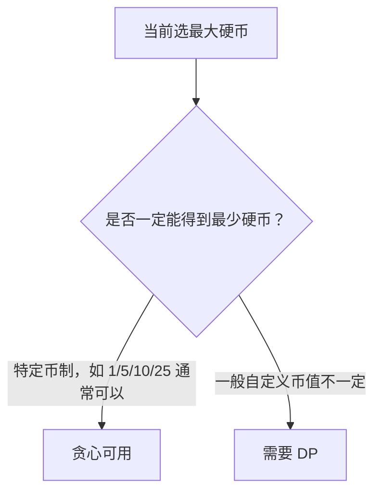

# 贪心算法讲透：为什么每一步选眼前最优有时真的对

贪心算法听起来很简单：

> 每一步都选当前看起来最好的选择。

但是它真正难的地方在于：

> 为什么当前最优，最后就一定全局最优？

如果这个问题回答不了，贪心就只是猜。

---

## 1. 贪心不是“贪”，是“不可后悔的正确选择”

很多人学贪心会误解成：

```text
看到最大的就拿
看到最小的就选
能多拿就多拿
能少花就少花
```

这些都只是表象。

真正的贪心是：

```text
我现在做出一个局部最优选择，并且我能证明这个选择不会破坏全局最优解。
```

也就是说，贪心最关键的不是代码，而是证明。

---

## 2. 一个简单例子：找零钱

如果硬币面额是：

```text
[1, 5, 10, 25]
```

要凑 `63`，我们通常会这样拿：

```text
25 + 25 + 10 + 1 + 1 + 1
```

这就是贪心：每次拿不超过剩余金额的最大硬币。

但这只是某些币制下正确。

如果硬币面额是：

```text
[1, 3, 4]
```

凑 `6`：

```text
贪心：4 + 1 + 1 = 3 枚
最优：3 + 3 = 2 枚
```

所以，贪心不能凭感觉。



---

## 3. 贪心适合什么问题？

贪心问题通常有两个特征：

| 特征 | 含义 |
|---|---|
| 贪心选择性质 | 当前局部最优选择，可以出现在某个全局最优解中 |
| 最优子结构 | 做完当前选择后，剩下的问题还是同类问题 |

这两个词听起来抽象，我们用例子说。

---

## 4. 例子一：区间选择问题

题意：有很多会议，每个会议有开始时间和结束时间，同一时间只能参加一个会议，问最多能参加多少个。

例如：

| 会议 | 开始 | 结束 |
|---|---:|---:|
| A | 1 | 3 |
| B | 2 | 4 |
| C | 3 | 5 |
| D | 0 | 6 |
| E | 5 | 7 |
| F | 8 | 9 |
| G | 5 | 9 |

### 4.1 直觉

如果想参加更多会议，应该优先选择结束最早的会议。

为什么？

因为结束越早，留给后面的时间越多。

### 4.2 贪心策略

```text
按结束时间从小到大排序
每次选择和上一个会议不冲突的最早结束会议
```

### 4.3 图示

```mermaid
gantt
  title 会议区间示意
  dateFormat  X
  axisFormat %s
  section 会议
  A : 1, 2
  B : 2, 2
  C : 3, 2
  D : 0, 6
  E : 5, 2
  F : 8, 1
  G : 5, 4
```



选择过程：

```text
选 A，结束时间 3
跳过 B，因为 B 与 A 冲突
选 C，结束时间 5
选 E，结束时间 7
选 F，结束时间 9
```

结果：

```text
A, C, E, F
```

### 4.4 代码

```java
int maxMeetings(int[][] intervals) {
    Arrays.sort(intervals, (a, b) -> a[1] - b[1]);

    int count = 0;
    int end = Integer.MIN_VALUE;

    for (int[] interval : intervals) {
        int start = interval[0];
        int finish = interval[1];

        if (start >= end) {
            count++;
            end = finish;
        }
    }

    return count;
}
```

### 4.5 为什么按结束时间，而不是按开始时间？

按开始时间可能先选一个很长的会议，挡住后面很多会议。

例如：

```text
[0, 100]
[1, 2]
[2, 3]
[3, 4]
```

按开始时间会选 `[0,100]`，只能参加 1 个。

按结束时间会选：

```text
[1,2], [2,3], [3,4]
```

能参加 3 个。

---

## 5. 贪心正确性的常用证明：交换论证

贪心题最常见的证明方法叫：交换论证。

它的逻辑是：

```text
假设有一个最优解，它第一步没有选贪心选择。
我证明可以把它的第一步换成贪心选择，答案不会变差。
所以一定存在一个包含贪心选择的最优解。
```

以会议问题为例：

```text
贪心选的是结束最早的会议 G。
某个最优解第一场选了会议 X。
因为 G 的结束时间 <= X 的结束时间，
把 X 换成 G 后，后面的会议不会更难安排，只会更容易安排。
所以换完仍然是最优解。
```

这就说明：

```text
第一步选结束最早的会议是安全的。
```

然后剩下的区间继续同样处理。

---

## 6. 例子二：跳跃游戏

题意：给一个数组，`nums[i]` 表示在位置 `i` 最多能跳多远，问能不能到最后一个位置。

例如：

```text
nums = [2, 3, 1, 1, 4]
```

从位置 0 最多跳到 2。

### 6.1 贪心思路

不用真的枚举每一种跳法，只需要维护：

```text
当前能到达的最远位置 farthest
```

遍历数组，如果当前位置 `i` 已经超过 `farthest`，说明到不了。

否则更新：

```text
farthest = max(farthest, i + nums[i])
```

### 6.2 代码

```java
boolean canJump(int[] nums) {
    int farthest = 0;

    for (int i = 0; i < nums.length; i++) {
        if (i > farthest) {
            return false;
        }

        farthest = Math.max(farthest, i + nums[i]);
    }

    return true;
}
```

### 6.3 为什么这是贪心？

因为我们每一步都只关心：

```text
在目前所有能到达的位置里，能把右边界扩展到多远。
```

不关心具体路径。


这类题的关键是：只要能到达某个区间 `[0, farthest]`，区间里的点都可以被扫描并贡献更远的可达范围。

---

## 7. 例子三：加油站

题意：有一圈加油站，`gas[i]` 是第 `i` 个站能加的油，`cost[i]` 是从 `i` 到下一个站消耗的油，问从哪个站出发可以绕一圈。

### 7.1 关键结论

如果总油量小于总消耗：

```text
sum(gas) < sum(cost)
```

一定不可能绕一圈。

如果总油量大于等于总消耗，一定存在一个起点。

### 7.2 贪心思路

从某个起点出发，如果走到 `i` 时油量变成负数，说明：

```text
从这个起点到 i 之间的任何一个站出发，都不可能到达 i + 1
```

所以直接把起点改成：

```text
i + 1
```

### 7.3 代码

```java
int canCompleteCircuit(int[] gas, int[] cost) {
    int total = 0;
    int tank = 0;
    int start = 0;

    for (int i = 0; i < gas.length; i++) {
        int diff = gas[i] - cost[i];
        total += diff;
        tank += diff;

        if (tank < 0) {
            start = i + 1;
            tank = 0;
        }
    }

    return total >= 0 ? start : -1;
}
```

### 7.4 为什么能跳过中间所有点？

假设从 `start` 出发，到 `i` 失败了。

中间任意一个点 `k`，它能到达 `i` 的油量只会更少，因为它少吃了前面 `start -> k` 这段积累。

所以 `start` 到 `i` 之间的点都不用试。

这就是贪心里的“安全跳过”。

---

## 8. 例子四：分发饼干

题意：每个孩子有胃口 `g[i]`，每块饼干有大小 `s[j]`。一块饼干最多给一个孩子，满足 `s[j] >= g[i]` 才算满足，问最多满足几个孩子。

### 8.1 贪心策略

```text
先满足胃口最小的孩子
用能满足他的最小饼干
```

为什么？

因为大饼干更稀缺，应该留给胃口更大的孩子。

### 8.2 代码

```java
int findContentChildren(int[] g, int[] s) {
    Arrays.sort(g);
    Arrays.sort(s);

    int i = 0;
    int j = 0;
    int count = 0;

    while (i < g.length && j < s.length) {
        if (s[j] >= g[i]) {
            count++;
            i++;
            j++;
        } else {
            j++;
        }
    }

    return count;
}
```

---

## 9. 例子五：买卖股票 II

题意：每天一个股票价格，可以多次买卖，但同一时间只能持有一股，问最大利润。

例如：

```text
prices = [7, 1, 5, 3, 6, 4]
```

### 9.1 贪心思路

只要明天比今天贵，就今天买明天卖，吃掉每一段上涨。

```text
1 -> 5 赚 4
3 -> 6 赚 3
总共 7
```

### 9.2 代码

```java
int maxProfit(int[] prices) {
    int profit = 0;

    for (int i = 1; i < prices.length; i++) {
        if (prices[i] > prices[i - 1]) {
            profit += prices[i] - prices[i - 1];
        }
    }

    return profit;
}
```

### 9.3 为什么这样对？

一段连续上涨：

```text
1 -> 3 -> 5 -> 8
```

一次性从 1 买到 8：

```text
8 - 1 = 7
```

每天拆开赚：

```text
(3 - 1) + (5 - 3) + (8 - 5) = 7
```

结果一样。

所以把所有正收益加起来即可。

---

## 10. 贪心的常见套路

| 套路 | 常见题型 | 常见策略 |
|---|---|---|
| 排序后选择 | 区间、会议、饼干 | 按结束时间、大小、差值排序 |
| 维护最远边界 | 跳跃、覆盖区间 | 不断扩展能覆盖的最远位置 |
| 局部收益累加 | 股票、差分 | 只吃正收益 |
| 优先队列 | 合并、调度、最小代价 | 每次取最小或最大 |
| 双指针 | 匹配、分配 | 小的先满足小的 |

---

## 11. 贪心最容易错在哪里？

### 错误一：只看局部最大

比如 0/1 背包，如果总是选价值最高的物品，可能错。

```text
容量 10
物品 A：重量 10，价值 60
物品 B：重量 5，价值 50
物品 C：重量 5，价值 50
```

贪心选 A，价值 60。

最优是 B + C，价值 100。

### 错误二：只看性价比

0/1 背包里，按价值/重量选也可能错。

性价比适合“可以切开”的分数背包，不适合“只能拿或不拿”的 0/1 背包。

### 错误三：不能证明就硬贪

如果你说不清楚：

```text
为什么这一步一定不会影响后续最优？
```

那就要警惕。

---

## 12. 贪心的证明常见方法

| 方法 | 怎么理解 | 适合场景 |
|---|---|---|
| 交换论证 | 把最优解中的某一步换成贪心选择，不变差 | 区间调度、排序选择 |
| 反证法 | 假设贪心不对，推出矛盾 | 跳跃、加油站 |
| 单调边界 | 当前维护一个最远、最小或最大边界 | 覆盖、跳跃 |
| 分解收益 | 总收益可以拆成局部收益之和 | 股票 II |

实际刷题时，不一定要写完整证明，但脑子里要有这个判断。

---

## 13. 一句话总结贪心

贪心不是简单地“每一步选最大/最小”，而是：

```text
每一步做一个可以被证明安全的局部最优选择，并且这个选择不会破坏全局最优。
```

如果你能证明这个选择安全，贪心通常很简洁。

如果证明不了，尤其是当前选择会影响后续复杂组合，那大概率要动态规划或搜索。
