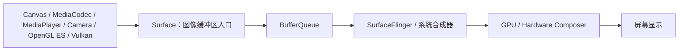
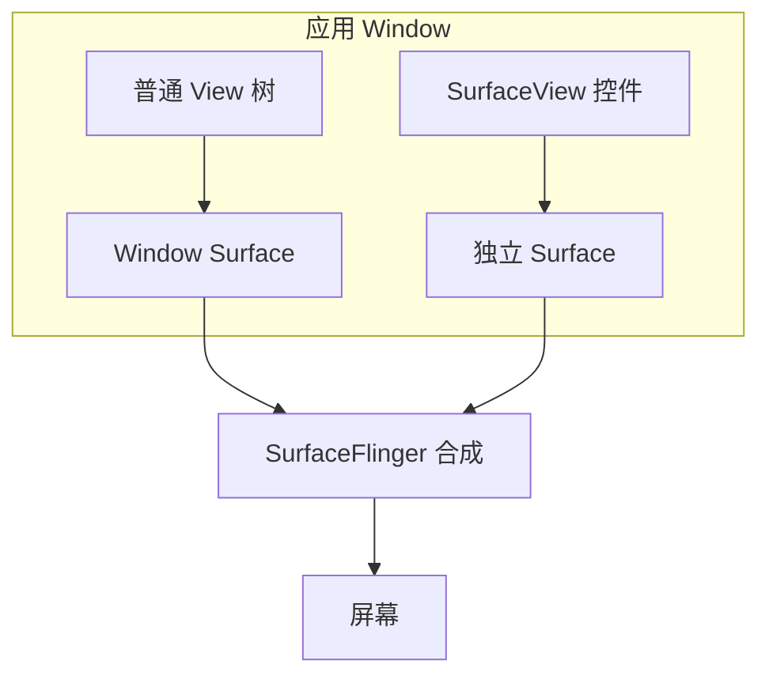
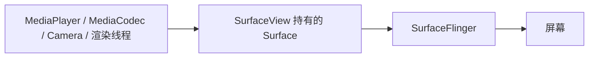
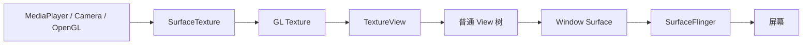
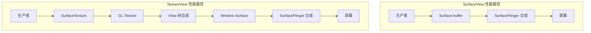

# SurfaceView 和 TextureView 使用

> 本文由内部知识库文档整理为 GitHub 可直接阅读的 Markdown。已移除原始内部链接、附件直链、账号标识、组织域名等公司相关信息。
> 图片会引用 `image/`，附件会引用 `file/`；本篇未导出独立图片/附件，原文只读绘图块已按上下文重绘为 Mermaid 流程图，便于 GitHub 展示。

Android 里做视频播放、相机预览、地图、游戏、OpenGL、直播推流时，经常会遇到两个 View：

```java
SurfaceView
TextureView
```

它们都可以显示“高频刷新画面”，但底层机制和适用场景完全不同。

一句话总结：

> *SurfaceView 更接近独立窗口/独立 Surface，性能更好，适合视频、相机、游戏等高性能渲染；TextureView 是普通 View 树中的一个纹理，灵活性更好，适合需要动画、变换、圆角、透明、截图、和普通 UI 混排的场景。*

## 1、简介

### 1.1 SurfaceView

特点：

```java
性能好
独立 Surface
可由独立线程绘制
适合高频渲染
和普通 View 不完全在同一个绘制层级
动画、透明、裁剪、圆角支持差一些
```

典型场景：

```java
视频播放器
相机预览
OpenGL 渲染
游戏画面
直播预览
地图 SDK
高性能图像渲染
```

### 1.2 TextureView

特点：

```java
属于普通 View 树
支持平移、缩放、旋转、透明、动画、圆角裁剪
可以 getBitmap 截图
灵活性强
性能通常比 SurfaceView 差
必须在硬件加速窗口中使用
```

典型场景：

```java
短视频 Feed 小窗播放
视频需要圆角/缩放/旋转/动画
相机预览需要和 UI 深度混排
视频作为普通 View 做转场动画
需要截图当前帧
需要 View 层级遮罩、裁剪、透明效果
```

## 2、核心区别表


| 维度 | SurfaceView | TextureView |
| --- | --- | --- |
| 本质 | 独立 Surface | View 树中的纹理 |
| 是否参与普通 View 绘制 | 不完全参与 | 完全参与 |
| 性能 | 通常更好 | 通常略差 |
| 延迟 | 通常更低 | 可能略高 |
| 适合高频渲染 | 很适合 | 可以，但成本更高 |
| 支持 View 动画 | 较差/受限 | 很好 |
| 支持 alpha 透明 | 较差/特殊处理 | 支持 |
| 支持 rotation/scale | 受限 | 支持 |
| 支持圆角裁剪 | 麻烦 | 容易 |
| 支持截图 getBitmap | 不方便 | 支持 |
| 是否可在独立线程绘制 | 可以 | 通常也可以，但机制不同 |
| 典型消费者 | Camera、MediaPlayer、ExoPlayer、OpenGL | Camera、MediaPlayer、ExoPlayer、普通 UI 动画场景 |
| 生命周期 | SurfaceHolder.Callback | SurfaceTextureListener |
| 底层对象 | Surface | SurfaceTexture + Surface |
| Z 轴层级 | 历史上容易有层级问题 | 和普通 View 一致 |
| 架构定位 | 高性能显示面 | UI 友好显示面 |


## 3、它们到底是什么？

### 3.1 Surface 是什么？

Android 图形系统里，很多东西最终都要画到一个 Surface 上。

可以把 Surface 理解成：

> *一个可以被生产者写入图像缓冲区、再交给系统合成显示的画布入口。*

生产者可以是：

```java
Canvas
MediaCodec
MediaPlayer
Camera
OpenGL ES
Vulkan
自定义 native 渲染线程
```

消费者通常是：

```java
SurfaceFlinger
系统合成器
GPU
Hardware Composer
```

简化模型：





## 4、SurfaceView 原理

### 4.1 SurfaceView 的本质

SurfaceView 是一个普通 View，但它内部会创建一个独立的 Surface。

它和普通 View 不一样：

```java
普通 View：由 ViewRootImpl 统一绘制到窗口 Surface 上
SurfaceView：自己单独拥有一个 Surface，由系统单独合成
```

图：





普通 View 的绘制路径：

```java
View.draw()
Canvas
Window Surface
SurfaceFlinger
屏幕
```

SurfaceView 的绘制路径：

```java
渲染线程 / Camera / MediaCodec
SurfaceView 持有的 Surface
SurfaceFlinger
屏幕
```

### 4.2 SurfaceView 为什么性能好？

因为它可以绕过普通 View 树的复杂绘制流程。

普通 View 每一帧可能涉及：

```java
measure
layout
draw
display list
GPU 合成
```

而 SurfaceView 的内容可以由独立生产者直接写入 Surface：

```java
Camera 直接输出到 Surface
MediaCodec 直接解码到 Surface
OpenGL 直接渲染到 Surface
```

这样减少了中间拷贝，也降低了 UI 线程压力。

例如视频播放：





这个路径非常适合视频播放。

### 4.3 SurfaceView 的缺点

因为它有独立 Surface，所以它不是完全在普通 View 树里面绘制。

历史上 SurfaceView 有这些问题：

```java
Z 轴层级不灵活
不能很好地和普通 View 做透明混合
动画支持弱
clipToOutline / 圆角裁剪麻烦
截图困难
切换页面可能黑屏/闪烁
Surface 创建销毁有独立生命周期
```

现在新版本 Android 对 SurfaceView 做了很多改进，比如同步位置、层级等，但它的架构本质还是独立 Surface。

## 5、TextureView 原理

### 5.1 TextureView 的本质

TextureView 是普通 View 树的一部分，它内部使用 SurfaceTexture 接收图像，然后把这张纹理绘制到当前 View 所在的窗口里。

可以理解成：

> *TextureView 把外部渲染结果变成一张 GPU 纹理，再像普通 View 一样参与 View 树绘制和合成。*

图：





### 5.2 TextureView 为什么灵活？

因为它是普通 View。

所以你可以对它做：

```java
textureView.setAlpha(0.5f);
textureView.setRotation(30f);
textureView.setScaleX(0.8f);
textureView.setScaleY(0.8f);
textureView.animate().translationY(100).start();
```

也可以：

```java
Bitmap bitmap = textureView.getBitmap();
```

还可以配合：

```java
圆角
裁剪
动画
转场
ViewPager/RecyclerView
CoordinatorLayout
MotionLayout
```

这些 SurfaceView 做起来就比较麻烦。

### 5.3 TextureView 为什么性能差一些？

因为它多了一层纹理采样和 View 树合成。

SurfaceView：

```java
生产者 -> Surface -> SurfaceFlinger
```

TextureView：

```java
生产者 -> SurfaceTexture -> TextureView 纹理 -> View 树 -> Window Surface -> SurfaceFlinger
```

这通常意味着：

```java
多一次 GPU 纹理处理
更多内存带宽
和 UI 线程/RenderThread 更相关
高频刷新时更容易影响 UI 性能
```

所以如果只是全屏视频、相机预览、游戏画面，一般 SurfaceView 更合适。

## 6、使用方式

## 6.1 SurfaceView 使用方式

### XML

```java
<SurfaceView
    android:id="@+id/surfaceView"
    android:layout_width="match_parent"
    android:layout_height="match_parent" />
```

### Java / Kotlin 监听 Surface 生命周期

```java
SurfaceView surfaceView = findViewById(R.id.surfaceView);
SurfaceHolder holder = surfaceView.getHolder();

holder.addCallback(new SurfaceHolder.Callback() {
    @Override
    public void surfaceCreated(@NonNull SurfaceHolder holder) {
        Surface surface = holder.getSurface();
        // Surface 可用，可以开始渲染、播放视频、打开相机预览
    }

    @Override
    public void surfaceChanged(
            @NonNull SurfaceHolder holder,
            int format,
            int width,
            int height
    ) {
        // Surface 尺寸或格式变化
    }

    @Override
    public void surfaceDestroyed(@NonNull SurfaceHolder holder) {
        // Surface 销毁，停止渲染、释放播放器/相机引用
    }
});
```

### Canvas 绘制示例

```java
SurfaceHolder holder = surfaceView.getHolder();

new Thread(() -> {
    Canvas canvas = null;
    try {
        canvas = holder.lockCanvas();
        if (canvas != null) {
            canvas.drawColor(Color.BLACK);

            Paint paint = new Paint(Paint.ANTI_ALIAS_FLAG);
            paint.setColor(Color.RED);
            paint.setTextSize(48);
            canvas.drawText("Hello SurfaceView", 100, 100, paint);
        }
    } finally {
        if (canvas != null) {
            holder.unlockCanvasAndPost(canvas);
        }
    }
}).start();
```

### MediaPlayer 使用 SurfaceView

```java
MediaPlayer mediaPlayer = new MediaPlayer();

surfaceView.getHolder().addCallback(new SurfaceHolder.Callback() {
    @Override
    public void surfaceCreated(@NonNull SurfaceHolder holder) {
        try {
            mediaPlayer.setDataSource(videoPath);
            mediaPlayer.setSurface(holder.getSurface());
            mediaPlayer.prepareAsync();
            mediaPlayer.setOnPreparedListener(MediaPlayer::start);
        } catch (IOException e) {
            e.printStackTrace();
        }
    }

    @Override
    public void surfaceChanged(@NonNull SurfaceHolder holder, int format, int width, int height) {
    }

    @Override
    public void surfaceDestroyed(@NonNull SurfaceHolder holder) {
        mediaPlayer.release();
    }
});
```

## 6.2 TextureView 使用方式

### XML

```java
<TextureView
    android:id="@+id/textureView"
    android:layout_width="match_parent"
    android:layout_height="match_parent" />
```

### 监听 SurfaceTexture 生命周期

```java
TextureView textureView = findViewById(R.id.textureView);

textureView.setSurfaceTextureListener(new TextureView.SurfaceTextureListener() {
    @Override
    public void onSurfaceTextureAvailable(
            @NonNull SurfaceTexture surfaceTexture,
            int width,
            int height
    ) {
        Surface surface = new Surface(surfaceTexture);
        // 可以把这个 surface 给 MediaPlayer / Camera / MediaCodec
    }

    @Override
    public void onSurfaceTextureSizeChanged(
            @NonNull SurfaceTexture surface,
            int width,
            int height
    ) {
        // 尺寸变化
    }

    @Override
    public boolean onSurfaceTextureDestroyed(@NonNull SurfaceTexture surface) {
        // 返回 true 表示系统释放 SurfaceTexture
        // 返回 false 表示你自己负责释放
        return true;
    }

    @Override
    public void onSurfaceTextureUpdated(@NonNull SurfaceTexture surface) {
        // 每次有新帧更新时回调
    }
});
```

### MediaPlayer 使用 TextureView

```java
MediaPlayer mediaPlayer = new MediaPlayer();

textureView.setSurfaceTextureListener(new TextureView.SurfaceTextureListener() {
    @Override
    public void onSurfaceTextureAvailable(
            @NonNull SurfaceTexture surfaceTexture,
            int width,
            int height
    ) {
        try {
            Surface surface = new Surface(surfaceTexture);
            mediaPlayer.setDataSource(videoPath);
            mediaPlayer.setSurface(surface);
            mediaPlayer.prepareAsync();
            mediaPlayer.setOnPreparedListener(MediaPlayer::start);
        } catch (IOException e) {
            e.printStackTrace();
        }
    }

    @Override
    public void onSurfaceTextureSizeChanged(
            @NonNull SurfaceTexture surface,
            int width,
            int height
    ) {
    }

    @Override
    public boolean onSurfaceTextureDestroyed(@NonNull SurfaceTexture surface) {
        mediaPlayer.release();
        return true;
    }

    @Override
    public void onSurfaceTextureUpdated(@NonNull SurfaceTexture surface) {
    }
});
```

### TextureView 做动画

```java
textureView.animate()
        .alpha(0.5f)
        .rotation(15f)
        .scaleX(0.8f)
        .scaleY(0.8f)
        .setDuration(300)
        .start();
```

### TextureView 截图

```java
Bitmap bitmap = textureView.getBitmap();
```

这个是 TextureView 很重要的优势。

## 7、选择 SurfaceView 还是 TextureView？

### 7.1 优先选择 SurfaceView 的场景

#### 1、全屏视频播放

比如：

```java
播放器详情页
横屏全屏播放
长视频播放
电视端播放
车机视频流
```

推荐：

```java
SurfaceView
```

原因：

```java
性能好
功耗低
路径短
适合硬解码直出
```

#### 2、相机全屏预览

比如：

```java
扫码
拍照
行车记录仪
全屏相机
工业设备实时预览
```

推荐：

```java
SurfaceView
```

尤其是预览没有复杂动画时。

#### 3、游戏 / OpenGL / 高频渲染

比如：

```java
小游戏
地图
3D 视图
实时轨迹
OpenGL 画面
```

推荐：

```java
SurfaceView 或 GLSurfaceView
```

原因：

```java
独立渲染线程
低延迟
高性能
```

#### 4、低功耗要求高

比如：

```java
长时间视频播放
监控画面
直播观看
机器人/割草机/设备持续预览
```

SurfaceView 通常更省资源。

### 7.2 优先选择 TextureView 的场景

#### 1、视频需要圆角

例如：

```java
首页视频卡片
短视频列表
直播小窗
聊天视频消息
```

推荐：

```java
TextureView
```

SurfaceView 做圆角裁剪比较麻烦。

#### 2、视频需要和普通 UI 做动画

例如：

```java
小窗到全屏转场
列表 item 共享元素动画
拖拽缩放播放器
悬浮窗动画
```

推荐：

```java
TextureView
```

#### 3、需要透明、旋转、缩放

```java
textureView.setAlpha(0.8f);
textureView.setRotation(90f);
textureView.setScaleX(0.5f);
```

TextureView 更自然。

#### 4、需要截图当前画面

```java
Bitmap frame = textureView.getBitmap();
```

推荐 TextureView。

#### 5、RecyclerView 中的视频 item

如果每个 item 有小视频预览，TextureView 通常更方便。

但是注意性能：

```java
不要同时播放太多 TextureView
注意复用和释放
注意滑动掉帧
```

## 8、SurfaceView 的生命周期

SurfaceView 的生命周期不等同于 Activity 生命周期。

核心回调：

```java
surfaceCreated()
surfaceChanged()
surfaceDestroyed()
```

常见问题：

```java
Activity onResume 了，但 Surface 还没 created
Activity onPause 了，Surface 可能随后 destroyed
View detach 时 Surface 可能销毁
横竖屏切换 Surface 会重建
```

正确做法是把播放器/相机状态和 Surface 状态分开管理。

推荐状态：

```java
业务可见状态
播放器状态
Surface 是否可用
生命周期状态
```

伪代码：

```java
if (isStarted && surfaceAvailable && playerReady) {
    player.setSurface(surface);
    player.play();
}
```

## 9、TextureView 的生命周期

TextureView 主要监听：

```java
onSurfaceTextureAvailable
onSurfaceTextureSizeChanged
onSurfaceTextureDestroyed
onSurfaceTextureUpdated
```

注意点：

```java
TextureView 必须 attach 到 window 后才有 SurfaceTexture
View detach 后 SurfaceTexture 可能销毁
返回 true/false 决定是否由系统释放 SurfaceTexture
```

onSurfaceTextureDestroyed() 的返回值很重要：

```java
return true;
```

表示：

```java
系统释放 SurfaceTexture
```

```java
return false;
```

表示：

```java
你自己持有并负责 release
```

大多数普通场景返回 true。

## 10、和 MediaPlayer / ExoPlayer 的关系

无论 SurfaceView 还是 TextureView，播放器最终都需要一个：

```java
Surface
```

SurfaceView：

```java
Surface surface = surfaceView.getHolder().getSurface();
player.setSurface(surface);
```

TextureView：

```java
SurfaceTexture surfaceTexture = textureView.getSurfaceTexture();
Surface surface = new Surface(surfaceTexture);
player.setSurface(surface);
```

对播放器来说，它不太关心你是 SurfaceView 还是 TextureView。

它关心的是：

```java
有没有一个有效 Surface 可以输出解码帧
```

## 11、和 Camera 的关系

Camera2 预览也是往 Surface 输出。

SurfaceView：

```java
Surface previewSurface = surfaceView.getHolder().getSurface();
```

TextureView：

```java
SurfaceTexture texture = textureView.getSurfaceTexture();
texture.setDefaultBufferSize(previewWidth, previewHeight);
Surface previewSurface = new Surface(texture);
```

Camera2 创建 CaptureSession 时：

```java
cameraDevice.createCaptureSession(
    Arrays.asList(previewSurface),
    stateCallback,
    handler
);
```

## 12、和 OpenGL 的关系

### SurfaceView

OpenGL 可以直接绑定 Surface：

```java
EGLSurface -> SurfaceView Surface
```

Android 也提供了：

```java
GLSurfaceView
```

它本质上是基于 SurfaceView 封装的 OpenGL 渲染 View。

适合：

```java
游戏
3D
地图
高性能 OpenGL 渲染
```

### TextureView

也可以配合 OpenGL，方式是：

```java
SurfaceTexture / TextureView
```

但通常复杂度更高，性能也可能差一点。

## 13、为什么 SurfaceView 可能黑屏/闪一下？

常见原因：

```java
Surface 销毁后播放器还在输出
Surface 还没创建就 setSurface
页面切换时 Surface 重建
播放器和 Surface 生命周期没对齐
Z-order 或透明区域问题
首帧还没到
```

解决思路：

```java
等待 surfaceCreated 再绑定播放器
surfaceDestroyed 里解绑或暂停输出
播放器状态和 Surface 状态解耦
首帧回调后再隐藏 loading
避免频繁 remove/add SurfaceView
```

## 14、为什么 TextureView 可能卡顿？

常见原因：

```java
视频帧作为纹理参与 View 合成
RecyclerView 中太多 TextureView 同时刷新
UI 线程繁忙
RenderThread/GPU 压力大
透明/圆角/阴影/复杂动画叠加
高分辨率视频纹理采样成本高
```

优化思路：

```java
同屏少量 TextureView
列表滑动时暂停非可见视频
降低预览分辨率
避免复杂 alpha/clip/shadow
使用 SurfaceView 承担全屏播放
```

## 15、Z-order 和覆盖问题

### 15.1 SurfaceView 的 Z-order

SurfaceView 过去经常出现：

```java
普通 View 盖不住 SurfaceView
SurfaceView 总在最上层
SurfaceView 透明区域异常
```

可以用：

```java
surfaceView.setZOrderOnTop(true);
surfaceView.setZOrderMediaOverlay(true);
```

但这些 API 要谨慎用，因为它们会影响层级。

现代 Android 对 SurfaceView 层级做了优化，但仍建议：

```java
需要复杂 UI 混排时优先 TextureView
需要纯高性能显示时优先 SurfaceView
```

### 15.2 TextureView 的 Z-order

TextureView 是普通 View，所以：

```java
谁在上面
谁在下面
alpha
translationZ
elevation
clip
```

都更符合普通 View 预期。

## 16、截图能力差异

### TextureView

```java
Bitmap bitmap = textureView.getBitmap();
```

简单直接。

### SurfaceView

普通 View.draw() 截图通常截不到 SurfaceView 内容，因为它不在普通 View 绘制树里。

可以考虑：

```java
PixelCopy
播放器截图接口
相机当前帧回调
OpenGL glReadPixels
```

Android 8.0 之后可以用 PixelCopy 从 Surface 拷贝像素：

```java
PixelCopy.request(surfaceView, bitmap, copyResult -> {
    if (copyResult == PixelCopy.SUCCESS) {
        // bitmap 可用
    }
}, handler);
```

## 17、内存和性能模型

### SurfaceView

```java
生产者直接写 Surface buffer
SurfaceFlinger 合成
少一次作为普通 View 纹理采样
UI 线程压力小
```

### TextureView

```java
生产者写 SurfaceTexture
SurfaceTexture 更新成 GL texture
TextureView 参与 View 合成
可能增加 GPU 内存带宽和合成成本
```

简化性能路径：



